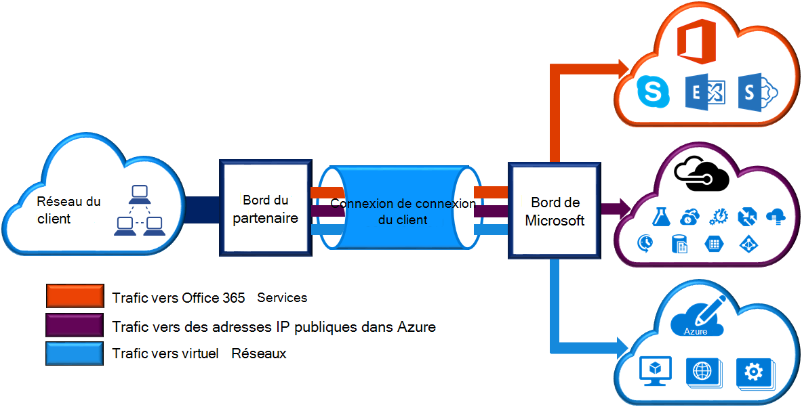
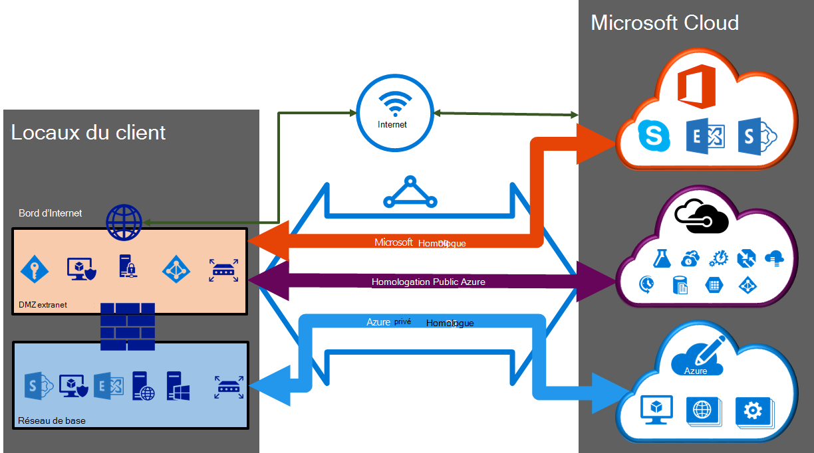

<properties 
   pageTitle="ExpressRoute circuits et des domaines de routage | Microsoft Azure"
   description="Cette page fournit une vue d’ensemble de circuits de ExpressRoute et les domaines de routage."
   documentationCenter="na"
   services="expressroute"
   authors="cherylmc"
   manager="carmonm"
   editor=""/>
<tags 
   ms.service="expressroute"
   ms.devlang="na"
   ms.topic="article" 
   ms.tgt_pltfrm="na"
   ms.workload="infrastructure-services" 
   ms.date="10/10/2016"
   ms.author="cherylmc"/>

# Circuits de ExpressRoute et de domaines de routage

 Vous devez commander un *circuit de ExpressRoute* se connecter votre infrastructure sur site à Microsoft via un fournisseur de connectivité. L’illustration suivante fournit une représentation logique de la connectivité entre votre réseau étendu et de Microsoft.

## Circuits de ExpressRoute

Un *circuit de ExpressRoute* représente une connexion logique entre votre infrastructure sur site et les services de cloud de Microsoft via un fournisseur de connectivité. Vous pouvez commander plusieurs circuits ExpressRoute. Chaque circuit peut être dans les régions identiques ou différentes et peut être connecté à leurs locaux via des fournisseurs de connexion différent. 

Circuits de ExpressRoute ne correspondent pas à toutes les entités physiques. Un circuit est identifié de manière unique par une norme appelée de GUID sous la forme d’une clé de service (s-clé). La clé du service est la seule partie des informations échangées entre Microsoft et vous le fournisseur de connectivité. La s-clé n’est pas un secret pour des raisons de sécurité. Il existe un mappage 1:1 entre un circuit de ExpressRoute et de la s-clé.

Un circuit de ExpressRoute peut avoir jusqu'à trois peerings indépendants : Azure public, Azure privé et Microsoft. Chaque homologation est une paire de BGP indépendant sessions de leur configuration redondante pour une haute disponibilité. Il y a un 1 : n (1 < = N < = 3) mappage entre un circuit de ExpressRoute et de domaines de routage. Un circuit de ExpressRoute peut avoir l’une, deux ou tous les trois peerings activés par circuit de ExpressRoute.
 
Chaque circuit a une bande passante fixe (50 Mbits/s, 100 Mbits/s, 200 Mbits/s, 500 Mbps, 1 Gbit/s, 10 Gbits/s) et est mappé à un fournisseur de connectivité et d’un emplacement d’homologation. La bande passante que vous sélectionnez est être partagées à travers tout les peerings pour le circuit. 

### Les quotas, les limites et restrictions

Limites et quotas par défaut s’appliquent pour chaque circuit de ExpressRoute. Reportez-vous à la page [d’abonnement Azure et les limites de Service, les Quotas et les contraintes](../azure-subscription-service-limits.md) pour obtenir des informations sur les quotas.

## Domaines de routage ExpressRoute

Un circuit de ExpressRoute a plusieurs domaines de routage associés : Azure public, Azure privé et Microsoft. Chacun des domaines de routage est configuré à l’identique sur les deux routeurs (actif ou de partage de charge configuration) pour une haute disponibilité. Services Azure sont classés comme *Azure public* et *privés d’Azure* pour représenter le schémas d’adressage IP.

### Homologation privé

Azure compute de services, à savoir les ordinateurs virtuels (IaaS) et les services en nuage (PaaS), qui sont déployés au sein d’un réseau virtuel peuvent être connectés par le biais du domaine privé de l’homologation. Le domaine privé de l’homologation est considérée comme une extension de confiance de votre réseau principal dans Microsoft Azure. Vous pouvez configurer une connectivité bidirectionnelle entre votre réseau de base et les réseaux virtuels Azure (VNets). Cette homologation permet de se connecter aux machines virtuelles et services directement sur les adresses IP privées en nuage.  

Vous pouvez vous connecter à plusieurs réseaux virtuel au domaine privé homologation. Passez en revue la [page du Forum aux questions](expressroute-faqs.md) pour plus d’informations sur les limites et restrictions. Vous pouvez visiter la page [d’abonnement Azure et les limites de Service, les Quotas et les contraintes](../azure-subscription-service-limits.md) pour obtenir des informations sur les limites.  Reportez-vous à la page de [routage](expressroute-routing.md) pour plus d’informations sur la configuration du routage.

### Homologation public

Services de stockage Azure, les bases de données SQL et les sites Web sont proposés sur des adresses IP publiques. Vous pouvez connecter à titre privé à des services hébergés sur des adresses IP publiques, y compris les adresses VIP de vos services de cloud, dans le domaine de routage homologation public. Vous pouvez connecter le domaine homologation public à votre zone DMZ et de se connecter à tous les services Azure sur les adresses IP publiques à partir de votre réseau étendu sans avoir à se connecter via internet. 

Connectivité est toujours lancée à partir de votre réseau étendu aux services de Microsoft Azure. Les services Microsoft Azure ne sera pas en mesure d’établir des connexions à votre réseau par le biais de ce domaine de routage. Une fois que l’homologation public est activé, vous serez en mesure de se connecter à tous les services Azure. Nous ne vous permettent pas de sélectivement choisir pour lequel nous annoncer les itinéraires vers les services. Vous pouvez consulter la liste des préfixes de que nous annoncer à vous par le biais de cette homologation sur la page de [Plages IP de Microsoft Azure Datacenter](http://www.microsoft.com/download/details.aspx?id=41653) . La page est mis à jour chaque semaine.

Vous pouvez définir des filtres d’itinéraires personnalisés au sein de votre réseau d’utiliser uniquement les itinéraires dont vous avez besoin. Reportez-vous à la page de [routage](expressroute-routing.md) pour plus d’informations sur la configuration du routage. Vous pouvez définir des filtres d’itinéraires personnalisés au sein de votre réseau d’utiliser uniquement les itinéraires dont vous avez besoin. 

Consultez la [page du Forum aux questions](expressroute-faqs.md) pour plus d’informations sur les services pris en charge par le domaine de routage homologation public. 
 
### Homologation de Microsoft

[AZURE.INCLUDE [expressroute-office365-include](../../includes/expressroute-office365-include.md)]

Connectivité à toutes les autres Microsoft online services (comme les services Office 365) se fera via l’homologation de Microsoft. Nous permettent une connectivité bidirectionnelle entre vos services de cloud étendu et Microsoft dans le domaine de routage homologation Microsoft. Vous devez vous connecter aux services de cloud de Microsoft sur les adresses IP publiques qui sont détenus par vous ou par votre fournisseur de connectivité uniquement et que vous devez respecter toutes les règles définies. Consultez la page [conditions préalables de ExpressRoute](expressroute-prerequisites.md) pour plus d’informations.

Consultez la [page du Forum aux questions](expressroute-faqs.md) pour plus d’informations sur les services pris en charge, les coûts et les détails de configuration. Reportez-vous à la page [Emplacements de ExpressRoute](expressroute-locations.md) pour plus d’informations sur la liste des fournisseurs de connectivité offrant une homologation prise en charge de Microsoft.

## Comparaison de domaine routage

Le tableau ci-dessous compare les trois domaines de routage.

||**Homologation privé**|**Homologation public**|**Homologation de Microsoft**|
|---|---|---|---|
|**Max. préfixes # pris en charge par l’homologation**|4000 par défaut, 10 000 ExpressRoute Premium|200|200|
|**Plages d’adresses IP prises en charge**|Une adresse IPv4 valide au sein de votre réseau étendu.|Adresses IPv4 publiques appartenant à vous-même ou à votre fournisseur de connectivité.|Adresses IPv4 publiques appartenant à vous-même ou à votre fournisseur de connectivité.|
|**COMME les exigences de nombre**|Privée et publique sous forme de nombres. Vous devez posséder le public en tant que nombre, si vous choisissez d’utiliser un. | Privée et publique sous forme de nombres. Toutefois, vous devez prouver la propriété des adresses IP publiques.| Privée et publique sous forme de nombres. Toutefois, vous devez prouver la propriété des adresses IP publiques.|
|**Adresses IP de l’Interface de routage**|RFC1918 et public des adresses IP|Adresses IP publiques enregistrés pour vous dans les registres de routage.| Adresses IP publiques enregistrés pour vous dans les registres de routage.|
|**Prise en charge du hachage MD5**| Oui|Oui|Oui|

Vous pouvez choisir activer un ou plusieurs des domaines de routage dans le cadre de son circuit de ExpressRoute. Vous pouvez, si vous le souhaitez, que tous les domaines de routage placés sur le réseau privé virtuel même si vous souhaitez les combiner en un seul domaine de routage. Vous pouvez également les placer sur différents domaines de routage, similaires au diagramme. La configuration recommandée est que peering privé est connecté directement au réseau principal, et le public et les liens d’homologation Microsoft sont connectés à votre zone DMZ.
 
Si vous choisissez d’avoir tous les trois sessions d’homologation, vous devez disposer de trois paires de sessions BGP (une paire pour chaque type d’homologation). Les paires de session BGP fournissent un lien hautement disponible. Si vous vous connectez par l’intermédiaire de fournisseurs de couche 2 de connectivité, vous serez responsable de la configuration et la gestion du routage. Vous en savoir plus en consultant les [flux de travail](expressroute-workflows.md) pour la configuration ExpressRoute.

## Étapes suivantes

- Trouver un fournisseur de services. Consultez les [emplacements et les fournisseurs de services de ExpressRoute](expressroute-locations.md).
- Assurez-vous que toutes les conditions préalables sont remplies. Reportez-vous à la section [conditions préalables de ExpressRoute](expressroute-prerequisites.md).
- Configurez votre connexion ExpressRoute.
    - [Créer un circuit de ExpressRoute](expressroute-howto-circuit-classic.md)
    - [Configurer le routage (circuit peerings)](expressroute-howto-routing-classic.md)
    - [Lier un VNet d’un circuit de ExpressRoute](expressroute-howto-linkvnet-classic.md)
