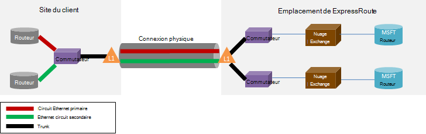

<properties
   pageTitle="ExpressRoute Forum aux questions"
   description="Le Forum aux questions ExpressRoute contient des informations sur la prise en charge des Services Azure, coût, données et connexions, SLA, fournisseurs et emplacements, la bande passante et des détails techniques supplémentaires."
   documentationCenter="na"
   services="expressroute"
   authors="cherylmc"
   manager="carmonm"
   editor=""/>
<tags
   ms.service="expressroute"
   ms.devlang="na"
   ms.topic="article" 
   ms.tgt_pltfrm="na"
   ms.workload="infrastructure-services"
   ms.date="10/10/2016"
   ms.author="cherylmc"/>

# ExpressRoute Forum aux questions

## Quel est ExpressRoute ?
ExpressRoute est un service Azure qui vous permet de créer des connexions entre les centres de données Microsoft et de l’infrastructure dans vos locaux ou dans une fonction de l’emplacement partagé. Connexions de ExpressRoute ne pas aller sur l’Internet public et offrent plus de sécurité, de fiabilité et de vitesses avec des latences plus faible que les connexions classiques sur Internet.

### Quels sont les avantages de l’utilisation de ExpressRoute et connexions de réseau privé ?
Connexions de ExpressRoute ne pas aller sur l’Internet public et offrent plus de sécurité, de fiabilité et de vitesses avec des latences inférieurs et cohérentes que les connexions classiques sur Internet. Dans certains cas, à l’aide de connexions de ExpressRoute pour transférer des données entre les périphériques et locaux Azure peut générer des économies significatives.

### Les services de cloud Microsoft sont pris en charge sur ExpressRoute ?
ExpressRoute prend en charge la plupart des services Microsoft Azure aujourd'hui, y compris d’Office 365.  Rechercher les mises à jour dès la disponibilité générale.

### Où est le service disponible ?
Consultez cette page pour l’emplacement du service et de disponibilité : [emplacements et les partenaires ExpressRoute](expressroute-locations.md).

### Comment puis-je utiliser les ExpressRoute pour vous connecter à Microsoft si je ne dispose de partenariats avec l’un des partenaires ExpressRoute-carrier ?
Vous pouvez sélectionner un opérateur régionaux et débarquer des connexions Ethernet à l’un de l’échange de prise en charge des emplacements fournisseur. Vous pouvez ensuite homologue avec Microsoft à l’emplacement du fournisseur. Consultez la dernière section des [emplacements et des partenaires de ExpressRoute](expressroute-locations.md) pour voir si votre fournisseur de services est présent dans aucun des emplacements exchange. Vous pouvez ensuite commander un circuit ExpressRoute via le fournisseur de service pour se connecter à Azure.

### Combien ExpressRoute coût ?
Vérifiez les [informations de tarification](https://azure.microsoft.com/pricing/details/expressroute/) pour les informations de tarification.

### Si je paie pour un circuit de ExpressRoute d’une bande passante donné, la connexion VPN qu'acheter de mon fournisseur de service de réseau doit être la même vitesse ?
N° Vous pouvez acheter une connexion VPN de n’importe quelle vitesse à partir de votre fournisseur de services. Toutefois, votre connexion sur Azure doit être limitée à la bande passante circuit ExpressRoute que vous achetez.

### Si je paie pour un circuit de ExpressRoute d’une bande passante donnée, avez la possibilité de rafales de vitesses supérieures si nécessaire ?
Oui. Circuits de ExpressRoute sont configurés pour prendre en charge le cas où vous pouvez en rafale jusqu'à deux fois la limite de la bande passante que vous obtenus sans coût supplémentaire. Vérifiez auprès de votre fournisseur de services si elles prennent en charge cette fonctionnalité.

### Puis-je utiliser la même connexion de réseau privé avec des réseaux virtuels et d’autres services Azure simultanément ?
Oui. Un circuit de ExpressRoute, une fois le programme d’installation vous permettra d’accéder simultanément aux services au sein d’un réseau virtuel et autres services Azure. Vous connectera à des réseaux virtuels sur le chemin d’accès d’homologation privé et d’autres services sur le chemin d’accès à l’homologation public.

### ExpressRoute offre un contrat de niveau de Service (SLA) ?
Reportez-vous à la [page du contrat SLA de ExpressRoute](https://azure.microsoft.com/support/legal/sla/) pour plus d’informations.

## Services pris en charge
Services Azure plus sont pris en charge sur ExpressRoute.

- La connectivité aux ordinateurs virtuels et des services en nuage déployés dans des réseaux virtuels sont pris en charge sur le chemin d’accès d’homologation privé.
- Sites Web Azure sont pris en charge sur le chemin d’accès à l’homologation public.
- IoT concentrateur est pris en charge sur le chemin d’accès à l’homologation public.
- Office 365 est pris en charge sur le chemin d’accès homologation Microsoft.
- Tous les autres services sont accessibles via le chemin d’accès à l’homologation public. Les exceptions sont les suivantes :

    **Les services suivants ne sont pas prises en charge :**

    - PAIE CANADA-FICHIER
    - Services de Visual Studio Team Test de charge
    - Plusieurs facteurs d’authentification
    - Traffic Manager

## Les connexions et les données

### Y a-t-il des limites sur la quantité de données que je peux utiliser ExpressRoute ?
Nous ne définissez pas une limite sur la quantité de transfert de données. Reportez-vous aux [informations de tarification](https://azure.microsoft.com/pricing/details/expressroute/) pour plus d’informations sur les taux de bande passante.

### Les vitesses de connexion sont pris en charge par ExpressRoute ?
Prise en charge de la bande passante des offres :

| 50 Mbits/s, 100 Mbits/s, 200 Mbits/s, 500 Mbit/s, 1 Gbit/s, 2 Gbits/s, 5 Gbit/s, 10 |

### Les fournisseurs de services sont disponibles ?
Consultez [des emplacements et des partenaires de ExpressRoute](expressroute-locations.md) pour la liste des fournisseurs de services et d’emplacements.

## Détails techniques

### Quelles sont les spécifications techniques de connexion mon emplacement local vers Azure ?
Consultez [page de ExpressRoute la configuration requise](expressroute-prerequisites.md) pour les besoins.

### Sont des connexions à ExpressRoute redondantes ?
Oui. Chaque circuit Express gamme a une paire de redondants entre les connexions configurées pour offrir une haute disponibilité.

### Seront perdues connectivité si un de mes liens ExpressRoute échoue ?
Vous ne perdrez pas de connectivité en cas de panne des connexions entre. Une connexion redondante est disponible pour prendre en charge de la charge de votre réseau. Vous pouvez en outre créer plusieurs circuits dans un autre emplacement d’homologation pour assurer la tolérance de panne.

### Si je ne suis pas situé au niveau d’un échange de nuage et mon fournisseur de services propose la connexion point à point, dois-je commander deux connexions physiques entre mon réseau de locaux et de Microsoft ? 
Non, vous devez uniquement une connexion physique si votre fournisseur de services peut établir deux circuits virtuels Ethernet via la connexion physique. La connexion physique (par exemple, une fibre optique) est arrêtée sur un calque 1 (L1) périphérique (voir image ci-dessous). Les deux circuits virtuels Ethernet sont balisés avec les ID de VLAN différents, un pour le circuit primaire et l’autre pour l’image secondaire. Les ID de VLAN sont dans le 802. 1 q externe en-tête Ethernet. Le 802. 1 q interne en-tête Ethernet (non affichée) est mappé à un [domaine de routage ExpressRoute](expressroute-circuit-peerings.md)de spécifique. 

### Puis-je prolonger un de mes réseaux locaux virtuels vers Azure à l’aide de ExpressRoute ?
N° Nous ne supportent pas les extensions de couche 2 de connectivité dans Azure.

### Puis-je avoir plus d’un circuit de ExpressRoute dans mon abonnement ?
Oui. Vous pouvez avoir plus d’un circuit de ExpressRoute dans votre abonnement. La limite par défaut du nombre de circuits dédiés est définie sur 10. Vous pouvez contacter le Support Microsoft pour augmenter la limite, si nécessaire.

### Puis-je avoir des circuits de ExpressRoute à partir de fournisseurs de services différents ?
Oui. Vous pouvez avoir des circuits de ExpressRoute avec nombreux fournisseurs de services. Chaque circuit ExpressRoute sera associé à un seul prestataire uniquement.

### Comment connecter les réseaux virtuels pour un circuit de ExpressRoute
Les étapes de base sont décrites ci-dessous.

- Vous devez établir un circuit de ExpressRoute et le fournisseur de services l’activer.
- Vous ou le fournisseur doit configurer BGP homologation (s).
- Vous devez lier le réseau virtuel du circuit de ExpressRoute.

Pour plus d’informations, reportez-vous à la section [ExpressRoute de flux de travail pour les États de circuit et de mise en service du circuit](expressroute-workflows.md) .

### Y a-t-il des limites de connexion pour circuit de mon ExpressRoute ?
Oui. Page [emplacements et partenaires de ExpressRoute](expressroute-locations.md) fournit une vue d’ensemble des limites de connexion pour un circuit de ExpressRoute. Connectivité pour un circuit de ExpressRoute est limitée à une seule région géopolitique. Connectivité peut être étendue à l’intersection de régions géopolitiques en activant la fonctionnalité de prime ExpressRoute.

### Est-il possible de lier à plus d’un réseau virtuel à un circuit de ExpressRoute ?
Oui. Vous pouvez lier jusqu'à 10 réseaux virtuels pour un circuit de ExpressRoute.

### J’ai plusieurs abonnements Azure qui contiennent des réseaux virtuels. Est-il possible de connecter des réseaux virtuels dans un abonnement distinct à un seul circuit de ExpressRoute ?
Oui. Vous pouvez autoriser jusqu'à 10 autres abonnements Azure à utiliser un seul circuit de ExpressRoute. Cette limite peut être augmentée par l’activation de la fonctionnalité de prime ExpressRoute.

Pour plus d’informations, voir [partage d’un circuit de ExpressRoute au sein de plusieurs abonnements](expressroute-howto-linkvnet-arm.md).

### Les réseaux virtuels sont connectés au même circuit isolé de l’autre ?
N° Tous les réseaux virtuels liés à la même circuit ExpressRoute font partie du même domaine de routage et ne sont pas isolées des autres, dans une perspective de routage. Si vous avez besoin d’isolation d’itinéraire, vous devrez créer un circuit séparé de la ExpressRoute.

### Puis-je avoir un réseau virtuel connecté à plus d’un circuit de ExpressRoute ?
Oui. Vous pouvez lier un seul réseau virtuel avec jusqu'à 4 circuits de ExpressRoute. Elles doivent être commandées par le biais différents 4 [emplacements de ExpressRoute](expressroute-locations.md).

### Puis-je accéder à internet à partir de mes réseaux virtuels connectés aux circuits de ExpressRoute ?
Oui. Si vous n'avez pas publié les itinéraires par défaut (0.0.0.0/0) ou préfixes de routage internet par le biais de la session BGP, vous serez en mesure de se connecter à internet à partir d’un réseau virtuel est lié à un circuit de ExpressRoute.

### Puis-je bloquer la connectivité internet à des réseaux virtuels connectés aux circuits de ExpressRoute ?
Oui. Vous pouvez publier les routes par défaut (0.0.0.0/0) pour bloquer toutes les connexions internet pour les ordinateurs virtuels déployés au sein d’un réseau virtuel et router tout le trafic en sortie via le circuit de ExpressRoute. Notez que si vous annoncer les itinéraires par défaut, nous forcera le trafic aux services offerts sur public arrière homologation (par exemple, le stockage Azure et SQL DB) dans vos locaux. Vous devez configurer vos routeurs pour retourner le trafic vers Azure via le chemin d’accès à l’homologation public ou sur internet.

### Les réseaux virtuels liés à la même circuit ExpressRoute peuvent communiquer avec eux ?
Oui. Ordinateurs virtuels déployés dans des réseaux virtuels connectés à la même circuit ExpressRoute peuvent communiquer entre eux.

### Puis-je utiliser connectivité de site à site pour les réseaux virtuels conjointement avec ExpressRoute ?
Oui. ExpressRoute peut coexister avec les connexions VPN de site à site.

### Puis-je déplacer un réseau virtuel à partir de la configuration de site à site / site-à-point à utiliser ExpressRoute ?
Oui. Vous devrez créer une passerelle ExpressRoute au sein du réseau virtuel. Il y aura un temps d’arrêt small associés au processus.

### Quoi ai-je besoin pour se connecter au stockage Azure via ExpressRoute ?
Vous devez établir un circuit de ExpressRoute et configurer des itinéraires pour l’homologation du public.

### Y a-t-il des limites sur le nombre d’itinéraires que je peux publier ?
Oui. Nous allons accepter jusqu'à 4000 préfixes d’itinéraire pour l’homologation privé et 200 pour homologation public et homologation de Microsoft. Vous pouvez l’augmenter à 10 000 itinéraires pour homologation privée si vous activez la fonctionnalité de prime de ExpressRoute.

### Y a-t-il des restrictions sur les plages IP que puis-je faire paraître des annonces sur la session BGP ?
Nous n’acceptons pas les préfixes privés (RFC1918) dans la session BGP homologation Public et Microsoft.

### Que se passe-t-il si je dépasse le BGP limite ?
Les sessions BGP va être supprimées. Ils reprennent une fois que le compte de préfixe passe au-dessous de la limite.

### Quelle est la durée ExpressRoute BGP ? Peut être ajusté ?
Le temps d’attente est 180. Les messages Keepalive sont envoyées toutes les 60 secondes. Ces corrigés des paramètres côté Microsoft qui ne peut pas être modifié.

### Une fois que je publie mes réseaux virtuels l’itinéraire par défaut (0.0.0.0/0), n’arrive pas à activer Windows sur mon VMs Azure. Comment pour résoudre ce problème ?
Les étapes suivantes aideront à Azure reconnaît la demande d’activation :

1. Établir l’homologation publique pour votre circuit ExpressRoute.
2. Effectuer une recherche DNS et trouver l’adresse IP de **kms.core.windows.net**
3. Puis effectuez l’une des deux éléments suivants pour que le Service Gestionnaire de clés reconnaît que la demande d’activation provient d’Azure et honorera la demande.
    - Sur votre réseau local, routage du trafic destiné à l’adresse IP (obtenu à l’étape 2) vers Azure via l’homologation public.
    - Avoir votre NSP fournisseur cheveux broches le trafic vers Azure via l’homologation public.

### Puis-je modifier la bande passante d’un circuit de ExpressRoute ?
Oui. Vous pouvez augmenter la bande passante d’un circuit de ExpressRoute sans avoir à déchirer vers le bas. Vous devrez suivre auprès de votre fournisseur de connectivité pour s’assurer qu’ils mettent à jour les limitations dans leurs réseaux pour prendre en charge de l’augmentation de la bande passante. Cependant pas pouvoir réduire la bande passante d’un circuit de ExpressRoute. Devoir inférieur de que la bande passante signifie une cassure vers le bas et la recréation d’un circuit de ExpressRoute.

### Comment pour modifier la bande passante d’un circuit de ExpressRoute ?
Vous pouvez mettre à jour la bande passante du circuit de ExpressRoute à l’aide de la mise à jour dédiée circuit API et PowerShell applet de commande.

## Prime de ExpressRoute

### Quelle est la prime de ExpressRoute ?
Prime de ExpressRoute est un ensemble de fonctionnalités répertoriées ci-dessous.

 - Augmenté de routage limite de la table d’itinéraires de 4000 à 10 000 itinéraires pour homologation privé.
 - Augmenter le nombre de VNets qui peut être connecté au circuit de ExpressRoute (valeur par défaut est 10). Reportez-vous au tableau ci-dessous pour plus de détails.
 - Connectivité globale sur le réseau de base Microsoft. Vous pourrez désormais lier une VNet dans une région géopolitique avec un circuit de ExpressRoute dans une autre région. **Exemple :** Vous pouvez lier un VNet créé à l’ouest de l’Europe dans un circuit de ExpressRoute créé dans la Silicon Valley.
 - Connectivité aux services Office 365 et CRM en ligne.

### Combien VNets est-il possible de lier à un circuit ExpressRoute si j’ai activé la prime de ExpressRoute ?
Les tableaux ci-dessous indiquent les limites de ExpressRoute et le nombre de VNets par circuit de ExpressRoute.

[AZURE.INCLUDE [expressroute-limits](../../includes/expressroute-limits.md)]

### Comment faire pour activer ExpressRoute premium ?
Fonctions avancées de ExpressRoute peuvent être activées lorsque la fonctionnalité est activée et qu’il peut être arrêtée par la mise à jour de l’état du circuit. Vous pouvez activer la prime de ExpressRoute au moment de la création de circuit ou que vous pouvez appeler le circuit de mise à jour dédiée API / applet de commande PowerShell pour activer ExpressRoute prime.

### Comment désactiver le ExpressRoute premium ?
Vous pouvez désactiver ExpressRoute prime en appelant la mise à jour dédiée de circuit API / vous devez vous assurer que vous avez redimensionné votre connectivity de l’applet de commande PowerShell doit respecter les limites par défaut avant de désactiver ExpressRoute prime. Nous échouera la demande pour désactiver ExpressRoute prime si votre utilisation met à l’échelle au-delà des limites par défaut.

### Puis-je choisir de choisir les fonctionnalités à partir de l’ensemble des fonctionnalités premium ?
N° Vous ne serez pas en mesure de sélectionner les fonctionnalités dont vous avez besoin. Nous activer toutes les fonctionnalités lorsque vous allumez ExpressRoute prime.

### Combien coût de prime ExpressRoute ?
Reportez-vous aux [informations de tarification](https://azure.microsoft.com/pricing/details/expressroute/) pour les coûts.

### Dois-je payer pour la prime de ExpressRoute en plus des frais de ExpressRoute standard ?
Oui. Frais de prime ExpressRoute s’appliquent sur les frais de circuit ExpressRoute et requises par le fournisseur de connectivité.

## ExpressRoute et Services Office 365 et CRM en ligne

[AZURE.INCLUDE [expressroute-office365-include](../../includes/expressroute-office365-include.md)]

### Comment pour créer un circuit ExpressRoute pour vous connecter à des services Office 365 et CRM en ligne ?

1. Passez en revue la page [ExpressRoute conditions préalables](expressroute-prerequisites.md) à respecter les exigences.
2. Passez en revue la liste des fournisseurs de services et d’emplacements [ExpressRoute partenaires et emplacements](expressroute-locations.md) pour vous assurer que vos besoins sont satisfaits.
3. Planifiez vos besoins de capacité en passant en revue la [planification du réseau et le réglage des performances pour Office 365](http://aka.ms/tune/).
4. Suivez les étapes répertoriées dans les flux de travail ci-dessous vous permet de configurer la connectivité [ExpressRoute des flux de travail pour les États de circuit et de mise en service du circuit](expressroute-workflows.md).

>[AZURE.IMPORTANT] Vérifiez que vous avez activé complémentaire de ExpressRoute lors de la configuration de la connectivité aux services Office 365 et CRM en ligne.

### Je dois activer Azure Peering publics pour se connecter à des services Office 365 et CRM en ligne ?
Non, vous devez uniquement activer Microsoft Peering. Le trafic d’authentification AD Azure sera envoyé par l’intermédiaire de Microsoft Peering. 

### Mon circuits ExpressRoute existants peuvent prendre en charge la connectivité aux services Office 365 et CRM en ligne ?
Oui. Votre circuit ExpressRoute existant peut être configuré pour prendre en charge la connectivité aux services Office 365. Assurez-vous que vous disposez d’une capacité suffisante pour se connecter à des services Office 365 et assurez-vous que vous avez activé le module complémentaire de la prime. [Planification de réseau et de réglage des performances pour Office 365](http://aka.ms/tune/) vous aideront à planifier vos besoins de connectivité. Consultez également [créer et modifier un circuit de ExpressRoute](expressroute-howto-circuit-classic.md).

### Les services sont accessibles via une connexion ExpressRoute de Office 365 ?

Reportez-vous à la page [Office 365 URL et les plages d’adresses IP](http://aka.ms/o365endpoints) pour une liste à jour des services pris en charge sur ExpressRoute.

### Combien ExpressRoute pour les services Office 365 et CRM en ligne coût ?
Services Office 365 et CRM Online requiert complémentaire doit être activé. La [page de détails de tarification](https://azure.microsoft.com/pricing/details/expressroute/) fournit des coûts pour ExpressRoute.

### Dans les régions ExpressRoute pour Office 365 en charge ?
Pour plus d’informations sur la liste des partenaires et des emplacements où ExpressRoute est pris en charge, reportez-vous aux [emplacements et des partenaires de ExpressRoute](expressroute-locations.md) .

### Puis-je accéder à Office 365 via l’internet même si ExpressRoute a été configurée pour mon entreprise ?
Oui. Points de terminaison Office 365 service sont accessibles via internet, même si ExpressRoute a été configuré pour votre réseau. Si vous êtes dans un emplacement qui est configuré pour se connecter aux services Office 365 via ExpressRoute, vous vous connectez par l’intermédiaire de ExpressRoute.

### Dynamics AX en ligne est accessible via une connexion ExpressRoute ?
Non, il n’est pas acceptée.
