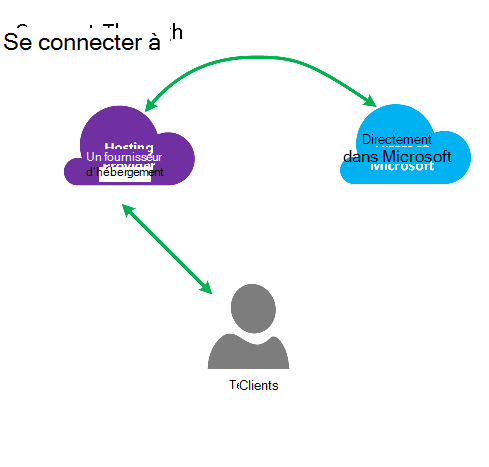
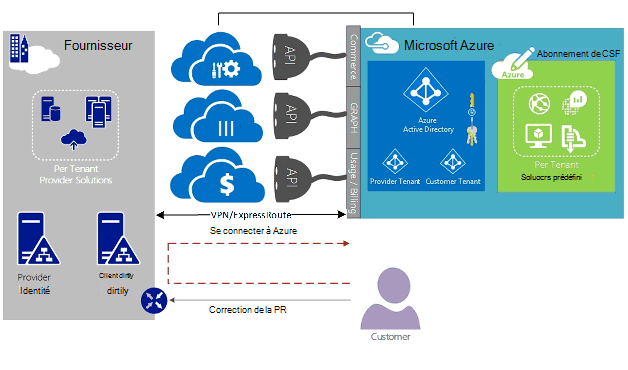
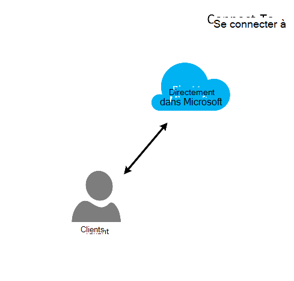
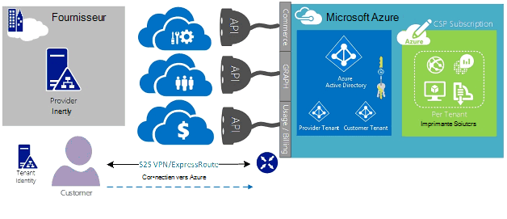
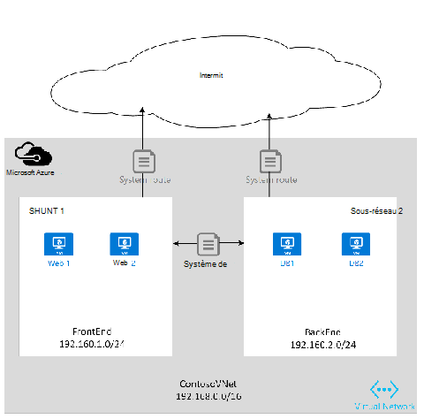
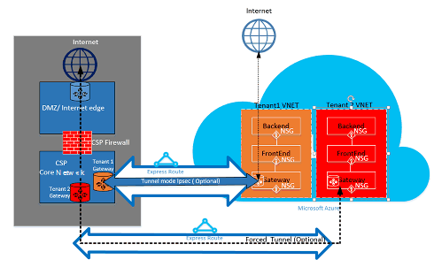

<properties
   pageTitle="ExpressRoute Azure pour fournisseurs de solutions de nuage | Microsoft Azure"
   description="Cet article fournit des informations pour les fournisseurs de services de Cloud qui souhaitent intégrer des services Azure et ExpressRoute dans ses offres."
   documentationCenter="na"
   services="expressroute"
   authors="richcar"
   manager="carmonm"
   editor=""/>
<tags
   ms.service="expressroute"
   ms.devlang="na"
   ms.topic="get-started-article"
   ms.tgt_pltfrm="na"
   ms.workload="infrastructure-services"
   ms.date="10/10/2016"
   ms.author="richcar"/>

# ExpressRoute pour les fournisseurs de solutions de Cloud (CSP)

Microsoft fournit les services Hyper-échelle pour traditionnels revendeurs et les distributeurs (CSP) pouvoir provisionnement rapide des nouveaux services et solutions pour vos clients sans avoir à investir dans le développement de ces nouveaux services. Pour autoriser le fournisseur de solutions de Cloud (CSP) la possibilité de gérer directement ces nouveaux services, Microsoft fournit des programmes et API qui permettre le fournisseur de services cryptographiques gérer les ressources de Microsoft Azure au nom de vos clients. L’une de ces ressources est ExpressRoute. Le fournisseur de services cryptographiques connecter les ressources client existantes aux services Azure permet d’ExpressRoute. ExpressRoute est une liaison de communications privées à grande vitesse aux services dans Azure. 

ExpresRoute se compose d’une paire de circuits pour une haute disponibilité qui sont associés à un abonnement de client unique et ne peut pas être partagé par plusieurs clients. Chaque circuit doit être clôturée dans un routeur différent pour maintenir une disponibilité élevée.

>[AZURE.NOTE] ExpressRoute qui signifie que les implémentations de grandes et complexes exigent plusieurs circuits de ExpressRoute pour un seul client comporte des extrémités de la bande passante et de connexion.

Microsoft Azure fournit un nombre croissant de services que vous pouvez offrir à vos clients.  À prendre mieux parti de ces services exige l’utilisation des connexions de ExpressRoute pour fournir à grande vitesse à faible accès de latence à l’environnement de Microsoft Azure.

## Gestion de Microsoft Azure
Microsoft propose des fournisseurs de services cryptographiques avec les API pour gérer les abonnements des clients Azure en permettant l’intégration avec vos systèmes de gestion de service de programmes. Vous pouvez trouver des fonctionnalités de gestion pris en charge [ici](https://msdn.microsoft.com/library/partnercenter/dn974944.aspx).

## Gestion des ressources de Microsoft Azure
Selon le contrat que vous avez avec votre client va déterminer le mode de gestion de l’abonnement. Le fournisseur de services cryptographiques peut gérer directement la création et la maintenance de ressources ou le client peut garder le contrôle de l’abonnement Microsoft Azure et créer les ressources Azure que nécessaire. Si votre client gère la création des ressources de leur abonnement Microsoft Azure ils utiliseront un des deux modèles : « Connexion via » modèle, ou « Direct à ». Ces modèles sont décrits en détail dans les sections suivantes.  

### Se connecter via le modèle

  

Dans le modèle par connexion, le fournisseur de services cryptographiques crée une connexion directe entre votre centre de données et d’abonnement Azure de votre client. La connexion directe est effectuée à l’aide de ExpressRoute, vous connectez votre réseau avec Azure. Votre client se connecte ensuite à votre réseau. Ce scénario nécessite que le client passe par le réseau du fournisseur de services cryptographiques pour accéder aux services Azure. 

Si votre client a autres abonnements Azure ne pas gérés par vous, ils utiliseraient Internet public ou leur propre connexion privée pour vous connecter à ces services mis en service dans l’abonnement du fournisseur de services cryptographiques non. 

Pour le fournisseur de services cryptographiques gestion des services Azure, il est supposé que le CSP a un stockage d’identité établie précédemment qui peut ensuite être répliqué dans Azure Active Directory pour la gestion de leur abonnement du fournisseur de services cryptographiques par l’intermédiaire de Administrate-On-Behalf-Of (AOBO). Pilotes de clé pour ce scénario comprennent où un partenaire donné ou un fournisseur de services a une relation établie avec le client, le client utilise actuellement les services fournisseur ou le partenaire a le souhait d’offrir à une combinaison de solutions hébergées par un fournisseur et Azure hébergé pour offrir flexibilité et client défis qui ne peut pas être satisfaites par un seul fournisseur de services cryptographiques. Ce modèle est illustré dans la **Figure**ci-dessous.

### Modèle de se connecter à

Dans le modèle de connexion, le fournisseur du service crée une connexion directe entre l’abonnement Azure CSP mis en service à l’aide de ExpressRoute sur le client (le client) et le centre de données de leurs clients réseau.

>[AZURE.NOTE] Pour ExpressRoute, le client aurait besoin créer et gérer le circuit de ExpressRoute.  

Ce scénario de connectivité requiert que le client se connecte directement par l’intermédiaire d’un réseau client accéder à abonnement Azure gérés par un fournisseur de services cryptographiques, à l’aide d’une connexion réseau directe qui est créée, appartenant à et gérée en totalité ou en partie par le client. Pour ces clients, qu'il est supposé que le fournisseur n’a pas actuellement un stockage d’identité établie, et le fournisseur peut aider le client dans la réplication de leur banque d’identifier en cours dans Azure Active Directory pour la gestion de leur abonnement par le biais de AOBO. Pilotes de clé pour ce scénario comprennent où un partenaire donné ou un fournisseur de services a une relation établie avec le client, le client utilise actuellement les services fournisseur ou le partenaire a le désir de fournir des services qui sont basés uniquement sur les solutions de hébergé Azure sans la nécessité d’une infrastructure ou un centre de données de fournisseur existant.

Le choix entre ces deux option sont basées sur les besoins de vos clients et vos besoins actuels pour fournir des services Azure. Les détails de ces modèles et de l’accès basé sur rôle associé du contrôle, de mise en réseau et les modèles de conception d’identité sont couverts en détail dans les liens suivants :
-   **Contrôle de l’accès basé sur rôle (RBAC)** – RBAC repose sur Azure Active Directory.  Pour plus d’informations sur RBAC d’Azure consultez [ici](../active-directory/role-based-access-control-configure.md).
-   **Réseau** – couvre les différentes rubriques de mise en réseau dans Microsoft Azure.
-   **Azure Active Directory (DAS)** – DAS fournit la gestion des identités pour Microsoft Azure et les applications SaaS 3ème partie. Pour plus d’informations sur, consultez Azure annonce [ici](https://azure.microsoft.com/documentation/services/active-directory/).  

## Vitesses de réseau
ExpressRoute prend en charge des vitesses de réseau à partir de 50 Mb/s à 10 Go/s. Cela permet aux clients d’acheter la quantité de bande passante requise pour leur environnement unique.

>[AZURE.NOTE] La bande passante du réseau peut être augmentée en fonction des besoins sans interrompre les communications, mais pour réduire le réseau vitesse nécessite démonter le circuit et la recréer à la vitesse réseau.  

ExpressRoute prend en charge la connexion de plusieurs vNets à un seul circuit de ExpressRoute pour une meilleure utilisation des connexions haut débit. Un seul circuit ExpressRoute peut être partagé entre plusieurs abonnements Azure appartenant au même client.

## Configuration de ExpressRoute
ExpressRoute peut être configuré pour prendre en charge trois types de trafic ([domaines de routage](#ExpressRoute-routing-domains)) sur un même circuit ExpressRoute. Ce trafic est différenciée en Microsoft homologation, homologation public Azure et homologation privé. Vous pouvez choisir un ou tous les types de trafic pour être envoyées sur un même circuit ExpressRoute ou utiliser plusieurs circuits ExpressRoute en fonction de la taille du circuit de ExpressRoute et d’isolation requis par votre client. Les défenses du client ne peuvent pas autoriser du trafic public et privé à parcourir sur le même circuit.

### Se connecter via le modèle
Dans une configuration à connexion vous sera responsable de toutes les bases de réseau pour connecter vos ressources de centre de données de clients pour les abonnements hébergés dans Azure. Chacun de vos clients qui souhaitez utiliser les fonctionnalités Azure devra leur propre connexion ExpressRoute, qui est gérée par vous. Vous utiliserez les mêmes méthodes que le client, permet de se procurer le circuit de ExpressRoute. Vous suit la procédure décrite dans l’article [ExpressRoute des flux de travail](./expressroute-workflows.md) pour les États de circuit et de mise en service du circuit. Vous configurerez ensuite les itinéraires de protocole BGP (Border Gateway) pour contrôler le trafic entre le réseau des locaux et vNet Azure.

### Modèle de se connecter à
Dans une configuration de connexion, votre client a une connexion existante à Azure déjà ou Initialise une connexion au fournisseur de services internet ExpressRoute à partir de votre centre de données du client étant directement relié au Azure, au lieu de votre centre de données. Pour commencer le processus de provisionnement, votre client suit les étapes comme décrit dans le modèle à se connecter, ci-dessus. Une fois que le circuit a été établi, que votre client devra configurer les routeurs locaux pour être en mesure d’accéder à votre réseau et le vNets Azure.

Vous pouvez vous aider à la connexion et la configuration des itinéraires pour permettre les ressources dans vos centres de communiquer avec les ressources client dans votre centre de données, ou aux ressources hébergées dans Azure.

## Domaines de routage ExpressRoute
ExpressRoute propose trois domaines de routage : public, privé et homologation de Microsoft. Chacun des domaines de routage sont configurés avec des routeurs identiques en configuration actif-actif pour une haute disponibilité. Pour plus d’informations sur ExpressRoute domaines de routage rechercher [ici](./expressroute-circuit-peerings.md).

Vous pouvez définir des filtres d’itinéraires personnalisés pour autoriser uniquement l’itinéraire parcouru que vous souhaitez autoriser ou avez besoin. Pour plus d’informations ou pour savoir comment effectuer ces modifications à voir l’article : [créer et modifier la gamme pour un circuit de ExpressRoute à l’aide de PowerShell](./expressroute-howto-routing-classic.md) pour plus de détails à propos des filtres de routage.

>[AZURE.NOTE] Pour Microsoft et homologation Public la connectivité doit être bien une adresse IP publique détenue par le client ou le fournisseur de services cryptographiques et doit respecter toutes les règles définies. Pour plus d’informations, consultez la page [Conditions préalables de ExpressRoute](expressroute-prerequisites.md) .  

## Routage
ExpressRoute se connecte aux réseaux par l’intermédiaire de la passerelle de réseau virtuel Azure Azure. Passerelles réseau fournissent le routage des réseaux virtuels Azure.

Créer des réseaux virtuels Azure crée également une table de routage par défaut pour le vNet diriger le trafic vers/depuis les sous-réseaux de la vNet. Si la table de routage par défaut est insuffisante pour la solution personnalisée itinéraires peuvent être créés pour acheminer le trafic sortant à des applications personnalisées ou pour bloquer des itinéraires pour des sous-réseaux ou des réseaux externes.

### Par défaut le routage
La table d’itinéraires par défaut inclut les itinéraires suivants :

- Routage au sein d’un sous-réseau
- Sous-réseau-à-un au sein du réseau virtuel
- À Internet
- Réseau virtuel de réseau-vers-virtuel à l’aide de la passerelle VPN
- Réseau virtuel de réseau-vers-sur site à l’aide d’une passerelle VPN ou ExpressRoute

  

### Routage défini par l’utilisateur (UDR)
Les itinéraires définis par l’utilisateur permettent le contrôle du trafic sortant provenant du sous-réseau affecté à d’autres sous-réseaux dans le réseau virtuel ou sur l’un des autres passerelles prédéfinies (ExpressRoute ; internet ou VPN). La table de routage du système par défaut peut être remplacée par une table de routage défini par l’utilisateur qui remplace la table de routage par défaut avec des itinéraires personnalisés. Avec le routage de défini par l’utilisateur, les clients peuvent créer des itinéraires spécifiques pour les appareils tels que des pare-feu ou des appareils de détection d’intrusion, ou bloquer l’accès à des sous-réseaux spécifiques à partir du sous-réseau qui héberge l’itinéraire défini par l’utilisateur. Pour une vue d’ensemble des itinéraires de défini par l’utilisateur de rechercher [ici](../virtual-network/virtual-networks-udr-overview.md). 

## Sécurité
Selon quel modèle est en cours d’utilisation, à se connecter ou se connecter à, votre client définit les stratégies de sécurité dans leur vNet ou fournit des exigences de la stratégie pour le fournisseur de services cryptographiques pour définir leur vNets de la sécurité. Les critères de sécurité suivants peuvent être définis :

1.  **Isolation de client** — plateforme Azure le fournit une isolation de client en stockant des informations sur le code client et vNet dans une base de données sécurisée, qui est utilisée pour encapsuler le trafic de chaque client dans un tunnel GRE.
2.  Règles du **Groupe de sécurité réseau (NSG)** sont pour définir le trafic autorisé vers et depuis les sous-réseaux au sein de vNets dans Azure. Par défaut, du NSG contiennent des règles de blocage pour bloquer le trafic provenant d’Internet vers le vNet et autoriser les règles du trafic dans un vNet. Pour plus d’informations sur les groupes de sécurité réseau recherchez [ici](https://azure.microsoft.com/blog/network-security-groups/).
3.  **Tunneling de force** : il s’agit d’une option pour rediriger le trafic internet lié dans Azure est redirigé via la connexion ExpressRoute au centre de données locaux sur. Pour plus d’informations sur le tunneling de Forced rechercher [ici](./expressroute-routing.md#advertising-default-routes).  

4.  **Cryptage** : bien que les circuits de ExpressRoute sont dédiées à un client spécifique, il est possible que le fournisseur réseau peut présenter des failles, permettant à un intrus d’examiner le trafic de paquets. Pour répondre à ce potentiel, un client ou un fournisseur de services cryptographiques peut crypter le trafic sur la connexion en définissant les stratégies IPSec en mode tunnel pour tout le trafic circulant entre les ressources de site et Azure ressources (reportez-vous à l’option mode de Tunnel IPSec pour le client 1 dans la Figure 5 : ExpressRoute sécurité, ci-dessus). La deuxième option est à utiliser un pare-feu chaque le point de terminaison du circuit de ExpressRoute. Cela nécessitera supplémentaire partie 3 pare-feu des ordinateurs virtuels et des équipements doit être installé sur les deux extrémités pour crypter le trafic sur le circuit de ExpressRoute.

  

## Étapes suivantes
Le service de fournisseur de solutions de Cloud vous fournit un moyen d’augmenter votre valeur à vos clients, sans avoir pour les achats infrastructure et une fonctionnalité de coûteux, tout en conservant votre position en tant que le fournisseur principal d’externalisation. Intégration transparente avec Microsoft Azure peut être effectuée via l’API du fournisseur de services cryptographiques, ce qui vous permet d’intégrer la gestion de Microsoft Azure dans vos infrastructures de gestion existantes.  

Vous trouverez plus d’informations sur les liens suivants :

[Programme de fournisseur de solutions de Cloud de Microsoft](https://partner.microsoft.com/en-US/Solutions/cloud-reseller-overview).  
[Soyez prêt à traiter comme un fournisseur de solutions de Cloud](https://partner.microsoft.com/en-us/solutions/cloud-reseller-pre-launch).  
[Ressources du fournisseur de solutions de Cloud de Microsoft](https://partner.microsoft.com/en-us/solutions/cloud-reseller-resources).
