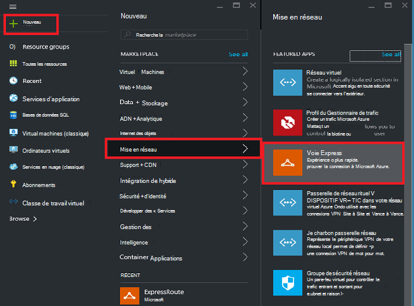
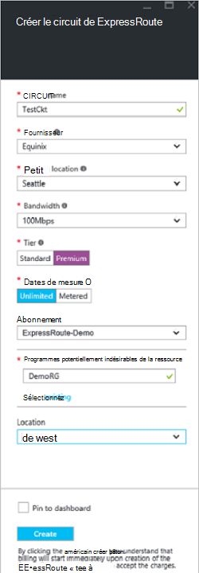
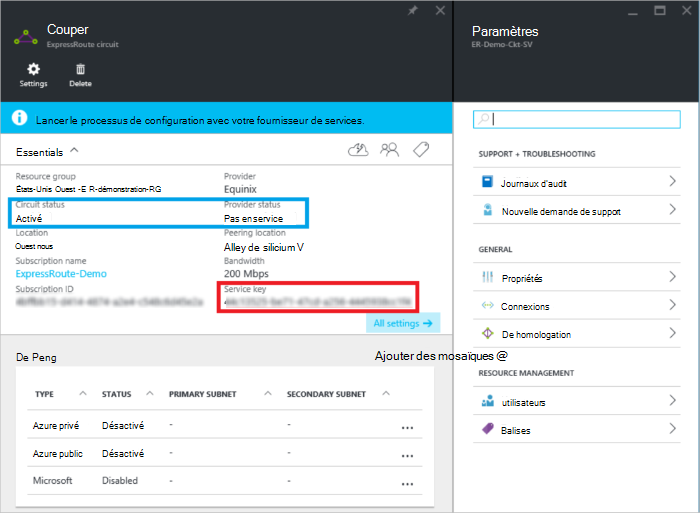
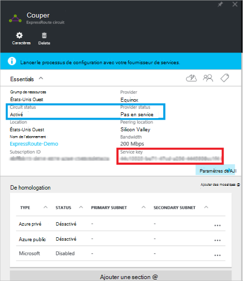
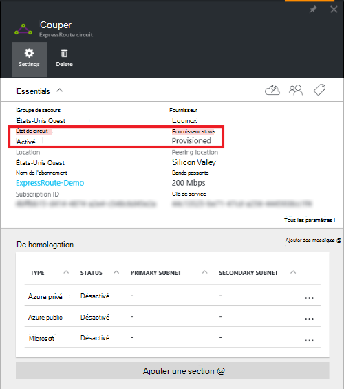

<properties
   pageTitle="Créer et modifier un circuit de ExpressRoute à l’aide de gestionnaire de ressources et le portail Azure | Microsoft Azure"
   description="Cet article décrit comment créer, configurer, vérifier, mettre à jour, supprimer et deprovision d’un circuit de ExpressRoute."
   documentationCenter="na"
   services="expressroute"
   authors="cherylmc"
   manager="carmonm"
   editor=""
   tags="azure-resource-manager"/>
<tags
   ms.service="expressroute"
   ms.devlang="na"
   ms.topic="article"
   ms.tgt_pltfrm="na"
   ms.workload="infrastructure-services"
   ms.date="10/10/2016"
   ms.author="cherylmc"/>

# Créer et modifier un circuit de ExpressRoute

> [AZURE.SELECTOR]
[Azure Portal - Gestionnaire de ressources](expressroute-howto-circuit-portal-resource-manager.md)
[PowerShell - Gestionnaire de ressources](expressroute-howto-circuit-arm.md)
[PowerShell - classique](expressroute-howto-circuit-classic.md)

Cet article décrit comment créer un circuit Azure ExpressRoute à l’aide du portail Azure et le modèle de déploiement du Gestionnaire de ressources Azure. Les étapes suivantes vous indiquent comment vérifier l’état du circuit, mettre à jour, ou supprimer et il deprovision.

**À propos des modèles de déploiement d’Azure**

[AZURE.INCLUDE [vpn-gateway-clasic-rm](../../includes/vpn-gateway-classic-rm-include.md)] 

## Avant de commencer

- Passez en revue les [conditions requises](expressroute-prerequisites.md) et les [flux de travail](expressroute-workflows.md) avant de commencer la configuration.
- Assurez-vous que vous disposez d’un accès au [portail Azure](https://portal.azure.com).
- Assurez-vous que vous disposez des autorisations pour créer des ressources réseau. Contactez votre administrateur de compte si vous ne disposez pas des autorisations appropriées.

## Créer et mettre en service un circuit de ExpressRoute

### 1. Ouvrez une session sur le portail Azure

À partir d’un navigateur, accédez au [portail Azure](http://portal.azure.com) et connectez-vous à votre compte Azure.

### 2. création d’un nouveau circuit de ExpressRoute

>[AZURE.IMPORTANT] Votre circuit ExpressRoute sera facturé depuis le moment où qu'une clé de service est émise. Assurez-vous que vous effectuez cette opération lorsque le fournisseur de connectivité est prêt à mettre en service le circuit.

1. Vous pouvez créer un circuit de ExpressRoute en sélectionnant l’option créer une nouvelle ressource. Cliquez sur **Nouveau** > **réseau** > **ExpressRoute**, comme illustré dans l’image suivante :

    

2. Après avoir cliqué sur **ExpressRoute**, vous verrez la lame de **circuit de ExpressRoute de créer** . Lorsque vous remplacez les valeurs de cette lame, assurez-vous que vous spécifiez la couche de référence SKU correct et le contrôle de données.

    - **Couche** détermine si une norme d’ExpressRoute ou d’un composant complémentaire ExpressRoute est activé. Vous pouvez spécifier **Standard** pour obtenir le point de stock ou la **prime** standard pour le complément de la prime.

    - **Contrôle de données** détermine le type de facturation. Vous pouvez spécifier **Metered** pour un plan de données contrôlé et **illimité** pour un plan de données illimité. Notez que vous pouvez modifier le type de facturation à partir de **Metered** à **illimité**, mais vous ne pouvez pas modifier le type de **illimité** à **Metered**.

    

>[AZURE.IMPORTANT] Sachez que l’emplacement de l’homologation indique l' [emplacement physique](expressroute-locations.md) où vous sont homologue avec Microsoft. Ce n’est **pas** lié à la propriété « Emplacement », qui fait référence à la zone géographique où se trouve le fournisseur de ressources de réseau Azure. Pendant qu’ils ne sont pas liées, il est conseillé de choisir un fournisseur de ressources réseau géographiquement près de l’emplacement d’homologation du circuit. 

### 3. visualiser les circuits et les propriétés

**Afficher tous les circuits**

Vous pouvez afficher tous les circuits que vous avez créé en sélectionnant **toutes les ressources** dans le menu de gauche.
    

**Afficher les propriétés**

    You can view the properties of the circuit by selecting it. On this blade, note the service key for the circuit. You must copy the circuit key for your circuit and pass it down to the service provider to complete the provisioning process. The circuit key is specific to your circuit.

### 4. envoyez la clé du service à votre fournisseur de connectivité pour le provisionnement

Sur cette blade, **état du fournisseur** fournit des informations sur l’état actuel de la mise en service sur le côté du prestataire de service. **État de circuit** fournit l’état sur le côté de Microsoft. Pour plus d’informations sur le circuit de mise en service des États, consultez l’article de [flux de travail](expressroute-workflows.md#expressroute-circuit-provisioning-states) .

Lorsque vous créez un nouveau circuit de ExpressRoute, le circuit sera dans l’état suivant :

État du fournisseur : non configuré 
Circuit d’état : activé

Le circuit passera à l’état suivant lorsque le fournisseur de connectivité en l’activant pour vous :

État du fournisseur : mise en service 
Circuit d’état : activé

Pour vous permettre d’utiliser un circuit de ExpressRoute, il doit être dans l’état suivant :

État du fournisseur : mise en service 
Circuit d’état : activé

### 5. périodiquement vérifier le statut et l’état de la touche de circuit

Vous pouvez afficher les propriétés du circuit qui vous intéresse en le sélectionnant. Vérifiez l' **état du fournisseur** et vous assurer qu’il a déplacé vers **Provisioned** avant de continuer.

### 6. créer votre configuration de routage

Pour obtenir des instructions détaillées, reportez-vous à l’article de [configuration de routage de circuit ExpressRoute](expressroute-howto-routing-portal-resource-manager.md) pour créer et modifier des circuits peerings.

>[AZURE.IMPORTANT] Ces instructions s’appliquent uniquement aux circuits qui sont créés avec des fournisseurs de services qui proposent des services de connectivité de 2 couche. Si vous utilisez un fournisseur de services qui offre géré de couche 3 services (généralement un IP VPN, comme MPLS), votre fournisseur de connectivité configurer et gérer le routage pour vous.

### 7. lier un réseau virtuel à un circuit de ExpressRoute

Ensuite, liez un réseau virtuel à votre circuit ExpressRoute. Utilisez la [liaison de réseaux virtuels aux circuits de ExpressRoute](expressroute-howto-linkvnet-arm.md) lorsque vous travaillez avec le modèle de déploiement du Gestionnaire de ressources.

## Obtention de l’état d’un circuit de ExpressRoute

Vous pouvez afficher l’état d’un circuit en le sélectionnant. 

## Modification d’un circuit de ExpressRoute

Vous pouvez modifier certaines propriétés d’un circuit de ExpressRoute sans impact sur la connectivité. À ce stade, vous ne pouvez pas modifier propriétés de circuit ExpressRoute via le portail Azure. Toutefois, vous pouvez utiliser PowerShell pour modifier les propriétés du circuit. Pour plus d’informations, consultez la section [modification d’un circuit de ExpressRoute à l’aide de PowerShell](expressroute-howto-circuit-arm.md#modify).

Vous pouvez effectuer les opérations sans interruption de service :

- Activer ou désactiver un module complémentaire à la prime ExpressRoute pour votre circuit ExpressRoute.

- Augmenter la bande passante de votre circuit ExpressRoute. Notez que la bande passante d’un circuit de mise à niveau n’est pas pris en charge. 

- Modifier le plan de mesure à partir des données de mesuré de données illimité. Notez que modifier le plan de mesure à partir de données illimité est mesuré de données n’est pas pris en charge.

-  Vous pouvez activer et désactiver **Autoriser les opérations classiques**.

Pour plus d’informations sur les limites et les restrictions, consultez le [Forum aux questions sur ExpressRoute](expressroute-faqs.md).

## Annulation et suppression d’un circuit de ExpressRoute

Vous pouvez supprimer votre circuit ExpressRoute en sélectionnant l’icône **Supprimer** . Notez les points suivants :

- Vous devez supprimer le lien de tous les réseaux virtuels du circuit ExpressRoute. Si cette opération échoue, vérifiez si tous les réseaux virtuels sont liés au circuit.

- Si l’état de mise en service de fournisseur de service de circuit ExpressRoute est **Provisioning** ou **Provisioned** vous devez travailler avec votre fournisseur de services à deprovision le circuit de leur côté. Nous continuerons à réserver des ressources et vous les facturer jusqu'à ce que le fournisseur du service termine le circuit de mise hors service et nous avertit.

- Si le fournisseur de service a arrêtés le circuit (l’état de mise en service de fournisseur de service est défini à **non configuré**), vous pouvez ensuite supprimer le circuit. Ceci va arrêter la facturation pour le circuit

## Étapes suivantes

Après avoir créé votre circuit, assurez-vous que vous effectuez les opérations suivantes :

- [Créer et modifier le routage pour circuit de votre ExpressRoute](expressroute-howto-routing-portal-resource-manager.md)
- [Lier votre réseau virtuel à votre circuit ExpressRoute](expressroute-howto-linkvnet-arm.md)
