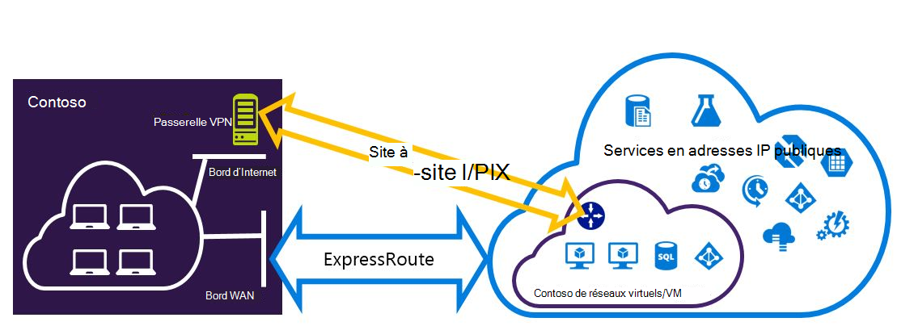
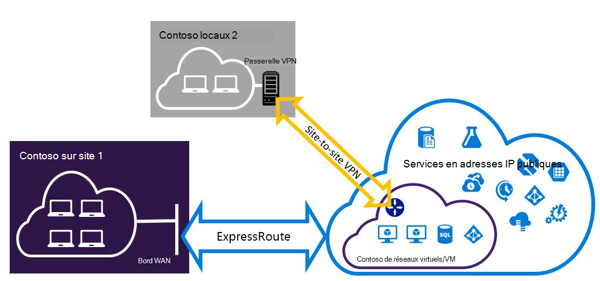

<properties
   pageTitle="Configurer des connexions VPN Expressroute et de Site à Site pouvant coexister | Microsoft Azure"
   description="Cet article vous guide dans le processus de configuration de ExpressRoute et une connexion VPN de Site à Site peut coexister pour le modèle de déploiement classique."
   documentationCenter="na"
   services="expressroute"
   authors="charwen"
   manager="carmonm"
   editor=""
   tags="azure-service-management"/>
<tags
   ms.service="expressroute"
   ms.devlang="na"
   ms.topic="get-started-article"
   ms.tgt_pltfrm="na"
   ms.workload="infrastructure-services"
   ms.date="10/10/2016"
   ms.author="charwen"/>

# Configurer les connexions de coexistence ExpressRoute et Site-à-Site pour le modèle de déploiement classique

> [AZURE.SELECTOR]
- [PowerShell - Gestionnaire de ressources](expressroute-howto-coexist-resource-manager.md)
- [PowerShell - classique](expressroute-howto-coexist-classic.md)

La possibilité de configurer le VPN de Site à Site et ExpressRoute présente plusieurs avantages. Vous pouvez configurer des VPN de Site à Site sous la forme d’un chemin d’accès de basculement sécurisé pour ExressRoute ou utiliser des connexions VPN de Site à Site pour se connecter à des sites qui ne sont pas connectés par l’intermédiaire de ExpressRoute. Nous allons aborder les étapes pour configurer les deux scénarios dans cet article. Cet article s’applique au modèle de déploiement classique. Cette configuration n’est pas disponible dans le portail.

**À propos des modèles de déploiement d’Azure**

[AZURE.INCLUDE [vpn-gateway-clasic-rm](../../includes/vpn-gateway-classic-rm-include.md)] 

>[AZURE.IMPORTANT] Circuits de ExpressRoute doivent être préalablement configurés avant de suivre les instructions ci-dessous. Assurez-vous que vous avez suivi les guides pour [créer un circuit de ExpressRoute](expressroute-howto-circuit-classic.md) et [configurer le routage](expressroute-howto-routing-classic.md) avant de suivre les étapes ci-dessous.

## Limites et restrictions

- **Acheminement de transit n’est pas pris en charge.** Vous ne peut pas Router (via Azure) entre votre réseau local est connecté via un VPN de Site à Site et votre réseau local connecté via ExpressRoute.
- **Point-à-site n’est pas pris en charge.** Vous ne pouvez pas activer les connexions VPN site-à-point pour la même VNet qui est connecté à ExpressRoute. VPN site-à-point et les ExpressRoute ne peuvent pas coexister pour la même VNet.
- **Tunneling forcée ne peut pas être activé sur la passerelle VPN de Site à Site.** Vous pouvez uniquement « forcer » tout trafic Internet lié à votre réseau local via ExpressRoute.
- **Passerelle de SKU de base n’est pas pris en charge.** Vous devez utiliser une passerelle de base SKU pour la [passerelle d’ExpressRoute](expressroute-about-virtual-network-gateways.md) et de la [passerelle VPN](../vpn-gateway/vpn-gateway-about-vpngateways.md).
- **Basée sur un itinéraire uniquement de passerelle VPN est pris en charge.** Vous devez utiliser une gamme de [Passerelle VPN](../vpn-gateway/vpn-gateway-about-vpngateways.md).
- **Itinéraire statique doit être configuré pour votre passerelle VPN.** Si votre réseau local est connecté à un réseau VPN de Site à Site et ExpressRoute, vous devez disposer d’un itinéraire statique est configuré sur votre réseau local d’acheminer la connexion VPN de Site à Site à l’Internet public.
- **ExpressRoute passerelle doit être configuré en premier.** Vous devez d’abord créer la passerelle ExpressRoute avant d’ajouter la passerelle VPN de Site à Site.

## Modèles de configuration

### Configurer un VPN de Site à Site sous la forme d’un chemin de basculement sur incident pour ExpressRoute

Vous pouvez configurer une connexion VPN de Site à Site en tant que sauvegarde pour ExpressRoute. Cela s’applique uniquement aux réseaux virtuels liés au chemin homologation privé Azure. Il n’existe aucune solution de basculement basée sur un VPN pour les services en accessibles via Azure public et peerings de Microsoft. Le circuit de ExpressRoute est toujours le lien principal. Flux de données via le chemin d’accès de Site à Site VPN uniquement si le circuit ExpressRoute échoue. 

### Configurer un VPN de Site à Site pour se connecter à des sites non connectés par le biais de ExpressRoute

Vous pouvez configurer votre réseau où certains sites se connectent directement à Azure via VPN de Site à Site, et certains sites par le biais de ExpressRoute. 

>[AZURE.NOTE] Vous ne pouvez pas configurer un réseau virtuel comme un routeur de transit.

## Sélection de la procédure à suivre

Il existe deux ensembles différents de procédures à sélectionner pour configurer des connexions qui peuvent coexister. La procédure de configuration que vous sélectionnez dépend si vous avez un réseau virtuel que vous souhaitez vous connecter, ou si vous souhaitez créer un nouveau réseau virtuel.

- J’avoir un VNet et devez en créer un.
    
    Si vous ne disposez pas d’un réseau virtuel, cette procédure vous guide dans la création d’un nouveau réseau virtuel en utilisant le modèle de déploiement classique et la création de nouvelles connexions de VPN de ExpressRoute et de Site à Site. Pour configurer, suivez les étapes de la section de l’article [pour créer un nouveau réseau virtuel et des connexions de coexistence](#new).

- Je dispose déjà d’un modèle de déploiement classique VNet.

    Vous disposez peut-être déjà d’un réseau virtuel en place avec une connexion VPN de Site à Site existante ou d’une connexion de ExpressRoute. La section de l’article [pour configurer les connexions de coexsiting d’un VNet existant](#add) vous aidera à supprimer la passerelle et création de nouvelles connexions de VPN de ExpressRoute et de Site à Site. Notez que lorsque vous créez les nouvelles connexions, les étapes doivent être effectuées dans un ordre spécifique. N’utilisez pas les instructions dans d’autres articles pour créer des connexions et les passerelles.

    Dans cette procédure, créer des connexions qui peuvent coexister va vous obliger à supprimer la passerelle, puis configurez nouvelles passerelles. Cela signifie que vous pouvez les temps d’arrêt pour vos connexions de coexistence pendant que vous supprimez et recréez votre passerelle et les connexions, mais vous n’aurez pas à faire migrer vos ordinateurs virtuels ou les services à un nouveau réseau virtuel. Vos machines virtuelles et les services seront en mesure de communiquer par l’intermédiaire de l’équilibreur de charge lorsque vous configurez votre passerelle s’ils sont configurés pour cela.

## Pour créer un nouveau réseau virtuel et des connexions de coexistence

Cette procédure va vous guider dans la création d’un VNet et créer des connexions de ExpressRoute qui vont coexister et de Site à Site.

1. Vous devez installer la dernière version des applets de commande PowerShell d’Azure. Pour plus d’informations sur l’installation des applets de commande PowerShell, voir [Comment faire pour installer et configurer Azure PowerShell](../powershell-install-configure.md) . Notez que les applets de commande que vous utiliserez pour cette configuration peut être légèrement différente de celle que vous connaissez peut-être. Veillez à utiliser des applets de commande spécifié dans ces instructions. 

2. Créer un schéma pour votre réseau virtuel. Pour plus d’informations sur le schéma de configuration, consultez le [schéma de configuration de réseau virtuel d’Azure](https://msdn.microsoft.com/library/azure/jj157100.aspx).

    Lorsque vous créez votre schéma, assurez-vous que vous utilisez les valeurs suivantes :

    - Le sous-réseau de passerelle pour le réseau virtuel doit être /27 ou un préfixe le plus court (par exemple, /26 ou /25).
    - Le type de connexion de passerelle est « dédié ».

              <VirtualNetworkSite name="MyAzureVNET" Location="Central US">
                <AddressSpace>
                  <AddressPrefix>10.17.159.192/26</AddressPrefix>
                </AddressSpace>
                <Subnets>
                  <Subnet name="Subnet-1">
                    <AddressPrefix>10.17.159.192/27</AddressPrefix>
                  </Subnet>
                  <Subnet name="GatewaySubnet">
                    <AddressPrefix>10.17.159.224/27</AddressPrefix>
                  </Subnet>
                </Subnets>
                <Gateway>
                  <ConnectionsToLocalNetwork>
                    <LocalNetworkSiteRef name="MyLocalNetwork">
                      <Connection type="Dedicated" />
                    </LocalNetworkSiteRef>
                  </ConnectionsToLocalNetwork>
                </Gateway>
              </VirtualNetworkSite>

3. Après avoir créé et configuré votre fichier de schéma xml, téléchargez le fichier. Le réseau virtuel est créé.

    Utilisez l’applet de commande suivante pour charger votre fichier, en remplaçant la valeur par votre propre.

        Set-AzureVNetConfig -ConfigurationPath 'C:\NetworkConfig.xml'

4. Créer une passerelle ExpressRoute. Veillez à spécifier le GatewaySKU en tant que *Standard*, *ultraperformante*, ou *UltraPerformance* et le GatewayType comme *DynamicRouting*.

    Utilisez l’exemple suivant, en remplaçant les valeurs de votre propre.

        New-AzureVNetGateway -VNetName MyAzureVNET -GatewayType DynamicRouting -GatewaySKU HighPerformance

5. Lier la passerelle ExpressRoute au circuit de ExpressRoute. Une fois cette étape terminée, la connexion entre votre réseau de locaux et la Azure, par le biais de ExpressRoute, est établie.

        New-AzureDedicatedCircuitLink -ServiceKey <service-key> -VNetName MyAzureVNET

6. Ensuite, créez votre passerelle VPN de Site à Site. Le GatewaySKU doit être *Standard*, *ultraperformante*, ou *UltraPerformance* et le GatewayType doivent être *DynamicRouting*.

        New-AzureVirtualNetworkGateway -VNetName MyAzureVNET -GatewayName S2SVPN -GatewayType DynamicRouting -GatewaySKU  HighPerformance

    Pour récupérer les paramètres de la passerelle réseau virtuel, y compris l’ID de passerelle et de l’adresse IP publique, utilisez la `Get-AzureVirtualNetworkGateway` applet de commande.

        Get-AzureVirtualNetworkGateway

        GatewayId            : 348ae011-ffa9-4add-b530-7cb30010565e
        GatewayName          : S2SVPN
        LastEventData        :
        GatewayType          : DynamicRouting
        LastEventTimeStamp   : 5/29/2015 4:41:41 PM
        LastEventMessage     : Successfully created a gateway for the following virtual network: GNSDesMoines
        LastEventID          : 23002
        State                : Provisioned
        VIPAddress           : 104.43.x.y
        DefaultSite          :
        GatewaySKU           : HighPerformance
        Location             :
        VnetId               : 979aabcf-e47f-4136-ab9b-b4780c1e1bd5
        SubnetId             :
        EnableBgp            : False
        OperationDescription : Get-AzureVirtualNetworkGateway
        OperationId          : 42773656-85e1-a6b6-8705-35473f1e6f6a
        OperationStatus      : Succeeded

7. Créer un entité de passerelle VPN de site local. Cette commande ne configurez votre passerelle VPN sur site. Au lieu de cela, il vous permet de fournir les paramètres de la passerelle locale, comme adresse l’adresse IP publique et les locaux de l’espace, afin que la passerelle VPN d’Azure peut se connecter en.

    >[AZURE.IMPORTANT] Le site local pour la connexion VPN de Site à Site n’est pas défini dans le netcfg. Au lieu de cela, vous devez utiliser cette applet de commande pour spécifier les paramètres de site local. Vous ne pouvez pas définir à l’aide du portail, ou dans le fichier netcfg.

    Utilisez l’exemple suivant, en remplaçant les valeurs avec vos propres.

        New-AzureLocalNetworkGateway -GatewayName MyLocalNetwork -IpAddress <MyLocalGatewayIp> -AddressSpace <MyLocalNetworkAddress>

    > [AZURE.NOTE] Si votre réseau local possède plusieurs itinéraires, vous pouvez passer les sous la forme d’un tableau.  $MyLocalNetworkAddress =@("10.1.2.0/24","10.1.3.0/24","10.2.1.0/24")  

    Pour récupérer les paramètres de la passerelle réseau virtuel, y compris l’ID de passerelle et de l’adresse IP publique, utilisez la `Get-AzureVirtualNetworkGateway` applet de commande. Voir l’exemple suivant.

        Get-AzureLocalNetworkGateway

        GatewayId            : 532cb428-8c8c-4596-9a4f-7ae3a9fcd01b
        GatewayName          : MyLocalNetwork
        IpAddress            : 23.39.x.y
        AddressSpace         : {10.1.2.0/24}
        OperationDescription : Get-AzureLocalNetworkGateway
        OperationId          : ddc4bfae-502c-adc7-bd7d-1efbc00b3fe5
        OperationStatus      : Succeeded

8. Configurez votre périphérique VPN local pour se connecter à la nouvelle passerelle. Utilisez les informations que vous avez récupérée à l’étape 6, lors de la configuration de votre périphérique VPN. Pour plus d’informations sur la configuration de périphérique VPN, reportez-vous à la section [Configuration de périphérique VPN](../vpn-gateway/vpn-gateway-about-vpn-devices.md).

9. Lier la passerelle VPN de Site à Site sur Azure à la passerelle locale.

    Dans cet exemple, connectedEntityId est l’ID de passerelle locale, que vous trouverez en exécutant `Get-AzureLocalNetworkGateway`. Vous pouvez trouver des virtualNetworkGatewayId à l’aide de la `Get-AzureVirtualNetworkGateway` applet de commande. Après cette étape, la connexion entre votre réseau local et les Azure via la connexion VPN de Site à Site est établie.

        New-AzureVirtualNetworkGatewayConnection -connectedEntityId <local-network-gateway-id> -gatewayConnectionName Azure2Local -gatewayConnectionType IPsec -sharedKey abc123 -virtualNetworkGatewayId <azure-s2s-vpn-gateway-id>

## Pour configurer les connexions de coexsiting d’un VNet existant

Si vous avez un réseau virtuel, vérifiez la taille de sous-réseau de passerelle. Si le sous-réseau de la passerelle est /28 ou /29, vous devez tout d’abord supprimer la passerelle réseau virtuel et augmenter la taille du sous-réseau passerelle. Les étapes de cette section va vous montrer comment faire.

Si le sous-réseau de passerelle est /27 ou supérieure et le réseau virtuel est connecté via ExpressRoute, vous pouvez ignorer les étapes ci-dessous et passez à l' [« Étape 6 - créer une passerelle VPN de Site à Site »](#vpngw) dans la section précédente.

>[AZURE.NOTE] Lorsque vous supprimez la passerelle existante, vos sites locaux perdez la connexion à votre réseau virtuel pendant que vous travaillez sur cette configuration.

1. Vous devez installer la dernière version de cmdlets PowerShell du Gestionnaire de ressources Azure. Pour plus d’informations sur l’installation des applets de commande PowerShell, voir [Comment faire pour installer et configurer Azure PowerShell](../powershell-install-configure.md) . Notez que les applets de commande que vous utiliserez pour cette configuration peut être légèrement différente de celle que vous connaissez peut-être. Veillez à utiliser des applets de commande spécifié dans ces instructions. 

2. Supprimez la passerelle ExpressRoute ou VPN de Site à Site existante. Utilisez l’applet de commande suivant, en remplaçant les valeurs avec vos propres.

        Remove-AzureVNetGateway –VnetName MyAzureVNET

3. Exporter le schéma de réseau virtuel. Utilisez la cmdlet PowerShell suivante, en remplaçant les valeurs avec vos propres.

        Get-AzureVNetConfig –ExportToFile “C:\NetworkConfig.xml”

4. Modifiez le schéma de fichier de configuration de réseau de sorte que le sous-réseau de passerelle est /27 ou un préfixe le plus court (par exemple, /26 ou /25). Voir l’exemple suivant. 
>[AZURE.NOTE] Si vous n’avez pas suffisamment d’adresses IP dans votre réseau virtuel pour augmenter la taille du sous-réseau passerelle, vous devez ajouter de l’espace d’adresse IP. Pour plus d’informations sur le schéma de configuration, consultez le [schéma de configuration de réseau virtuel d’Azure](https://msdn.microsoft.com/library/azure/jj157100.aspx).

          <Subnet name="GatewaySubnet">
            <AddressPrefix>10.17.159.224/27</AddressPrefix>
          </Subnet>

5. Si votre passerelle précédente était un VPN de Site à Site, vous devez également modifier le type de connexion à **dédié**.

                 <Gateway>
                  <ConnectionsToLocalNetwork>
                    <LocalNetworkSiteRef name="MyLocalNetwork">
                      <Connection type="Dedicated" />
                    </LocalNetworkSiteRef>
                  </ConnectionsToLocalNetwork>
                </Gateway>

6. À ce stade, vous aurez un VNet avec aucun des passerelles. Pour créer de nouvelles passerelles et terminer vos connexions, peut procéder à l' [étape 4 - Création d’une passerelle de ExpressRoute](#gw), dans le précédent jeu d’étapes.

## Étapes suivantes

Pour plus d’informations sur ExpressRoute, consultez le [Forum aux questions sur ExpressRoute](expressroute-faqs.md)
