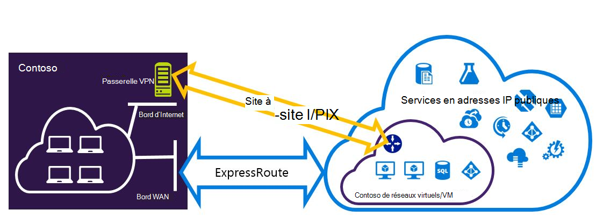
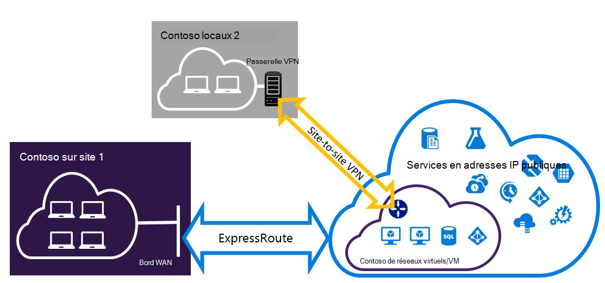

<properties
   pageTitle="Configurer des connexions VPN Expressroute et de Site à Site pouvant coexister pour le modèle de déploiement du Gestionnaire de ressources | Microsoft Azure"
   description="Cet article vous guide dans le processus de configuration de ExpressRoute et une connexion VPN de Site à Site peut coexister pour le modèle de gestionnaire de ressources."
   documentationCenter="na"
   services="expressroute"
   authors="charwen"
   manager="carmonm"
   editor=""
   tags="azure-resource-manager"/>
<tags
   ms.service="expressroute"
   ms.devlang="na"
   ms.topic="get-started-article"
   ms.tgt_pltfrm="na"
   ms.workload="infrastructure-services"
   ms.date="10/10/2016"
   ms.author="charleywen"/>

# Configurer les connexions de coexistence ExpressRoute et Site-à-Site pour le modèle de déploiement du Gestionnaire de ressources

> [AZURE.SELECTOR]
- [PowerShell - Gestionnaire de ressources](expressroute-howto-coexist-resource-manager.md)
- [PowerShell - classique](expressroute-howto-coexist-classic.md)

La possibilité de configurer le VPN de Site à Site et ExpressRoute présente plusieurs avantages. Vous pouvez configurer des VPN de Site à Site sous la forme d’un chemin d’accès de basculement sécurisé pour ExressRoute ou utiliser des connexions VPN de Site à Site pour se connecter à des sites qui ne sont pas connectés par l’intermédiaire de ExpressRoute. Nous allons aborder les étapes pour configurer les deux scénarios dans cet article. Cet article s’applique au modèle de déploiement du Gestionnaire de ressources. Cette configuration n’est pas disponible dans le portail Azure.

**À propos des modèles de déploiement d’Azure**

[AZURE.INCLUDE [vpn-gateway-clasic-rm](../../includes/vpn-gateway-classic-rm-include.md)] 

>[AZURE.IMPORTANT] Circuits de ExpressRoute doivent être préalablement configurés avant de suivre les instructions ci-dessous. Assurez-vous que vous avez suivi les guides pour [créer un circuit de ExpressRoute](expressroute-howto-circuit-arm.md) et [configurer le routage](expressroute-howto-routing-arm.md) avant de suivre les étapes ci-dessous.

## Limites et restrictions

- **Acheminement de transit n’est pas pris en charge.** Vous ne peut pas Router (via Azure) entre votre réseau local est connecté via un VPN de Site à Site et votre réseau local connecté via ExpressRoute.
- **Passerelle de SKU de base n’est pas pris en charge.** Vous devez utiliser une passerelle de base SKU pour la [passerelle d’ExpressRoute](expressroute-about-virtual-network-gateways.md) et de la [passerelle VPN](../vpn-gateway/vpn-gateway-about-vpngateways.md).
- **Basée sur un itinéraire uniquement de passerelle VPN est pris en charge.** Vous devez utiliser une gamme de [Passerelle VPN](../vpn-gateway/vpn-gateway-about-vpngateways.md).
- **Itinéraire statique doit être configuré pour votre passerelle VPN.** Si votre réseau local est connecté à un réseau VPN de Site à Site et ExpressRoute, vous devez disposer d’un itinéraire statique est configuré sur votre réseau local d’acheminer la connexion VPN de Site à Site à l’Internet public.
- **ExpressRoute passerelle doit être configuré en premier.** Vous devez d’abord créer la passerelle ExpressRoute avant d’ajouter la passerelle VPN de Site à Site.

## Modèles de configuration

### Configurer un VPN de Site à Site sous la forme d’un chemin de basculement sur incident pour ExpressRoute

Vous pouvez configurer une connexion VPN de Site à Site en tant que sauvegarde pour ExpressRoute. Cela s’applique uniquement aux réseaux virtuels liés au chemin homologation privé Azure. Il n’existe aucune solution de basculement basée sur un VPN pour les services en accessibles via Azure public et peerings de Microsoft. Le circuit de ExpressRoute est toujours le lien principal. Flux de données via le chemin d’accès de Site à Site VPN uniquement si le circuit ExpressRoute échoue.
>[AZURE.NOTE] ExpressRoute circuit est préféré sur VPN de Site à Site lorsque les deux itinéraires sont les mêmes, Azure utilise la correspondance de préfixe longuest pour choisir l’itinéraire vers la destination du paquet.

### Configurer un VPN de Site à Site pour se connecter à des sites non connectés par le biais de ExpressRoute

Vous pouvez configurer votre réseau où certains sites se connectent directement à Azure via VPN de Site à Site, et certains sites par le biais de ExpressRoute. 

>[AZURE.NOTE] Vous ne pouvez pas configurer un réseau virtuel comme un routeur de transit.

## Sélection de la procédure à suivre

Il existe deux ensembles différents de procédures à sélectionner pour configurer des connexions qui peuvent coexister. La procédure de configuration que vous sélectionnez dépend si vous avez un réseau virtuel que vous souhaitez vous connecter, ou si vous souhaitez créer un nouveau réseau virtuel.

- J’avoir un VNet et devez en créer un.
    
    Si vous ne disposez pas d’un réseau virtuel, cette procédure vous guide dans la création d’un nouveau réseau virtuel à l’aide du Gestionnaire de ressources du modèle de déploiement et de création de nouvelles connexions de VPN de ExpressRoute et de Site à Site. Pour configurer, suivez les étapes de la section de l’article [pour créer un nouveau réseau virtuel et des connexions de coexistence](#new).

- Je dispose déjà d’un modèle de déploiement du Gestionnaire de ressources VNet.

    Vous disposez peut-être déjà d’un réseau virtuel en place avec une connexion VPN de Site à Site existante ou d’une connexion de ExpressRoute. La section [pour configurer les connexions de coexsiting d’un VNet existant](#add) vous aidera à supprimer la passerelle et création de nouvelles connexions de VPN de ExpressRoute et de Site à Site. Notez que lorsque vous créez les nouvelles connexions, les étapes doivent être effectuées dans un ordre spécifique. N’utilisez pas les instructions dans d’autres articles pour créer des connexions et les passerelles.

    Dans cette procédure, créer des connexions qui peuvent coexister va vous obliger à supprimer la passerelle, puis configurez nouvelles passerelles. Cela signifie que vous pouvez les temps d’arrêt pour vos connexions de coexistence pendant que vous supprimez et recréez votre passerelle et les connexions, mais vous n’aurez pas à faire migrer vos ordinateurs virtuels ou les services à un nouveau réseau virtuel. Vos machines virtuelles et les services seront en mesure de communiquer par l’intermédiaire de l’équilibreur de charge lorsque vous configurez votre passerelle s’ils sont configurés pour cela.

## Pour créer un nouveau réseau virtuel et des connexions de coexistence

Cette procédure va vous guider dans la création d’un VNet et créer des connexions de ExpressRoute qui vont coexister et de Site à Site.
    
1. Vous devez installer la dernière version des applets de commande PowerShell d’Azure. Pour plus d’informations sur l’installation des applets de commande PowerShell, voir [Comment faire pour installer et configurer Azure PowerShell](../powershell-install-configure.md) . Notez que les applets de commande que vous utiliserez pour cette configuration peut être légèrement différente de celle que vous connaissez peut-être. Veillez à utiliser des applets de commande spécifié dans ces instructions.

2. Connexion votre compte et la configuration de l’environnement.
    
        login-AzureRmAccount
        Select-AzureRmSubscription -SubscriptionName 'yoursubscription'
        $location = "Central US"
        $resgrp = New-AzureRmResourceGroup -Name "ErVpnCoex" -Location $location

3. Créer un réseau virtuel, y compris le sous-réseau de passerelle. Pour plus d’informations sur la configuration de réseau virtuel, voir [configuration du réseau virtuel d’Azure](../virtual-network/virtual-networks-create-vnet-arm-ps.md).

    >[AZURE.IMPORTANT] Le sous-réseau de passerelle doit être /27 ou un préfixe le plus court (par exemple, /26 ou /25).
    
    Créer un nouveau VNet.

        $vnet = New-AzureRmVirtualNetwork -Name "CoexVnet" -ResourceGroupName $resgrp.ResourceGroupName -Location $location -AddressPrefix "10.200.0.0/16" 

    Ajouter des sous-réseaux.

        Add-AzureRmVirtualNetworkSubnetConfig -Name "App" -VirtualNetwork $vnet -AddressPrefix "10.200.1.0/24"
        Add-AzureRmVirtualNetworkSubnetConfig -Name "GatewaySubnet" -VirtualNetwork $vnet -AddressPrefix "10.200.255.0/24"

    Enregistrer la configuration de VNet.

        $vnet = Set-AzureRmVirtualNetwork -VirtualNetwork $vnet

4. Créer une passerelle ExpressRoute. Pour plus d’informations sur la configuration de passerelle ExpressRoute, reportez-vous à la section [configuration de la passerelle ExpressRoute](expressroute-howto-add-gateway-resource-manager.md). Le GatewaySKU doit être *Standard*, *ultraperformante*ou *UltraPerformance*.

        $gwSubnet = Get-AzureRmVirtualNetworkSubnetConfig -Name "GatewaySubnet" -VirtualNetwork $vnet
        $gwIP = New-AzureRmPublicIpAddress -Name "ERGatewayIP" -ResourceGroupName $resgrp.ResourceGroupName -Location $location -AllocationMethod Dynamic
        $gwConfig = New-AzureRmVirtualNetworkGatewayIpConfig -Name "ERGatewayIpConfig" -SubnetId $gwSubnet.Id -PublicIpAddressId $gwIP.Id
        $gw = New-AzureRmVirtualNetworkGateway -Name "ERGateway" -ResourceGroupName $resgrp.ResourceGroupName -Location $location -IpConfigurations $gwConfig -GatewayType "ExpressRoute" -GatewaySku Standard 

5. Lier la passerelle ExpressRoute au circuit de ExpressRoute. Une fois cette étape terminée, la connexion entre votre réseau de locaux et la Azure, par le biais de ExpressRoute, est établie. Pour plus d’informations sur l’opération de liaison, voir [Liaison des VNets à ExpressRoute](expressroute-howto-linkvnet-arm.md).

        $ckt = Get-AzureRmExpressRouteCircuit -Name "YourCircuit" -ResourceGroupName "YourCircuitResourceGroup"
        New-AzureRmVirtualNetworkGatewayConnection -Name "ERConnection" -ResourceGroupName $resgrp.ResourceGroupName -Location $location -VirtualNetworkGateway1 $gw -PeerId $ckt.Id -ConnectionType ExpressRoute

6. Ensuite, créez votre passerelle VPN de Site à Site. Pour plus d’informations sur la configuration de la passerelle VPN, consultez [configurer une VNet avec une connexion de Site à Site](../vpn-gateway/vpn-gateway-create-site-to-site-rm-powershell.md). Le GatewaySKU doit être *Standard*, *ultraperformante*ou *UltraPerformance*. Le VpnType doit être *RouteBased*.

        $gwSubnet = Get-AzureRmVirtualNetworkSubnetConfig -Name "GatewaySubnet" -VirtualNetwork $vnet
        $gwIP = New-AzureRmPublicIpAddress -Name "VPNGatewayIP" -ResourceGroupName $resgrp.ResourceGroupName -Location $location -AllocationMethod Dynamic
        $gwConfig = New-AzureRmVirtualNetworkGatewayIpConfig -Name "VPNGatewayIpConfig" -SubnetId $gwSubnet.Id -PublicIpAddressId $gwIP.Id
        New-AzureRmVirtualNetworkGateway -Name "VPNGateway" -ResourceGroupName $resgrp.ResourceGroupName -Location $location -IpConfigurations $gwConfig -GatewayType "Vpn" -VpnType "RouteBased" -GatewaySku "Standard"

    Passerelle VPN Azure prend en charge le protocole BGP. Vous pouvez spécifier - EnableBgp dans la commande suivante.

        $azureVpn = New-AzureRmVirtualNetworkGateway -Name "VPNGateway" -ResourceGroupName $resgrp.ResourceGroupName -Location $location -IpConfigurations $gwConfig -GatewayType "Vpn" -VpnType "RouteBased" -GatewaySku "Standard" -EnableBgp $true

    Vous pouvez trouver le BGP homologation IP et le numéro comme Azure utilise pour la passerelle VPN dans $azureVpn.BgpSettings.BgpPeeringAddress et $azureVpn.BgpSettings.Asn. Pour plus d’informations, voir [Configurer le protocole BGP](../vpn-gateway/vpn-gateway-bgp-resource-manager-ps.md) pour passerelle VPN d’Azure.

7. Créer un entité de passerelle VPN de site local. Cette commande ne configurez votre passerelle VPN sur site. Au lieu de cela, il vous permet de fournir les paramètres de la passerelle locale, comme adresse l’adresse IP publique et les locaux de l’espace, afin que la passerelle VPN d’Azure peut se connecter en.

    Si votre périphérique VPN local prend uniquement en charge le routage statique, vous pouvez configurer des itinéraires statiques de la manière suivante.

        $MyLocalNetworkAddress = @("10.100.0.0/16","10.101.0.0/16","10.102.0.0/16")
        $localVpn = New-AzureRmLocalNetworkGateway -Name "LocalVPNGateway" -ResourceGroupName $resgrp.ResourceGroupName -Location $location -GatewayIpAddress *<Public IP>* -AddressPrefix $MyLocalNetworkAddress

    Si votre périphérique VPN local prend en charge le protocole BGP et que vous souhaitez activer le routage dynamique, vous devez connaître l’homologation IP et le numéro en tant que votre périphérique VPN local utilise le protocole BGP.

        $localVPNPublicIP = "<Public IP>"
        $localBGPPeeringIP = "<Private IP for the BGP session>"
        $localBGPASN = "<ASN>"
        $localAddressPrefix = $localBGPPeeringIP + "/32"
        $localVpn = New-AzureRmLocalNetworkGateway -Name "LocalVPNGateway" -ResourceGroupName $resgrp.ResourceGroupName -Location $location -GatewayIpAddress $localVPNPublicIP -AddressPrefix $localAddressPrefix -BgpPeeringAddress $localBGPPeeringIP -Asn $localBGPASN

8. Configurez votre périphérique VPN local pour se connecter à la nouvelle passerelle VPN d’Azure. Pour plus d’informations sur la configuration de périphérique VPN, reportez-vous à la section [Configuration de périphérique VPN](../vpn-gateway/vpn-gateway-about-vpn-devices.md).

9. Lier la passerelle VPN de Site à Site sur Azure à la passerelle locale.

        $azureVpn = Get-AzureRmVirtualNetworkGateway -Name "VPNGateway" -ResourceGroupName $resgrp.ResourceGroupName
        New-AzureRmVirtualNetworkGatewayConnection -Name "VPNConnection" -ResourceGroupName $resgrp.ResourceGroupName -Location $location -VirtualNetworkGateway1 $azureVpn -LocalNetworkGateway2 $localVpn -ConnectionType IPsec -SharedKey <yourkey>

## Pour configurer les connexions de coexsiting d’un VNet existant

Si vous avez un réseau virtuel, vérifiez la taille de sous-réseau de passerelle. Si le sous-réseau de la passerelle est /28 ou /29, vous devez tout d’abord supprimer la passerelle réseau virtuel et augmenter la taille du sous-réseau passerelle. Les étapes de cette section va vous montrer comment faire.

Si le sous-réseau de passerelle est /27 ou supérieure et le réseau virtuel est connecté via ExpressRoute, vous pouvez ignorer les étapes ci-dessous et passez à l' [« Étape 6 - créer une passerelle VPN de Site à Site »](#vpngw) dans la section précédente. 

>[AZURE.NOTE] Lorsque vous supprimez la passerelle existante, vos sites locaux perdez la connexion à votre réseau virtuel pendant que vous travaillez sur cette configuration. 

1. Vous devez installer la dernière version des applets de commande PowerShell d’Azure. Pour plus d’informations sur l’installation des applets de commande PowerShell, voir [Comment faire pour installer et configurer Azure PowerShell](../powershell-install-configure.md) . Notez que les applets de commande que vous utiliserez pour cette configuration peut être légèrement différente de celle que vous connaissez peut-être. Veillez à utiliser des applets de commande spécifié dans ces instructions. 

2. Supprimez la passerelle ExpressRoute ou VPN de Site à Site existante. 

        Remove-AzureRmVirtualNetworkGateway -Name <yourgatewayname> -ResourceGroupName <yourresourcegroup>

3. Supprimer le sous-réseau de passerelle.
        
        $vnet = Get-AzureRmVirtualNetwork -Name <yourvnetname> -ResourceGroupName <yourresourcegroup> 
        Remove-AzureRmVirtualNetworkSubnetConfig -Name GatewaySubnet -VirtualNetwork $vnet

4. Ajouter un sous-réseau de passerelle est /27 ou supérieur.
    >[AZURE.NOTE] Si vous n’avez pas suffisamment d’adresses IP dans votre réseau virtuel pour augmenter la taille du sous-réseau passerelle, vous devez ajouter de l’espace d’adresse IP.

        $vnet = Get-AzureRmVirtualNetwork -Name <yourvnetname> -ResourceGroupName <yourresourcegroup>
        Add-AzureRmVirtualNetworkSubnetConfig -Name "GatewaySubnet" -VirtualNetwork $vnet -AddressPrefix "10.200.255.0/24"

    Enregistrer la configuration de VNet.

        $vnet = Set-AzureRmVirtualNetwork -VirtualNetwork $vnet

5. À ce stade, vous aurez un VNet avec aucun des passerelles. Pour créer de nouvelles passerelles et terminer vos connexions, peut procéder à l' [étape 4 - Création d’une passerelle de ExpressRoute](#gw), dans le précédent jeu d’étapes.

## Pour ajouter une configuration de point-à-site à la passerelle VPN
Vous pouvez suivre les étapes ci-dessous pour ajouter une configuration de Point-à-Site à votre passerelle VPN dans une configuration de coexistence.

1. Ajouter un pool d’adresses VPN Client. 

        $azureVpn = Get-AzureRmVirtualNetworkGateway -Name "VPNGateway" -ResourceGroupName $resgrp.ResourceGroupName
        Set-AzureRmVirtualNetworkGatewayVpnClientConfig -VirtualNetworkGateway $azureVpn -VpnClientAddressPool "10.251.251.0/24"

2. Télécharger le certificat racine VPN vers Azure pour votre passerelle VPN. Dans cet exemple, il est supposé que le certificat racine est stocké dans l’ordinateur local où les applets de commande PowerShell suivantes sont exécutés. 

        $p2sCertFullName = "RootErVpnCoexP2S.cer"
        $p2sCertMatchName = "RootErVpnCoexP2S"
        $p2sCertToUpload=get-childitem Cert:\CurrentUser\My | Where-Object {$_.Subject -match $p2sCertMatchName}
        if ($p2sCertToUpload.count -eq 1){
            write-host "cert found"
        } else {
            write-host "cert not found"
            exit
        } 
        $p2sCertData = [System.Convert]::ToBase64String($p2sCertToUpload.RawData)
        Add-AzureRmVpnClientRootCertificate -VpnClientRootCertificateName $p2sCertFullName -VirtualNetworkGatewayname $azureVpn.Name -ResourceGroupName $resgrp.ResourceGroupName -PublicCertData $p2sCertData

Pour plus d’informations sur les VPN Site-à-Point, consultez [configurer une connexion Point-à-Site](../vpn-gateway/vpn-gateway-howto-point-to-site-rm-ps.md).

## Étapes suivantes

Pour plus d’informations sur ExpressRoute, consultez le [Forum aux questions sur ExpressRoute](expressroute-faqs.md).
