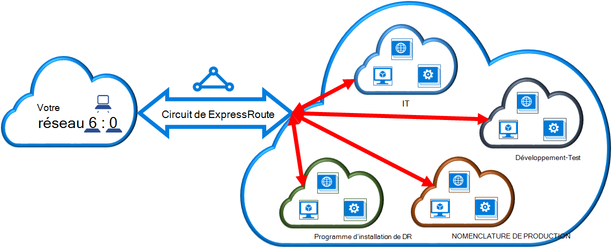

<properties
   pageTitle="Lier un réseau virtuel à un circuit de ExpressRoute à l’aide du modèle de déploiement classique et PowerShell | Microsoft Azure"
   description="Ce document fournit une vue d’ensemble de la façon de lier des réseaux virtuels (VNets) aux circuits de ExpressRoute à l’aide du modèle de déploiement classique et PowerShell."
   services="expressroute"
   documentationCenter="na"
   authors="ganesr"
   manager="carmonm"
   editor=""
   tags="azure-service-management"/>
<tags
   ms.service="expressroute"
   ms.devlang="na"
   ms.topic="article"
   ms.tgt_pltfrm="na"
   ms.workload="infrastructure-services"
   ms.date="10/10/2016"
   ms.author="ganesr" />

# Lier un réseau virtuel à un circuit de ExpressRoute

> [AZURE.SELECTOR]
- [Azure Portal - Gestionnaire de ressources](expressroute-howto-linkvnet-portal-resource-manager.md)
- [PowerShell - Gestionnaire de ressources](expressroute-howto-linkvnet-arm.md)
- [PowerShell - classique](expressroute-howto-linkvnet-classic.md)

Cet article vous aidera à lier des réseaux virtuels (VNets) pour circuits d’Azure ExpressRoute en utilisant le modèle de déploiement classique et PowerShell. Les réseaux virtuels peuvent être dans le même abonnement ou peuvent faire partie d’un autre abonnement.

**À propos des modèles de déploiement d’Azure**

[AZURE.INCLUDE [vpn-gateway-clasic-rm](../../includes/vpn-gateway-classic-rm-include.md)]

## Configuration préalable

1. Vous avez besoin de la dernière version des modules PowerShell d’Azure. Vous pouvez télécharger les derniers modules de PowerShell à partir de la section PowerShell de la [page de téléchargements d’Azure](https://azure.microsoft.com/downloads/). Suivez les instructions pour obtenir des instructions étape par étape [comment installer et configurer Azure PowerShell](../powershell-install-configure.md) sur la façon de configurer votre ordinateur pour utiliser les modules PowerShell d’Azure.
2. Vous devez passer en revue les [conditions requises](expressroute-prerequisites.md), [exigences de gamme](expressroute-routing.md)et [des flux de travail](expressroute-workflows.md) avant de commencer la configuration.
3. Vous devez disposer d’un circuit de ExpressRoute actif.
    - Suivez les instructions pour [créer un circuit de ExpressRoute](expressroute-howto-circuit-classic.md) et à ce que votre fournisseur de connectivité Active le circuit.
    - Vérifiez que vous disposez d’Azure peering privé configuré pour votre circuit. Voir l’article [configurer le routage](expressroute-howto-routing-classic.md) pour instructions de routage.
    - Assurez-vous que peering privé Azure est configuré et l’homologation BGP entre votre réseau et de Microsoft est afin que vous pouvez activer la connectivité de bout en bout.
    - Vous devez disposer d’un réseau virtuel et une passerelle réseau virtuel créé et entièrement mis en service. Suivez les instructions pour [configurer un réseau virtuel pour ExpressRoute](expressroute-howto-vnet-portal-classic.md).

Vous pouvez lier jusqu'à 10 réseaux virtuels pour un circuit de ExpressRoute. Tous les réseaux virtuels doivent être dans la même région géopolitique. Vous pouvez lier un plus grand nombre de réseaux virtuels pour votre circuit ExpressRoute ou lien réseaux virtuels dans d’autres régions géopolitiques si vous avez activé le module complémentaire premium de ExpressRoute. Consultez le [Forum aux questions](expressroute-faqs.md) pour plus d’informations sur le complément de la prime.

## Connectez un réseau virtuel dans l’abonnement même à un circuit

Vous pouvez lier un réseau virtuel à un circuit de ExpressRoute à l’aide de l’applet de commande suivant. Vérifiez que la passerelle réseau virtuel est créée et qu’il est prête pour la liaison avant d’exécuter l’applet de commande.

    New-AzureDedicatedCircuitLink -ServiceKey "*****************************" -VNetName "MyVNet"
    Provisioned

## Connectez un réseau virtuel dans un autre abonnement à un circuit

Vous pouvez partager un circuit ExpressRoute sur plusieurs abonnements. La figure suivante illustre une simple principe de fonctionnement du partage pour des circuits de ExpressRoute au sein de plusieurs abonnements.

Chacun des plus petits nuages dans le nuage de grande taille est utilisé pour représenter les abonnements appartenant à différents départements au sein d’une organisation. Chacun des services au sein de l’organisation peut utiliser leur propre abonnement pour déployer leurs services, mais les services peut partager un même circuit ExpressRoute pour vous connecter à votre réseau local. Un seul département (dans cet exemple : IT) peut posséder le circuit de ExpressRoute. Autres abonnements au sein de l’organisation peuvent utiliser le circuit de ExpressRoute.

>[AZURE.NOTE] Les frais de connectivité et de bande passante pour le circuit dédié seront appliqueront au propriétaire du circuit de ExpressRoute. Tous les réseaux virtuels partagent la même bande passante.

### Administration

Le *propriétaire du circuit* est l’administrateur/coadministrator de l’abonnement dans lequel le circuit ExpressRoute est créé. Le propriétaire du circuit peut autoriser des administrateurs/coadministrators des autres abonnements, appelés *utilisateurs du circuit*, pour utiliser le circuit dédié qu’ils possèdent. CIRCUIT les utilisateurs autorisés à utiliser le circuit de ExpressRoute de l’organisation peuvent lier le réseau virtuel dans leur abonnement au circuit de ExpressRoute une fois qu’ils sont autorisés.

Le propriétaire de circuit a la possibilité de modifier et de révoquer des autorisations à tout moment. Révocation d’une autorisation entraîne tous les liens sont en cours de suppression de l’abonnement dont l’accès a été révoqué.

### Opérations de propriétaire de circuit

#### Création d’une autorisation

Le propriétaire du circuit autorise les administrateurs des autres abonnements à utiliser le circuit spécifié. Dans l’exemple suivant, l’administrateur du circuit (informatique de Contoso) permet à l’administrateur d’un autre abonnement (Dev-Test) pour lier deux réseaux virtuels pour le circuit. Cela permet à l’administrateur informatique de Contoso en spécifiant l’ID de Test de développement Microsoft. L’applet de commande n’envoyer un e-mail à l’ID spécifié de Microsoft. Le propriétaire du circuit doit explicitement notifier à l’autre propriétaire d’abonnement que l’autorisation est terminée.

    New-AzureDedicatedCircuitLinkAuthorization -ServiceKey "**************************" -Description "Dev-Test Links" -Limit 2 -MicrosoftIds 'devtest@contoso.com'

    Description         : Dev-Test Links
    Limit               : 2
    LinkAuthorizationId : **********************************
    MicrosoftIds        : devtest@contoso.com
    Used                : 0

#### Vérification des autorisations

Le propriétaire du circuit peut examiner toutes les autorisations qui sont délivrées sur un circuit particulier en exécutant l’applet de commande suivante :

    Get-AzureDedicatedCircuitLinkAuthorization -ServiceKey: "**************************"

    Description         : EngineeringTeam
    Limit               : 3
    LinkAuthorizationId : ####################################
    MicrosoftIds        : engadmin@contoso.com
    Used                : 1

    Description         : MarketingTeam
    Limit               : 1
    LinkAuthorizationId : @@@@@@@@@@@@@@@@@@@@@@@@@@@@@@@@@@@@
    MicrosoftIds        : marketingadmin@contoso.com
    Used                : 0

    Description         : Dev-Test Links
    Limit               : 2
    LinkAuthorizationId : &&&&&&&&&&&&&&&&&&&&&&&&&&&&&&&&&&&&
    MicrosoftIds        : salesadmin@contoso.com
    Used                : 2

#### Mise à jour des autorisations

Le propriétaire de circuit peut modifier les autorisations à l’aide de l’applet de commande suivante :

    Set-AzureDedicatedCircuitLinkAuthorization -ServiceKey "**************************" -AuthorizationId "&&&&&&&&&&&&&&&&&&&&&&&&&&&&"-Limit 5

    Description         : Dev-Test Links
    Limit               : 5
    LinkAuthorizationId : &&&&&&&&&&&&&&&&&&&&&&&&&&&&&&&&&&&&&&
    MicrosoftIds        : devtest@contoso.com
    Used                : 0

#### Suppression des autorisations

Le propriétaire du circuit peut révoquer/supprimer les autorisations à l’utilisateur en exécutant l’applet de commande suivante :

    Remove-AzureDedicatedCircuitLinkAuthorization -ServiceKey "*****************************" -AuthorizationId "###############################"

### Opérations de l’utilisateur de circuit

#### Vérification des autorisations

L’utilisateur de circuit peut consulter les autorisations à l’aide de l’applet de commande suivante :

    Get-AzureAuthorizedDedicatedCircuit

    Bandwidth                        : 200
    CircuitName                      : ContosoIT
    Location                         : Washington DC
    MaximumAllowedLinks              : 2
    ServiceKey                       : &&&&&&&&&&&&&&&&&&&&&&&&&&&&&&&&&&&&
    ServiceProviderName              : equinix
    ServiceProviderProvisioningState : Provisioned
    Status                           : Enabled
    UsedLinks                        : 0

#### Rachat des autorisations de liaison

L’utilisateur de circuit peut exécuter l’applet de commande suivant pour bénéficier d’une autorisation de lien :

    New-AzureDedicatedCircuitLink –servicekey "&&&&&&&&&&&&&&&&&&&&&&&&&&" –VnetName 'SalesVNET1'

    State VnetName
    ----- --------
    Provisioned SalesVNET1

## Étapes suivantes

Pour plus d’informations sur ExpressRoute, consultez le [Forum aux questions sur ExpressRoute](expressroute-faqs.md).
