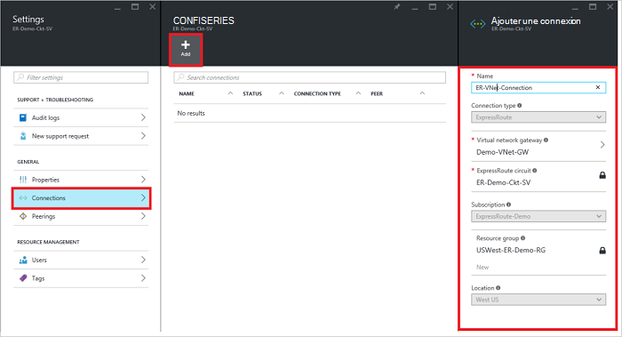
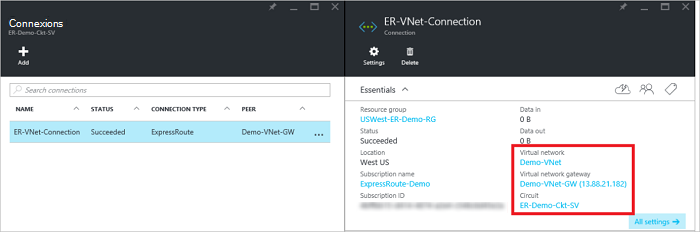

<properties
   pageTitle="Lier un réseau virtuel à un circuit de ExpressRoute à l’aide du modèle de déploiement du Gestionnaire de ressources et le portail Azure | Microsoft Azure"
   description="Ce document fournit une vue d’ensemble de la façon de lier des réseaux virtuels (VNets) aux circuits de ExpressRoute."
   services="expressroute"
   documentationCenter="na"
   authors="cherylmc"
   manager="carmonm"
   editor=""
   tags="azure-resource-manager"/>
<tags
   ms.service="expressroute"
   ms.devlang="na"
   ms.topic="article"
   ms.tgt_pltfrm="na"
   ms.workload="infrastructure-services"
   ms.date="10/10/2016"
   ms.author="cherylmc" />

# Lier un réseau virtuel à un circuit de ExpressRoute

> [AZURE.SELECTOR]
- [Azure Portal - Gestionnaire de ressources](expressroute-howto-linkvnet-portal-resource-manager.md)
- [PowerShell - Gestionnaire de ressources](expressroute-howto-linkvnet-arm.md)
- [PowerShell - classique](expressroute-howto-linkvnet-classic.md)

Cet article vous aidera à lier des réseaux virtuels (VNets) pour circuits d’Azure ExpressRoute en utilisant le modèle de déploiement du Gestionnaire de ressources et le portail Azure. Réseaux virtuels peuvent être dans le même abonnement, ou ils peuvent faire partie d’un autre abonnement.

**À propos des modèles de déploiement d’Azure**

[AZURE.INCLUDE [vpn-gateway-clasic-rm](../../includes/vpn-gateway-classic-rm-include.md)]

## Configuration préalable

- Assurez-vous que vous avez examiné les [conditions préalables](expressroute-prerequisites.md), [routage des exigences](expressroute-routing.md)et [des flux de travail](expressroute-workflows.md) avant de commencer la configuration.
- Vous devez disposer d’un circuit de ExpressRoute actif.
    - Suivez les instructions pour [créer un circuit ExpressRoute](expressroute-howto-circuit-arm.md) et ont le circuit activé par votre fournisseur de connectivité.

    - Vérifiez que vous disposez d’Azure peering privé configuré pour votre circuit. Voir l’article [configurer le routage](expressroute-howto-routing-portal-resource-manager.md) pour instructions de routage.

    - Assurez-vous que peering privé Azure est configuré et l’homologation BGP entre votre réseau et de Microsoft est afin que vous pouvez activer la connectivité de bout en bout.

    - Assurez-vous que vous disposez d’un réseau virtuel et une passerelle réseau virtuel créé et entièrement mis en service. Suivez les instructions pour créer une [passerelle VPN](../articles/vpn-gateway/vpn-gateway-howto-site-to-site-resource-manager-portal.md) (suivez uniquement étapes 1 à 5).

Vous pouvez lier jusqu'à 10 réseaux virtuels pour un circuit de ExpressRoute standard. Tous les réseaux virtuels doivent être dans la même région géopolitique lors de l’utilisation d’un circuit de ExpressRoute standard. Vous pouvez lier un réseaux virtuels en dehors de la région géopolitique du circuit ExpressRoute ou connecter un plus grand nombre de réseaux virtuels pour votre circuit ExpressRoute si vous avez activé le module complémentaire premium de ExpressRoute. Consultez le [Forum aux questions](expressroute-faqs.md) pour plus d’informations sur le complément de la prime.

## Connectez un réseau virtuel dans l’abonnement même à un circuit

### Pour créer une connexion

1. Assurez-vous que votre circuit de ExpressRoute et l’homologation privé Azure ont été configurés correctement. Suivez les instructions dans [un circuit de ExpressRoute de créer](expressroute-howto-circuit-arm.md) et de [configurer le routage](expressroute-howto-routing-arm.md). Votre circuit ExpressRoute doit ressembler à l’image suivante.

    

    >[AZURE.NOTE] Les informations de configuration BGP s’affichera pas si le fournisseur de couche 3 configuré votre peerings. Si votre circuit est dans un état de mise en service, doit vous permettre de créer des connexions.

2. Vous pouvez maintenant démarrer une connexion entre votre passerelle réseau virtuel à votre ExpressRoute de circuit de mise en service. Cliquez sur **la connexion** > **Ajouter** pour ouvrir la blade **d’Ajouter une connexion** , puis configurer les valeurs. Consultez l’exemple de référence suivant.

      

3. Une fois que votre connexion a été correctement configurée, votre objet de connexion affiche les informations pour la connexion.

    

### Pour supprimer une connexion

Vous pouvez supprimer une connexion en sélectionnant l’icône **Supprimer** sur la lame pour votre connexion.

## Connectez un réseau virtuel dans un autre abonnement à un circuit

À ce stade, vous ne peut pas connecter des réseaux virtuels sur abonnements via le portail Azure. Toutefois, vous pouvez utiliser PowerShell pour cela. Consultez l’article [PowerShell](expressroute-howto-linkvnet-arm.md) pour plus d’informations.

## Étapes suivantes

Pour plus d’informations sur ExpressRoute, consultez le [Forum aux questions sur ExpressRoute](expressroute-faqs.md).
