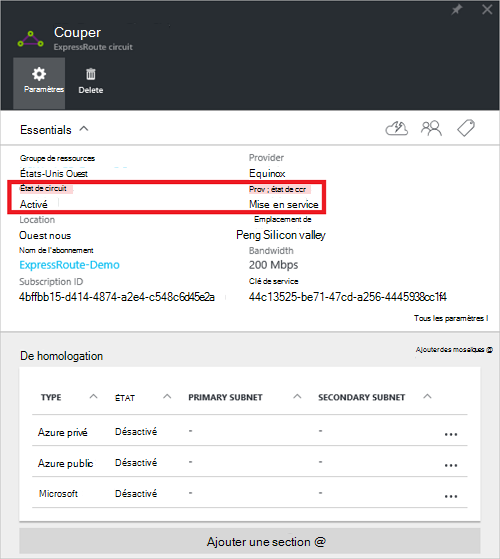
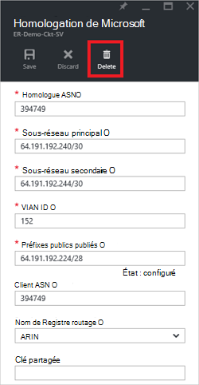

<properties
   pageTitle="Comment faire pour configurer le routage pour un circuit de ExpressRoute à l’aide du portail Azure | Microsoft Azure"
   description="Cet article vous guide à travers les étapes de création et de mise en service privé, public et Microsoft homologation d’un circuit de ExpressRoute. Cet article vous montre également comment vérifier l’état de la mise à jour ou de supprimer des peerings pour votre circuit."
   documentationCenter="na"
   services="expressroute"
   authors="cherylmc"
   manager="carmonm"
   editor=""
   tags="azure-resource-manager"/>
<tags
   ms.service="expressroute"
   ms.devlang="na"
   ms.topic="hero-article" 
   ms.tgt_pltfrm="na"
   ms.workload="infrastructure-services"
   ms.date="10/10/2016"
   ms.author="cherylmc"/>

# Créer et modifier le routage pour un circuit de ExpressRoute

> [AZURE.SELECTOR]
[Azure Portal - Gestionnaire de ressources](expressroute-howto-routing-portal-resource-manager.md)
[PowerShell - Gestionnaire de ressources](expressroute-howto-routing-arm.md)
[PowerShell - classique](expressroute-howto-routing-classic.md)

Cet article vous guide tout au long de la procédure pour créer et gérer la configuration du routage pour un circuit de ExpressRoute à l’aide du portail Azure et le modèle de déploiement du Gestionnaire de ressources.

**À propos des modèles de déploiement d’Azure**

[AZURE.INCLUDE [vpn-gateway-clasic-rm](../../includes/vpn-gateway-classic-rm-include.md)] 

## Configuration préalable

- Assurez-vous que vous avez examiné la page [Configuration requise](expressroute-prerequisites.md) , la page [routage de configuration requise](expressroute-routing.md) et la page [flux de travail](expressroute-workflows.md) avant de commencer la configuration.
- Vous devez disposer d’un circuit de ExpressRoute actif. Suivez les instructions pour [créer un circuit ExpressRoute](expressroute-howto-circuit-arm.md) et ont le circuit activé par votre fournisseur de connectivité avant de continuer. Le circuit de ExpressRoute doit être dans un état de mise en service et activé pour vous permettre d’être en mesure d’exécuter les applets de commande décrites ci-dessous.

Ces instructions s’appliquent uniquement aux circuits créés avec les prestataires de services proposant des services de connectivité de couche 2. Si vous utilisez un fournisseur de services offrant des services gérés de couche 3 (en général un IPVPN, comme MPLS), votre fournisseur de connectivité configurer et gérer le routage pour vous. 

>[AZURE.IMPORTANT] Actuellement, nous n’effectuent pas de peerings configurés par les fournisseurs de service via le portail de gestion de service. Nous travaillons sur l’activation de cette fonctionnalité bientôt. Veuillez vérifier avec votre fournisseur de services avant de configurer le protocole BGP peerings.

Vous pouvez configurer une, deux ou tous les trois peerings (public de privé, Azure Azure et Microsoft) pour un circuit de ExpressRoute. Vous pouvez configurer les peerings dans n’importe quel ordre que vous choisissez. Toutefois, il se peut que vous devez vous assurer de procéder à la configuration de chaque homologation à la fois. 

## Homologation privé Azure

Cette section fournit des instructions sur la façon de créer, obtenir, mettre à jour et supprimer la configuration d’homologation privée Azure pour un circuit de ExpressRoute. 

### Pour créer une homologation privé Azure

1. Configurer le circuit de ExpressRoute. Assurez-vous que le circuit est entièrement mis en service par le fournisseur de connectivité avant de continuer.

    

2. Configurer une homologation privé Azure pour le circuit. Assurez-vous d’avoir les éléments suivants avant de procéder aux étapes suivantes :

    - Un /30 sous-réseau pour le lien principal. Cela ne doit pas être partie de n’importe quel espace d’adressage réservé pour les réseaux virtuels.
    - Un /30 sous-réseau pour le lien secondaire. Cela ne doit pas être partie de n’importe quel espace d’adressage réservé pour les réseaux virtuels.
    - Un ID de réseau VLAN valide pour établir cette homologation sur. S’assurer qu’aucune homologation du circuit n’utilise le même ID de VLAN.
    - En tant que numéro d’homologation. Vous pouvez utiliser 2 octets et de 4 octets sous forme de nombres. Vous pouvez utiliser une privée en tant que numéro de cette homologation. Assurez-vous que vous n’utilisez pas 65515.
    - Un hachage MD5, si vous choisissez d’en utiliser un. **Cette option est facultative**.

3. Sélectionnez la ligne homologation Azure privée, comme illustré ci-dessous.
    
    
    

4. Configurer l’homologation privé. L’illustration ci-dessous montre un exemple de configuration.

    

    
5. Enregistrer la configuration une fois que vous avez spécifié tous les paramètres. Une fois que la configuration a été acceptée, vous verrez quelque chose de similaire à l’exemple ci-dessous.

    
    

### Pour afficher les détails de homologation privés Azure

Vous pouvez afficher les propriétés d’une homologation privé Azure en sélectionnant l’homologation.

### Pour mettre à jour la configuration de homologation privée Azure

Vous pouvez sélectionner la ligne pour l’homologation et modifier les propriétés d’homologation. 

### Pour supprimer une homologation privé Azure

Vous pouvez supprimer votre configuration homologation en sélectionnant l’icône de suppression comme indiqué ci-dessous.

## Homologation public Azure

Cette section fournit des instructions sur la façon de créer, obtenir, mettre à jour et supprimer la configuration d’homologation publique Azure pour un circuit de ExpressRoute. 

### Pour créer une homologation public Azure

1. Configurer le circuit de ExpressRoute. Assurez-vous que le circuit est entièrement mis en service par le fournisseur de connectivité avant de poursuivre plus.

    

2. Configurer une homologation public Azure pour le circuit. Assurez-vous d’avoir les éléments suivants avant de procéder aux étapes suivantes :

    - Un /30 sous-réseau pour le lien principal. 
    - Un /30 sous-réseau pour le lien secondaire. 
    - Toutes les adresses IP sont utilisées pour configurer cette homologation doivent être des adresses IPv4 publiques valides.
    - Un ID de réseau VLAN valide pour établir cette homologation sur. S’assurer qu’aucune homologation du circuit n’utilise le même ID de VLAN.
    - En tant que numéro d’homologation. Vous pouvez utiliser 2 octets et de 4 octets sous forme de nombres.
    - Un hachage MD5, si vous choisissez d’en utiliser un. **Cette option est facultative**.

3. Sélectionnez la ligne d’homologation publique Azure, comme indiqué ci-dessous.
    
    
    

4. Configurer l’homologation public. L’illustration ci-dessous montre un exemple de configuration.

    

    
5. Enregistrer la configuration une fois que vous avez spécifié tous les paramètres. Une fois que la configuration a été acceptée, vous verrez quelque chose de similaire à l’exemple ci-dessous.

    
    

### Pour afficher les détails de homologation publics Azure

Vous pouvez afficher les propriétés d’une homologation public Azure en sélectionnant l’homologation.

### Pour mettre à jour la configuration de homologation publique Azure

Vous pouvez sélectionner la ligne pour l’homologation et modifier les propriétés d’homologation. 

### Pour supprimer une homologation public Azure

Vous pouvez supprimer votre configuration homologation en sélectionnant l’icône de suppression comme indiqué ci-dessous.

## Homologation de Microsoft

Cette section fournit des instructions sur la façon de créer, obtenir, mettre à jour et supprimer la configuration d’homologation Microsoft pour un circuit de ExpressRoute. 

### Pour créer l’homologation de Microsoft

1. Configurer le circuit de ExpressRoute. Assurez-vous que le circuit est entièrement mis en service par le fournisseur de connectivité avant de poursuivre plus.

    

2. Configurer l’homologation pour le circuit de Microsoft. Assurez-vous que vous disposez des informations suivantes avant de continuer.

    - Un /30 sous-réseau pour le lien principal. Il doit s’agir d’un préfixe de IPv4 publique valide dont vous êtes propriétaire et inscrit dans un registre Internet régional / tri.
    - Un /30 sous-réseau pour le lien secondaire. Il doit s’agir d’un préfixe de IPv4 publique valide dont vous êtes propriétaire et inscrit dans un registre Internet régional / tri.
    - Un ID de réseau VLAN valide pour établir cette homologation sur. S’assurer qu’aucune homologation du circuit n’utilise le même ID de VLAN.
    - En tant que numéro d’homologation. Vous pouvez utiliser 2 octets et de 4 octets sous forme de nombres.
    - **Annonce les préfixes :** Vous devez fournir une liste de tous les préfixes que vous envisagez de faire de la publicité sur la session BGP. Seuls les préfixes d’adresse IP publiques sont acceptés. Vous pouvez envoyer une liste séparée par des virgules si vous envisagez d’envoyer un jeu de préfixes. Ces préfixes doivent être enregistrés pour vous dans un registre Internet régional / tri.
    - **Client ASN :** Si vous ne les préfixes de publicité qui ne sont pas enregistrés pour l’homologation en tant que nombre, vous pouvez spécifier le nombre en tant qu’auquel ils sont inscrits. **Cette option est facultative**.
    - **Nom de routage du Registre :** Vous pouvez spécifier le RIR / tri par rapport à laquelle le nombre et les préfixes sont enregistrés. **Cette option est facultative.**
    - Un hachage MD5, si vous choisissez d’en utiliser un. **Cette option est facultative.**
    
3. Vous pouvez sélectionner l’homologation que vous souhaitez configurer comme indiqué ci-dessous. Sélectionnez la ligne d’homologation Microsoft.
    
    
    

4.  Configurer l’homologation de Microsoft. L’illustration ci-dessous montre un exemple de configuration.

    

    
5. Enregistrer la configuration une fois que vous avez spécifié tous les paramètres. 

    Si votre circuit obtient à une validation nécessaire d’état (comme illustré ci-dessous), vous devez ouvrir un ticket de support pour prouver la possession des préfixes à notre équipe de support.  
    
    

    Vous pouvez ouvrir un ticket de support directement depuis le portail comme indiqué ci-dessous   
    
    

6. Une fois que la configuration a été acceptée, vous verrez quelque chose de similaire à l’exemple ci-dessous.

    
    

### Pour afficher les détails d’homologation Microsoft

Vous pouvez afficher les propriétés d’une homologation public Azure en sélectionnant l’homologation.

### Mise à jour de configuration d’homologation Microsoft

Vous pouvez sélectionner la ligne pour l’homologation et modifier les propriétés d’homologation. 

### Pour supprimer Microsoft homologation

Vous pouvez supprimer votre configuration homologation en sélectionnant l’icône de suppression comme indiqué ci-dessous.

## Étapes suivantes

Étape suivante, [un VNet d’un circuit de ExpressRoute de lien](expressroute-howto-linkvnet-arm.md).

-  Pour plus d’informations à propos des workflows de ExpressRoute afficher le [flux de travail de ExpressRoute](expressroute-workflows.md).

-  Pour plus d’informations sur le circuit d’homologation, voir [circuits de ExpressRoute et de domaines de routage](expressroute-circuit-peerings.md).

-  Pour plus d’informations sur l’utilisation de réseaux virtuels, consultez [vue d’ensemble du réseau virtuel](../virtual-network/virtual-networks-overview.md).

