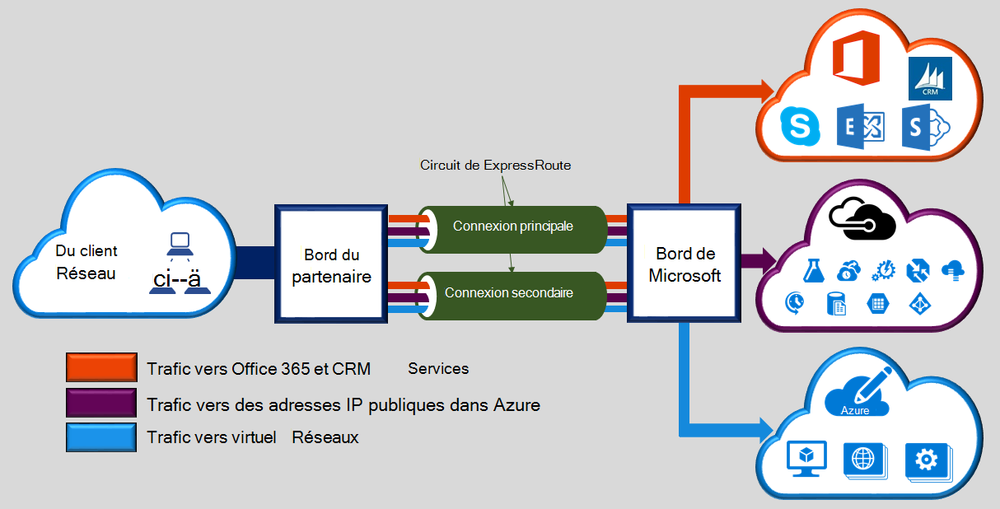
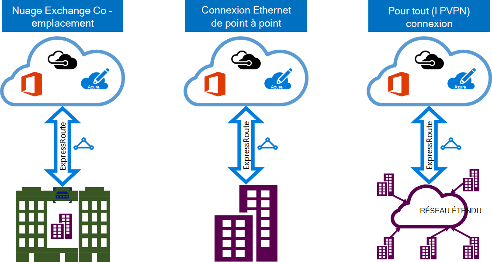

<properties 
   pageTitle="Introduction à ExpressRoute | Microsoft Azure"
   description="Cette page fournit une vue d’ensemble du service ExpressRoute, y compris comment fonctionne une connexion ExpressRoute."
   documentationCenter="na"
   services="expressroute"
   authors="cherylmc"
   manager="carmonm"
   editor=""/>
<tags 
   ms.service="expressroute"
   ms.devlang="na"
   ms.topic="get-started-article" 
   ms.tgt_pltfrm="na"
   ms.workload="infrastructure-services" 
   ms.date="10/10/2016"
   ms.author="cherylmc"/>

# Vue d’ensemble technique de ExpressRoute

Microsoft Azure ExpressRoute vous permet d’étendre vos réseaux locaux dans le nuage de Microsoft via une connexion privée dédiée facilitée par un fournisseur de connectivité. ExpressRoute, vous pouvez établir des connexions aux services de cloud de Microsoft, comme Microsoft Azure, Office 365 et CRM en ligne. Connectivité peut provenir d’un réseau (IP VPN) pour tout, un réseau Ethernet de point à point ou une connexion croisée virtuelle via un fournisseur de connectivité dans un centre de colocalisation. ExpressRoute les connexions ne passent pas sur l’Internet public. Cela permet des connexions ExpressRoute offre plus la fiabilité, vitesses plus rapides, des latences inférieurs et une plus grande sécurité que les connexions classiques sur Internet.

**Les principaux avantages sont :**

- Couche 3 connectivité entre votre réseau local et le Cloud Microsoft via un fournisseur de connectivité. La connectivité peut être à partir d’un réseau (IPVPN) à tout, une connexion Ethernet, ou via une connexion de cross virtuelle via un échange Ethernet.
- Connexion aux services de cloud de Microsoft dans toutes les régions dans la région géopolitique.
- Connectivité globale pour les services Microsoft dans toutes les régions avec complémentaire de ExpressRoute.
- Routage entre votre réseau et de Microsoft sur des protocoles standard (BGP) dynamique.
- Redondance intégrée dans chaque emplacement pour optimiser la fiabilité d’homologation.
- Disponibilité de connexion [SLA](https://azure.microsoft.com/support/legal/sla/).
- Qualité de service et de prise en charge de plusieurs classes de service pour des applications particulières, comme Skype pour les entreprises.

Consultez le [Forum aux questions sur ExpressRoute](expressroute-faqs.md) pour plus de détails.

## Comment puis-je me connecter mon réseau Microsoft à l’aide de ExpressRoute ?

Vous pouvez créer une connexion entre votre réseau local et le nuage Microsoft de trois façons différentes :

### Se trouver à un échange de nuage

Si vous sont localisés dans une installation avec un échange de nuage, vous pouvez commander des traverses virtuels vers le nuage Microsoft via exchange d’Ethernet du fournisseur de la colocalisation. Les fournisseurs de colocalisation peuvent offrir des traverses de couche 2 soit géré de couche 3 entre connexions entre votre infrastructure dans les installations de colocalisation et le nuage Microsoft.

### Connexions Ethernet de point à point 

Vous pouvez vous connecter à vos centres de données de locaux/distants vers le nuage Microsoft via des liaisons Ethernet de point à point. Fournisseurs de Ethernet de point à point peuvent offrir des connexions de couche 2, ou gestion des connexions de couche 3 entre votre site et le nuage Microsoft.

### Réseaux (IPVPN) à tout

Vous pouvez intégrer votre réseau étendu avec le nuage de Microsoft. Fournisseurs de IPVPN (généralement des VPN MPLS) offrent une connectivité à tout entre vos sites distants et les centres de données. Le cloud Microsoft peut être interconnecté pour votre réseau étendu pour qu’elle ressemble à l’instar des autres succursales. Fournisseurs de réseau étendus offrent généralement gérée connectivité de couche 3. Fonctionnalités et fonctions de ExpressRoute sont toutes identiques sur l’ensemble des modèles de connectivité ci-dessus. 

Fournisseurs de connectivité peuvent proposer un ou plusieurs modèles de connectivité. Vous pouvez travailler avec votre fournisseur de connectivité pour choisir le modèle qui vous convient le mieux.

## Fonctionnalités de ExpressRoute

ExpressRoute prend en charge les fonctionnalités suivantes : 

### Connectivité de la couche 3

Microsoft utilise dynamic routage protocole standard (BGP) pour échanger des itinéraires entre votre réseau local, vos instances dans Azure et Microsoft adresses publiques.  Nous établir plusieurs sessions BGP avec votre réseau pour les profils de trafic différent. Vous trouverez plus de détails dans l’article [de circuit de ExpressRoute et de domaines de routage](expressroute-circuit-peerings.md) .

### Redondance

Chaque circuit de ExpressRoute se compose de deux connexions à deux routeurs de bord de Microsoft Enterprise (MSEEs) à partir du fournisseur de connectivité / votre réseau de bord. Microsoft nécessite une connexion BGP double à partir du fournisseur de connectivité / votre côté : une pour chaque MSEE. Vous pouvez choisir de ne pas déployer les dispositifs redondants / Ethernet des circuits à votre fin. Cependant, les fournisseurs de connectivité utilisent des dispositifs redondants pour vous assurer que vos connexions sont remises à Microsoft de manière redondante. Une configuration de connectivité redondante de couche 3 est une exigence pour notre [SLA](https://azure.microsoft.com/support/legal/sla/) être valide. 

### Connexion aux services de cloud de Microsoft

[AZURE.INCLUDE [expressroute-office365-include](../../includes/expressroute-office365-include.md)]

Connexions de ExpressRoute activer l’accès aux services suivants :

- Services Microsoft Azure
- Services Microsoft Office 365
- Services en ligne de Microsoft CRM 
 
Vous pouvez visiter la page [Forum aux questions sur ExpressRoute](expressroute-faqs.md) pour obtenir la liste des services pris en charge sur ExpressRoute.

### Connectivité à toutes les zones au sein d’une région géopolitique

Vous pouvez vous connecter à Microsoft dans un de nos [emplacements homologation](expressroute-locations.md) et ont accès à toutes les régions au sein de la région géopolitique. 

Par exemple, si vous connecté à Microsoft d’Amsterdam par le biais de ExpressRoute, vous aurez accès à tous les services de cloud Microsoft hébergé dans l’Europe du Nord et en Europe. Consultez l’article [ExpressRoute partenaires et emplacements d’homologation](expressroute-locations.md) pour une vue d’ensemble des régions géopolitiques, régions de cloud Microsoft associées et homologation ExpressRoute emplacement.

### Connectivité globale avec complémentaire de ExpressRoute

Vous pouvez activer la fonctionnalité de module complémentaire ExpressRoute prime étendre la connectivité sur des limites géopolitiques. Par exemple, si vous êtes connecté à Microsoft d’Amsterdam par le biais de ExpressRoute, vous aurez accès à tous les services de cloud Microsoft hébergé dans toutes les régions du monde (nuages nationales sont exclus). Vous pouvez accéder à services déployés en Amérique du Sud ou de l’Australie de la même façon que vous accédez les régions du Nord et Europe de l’ouest.

### Écosystème de partenaires riche connectivité

ExpressRoute a un écosystème toujours croissant de fournisseurs de la connectivité et les partenaires intégrateurs de systèmes. Vous pouvez faire référence à l’article [emplacements et fournisseurs de ExpressRoute](expressroute-locations.md) pour obtenir les dernières informations.

### Connectivité à nuages nationales

Microsoft opère des environnements de nuage isolé pour les régions géopolitiques particulières et les segments de clientèle. Reportez-vous à la page de [sites et fournisseurs de ExpressRoute](expressroute-locations.md) pour obtenir la liste des nuages nationales et des fournisseurs.

### Options de prise en charge de la bande passante

Vous pouvez acheter des circuits de ExpressRoute pour un large éventail de bandes passantes. Vous trouverez ci-dessous la liste des bandes passantes pris en charge. Veillez à vérifier auprès de votre fournisseur de connectivité pour déterminer la liste de largeur de bande pris en charge qu’ils fournissent.

- 50 Mbits/s
- 100 Mbits/s
- 200 Mbits/s
- 500 Mbps
- 1 Gbit/s
- 2 Gbits/s
- Gbit/5 s
- 10 Gbits/s

### Mise à l’échelle d’une dynamique de bande passante

Vous avez la possibilité d’augmenter la bande passante du circuit ExpressRoute (selon le meilleur effort) sans avoir à détruire vos connexions. 

### Modèles de facturation souples

Vous pouvez choisir un modèle de facturation qui vous convient le mieux. Choisissez entre les modèles de facturation ci-dessous. Reportez-vous à la page du [Forum aux questions sur ExpressRoute](expressroute-faqs.md) pour plus de détails. 

- **Données illimité**. Le circuit de ExpressRoute est facturé selon un abonnement mensuel, et de tous les transferts de données entrant et sortant sont inclus gratuitement. 
- **Données de Metered**. Le circuit de ExpressRoute est facturé selon un forfait mensuel. Tous les transferts de données entrantes sont gratuit. Transfert de données sortant est facturé par Go de transfert de données. Taux de transfert de données varient selon la région.
- **Complémentaire de ExpressRoute**. La prime de ExpressRoute est un module complémentaire sur le circuit de ExpressRoute. Le complément de la prime ExpressRoute fournit les fonctions suivantes : 
    - Limites d’itinéraire accrue pour Azure publique et Azure privé homologation à partir de gammes de 4 000 à 10 000 itinéraires.
    - Connectivité globale pour les services. Un circuit de ExpressRoute créé dans n’importe quelle région (à l’exclusion des nuages nationales) ont accès aux ressources sur n’importe quelle autre région dans le monde. Par exemple, un réseau virtuel est créé à l’Europe de l’ouest sont accessibles via un circuit ExpressRoute mis en service dans la Silicon Valley.
    - Augmentation du nombre de liens de VNet par circuit de ExpressRoute à partir de 10 à une limite supérieure, en fonction de la bande passante du circuit.

## Étapes suivantes

- Obtenir des informations sur les connexions de ExpressRoute et de domaines de routage. Consultez [les circuits de ExpressRoute et de domaines de routage](expressroute-circuit-peerings.md).
- Trouver un fournisseur de services. Consultez [ExpressRoute partenaires et emplacements d’homologation](expressroute-locations.md).
- Assurez-vous que toutes les conditions préalables sont remplies. Reportez-vous à la section [conditions préalables de ExpressRoute](expressroute-prerequisites.md).
- Reportez-vous à la configuration requise pour le [routage](expressroute-routing.md), [NAT](expressroute-nat.md) et [QoS](expressroute-qos.md).
- Configurez votre connexion ExpressRoute.
    - [Créer un circuit de ExpressRoute](expressroute-howto-circuit-classic.md)
    - [Configurer le routage](expressroute-howto-routing-classic.md)
    - [Lier un VNet d’un circuit de ExpressRoute](expressroute-howto-linkvnet-classic.md)
