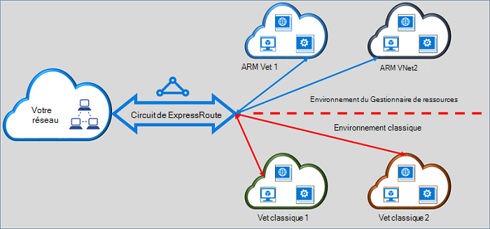

<properties
   pageTitle="Déplacement des circuits de ExpressRoute de classique pour le Gestionnaire de ressources | Microsoft Azure"
   description="Cette page fournit une vue d’ensemble de ce que vous devez savoir sur la transition standard et les modèles de déploiement du Gestionnaire de ressources."
   documentationCenter="na"
   services="expressroute"
   authors="ganesr"
   manager="carmonm"
   editor=""/>
<tags
   ms.service="expressroute"
   ms.devlang="na"
   ms.topic="get-started-article"
   ms.tgt_pltfrm="na"
   ms.workload="infrastructure-services"
   ms.date="10/10/2016"
   ms.author="ganesr"/>

# Déplacement des circuits de ExpressRoute de la classique pour le modèle de déploiement du Gestionnaire de ressources

Cet article fournit une vue d’ensemble de ce que cela signifie pour déplacer un circuit Azure ExpressRoute de standard pour le modèle de déploiement du Gestionnaire de ressources Azure.

[AZURE.INCLUDE [vpn-gateway-sm-rm](../../includes/vpn-gateway-classic-rm-include.md)]

Vous pouvez utiliser un seul circuit ExpressRoute pour vous connecter à des réseaux virtuels sont déployés à la fois dans le classique et les modèles de déploiement du Gestionnaire de ressources. Un circuit de ExpressRoute, quelle que soit la façon dont il est créé, permet désormais de lier aux réseaux virtuels entre les deux modèles de déploiement.

## Circuits de ExpressRoute qui sont créées dans le modèle de déploiement classique

Circuits ExpressRoute qui sont créées dans le modèle de déploiement classique doivent être déplacés vers le modèle de déploiement du Gestionnaire de ressources, tout d’abord, pour activer la connectivité à la fois standard et les modèles de déploiement du Gestionnaire de ressources. Il n’est pas une perte de connectivité ou d’interruption de service lorsqu’une connexion est déplacée. Tous les liens de réseau circuit-vers-virtuel dans le modèle de déploiement classique (dans le même abonnement et cross-subscription) sont conservés.

Après que le déplacement est effectué avec succès, le circuit ExpressRoute recherche, exécute et semble identique à un circuit de ExpressRoute qui a été créé dans le modèle de déploiement du Gestionnaire de ressources. Vous pouvez maintenant créer des connexions à des réseaux virtuels dans le modèle de déploiement du Gestionnaire de ressources.

Après une ExpressRoute circuit a été déplacé vers le modèle de déploiement Gestionnaire de ressources, vous pouvez gérer le cycle de vie du circuit ExpressRoute uniquement en utilisant le modèle de déploiement du Gestionnaire de ressources. Cela signifie que vous pouvez effectuer des opérations telles que l’ajout, mise à jour/suppression peerings, mise à jour des propriétés de circuit (par exemple, la bande passante, SKU et type de facturation) et la suppression des circuits uniquement dans le modèle de déploiement du Gestionnaire de ressources. Reportez-vous à la section ci-dessous sur les circuits qui sont créées dans le modèle de gestionnaire de ressources de déploiement pour plus de détails sur comment vous pouvez gérer l’accès pour les deux modèles de déploiement.

Vous n’êtes pas obligé d’impliquent de votre fournisseur de connectivité pour effectuer le déplacement.

## Circuits de ExpressRoute qui sont créées dans le modèle de déploiement du Gestionnaire de ressources

Vous pouvez activer des circuits ExpressRoute qui sont créées dans le modèle de déploiement Gestionnaire de ressources soient accessibles à partir de ces deux modèles de déploiement. Tout circuit ExpressRoute de votre abonnement peut être activé accessible à partir de ces deux modèles de déploiement.

- Circuits de ExpressRoute qui ont été créés dans le modèle de déploiement du Gestionnaire de ressources n’ont pas d’accès au modèle classique de déploiement par défaut.
- Circuits de ExpressRoute qui ont été déplacés à partir du modèle de déploiement classique pour le modèle de déploiement de gestionnaire de ressources sont accessibles à partir de ces deux modèles de déploiement par défaut.
- Un circuit de ExpressRoute a toujours accès au modèle de déploiement du Gestionnaire de ressources, indépendamment de si elle a été créée dans le Gestionnaire de ressources ou au modèle de déploiement classique. Cela signifie que vous pouvez créer des connexions à des réseaux virtuels créés dans le modèle de déploiement du Gestionnaire de ressources en suivant les instructions sur la [façon de lier des réseaux virtuels](expressroute-howto-linkvnet-arm.md).
- Accès au modèle de déploiement classique est contrôlé par le paramètre **allowClassicOperations** dans le circuit de ExpressRoute.

>[AZURE.IMPORTANT] Tous les quotas qui sont documentées dans la page [service limites](../azure-subscription-service-limits.md) s’appliquent. Par exemple, un circuit standard peut avoir au plus 10 liens/connexions de réseau virtuel sur le standard et les modèles de déploiement du Gestionnaire de ressources.

## Contrôle de l’accès au modèle de déploiement classique

Vous pouvez activer un seul circuit de ExpressRoute à lier à des réseaux virtuels dans les deux modèles de déploiement en définissant le paramètre **allowClassicOperations** du circuit ExpressRoute.

Paramètre **allowClassicOperations** sur TRUE vous permet de lier des réseaux virtuels à partir de ces deux modèles de déploiement au circuit de ExpressRoute. Vous pouvez lier à des réseaux virtuels dans le modèle de déploiement classique en suivant des conseils sur la [façon de lier des réseaux virtuels dans le modèle de déploiement classique](expressroute-howto-linkvnet-classic.md). Vous pouvez lier à des réseaux virtuels dans le modèle de déploiement du Gestionnaire de ressources en suivant les conseils sur la [façon de lier des réseaux virtuels dans le modèle de déploiement du Gestionnaire de ressources](expressroute-howto-linkvnet-arm.md).

Définition de **allowClassicOperations** sur FALSE blocage de l’accès au circuit à partir du modèle de déploiement classique. Toutefois, tous les liens de réseau virtuel dans le modèle de déploiement classique sont conservées. Dans ce cas, le circuit de ExpressRoute n’est pas visible dans le modèle de déploiement classique.

## Opérations prises en charge dans le modèle de déploiement classique

Les opérations classiques suivantes sont prises en charge sur un circuit de ExpressRoute lorsque **allowClassicOperations** est défini sur TRUE :

 - Obtenir des informations sur le circuit ExpressRoute
 - Réseau virtuel de créer/mettre à jour/get/supprimer des liens vers des réseaux de virtuels classiques
 - Autorisations de lien réseau virtuel de créer/mettre à jour/get/supprimer pour la connectivité de cross-abonnement

Impossible d’effectuer les opérations classiques suivantes lorsque **allowClassicOperations** a la valeur TRUE :

 - Créer/mettre à jour/get/supprimer les peerings de protocole BGP (Border Gateway) public, privé, Azure Azure et Microsoft peerings
 - Supprimer les circuits ExpressRoute

## Communication entre le classique et les modèles de déploiement du Gestionnaire de ressources

Le circuit ExpressRoute joue le rôle de pont entre le classique et les modèles de déploiement du Gestionnaire de ressources. Trafic entre les ordinateurs virtuels de réseaux virtuels dans le modèle de déploiement classique et ceux de réseaux virtuels dans les flux de modèle de déploiement de gestionnaire de ressources par l’intermédiaire de ExpressRoute si les deux réseaux virtuels est liés à la même circuit ExpressRoute.

Débit total est limité par la capacité de débit de la passerelle réseau virtuel. Le trafic n’entre pas du fournisseur connectivité ou vos réseaux dans de tels cas. Flux de trafic entre les réseaux virtuels est entièrement contenu dans le réseau de Microsoft.

## Accès du public Azure et les ressources d’homologation Microsoft

Vous pouvez continuer à accéder aux ressources qui sont en général accessibles via peering public Azure et Microsoft homologation sans aucune interruption.  

## Ce qui est pris en charge

Cette section décrit ce qui est pris en charge pour des circuits de ExpressRoute :

 - Vous pouvez utiliser un seul circuit ExpressRoute pour accéder aux réseaux virtuels qui sont déployés dans le classique et les modèles de déploiement du Gestionnaire de ressources.
 - Vous pouvez déplacer un circuit de ExpressRoute à partir de standard pour le modèle de déploiement du Gestionnaire de ressources. Après son déplacement, le circuit ExpressRoute recherche, semble et agit comme aucun autre circuit de ExpressRoute qui est créé dans le modèle de déploiement du Gestionnaire de ressources.
 - Vous pouvez déplacer uniquement le circuit de ExpressRoute. Impossible de déplacer des liens de circuit, les réseaux virtuels et les passerelles VPN par le biais de cette opération.
 - Après une ExpressRoute circuit a été déplacé vers le modèle de déploiement Gestionnaire de ressources, vous pouvez gérer le cycle de vie du circuit ExpressRoute uniquement en utilisant le modèle de déploiement du Gestionnaire de ressources. Cela signifie que vous pouvez effectuer des opérations telles que l’ajout, mise à jour/suppression peerings, mise à jour des propriétés de circuit (par exemple, la bande passante, SKU et type de facturation) et la suppression des circuits uniquement dans le modèle de déploiement du Gestionnaire de ressources.
 - Le circuit ExpressRoute joue le rôle de pont entre le classique et les modèles de déploiement du Gestionnaire de ressources. Trafic entre les ordinateurs virtuels de réseaux virtuels dans le modèle de déploiement classique et ceux de réseaux virtuels dans les flux de modèle de déploiement de gestionnaire de ressources par l’intermédiaire de ExpressRoute si les deux réseaux virtuels est liés à la même circuit ExpressRoute.
 - Connectivité de cross-abonnement est pris en charge en standard et les modèles de déploiement du Gestionnaire de ressources.

## Ce qui n’est pas pris en charge

Cette section décrit ce qui n’est pas pris en charge pour des circuits de ExpressRoute :

 - Passage des liens de circuit, les passerelles et les réseaux virtuels standard pour le modèle de déploiement du Gestionnaire de ressources.
 - Gestion du cycle de vie d’un circuit de ExpressRoute à partir du modèle de déploiement classique.
 - Support de contrôle d’accès (RBAC) basée sur les rôles pour le modèle de déploiement classique. Impossible d’effectuer des contrôles RBAC pour un circuit dans le modèle de déploiement classique. N’importe quel administrateur/coadministrator de l’abonnement peuvent lier et délier des réseaux virtuels pour le circuit.

## Configuration de

Suivez les instructions décrites dans le [déplacement d’un circuit de ExpressRoute à partir de standard pour le modèle de déploiement du Gestionnaire de ressources](expressroute-howto-move-arm.md).

## Étapes suivantes

- Pour plus d’informations de flux de travail, voir [circuit de ExpressRoute mise en service de flux de travail et des États de circuit](expressroute-workflows.md).
- Pour configurer votre connexion de ExpressRoute :

    - [Créer un circuit de ExpressRoute](expressroute-howto-circuit-arm.md)
    - [Configurer le routage](expressroute-howto-routing-arm.md)
    - [Lier un réseau virtuel à un circuit de ExpressRoute](expressroute-howto-linkvnet-arm.md)
