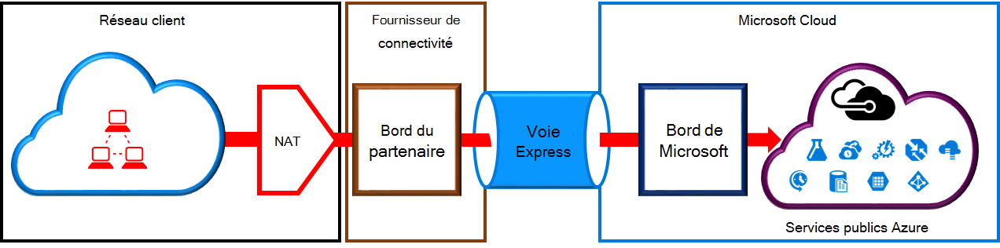
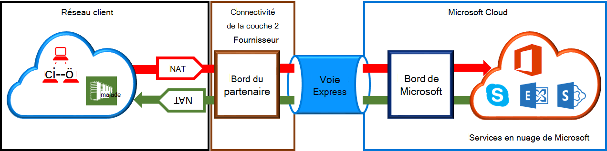

<properties
   pageTitle="Exigences de NAT pour des circuits de ExpressRoute | Microsoft Azure"
   description="Cette page fournit des prescriptions détaillées relatives à la configuration et la gestion NAT pour des circuits de ExpressRoute."
   documentationCenter="na"
   services="expressroute"
   authors="cherylmc"
   manager="carmonm"
   editor=""/>
<tags
   ms.service="expressroute"
   ms.devlang="na"
   ms.topic="get-started-article"
   ms.tgt_pltfrm="na"
   ms.workload="infrastructure-services"
   ms.date="10/10/2016"
   ms.author="cherylmc"/>

# Exigences en matière de ExpressRoute NAT

Pour vous connecter aux services de cloud de Microsoft à l’aide de ExpressRoute, vous devez configurer et gérer les périphériques NAT. Certains fournisseurs de connectivité offrent la configuration et la gestion NAT en tant que service géré. Vérifiez auprès de votre fournisseur pour savoir s’il offre un service de connectivité. Si ce n’est pas le cas, vous devez respecter les exigences décrites ci-dessous. 

Examinez la page de [circuits de ExpressRoute et de domaines de routage](expressroute-circuit-peerings.md) pour obtenir une vue d’ensemble des différents domaines de routage. Pour satisfaire les exigences d’adresse IP publiques pour Azure public et homologation de Microsoft, nous vous recommandons de configurer NAT entre votre réseau et de Microsoft. Cette section fournit une description détaillée de l’infrastructure NAT que vous devez configurer.

## Exigences de NAT pour l’homologation public Azure

Le chemin homologation public Azure permet de vous connecter à tous les services hébergés dans Azure sur les adresses IP publiques. Notamment les services répertoriés dans le [Forum aux questions sur ExpessRoute](expressroute-faqs.md) et tous les services hébergés par les éditeurs de logiciels de Microsoft Azure. Connexion aux services Microsoft Azure sur peering public est toujours lancée à partir de votre réseau dans le réseau de Microsoft. Le trafic destiné à Microsoft Azure sur peering public doit être SNATed pour des adresses IPv4 publiques valides avant leur entrée sur le réseau Microsoft. La figure ci-dessous présente une image détaillée de comment le NAT peut être configuré pour satisfaire à l’exigence ci-dessus.

 

### Publicités de pool et de routage IP NAT

Vous devez vous assurer que le trafic est entrant le chemin d’accès homologation public Azure avec l’adresse IPv4 publique de valide. Microsoft doit être en mesure de valider la propriété du pool d’adresses NAT IPv4 par rapport à un registre Internet routage régional (RIR) ou d’un routage (IRR). Une vérification sera effectuée selon le nombre comme étant ressources avec et les adresses IP utilisées pour le périphérique NAT. Reportez-vous à la page [conditions de routage ExpressRoute](expressroute-routing.md) pour plus d’informations sur les registres de routage.
 
Il n’y a pas de restrictions sur la longueur du préfixe IP NAT annoncé par le biais de cette homologation. Vous devez surveiller le pool NAT et vous assurer que vous ne manque pas de sessions NAT.

>[AZURE.IMPORTANT] Le pool IP NAT publié sur Microsoft ne doit pas annoncé à Internet. Cela rompt la connectivité à d’autres services de Microsoft.

## Exigences de NAT pour l’homologation de Microsoft

Le chemin d’accès homologation Microsoft vous permet de vous connecter aux services de cloud de Microsoft qui ne sont pas pris en charge via le chemin d’homologation public Azure. La liste des services comprend des services Office 365, tel qu’Exchange Online, SharePoint Online, Skype pour les entreprises et CRM en ligne. Microsoft prévoit de prendre en charge une connectivité bidirectionnelle sur l’homologation de Microsoft. Le trafic destiné aux services de cloud de Microsoft doit être SNATed pour des adresses IPv4 publiques valides avant leur entrée sur le réseau Microsoft. Le trafic destiné à votre réseau à partir des services en nuage Microsoft doit être SNATed avant leur entrée sur votre réseau. La figure ci-dessous présente une image détaillée de comment le NAT doit être le programme d’installation pour l’homologation de Microsoft.
 
 

#### Trafic en provenance de votre réseau destiné à Microsoft

- Vous devez vous assurer que le trafic est entrant le chemin d’accès d’homologation Microsoft avec une adresse IPv4 publique valide. Microsoft doit être en mesure de valider le propriétaire du pool d’adresses NAT IPv4 contre le Registre internet routage régional (RIR) ou d’un routage (IRR). Une vérification sera effectuée selon le nombre comme étant ressources avec et les adresses IP utilisées pour le périphérique NAT. Reportez-vous à la page [conditions de routage ExpressRoute](expressroute-routing.md) pour plus d’informations sur les registres de routage.

- Adresses IP utilisées pour l’installation d’homologation publique Azure et les autres circuits ExpressRoute ne doivent pas annoncés à Microsoft par le biais de la session BGP. Il n’y a pas de restriction sur la longueur du préfixe IP NAT annoncé par le biais de cette homologation.

    >[AZURE.IMPORTANT] Le pool IP NAT publié sur Microsoft ne doit pas annoncé à Internet. Cela rompt la connectivité à d’autres services de Microsoft.

#### Trafic en provenance de Microsoft destiné à votre réseau

- Certains scénarios requièrent Microsoft initier la connectivité aux points de terminaison de service hébergé au sein de votre réseau. Un exemple typique du scénario serait la connectivité aux serveurs ADFS hébergé dans votre réseau à partir d’Office 365. Dans de tels cas, vous devez une fuite de préfixes appropriés à partir de votre réseau dans l’homologation Microsoft. 

- Vous devez le trafic SNAT destiné à des adresses IP dans votre réseau de Microsoft. 

## Étapes suivantes

- Reportez-vous à la configuration requise pour le [routage](expressroute-routing.md) et la [qualité de service](expressroute-qos.md).
- Pour plus d’informations de flux de travail, voir [circuit de ExpressRoute mise en service de flux de travail et des États de circuit](expressroute-workflows.md).
- Configurez votre connexion ExpressRoute.

    - [Créer un circuit de ExpressRoute](expressroute-howto-circuit-classic.md)
    - [Configurer le routage](expressroute-howto-routing-classic.md)
    - [Lier un VNet d’un circuit de ExpressRoute](expressroute-howto-linkvnet-classic.md)

