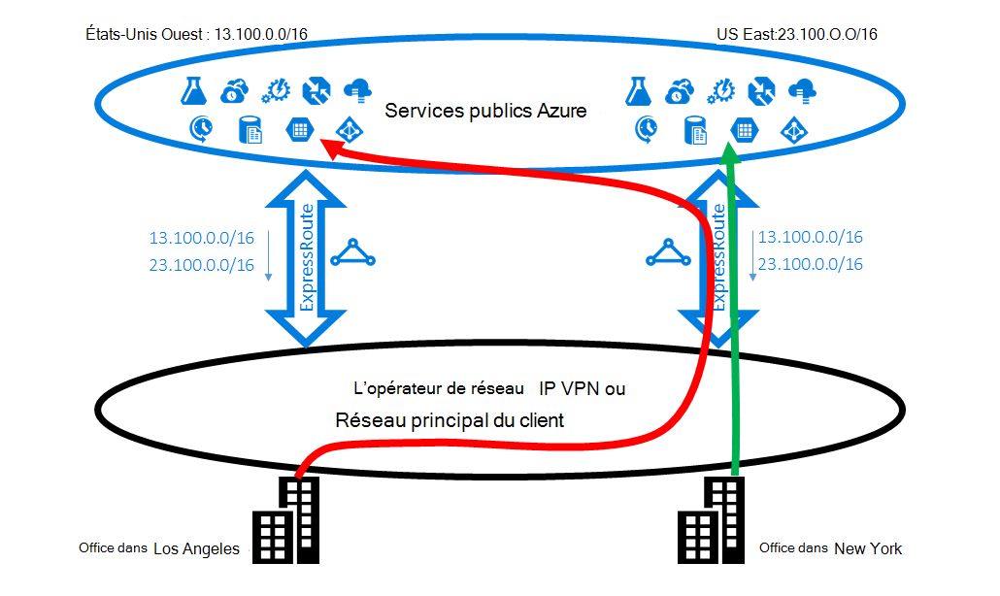

<properties
   pageTitle="Optimiser le routage des ExpressRoute | Microsoft Azure"
   description="Cette page fournit des détails sur la manière d’optimiser le routage lorsqu’un client a plusieurs circuits ExpressRoute qui se connectent entre Microsoft et le réseau du client corp."
   documentationCenter="na"
   services="expressroute"
   authors="charwen"
   manager="carmonm"
   editor=""/>
<tags
   ms.service="expressroute"
   ms.devlang="na"
   ms.topic="get-started-article"
   ms.tgt_pltfrm="na"
   ms.workload="infrastructure-services"
   ms.date="10/10/2016"
   ms.author="charwen"/>

# Optimiser le routage des ExpressRoute
Lorsque vous avez plusieurs circuits de ExpressRoute, vous avez plusieurs chemins d’accès pour vous connecter à Microsoft. Par conséquent, routage non optimaux peut-être se produire -, votre trafic peut prendre un chemin d’accès plus long pour accéder à Microsoft et à votre réseau. Plus le chemin d’accès réseau, plus la latence est élevée. Temps de latence a un impact direct sur l’application performances et l’expérience utilisateur. Cet article illustrent ce problème et explique comment optimiser le routage en utilisant les technologies de routage standard.

## Cas de routage non optimaux 1
Examinons un fermer le problème de routage par un exemple. Imaginez que vous disposez de deux bureaux aux Etats-Unis, un de Los Angeles et un de New York. Vos sites sont connectés à sur une large zone réseau étendu (WAN), qui peut être votre propre réseau principal ou IP VPN votre fournisseur de services. Vous avez deux circuits ExpressRoute, dans l’ouest de nous et à nous est, qui sont également connectés sur le réseau étendu. De toute évidence, vous avez deux chemins d’accès pour vous connecter au réseau Microsoft. Maintenant Imaginez que vous avez déploiement d’Azure (par exemple, Service d’application Azure) en nous West et East nous. Votre intention est de connecter vos utilisateurs à Los Angeles à Azure nous ouest et vos utilisateurs à New York à Azure nous est parce que votre administrateur de service annonce que les utilisateurs de chaque bureau accéder aux services Azure à proximité pour une expérience optimale. Malheureusement, le plan fonctionne bien pour les utilisateurs de la côte est, mais pas pour les utilisateurs de la côte ouest. La cause du problème est la suivante. Sur chaque circuit ExpressRoute, nous faire de la publicité pour vous le préfixe dans Azure nous East (23.100.0.0/16) et le préfixe dans Azure nous Ouest (13.100.0.0/16). Si vous ne connaissez pas le préfixe est à partir de la zone, vous n’êtes pas en mesure de le traiter différemment. Le réseau WAN peut considérer deux préfixes sont plus proches de nous est que nous ouest et donc acheminer les deux utilisateurs office au circuit de ExpressRoute chez nous East. En fin de compte, vous avez de nombreux utilisateurs insatisfaits dans le bureau de Los Angeles.

### Solution : utilisez les Communautés BGP
Pour optimiser le routage pour les utilisateurs d’office, vous devez connaître le préfixe est Azure nous ouest et qui, de l’Azure nous est. Nous coder ces informations en utilisant les [valeurs de la Communauté de BGP](expressroute-routing.md). Nous avons attribué une valeur unique de la Communauté de BGP pour chaque région d’Azure, par exemple, « 12076:51004 » pour nous East, « 12076:51006 » pour nous ouest. Maintenant que vous savez quel préfixe les régions Azure, vous pouvez configurer le circuit de ExpressRoute doit être préféré. Étant donné que le protocole BGP nous permet d’échanger des informations de routage, vous pouvez utiliser les préférences locales de BGP pour influencer le routage. Dans notre exemple, vous pouvez affecter une valeur local de préférence supérieure à 13.100.0.0/16 à nous ouest que chez nous East et la même façon, une valeur de préférence locale supérieure à 23.100.0.0/16 à nous est que de nous ouest. Cette configuration va s’assurer que, lorsque les deux chemins d’accès à Microsoft sont disponibles, vos utilisateurs à Los Angeles prendra le circuit de ExpressRoute à nous ouest pour se connecter à Azure nous ouest que vos utilisateurs à New York prennent le ExpressRoute à nous est à Azure nous est. Le routage est optimisé sur les deux côtés. 

## Cas de routage non optimaux 2
Voici un autre exemple où les connexions de Microsoft ont un chemin d’accès plu d’atteindre votre réseau. Dans ce cas, vous utilisez des serveurs Exchange sur site et Exchange Online dans un [environnement hybride](https://technet.microsoft.com/library/jj200581%28v=exchg.150%29.aspx). Vos sites sont connectés à un réseau étendu. Vous annoncer des préfixes de vos serveurs sur site dans les deux de vos bureaux à Microsoft par le biais de deux circuits ExpressRoute. Exchange Online seront initier des connexions vers les serveurs sur site en cas de migration de boîtes aux lettres. Malheureusement, la connexion à votre bureau de Los Angeles est acheminée au circuit de ExpressRoute à nous est avant d’entamer l’arrière continent toute la côte ouest. La cause du problème est similaire à la première. Sans tout indicateur, le réseau Microsoft ne peut pas indiquer le préfixe de client est proche Orient nous et celui qui est proche de nous ouest. Il se produit à choisir le chemin d’accès incorrect à votre Bureau à Los Angeles.

### Solution : utilisez l’ajoutant au début du chemin d’accès d’en tant que
Il existe deux solutions à ce problème. Le premier est que vous publiez simplement votre préfixe local à votre Bureau à Los Angeles, 177.2.0.0/31, sur le circuit de ExpressRoute à nous ouest et vos locaux de préfixe pour votre bureau de New York, 177.2.0.2/31, sur le circuit de ExpressRoute chez nous East. Par conséquent, n'est qu’un seul chemin pour Microsoft pour se connecter à chacun de vos bureaux. Il n’y a aucune ambiguïté et routage est optimisé. Grâce à cette conception, vous devez penser à votre stratégie de basculement. Dans le cas où le chemin d’accès à Microsoft via ExpressRoute est interrompue, vous devez vous assurer que Exchange Online peuvent toujours se connecter à vos serveurs locaux. 

La seconde solution est que vous continuez annoncer des préfixes sur les deux circuits ExpressRoute et en outre, que vous devez nous fournir un Conseil le préfixe est proche de celui de vos bureaux. Nous prenant en charge le chemin d’accès de protocole BGP en ajoutant au début, vous pouvez configurer le chemin d’accès comme pour votre préfixe pour influencer le routage. Dans cet exemple, vous pouvez augmenter le chemin d’accès en tant que 172.2.0.0/31 dans East nous afin que nous préfèrent le circuit de ExpressRoute à nous ouest pour le trafic destiné à ce préfixe (comme notre réseau pense que le chemin d’accès pour ce préfixe est plus court à l’ouest). De même, vous pouvez augmenter le chemin d’accès en tant que 172.2.0.2/31 dans l’ouest nous afin que nous vous préférez le circuit de ExpressRoute à nous est. Le routage est optimisé pour ces deux bureaux. Grâce à cette conception, si un seul circuit ExpressRoute est rompu, Exchange Online peuvent toujours vous joindre via un autre circuit ExpressRoute et votre réseau étendu. 

>[AZURE.IMPORTANT] Nous supprimons privé sous forme de nombres dans le chemin d’accès en tant que préfixes reçus sur Microsoft Peering. Vous devez ajouter public sous forme de nombres dans le chemin en tant que pour influencer le routage pour Microsoft Peering.

>[AZURE.IMPORTANT] Bien que les exemples donnés ici pour Microsoft et peerings publics, nous prennent en charge les mêmes fonctionnalités pour l’homologation privé. En outre, en tant que chemin ajoutant fonctionne au sein d’un seul circuit ExpressRoute, pour influencer la sélection des chemins principaux et secondaires.
