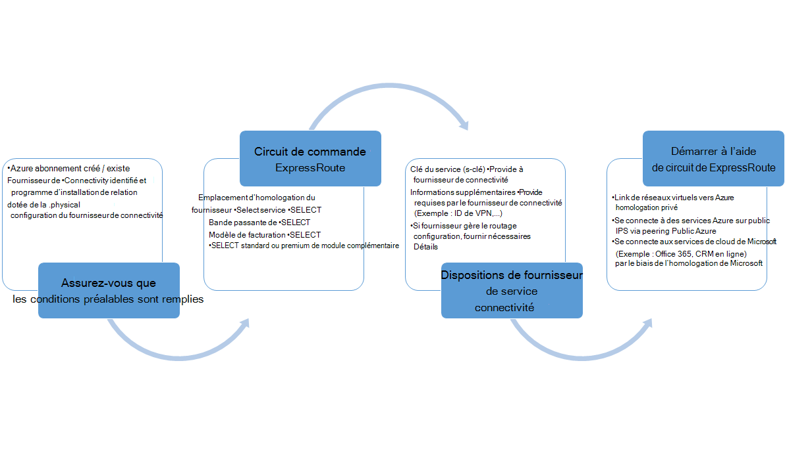

<properties
   pageTitle="Workflows de configuration d’un circuit de ExpressRoute | Microsoft Azure"
   description="Cette page vous guide à travers les flux de travail pour la configuration peerings et circuit de ExpressRoute"
   documentationCenter="na"
   services="expressroute"
   authors="cherylmc"
   manager="carmonm"
   editor="" />
<tags
   ms.service="expressroute"
   ms.devlang="na"
   ms.topic="article" 
   ms.tgt_pltfrm="na"
   ms.workload="infrastructure-services"
   ms.date="10/10/2016"
   ms.author="cherylmc"/>

# ExpressRoute des flux de travail pour la mise en service du circuit et de l’état des circuits

Cette page vous guide à travers le service de mise en service et le routage des workflows de configuration à un niveau élevé.

La figure suivante et les étapes correspondantes vous pouvez afficher les tâches que vous devez suivre pour disposer d’un circuit de ExpressRoute mis en service fin bout à bout. 

1. Utilisation de PowerShell pour configurer un circuit de ExpressRoute. Suivez les instructions dans l’article [ExpressRoute de créer des circuits](expressroute-howto-circuit-classic.md) pour plus de détails.

2. Connectivité de la commande auprès du fournisseur de service. Ce processus varie. Contactez votre fournisseur de connectivité pour plus de détails sur comment commander la connectivité.

3. Assurez-vous que le circuit a été configuré correctement en vérifiant le circuit ExpressRoute mise en service d’état par le biais de PowerShell. 

4. Configurer les domaines de routage. Si votre fournisseur de connectivité gère la couche 3 pour vous, ils seront configurer le routage pour le circuit. Si votre fournisseur de connectivité offre uniquement des services de couche 2, vous devez configurer le routage par les indications décrites dans les pages de [configuration du routage](expressroute-howto-routing-classic.md) et de [routage des exigences](expressroute-routing.md) .

    -  Activer l’homologation privé Azure, vous devez activer cette homologation pour se connecter aux ordinateurs virtuels / services déployés au sein de réseaux virtuels en nuage.
    -  Activer l’homologation public Azure, vous devez activer l’homologation public Azure si vous souhaitez vous connecter à des services Azure hébergés sur des adresses IP publiques. Il s’agit d’une exigence pour accéder aux ressources d’Azure, si vous avez choisi d’activer le routage par défaut pour l’homologation privé Azure.
    -  Activer Microsoft homologation - vous devez l’activer accès Office 365 et de services CRM en ligne. 
    
    >[AZURE.IMPORTANT] Vous devez vous assurer que vous utilisez un proxy distincts / bord pour se connecter à Microsoft que celle que vous utilisez pour Internet. À l’aide du même bord de ExpressRoute et de l’Internet entraîne le routage asymétrique et provoquer des pannes de connectivité de votre réseau.

    

5. Liaison de réseaux virtuels aux circuits de ExpressRoute - vous pouvez lier des réseaux virtuels à votre circuit ExpressRoute. Suivez les instructions [pour créer un lien VNets](expressroute-howto-linkvnet-arm.md) pour votre circuit. Ces VNets peuvent être dans le même abonnement Azure comme le circuit de ExpressRoute, ou peut être dans un autre abonnement.

## Circuit d’ExpressRoute les États de mise en service

Chaque circuit de ExpressRoute a deux états :

- État mise en service du fournisseur de service
- État

État représente un état de mise en service de Microsoft. Cette propriété est définie sur activé lorsque vous créez un circuit de Expressroute

L’état de mise en service de fournisseur de connectivité représente l’état sur le côté du fournisseur de la connectivité. Il peut être *NotProvisioned*, *provisionnement*ou *Provisioned*. Le circuit de ExpressRoute doit être dans un état Provisioned pour vous permettre de l’utiliser.

### États possibles d’un circuit de ExpressRoute

Cette section répertorie les états possibles d’un circuit de ExpressRoute.

#### Au moment de la création

Vous verrez le circuit ExpressRoute dans l’état suivant dès que vous exécutez l’applet de commande PowerShell pour créer le circuit de ExpressRoute.

    ServiceProviderProvisioningState : NotProvisioned
    Status                           : Enabled

#### Lorsque le fournisseur de connectivité est en cours de mise en service de circuit

Vous verrez le circuit ExpressRoute dans l’état suivant dès que vous passez à la clé du service pour le fournisseur de connectivité et ils ont commencé le processus de déploiement.

    ServiceProviderProvisioningState : Provisioning
    Status                           : Enabled

#### Lorsque le fournisseur de connectivité a terminé le processus de déploiement

Vous verrez le circuit ExpressRoute dans l’état suivant dès que le fournisseur de connectivité a terminé le processus de déploiement.

    ServiceProviderProvisioningState : Provisioned
    Status                           : Enabled

Mise en service et activé est le seul état du circuit dans pour vous permettre de l’utiliser. Si vous utilisez un fournisseur de couche 2, vous pouvez configurer le routage pour votre circuit uniquement lorsqu’il est dans cet état.

#### Lorsque le fournisseur de connectivité est hors service le circuit

Si vous avez demandé le fournisseur de services à deprovision le circuit de ExpressRoute, vous verrez le circuit défini sur l’état suivant une fois que le fournisseur de services a terminé le processus d’annulation.

    ServiceProviderProvisioningState : NotProvisioned
    Status                           : Enabled

Vous pouvez choisir de la réactiver si nécessaire, ou d’exécuter des applets de commande PowerShell pour supprimer le circuit.  

>[AZURE.IMPORTANT] Si vous exécutez l’applet de commande PowerShell pour supprimer le circuit lors de la mise en service de la ServiceProviderProvisioningState ou le Provisioned, l’opération échouera. Veuillez contacter votre fournisseur de connectivité pour deprovision du circuit ExpressRoute tout d’abord, puis supprimez le circuit. Microsoft va continuer à facturer le circuit qu’après avoir exécuté l’applet de commande PowerShell pour supprimer le circuit.

## État de la configuration de session routage

Le protocole BGP mise en service d’état vous permet de savoir si la session BGP a été activée sur le bord de Microsoft. L’état doit être activée pour pouvoir utiliser l’homologation.

Il est important de vérifier l’état de session BGP en particulier pour l’homologation de Microsoft. En plus de la mise en service d’état BGP, il existe un autre état appelé *annoncé état de préfixes public*. L’état publié préfixes public doit être dans l’état *configuré* , à la fois pour la session BGP être opérationnel et votre distribution fonctionne de bout en bout. 

Si l’état de préfixe annoncé à public est définie à un état de *validation nécessaire* , la session BGP n’est pas activée, comme les préfixes annoncés ne correspondait pas le numéro en tant que, dans tous les registres de routage. 

>[AZURE.IMPORTANT] Si l’état publié préfixes public est dans l’état de *validation manuelle* , vous devez ouvrir un ticket de support avec [prise en charge par Microsoft](https://portal.azure.com/?#blade/Microsoft_Azure_Support/HelpAndSupportBlade) et fournir la preuve que vous possédez les adresses IP publiés le long avec le numéro de système autonome associé.

## Étapes suivantes

- Configurez votre connexion ExpressRoute.

    - [Créer un circuit de ExpressRoute](expressroute-howto-circuit-arm.md)
    - [Configurer le routage](expressroute-howto-routing-arm.md)
    - [Lier un VNet d’un circuit de ExpressRoute](expressroute-howto-linkvnet-arm.md)
