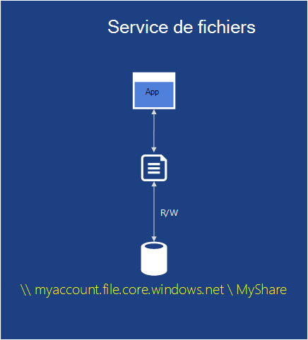

<properties
    pageTitle="Introduction à Microsoft Azure | Microsoft Azure"
    description="Nouveau sur Microsoft Azure ? Obtenir une vue d’ensemble des services qu’il propose des exemples de la façon dont ils sont utiles."
    services=" "
    documentationCenter=".net"
    authors="rboucher"
    manager="carolz"
    editor=""/>

<tags
    ms.service="multiple"
    ms.workload="multiple"
    ms.tgt_pltfrm="na"
    ms.devlang="na"
    ms.topic="article"
    ms.date="06/30/2015"  
    ms.author="robb"/>

# Présentation de Microsoft Azure

Microsoft Azure est la plate-forme d’applications de Microsoft pour le nuage public.  L’objectif de cet article est de vous donner d’une base pour comprendre les notions de base d’Azure, même si vous ne connaissez rien sur le cloud computing.

**La lecture de cet article**

Azure se développe tout le temps afin qu’il soit facile à surchargé.  Démarrer avec les services de base, qui sont répertoriés en premier dans cet article, puis passez à des services supplémentaires. Cela ne signifie pas que vous ne pouvez pas utiliser uniquement les services supplémentaires par eux-mêmes, mais les services de base constituent le cœur d’une application qui s’exécute dans Azure.

**Envoyer des commentaires**

Vos commentaires sont importants. Cet article devrait vous donner une vue d’ensemble efficace d’Azure. Si elle n’est pas le cas, nous indiquer dans la section de commentaires au bas de la page. Donnez des détails sur ce que vous vous attendiez à voir et l’amélioration de l’article.  

## Les composants d’Azure

Azure regroupe des services dans des catégories dans le portail de gestion et diverses aides visuelles à [Quelle est Azure Infographic](https://azure.microsoft.com/documentation/infographics/azure/) . Le portail de gestion est ce qui vous permet de gérer la plupart (mais pas tous) des services dans Azure.

Cet article utilise une **organisation différente** pour parler des services basés sur une fonction similaire et d’appeler les services secondaires importantes qui font partie des plus grands.  

   
 *Figure : Azure fournit des services d’application accessibles sur Internet en cours d’exécution dans les centres de données Azure.*

## Portail de gestion
Azure a une interface web appelée le [Portail de gestion](http://manage.windowsazure.com) qui permet aux administrateurs d’accéder et d’administrer plus, mais pas toutes les fonctionnalités Azure.  En général, Microsoft publie le portail d’interface utilisateur plus récent dans la version bêta avant de retirer un ancien. Plus récente celle appelée [« portail d’aperçu Azure »](https://portal.azure.com/).

Il y a généralement un chevauchement long lorsque les deux portails sont actifs. Alors que les services de base seront affichent dans les deux portails, pas toutes les fonctionnalités peuvent être disponible dans les deux. Services plus récents susceptibles d’apparaître dans les services de première et anciens portails plus récentes et fonctionnalités peuvent uniquement exister dans l’ancienne.  Le message ici est que si vous ne trouvez pas quelque chose dans le portail plus ancien, vérifiez le plus récent et vice versa.

## Calculer

Une des choses plus élémentaires qu'est d’une plate-forme de nuage est d’exécuter des applications. Chacun des modèles de calcul Azure a son propre rôle à jouer.

Vous pouvez utiliser ces technologies séparément ou les combiner comme nécessaires à la création de la Fondation de droite pour votre application. L’approche que vous choisissez dépend de ce que les problèmes que vous tentez de résoudre.

### Machines virtuelles Azure

   
*Figure : Les Machines virtuelles Azure vous donne un contrôle total sur les instances de machine virtuelle dans le nuage.*

La possibilité de créer un ordinateur virtuel à la demande, si à partir d’une image standard ou un que vous fournissez, peut être très utile. Cette approche, communément appelée Infrastructure en tant que Service (IaaS), est que les ordinateurs virtuels Azure fournit. La figure 2 montre une combinaison de fonctionnement d’une Machine virtuelle (VM) et comment en créer une à partir d’un disque dur virtuel.  

Pour créer un ordinateur virtuel, vous spécifiez le disque dur virtuel à utiliser et la taille de la mémoire virtuelle.  Puis, vous payez pour le temps que l’ordinateur virtuel est en cours d’exécution. Vous ne payez à la minute et uniquement lors de son exécution, bien qu’il existe des frais de stockage minimale pour le maintien du disque dur virtuel disponible. Azure propose une bibliothèque de disques durs virtuels (appelés « images ») qui contient un système d’exploitation amorçable pour démarrer à partir de stock. Celles-ci incluent des options de Microsoft et de partenaires, comme Windows Server et Linux, SQL Server, Oracle et bien d’autres encore. Vous êtes libre de créer des disques durs virtuels et des images et les télécharger vous-même. Vous pouvez même télécharger des disques durs virtuels qui contiennent uniquement des données et d’y accéder à partir de vos ordinateurs virtuels en cours d’exécution.

Chaque fois que le disque dur virtuel est fourni à partir de, vous pouvez stockez toutes les modifications apportées pendant l’exécution d’une machine virtuelle. La prochaine fois que vous créez une machine virtuelle à partir de ce disque dur virtuel, choses mains où vous l’avez laissé. Les disques durs virtuels que les ordinateurs virtuels sont stockés dans les blobs de stockage Azure, dont nous parlerons plus loin.  Cela signifie que vous obtenez de redondance pour garantir à que vos ordinateurs virtuels ne disparaissent en raison de défaillances du matériel et du disque. Il est également possible de copier le disque dur virtuel modifié en dehors d’Azure, puis exécuter localement.

Votre application s’exécute dans une ou plusieurs Machines virtuelles, en fonction de comment vous créé avant ou décidez de créer de toutes pièces.

Cette approche assez générale pour le cloud computing peut être utilisée pour résoudre de nombreux problèmes différents.

**Scénarios de Machine virtuelle**

1.  **Développement/Test** : vous pouvez les utiliser pour créer une plate-forme de développement et de test bon marchée qui vous pouvez arrêter lorsque vous avez fini de l’utiliser. Vous pourriez également créer et exécuter des applications qui utilisent toutes les langues et bibliothèques que vous le souhaitez. Ces applications peuvent utiliser les options de gestion de données Azure fournit, et vous pouvez également choisir d’utiliser SQL Server ou un autre SGBD en cours d’exécution dans un ou plusieurs ordinateurs virtuels.
2.  **Déplacer les Applications vers Azure (ascenseur et MAJ)** - « Ascenseur et MAJ » fait référence au déplacement beaucoup de votre application comme vous utiliseriez un chariot élévateur pour déplacer un objet de grande taille.  Vous « élévateur » sur le disque dur virtuel à partir de votre centre de données local et « déplacer » vers Azure et exécutez-le à cet emplacement.  Vous devez généralement effectuer un travail pour supprimer des dépendances sur d’autres systèmes. Si elles sont trop nombreuses, vous pouvez choisir l’option 3 à la place.  
3.  **Étendre votre centre de données** - VM d’Azure utilisation comme une extension de votre centre de données local, SharePoint ou autres applications en cours d’exécution. Pour ce faire, il est possible de créer des domaines Windows dans le nuage en exécutant Active Directory dans Azure VM. Réseau virtuel d’Azure (mentionné plus loin) vous permet de relier votre réseau local et votre réseau dans Azure.

### Applications Web

   
 *Figure : Les applications Web Azure s’exécute une application de site Web dans le nuage sans avoir à gérer le serveur web sous-jacent.*

L’une des tâches courantes que les personnes effectuent dans le nuage est exécuter des applications web et de sites Web. Les Machines virtuelles Azure permet cela, mais il vous laisse encore avec la responsabilité de l’administration des machines virtuelles d’un ou plusieurs et les systèmes d’exploitation sous-jacents. Rôles de web services cloud pour cela, mais le déploiement et leur maintenance durera de travail administratif.  Que se passe-t-il si vous souhaitez qu’un site Web lorsque quelqu'un d’autre prend en charge le travail administratif pour vous ?

C’est exactement ce que fournit des applications Web. Ce modèle de calcul offre un environnement web gérés à l’aide du portail de gestion d’Azure, ainsi que des API. Vous pouvez déplacer une application de site Web existant dans les applications Web inchangé, ou vous pouvez créer un nouveau directement dans le nuage. Une fois qu’un site Web est en cours d’exécution, vous pouvez ajouter ou supprimer des instances dynamiquement, compter sur Azure Web Apps pour charger des demandes de solde entre eux. Applications Azure offre une option partagée, où votre site Web s’exécute sur une machine virtuelle avec d’autres sites, et l’option standard qui permet à un site pour s’exécuter dans sa propre machine virtuelle. L’option standard vous permet également d’augmenter la taille (puissance informatique) de vos instances, si nécessaire.

Pour le développement d’applications Web prend en charge .NET, PHP, Node.js, Java et les Python ainsi que de la base de données SQL et MySQL (à partir de ClearDB, un partenaire Microsoft) pour le stockage relationnel. Il fournit également la prise en charge intégrée pour plusieurs applications courantes, notamment WordPress, Joomla et Drupal. L’objectif est de fournir une plate-forme économique, évolutive et largement utile pour la création d’applications web et des sites Web dans le cloud public.

**Scénarios d’applications Web**

Web applications est destinée à être utile pour les développeurs, les entreprises et organismes de conception web. Pour les entreprises, il s’agit d’une solution facile à gérer, évolutive, hautement sécurisée et hautement disponible pour les sites Web de présence en cours d’exécution. Lorsque vous avez besoin configurer un site Web, il est préférable de commencer par les applications Web Azure et atteindre les Services en nuage une fois que vous avez besoin d’une fonctionnalité qui n’est pas disponible. Reportez-vous à la fin de la section « Compute » pour des liens supplémentaires qui peuvent vous aider à choisir entre les options.

### Services en nuage
   
*Figure : Azure Cloud Services fournit un emplacement pour exécuter du code personnalisé évolutif sur une plate-forme comme un environnement de Service (PaaS)*

Supposons que vous souhaitiez créer une application en nuage qui peut prendre en charge des lots d’utilisateurs simultanés, ne nécessite pas occuper de l’administration et jamais tombe en panne. Vous pouvez être un fournisseur de logiciels établies, par exemple, qui a décidé d’adopter le logiciel en tant que Service (SaaS) par la création d’une version de l’un de vos applications dans le nuage. Ou peut-être une start-up, création d’une application consommateur que vous attendez de croissance rapide. Si vous générez sur Azure, le modèle d’exécution doit utiliser ?

Les applications Web Azure permet de créer ce type d’application web, mais il existe certaines contraintes. Vous n’avez pas un accès administratif, par exemple, qui signifie que vous ne pouvez pas installer des logiciels. Les Machines virtuelles Azure vous offre une grande souplesse, y compris l’accès administratif et vous certainement pouvez utiliser pour créer une application très évolutive, mais vous devrez gérer vous-même les nombreux aspects de la fiabilité et l’administration. Ce que vous voulez est une option qui vous donne le contrôle que vous avez besoin, mais gère également la plupart du travail requis pour la fiabilité et l’administration.

C’est exactement celle fournie par les Services en nuage Azure. Cette technologie est conçue expressément pour prendre en charge évolutive, fiable et applications de faible-admin et d’un exemple de ce que l'on appelle communément de plate-forme en tant que Service (PaaS). Pour l’utiliser, vous créez une application à l’aide de la technologie de que votre choix, notamment C#, Java, PHP, Python, Node.js ou quelque chose d’autre. Votre code s’exécute ensuite dans des machines virtuelles (appelés instances) exécutant une version de Windows Server.

Mais ces machines virtuelles sont différentes de celles que vous créez avec Azure Virtual Machines. Pour une chose, Azure lui-même les gère, faire les choses comme l’installation de correctifs de système d’exploitation et corrigé, automatiquement déploiement de nouvelles images. Cela signifie que votre application ne doit pas gérer l’état dans les instances de rôle web ou travailleur ; elle doit être conservée dans une des options de gestion de données Azure décrites dans la section suivante. Azure surveille également ces ordinateurs virtuels, redémarrage de tout état qui échouent. Vous pouvez définir des services en nuage pour créer automatiquement des instances plus ou moins en réponse à la demande. Cela vous permet une augmentation de l’utilisation des handles et puis mise à l’échelle pour que vous ne sont pas payer autant moins d’utilisation.

Vous avez deux rôles à choisir lorsque vous créez une instance, toutes deux basées sur Windows Server. La principale différence entre les deux est qu’une instance d’un rôle web exécute IIS, n’est pas le cas d’une instance d’un rôle worker. Les deux sont gérés de la même façon, cependant, et il est courant pour une application d’utiliser les deux. Par exemple, une instance de rôle web peut accepter les demandes des utilisateurs, puis les passer à une instance de rôle de collaborateur pour le traitement. Pour faire évoluer votre application vers le haut ou vers le bas, vous pouvez demander à Azure créer plusieurs instances de chaque rôle ou arrêter des instances existantes. Et similaire à Azure Virtual Machines, vous êtes facturé que pour le temps que chaque instance de rôle web ou travailleur est en cours d’exécution.

**Scénarios de Services cloud**

Les Services en nuage conviennent parfaitement prendre en charge une mise à l’échelle lorsque vous devez davantage de contrôle sur la plate-forme que les applications Web Azure mais n’avez pas besoin de contrôler le système d’exploitation sous-jacent.

#### Choix d’un modèle de calcul
La page [Azure Web applications, les Services en nuage et les Machines virtuelles comparaison](./app-service-web/choose-web-site-cloud-service-vm.md) fournit des informations détaillées sur la façon de choisir un modèle de calcul.

## Gestion des données

Les applications ont besoin de données, et les différents types d’applications ont besoin de différents types de données. De ce fait, Azure fournit plusieurs méthodes pour stocker et gérer les données. Azure offre de nombreuses options de stockage, mais tous sont conçus pour stockage très durable.  Avec une de ces options, il existe toujours des 3 copies de vos données restent synchronisées entre un centre de données Azure--6 si vous autorisez la redondance géographique permet de sauvegarder sur un autre centre de données au moins 300 miles Azure.     

### Dans des Machines virtuelles
La possibilité d’exécuter SQL Server ou un autre SGBD dans une machine virtuelle créée avec Azure Virtual Machines a déjà été mentionnée. Sachez que cette option n’est pas limitée aux systèmes relationnelles ; Vous pouvez également exécuter des technologies NoSQL comme MongoDB et Cassandra. Votre propre système de base de données en cours d’exécution est simple-it réplique notre permet de nos propres centres de données- mais il nécessite également la gestion de l’administration de ce SGBD.  D’autres options, Azure gère plusieurs ou l’ensemble de l’administration pour vous.

À nouveau, l’état de la Machine virtuelle et n’importe quel disque de données supplémentaires, vous créez ou que vous téléchargez sont accompagnés de stockage des objets blob (dont nous parlerons plus loin).  

### Base de données SQL Azure
   

*Figure : Une base de données SQL Azure fournit un service managé de base de données relationnelle dans le nuage.*

Pour le stockage relationnel, Azure fournit la fonctionnalité de base de données SQL. Ne laissez pas d’attribution de noms vous tromper. Cela est différent de celui d’une base de données SQL classique fournie par SQL Server qui s’exécute sur Windows Server.  

Anciennement appelé SQL Azure, base de données de SQL Azure fournit toutes les fonctionnalités clées de la base de données relationnelle système de gestion de, y compris les transactions atomiques, l’accès aux données simultanées par plusieurs utilisateurs avec un modèle de programmation familier, l’intégrité des données et les requêtes ANSI SQL. Comme SQL Server, la base de données de SQL sont accessibles à l’aide d’Entity Framework, ADO.NET, JDBC et autres données familier accéder aux technologies. Il prend également en charge la plupart du langage T-SQL, ainsi que des outils de SQL Server, tels que SQL Server Management Studio. Pour tout le monde familiarisé avec SQL Server (ou autre base de données relationnelle), l’utilisation de la base de données SQL est simple.

Mais la base de données de SQL n’est pas simplement un SGBD en nuage-informatique d’un service PaaS. Vous toujours Contrôlez vos données et qui peut y accéder, mais base de données de SQL prend en charge le travail d’administration, telles que la gestion de l’infrastructure matérielle et automatiquement garder le logiciel de base de données et le système d’exploitation à jour. Base de données de SQL fournit également une disponibilité élevée, les sauvegardes automatiques, point-à-temps des capacités de restauration et peuvent répliquer des copies entre les régions géographiques.  

**Scénarios de base de données SQL**

Si vous créez une application Azure (à l’aide d’un des modèles de calcul) qui requiert un stockage relationnel, base de données de SQL peut être une bonne option. Applications qui s’exécutent en dehors du nuage permet également ce service, cependant, il n’y en a beaucoup d’autres scénarios. Par exemple, les données stockées dans la base de données de SQL est accessible à partir de systèmes clients différents, y compris les ordinateurs de bureau, ordinateurs portables, tablettes et téléphones. Et car elle offre une disponibilité élevée intégrée grâce à la réplication, l’utilisation de la base de données SQL peut contribuer à réduire les interruptions de service.

### Tables
  

*Figure : Tables Azure offre un moyen de NoSQL de plat pour stocker des données.*

Cette fonctionnalité est parfois appelée différentes conditions dans le cadre de son d’une plus grande fonctionnalité appelée « Stockage Azure ». Si vous voyez « tables », « tables Azure » ou « tables de stockage », elle est la même chose.  

Et ne vous inquiétez pas par le nom : cette technologie ne fournit pas de stockage relationnel. En fait, il s’agit d’un exemple d’une approche de NoSQL appelée magasin de clé/valeur. Les Tables Azure permettent à une application de stocker des propriétés de différents types, tels que les chaînes, les entiers et les dates. Une application peut ensuite récupérer un groupe de propriétés en fournissant une clé unique pour ce groupe. Alors que les opérations complexes telles que les jointures ne sont pas prises en charge, les tables offrent un accès rapide aux données typées. Ils sont également très évolutives, avec une seule table peut stocker jusqu'à un téraoctet de données. Et leur simplicité de mise en correspondance, les tables sont généralement moins chers à utiliser qu’un stockage relationnel de SQL base de données.

**Scénarios pour les Tables**

Supposons que vous souhaitiez créer une application Azure nécessitant un accès rapide à des données typées, peut-être beaucoup de, mais n’a pas besoin d’effectuer des requêtes SQL complexes sur ces données. Par exemple, imaginez que vous créez une application consommateur qui a besoin de stocker des informations de profil de client pour chaque utilisateur. Votre application sera très populaires, donc vous devez permettre à de grandes quantités de données, mais vous ne suffit pas avec ces données au-delà de stocker, puis de le récupérer de façon simple. C’est exactement le type de scénario dans lequel les Tables Azure se justifie.

### Objets BLOB
    
*Figure : BLOB Azure fournit des données binaires non structurées.*  

BLOB Azure (nouveau simplement « stockage BLOB » et « Stockage Blob » sont identiques en fait) est conçu pour stocker des données binaires non structurées. Comme pour les Tables, BLOB fournit un stockage peu coûteux et un blob unique peut être aussi grand que 1 To (un téraoctet). Azure applications peuvent également utiliser des lecteurs Azure, qui permettent de fournir un stockage permanent pour un système de fichiers Windows monté dans une instance Azure BLOB. L’application voit les fichiers Windows ordinaires, mais le contenu est stocké dans un objet blob.

Stockage des objets BLOB est utilisé par de nombreux autres Azure fonctionnalités (y compris les Machines virtuelles), donc il peut sans aucun doute gérer vos charges de travail trop.

**Scénarios pour les objets BLOB**

Une application qui stocke des fichiers vidéo, à grande échelle ou autres informations binaires peut utiliser des objets BLOB pour le stockage simple et bon marché. BLOB est souvent utilisées conjointement avec d’autres services tels que Content Delivery Network, dont nous parlerons plus tard.  

### Importation / exportation
  

*Figure : Importation d’Azure / exportation permet de livrer un disque dur physique ou d’Azure pour les données en bloc plus rapide et moins coûteux importer ou exporter.*  

Parfois, vous souhaitez déplacer un grand nombre de données dans Azure. Qui peut durer longtemps, voire plusieurs jours et utilisent beaucoup de bande passante. Dans ces cas, vous pouvez utiliser Azure importer/exporter, qui vous permet de livrer chiffré Bitlocker 3,5" disques durs SATA directement aux centres de données Azure où Microsoft transfère les données dans le stockage blob pour vous.  Une fois le téléchargement terminé, Microsoft livre les lecteurs à vous.  Vous pouvez également demander que les grandes quantités de données depuis le stockage Blob être exportées sur les disques durs et renvoyées à vous par courrier.

**Scénarios pour l’importation / exportation**

- **Migration de données de grande taille** - dès que vous avez de grandes quantités de données (téraoctets) que vous souhaitez télécharger sur Azure, le service d’importation/exportation est souvent beaucoup plus rapide et peut-être moins cher que les transférer sur internet. Une fois les données BLOB, vous pouvez le traiter dans d’autres formats tels que le stockage de Table ou d’une base de données SQL.

- **Récupération des données archivées** : vous pouvez utiliser l’importation/exportation de Microsoft transfère de gros volumes de données stockées dans le stockage Blob Azure à un périphérique de stockage que vous envoyez et ensuite ce périphérique ont remis à un emplacement de votre choix. Étant donné que cela prendra un certain temps, il n’est pas une bonne solution de reprise après sinistre. Il est préférable pour que vous n’avez pas besoin d’un accès rapide à des données archivées.

### Service de fichiers
    
*Figure : Fournit des Services de fichiers Azure SMB \\ \\serveur\partage les chemins d’accès pour les applications s’exécutant dans le nuage.*

Sur site, il est courant d’avoir des grandes quantités de stockage de fichiers accessible via le protocole Server Message Block (SMB) à l’aide un \\ \\serveur\partage format. Azure a maintenant un service qui vous permet d’utiliser ce protocole dans le nuage. Applications qui s’exécutent dans Azure peuvent utiliser pour partager des fichiers entre les ordinateurs virtuels utilisant le système de fichiers de bien connaître les API telles que ReadFile et WriteFile. En outre, les fichiers sont également accessibles en même temps via une interface REST, ce qui vous permet d’accéder aux partages sur site lorsque vous configurez également un réseau virtuel. Fichiers Azure est basé sur le service d’objet blob, afin qu’il hérite de la même disponibilité, durabilité, d’évolutivité et géo-redondance de stockage Azure.

**Scénarios de fichiers Azure**

- **Migration des applications existantes vers le nuage** - sa facilité la migration locaux vers le nuage, les applications qui utilisent les partages de fichiers pour partager des données entre les différentes parties de l’application. Chaque machine virtuelle se connecte au partage de fichiers et puis elle puisse lire et écrire des fichiers comme il faites par rapport à un fichier local sur le partage.

- **Paramètres de l’Application partagée** - un modèle commun pour les applications distribuées est d’avoir des fichiers de configuration dans un emplacement centralisé, où ils sont accessibles à partir des différentes machines virtuelles. Ces fichiers de configuration peuvent être stockés dans un partage de fichiers d’Azure et lu par toutes les instances de l’application. Les paramètres peuvent également être gérés via l’interface REST, ce qui permet d’accéder aux fichiers de configuration dans le monde entier.

- **Diagnostic de partager** - vous pouvez enregistrer et partager des fichiers de diagnostic tels que des journaux, des statistiques et des vidages sur incident. Ces fichiers disponibles via l’interface de la PME et le reste permet aux applications d’utiliser une variété d’outils d’analyse de traiter et analyser les données de diagnostic.

- **Développement/Test/Debug** - lorsque les administrateurs ou les développeurs travaillent sur des ordinateurs virtuels dans le nuage, ils doivent souvent un ensemble d’outils et d’utilitaires. L’installation et la distribution de ces utilitaires sur chaque machine virtuelle prend beaucoup de temps. Fichiers d’Azure, un développeur ou un administrateur peut stocker leurs outils favoris sur un partage de fichiers et s’y connecter à partir de n’importe quelle machine virtuelle.

## Mise en réseau

Azure s’exécute aujourd'hui dans de nombreux centres de données répartis dans le monde entier. Lorsque vous exécutez une application ou stockez des données, vous pouvez sélectionner un ou plusieurs de ces centres de données à utiliser. Vous pouvez également vous connecter à ces centres de données de différentes façons en utilisant les services ci-dessous.

### Réseau virtuel
   

*Figure : Réseaux virtuels fournit un réseau privé dans le nuage et services différents peuvent communiquer entre eux, ou à des ressources sur site si vous configurez un VPN coexistence connexion.*  

Un moyen pratique d’utiliser un cloud public est de le traiter comme une extension de votre propre centre de données.

Étant donné que vous pouvez créer des ordinateurs virtuels à la demande, puis les supprimer (et se) lorsqu’ils ne sont plus nécessaires, vous pouvez avoir la puissance de calcul uniquement lorsque vous le souhaitez. Et, dans la mesure où les ordinateurs virtuels Azure vous permet de créer des ordinateurs virtuels exécutant SharePoint, Active Directory et autres logiciels familiers sur site, cette approche peut travailler avec les applications que vous avez déjà.

Pour que ce soit vraiment utile, cependant, vos utilisateurs doivent être en mesure de traiter ces applications comme si elles étaient exécutées dans votre propre centre de données. C’est exactement ce que permet le réseau virtuel d’Azure. À l’aide d’un périphérique de passerelle VPN, un administrateur peut configurer un réseau privé virtuel (VPN) entre votre réseau local et vos ordinateurs virtuels qui sont déployés sur un réseau virtuel dans Azure. Dans la mesure où vous affectez vos propres v4 des adresses IP pour l’ordinateurs virtuels du cloud, ils apparaissent sur votre propre réseau. Les utilisateurs de votre organisation peuvent accéder aux applications contiennent de ces ordinateurs virtuels comme si elles étaient exécutées localement.

Pour plus d’informations sur la planification et la création d’un réseau virtuel qui fonctionne pour vous, consultez le [Réseau virtuel](./virtual-network/virtual-networks-overview.md).

### Voie Express

   

*Figure : ExpressRoute utilise un réseau virtuel d’Azure, mais achemine les connexions des plus rapidement des lignes dédiées au lieu de l’Internet public.*  

Si vous avez besoin de plus de bande passante ou de sécurité à un réseau virtuel Azure connexion peut fournir, vous pouvez envisager d’ExpressRoute. Dans certains cas, ExpressRoute pouvez également économiser de l’argent. Vous devez toujours un réseau virtuel dans Azure, mais le lien entre votre site et d’Azure utilise une connexion dédiée qui ne sont pas acheminés via Internet. Pour utiliser ce service, vous devez disposer d’un accord avec un fournisseur de services réseau ou un fournisseur d’exchange.

Configurer une ExpressRoute connexion requiert plus de temps et de planification, vous pouvez donc choisir de démarrer avec un VPN de site à site, puis migrer vers une connexion de ExpressRoute.

Pour plus d’informations sur ExpressRoute, reportez-vous à la section [Présentation technique de ExpressRoute](./expressroute/expressroute-introduction.md).

### Traffic Manager

   

*Figure : Azure Traffic Manager vous permet de router le trafic global à votre service, basé sur des règles intelligentes.*

Si votre application Azure s’exécute dans plusieurs centres de données, vous pouvez utiliser Azure Traffic Manager pour acheminer les requêtes provenant d’utilisateurs intelligemment sur plusieurs instances de l’application. Vous pouvez également router le trafic services non en cours d’exécution dans Azure dans la mesure où ils sont accessibles à partir d’internet.  

Une application Azure avec les utilisateurs en une seule partie du monde peut s’exécuter dans un seul centre de données Azure. Une application avec des utilisateurs répartis dans le monde entier, cependant, est plus susceptible de s’exécuter dans plusieurs centres de données, peut-être même toutes les. Dans ce deuxième cas, vous êtes confronté à un problème : comment vous intelligemment diriger les utilisateurs vers les instances de l’application ? La plupart du temps, vous souhaitez probablement chaque utilisateur à accéder au centre de données le plus proche de lui, car c’est lui donnera certainement le meilleur temps de réponse. Mais que se passe-t-il si cette instance de l’application est surchargé ou non disponible ? Dans ce cas, il serait intéressant de diriger son demande automatiquement vers un autre centre de données. C’est exactement ce qui est fait par le Gestionnaire de trafic Azure.

Le propriétaire d’une application définit les règles qui spécifient comment les demandes des utilisateurs doivent être adressées aux centres de données, puis il repose sur le Gestionnaire de trafic de procéder à ces règles. Par exemple, les utilisateurs peuvent normalement être dirigés vers le centre de données Azure le plus proche, mais sont envoyés à une autre lorsque le délai de réponse à partir de leur centre de données par défaut dépasse le délai de réponse à partir d’autres centres de données. Pour les applications distribuées globalement avec de nombreux utilisateurs, il est utile d’ayant un service intégré pour gérer ces problèmes.

Gestionnaire de trafic utilise le nom de répertoire de DNS (Domain Name Service) aux utilisateurs de gamme aux points de terminaison de service, mais plus le trafic ne passe pas par le biais du Gestionnaire de trafic une fois que cette connexion est établie. Cela empêche le Traffic Manager d’être un goulot d’étranglement qui risque de ralentir vos communications service.

## Services pour les développeurs
Azure offre un certain nombre d’outils pour aider les développeurs et les professionnels de l’informatique créer et gérer des applications dans le nuage.  

### Azure SDK
En 2008, la toute première version préliminaire d’Azure pris en charge uniquement le développement .NET. Aujourd'hui, toutefois, vous pouvez créer des applications Azure dans pratiquement n’importe quel langage. Microsoft fournit actuellement les kits de développement logiciel spécifique au langage pour .NET, Java, PHP, Node.js, Ruby et Python. Il existe également un SDK Azure général qui fournit la prise en charge de base pour n’importe quel langage, tel que C++.  

Ces kits de développement logiciel vous aident à créer, déployer et gérer des applications Azure. Elles sont disponibles à partir de [www.microsoftazure.com](https://azure.microsoft.com/downloads/) ou GitHub, et ils peuvent être utilisés avec Visual Studio et Eclipse. Azure offre également des outils de ligne de commande que les développeurs peuvent utiliser avec n’importe quel environnement de développement ou de l’éditeur, y compris les outils de déploiement d’applications sur Azure à partir des systèmes Linux et Macintosh.

Ainsi que vous aider à créer des applications Azure, ces kits offrent également des bibliothèques clientes qui vous aident à créent un logiciel qui utilise des services Azure. Par exemple, vous pourriez générer une application qui lit et écrit les objets BLOB Azure, ou créer un outil qui déploie des applications Azure via l’interface de gestion Azure.

### Visual Studio Team Services

Visual Studio Team Services est un nom de marketing couvrant un numéro des services qui aident à développer des applications dans l’Azure.

Pour éviter toute confusion - il ne fournit pas une version hébergée ou basée sur le Web de Visual Studio. Vous devez toujours votre copie locale en cours d’exécution de Visual Studio. Mais il offre de nombreux autres outils qui peuvent être très utiles.

Il inclut un système de contrôle de code source hébergé appelé Team Foundation Service, qui offre le contrôle de version et suivi des éléments de travail.  Vous pouvez même utiliser Git pour le contrôle de version si vous le souhaitez. Et vous pouvez varier du système de contrôle de source utilisé par projet. Vous pouvez créer des projets d’équipe de privé illimité accessible à partir de n’importe où dans le monde.  

Visual Studio Team Services fournit un service de test de charge. Vous pouvez exécuter des tests de charge créés dans Visual Studio sur des ordinateurs virtuels dans le nuage. Vous spécifiez le nombre total d’utilisateurs que vous souhaitez charger le test avec, et Visual Studio Team Services détermine automatiquement le nombre d’agents est nécessaires, faire tourner les ordinateurs virtuels requis et exécuter vos tests de charge. Si vous êtes un abonné MSDN, vous obtenez des milliers de minutes-utilisateur libres de chaque mois du test de charge.

Visual Studio Team Services propose également la prise en charge pour le développement agile avec des fonctionnalités telles que des builds d’intégration continues, tableaux Kanban et salles d’équipe virtuelle.

**Scénarios de Visual Studio Team Services**

Visual Studio Team Services est un bon choix pour les entreprises qui ont besoin de collaborer dans le monde entier et ne disposent déjà de l’infrastructure en place pour le faire. Vous pouvez obtenir le programme d’installation en quelques minutes, choisissez un système de contrôle de code source et démarrer l’écriture de code et la création de ce jour.  Les outils d’équipe fournissent un emplacement pour la coordination et la collaboration et des outils supplémentaires fournissent l’analyse nécessaire pour tester et régler rapidement de votre application.

Mais les entreprises qui possèdent déjà un système local peuvent tester de nouveaux projets Visual Studio Team Services pour voir si elle est plus efficace.   

### Aperçu de l’application

  

*Figure : Performance de moniteurs de perspectives de l’Application et l’utilisation de votre application web ou un périphérique live.*

Lorsque vous avez publié votre application - si elle s’exécute sur des périphériques mobiles, ordinateurs de bureau ou les navigateurs web - perspectives d’Application indique comment il fonctionne et ce que les utilisateurs font avec lui. Il conserve un nombre d’incidents et de délais de réponse, alerte vous si les chiffres de dépasser les seuils inacceptables et vous aideront à diagnostiquez les problèmes.

Lorsque vous développez une nouvelle fonctionnalité, envisagez de mesurer son succès avec les utilisateurs. En analysant les modèles d’utilisation, vous comprenez ce qui fonctionne le mieux pour vos clients et améliorez votre application dans chaque cycle de développement.

Bien qu’il est hébergé dans Azure, perspectives d’Application fonctionne pour une large gamme croissante des applications, à la fois et désactiver Azure. J2EE et ASP.NET web applications sont couverts, ainsi que des iOS, Android, OSX et les applications Windows. Télémétrie est envoyé à partir d’un kit de développement intégrée avec l’application, à analyser et à afficher dans le service informations d’Application dans Azure.

Si vous souhaitez qu’analytique plus spécialisée, exporter le flux de données de télémétrie pour une base de données, ou BI d’alimentation ou d’autres outils.

**Scénarios de perspectives d’application**

Vous développez une application. Il peut être une application web ou une application de périphérique ou une application de périphérique avec un back-end web.

* Optimiser les performances de votre application après sa publication, ou bien qu’il soit de tests de charge.  Idées d’application regroupe télémétrie toutes les instances installées et vous propose des graphiques des temps de réponse, demande et nombre d’exception, les temps de réponse de dépendance et autres indicateurs de performance. Ils vous aident à optimiser les performances de votre application. Vous pouvez insérer du code pour générer un rapport plus des données spécifiques si vous en avez besoin.
* Détecter et diagnostiquer les problèmes dans votre application live. Vous pouvez obtenir des alertes par courrier électronique si les indicateurs de performance franchir les seuils acceptables. Vous pouvez étudier les sessions utilisateur spécifiques, par exemple pour voir la requête qui a provoqué une exception.
* Effectuer le suivi de l’utilisation pour évaluer la réussite de chaque nouvelle fonctionnalité. Lorsque vous créez un nouveau récit utilisateur, envisagez de mesurer combien il est utilisé, et si les utilisateurs leurs objectifs attendus. Idées d’application vous donne les données d’utilisation de base comme des vues de page web, et vous pouvez insérer du code pour effectuer le suivi de l’expérience utilisateur plus en détail.

### Automation
Personne n’aime perdre de temps les mêmes processus manuels continuellement. Automation Azure offre un moyen vous permettant de créer, de surveiller, de gérer et de déployer des ressources dans votre environnement Azure.  

Automation utilise les procédures « opérationnelles », qui utilise le flux de travail de Windows PowerShell (par opposition à PowerShell habituels) en coulisses. Procédures opérationnelles sont destinées à être exécutées sans intervention de l’utilisateur. Workflows de PowerShell autorise l’état d’un script doit être enregistré au niveau des points de contrôle. En cas d’échec, vous n’est pas nécessaire démarrer un script à partir du début. Vous pouvez le redémarrer au dernier point de contrôle. Cela vous permet d’économiser beaucoup de travail essaie de rendre le script à gérer chaque défaillance possible.

**Scénarios d’automatisation**

Automation Azure est un bon choix pour automatiser les tâches manuelles, longue, sujette aux erreurs et souvent répétées dans Azure.

### Gestion de l’API

Création et publication d’Interfaces de programmation d’Application (API) sur internet sont une méthode courante pour fournir des services aux applications. Si ces services sont revendable (par exemple, les données météorologiques), une organisation peut autoriser d’autres tiers à accéder à ces mêmes services payants. Mise à l’échelle à plus de partenaires, vous devez généralement d’optimiser et de contrôler l’accès.  Certains partenaires peuvent même les données doivent être dans un format différent.

Gestion des API Azure facilite aux entreprises de publier des API pour les partenaires, les employés et les développeurs tiers en toute sécurité et à grande échelle. Il fournit un point de terminaison API différente et agit comme un proxy pour appeler le point de terminaison réel tout en offrant des services tels que la mise en cache, de transformation, la limitation, contrôle d’accès et agrégation d’analytique.

**API des scénarios de gestion**

Supposons que votre société possède un ensemble de périphériques qu’il faut alors effectuer un rappel vers un service central pour obtenir des données--par exemple, une compagnie maritime qui a des dispositifs dans chaque camion sur la route.  La société va certainement mettre en place un système pour effectuer le suivi de son propre camions afin de prédire et mettre à jour les délais de livraison fiable. Il peut savoir combien il a les camions et planifier correctement.  Chaque camion aurez besoin d’un périphérique qui rappelle à un emplacement central avec ses données de positionnement et de vitesse et peut-être plus.

Un client de la compagnie maritime serait probablement bénéficient également de l’obtention de ces données de positionnement.  Le client peut utiliser pour savoir combien produits à voyager, où ils rester bloqués, combien ils payer le long de certains itinéraires (s’il est combiné avec qu’ils payant à livrer). Si la compagnie maritime regroupe ces données déjà, de nombreux clients peuvent payer.  Mais, la compagnie maritime doit fournir un moyen de fournir des données aux clients. Une fois qu’ils fournissent un accès à des clients, qu’ils ne disposez ne peut-être pas de contrôler la fréquence à laquelle les données sont demandées. Ils devront fournir les règles sur qui peut accéder à quelles données. Toutes ces règles doivent être intégrées à l’API externe. Il s’agit là des API de gestion peut vous aider.  

## Identités et des accès

Utilisation d’identité fait partie de la plupart des applications. Savoir qui est un utilisateur permet à une application de déterminer comment il doit interagir avec cet utilisateur. Azure fournit des services pour vous aider à effectuer le suivi d’identité ainsi que l’intégration avec les banques d’identités que vous utilisiez déjà un.

### Active Directory

Comme la plupart des services d’annuaire, Azure Active Directory stocke des informations sur les utilisateurs et les organisations qu'auxquels ils appartiennent. Il permet aux utilisateurs de se connecter, puis que vous les fournit avec jetons, qu'ils peuvent présenter aux applications pour prouver leur identité. Il vous permet également de synchroniser les informations de l’utilisateur avec Active Directory Windows Server en cours d’exécution dans les locaux de votre réseau local. Alors que les mécanismes et les formats de données utilisés par Azure Active Directory ne sont pas identiques à ceux utilisés dans Windows Server Active Directory, les fonctions qu’il exécute sont assez semblables.

Il est important de comprendre que Azure Active Directory est conçu principalement pour une utilisation par les applications en nuage. Il peut être utilisé par les applications qui s’exécutent sur Azure, par exemple, ou sur d’autres plates-formes de nuage. Il est également utilisé par les applications en nuage de Microsoft, telles que celles dans Office 365. Si vous souhaitez étendre votre centre de données dans le nuage à l’aide d’ordinateurs virtuels Azure et Azure Virtual Network, cependant, Azure Active Directory n’est pas le bon choix. Au lieu de cela, vous voudrez exécuter Windows Server Active Directory dans des Machines virtuelles.

Pour laisser les applications à accéder aux informations qu’il contient, Azure Active Directory fournit une API RESTful appelée Azure Active Directory graphique. Cette API permet d’applications exécutées sur des objets de répertoire accès plate-forme et les relations entre eux.  Par exemple, une application autorisée peut utiliser cette API pour obtenir des informations sur un utilisateur, les groupes qu'auquel il appartient et d’autres informations. Applications peuvent également voir les relations entre leurs utilisateurs sociale graphique-vous permettant de les travailler plus intelligemment avec les connexions entre les personnes.

Une autre fonctionnalité de ce service, le contrôle d’accès Active Directory Azure, elle facilite une application à accepter les informations d’identité à partir d’autres fournisseurs d’identité les plus courants, de Windows Live ID, Facebook et Google. Plutôt que d’exiger l’application de comprendre les divers formats de données et les protocoles utilisés par chacun de ces fournisseurs, contrôle d’accès tous les convertit en un format commun unique. Il permet également une application d’accepter des connexions à partir d’un ou plusieurs domaines Active Directory. Par exemple, un fournisseur offrant une application SaaS peut utiliser Azure le contrôle d’accès Active Directory pour accorder aux utilisateurs dans chacun de ses clients de l’authentification unique à l’application.

Services d’annuaire sont un sous-jacente de la base de l’informatique sur site. Il ne devrait pas être surprenant qu’ils sont également importantes dans le cloud.

### Plusieurs facteurs d’authentification
   

*Figure : Authentification multifactorielle fournit les fonctionnalités de votre application afin de vérifier plus d’une forme d’identification*

La sécurité est toujours importante. Plusieurs facteurs d’authentification (AMF) permet de s’assurer que seuls les utilisateurs eux-mêmes accéder à leurs comptes. AMF (authentification à deux facteurs également connu sous le nom ou « 2FA ») requiert que les utilisateurs fournissent deux de ces trois méthodes de vérification d’identité pour les transactions et les connexions utilisateur.

- Quelque chose vous connaissez (généralement un mot de passe)
- Quelque chose que vous possédez (un périphérique de confiance n’est pas facilement dupliqué, comme un téléphone)
- Quelque chose que vous êtes (biométrie)

Lorsqu’un utilisateur se connecte, vous pouvez l’exigent peuvent également vérifier leur identité à l’aide d’une application mobile, un appel téléphonique ou un message texte en combinaison avec son mot de passe. Par défaut, Azure Active Directory prend en charge l’utilisation de mots de passe en tant que méthode d’authentification uniquement pour les connexions utilisateur. Vous pouvez utiliser AMF avec Azure AD ou des applications personnalisées et des répertoires à l’aide du SDK MFA. Vous pouvez également l’utiliser avec des applications sur site à l’aide de plusieurs facteurs d’authentification serveur.

**Scénarios de l’AMF**

Protection de connexion pour les comptes sensibles tels que les connexions de la banque et l’accès du code source où les entrées non autorisées peuvent avoir une coût de propriété haute financière ou intellectuelle.   

## Mobile

Si vous créez une application pour un périphérique mobile, Azure permet de stocker des données dans le nuage, authentifier les utilisateurs et envoyer des notifications de type Pousser sans avoir à écrire beaucoup de code personnalisé.

Bien que vous puissiez certainement créer le serveur principal d’une application mobile à l’aide d’ordinateurs virtuels, les Services en nuage ou les applications Web, vous pouvez consacrer beaucoup moins de temps à écrire les composants du service sous-jacent à l’aide des services d’Azure.

### Applications mobiles

*Figure : Applications Mobile fournit des fonctionnalités fréquemment requises par les applications qui communiquent avec les périphériques mobiles.*

Les applications Mobile Azure fournit de nombreuses fonctions utiles qui permettent de gagner du temps lors de la création d’un serveur principal d’une application Mobile. Il vous permet de faire de la simple de mise en service et de gestion des données stockées dans une base de données SQL. Avec du code côté serveur, vous pouvez facilement utiliser des options de stockage des données supplémentaires telles que le stockage des objets blob ou MongoDB. Applications Mobile prend en charge les notifications, bien que dans certains cas vous pouvez utiliser des concentrateurs de Notification comme décrit ci-après.  Le service a également une API REST que votre application mobile peut appeler pour effectuer le travail. Applications Mobile offre également la possibilité d’authentifier les utilisateurs par le biais de Microsoft et Active Directory, ainsi que les autres fournisseurs d’identité bien connus tels que Facebook, Twitter et Google.   

Vous pouvez utiliser d’autres Services Azure comme Bus de services et de rôles worker et se connecter aux systèmes de locaux. Vous pouvez même utiliser 3ème partie modules complémentaires à partir du magasin Azure (comme SendGrid pour le courrier électronique) pour fournir des fonctionnalités supplémentaires.

Bibliothèques client natif pour Android, iOS, HTML/JavaScript, Windows Phone et Windows Store facilitent le développement pour les applications sur toutes les principales plates-formes mobiles. Une API REST vous permet d’utiliser les fonctionnalités de données et l’authentification des Services mobiles avec des applications sur des plates-formes différentes. Un seul service mobile permet de sauvegarder plusieurs applications de client afin que vous pouvez fournir une expérience utilisateur cohérente sur plusieurs périphériques.

Car Azure prend déjà en charge évolution à grande échelle, vous pouvez gérer le trafic que votre application devient de plus en plus répandue.  Surveillance et journalisation sont pris en charge pour vous aider à résoudre les problèmes et gérer les performances.

### Concentrateurs de notification

  

*Figure : Concentrateurs de Notification fournit des fonctionnalités fréquemment requises par les applications qui communiquent avec les périphériques mobiles.*

Alors que vous pouvez écrire du code pour faire des notifications dans les applications mobiles Azure, concentrateurs de Notification est optimisé pour la diffusion des millions de notifications de type Pousser hautement personnalisées dans les minutes.  Vous n’avez pas à vous soucier des détails tels que l’opérateur mobile ou le fabricant du périphérique. Vous pouvez cibler individuels ou à des millions d’utilisateurs avec un seul appel d’API.

Concentrateurs de notification est conçu pour fonctionner avec n’importe quel serveur principal. Vous pouvez utiliser les applications de Mobile d’Azure, un back-end personnalisé dans le nuage en cours d’exécution sur n’importe quel fournisseur ou un back-end sur site.

**Scénarios de concentrateur de notification** Si vous écrivez un jeu mobile dont les lecteurs ont eu active, vous devrez peut-être avertir le lecteur 2 que joueur 1 terminé son tour. Si c’est vous suffit, vous pouvez parfaitement utiliser les applications mobiles. Mais si vous aviez 100 000 utilisateurs lire votre jeu et vous souhaitez envoyer un moment gratuit sensible à tout le monde, les concentrateurs de Notification est le meilleur choix.

Vous pouvez envoyer des informations de dernière minute, événements et notifications d’annonce de produit à des millions d’utilisateurs de sport avec une faible latence. Entreprises peuvent informer leurs employés au sujet des nouvelles communications sensibles en temps, comme les prospects, afin que les employés n’êtes pas obligé de vérifier en permanence de messagerie ou autres applications pour rester informé. Vous pouvez également envoyer un-mots de passe requis pour l’authentification multifactorielle.

## Sauvegarde
Chaque entreprise a besoin sauvegarder et restaurer les données. Vous pouvez utiliser Azure pour sauvegarder et restaurer votre application que ce soit dans le nuage ou sur site. Azure propose différentes options à l’aide en fonction du type de sauvegarde.

### Récupération de site

Récupération de Site Azure (anciennement Hyper-V Recovery Manager) peut vous aider à protéger les applications importantes en coordonnant la réplication et la restauration sur plusieurs sites. Récupération de site offre la possibilité de protéger les applications basées sur les SAN, VMWare ou Hyper-v pour votre propre site secondaire, sur site d’un hébergeur ou Azure et d’éviter les coûts et la complexité de la création et la gestion de votre propre emplacement secondaire. Azure crypte les données et les communications et que l’option Activer le cryptage pour données au repos trop.

Il surveille la santé des services en continu et aident à automatiser la récupération ordonnée des services en cas de panne de site au niveau du centre de données principal. Machines virtuelles peut être mis en mode orchestré afin de restaurer le service rapidement, même pour les charges de travail complexes à plusieurs niveaux.

Récupération de site fonctionne avec les technologies existantes telles que Hyper-V Replica System Center et SQL Server Always On. Consultez [vue d’ensemble de la récupération de Site Azure](site-recovery/site-recovery-overview.md) pour plus de détails.

### Sauvegarde Azure
  

*Figure : Azure sauvegarde les données à partir de serveurs de Windows en local dans le nuage.*  

Azure sauvegarde les données à partir de serveurs sur site exécutant Windows Server dans le nuage. Vous pouvez gérer vos sauvegardes directement depuis les outils de sauvegarde de Windows Server 2012, Windows Server 2012 Essentials ou System Center 2012 - Data Protection Manager. Vous pouvez également utiliser un agent de sauvegarde spécialisé.

Données sont plus sûres car les sauvegardes sont cryptées avant la transmission et stockées cryptées dans Azure et protégé par un certificat que vous téléchargez. Le service utilise la même protection de données redondants et à haute disponibilité trouvée dans le stockage Azure.  Vous pouvez sauvegarder des fichiers et des dossiers à intervalles réguliers ou immédiatement, exécutez des sauvegardes complètes ou incrémentielles. Une fois que les données sont sauvegardées dans le nuage, les utilisateurs autorisés peuvent facilement récupérer des sauvegardes à n’importe quel serveur. Il propose également des stratégies de rétention de données configurable, la compression des données et transfert de données de limitation afin de gérer le coût pour stocker et transférer des données.

**Scénarios de sauvegarde Azure**

Si vous avez déjà à l’aide de Windows Server ou System Center, sauvegarde Azure est une solution naturelle pour la sauvegarde de votre système de fichiers de serveurs, les ordinateurs virtuels et les bases de données SQL Server.  Il fonctionne avec des fichiers cryptés, éparpillés et compressés. Il existe certaines limitations, donc vous devez [vérifier les conditions préalables Azure sauvegarde](http://technet.microsoft.com/library/dn296608.aspx) .

## Messagerie et intégration

Quel que soit son activité, le code doit souvent interagir avec un autre code.  Dans certains cas, tout ce qui est nécessaire est la base de la messagerie en file d’attente. Dans les autres cas, des interactions plus complexes sont nécessaires. Azure propose différentes manières de résoudre ces problèmes. La figure 5 illustre les choix.

### Files d’attente

*Figure : Files d’attente permettent de faible couplage entre les différentes parties d’une application et facilitent la mise à l’échelle.*  

Est un principe simple : une application place un message dans une file d’attente, et ce message est lu par la suite par une autre application. Si votre application doit simplement ce service simple, les files d’attente Azure peut être le meilleur choix.

En raison de la façon dont l’Azure a augmenté au fil du temps, les files d’attente de stockage Azure et les files d’attente de Bus de Service fournissent des services de file d’attente similaires. Les raisons pourquoi vous pouvez utiliser une par rapport à l’autre sont décrites dans le document relativement technique [files d’attente Azure et les files d’attente de Bus de Service - en comparaison et Contrasted](http://msdn.microsoft.com/library/azure/hh767287.aspx).  Dans de nombreux scénarios, soit fonctionnera.

**Scénarios de file d’attente**

Une utilisation courante des files d’attente est aujourd'hui pour permettre à une instance du rôle web de communiquer avec une instance de rôle de travail au sein de la même application de Services en nuage.

Par exemple, supposons que vous créez une application Azure pour le partage de la vidéo. L’application se compose de code PHP en cours d’exécution dans un rôle web qui vous permet de télécharger des utilisateurs et regardez des vidéos, avec un rôle worker implémenté dans C# qui traduit la vidéo téléchargée dans différents formats.

Lorsqu’une instance du rôle web obtienne une nouvelle vidéo d’un utilisateur, il peut stocker de la vidéo dans un blob, puis envoyer un message à un rôle de travail via une file d’attente lui indiquant où trouver cette nouvelle vidéo. Une instance de rôle de travail-it ne peu importe qui celui-vous lisez le message de la file d’attente puis effectuer la traduction requise vidéo en arrière-plan.

Structuration d’une application de cette manière permet le traitement asynchrone et il facilite également l’application à l’échelle, dans la mesure où le nombre d’instances de rôle web et instances de rôle de travail peut être modifiée de manière indépendante. Vous pouvez également utiliser la taille de la file d’attente sous la forme d’un déclencheur de mise à l’échelle le nombre de rôles worker haut et bas. Trop élevé, et ajouter d’autres rôles. Lorsqu’il est inférieur, vous pouvez réduire le nombre de rôles pour économiser de l’argent en cours d’exécution.  

Vous pouvez utiliser ce même modèle entre les diverses parties de votre application même s’ils n’utilisent pas les rôles web et worker.  Il vous permet de mettre à l’échelle les parties de chaque côté de la file d’attente, haut et bas, en tant que demande et nécessite du temps de traitement.

### Bus des services
Si elles s’exécutent dans le cloud, dans des centres de données sur un appareil mobile, ou ailleurs, les applications doivent interagir. L’objectif de Bus des services Azure est de laisser les applications qui s’exécutent à peu près à échanger des données de n’importe où.

Outre les files d’attente (un) décrits plus haut, les Bus de Service fournit à d’autres méthodes de communication.

#### Relais de Bus de service

*Figure : Relais de Bus de Service permet la communication entre applications sur différents côtés d’un pare-feu.*

Bus de services permet une communication directe via son service de relais, fournissant un moyen sécurisé pour interagir par le biais de pare-feux. Relais de Bus de service permettent aux applications de communiquer en échangeant des messages via un point de terminaison hébergé dans le nuage, plutôt que localement.

**Scénarios de relais de Bus de service**

Applications qui communiquent par le biais de Bus de Service peuvent être des applications Azure ou logiciel s’exécutant sur une autre plate-forme de nuage. Ils peuvent également être des applications qui s’exécutent en dehors du nuage, toutefois. Par exemple, considérez une compagnie aérienne qui implémente des services de réservation dans les ordinateurs à l’intérieur de son propre centre de données. La compagnie aérienne doit exposer ces services pour de nombreux clients, y compris les bornes d’archivage dans les aéroports, les terminaux de l’agent de réservation et peut-être même des téléphones de clients. Il peut utiliser Bus de Service pour ce faire, création d’interactions faiblement couplées entre les différentes applications.

#### Les abonnements et les thèmes du Bus des services
   
 *Figure : Rubriques de Bus de Service permet à plusieurs applications publier des messages et autres applications s’abonner pour recevoir les messages qui répondent à des critères spécifiques.*

Bus de service fournit un mécanisme de publication et d’abonnement appelé les rubriques et les abonnements. Avec publish-subscribe, une application peut envoyer des messages à une rubrique, tandis que les autres applications peuvent créer des abonnements à cette rubrique. Cela permet une communication un-à-plusieurs entre un ensemble d’applications, en laissant le même message à plusieurs destinataires de lire.

**Rubriques de Bus de service et les scénarios d’abonnements**

À tout moment vous configurez où il existe de nombreux messages sont tous importants, mais différents systèmes en aval suffit écouter à différents sous-ensembles de ces communications, la rubrique de Bus de Service et les abonnements sont une bonne option.

### Services BizTalk
   
 *Figure : Les Services BizTalk permet de transformer les formats de messages XML dans le nuage.*

Parfois, vous devez connecter les systèmes qui communiquent à l’aide de différents formats de messagerie. Il est courant pour les entreprises à avoir la messagerie des formats, même lorsqu’une norme commune est disponible XML et schémas de base de données différente. Plutôt que d’écrire beaucoup de code personnalisé, vous pouvez utiliser BizTalk Server en local pour intégrer les différents systèmes.  Les Services BizTalk Azure fournit le même type de service, mais dans le nuage. Vous pouvez payer uniquement ce que vous utilisez et ne vous inquiétez pas sur une échelle, comme il vous faudrait sur site.

**Scénarios des Services BizTalk**

Interactions de l’entreprise-entreprise (B2B) nécessitent généralement ce type de traduction.  Par exemple, une société de construction d’aéronefs doit commander les pièces provenant de différents fournisseurs de pièces. Il a de nombreux fournisseurs de pièces.  Ces commandes doivent être automatisés pour accéder directement à partir des systèmes générateurs avion dans les systèmes de fournisseurs.  Aucune entreprise souhaite modifier leurs systèmes de base et les formats de message, et il est très peu probable que ces formats sont les mêmes. Les Services BizTalk peut prendre de messages et traduire entre les nouveaux formats de deux façons. Soit le fournisseur de l’avion faire le travail pour traduire ou les différents fournisseurs peuvent, en fonction de qui souhaite plus de contrôle et de la quantité de traduction requise.     

## Calculer l’Assistance
Azure fournit une assistance pour les services qui n’ont pas besoin d’exécuter tout le temps.  

### Planificateur

   
*Figure : Planificateur Azure permet de planifier des tâches à un moment donné pour une durée spécifique.*

Parfois les applications doivent uniquement pour s’exécuter à un moment donné. Sur Azure, vous pouvez économiser de l’argent avec ce type d’application au lieu de laisser une application juste continue de s’exécuter 24 x 7 en attente pour traiter les données. Planificateur Azure permet de planifier les lorsqu’une application doit s’exécuter en fonction de l’intervalle de temps ou un calendrier. Elle est fiable et que vous allez vérifier qu’un processus s’exécute même si des échecs de centre de données, ordinateur et réseau. L’API REST de planificateur vous permet de gérer ces actions.

Lorsqu’une alarme programmée se produit, le planificateur envoie des messages HTTP ou HTTPS à un point de terminaison spécifique ou permettre un message dans une file d’attente de stockage.  Par conséquent, vous devez disposer de votre application ont un point de terminaison accessible ou il ont à surveiller une file d’attente de stockage. Puis une fois qu’il obtient le message, il peut exécuter toute action il est programmé pour.

**Scénarios de planificateur**

- Les actions récurrentes application : par exemple, un service peut régulièrement obtenir les données de twitter et collecter les données dans un flux régulier.
- Maintenance quotidienne : journal de traitement ou de nettoyage, exécution des sauvegardes et autres par intermittence planifier des tâches.
- Tâches qui s’exécutent pendant la nuit.
- Tâches des applications Web comme le nettoyage quotidien des journaux, exécution de sauvegardes et autres tâches de maintenance. Un administrateur peut choisir de sa base de données de sauvegarde à 1 h tous les jours pour les 9 mois à venir, par exemple.

L’API du planificateur vous permet de créer, de mettre à jour, de supprimer, d’afficher et de gérer des collections de travail et des tâches planifiées par programme.

## Performances

Performances est toujours important pour une application. Les applications ont tendance à accéder à plusieurs fois les mêmes données. Une pour améliorer les performances consiste à conserver une copie de ces données au plus près à l’application, en réduisant le temps nécessaire pour le récupérer. Azure fournit différents services pour cette opération.

### La mise en cache Azure

   
 **Figure : Une application Azure peut mettre en cache les données en mémoire et même la diviser entre de nombreux rôles de travail**

Accéder aux données stockées dans un des services-SQL de base de données, des Tables ou des objets BLOB de la gestion des données d’Azure-est assez rapide. Encore accéder aux données stockées dans la mémoire est encore plus rapide. De ce fait, conserver une copie en mémoire des données fréquemment peut améliorer les performances de l’application. Vous pouvez utiliser la mise en cache en mémoire de d’Azure pour cela.

Une application de Services en nuage, vous pouvez stocker des données dans ce cache, puis les récupérer directement sans avoir besoin d’accéder à un stockage persistant. Le cache peut être maintenu dans les ordinateurs virtuels de votre application, ou être fourni par VMs exclusivement destinés à la mise en cache. Dans les deux cas, le cache peut être distribué, avec les données qu’il contient de propagation entre plusieurs ordinateurs virtuels dans un centre de données Azure.

Azure a un certain nombre de technologies de cache différents sont décalés dans le temps. Dans l’ordre qu’elles ont été introduites, il est partagé, rôle, géré et Redis le cache. La mise en cache partagée est une technologie plus ancienne et que vous ne devrait pas créer de nouvelles implémentations avec lui. Le Cache géré dispose des mêmes fonctionnalités du cache de rôle, mais en tant que service géré, à l’extérieur du portail de gestion Azure. Le Cache de Redis est en mode Aperçu. L’implémentation de Redis a le plus grand nombre de fonctionnalités et est recommandée lorsque vous écrivez du nouveau code de mise en cache.

**Scénarios de Cache Azure**

Une application qui lit à plusieurs reprises un catalogue produit peut bénéficier de l’utilisation de ce type de mise en cache, par exemple, depuis les données qu’il a besoin seront disponible plus rapidement. La technologie prend également en charge le verrouillage, laisser servir en lecture/écriture, ainsi que des données en lecture seule. Et les applications ASP.NET peuvent utiliser le service pour stocker les données de session avec seulement une modification de configuration.

### Réseau de diffusion de contenu
   
 **Figure : Copie d’un objet blob peut être mis en cache sur les sites dans le monde entier.**

Supposons que vous devez stocker des données blob qui vont être consultées par les utilisateurs dans le monde entier. Il est peut-être une vidéo de la dernière correspondance de coupe du monde, par exemple, les mises à jour de pilote ou un livre électronique les plus courants. Vous aide à stocker une copie des données dans plusieurs centres de données Azure, mais si un grand nombre d’utilisateurs, il n’est probablement pas assez. Pour des performances encore supérieures, vous pouvez utiliser l’Azure CDN.

Le Canada a des dizaines de sites dans le monde entier, chacun pouvant stocker des copies des objets BLOB Azure. La première fois qu’un utilisateur dans une partie du monde accède à un blob donné, les informations qu’il contient sont copiées à partir d’un centre de données Azure dans le stockage local des CDN dans cette région. Après cela, l’accès de la partie du monde utilise la copie de l’objet blob mis en cache dans le CDN-ils ne doivent aller vers le centre de données Azure le plus proche. Le résultat est un accès plus rapide aux données fréquemment consultées par les utilisateurs dans le monde entier.

**Scénarios CDN**

Il est courant d’utiliser CDN avec Media Services pour fournir la vidéo dans le monde entier. Vidéo est généralement volumineux et nécessite beaucoup de bande passante.  Media Services est décrite ailleurs dans cette page.

## Données volumineuses et gros Compute

### HDInsight (Hadoop)
   
 **Figure : HDInsight facilite le traitement en bloc des quantités énormes de données**

Depuis de nombreuses années, la majeure partie de l’analyse des données a été effectuée sur des données relationnelles stockées dans un data warehouse créé avec un SGBD relationnel. Ce type d’analytique de l’entreprise est important, et il sera pendant une longue période à venir. Mais que se passe-t-il si les données que vous souhaitez analyser est donc important que les bases de données relationnelles uniquement ne peut pas gérer ? Et supposons que les données n’est pas relationnelles ? Il peut être le serveur consigne dans un centre de données, par exemple, ou les données d’événement historique de capteurs ou quelque chose d’autre. Dans ce cas, vous avez ce qu’on appelle un problème de données volumineuses. Vous avez besoin d’une autre approche.

La technologie dominante aujourd'hui pour l’analyse des données volumineuses est Hadoop. Un Apache ouvrir le projet de code source, cette technologie stocke les données en utilisant le système de fichier distribué Hadoop (très), puis il permet aux développeurs de créer des travaux MapReduce pour analyser ces données. TRÈS répartit les données sur plusieurs serveurs, puis exécute les segments du travail MapReduce sur chacun d’eux, laissant les données d’être traitées en parallèle.

HDInsight est le nom de service de l’Azure Apache Hadoop. HDInsight vous très permet de stocker des données sur le cluster et les distribuer parmi plusieurs ordinateurs virtuels. Il propage également la logique d’un travail MapReduce sur ces ordinateurs virtuels. Tout comme avec les Hadoop sur site, les données sont traitée logique localement l’et les données qu’il fonctionne sur sont dans la machine virtuelle même- et en parallèle pour améliorer les performances. HDInsight peut également stocker des données dans Azure stockage en chambre forte (ASV), qui utilise des objets BLOB.  ASV vous permet d’économiser de l’argent, car vous pouvez supprimer votre cluster HDInsight cas d’inutilisation, mais toujours conserver vos données dans le nuage.

HDinsight prend en charge les autres composants de l’écosystème Hadoop, y compris la ruche et porcins. Microsoft a également créé les composants qui le rendent plus facile à manipuler les données produites par HDInsight à l’aide d’outils BI traditionnels, par exemple, la carte de HiveODBC et Explorateur de données qui fonctionne avec Excel.

### Informatique (Big Compute) hautes performances

Un des moyens plus intéressantes à utiliser une plate-forme de nuage consiste à exécuter la haute performance computing (HPC) et autres applications « Compute Big ». Les exemples incluent des applications d’ingénierie spécialisées conçues pour utiliser la norme Interface MPI (Message Passing) ainsi que les applications dites excessivement parallèles, ces modèles de risques financiers.

L’essence de calcul volumineux est l’exécution de code sur de nombreuses machines en même temps. Sur Azure, cela signifie nombre exécutant virtual machines simultanément, travaillent en parallèle pour résoudre un problème. Cette opération nécessite un moyen aux ressources et à planifier les applications, par exemple, pour distribuer leurs travaux sur ces instances. HPC gratuite de Microsoft et d’autres solutions de cluster de calcul peuvent fonctionner correctement dans Azure, exploitant des services d’infrastructure et de calcul Azure pour ajouter la capacité à la demande à un cluster de calcul sur site ou exécuter les applications de calcul grande entièrement dans le nuage.

Azure fournit une plage de machine virtuelle des tailles d’instance avec différentes configurations de processeur cœurs, mémoire, disque et autres caractéristiques pour répondre aux besoins de différentes applications. Le travail d’instances A8 et A9 récemment introduit également de nombreux compute charges de travail intensives et des applications MPI parallèles, notamment parce qu’ils ont à grande vitesse, de processeurs multicœurs et de grandes quantités de mémoire. Dans certaines configurations les instances de tirer parti d’un réseau à faible latence et haut débit des applications dans le cloud qui intègre la technologie de (RDMA) d’accès à distance direct à la mémoire pour une efficacité maximale des applications parallèles de MPI.

Azure offre également aux développeurs d’applications de calcul volumineux et partenaires un jeu complet d’outils de développement, des choix d’architecture, des services et des capacités de calcul. Prend en charge les Azure Compute grand flux de travail personnalisés impliquant des workflows de données spécialisées et cœurs de calcul de projet et la tâche de planification qui peuvent s’adapter à des milliers de modèles.

## Médias

   
 **Figure : Media Services est une plate-forme pour les applications qui fournissent des supports vidéo et d’autres aux clients dans le monde entier.**

Vidéo constitue aujourd'hui une grande partie du trafic Internet, et que ce pourcentage sera encore plu demain. Tout en fournissant la vidéo sur le web n’est pas simple. Il y a beaucoup de variables, telles que l’algorithme de codage et de la résolution de l’écran de l’utilisateur. Vidéo tend également d’avoir des pics de la demande, comme un pic samedi soir lorsque des gens choisir regarder un film en ligne.

Compte tenu de sa popularité, il est un parie que de nombreuses nouvelles applications seront créées qu’utiliser la vidéo. Pourtant, chacun d’eux devra ne résoudre les mêmes problèmes, et en créer chaque résoudre ces problèmes sur son propre fait n’a aucun sens. Une meilleure approche est de créer une plate-forme qui offre des solutions courantes pour de nombreuses applications à utiliser. Et la création de cette plate-forme dans le nuage a certains avantages. Il peut être largement disponible par répartition, et il peut également gérer la variabilité de la demande qui sont souvent confrontés à des applications vidéo.

Azure Media Services résout ce problème. Il fournit un ensemble de composants de nuage qui facilitent la vie des personnes création et exécution d’applications à l’aide de supports vidéo et autres.

Comme le montre la figure, Media Services fournit un ensemble de composants pour les applications qui fonctionnent avec la vidéo et d’autres médias. Par exemple, il inclut un support d’acquisition composant à télécharger la vidéo dans Media Services (où il est stocké dans les BLOB Azure), un composant de codage qui prend en charge des différents formats vidéo et audio, un composant de protection de contenu qui fournit la gestion des droits numériques, un composant d’insertion de publicités dans un flux vidéo, composants de diffusion en continu et bien plus encore. Les partenaires de Microsoft peuvent également fournir des composants de la plate-forme, puis demander à Microsoft de distribuer ces composants et de facturer en leur nom.

Les applications qui utilisent cette plate-forme peuvent s’exécuter sur Azure ou ailleurs. Par exemple, une application de bureau pour un centre de production vidéo peut permettre à ses utilisateurs télécharger la vidéo à des Services multimédias, puis le traiter de différentes manières. Également, un service de gestion de contenu basée sur le cloud s’exécutant sur Azure peut-être compter sur les Services de support pour traiter et distribuer la vidéo. Là où il s’exécute et ce que c’est le cas, chaque application choisit les composants qu’il doit utiliser, y accéder par le biais des interfaces RESTful.

Pour distribuer ce qu’il génère, une application peut utiliser la Azure CDN, un autre CDN, ou simplement envoyer des bits directement aux utilisateurs. Toutefois, il arrive, vidéo créée à l’aide des Services de support peut être utilisé par les différents systèmes de clients, y compris Windows, Macintosh, HTML 5, iOS, Android, Windows Phone, Flash et Silverlight. L’objectif est pour le rendre plus facile de créer des applications multimédias modernes.

**Références**

Pour obtenir une vue plus visuelle du fonctionnement des Services de support, téléchargez l' [Affiche des Services Azure Media][Azure Media Services Poster].

## Commerce

L’essor des logiciels en tant que Service transforme nous comment créer des applications. Il transforme également comment nous vendre des applications. Dans la mesure où une application SaaS vit dans le nuage, il est logique que ses clients potentiels doivent rechercher des solutions en ligne. Et bien, cette modification s’applique également aux données pour les applications. Pourquoi ne doit pas considérer vers le nuage pour des groupes de données disponibles dans le commerce ? Microsoft répond à ces problèmes grâce à la [Azure Marketplace](https://azure.microsoft.com/marketplace/).

   
 **Figure : Azure Marketplace et banque d’Azure vous permettent de rechercher et d’acheter des applications Azure et des groupes de données commerciales et de les utiliser dans le cadre de vos applications Azure.**

La différence entre les deux est que Marketplace est à l’extérieur du portail de gestion Azure, mais vous pouvez accéder à la banque dans le portail. Les clients potentiels peuvent rechercher pour trouver des applications Azure qui répondent à leurs besoins. Clients peuvent rechercher des groupes de données commerciales, y compris les données démographiques, données financières, des données géographiques et bien plus encore. Lorsqu’elles trouvent quelque chose qu’ils aiment, ils peuvent y accéder à partir du fournisseur, directement via les emplacements web Marketplace ou magasin ou dans certains cas à partir du portail de gestion. Applications peuvent également utiliser l’API de recherche Bing via le Marketplace, en leur donnant accès aux résultats des recherches sur le web.

**Scénarios de Commerce**

SendGrid est une application dans le magasin d’Azure qui vous permet d’envoyer des e-mails. Il offre des fonctionnalités supplémentaires telles que remise fiable et statistiques.  Vous pouvez acheter cette application et les services connexes plutôt que de générer une telle infrastructure vous-même.  

## Mise en route

Maintenant que vous disposez de la vue, l’étape suivante consiste à écrire votre première application Azure. Choisissez votre langue, [obtenir le Kit de développement logiciel approprié](/downloads/)et n’hésitez pas. Cloud computing est la nouvelle valeur par défaut : commencez dès maintenant.

[Azure Media Services Poster]: http://azure.microsoft.com/documentation/infographics/media-services/
