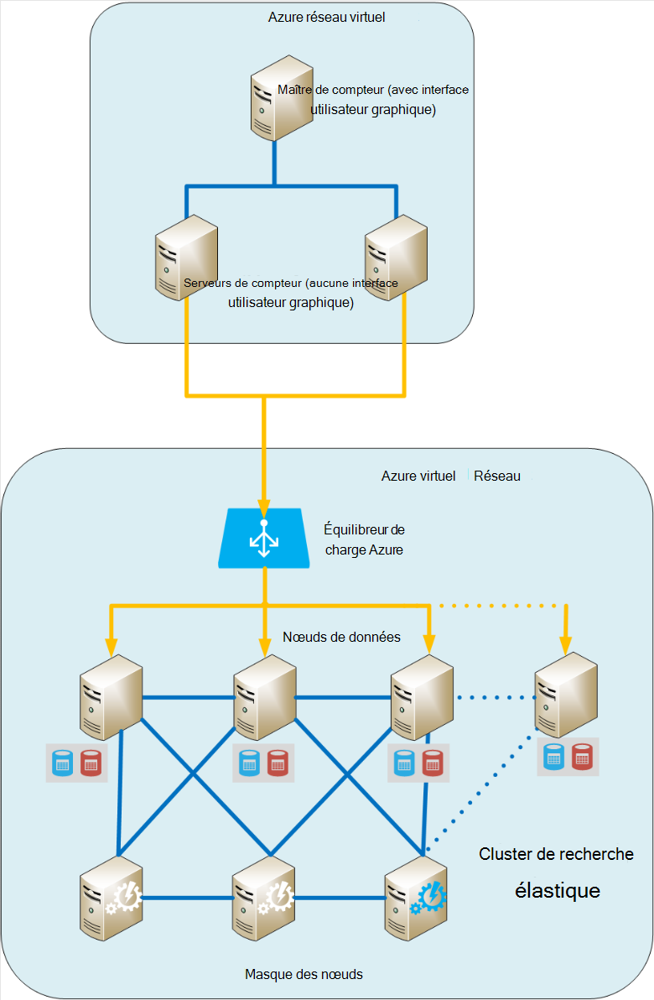
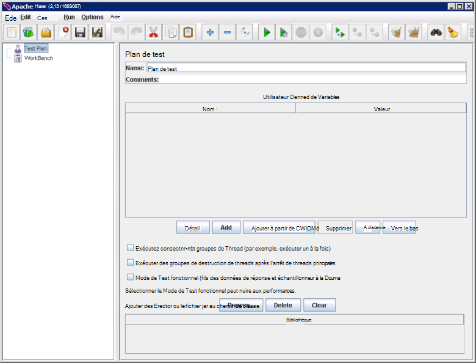
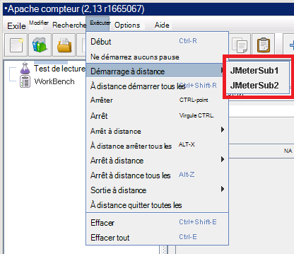
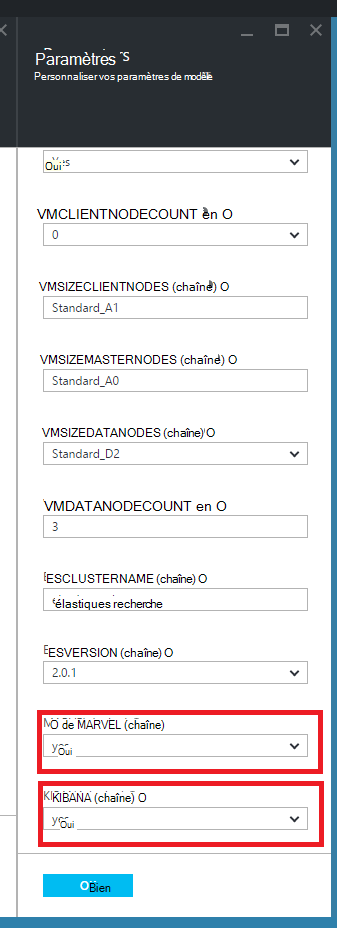
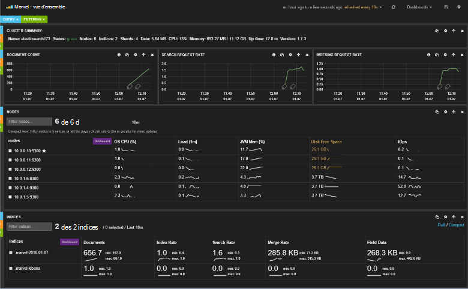
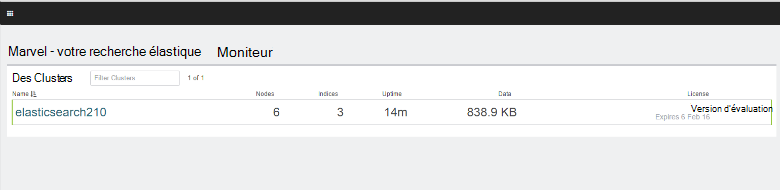
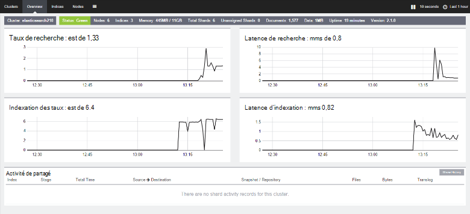

<properties
   pageTitle="Création d’un environnement de test pour Elasticsearch de performances | Microsoft Azure"
   description="Comment configurer un environnement pour tester les performances d’un cluster de Elasticsearch."
   services=""
   documentationCenter="na"
   authors="dragon119"
   manager="bennage"
   editor=""
   tags=""/>

<tags
   ms.service="guidance"
   ms.devlang="na"
   ms.topic="article"
   ms.tgt_pltfrm="na"
   ms.workload="na"
   ms.date="09/22/2016"
   ms.author="masashin"/>
   
# <a name="creating-a-performance-testing-environment-for-elasticsearch-on-azure"></a>Création d’un environnement de test pour Elasticsearch sur Azure de performances

[AZURE.INCLUDE [pnp-header](../../includes/guidance-pnp-header-include.md)]

Cet article fait [partie d’une série](guidance-elasticsearch.md). 

Ce document décrit comment configurer un environnement pour tester les performances d’un cluster de Elasticsearch. Cette configuration a été utilisée pour tester les performances des charges de réception et de requête de données, comme décrit dans les [performances de réception de données de réglage pour Elasticsearch sur Azure][].

Le processus de test de performances utilisé [Apache JMeter](http://jmeter.apache.org/), avec le [jeu standard](http://jmeter-plugins.org/wiki/StandardSet/) de plug-ins installés dans une configuration maître/esclave à l’aide d’un ensemble d’ordinateurs virtuels dédiés (qui ne fait pas partie du cluster Elasticsearch) spécialement configuré à cet effet. 

L' [Analyseur de performances Server Agent](http://jmeter-plugins.org/wiki/PerfMonAgent/) a été installé sur chaque nœud de Elasticsearch. Les sections suivantes fournissent des instructions pour la recréation de l’environnement de test pour vous permettre d’effectuer vos propres tests de performances avec JMeter. Ces instructions supposent que vous avez déjà créé un cluster Elasticsearch avec des noeuds connectés à l’aide d’un réseau virtuel Azure. 

Notez que l’environnement de test s’exécute également sous la forme d’un ensemble de machines virtuelles d’Azure géré à l’aide d’un groupe de ressources Azure unique.

[Marvel](https://www.elastic.co/products/marvel) a été également installé et configuré pour permettre les fonctionnement des aspects internes du cluster Elasticsearch pour être surveillé et analysé plus facilement. Si les statistiques de JMeter a révélé un creux ou un pic des performances, informations disponibles par le biais de Marvel est inestimables pour aider à déterminer la cause des fluctuations.

L’image suivante illustre la structure de l’ensemble du système. 



Notez les points suivants :

- Le masque JMeter machine virtuelle exécute Windows Server pour fournir l’interface GUI pour la console de JMeter. Le VM JMeter maître fournit l’interface utilisateur graphique (l’application de *jmeter* ) pour permettre un testeur créer des tests, des tests et visualiser les résultats. Cet ordinateur virtuel coordonne avec le serveur JMeter VM qui envoyer les demandes qui constituent les tests.

- Les ordinateurs virtuels de subordonnés JMeter exécutent Ubuntu serveur (Linux), il est inutile de l’interface utilisateur graphique pour ces ordinateurs virtuels. Le serveur JMeter ordinateurs virtuels s’exécutent le logiciel du serveur (l’application de *jmeter serveur* ) pour envoyer des demandes au cluster Elasticsearch JMeter.

- Les nœuds de client dédié n’étaient pas utilisés, bien que les nœuds maîtres dédiés.

- Le nombre de nœuds de données dans le cluster peut varier, en fonction du scénario testé.

- Tous les nœuds du cluster Elasticsearch exécutent Marvel d’observer les performances lors de l’exécution et l’Agent de serveur JMeter pour collecter des données de surveillance pour une analyse ultérieure.

- Lors du test Elasticsearch 2.0.0 et par la suite, un des nœuds de données s’exécute également Kibana. Cela est requis par la version de Marvel qui s’exécute sur le Elasticsearch 2.0.0 et versions ultérieures.

## <a name="creating-an-azure-resource-group-for-the-virtual-machines"></a>Création d’un groupe de ressources Azure pour les machines virtuelles

Le masque de JMeter doit être en mesure de se connecter directement à chacun des nœuds du cluster Elasticsearch pour collecter des données de performances. Si le JMeter VNet est différent du cluster Elasticsearch VNet, cela implique la configuration de chaque nœud de Elasticsearch avec une adresse IP publique. Si cela a un problème avec votre configuration de Elasticsearch, puis que vous envisagez d’implémenter les ordinateurs virtuels de JMeter dans le même VNet que le cluster Elasticsearch en utilisant le même groupe de ressources, auquel cas vous pouvez omettre cette première procédure.

Tout d’abord, [créez un groupe de ressources](../resource-group-template-deploy-portal.md). Ce document suppose que votre groupe de ressources est nommé *JMeterPerformanceTest*. Si vous souhaitez exécuter les ordinateurs virtuels de JMeter dans le même VNet que le cluster Elasticsearch, utilisez le même groupe de ressources en tant que cluster au lieu de créer un nouveau.

## <a name="creating-the-jmeter-master-virtual-machine"></a>Création de l’ordinateur virtuel principal de JMeter

Prochaine [créer un ordinateur virtuel de Windows](../virtual-machines/virtual-machines-windows-hero-tutorial.md) à l’aide de l’image de *Windows Server 2008 R2 SP1* .  Nous vous recommandons de sélectionner une taille de mémoire virtuelle avec suffisamment de cœurs et de mémoire pour exécuter les tests de performances. Dans l’idéal, ce sera une machine au moins 2 de cœurs et de 3,5 Go de mémoire RAM (A2 Standard ou supérieure).

<!-- TODO add info on why disabling diagnostics is positive --> 

Nous vous recommandons de désactiver les tests de diagnostic. Lors de la création de la machine virtuelle dans le portail, cela sur la lame de *paramètres* dans la section *analyse* sous *Diagnostics*. Laissez les autres paramètres à leurs valeurs par défaut.

Vérifiez que l’ordinateur virtuel et toutes les ressources associées ont été créées avec succès en [examinant le groupe de ressources](../azure-portal/resource-group-portal.md#manage-resource-groups) dans le portail. Les ressources répertoriées doivent se composer d’une machine virtuelle, un groupe de sécurité du réseau et une adresse IP publique portant toutes le même nom et compte de stockage et d’interface réseau avec des noms basés sur celui de la machine virtuelle.

## <a name="creating-the-jmeter-subordinate-virtual-machines"></a>Création de machines virtuelles JMeter secondaires

À présent [créer une machine virtuelle de Linux](../virtual-machines/virtual-machines-linux-quick-create-portal.md) à l’aide de l’image *d’Ubuntu Server 14.04 LTS* .  À l’instar de la machine virtuelle dans la base de JMeter, sélectionnez une taille de mémoire virtuelle avec suffisamment de cœurs et de mémoire pour exécuter les tests de performances. Dans l’idéal, ce sera une machine au moins 2 noyaux et d’au moins 3,5 Go de RAM (A2 Standard ou supérieure).

Là encore, nous vous recommandons de désactiver les tests de diagnostic.

Vous pouvez créer des ordinateurs virtuels subordonnés autant que vous le souhaitez. 

## <a name="installing-jmeter-server-on-the-jmeter-subordinate-vms"></a>L’installation serveur de JMeter sur les ordinateurs virtuels de JMeter secondaires

Les ordinateurs virtuels de JMeter subordonnés exécutant Linux et par défaut vous ne peut pas se connecter à leur en ouvrant une connexion Bureau à distance (RDP). Au lieu de cela, vous pouvez [utiliser PuTTY pour ouvrir une fenêtre de ligne de commande](../virtual-machines/virtual-machines-linux-mac-create-ssh-keys.md) sur chaque ordinateur virtuel.

Une fois que vous avez connecté à l’un des ordinateurs virtuels subordonnés, nous allons utiliser Bash d’installation JMeter.

Tout d’abord installer l’environnement d’exécution Java requis pour exécuter JMeter.

```bash
sudo add-apt-repository ppa:webupd8team/java
sudo apt-get update
sudo apt-get install oracle-java8-installer
```

À présent, téléchargez le logiciel JMeter présente sous la forme d’un fichier zip.

```bash
wget http://apache.mirror.anlx.net/jmeter/binaries/apache-jmeter-2.13.zip
```

Installer la commande Unzip (décompresser), puis l’utiliser pour développer le logiciel JMeter. Le logiciel est copié vers un dossier nommé **apache-jmeter-2,13**.

```bash
sudo apt-get install unzip
unzip apache-jmeter-2.13.zip
```

Modifier dans le répertoire *bin* contenant les exécutables JMeter et rendre les programmes *jmeter-serveur* et *jmeter* exécutable.

```bash
cd apache-jmeter-2.13/bin
chmod u+x jmeter-server
chmod u+x jmeter
```

Maintenant, nous devons modifier le fichier `jmeter.properties` situé dans le dossier en cours (utilisez l’éditeur de texte vous est plus familier, tel que *vi* ou *vim*). Recherchez les lignes suivantes :

```yaml
...
client.rmi.localport=0
...
server.rmi.localport=4000
...
```

Supprimez le commentaire (suppriment les \#les caractères #) et modifier ces lignes, comme illustré ci-dessous, puis enregistrez le fichier et fermez l’éditeur :

```yaml
...
client.rmi.localport=4441
...
server.rmi.localport=4440
```

Maintenant, exécutez les commandes suivantes pour ouvrir le port 4441 pour le trafic TCP entrant (c’est le port que vous venez de configurer *jmeter-serveur* pour écouter) :

```bash
sudo iptables -A INPUT -m state --state NEW -m tcp -p tcp --dport 4441 -j ACCEPT
```

Téléchargez le fichier zip qui contient la collection standard de plug-ins pour JMeter (ces plug-ins fournissent des compteurs de performance de surveillance) et puis décompressez le fichier dans le dossier **apache-jmeter-2,13** . Décompresser le fichier dans cet emplacement pour placer les plug-ins dans le dossier approprié.

Si vous êtes invité à remplacer le fichier de licence, tapez A (tous) :

```bash
wget http://jmeter-plugins.org/downloads/file/JMeterPlugins-Standard-1.3.0.zip
unzip JMeterPlugins-Standard-1.3.0.zip
```

Utilisez `nohup` pour lancer le serveur JMeter en arrière-plan. Elle doit répondre en affichant un ID de processus et un message indiquant qu’il a créé un objet distant et est prêt à recevoir des commandes.  Exécutez la commande suivante dans le répertoire ~/apache-jmeter-2.13/bin. 

```bash
nohup jmeter-server &
```

> [AZURE.NOTE]Si la machine virtuelle est arrêtée le programme serveur de JMeter est terminé. Vous devez vous connecter à la machine virtuelle, redémarrez à nouveau manuellement. Vous pouvez également configurer le système pour exécuter la commande *jmeter-server* automatiquement au démarrage, en ajoutant les commandes suivantes pour le `/etc/rc.local` fichier (avant la commande *quitter 0* ) :

```bash
sudo -u <username> bash << eoc
cd /home/<username>/apache-jmeter-2.13/bin
nohup ./jmeter-server &
eoc
```

Remplacer `<username>` avec votre nom de connexion.

Vous sera utile maintenir la fenêtre de terminal afin que vous pouvez surveiller la progression du serveur JMeter alors que le test est en cours.

Vous devez répéter ces étapes pour chaque VM secondaire JMeter.

## <a name="installing-the-jmeter-server-agent-on-the-elasticsearch-nodes"></a>Installation de l’Agent de serveur de JMeter sur les nœuds de Elasticsearch

Cette procédure suppose que vous avez accès aux nœuds Elasticsearch. Si vous avez créé le cluster en utilisant le modèle de gestionnaire de ressources, vous pouvez vous connecter à chaque nœud par le biais de la zone passer VM, comme illustré dans la section topologie de Elasticsearch de [Elasticsearch d’en cours d’exécution sur Azure](guidance-elasticsearch-running-on-azure.md). Vous pouvez vous connecter à la zone de passer à l’aide de PuTTY ainsi. 

À partir de là, vous pouvez utiliser la commande *ssh* pour vous connecter à chacun des nœuds du cluster Elasticsearch.

Connectez-vous à un des nœuds du Elasticsearch en tant qu’administrateur.  À l’invite de commande Bash, entrez les commandes suivantes pour créer un dossier pour contenir l’Agent de serveur JMeter et les déplacer dans ce dossier :

```bash
mkdir server-agent
cd server-agent
```

Exécutez les commandes suivantes pour installer la commande *unzip* (si elle n’est pas déjà installé), téléchargez le logiciel d’Agent de serveur JMeter et décompressez-le :

```bash
sudo apt-get install unzip
wget http://jmeter-plugins.org/downloads/file/ServerAgent-2.2.1.zip
unzip ServerAgent-2.2.1.zip
```
 
Exécutez la commande suivante pour configurer le pare-feu et activer le trafic TCP via le port 4444 (c’est le port utilisé par l’Agent de serveur JMeter) :

```bash
sudo iptables -A INPUT -m state --state NEW -m tcp -p tcp --dport 4444 -j ACCEPT
```

Exécutez la commande suivante pour démarrer l’Agent de serveur JMeter en arrière-plan :

```bash
nohup ./startAgent.sh &
```

L’Agent de serveur JMeter doit répondre avec des messages indiquant qu’il a démarré et qu’il est à l’écoute sur le port 4444.  Appuyez sur ENTRÉE pour obtenir une invite de commande, puis exécutez la commande suivante.

```bash
telnet <nodename> 4444
```

Remplacer `<nodename>` avec le nom du nœud. (Vous pouvez trouver le nom du nœud en exécutant la `hostname` commande.) Cette commande ouvre une connexion telnet avec le port 4444 sur votre ordinateur local. Vous pouvez utiliser cette connexion pour vérifier que l’Agent de serveur JMeter s’exécute correctement.

Si l’Agent de serveur JMeter ne fonctionne pas, vous recevrez la réponse 

`*telnet: Unable to connect to remote host: Connection refused*.`

Si l’Agent serveur de JMeter est en cours d’exécution et le port 4444 n’a pas été configuré correctement, vous devriez voir la réponse suivante :


> [AZURE.NOTE] La session telnet ne fournit pas de tout type d’invite de commandes une fois qu’il est connecté.

Dans la session telnet, tapez la commande suivante :

``` 
test
```

Si l’Agent serveur de JMeter est configuré et écoute correctement, il doit indiquer qu’il a reçu la commande et y répondre avec le message *Yep*.

> [AZURE.NOTE]Vous pouvez taper dans d’autres commandes pour obtenir des données d’analyse des performances. Par exemple, la commande `metric-single:cpu:idle` vous donnera l’orientation actuelle de l’heure à laquelle le processeur est inactif (il s’agit d’un instantané). Pour obtenir une liste complète des commandes, visitez la page de [L’Agent serveur de PerfMon](http://jmeter-plugins.org/wiki/PerfMonAgent/) . : À appeler Perfmon serveur Agent. >>

Dans la session telnet, tapez la commande suivante pour quitter la session et revenir à l’invite de commande Bash :

``` 
exit
```

> [AZURE.NOTE]Comme avec le JMeter secondaire d’ordinateurs virtuels, si vous vous déconnectez, ou si cet ordinateur est arrêté et redémarré, l’Agent de serveur JMeter devrez redémarrer manuellement à l’aide de la `startAgent.sh` commande. Si vous souhaitez que l’Agent de serveur JMeter pour un démarrage automatique, ajoutez la commande suivante à la fin de la `/etc/rc.local` fichier, avant la commande *exit 0* . 
> Remplacer `<username>` avec votre nom de connexion :

```bash
sudo -u <username> bash << eoc
cd /home/<username>/server-agent
nohup ./startAgent.sh &
eoc
```

Vous pouvez maintenant soit répéter ce processus pour tous les autres nœuds du cluster Elasticsearch, ou vous pouvez utiliser la `scp` commande pour copier le dossier de l’agent-serveur et le contenu à tous les autres nœuds et utilisation du `ssh` commande Démarrer l’Agent de serveur JMeter comme indiqué ci-dessous. e remplacer `<username>` avec votre nom d’utilisateur, et `<nodename>` avec le nom du nœud où vous souhaitez copier et exécuter le logiciel (vous devrez peut-être fournir votre mot de passe pendant que vous exécutez chaque commande) :

```bash
scp -r \~/server-agent <username>@<nodename>:\~
ssh <nodename> sudo iptables -A INPUT -m state --state NEW -m tcp -p tcp --dport 4444 -j ACCEPT
ssh <nodename> -n -f 'nohup \~/server-agent/startAgent.sh'
```

## <a name="installing-and-configuring-jmeter-on-the-jmeter-master-vm"></a>Installation et configuration de JMeter sur l’ordinateur virtuel principal de JMeter

Dans le portail Azure, cliquez sur **groupes de ressources**. De la lame de **groupes de ressources** , cliquez sur le groupe de ressources contenant les JMeter maître et les ordinateurs virtuels subordonnés.  Dans la lame du **groupe de ressources** , cliquez sur la **machine virtuelle de la base de JMeter**. De la lame de la machine virtuelle, dans la barre d’outils, cliquez sur **se connecter**. Ouvrez le fichier RDP lorsque vous y êtes invité par le navigateur web. Windows crée une connexion Bureau à distance à votre ordinateur virtuel.  Entrez le nom d’utilisateur et le mot de passe pour l’ordinateur virtuel lorsque vous y êtes invité.

Dans la machine virtuelle, à l’aide d’Internet Explorer, accédez à la page de [Téléchargement de Java pour Windows](http://www.java.com/en/download/ie_manual.jsp) . Suivez les instructions pour télécharger et exécuter le programme d’installation de Java.

Dans le navigateur web, accédez à la page de [Téléchargement de JMeter de Apache](http://jmeter.apache.org/download_jmeter.cgi) et télécharger le zip contenant les éléments binaires plus récente. Enregistrez le zip dans un emplacement commode sur votre machine virtuelle.

Rendez-vous sur le site de [Plug-ins de JMeter personnalisé](http://jmeter-plugins.org/) et télécharger le jeu Standard de plug-ins. Enregistrez le zip dans le même dossier que le téléchargement de JMeter de l’étape précédente.

Dans l’Explorateur Windows, accédez au dossier contenant l’apache-jmeter - fichier zip*xxx* , où *xxx* est la version actuelle de JMeter. Extrayez les fichiers dans le dossier en cours.

Extraire les fichiers dans le JMeterPlugins-Standard - fichier .zip*yyy*, où *yyy* est la version actuelle des plug-ins, dans apache-jmeter - dossier de*xxx* . Cela ajoutera les plug-ins dans le dossier approprié pour JMeter. Vous pouvez en toute sécurité fusionner les dossiers lib et remplacer les fichiers Lisez-moi et de licence si vous y êtes invité.

Accédez à apache-dossier /bin*xxx*jmeter et le jmeter.properties de modifier le fichier dans le bloc-notes.  Dans le `jmeter.properties` de fichiers, recherchez la section intitulée *hôtes distants et configuration de RMI*.  Dans cette section du fichier, recherchez la ligne suivante :

```yaml
remote_hosts=127.0.0.1
```

Modifiez cette ligne et remplacer la liste d’adresse 127.0.0.1 avec une virgule séparée IP d’adresses IP ou des noms d’hôte pour chaque serveur subordonné JMeter. Par exemple :

```yaml
remote_hosts=JMeterSub1,JMeterSub2
```

Recherchez la ligne suivante, puis supprimez la `#` de caractères au début de cette ligne et modifier la valeur des paramètres à partir de client.rmi.localport :

```yaml
#client.rmi.localport=0
```

À :

```yaml
client.rmi.localport=4440
```

Enregistrez le fichier et fermez le bloc-notes. 

Dans la barre d’outils Windows, cliquez sur **Démarrer**, sur **Outils d’administration**, puis cliquez sur **Pare-feu Windows avec sécurité avancée**.  Dans le pare-feu Windows avec sécurité avancée fenêtre, dans le volet gauche, cliquez sur **Règles de trafic entrant**, puis cliquez sur **Nouvelle règle**.

Dans l' **Assistant Nouvelle règle de trafic entrant**, dans la page **Type de règle** , sélectionnez le **Port**, puis cliquez sur **suivant**.  Dans la page protocoles et Ports, sélectionnez **TCP**, sélectionnez des **ports locaux spécifiques**, dans le type de zone de texte `4440-4444`, puis cliquez sur **suivant**.  Dans la page Action, sélectionnez **Autoriser la connexion**, puis cliquez sur **suivant**. Sur la page profil, laissez toutes les options de vérification, puis sur **suivant**.  Dans la page Nom, dans le **nom de** zone de texte Tapez *JMeter*, puis cliquez sur **Terminer**.  Fermez le pare-feu Windows avec sécurité avancée.

Dans l’Explorateur Windows, dans apache-jmeter - dossier /bin de*xx*, double-cliquez sur le fichier de commandes de Windows *jmeter* pour démarrer l’interface utilisateur. L’interface utilisateur doit s’afficher :



Dans la barre de menus, cliquez sur **exécuter**, cliquez sur **Démarrer à distance**et vérifiez que les deux machines secondaires JMeter sont répertoriés :



Vous êtes maintenant prêt à commencer le test des performances.

## <a name="installing-and-configuring-marvel"></a>Installation et configuration de Marvel

Le modèle de démarrage rapide de Elasticsearch pour Azure installent et configurent automatiquement de la version appropriée de Marvel si vous définissez les paramètres MARVEL et KIBANA sur true (« Oui ») lors de la création d’un cluster :



Si vous ajoutez Marvel à un cluster existant, vous devez effectuer une installation manuelle, et que le processus est différent selon que vous utilisez Elasticsearch version 1.7.x ou 2.x, comme décrit dans les procédures suivantes.

### <a name="installing-marvel-with-elasticsearch-173-or-earlier"></a>L’installation de Marvel avec 1,73 de Elasticsearch ou une version antérieure

Si vous utilisez Elasticsearch 1.7.3 ou versions antérieures, effectuez les suivantes étapes *sur chaque nœud* du cluster :

- Connectez-vous au nœud et déplacer vers le répertoire Elasticsearch.  Sous Linux, le répertoire de base par défaut est `/usr/share/elasticsearch`.

-  Exécutez la commande suivante pour télécharger et installer le plug-in Marvel pour Elasticsearch :

```bash
sudo bin/plugin -i elasticsearch/marvel/latest
```

- Arrêtez et redémarrez le Elasticsearch sur le nœud :

```bash
sudo service elasticsearch restart
```

- Pour vérifier que Marvel a été correctement installé, ouvrez un navigateur web et accédez à l’URL `http://<server>:9200/_plugin/marvel`. Remplacer `<server>` avec le nom ou l’adresse IP d’un serveur de Elasticsearch dans le cluster.  Vérifiez qu’une page similaire à celle illustrée ci-dessous s’affiche :




### <a name="installing-marvel-with-elasticsearch-200-or-later"></a>L’installation de Marvel avec Elasticsearch 2.0.0 ou ultérieur

Si vous utilisez Elasticsearch 2.0.0 ou ultérieurement, exécutez le suivant tâches *sur chaque nœud* du cluster :

Ouvrir une session sur le nœud et le déplacer vers le répertoire de base de Elasticsearch (généralement `/usr/share/elasticsearch`) exécutez les commandes suivantes pour télécharger et installer le plug-in Marvel pour Elasticsearch :

```bash
sudo bin/plugin install license
sudo bin/plugin install marvel-agent
```

Arrêtez et redémarrez le Elasticsearch sur le nœud :

```bash
sudo service elasticsearch restart
```

Dans la procédure suivante, remplacez `<kibana-version>` avec 4.2.2 si vous utilisez Elasticsearch 2.0.0 ou Elasticsearch 2.0.1 ou 4.3.1 si vous utilisez Elasticsearch 2.1.0 ou version ultérieure.  Remplacer `<marvel-version>` avec 2.0.0 si vous utilisez Elasticsearch 2.0.0 ou Elasticsearch 2.0.1 ou 2.1.0 si vous utilisez Elasticsearch 2.1.0 ou version ultérieure.  Effectuer le suivant les tâches *sur un seul nœud* du cluster :

Ouvrir une session sur le nœud et télécharger la version appropriée de Kibana pour votre version de Elasticsearch à partir de [Elasticsearch de téléchargement du site web](https://www.elastic.co/downloads/past-releases), puis extrayez le package :

```bash
wget https://download.elastic.co/kibana/kibana/kibana-<kibana-version>-linux-x64.tar.gz
tar xvzf kibana-<kibana-version>-linux-x64.tar.gz
```

Ouvrez le port 5601 à accepter des demandes entrantes :

```bash
sudo iptables -A INPUT -m state --state NEW -m tcp -p tcp --dport 5601 -j ACCEPT
```

Déplacer vers le dossier de configuration de Kibana (`kibana-<kibana-version>-linux-x64/config`), modifier les `kibana.yml` de fichier et ajoutez la ligne suivante. Remplacer `<server>` avec le nom ou l’adresse IP d’un serveur de Elasticsearch dans le cluster :

```yaml
elasticsearch.url: "http://<server>:9200"
```

Déplacer vers le dossier bin de Kibana (`kibana-<kibana-version>-linux-x64/bin`), et exécutez la commande suivante pour intégrer le plug-in Marvel Kibana :

```bash
sudo ./kibana plugin --install elasticsearch/marvel/<marvel-version>
```

Kibana de démarrer :

```bash
sudo nohup ./kibana &
```

Pour vérifier l’installation Marvel, ouvrez un navigateur web et accédez à l’URL `http://<server>:5601/app/marvel`. Remplacer `<server>` avec le nom ou l’adresse IP du serveur exécutant Kibana.

Vérifiez qu’une page similaire à celle illustrée ci-dessous s’affiche (le nom de votre cluster varient probablement de celle illustrée dans l’image).



Cliquez sur le lien qui correspond à votre cluster (elasticsearch210 dans l’image ci-dessus). Une page similaire à celui indiqué ci-dessous doit s’afficher :




[Réglage des performances d’acquisition de données pour Elasticsearch sur Azure]: guidance-elasticsearch-tuning-data-ingestion-performance.md  