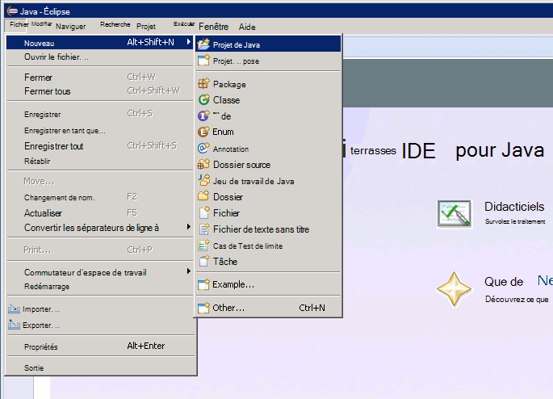
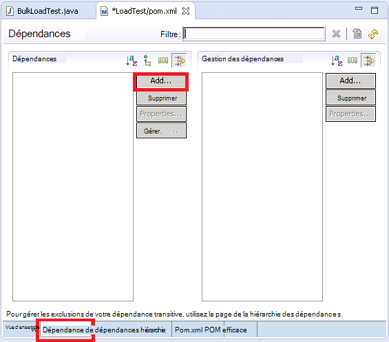

<properties
   pageTitle="Déploiement d’un échantillon de JMeter JUnit pour le test de performances de Elasticsearch | Microsoft Azure"
   description="Comment utiliser un échantillon de JUnit pour générer et transférer des données vers un cluster de Elasticsearch."
   services=""
   documentationCenter="na"
   authors="dragon119"
   manager="bennage"
   editor=""
   tags=""/>

<tags
   ms.service="guidance"
   ms.devlang="na"
   ms.topic="article"
   ms.tgt_pltfrm="na"
   ms.workload="na"
   ms.date="09/22/2016"
   ms.author="masashin"/>
   
# Déploiement d’un échantillon de JMeter JUnit pour le test de performances de Elasticsearch

[AZURE.INCLUDE [pnp-header](../../includes/guidance-pnp-header-include.md)]

Cet article fait [partie d’une série](guidance-elasticsearch.md). 

Ce document décrit comment créer et utiliser un échantillon de JUnit qui peut générer et télécharger les données vers un cluster de Elasticsearch dans le cadre d’un plan de test JMeter. Cette approche offre une approche très souple pour le test de charge qui peut générer de grandes quantités de données de test sans en fonction des fichiers de données externes.

> [AZURE.NOTE] Les tests de charge utilisées pour évaluer la performance de l’ingestion de données décrite dans les [performances de réception de données de réglage pour Elasticsearch](guidance-elasticsearch-tuning-data-ingestion-performance.md) ont été construits à l’aide de cette approche. Les détails du code JUnit sont décrits dans ce document.

Pour des performances de réception de données test, le code JUnit développait utilisant Eclipse (Mars) et dépendances ont été résolus à l’aide de Maven. Les procédures suivantes décrivent le processus étape par étape pour installer Eclipse, configuration Maven, création d’un test de JUnit et déployer ce test sous la forme d’un échantillon de la demande de JUnit dans un test de JMeter.

> [AZURE.NOTE] Pour plus d’informations sur la structure et la configuration de l’environnement de test, consultez [Création d’un environnement de test de performances de Elasticsearch sur Azure][].

## Installation des composants requis

Vous aurez besoin de l' [Environnement d’exécution Java](http://www.java.com/en/download/ie_manual.jsp) sur votre ordinateur de développement.
Vous devez également installer l' [IDE Eclipse pour les développeurs Java](https://www.eclipse.org/downloads/index.php?show_instructions=TRUE).

> [AZURE.NOTE] Si vous n’utilisez pas l’ordinateur virtuel principal JMeter décrit dans [Création d’un environnement de test de performances de Elasticsearch sur Azure][] comme environnement de développement, téléchargez la version de Windows 32 bits de l’installateur d’Eclipse.

## Création d’un projet de test JUnit pour la Elasticsearch de test de charge

Démarrer l’IDE Eclipse, si elle n’est pas déjà en cours d’exécution et fermez la page **d’accueil** .  Dans le menu **fichier** , cliquez sur, puis cliquez sur **Projet de Java**.

Dans la fenêtre **Nouveau projet Java** , permet d’entrer un nom de projet, sélectionnez **JRE par défaut**, puis cliquez sur **Terminer**.

Dans la fenêtre de **l’Explorateur de Package** , développez le nœud nommé d’après votre projet. Vérifiez qu’il contient un dossier nommé **src** et une référence à l’environnement spécifié.

Cliquez sur le dossier **src** et cliquez sur **Nouveau**, puis cliquez sur **JUnit les cas de Test**.

Dans la fenêtre **Nouveau cas de Test JUnit** , sélectionnez **Nouveau Junit 4 test**, entrez un nom pour le package (Cela peut être le même que le nom du projet, bien que par convention, il doit commencer par une lettre minuscule), un nom pour la classe de test, puis sélectionnez les options de génèrent les stubs de méthode requis pour votre test. Laissez vide la zone de la **classe en cours de test** , puis cliquez sur **Terminer**.

Si la boîte de dialogue **Nouveau cas de Test JUnit** s’affiche, sélectionnez l’option pour ajouter la bibliothèque de JUnit 4 pour le chemin d’accès de build et puis cliquez sur **OK**. 

Vérifiez que le code squelette pour le test de JUnit est généré et affiché dans la fenêtre de l’éditeur de Java.

Dans l' **Explorateur de Package**, cliquez sur le nœud de votre projet, cliquez sur **configurer**, puis cliquez sur **convertir en projet de Maven**.

> [AZURE.NOTE]Un projet à l’aide de Maven vous permet de plus facilement gérer les dépendances externes (par exemple, les bibliothèques de client Elasticsearch Java) dépend.

Dans la **POM de nouveau de créer** la boîte de dialogue, dans la liste déroulante **d’emballage** , sélectionnez **jar**et puis cliquez sur **Terminer**.

Le volet qui s’affiche au-dessous de l’éditeur de modèle (POM) objet projet peut afficher l’avertissement « chemin d’accès de Build Spécifie l’environnement d’exécution-J2SE 1.5. Il n’existe aucun JRE installé dans l’espace de travail qui est strictement compatible avec cet environnement », selon la version de Java est installée sur votre ordinateur de développement. Si vous avez une version de Java qui est ultérieure à la version 1.5, vous pouvez ignorer cet avertissement.

Dans l’éditeur POM, développez les **Propriétés** , puis cliquez sur **créer**.

Dans la boîte de dialogue **Ajouter une propriété** , dans la zone **nom** , tapez *es.version*, dans la zone **valeur** , tapez *1.7.2*et puis cliquez sur **OK**. Il s’agit de la version de la bibliothèque client de Elasticsearch Java à utiliser (cette version peut être remplacée à l’avenir, et définissant la version comme une propriété POM et la référence à cette propriété ailleurs dans le projet permettent de modifier rapidement la version).

Cliquez sur l’onglet **dépendances** à la base de l’éditeur POM, puis cliquez sur **Ajouter** en regard de la liste des **dépendances** .

Dans la boîte de dialogue **Sélectionner une dépendance** , tapez *org.elasticsearch*dans la zone **Id de groupe** , dans la zone **Id de l’artefact** , tapez *elasticsearch*, dans la zone **Version** , tapez * \${es.version}*, puis cliquez sur **OK**. Informations sur la bibliothèque de client Java Elasticsearch sont conservées dans le référentiel Central Maven en ligne, et cette configuration télécharge automatiquement la bibliothèque et ses dépendances lorsque le projet est généré.

Dans le menu **fichier** , cliquez sur **Enregistrer tout**. Cette action va enregistrer et générez le projet, en téléchargeant les dépendances spécifiées par Maven. Vérifiez que le dossier Maven dépendances s’affiche dans l’Explorateur de Package. Développez ce dossier pour afficher les fichiers jar téléchargés pour prendre en charge de la bibliothèque client de Elasticsearch Java.

## Importation d’un projet de test existant JUnit dans Éclipse

Cette procédure suppose que vous avez téléchargé un projet Maven créé précédemment à l’aide d’Eclipse.

Démarrer l’Eclipse IDE. Dans le menu **fichier** , cliquez sur **Importer**.

Dans la fenêtre **Sélectionnez** , développez le dossier **Maven** et cliquez sur **Les projets Maven existant**puis cliquez sur **suivant**.

Dans la fenêtre **Projets de Maven** , spécifiez le dossier contenant le projet (le dossier contenant le fichier pom.xml), cliquez sur **Sélectionner tout**, puis cliquez sur **Terminer**.

Dans la fenêtre de **l’Explorateur de Package** , développez le nœud correspondant à votre projet. Vérifiez que le projet contient un dossier nommé **src**. Ce dossier contient le code source pour le test de JUnit. Le projet peut être compilé et déployé en suivant les instructions ci-dessous.

## Déploiement d’un test de JUnit à JMeter

Cette procédure suppose que vous avez créé un projet nommé LoadTest contenant une classe JUnit Test nommée `BulkLoadTest.java` qui accepte des paramètres de configuration passés comme une chaîne unique à un constructeur (c’est le mécanisme qui attend de JMeter).

Dans l’environnement IDE Eclipse, dans l' **Explorateur de Package**, cliquez sur le nœud du projet, puis cliquez sur **Exporter**.

Dans l' **Assistant Exportation**, dans la page **Sélectionnez** , développez le nœud **Java** , cliquez sur **un fichier JAR**, puis cliquez sur **suivant**.

Sur la page de **Spécification du fichier JAR** , dans la zone **Sélectionner les ressources à exporter** , développez le projet désélectionnez **.project**et désélectionnez l’option **pom.xml**. Dans la zone **d’un fichier JAR** , fournir un nom de fichier et un emplacement pour le fichier JAR (il convient de prévoir l’extension de fichier .jar), puis cliquez sur **Terminer**.

À l’aide de l’Explorateur Windows, copiez le fichier JAR, vous venez de créer à la JVM maître JMeter et l’enregistrez dans apache-jmeter-2,13\\lib\\dossier junit sous le dossier où vous avez installé JMeter (voir la procédure « Création de la machine virtuelle de maître JMeter » lors de la [Création d’un environnement de test de performances de Elasticsearch sur Azure](guidance-elasticsearch-creating-performance-testing-environment.md) pour plus d’informations.)

Revenir à Eclipse, agrandissez la fenêtre de **l’Explorateur de Package** et prenez note de tous les fichiers JAR et leurs emplacements répertoriés dans le dossier Maven dépendances pour le projet. Notez que les fichiers affichés dans l’image suivante peuvent varier en fonction de la version de Elasticsearch que vous utilisez :

À l’aide de l’Explorateur Windows, copiez chaque fichier JAR référencé dans le dossier dépendances de Maven apache-jmeter-2,13\\lib\\dossier junit sur l’ordinateur virtuel principal de JMeter.

Si la version de lib\\junit dossier, déjà contient d’anciennes versions de ces fichiers JAR puis les supprimer. Si vous les laissez en place le test JUnit peut ne pas fonctionne comme références peuvent être résolus pour les fichiers JAR incorrects.

Sur le masque JMeter VM, arrêter JMeter si est en cours d’exécution.  Démarrer JMeter.  Dans JMeter, cliquez droit sur le **Plan de Test**, cliquez sur **Ajouter**, cliquez sur **Threads (utilisateurs)**, puis cliquez sur **Groupe de threads**.

Sous le nœud de **Plan de Test** , cliquez droit sur le **Groupe de threads**et cliquez sur **Ajouter**, sur **un échantillon**, puis cliquez sur **Demande de JUnit**.

Sur la page **Demande de JUnit** , sélectionnez **Rechercher des annotations JUnit4 (au lieu de JUnit, 3)**. Dans la liste déroulante **nom de classe** , sélectionnez votre classe de test de charge de JUnit (il apparaît sous la forme * &lt;package&gt;.&lt; classe&gt;*), dans la **Méthode de Test** de la liste de la liste déroulante, sélectionnez le JUnit méthode de test (il s’agit de la méthode qui effectue le travail associé à l’essai et doit avoir été marqué avec la *@test* annotation dans le projet Eclipse) et entrez les valeurs à passer au constructeur dans la zone **Étiquette de chaîne de constructeur** . Les détails affichés dans l’image ci-dessous sont des exemples simples ; le **nom de classe**, *la *Méthode de Test*, et * *Étiquette de chaîne de constructeur** probablement diffèrent de ceux indiqués.

Si votre classe n’apparaît pas dans la liste déroulante **nom de classe** , cela signifie probablement que le fichier JAR n’a pas été exporté correctement ou n’a pas été placé dans la version de lib\\junit dossier ou parmi les fichiers JAR dépendants sont manquants à partir de la version de lib\\junit dossier. Si cela se produit, les exporter de nouveau le projet à partir d’Eclipse et vous assurer que vous avez sélectionné la ressource **src** , copiez le fichier JAR à la version de lib\\junit dossier, puis vérifiez que vous avez copié tous les pots dépendants répertoriés par Maven dans le dossier des lib.

Fermez JMeter. Il est inutile d’enregistrer le plan de test.  Copiez le fichier JAR contenant la classe de test JUnit pour la /home/&lt;nom d’utilisateur&gt;dossier /apache-jmeter-2.13/lib/junit sur chacun des ordinateurs virtuels subordonnés JMeter (*&lt;nom d’utilisateur&gt; * est le nom de l’utilisateur d’administration, vous avez spécifié lors de la création de la machine virtuelle, consultez la procédure « Création d’ordinateurs virtuels subordonnés JMeter » lors de la [Création d’un environnement de test de performances de Elasticsearch sur Azure](guidance-elasticsearch-creating-performance-testing-environment.md) pour plus d’informations.)

Copiez les fichiers JAR dépendantes requises par la classe de test JUnit pour la /home/&lt;nom d’utilisateur&gt;dossier /apache-jmeter-2.13/lib/junit sur chacun des ordinateurs virtuels secondaires JMeter. Assurez-vous d’abord supprimer les anciennes versions de fichiers JAR à partir de ce dossier.

Vous pouvez utiliser la `pscp` utilitaire pour copier des fichiers à partir d’un ordinateur Windows et Linux.

[Création d’un environnement de test pour Elasticsearch sur Azure de performances]: guidance-elasticsearch-creating-performance-testing-environment.md
