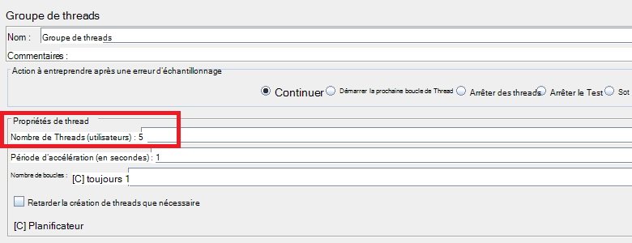
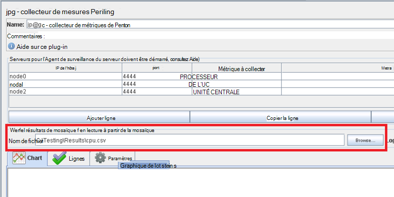
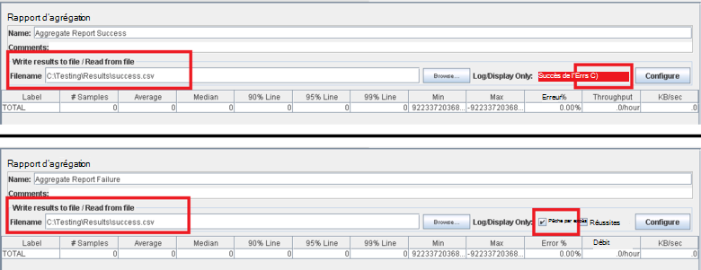
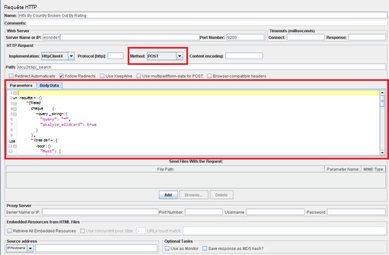

<properties
   pageTitle="Mise en œuvre d’un plan de test de JMeter pour Elasticsearch | Microsoft Azure"
   description="Performances des tests pour Elasticsearch avec JMeter."
   services=""
   documentationCenter="na"
   authors="dragon119"
   manager="bennage"
   editor=""
   tags=""/>

<tags
   ms.service="guidance"
   ms.devlang="na"
   ms.topic="article"
   ms.tgt_pltfrm="na"
   ms.workload="na"
   ms.date="09/22/2016"
   ms.author="masashin" />
   
# <a name="implementing-a-jmeter-test-plan-for-elasticsearch"></a>Mise en œuvre d’un plan de test de JMeter pour Elasticsearch

[AZURE.INCLUDE [pnp-header](../../includes/guidance-pnp-header-include.md)]

Cet article fait [partie d’une série](guidance-elasticsearch.md). 

Les tests de performances effectués par rapport à Elasticsearch ont été implémentés à l’aide de plans de test de JMeter avec le code Java incorporée en tant que JUnit test pour effectuer des tâches telles que le téléchargement de données dans le cluster. Les plans de test et le code de JUnit sont décrites dans les [performances de réception de données de réglage pour Elasticsearch sur Azure][]et [agrégation des données de réglage et les performances des requêtes pour Elasticsearch sur Azure][].

Ce document vise à synthétiser l’expérience clé acquise dans la construction et exécution de ces plans de test. La page [JMeter les meilleures pratiques](http://jmeter.apache.org/usermanual/best-practices.html) sur le site Web de Apache JMeter contient plus généralisée des conseils sur l’utilisation efficace de JMeter.

## <a name="implementing-a-jmeter-test-plan"></a>Mise en œuvre d’un plan de test JMeter

La liste suivante récapitule les éléments que vous devez envisager lors de la création d’un plan de test de JMeter :

- Créer un groupe de threads distincts pour chaque test que vous souhaitez effectuer. Un test peut contenir plusieurs étapes, y compris les contrôleurs de logique, minuteurs, des post-processeurs, des échantillonneurs et des écouteurs.

- Évitez de créer trop de threads dans un groupe de threads. Un nombre excessif de threads entraîne JMeter échec avec « » mémoire insuffisante"exceptions. Il est préférable d’ajouter plusieurs serveurs esclaves de JMeter à chaque exécution d’un plus petit nombre de threads que vous tentez d’exécuter un grand nombre de threads sur un seul serveur de JMeter.



- Pour évaluer les performances du cluster, incorporer le plug-in de [Collecteur de mesures de l’Analyseur de performances](http://jmeter-plugins.org/wiki/PerfMon/) dans le plan de test. Il s’agit d’un écouteur de JMeter qui est disponible comme les plug-ins JMeter standard. Enregistrer les données de performances brutes dans un ensemble de fichiers au format de valeurs séparées par des virgules (CSV) et de les traiter une fois le test terminé. Cela est plus efficace et impose moins de déformation sur JMeter que d’essayer de traiter les données comme il est capturé. 



Vous pouvez utiliser un outil tel Excel pour importer les données et générer une plage de graphiques pour des fins d’analyse.

Envisagez de capturer les informations suivantes :

- Utilisation de l’UC pour chaque nœud du cluster Elasticsearch.

- Le nombre d’octets lus par seconde à partir du disque pour chaque nœud.

- Dans la mesure du possible, le pourcentage de temps processeur passé à attendre les e/s sur chaque nœud. Ce n’est pas toujours possible pour les machines virtuelles de Windows, mais pour Linux, vous pouvez créer une métrique personnalisée (un métrique EXEC) qui exécute la commande shell suivante pour appeler *vmstat* sur un nœud :

```Shell
sh:-c:vmstat 1 5 | awk 'BEGIN { line=0;total=0;}{line=line+1;if(line&gt;1){total=total+\$16;}}END{print total/4}'
```

Champ 16 dans la sortie de *vmstat* contient le temps processeur passé en attente pour les e/s. Pour plus d’informations sur le fonctionne de cette instruction, reportez-vous à la [commande de vmstat](http://linuxcommand.org/man_pages/vmstat8.html).

- Le nombre d’octets envoyés et reçus sur le réseau à chaque nœud.

- Écouteurs de rapport d’agrégation distincts permet d’enregistrer les performances et la fréquence des opérations ayant réussies et échouées. Capturer les données de réussite et d’échec dans différents fichiers.



- Conserver chaque cas de test de JMeter aussi simple que possible pouvoir directement mettre en corrélation les performances avec les actions de test spécifique. Pour les cas de test qui nécessitent une logique complexe, envisagez d’encapsuler cette logique dans un test de JUnit et utilisez l’échantillon de la demande de JUnit JMeter pour exécuter le test.

- Utiliser l’échantillon de demande HTTP pour effectuer des opérations de HTTP, telles que GET, POST, PUT ou DELETE. Par exemple, vous pouvez exécuter des recherches Elasticsearch en utilisant une requête POST et en fournissant les détails de la requête dans la zone de *Données relatives au corps* :



- Pour faciliter la répétabilité et de la réutilisation, vous devez paramétrer tester des plans de test JMeter. Vous pouvez ensuite utiliser des scripts pour automatiser l’exécution des plans de test.

## <a name="implementing-a-junit-test"></a>Mise en œuvre d’un test de JUnit

Vous pouvez incorporer du code complexe dans un plan de test JMeter en créant un ou plusieurs tests de JUnit. Vous pouvez écrire un test JUnit en utilisant un environnement de développement intégré (IDE) Java tels que Eclipse. [Déploiement d’un échantillon de JMeter JUnit pour le test de performances de Elasticsearch][] fournit des informations sur la façon de configurer un environnement de développement appropriées.

La liste suivante récapitule certaines des meilleures pratiques à suivre lors de l’écriture du code d’un test de JUnit :

- Utilisez le constructeur de classe de test pour passer des paramètres d’initialisation dans le test. JMeter pouvez utiliser un constructeur qui accepte un seul argument string. Dans le constructeur, analyser cet argument dans ses éléments individuels, comme illustré par l’exemple de code suivant :

```Java
private String hostName = "";
private String indexName = "";
private String typeName = "";
private int port = 0;
private String clusterName = "";
private int itemsPerBatch = 0;

/\* JUnit test class constructor \*/
public ElasticsearchLoadTest2(String params) {
    /* params is a string containing a set of comma separated values for:
        hostName
        indexName
        typeName
        port
        clustername
        itemsPerBatch
    */

    /* Parse the parameter string into an array of string items */
    String delims = "\[ \]\*,\[ \]\*"; // comma surrounded by zero or more spaces
    String\[\] items = params.split(delims);

    /* Note: Parameter validation code omitted */

    /* Use the parameters to populate variables used by the test */
    hostName = items[0];
    indexName = items[1];
    typeName = items[2];
    port = Integer.parseInt(items[3]);
    clusterName = items[4];
    itemsPerBatch = Integer.parseInt(items[5]);

    if(itemsPerBatch == 0)
        itemsPerBatch = 1000;
}
```

- Éviter les opérations d’e/s ou autres opérations de longue durée dans le constructeur ou d’une classe de test de l’installation, dans la mesure où ils s’exécuter chaque fois que le test JUnit s’exécute. (Le même test de JUnit pouvez exécuter plusieurs milliers de fois pour chaque test de performances de l’exécution à partir de JMeter.)

- Envisagez d’utiliser le programme d’installation unique pour l’initialisation coûteuse des cas de test.

- Si le test nécessite un grand nombre de paramètres d’entrée, stocker les informations de configuration de test dans un fichier de configuration distinct et transmettre l’emplacement de ce fichier au constructeur.

- Éviter le codage en dur des chemins d’accès dans le code de test de charge. Il peuvent provoquer des défaillances dues à des différences entre les systèmes d’exploitation tels que Windows et Linux.

- Utiliser des assertions pour indiquer les méthodes d’essai de défaillances dans JUnit afin que vous pouvez suivre avec JMeter et de les utiliser comme des mesures d’une entreprise. Si possible, transmettre des informations concernant la cause de l’échec, comme illustré en gras dans l’exemple de code suivant :

```Java
@Test
public void bulkInsertTest() throws IOException {
    ...
    BulkResponse bulkResponse = bulkRequest.execute().actionGet();
    assertFalse(
        bulkResponse.buildFailureMessage(), bulkResponse.hasFailures());
        ...
}
```


[Running Elasticsearch on Azure]: guidance-elasticsearch-running-on-azure.md
[Réglage des performances d’acquisition de données pour Elasticsearch sur Azure]: guidance-elasticsearch-tuning-data-ingestion-performance.md
[Déploiement d’un échantillon de JMeter JUnit pour le test de performances de Elasticsearch]: guidance-elasticsearch-deploying-jmeter-junit-sampler.md
[Réglage d’agrégation des données et des performances des requêtes pour Elasticsearch sur Azure]: guidance-elasticsearch-tuning-data-aggregation-and-query-performance.md
