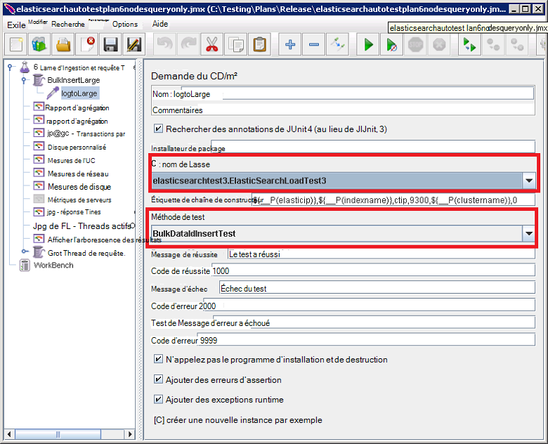

<properties
   pageTitle="Exécution des tests de performances Elasticsearch automatiques | Microsoft Azure"
   description="Description de la façon dont vous pouvez exécuter les tests de performances dans votre propre environnement."
   services=""
   documentationCenter="na"
   authors="dragon119"
   manager="bennage"
   editor=""
   tags=""/>

<tags
   ms.service="guidance"
   ms.devlang="na"
   ms.topic="article"
   ms.tgt_pltfrm="na"
   ms.workload="na"
   ms.date="09/22/2016"
   ms.author="masashin"/>
   
# <a name="running-the-automated-elasticsearch-performance-tests"></a>Exécutez les tests de performances de Elasticsearch automatiques

[AZURE.INCLUDE [pnp-header](../../includes/guidance-pnp-header-include.md)]

Cet article fait [partie d’une série](guidance-elasticsearch.md). 

Les documents [performances de réception de données de réglage pour Elasticsearch sur Azure] et [agrégation des données de réglage et les performances des requêtes pour Elasticsearch sur Azure] décrivent un certain nombre de tests de performances qui ont été exécutées sur un cluster de Elasticsearch exemple.

Ces tests ont été scriptées pour leur permettre d’être exécuté de manière automatisée. Ce document décrit comment vous pouvez répéter les tests dans votre propre environnement.

## <a name="prerequisites"></a>Conditions préalables

Les tests automatisés requièrent les éléments suivants :

-  Un cluster de Elasticsearch.

- Une JMeter environnement d’installation comme décrit par le document [Création d’un environnement de test de performances de Elasticsearch sur Azure].

- [Python 3.5.1](https://www.python.org/downloads/release/python-351/) installé sur le contrôleur de JMeter VM.


## <a name="how-the-tests-work"></a>Fonctionnement des tests
Les tests sont exécutés à l’aide de JMeter. Un serveur maître JMeter charge un plan de test et le transmet à un ensemble de serveurs subordonnés JMeter qui exécutera les tests. Le serveur maître JMeter coordonne les serveurs subordonnés JMeter et accumule les résultats.

Les plans de test suivants sont fournis :

* [elasticsearchautotestplan3nodes.jmx](https://github.com/mspnp/azure-guidance/blob/master/ingestion-and-query-tests/templates/elasticsearchautotestplan3nodes.jmx). Exécute le test de réception sur un cluster à 3 nœuds.

* [elasticsearchautotestplan6nodes.jmx](https://github.com/mspnp/azure-guidance/blob/master/ingestion-and-query-tests/templates/elasticsearchautotestplan6nodes.jmx). Exécute le test de réception sur un cluster à nœuds 6.

* [elasticsearchautotestplan6qnodes.jmx](https://github.com/mspnp/azure-guidance/blob/master/ingestion-and-query-tests/templates/elasticsearchautotestplan6qnodes.jmx). Exécute le test de réception et de la requête sur un cluster à nœuds 6.

* [elasticsearchautotestplan6nodesqueryonly.jmx](https://github.com/mspnp/azure-guidance/blob/master/ingestion-and-query-tests/templates/elasticsearchautotestplan6nodesqueryonly.jmx). Exécute le test de requête uniquement sur un cluster à nœuds 6.


Vous pouvez utiliser ces plans de test comme base pour vos propres scénarios si vous avez besoin de plus ou moins de nœuds.

Les plans de test utilisent un échantillonneur de demande JUnit pour générer et charger les données de test. Le plan de test JMeter crée et exécute cet échantillonneur et surveille chacun des nœuds Elasticsearch pour les données de performance.  

## <a name="building-and-deploying-the-junit-jar-and-dependencies"></a>Création et le déploiement JUnit JAR et dépendances
Avant d’exécuter les tests de performances que vous devez télécharger, compiler et déployer les tests JUnit situés sous le dossier de performances/junitcode. Ces tests sont référencés par le plan de test JMeter. Pour plus d’informations, consultez la procédure « Importation d’un projet de test existant JUnit dans Eclipse » dans le document de [déploiement d’un échantillon de JMeter JUnit pour le test de performances de Elasticsearch].

Il existe deux versions de tests JUnit : 

- [Elasticsearch1.73](https://github.com/mspnp/azure-guidance/tree/master/ingestion-and-query-tests/junitcode/elasticsearch1.73). Utilisez ce code pour effectuer les essais de réception. Ces tests utilisent Elasticsearch 1,73.

- [Elasticsearch2](https://github.com/mspnp/azure-guidance/tree/master/ingestion-and-query-tests/junitcode/elasticsearch2). Utilisez ce code pour effectuer les épreuves de la requête. Ces tests utilisent Elasticsearch 2.1 et version ultérieure.

Copiez le fichier d’archives (JAR) Java approprié avec le reste des dépendances sur vos ordinateurs JMeter. Le processus est décrit dans le [déploiement d’un échantillon de JMeter JUnit pour le test de performances de Elasticsearch][]. 

> **Important** Après avoir déployé un test JUnit, utilisez JMeter pour charger et configurer les plans de test qui référencent ce test JUnit et vérifiez que le groupe de threads BulkInsertLarge fait référence le fichier JAR, le nom de la classe JUnit et procédé de test :
> 
> 
> 
> Enregistrer les plans de test mis à jour avant d’exécuter les tests.

## <a name="creating-the-test-indexes"></a>Création de l’index de test
Chaque test effectue la réception et/ou requêtes par rapport à un index spécifié lorsque l’exécution du test. Vous devez créer l’index à l’aide de schémas décrits dans les annexes aux documents [performances de réception de données de réglage pour Elasticsearch sur Azure] et [agrégation des données de réglage et les performances des requêtes pour Elasticsearch sur Azure] et les configurer en fonction de votre scénario de test (valeurs de doc activé/désactivé, plusieurs réplicas, etc.). Notez que les plans de test supposent que l’index contient un seul type nommé *ctip*.

## <a name="configuring-the-test-script-parameters"></a>Configurer les paramètres de script de test
Copiez les fichiers de paramètres de script test suivant sur l’ordinateur serveur de JMeter :

* [run.properties](https://github.com/mspnp/azure-guidance/blob/master/ingestion-and-query-tests/run.properties). Ce fichier Spécifie le nombre de threads de test JMeter à utiliser, la durée de l’essai (en secondes), l’adresse IP d’un nœud (ou un équilibreur de charge dans le cluster Elasticsearch,) et le nom du cluster :

  ```ini
  nthreads=3
  duration=300
  elasticip=<IP Address or DNS Name Here>
  clustername=<Cluster Name Here>
  ```
  
  Modifiez ce fichier et spécifiez les valeurs appropriées pour votre test et le cluster.

* [requête-config-win.ini](https://github.com/mspnp/azure-guidance/blob/master/ingestion-and-query-tests/query-config-win.ini) et [requête-config-nix.ini](https://github.com/mspnp/azure-guidance/blob/master/ingestion-and-query-tests/query-config-nix.ini). Ces deux fichiers contiennent les mêmes informations ; le fichier *win* est mis en forme pour les chemins d’accès et les noms de fichiers Windows et le fichier *nix* est mis en forme pour les noms de chemin et Linux :

  ```ini
  [DEFAULT]
  debug=true #if true shows console logs.

  [RUN]
  pathreports=C:\Users\administrator1\jmeter\test-results\ #path where tests results are saved.
  jmx=C:\Users\administrator1\testplan.jmx #path to the JMeter test plan.
  machines=10.0.0.1,10.0.0.2,10.0.0.3 #IPs of the Elasticsearch data nodes separated by commas.
  reports=aggr,err,tps,waitio,cpu,network,disk,response,view #Name of the reports separated by commas.
  tests=idx1,idx2 #Elasticsearch index(es) name(s) to test, comma delimited if more than one.
  properties=run.properties #Name of the properties file.
  ```

  Modifier ce fichier pour spécifier l’emplacement des résultats des essais, le nom du plan de test à exécuter, les adresses IP des nœuds de données Elasticsearch vous collectez des métriques de performances, les rapports contenant les données de performances brutes qui sont générées, et le nom (ou délimité par des virgules de noms) de l’index en cours de test, si plus d’une JMeter , les tests seront exécutés un après l’autre. Si le fichier run.properties se trouve dans un autre dossier ou un répertoire, spécifiez le chemin d’accès complet à ce fichier.

## <a name="running-the-tests"></a>Exécution des tests

* Copiez le fichier [test.py de la requête](https://github.com/mspnp/azure-guidance/blob/master/ingestion-and-query-tests/query-test.py) à l’ordinateur serveur de JMeter, dans le même dossier que le run.properties et les fichiers win.ini-config-requête (requête-config-nix.ini).

* Assurez-vous que jmeter.bat (Windows) ou jmeter.sh (Linux) sont sur le chemin de l’exécutable pour votre environnement.

* Exécutez le script de requête-test.py à partir de la ligne de commande pour effectuer les tests :

  ```cmd
  py query-test.py
  ```

* Une fois le test terminé, les résultats sont stockés comme fichiers (CSV) spécifiés dans le fichier de requête-config-win.ini (requête-config-nix.ini) des valeurs de l’ensemble des séparées par des virgules. Vous pouvez utiliser Excel pour analyser et tracer ces données.


[Réglage des performances d’acquisition de données pour Elasticsearch sur Azure]: guidance-elasticsearch-tuning-data-ingestion-performance.md
[Réglage d’agrégation des données et des performances des requêtes pour Elasticsearch sur Azure]: guidance-elasticsearch-tuning-data-aggregation-and-query-performance.md
[Création d’un environnement de test pour Elasticsearch sur Azure de performances]: guidance-elasticsearch-creating-performance-testing-environment.md
[Déploiement d’un échantillon de JMeter JUnit pour le test de performances de Elasticsearch]: guidance-elasticsearch-deploying-jmeter-junit-sampler.md
