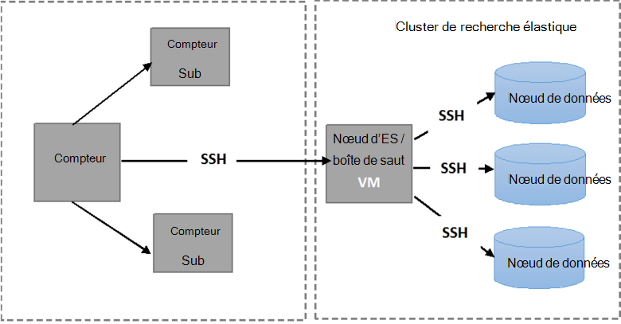

<properties
   pageTitle="Exécution des tests de résistance Elasticsearch automatiques | Microsoft Azure"
   description="Description de la façon dont vous pouvez exécuter les tests de résistance dans votre propre environnement."
   services=""
   documentationCenter="na"
   authors="dragon119"
   manager="bennage"
   editor=""
   tags=""/>

<tags
   ms.service="guidance"
   ms.devlang="na"
   ms.topic="article"
   ms.tgt_pltfrm="na"
   ms.workload="na"
   ms.date="09/22/2016"
   ms.author="masashin"/>

# <a name="running-the-automated-elasticsearch-resiliency-tests"></a>Exécution des tests de résistance Elasticsearch automatiques

[AZURE.INCLUDE [pnp-header](../../includes/guidance-pnp-header-include.md)]

Cet article fait [partie d’une série](guidance-elasticsearch.md).

[Configuration résilience]et de récupération sur Elasticsearch sur Azure[elasticsearch-resilience-recovery], nous avons décrit une série de tests qui ont été exécutées sur un cluster de Elasticsearch exemple pour déterminer comment le système a répondu à certains écrans courants de défaillance et comment elle est récupérée. Les tests ont été scriptées pour leur permettre d’être exécuté de manière automatisée. Ce document décrit comment vous pouvez répéter les tests dans votre propre environnement. 

Les scénarios suivants ont été testés :

- **Défaillance d’un nœud et un redémarrage sans perte de données**. Un nœud de données est arrêté et redémarré au bout de 5 minutes.
Elasticsearch a été configuré pour ne pas pour réaffecter le milieu des fragments manquants dans cet intervalle, afin de déplacer le milieu des fragments ne naît aucune e/s supplémentaires. Lorsque le nœud a redémarré, le processus de récupération apporte au milieu des fragments sur ce nœud à jour.

- **Défaillance d’un nœud sans perte de données catastrophique**. Un nœud de données est arrêté, et les données qu’il contient sont effacées pour simuler la défaillance grave du disque. Le nœud est ensuite redémarré (après 5 minutes), effectivement agissant comme un remplacement pour le nœud d’origine. Le processus de récupération nécessite de reconstruire les données manquantes pour ce nœud et peut entraîner le déplacement du milieu des fragments détenues sur les autres nœuds.

- **Défaillance d’un nœud et un redémarrage sans perte de données, mais avec réallocation d’éclater**. Un nœud de données est arrêté, et au milieu des fragments qu’il contient sont redistribuées à d’autres nœuds. Le nœud est ensuite redémarré et réaffectation plus se produit pour rééquilibrer le cluster.

- **Déploiement de mises à jour**. Chaque nœud dans le cluster est arrêté et redémarré après un court intervalle pour simuler des machines en cours de redémarrage après une mise à jour de logiciel. Un seul nœud est arrêté à tout moment.
Milieu des fragments ne sont pas réaffectées lorsqu’un nœud est vers le bas.

## <a name="prerequisites"></a>Conditions préalables

Les tests automatisés requièrent les éléments suivants :

- Un cluster de Elasticsearch.

- Une JMeter environnement d’installation comme décrit dans le [Guide de test de performances]. 

- Les ajouts suivants installés sur la VM maître JMeter uniquement.

    - Java Runtime 7.

    - Les versions4.x.x Nodejs ou une version ultérieure.

    - Les outils de ligne de commande Git.

## <a name="how-the-scripts-work"></a>Fonctionnement des scripts

Les scripts de test sont conçus pour s’exécuter sur la VM JMeter maître. Lorsque vous sélectionnez un test à exécuter, les scripts exécutent la séquence d’opérations suivante :

1.  Démarrer un plan de test de JMeter en passant les paramètres que vous avez spécifié.

2.  Copier un script qui effectue les opérations requises par le test à une VM spécifié dans le cluster. Cela peut être n’importe quel ordinateur virtuel qui a une adresse IP publique ou la machine virtuelle de *Jumpbox* si vous avez créé le cluster en utilisant le [modèle de démarrage rapide de Elasticsearch d’Azure](https://github.com/Azure/azure-quickstart-templates/tree/master/elasticsearch).

3.  Exécutez le script sur l’ordinateur virtuel (ou Jumpbox).

L’image suivante illustre la structure de l’environnement de test et d’un cluster de Elasticsearch. Notez que les scripts de test utilisent SSH (secure shell) pour se connecter à chaque nœud du cluster pour effectuer diverses opérations de Elasticsearch, tels que l’arrêt ou le redémarrage d’un nœud.



## <a name="setting-up-the-jmeter-tests"></a>Tests de configuration de le JMeter

Avant l’exécution de la résilience des tests vous devez compiler et déployer les tests JUnit situés dans le dossier/jmeter/résilience des tests. Ces tests sont référencés par le plan de test JMeter. Pour plus d’informations, consultez la procédure « Importation d’un projet de test existant JUnit dans Eclipse » dans le [déploiement d’un échantillon de JMeter JUnit pour le test de performances de Elasticsearch][].

Il existe deux versions de tests JUnit contenues dans les dossiers suivants :

- **Elasticsearch17.** Le projet dans ce dossier génère le fichier Elasticsearch17.jar. Utiliser ce fichier JAR Elasticsearch versions de test 1.7.x

- **Elasticsearch20**. Le projet dans ce dossier génère le fichier Elasticsearch20.jar. Utilisez ce fichier JAR pour le test de Elasticsearch version 2.0.0 et versions ultérieures

Copiez le fichier JAR approprié avec le reste des dépendances sur vos ordinateurs JMeter. Le processus est décrit par la procédure de « Déploiement d’un test de JUnit à JMeter » dans le [déploiement d’un échantillon de JMeter JUnit pour tester les performances Elasticsearch].

## <a name="configuring-vm-security-for-each-node"></a>Configuration de la sécurité de machine virtuelle pour chaque nœud.

Les scripts de test nécessitent un certificat d’authentification est installé sur chaque nœud du cluster Elasticsearch. Ainsi, les scripts à exécuter automatiquement sans demander de nom d’utilisateur ou mot de passe lorsqu’ils se connectent aux ordinateurs virtuels différents.

Démarrer en se connectant à l’un des nœuds dans le cluster Elasticsearch (ou le Jumpbox VM), puis exécutez la commande suivante pour générer une clé d’authentification :

```Shell
ssh-keygen -t rsa
```

Lorsque vous êtes connecté au nœud Elasticsearch (ou Jumpbox), exécutez les commandes suivantes pour chaque nœud de l’Elasticsearch cluster. Remplacer `<username>` avec le nom d’un utilisateur valide sur chaque machine virtuelle et remplacer `<nodename>` avec le nom DNS ou l’adresse IP de la machine virtuelle qui héberge le nœud Elasticsearch.
Notez que vous demandera le mot de passe de l’utilisateur lors de l’exécution de ces commandes.
Pour plus d’informations, consultez [connexion SSH sans mot de passe](http://www.linuxproblem.org/art_9.html):

```Shell
ssh <username>@<nodename> mkdir -p .ssh (
cat .ssh/id\_rsa.pub | ssh <username>*@<nodename> 'cat &gt;&gt; .ssh/authorized\_keys'
```

## <a name="downloading-and-configuring-the-test-scripts"></a>Télécharger et configurer les scripts de test

Les scripts de test sont fournies dans un référentiel Git. Utilisez la procédure suivante pour télécharger et configurer les scripts.

Sur l’ordinateur maître JMeter où vous exécuterez les tests, ouvrez une fenêtre de bureau Git (Git Bash) et cloner le référentiel qui contient les scripts, comme suit :

```Shell
git clone https://github.com/mspnp/azure-guidance.git
```

Déplacer vers le dossier tests de la résilience et exécutez la commande suivante pour installer les dépendances requises pour exécuter les tests :

```Shell
npm install
```

Si le maître de JMeter est en cours d’exécution sur Windows, télécharger des [Plink](http://www.chiark.greenend.org.uk/~sgtatham/putty/download.html), qui est une interface de ligne de commande pour le client Telnet de PuTTY. Copiez l’exécutable de Plink dans le dossier de résilience-tests/lib.

Si le maître de JMeter est en cours d’exécution sous Linux, vous n’avez pas besoin de télécharger Plink, mais vous devez d’abord configurer SSH sans mot de passe entre le maître de le JMeter et le nœud de la Elasticsearch ou le Jumpbox que vous avez utilisé en suivant les étapes décrites dans la procédure « configuration VM sécurité pour chaque nœud. » 

Modifier les paramètres de configuration suivants dans le `config.js` le fichier correspondant à votre environnement de test et d’un cluster de Elasticsearch. Ces paramètres sont communs à tous les tests :

| Nom | Description | Valeur par défaut |
| ---- | ----------- | ------------- |
| `jmeterPath` | Chemin d’accès local où se trouve le JMeter. | `C:/apache-jmeter-2.13` |
| `resultsPath` | Répertoire relatif dans lequel le script exporte le résultat. | `results` |
| `verbose` | Indique si le script de sortie en mode détaillé ou non. | `true` |
| `remote` | Indique si les tests de JMeter exécutent localement ou sur les serveurs distants. | `true` |
| `cluster.clusterName` | Le nom du cluster Elasticsearch. | `elasticsearch` |
| `cluster.jumpboxIp`         | L’adresse IP de l’ordinateur Jumpbox.                 |-|
| `cluster.username`          | L’utilisateur admin créé lors du déploiement du cluster. |-|
| `cluster.password`          | Le mot de passe de l’utilisateur admin.                        |-|
| `cluster.loadBalancer.ip`   | L’adresse IP de l’équilibreur de charge Elasticsearch.    |-|
| `cluster.loadBalancer.url`  | URL de base de l’équilibreur de charge.                          |-|

## <a name="running-the-tests"></a>Exécution des tests

Déplacer vers le dossier tests de la résilience et exécutez la commande suivante :

```Shell
node app.js
```

Le menu suivant s’affiche :


Entrez le numéro du scénario que vous voulez exécuter : `11`, `12`, `13` ou `21`. 

Une fois que vous sélectionnez un scénario, il se peut que le test s’exécutera automatiquement. Les résultats sont stockés sous la forme d’un ensemble de fichiers de valeurs séparées par des virgules (CSV) dans un dossier créé dans le répertoire de résultats. Chaque série a son propre dossier de résultats.
Vous pouvez utiliser Excel pour analyser et tracer ces données.

[Running Elasticsearch on Azure]: guidance-elasticsearch-running-on-azure.md
[Tuning Data Ingestion Performance for Elasticsearch on Azure]: guidance-elasticsearch-tuning-data-ingestion-performance.md
[Guide de test de performances]: guidance-elasticsearch-creating-performance-testing-environment.md
[JMeter guidance]: guidance-elasticsearch-implementing-jmeter.md
[Considerations for JMeter]: guidance-elasticsearch-deploying-jmeter-junit-sampler.md
[Query aggregation and performance]: guidance-elasticsearch-query-aggregation-performance.md
[elasticsearch-resilience-recovery]: guidance-elasticsearch-configuring-resilience-and-recovery.md
[Resilience and Recovery Testing]: guidance-elasticsearch-running-automated-resilience-tests.md
[Déploiement d’un échantillon de JMeter JUnit pour le test de performances de Elasticsearch]: guidance-elasticsearch-deploying-jmeter-junit-sampler.md
