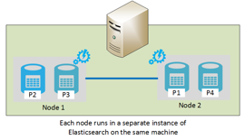

<properties
   pageTitle="Elasticsearch en cours d’exécution sur Azure | Microsoft Azure"
   description="Comment installer, configurer et exécuter le Elasticsearch sur Azure."
   services=""
   documentationCenter="na"
   authors="dragon119"
   manager="bennage"
   editor=""
   tags=""/>

<tags
   ms.service="guidance"
   ms.devlang="na"
   ms.topic="article"
   ms.tgt_pltfrm="na"
   ms.workload="na"
   ms.date="09/22/2016"
   ms.author="masashin"/>

# <a name="running-elasticsearch-on-azure"></a>Elasticsearch en cours d’exécution sur Azure

[AZURE.INCLUDE [pnp-header](../../includes/guidance-pnp-header-include.md)]

Cet article fait [partie d’une série](guidance-elasticsearch.md). 

## <a name="overview"></a>Vue d’ensemble

Ce document fournit une brève présentation de la structure générale de Elasticsearch et décrit ensuite comment vous pouvez implémenter un cluster Elasticsearch à l’aide d’Azure. Elle touche sur les meilleures pratiques pour le déploiement d’un cluster de Elasticsearch, en se concentrant sur les diverses performances fonctionnelles et en matière de gestion de votre système, et compte tenu de la façon dont vos besoins doivent lecteur la configuration et la topologie que vous sélectionnez.

> [AZURE.NOTE] Ce guide suppose une connaissance de base avec [Elasticsearch][].

## <a name="the-structure-of-elasticsearch"></a>La structure de Elasticsearch 

Elasticsearch est une base de données de document optimisé pour agir comme un moteur de recherche. Les documents sont sérialisés au format JSON. Données sont contenues dans l’index, implémentés à l’aide de [Apache Lucene][], bien que les détails sont extraits à partir de la vue et il n’est pas nécessaire de comprendre parfaitement Lucene pour utiliser Elasticsearch.

### <a name="clusters-nodes-indexes-and-shards"></a>Milieu des fragments, des nœuds, des index et des clusters

Elasticsearch met en œuvre une architecture en cluster qui utilise ont pour répartir les données sur plusieurs nœuds et fournir une haute disponibilité de la réplication. Les documents sont stockés dans l’index. L’utilisateur peut spécifier les champs d’un document sont utilisés pour identifier de manière unique dans un index, ou le système peut générer automatiquement un champ de clé et les valeurs. L’index est utilisé pour organiser les documents physiquement et est que l’entité de sécurité signifie pour trouver des documents. 

Un index contient un ensemble de milieu des fragments. Les documents sont équitablement répartis sur plusieurs milieu des fragments à l’aide d’un mécanisme de hachage basé sur les valeurs de clé d’index et le nombre de milieu des fragments dans l’index. 

Les index peuvent être répliquées. Dans ce cas, chaque partagé dans l’index est copié. Elasticsearch garantit que chaque partagé d’origine pour un index (appelé un « éclater principal ») et son réplica résident toujours sur des nœuds différents. Lorsqu’un document est ajouté ou modifié, tous les écrire des opérations sur le principal partagé, puis dans chaque réplica. 

La figure ci-dessous illustre les aspects essentiels d’un cluster d’Elasticsearch contenant trois nœuds. Un index qui se compose de deux principaux milieu des fragments avec deux réplicas pour chaque partagé (six milieu des fragments dans toutes) a été créé.


*Un cluster de Elasticsearch simple contenant deux nœuds principaux et les deux ensembles de réplicas*

Dans ce cluster, éclater principal 1 et partagé principal 2 se trouvent sur des nœuds distincts pour aider à équilibrer la charge. Les réplicas sont distribués de la même façon. En cas de défaillance d’un seul nœud, les nœuds restants ont suffisamment d’informations pour permettre au système de continuer à fonctionner. Si nécessaire, Elasticsearch sera promouvoir un partagé du réplica pour devenir un partagé primaire si l’éclater principale correspondante n’est pas disponible.

### <a name="node-roles"></a>Rôles des nœuds

Les nœuds d’un cluster de Elasticsearch peuvent effectuer les rôles suivants :

- Un **nœud de données** qui peut contenir un ou plusieurs milieu des fragments qui contiennent des données d’index.

- Un **nœud client** qui gère les demandes entrantes effectuées par les applications clientes sur le nœud de données approprié, mais qui ne contient pas de données d’index.
 
- Un **nœud maître** qui ne contient pas de données de l’index, mais qui effectue des opérations de gestion de cluster, telles que le maintien et la distribution d’informations de routage autour du cluster (la liste des nœuds contiennent les milieu des fragments), déterminer les nœuds disponibles, déplacement milieu des fragments comme nœuds apparaissent et disparaissent et la coordination de récupération après défaillance d’un nœud. Plusieurs nœuds peuvent être configurés en tant que maître, mais seul est réellement élu pour exécuter les fonctions de base. Si ce nœud tombe en panne, un autre élection a lieu et un des autres nœuds maîtres éligibles seront élus et reprendre.

> [AZURE.NOTE]Le nœud maître choisi est essentiel pour le bien-être du cluster. Les autres nœuds ping régulièrement pour s’assurer qu’il est toujours disponible. Si le nœud maître élu agit également comme un nœud de données, il existe un risque que le nœud peut être occupé et un échec pour répondre à ces requêtes ping. Dans ce cas, la forme de base est considérée comme ayant échoué et un des autres nœuds maîtres est élu à sa place. 

 La figure ci-dessous illustre une topologie contenant un mélange de master dédié, client et des nœuds dans un cluster d’Elasticsearch de données.


*Un cluster Elasticsearch illustrant différents types de nœuds*

### <a name="costs-and-benefits-of-using-client-nodes"></a>Les coûts et les avantages de l’utilisation de nœuds clients

Lorsqu’une application envoie une requête à un cluster de Elasticsearch, le nœud auquel se connecte l’application est chargé de diriger le processus de requête. Le nœud transmet la demande à chaque nœud et rassemble les résultats, en renvoyant les informations accumulées à l’application. Si une requête implique les agrégations et les autres calculs, le nœud auquel se connecte l’application effectue les opérations nécessaires après l’extraction des données de chacun des autres nœuds. Ce processus de ventilation/regroupement peut consommer des ressources de traitement et de mémoire considérables.

Permet de se concentrer sur la gestion et du stockage des données des nœuds de données à l’aide de nœuds de client dédié pour effectuer ces tâches. Le résultat est que beaucoup de scénarios qui impliquent des requêtes complexes et les agrégations peut bénéficier de l’utilisation de nœuds de client dédié. Toutefois, l’impact de l’utilisation de nœuds de client dédié probablement dépend de votre scénario, la charge de travail et la taille de cluster. 

> [AZURE.NOTE] Pour plus d’informations sur le processus de réglage, voir [réglage agrégation des données et des performances des requêtes pour Elasticsearch sur Azure][] .

### <a name="connecting-to-a-cluster"></a>Connexion à un cluster

Elasticsearch expose une série d’autres API pour la création d’applications clientes et d’envoyer des demandes à un cluster. Si vous développez des applications utilisant le.NET Framework, les niveaux supérieurs deux API sont disponibles : [Elasticsearch.Net & imbriquer][].

Si vous générez des applications clientes à l’aide de Java, vous pouvez utiliser l' [API Client de nœud][] à créer dynamiquement les nœuds de client et de les ajouter au cluster. Création dynamique de nœuds client est pratique si votre système utilise un petit nombre de connexions à long terme. Les nœuds clients créés à l’aide de l’API de nœud sont fournis avec le cluster de routage mapper (les détails des nœuds contiennent les milieu des fragments) par le nœud maître. Ces informations permettent à l’application Java pour se connecter directement à des nœuds lors de l’indexation ou de l’interrogation de données, la réduction du nombre de tronçons qui peut s’avérer nécessaire lorsque vous utilisez d’autres API.

Le coût de cette approche est à la charge de l’inscription du cluster le nœud client. Si un grand nombre de nœuds clients apparaisse et disparaisse rapidement, l’impact de la gestion et la distribution de la table de routage du cluster peut devenir importante.

La figure ci-dessous illustre une configuration qui utilise un équilibreur de charge pour acheminer les demandes vers un ensemble de nœuds de client, bien que la même stratégie peut servir à se connecter directement à des nœuds de données si les nœuds clients ne sont pas utilisés.


*Instances de l’application client se connectant à un cluster d’Elasticsearch par l’intermédiaire de l’équilibreur de charge Azure*

> [AZURE.NOTE]Vous pouvez utiliser l' [Équilibrage de charge Azure][] pour exposer le cluster à l’Internet public, ou vous pouvez utiliser un [équilibreur de charge interne][] si les applications clientes et le cluster sont contenues entièrement dans un même réseau virtuel privé (VNet).

### <a name="node-discovery"></a>Recherche de noeuds

Elasticsearch est basée sur les communications peer-to-peer, afin d’identifier d’autres nœuds dans un cluster est une partie importante du cycle de vie d’un nœud. Découverte du nœud permet de nouveaux nœuds de données d’être ajoutés dynamiquement à un cluster, ce qui à son tour permet d’évoluer de manière transparente le cluster. En outre, si un nœud de données ne répond pas aux demandes de communications à partir d’autres nœuds, un nœud maître peut décider que le nœud de données a échoué et prennent les mesures nécessaires pour réallouer au milieu des fragments qui il a été maintenant à d’autres nœuds de données opérationnelles.

Découverte du nœud Elasticsearch est gérée à l’aide d’un module de découverte. Le module de découverte est un plug-in qui peut être activé pour utiliser un mécanisme de découverte différents. Le module de découverte par défaut ([Zen][]) entraîne un nœud émettre des requêtes ping pour rechercher d’autres nœuds sur le même réseau. Si d’autres nœuds répondent, ils ragots pour échanger des informations. Un nœud maître peut ensuite distribuer le milieu des fragments pour le nouveau nœud (s’il est un nœud de données) et rééquilibrer le cluster. Le module de découverte Zen gère également le processus d’élection maître et le protocole de détection de défaillance d’un nœud.

En outre, si vous exécutez Elasticsearch nœuds comme des machines virtuelles Azure (VM), messagerie multidiffusion n’est pas supportée. De ce fait, vous devez configurer la découverte Zen pour utiliser la messagerie par monodiffusion et fournir une liste de nœuds de contact valides dans le fichier de configuration elasticsearch.yml.

Si vous hébergez un cluster Elasticsearch au sein d’un réseau virtuel Azure, vous pouvez spécifier que le privé IP affectée par DHCP adressé à chaque machine virtuelle du cluster doit rester alloué (statique). Vous pouvez configurer Zen découverte monodiffusion de messagerie à l’aide de ces adresses IP statiques. Si vous utilisez des machines virtuelles avec des adresses IP dynamiques, gardez à l’esprit que si une machine virtuelle s’arrête et redémarre il pourrait être affecté une nouvelle adresse IP et la difficulté de la découverte. Pour traiter ce scénario, vous pouvez permuter le module de découverte Zen pour le [Plug-in d’Azure Cloud][]. Ce plug-in utilise l’API Azure pour implémenter le mécanisme de découverte, qui est basé sur les informations d’abonnement Azure.

> [AZURE.NOTE]La version actuelle du plug-in de Azure Cloud vous oblige à installer le certificat de gestion de votre abonnement Azure dans le keystore Java sur le nœud de Elasticsearch et fournissent l’emplacement et les informations d’identification pour accéder à la banque de clés dans le fichier elasticsearch.yml. Ce fichier est conservé en texte clair, il est essentiel de vérifier que ce fichier est accessible uniquement par le compte qui exécute le service Elasticsearch. 
> 
> En outre, cette approche ne peut pas être compatible avec les déploiements du Gestionnaire de ressources Azure. Pour ces raisons, il est recommandé que vous utilisez des adresses IP statiques pour les nœuds principaux et ces nœuds permet de mettre en œuvre la monodiffusion de découverte Zen échanges au sein du cluster. Dans la configuration suivante (prise à partir du fichier elasticsearch.yml pour un nœud de données exemple), les adresses IP d’hôte nœuds de référence principales dans le cluster :

```yaml
discovery.zen.ping.multicast.enabled: false  
discovery.zen.ping.unicast.hosts: ["10.0.0.10","10.0.0.11","10.0.0.12"]
```

## <a name="general-system-guidelines"></a>Instructions relatives au système général

Elasticsearch peut s’exécuter sur un grand nombre d’ordinateurs, allant d’un simple ordinateur portable à un cluster de serveurs haut de gamme. Toutefois, les plus de ressources en termes de mémoire, le calcul de puissance et rapide des disques qui sont disponibles améliore les performances. Les sections suivantes récapitulent les exigences matérielles et logicielles de base pour l’exécution de Elasticsearch.

### <a name="memory-requirements"></a>Mémoire requise 

Elasticsearch tente de stocker les données en mémoire pour la vitesse. Un serveur de production héberge un nœud pour un standard de l’entreprise ou d’une taille moyenne de déploiement commercial sur Azure doit avoir entre 14 et 28 Go de RAM (D3 ou D4 VMs). **Répartir la charge sur plusieurs nœuds au lieu de créer des nœuds avec plus de mémoire** (Essais ont montré qu’à l’aide de nœuds plus grandes avec davantage de mémoire peut provoquer des temps de restauration en cas de panne.) Toutefois, bien que la création de clusters avec un très grand nombre de nœuds de petite taille peut augmenter la disponibilité et le débit, il transmet également les efforts nécessaires pour la gestion et la maintenance d’un tel système.

**Allouer 50 % de la mémoire disponible sur un serveur pour le tas Elasticsearch**. Si vous utilisez Linux définir la variable d’environnement ES_HEAP_SIZE avant d’exécuter Elasticsearch. Ou bien, si vous utilisez Windows ou Linux, vous pouvez spécifier la taille de la mémoire dans le `Xmx` et `Xms` paramètres lorsque vous démarrez Elasticseach. Définir ces deux paramètres à la même valeur pour éviter le redimensionnement de la pile au moment de l’exécution Java Virtual Machine (JVM). Toutefois, **n’allouez pas plus de 30 Go**. Utilisez le reste de la mémoire pour le cache de fichier système d’exploitation.

> [AZURE.NOTE]Elasticsearch utilise la bibliothèque Lucene pour créer et gérer des index. Les structures de Lucene utilisent un format basé sur le disque, et la mise en cache de ces structures dans le cache du système de fichiers sera considérablement améliorer les performances.

Notez que la taille maximale de tas optimale pour Java sur un ordinateur 64 bits se trouve juste au-dessus de 30 Go. Au-dessus de cette taille que passe de Java à l’aide d’un mécanisme d’étendue pour faire référence à des objets sur le tas, qui augmente la mémoire nécessaire pour chaque objet et réduit les performances. 

Le Java par défaut garbage collector (marque simultanées et balayage) peut également optimal de sous-dossiers si la taille du segment est supérieure à 30 Go. Actuellement, il n’est pas recommandé de passer en un autre garbage collector Elasticsearch et Lucene ont uniquement été testées par rapport à la valeur par défaut.

Overcommit pas la mémoire que l’échange de mémoire principale sur le disque est sérieusement nuire aux performances. Si possible, désactiver le remplacement complètement (les détails dépendent du système d’exploitation). Si ce n’est pas possible d’activer le paramètre *mlockall* dans le fichier de configuration de Elasticsearch (elasticsearch.yml) comme suit :

```yaml
bootstrap.mlockall: true
```

Ce paramètre de configuration entraîne la JVM de verrouiller la mémoire et l’empêche qui est transférée par le système d’exploitation.

### <a name="disk-and-file-system-requirements"></a>Disque et le fichier de configuration de système requise

Utilisez des disques de données sauvegardées par le stockage de prime pour le stockage milieu des fragments. Disques doivent être dimensionnées pour contenir la quantité maximale de données que prévues dans les milieu des fragments, bien qu’il soit possible d’ajouter des disques supplémentaires ultérieurement. Vous pouvez étendre un partagé sur plusieurs disques sur un nœud.

> [AZURE.NOTE]Elasticsearch permet de compresser les données pour les champs stockées à l’aide de l’algorithme LZ4 et dans 2.0 de Elasticsearch, vous pouvez modifier le type de compression. Vous pouvez passer à l’algorithme de compression DEFLATE utilisées par les utilitaires *zip* et *gzip* . Cette technique de compression peut être plus de ressources, mais vous devriez l’utiliser pour les données archivées du journal. Cette approche peut aider à réduire la taille de l’index.

Il n’est pas essentiel que tous les nœuds d’un cluster aient la même mise en forme de disque et la capacité. Toutefois, un noeud avec une capacité de disque de très grande taille par rapport à d’autres nœuds dans un cluster attirer davantage de données et nécessite une puissance de traitement accrue pour gérer ces données. Par conséquent le nœud peut devenir « à chaud » de comparé à d’autres nœuds, et ce, à son tour, affecter les performances.

Si possible, utilisez RAID 0 (entrelacement). Autres formes de RAID qui implémentent la mise en miroir et la parité sont inutiles que Elasticsearch fournit sa propre solution de haute disponibilité sous la forme de réplicas.

> [AZURE.NOTE]Avant Elasticsearch 2.0.0, vous pouvez également implémenter la répartition au niveau du logiciel en spécifiant plusieurs répertoires dans le paramètre de configuration *path.data* . Dans Elasticsearch 2.0.0, cette forme de répartition n’est plus pris en charge. Au lieu de cela, le milieu des différents fragments peuvent être alloués à des chemins d’accès différents, mais tous les fichiers dans un unique partagé seront écrits dans le même chemin d’accès. Si vous avez besoin de répartition, vous devez répartir les données au niveau du système d’exploitation ou matériel. 

Pour maximiser le débit de stockage, chaque **machine virtuelle doit posséder un compte de stockage de prime dédié**.

La bibliothèque Lucene peut utiliser un grand nombre de fichiers pour stocker les données d’index et Elasticsearch pouvez ouvrir un nombre important de sockets pour communiquer entre les nœuds et les clients. Assurez-vous que le système d’exploitation est configuré pour prendre en charge d’un nombre suffisant de descripteurs de fichier ouvert (jusqu'à 64000 si la mémoire disponible est suffisante). Notez que la configuration par défaut pour de nombreuses distributions Linux limite le nombre de descripteurs de fichier ouverts à 1024, qui est bien trop petit.

Elasticsearch utilise une combinaison de mémoire mappée (mmap) d’e/s et d’e/s de nouveau Java (NIO) afin d’optimiser l’accès simultané aux fichiers de données et des index. Si vous utilisez Linux, vous devez configurer le système d’exploitation pour vous assurer qu’il existe suffisamment de mémoire virtuelle disponible avec espace pour les zones réactives de 256 Ko de mémoire.

> [AZURE.NOTE]De nombreux Linux distributions utilisent par défaut le planificateur (CFQ) de files d’attente complètement juste lors de l’organisation pour écrire des données sur le disque. Ce planificateur n’est pas optimisé pour SSDs. Reconfigurez le système d’exploitation pour utiliser le planificateur NOOP ou le Planificateur de date d’échéance, qui sont plus efficaces pour SSDs.

### <a name="cpu-requirements"></a>Exigences de l’UC

Azure VM est disponibles dans diverses configurations d’UC, de prise en charge entre 1 et 32 unités d’exécution. Pour un nœud de données, un bon point de départ est un ordinateur virtuel standard de série DS, puis sélectionnez soit le DS3 (4 cœurs) ou des points de stock D4 (8 cœurs). La DS3 fournit également 14 Go de RAM, tandis que la DS4 inclut les 28 Go. 

La série GS (pour le stockage de la prime) et G-series (pour le stockage standard) utilisent les processeurs Xeon E5 V3 qui peuvent être utiles pour les charges de travail qui sont très exigeants, tels que les agrégations à grande échelle. Pour plus d’informations, visitez les [tailles pour les machines virtuelles][].

### <a name="network-requirements"></a>Configuration réseau requise

Elasticsearch nécessite une bande passante réseau entre 1 et 10, selon la taille et de la volatilité des clusters qu’il implémente. Elasticsearch migre le milieu des fragments entre les nœuds comme d’autres nœuds sont ajoutés à un cluster. Elasticsearch suppose que l’heure de la communication entre tous les nœuds est à peu près équivalent et ne considère pas les emplacements relatifs du milieu des fragments détenus sur ces nœuds. En outre, la réplication peut entraîner des e/s réseau significatif entre le milieu des fragments. Pour ces raisons, **Évitez de créer des clusters sur les nœuds qui sont dans différentes régions**.

### <a name="software-requirements"></a>Configuration logicielle requise

Vous pouvez exécuter Elasticsearch sous Windows ou sous Linux. Le service Elasticsearch est déployé comme une bibliothèque jar de Java et a des dépendances sur d’autres bibliothèques Java qui sont inclus dans le package Elasticsearch. Vous devez installer le Java 7 (mise à jour 55 ou version ultérieure) ou Java 8 (mise à jour de 20 ou version ultérieure) JVM pour exécuter Elasticsearch.

> [AZURE.NOTE]Autres que les paramètres de mémoire *étendue (XMS)* et de *Xmx* (spécifiée en tant qu’options de ligne de commande du moteur Elasticsearch – voir les [besoins en mémoire][]) ne modifient pas les paramètres de configuration de machine virtuelle Java par défaut. Elasticsearch a été conçu à l’aide des valeurs par défaut ; leur modification peut entraîner des Elasticsearch detuned et performances sont médiocres.

### <a name="deploying-elasticsearch-on-azure"></a>Déploiement Elasticsearch sur Azure

Même s’il n’est pas difficile de déployer une seule instance de Elasticsearch, la création d’un nombre de nœuds et de l’installation et de configuration Elasticsearch sur chacun d’eux peut être un processus fastidieux et source d’erreurs. Si vous envisagez de Elasticsearch en cours d’exécution sur Azure VM, vous disposez de trois options qui peuvent aider à réduire les risques d’erreurs.

- À l’aide du Gestionnaire de ressources Azure [modèle](https://azure.microsoft.com/marketplace/partners/elastic/elasticsearchelasticsearch/) dans Azure marketplace. Ce modèle est créé par élastique. Il vous permet d’ajouter des améliorations commerciales telles que le blindage, Marvel, l’observateur et ainsi de suite.

- À l’aide du [modèle](https://github.com/Azure/azure-quickstart-templates/tree/master/elasticsearch) de quickstart Azure pour créer le cluster. Ce modèle peut créer un cluster en fonction de Windows Server 2012 ou Ubuntu Linux 14.0.4. Il vous permet d’utiliser des fonctionnalités expérimentales telles que le stockage Azure. Ce modèle est utilisé pour la recherche et les tâches de test dans ce document.

- À l’aide de scripts qui peuvent être automatisés ou s’exécuter sans assistance. Les scripts qui peuvent créer et déployer un cluster Elasticsearch sont disponibles dans le [référentiel de GitHub][elasticsearch-scripts]

## <a name="cluster-and-node-sizing-and-scalability"></a>Cluster et de dimensionnement de nœud et de l’évolutivité 

Elasticsearch permet à un nombre de topologies de déploiement, conçu pour prendre en charge les différents besoins et niveaux de l’échelle. Cette section présente les topologies les plus répandues et décrit les considérations de mise en œuvre de clusters basés sur ces topologies.

### <a name="elasticsearch-topologies"></a>Topologies de Elasticsearch

La figure ci-dessous illustre un point de départ pour la conception d’une topologie de Elasticsearch pour Azure :


*Suggestions de point de départ pour la création d’un cluster Elasticsearch avec Azure*

Cette topologie contient six nœuds de données ainsi que les trois nœuds de client et les trois nœuds principaux (un seul nœud maître est choisi, l’autre deux sont disponibles pour élection échec le masque sélectionné.) Chaque nœud est implémenté comme un ordinateur virtuel distinct. Applications web Azure sont dirigées vers les nœuds clients via un équilibreur de charge. 

Dans cet exemple, tous les nœuds et les applications web résident dans le même réseau virtuel, qui les isole de manière efficace le monde extérieur. Si le cluster doit être disponible à l’extérieur (éventuellement dans le cadre d’une solution hybride intégrant les clients sur site), puis vous pouvez utiliser l’équilibreur de charge Azure pour fournir une adresse IP publique, mais vous devez prendre des précautions de sécurité supplémentaires pour empêcher tout accès non autorisé au cluster. 

Facultatif « passer la » est un ordinateur virtuel qui est uniquement disponible pour les administrateurs. Cette machine virtuelle dispose d’une connexion de réseau pour le réseau virtuel, mais également un passif vis-à-vis de connexion de réseau pour autoriser l’ouverture de session administrateur à partir d’un réseau externe (cette ouverture de session doit être protégé à l’aide d’un mot de passe fort ou un certificat). Un administrateur peut se connecter à la zone raccourcis et connectez-vous directement à un des nœuds du cluster à partir de là. 

Autres approches incluent à l’aide d’un VPN de site à site entre une entreprise et le réseau virtuel, ou à l’aide de circuits de [ExpressRoute][] pour se connecter au réseau virtuel. Ces mécanismes permettent un accès administratif au cluster sans exposer le cluster à l’internet public.

Pour maintenir la disponibilité de la machine virtuelle, les nœuds de données sont regroupés dans le même jeu de disponibilité Azure. De même, les nœuds de clients sont trouvent dans un autre ensemble de disponibilité et les nœuds principaux sont stockées dans un troisième ensemble de disponibilité.

Cette topologie est relativement facile de faire évoluer simplement ajouter des nœuds supplémentaires du type approprié et vous assurer qu’ils sont configurés avec le même nom de cluster dans le fichier elasticsearch.yml. Nœuds clients doivent également être ajoutés au pool back-end pour l’équilibreur de charge Azure.

**Clusters de géolocalisation**

**Ne se propagent nœuds d’un cluster entre les régions comme cela peut affecter les performances de communication inter-nœud** (voir la [Configuration requise du réseau][]). Données de géolocalisation proximité des utilisateurs dans les différentes régions requièrent la création de plusieurs clusters. Dans ce cas, vous devez envisager comment (ou même si) pour synchroniser des clusters. Les solutions possibles sont les suivantes :

[Les nœuds humanitaire][] sont similaires à un nœud client sauf qu’il peut participer dans plusieurs clusters Elasticsearch et les afficher tout comme un cluster grand. Données sont toujours gérées localement par chaque cluster (mises à jour ne sont pas propagées au-delà des limites du cluster), mais toutes les données est visible. Un nœud humanitaire peut interroger, de créer et de gérer des documents dans un cluster. 

Les principales restrictions sont qu’un nœud humanitaire ne peut pas être utilisé pour créer un nouvel index, et les noms d’index doivent être uniques sur tous les clusters. Par conséquent, il est important de se demander comment seront nommées index lors de la création de clusters destinées à être accessible à partir des nœuds d’humanitaire.

Grâce à ce mécanisme, chaque cluster peut contenir des données qui est plus susceptibles d’être accessible par les applications client local, mais ces clients peuvent toujours accéder et de modifier des données à distance bien qu’avec les étendues de latence. La figure ci-dessous montre un exemple de cette topologie. Le nœud 1 du Cluster humanitaire est mis en surbrillance ; les autres clusters peuvent également comporter humanitaire nœuds même si elles ne sont pas affichés sur le diagramme :


*Une application client accédant à plusieurs clusters via un nœud humanitaire*

Dans cet exemple, l’application cliente se connecte au nœud humanitaire de Cluster 1 (se trouver dans la même région), mais ce nœud est configuré pour être en mesure d’accès Cluster 2 et 3 de Cluster, ce qui peut se trouver dans des régions différentes. L’application cliente peut envoyer des demandes qui extraient ou modifient des données dans un des clusters.

> [AZURE.NOTE]Les nœuds humanitaire nécessitent une découverte multidiffusion pour se connecter à des clusters, qui peuvent présenter un problème de sécurité. Consultez la section [découverte du nœud][] pour plus de détails.

- Mise en œuvre de réplication géographique entre les clusters. Dans cette approche, les modifications apportées à chaque cluster sont propagées en temps presque réel aux clusters situés dans les autres centres de données. Plug-ins de tiers sont disponibles pour Elasticsearch prenant en charge cette fonctionnalité, comme le [Plug-in de modifications PubNub][].

- À l’aide de [capture instantanée de Elasticsearch et le module de restauration][]. Si les données sont très lente et sont uniquement modifiées par un seul cluster, vous pouvez envisager d’utiliser des snapshots pour prendre une copie des données et restaurer ces instantanés dans les autres clusters (snapshots peuvent être stockées dans le stockage Blob Azure si vous avez installé le [Plug-in d’Azure Cloud][]). Toutefois, cette solution ne fonctionne pas bien pour rapidement la modification de données ou si les données peuvent être modifiées dans plus d’un cluster.

**Topologies à petite échelle**

Topologies à grande échelle comprenant des clusters de nœuds de master, client et données dédiés n’est peut-être pas appropriées pour chaque scénario. Si vous créez un système de développement ou de production à petite échelle, envisagez le cluster à 3 nœuds illustré dans la figure ci-dessous.

Applications clientes se connectent directement à n’importe quel nœud de données disponibles dans le cluster. Le cluster contient trois milieu des fragments étiquetés P1-P3 (pour permettre la croissance) ainsi que les réplicas étiquetés R1-R3. À l’aide de trois nœuds permet de Elasticsearch à distribuer le milieu des fragments et des réplicas de sorte que si un seul nœud échoue sans données seront perdues.


*Un cluster à 3 nœuds avec 3 milieu des fragments et des réplicas*

Si vous exécutez une installation de développement sur un ordinateur autonome, vous pouvez configurer un cluster avec un nœud unique qui agit comme stockage principal, les clients et les données. Vous pouvez également démarrer plusieurs nœuds en cours d’exécution en tant que cluster sur le même ordinateur en démarrant de plus d’une instance de Elasticsearch. La figure ci-dessous montre un exemple.



*Une configuration de développement plusieurs nœuds de Elasticsearch en cours d’exécution sur le même ordinateur*

Notez qu’aucune de ces configurations autonomes sont recommandés pour un environnement de production car elles peuvent provoquer des conflits, à moins que votre ordinateur de développement dispose d’une quantité importante de mémoire et plusieurs disques rapides. En outre, elles ne fournissent pas qu'une haute disponibilité des garanties. Si l’ordinateur tombe en panne, tous les nœuds sont perdues.

### <a name="scaling-a-cluster-and-data-nodes"></a>Un nœud de cluster et les données de mise à l’échelle

Elasticsearch pouvez mettre à l’échelle en deux dimensions : verticalement (à l’aide de plus gros, plus puissants ordinateurs) et horizontalement (répartition de la charge sur les machines).

**L’évolution verticale de nœuds de données Elasticsearch**

Si vous hébergez un cluster Elasticsearch à l’aide de machines virtuelles d’Azure, chaque nœud peut correspondre à une machine virtuelle. La limite de l’évolutivité verticale d’un nœud est largement régie par la référence SKU de la machine virtuelle et les restrictions générales appliquent aux comptes de stockage individuels et aux abonnements Azure. 

La page [d’abonnement Azure et les limites de service, les quotas et les contraintes](../azure-subscription-service-limits.md) décrit ces limites en détail, mais comme la création d’un cluster d’Elasticsearch est concerné, les éléments de la liste suivante sont les plus pertinentes. 

- Chaque compte de stockage est limitée à 20 000 IOPS. Chaque ordinateur virtuel dans le cluster doit exploiter dédiée (préférence premium) compte de stockage.

- Le nombre de nœuds de données dans un réseau virtuel. Si vous n’utilisez pas le Gestionnaire de ressources Azure, il existe une limite de 2048 instances VM par réseau virtuel. Bien que cela devrait s’avérer suffisant pour la plupart des cas, si vous disposez d’une configuration très volumineuse avec des milliers de nœuds peut être une limitation.

- Nombre de comptes de stockage par abonnement par région. Vous pouvez créer jusqu'à 100 comptes de stockage par abonnement Azure dans chaque région. Comptes de stockage sont utilisés pour contenir des disques virtuels, et chaque compte de stockage a une limite de 500 To d’espace.

- Nombre de cœurs par abonnement. La limite par défaut est 20 cœurs par abonnement, mais elle peut être augmentée jusqu'à 10 000 cœurs en demandant une augmentation de la limite par un ticket de support. 

- La quantité de mémoire par la taille de mémoire virtuelle. Machines virtuelles de taille plus petites sont limitée à des quantités de mémoire disponible (machines D1 3,5 Go et des machines D2 ont 7 Go). Ces machines n’est peut-être pas adaptés pour les scénarios qui requièrent des Elasticsearch à mettre en cache des quantités importantes de données pour obtenir de bonnes performances (agrégation des données, ou analyse d’un grand nombre de documents lors de la réception de données, par exemple).

- Le nombre maximum de disques par la taille de mémoire virtuelle. Cette restriction peut limiter la taille et les performances d’un cluster. Moins de disques signifie que moins de données peuvent être détenues et performances peut être réduit en faisant le moins de disques disponibles pour la répartition.

- Le nombre de mise à jour de domaines et domaines par l’ensemble de la disponibilité de la panne. Si vous créez des ordinateurs virtuels à l’aide du Gestionnaire de ressources Azure, chaque ensemble de disponibilité peut être allouée jusqu'à 3 domaines de panne et mise à jour de 20. Cette limitation peut influer sur la résistance d’un grand cluster qui est soumis à la fréquence des mises à jour successives.

En outre, vous envisagez probablement pas l’utilisation d’ordinateurs virtuels avec plus de 64 Go de mémoire. Comme décrit dans la section [exigences de mémoire][], vous ne devez pas allouer plus de 30 Go de RAM sur chaque machine virtuelle de la machine virtuelle Java et permettre au système d’exploitation utilisent la mémoire allouée à la mise en mémoire tampon des e/s.

Avec ces restrictions à l’esprit, toujours répartissez les disques virtuels pour les ordinateurs virtuels dans un cluster entre les comptes de stockage pour réduire les risques de la limitation des e/s. Dans un cluster de très grande taille, vous devrez recréer votre infrastructure logique et fractionner en partitions fonctionnelles distinctes. Par exemple, vous devrez peut-être diviser le cluster sur les abonnements, bien que ce processus peut entraîner des complications supplémentaires en raison de la nécessité de se connecter à des réseaux virtuels.

**L’évolution horizontale d’un cluster Elasticsearch**

En interne dans Elasticsearch, la limite de l’évolutivité horizontale est déterminée par le nombre du milieu des fragments définie pour chaque index. Initialement, les nombreux milieu des fragments peuvent être alloués au même nœud dans un cluster, mais à mesure que le volume de données augmente autres nœuds peuvent être ajoutés et milieu des fragments peuvent être distribuées sur ces nœuds. En théorie, uniquement lorsque le nombre de nœuds atteint le nombre de milieu des fragments le système cessera à l’échelle horizontalement.

Comme avec la mise à l’échelle verticale, il existe certains problèmes que vous devez considérer les poins implémentant l’échelle horizontale, y compris :

- Le nombre maximal d’ordinateurs virtuels que vous pouvez connecter un réseau virtuel Azure. Cela peut limiter l’évolutivité horizontale pour un cluster de très grande taille. Vous pouvez créer un cluster de nœuds d’étendues de plus d’un réseau virtuel pour contourner cette limite, mais cette approche peut entraîner une dégradation des performances en raison du manque de la localité de chaque nœud avec ses pairs.

- Le nombre de disques par la taille de mémoire virtuelle. Les références SKU et les différentes séries prend en charge différents nombres de disques attachés.
En outre, vous pouvez également envisager d’utiliser le stockage éphémère inclus avec la machine virtuelle pour fournir une quantité limitée de données plus rapide, bien qu’il existe des implications de résilience et de récupération que vous devez considérer (consultez [configuration résilience et récupération sur Elasticsearch sur Azure] [ elasticsearch-resilience-recovery] pour plus d’informations). La série D, série DS, Dv2, GS-séries et machines virtuelles destiné à SSDs stockage éphémère.

Vous pouvez envisager d’utiliser des [Jeux d’échelle de Machine virtuelle] [ vmss] pour démarrer et arrêter les machines virtuelles détermine des demandes. Toutefois, cette approche peut ne pas convenir pour un cluster de Elasticsearch pour les raisons suivantes :

- Cette approche est idéale pour les machines virtuelles sans état. Chaque fois que vous ajoutez ou supprimez un nœud d’un cluster de Elasticsearch, milieu des fragments sont réallouées pour équilibrer la charge, et ce processus peut générer un volume considérable du trafic réseau et les e/s disque et peuvent fortement influer sur les taux de réception des données. Vous devez évaluer si cette surcharge est intéressant l’avantage du traitement supplémentaire et des ressources de mémoire qui sont disponibles en démarrant de dynamiquement davantage d’ordinateurs virtuels.

- Démarrage de la machine virtuelle ne se produit pas instantanément, et elle peut prendre plusieurs minutes avant que les ordinateurs virtuels supplémentaires sont disponibles, ou ils sont arrêtés. Mise à l’échelle de cette manière doit uniquement être utilisé pour gérer des modifications soutenues de la demande.

- Après l’évolution horizontale, avez-vous réellement besoin à prendre en compte la mise à l’échelle en ? Suppression d’un ordinateur virtuel d’un cluster d’Elasticsearch peut être un processus gourmand en ressources que nécessitant que Elasticsearch récupère le milieu des fragments et des réplicas qui sont trouvent sur cet ordinateur virtuel et les recrée dans une ou plusieurs des nœuds restants. Suppression de plusieurs VM en même temps risque de compromettre l’intégrité du cluster, ce qui rend la récupération difficile. En outre, de nombreuses implémentations de Elasticsearch augmentent au fil du temps, mais la nature des données est telle qu’il ne tend ne pas à diminuer le volume. Il est possible de supprimer manuellement des documents et documents peuvent également être configurés avec une durée de vie (durée de vie) après laquelle leur expiration et suppression, mais dans la plupart des cas, qu'il est probable que l’espace précédemment alloué est réutilisé rapidement par les documents nouveaux ou modifiés. La fragmentation d’un index peut se produire lorsque les documents sont supprimés ou modifiés, auquel cas vous pouvez utiliser l' [optimisation][] de la Elasticsearch HTTP API (Elasticsearch 2.0.0 et versions antérieures) ou la [Force de fusion][] API (Elasticsearch 2.1.0 et versions ultérieures) pour effectuer une défragmentation.

### <a name="determining-the-number-of-shards-for-an-index"></a>Détermination du nombre de milieu des fragments pour un index

Le nombre de nœuds dans un cluster peut varier au fil du temps, mais le nombre de milieu des fragments dans un index est résolu une fois que l’index a été créé. Pour ajouter ou supprimer le milieu des fragments nécessite la réindexation des données – un processus de création d’un index avec le nombre requis de milieu des fragments et puis en copiant les données à partir de l’ancien index vers le nouveau (vous pouvez utiliser des alias isolent les utilisateurs du fait que les données a été réindexées, reportez-vous à la section [réglage agrégation des données et des performances des requêtes pour Elasticsearch sur Azure][] pour plus de détails).
Par conséquent, il est important de déterminer le nombre de milieu des fragments que vous êtes susceptible de demander avant la création du premier index de votre cluster. Vous pouvez effectuer les opérations suivantes pour établir ce numéro :

- Créer un cluster à nœud unique à l’aide de la même configuration matérielle que vous envisagez de déployer en production.

- Créer un index qui correspond à la structure que vous souhaitez utiliser dans la production. Donner à cet index un partagé unique et aucun réplica.

- Ajouter une quantité spécifique de données de production réaliste à l’index.

- Exécuter des requêtes classiques, les agrégations et les autres charges de travail dans l’index et mesurer le débit et temps de réponse.

- Si le débit et temps de réponse dans des limites acceptables, puis répétez le processus de l’étape 3 (ajouter des données).

- Lorsque vous semblez avoir atteint la capacité de l’éclater (temps de réponse et le débit de démarrage devient inacceptable), prenez note du volume de documents.

- Extrapoler à partir de la capacité d’un seul partagé sur le nombre de documents dans la production pour calculer le nombre requis de milieu des fragments (vous devez inclure une marge d’erreur dans ces calculs comme extrapolation n’est pas une science exacte).

> [AZURE.NOTE]N’oubliez pas que chaque partagé est implémentée sous la forme d’un index Lucene qui consomme la mémoire, de puissance du processeur et de handles de fichiers. Au milieu des fragments plus avoir, plus de ces ressources, vous aurez besoin.

En outre, création de milieu des fragments plus peut augmenter l’évolutivité (selon vos charges de travail et le scénario) et peut accroître le débit de réception de données, mais il peut réduire les performances de nombreuses requêtes. Par défaut, une requête va interroger chaque partagé utilisé par un index (vous pouvez utiliser [le routage personnalisé][] pour modifier ce comportement si vous connaissez les données que vous avez besoin se trouve dans les milieu des fragments). 

Ce processus ne peuvent générer une estimation du nombre de milieu des fragments, et le volume des documents prévu dans la production ne peut pas être connu. Dans ce cas, vous devez déterminer le volume initial (comme ci-dessus) et le taux de croissance prévue. Créez un nombre approprié de milieu des fragments capable de gérer la croissance des données pour la période jusqu'à ce que vous êtes disposé à réindexer la base de données. 

Autres stratégies utilisés pour des scénarios tels que la gestion de l’événement et la consignation incluent l’utilisation de roulement d’index.
Créer un nouvel index pour les données ingérées chaque jour et accéder à cet index via un alias qui est basculé quotidiennement pour pointer vers l’index de la plus récente. Cette approche vous permet d’âge plus facilement des anciennes données (vous pouvez supprimer les index contenant des informations qui ne sont plus requises) et conserve le volume de données plus faciles à gérer.

Gardez à l’esprit que le nombre de nœuds n’a pas à correspondre au nombre de milieu des fragments. Par exemple, si vous créez 50 milieu des fragments, vous pouvez étaler les sur 10 nœuds initialement et puis ajouter des nœuds supplémentaires pour faire évoluer le système en tant que le volume de travail augmente. Évitez de créer un nombre exceptionnellement élevé de milieu des fragments sur un petit nombre de nœuds (1000 milieu des fragments répartis sur 2 nœuds, par exemple). Bien que le système peut théoriquement évoluer jusqu'à 1000 noeuds avec cette configuration, exécution de 500 milieu des fragments sur les risques de nœud unique une entrave les performances du nœud.

> [AZURE.NOTE]Pour les systèmes qui sont des données-réception épais, envisagez l’utilisation d’un nombre premier de milieu des fragments. L’algorithme par défaut utilisé pour le routage des documents produit de milieu des fragments plus se propager même dans ce cas Elasticsearch.

### <a name="security"></a>Sécurité

Par défaut, Elasticsearch implémente une sécurité minimale et n’offre pas de moyen d’authentification et d’autorisation. Ces aspects nécessitent la configuration du système d’exploitation et du réseau sous-jacent et à l’aide des plug-ins et les utilitaires tiers. [Blindage][]et [Protection de recherche][]sont des exemples.

> [AZURE.NOTE]Blindage est un plug-in fourni par élastique pour l’authentification des utilisateurs, cryptage des données, contrôle d’accès basé sur le rôle, le filtrage IP et l’audit. Il peut être nécessaire de configurer le système d’exploitation sous-jacent pour mettre en œuvre davantage des mesures de sécurité, telles que le chiffrement de disque.

Dans un système de production, vous devez envisager comment :

- Empêcher tout accès non autorisé au cluster.
- Identifier et authentifier les utilisateurs.
- Autoriser les opérations que les utilisateurs authentifiés peuvent effectuer.
- Protéger le cluster contre non fiables ou des opérations dangereuses.
- Protéger les données contre tout accès non autorisé.
- Respecter les réglementations relatives à la sécurité des données commerciales (si nécessaire).

### <a name="securing-access-to-the-cluster"></a>Sécurisation de l’accès au cluster

Elasticsearch est un service réseau. Les nœuds dans un cluster Elasticsearch écoutent les demandes des clients via le protocole HTTP et communiquent entre eux à l’aide d’un canal TCP. Vous devez prendre des mesures pour empêcher des clients non autorisés ou des services d’être en mesure d’envoyer des demandes sur les chemins d’accès à la fois HTTP et TCP. Tenez compte des éléments suivants. 

- Définir des groupes de sécurité de réseau pour limiter le trafic réseau entrant et sortant d’un réseau virtuel ou la machine virtuelle vers des ports spécifiques.

- Modifier les ports par défaut utilisés pour l’accès client web (9200) et l’accès de programmation réseau (9300). Utilisez un pare-feu pour protéger chaque nœud à partir de trafic malveillant sur Internet.

- Selon l’emplacement et la connectivité des clients, placez le cluster sur un sous-réseau privé avec aucun accès direct à Internet. Si le cluster doit être exposé en dehors du sous-réseau, acheminer toutes les demandes via un serveur de bastions Internet ou un proxy suffisamment renforcé pour protéger le cluster.

Si vous devez fournir un accès direct aux nœuds, utilisez un serveur de proxy [nginx](http://nginx.org/en/) configurer et l ' authentification HTTPS.

> [AZURE.NOTE]À l’aide d’un serveur proxy, tel que nginx, vous pouvez également restreindre l’accès à la fonctionnalité. Par exemple, vous pouvez configurer nginx pour autoriser uniquement les demandes de la \_recherche le point de terminaison si vous souhaitez empêcher les clients d’exécution d’autres opérations.

Si vous avez besoin de sécurité d’accès du réseau plus complète, utiliser les plug-ins de protection ou de protection de recherche.

### <a name="identifying-and-authenticating-users"></a>Identification et authentification des utilisateurs

Toutes les demandes effectuées par des clients au cluster doivent être authentifiés. En outre, vous devez empêcher les nœuds non autorisés de rejoindre le cluster car il peuvent fournir une porte dérobée dans le système qui permet de contourner l’authentification.

Plug-ins de Elasticsearch sont disponibles qui peuvent effectuer différents types d’authentification, y compris :

- **L’authentification de base HTTP**. Les noms d’utilisateur et mots de passe sont inclus dans chaque demande. Toutes les demandes doivent être cryptées à l’aide de SSL/TLS ou un niveau équivalent de protection.

- **Intégration de LDAP et Active Directory**. Cette approche requiert que les clients sont affectés les rôles de groupes LDAP ou Active Directory.

- **Authentification native**. Utilise les identités définies à l’intérieur du cluster Elasticsearch.

- **L’authentification TLS**. Utiliser l’authentification TLS au sein d’un cluster pour authentifier tous les nœuds.

- **Le filtrage IP**. Utiliser le filtrage pour empêcher les clients de sous-réseaux non autorisés de se connecter et empêche également les nœuds à partir de ces sous-réseaux qui rejoint le cluster IP.

### <a name="authorizing-client-requests"></a>Autoriser les demandes des clients

Le plug-in de Elasticsearch utilisé pour fournir ce service dépend de l’autorisation. Par exemple, un plug-in qui permet généralement de l’authentification de base fournit des fonctionnalités qui définissent le niveau d’authentification, tandis qu’un plug-in qui utilise LDAP ou Active Directory sera généralement associer des clients à des rôles, puis attribuer les droits d’accès à ces rôles. Lorsque vous utilisez un plug-in, vous devez considérer les points suivants :

- Vous devez limiter les opérations qu’un client peut effectuer ? Par exemple, un client doit être en mesure de surveiller l’état du cluster, ou de créer et de supprimer les index ?

- Le client doit être restreint à un index spécifiques ? Ceci est utile dans une pouvant être partagée : aucun trait d’union par style guide. >> locataires peuvent être affectés à leur propre jeu spécifique d’index et que ces index doit être inaccessible aux autres locataires.

- Doit le client à lire et écrire des données dans un index ? Un client peut être en mesure d’effectuer des recherches pour récupérer des données à l’aide d’un index, mais doivent être empêchés l’ajout ou la suppression de données à partir de cet index, par exemple.

Actuellement, la plupart des plug-ins de sécurité étendue des opérations au niveau du cluster ou un index et non à des sous-ensembles de documents dans l’index. C’est pour des raisons d’efficacité. Il n’est donc pas facile de limiter les requêtes à des documents spécifiques au sein d’un seul index. Si vous avez besoin de ce niveau de granularité, enregistrer des documents dans des index séparés et utiliser des alias de cet index de groupe ensemble. 

Par exemple, dans un système personnel, si utilisateur A requiert l’accès à tous les documents qui contiennent des informations sur les employés dans le département X, l’utilisateur B requiert l’accès à tous les documents qui contiennent des informations sur les employés de service Y et utilisateur C requiert l’accès à tous les documents qui contiennent des informations sur les employés dans les deux départements, créer deux index (pour un département X et Y) et un alias qui référence les deux index. Accorder l’accès en lecture des utilisateurs A le premier index, accorder l’accès en lecture de l’utilisateur B dans le deuxième indice et accorder l’accès en lecture pour les deux index via l’alias utilisateur C. Pour plus d’informations, consultez [Index des émulant par utilisateur avec alias][].

### <a name="protecting-the-cluster"></a>Protection du cluster

Le cluster peut devenir vulnérable à une mauvaise utilisation, si elle n’est pas protégé avec soin. 

**Désactiver les scripts dans Elasticsearch de requête dynamique** interroge qu’elles peuvent entraîner des vulnérabilités de sécurité. Utilisation de scripts natifs plutôt que le script de requête ; un script natif est un plug-in Elasticsearch écrit en Java et compilées en un fichier JAR.

Script de requête dynamique est maintenant désactivé par défaut. pas réactiver à moins d’avoir une très bonne raison de le faire.

**Évitez d’exposer des recherches de chaîne de requête pour les utilisateurs** de ce type de recherche permet aux utilisateurs d’effectuer des requêtes gourmandes en ressources sans encombre. Ces recherches peuvent affecter sérieusement les performances du cluster et peuvent rendre le système à des attaques de déni de service. En outre, la recherche de la chaîne de requête peut exposer des informations potentiellement confidentielles.

Ces **opérations d’empêcher de consommer une grande quantité de mémoire** peut provoquer des exceptions de-mémoire insuffisante aboutissant à un échec de Elasticsearch sur un nœud. Ressource de longues opérations intensives peuvent également servir à mettre en œuvre des attaques DOS. Voici quelques exemples :

Éviter les requêtes de recherche qui tentent de charger des champs de très grande taille dans la mémoire (si une requête trie, des scripts ou des facettes sur ces champs), tels que :

- Recherche d’interroger plusieurs index en même temps.

- Recherches de récupérer un grand nombre de champs. Ces recherches peuvent épuiser la mémoire en provoquant une grande quantité de données de champ à mettre en cache. Par défaut, le cache de données du champ est une taille illimité, mais vous pouvez définir les propriétés de [indices.fielddata.cache.*](https://www.elastic.co/guide/en/elasticsearch/reference/current/modules-fielddata.html) dans le fichier de configuration elasticsearch.yml pour limiter les ressources disponibles. Vous pouvez également configurer le [champ données disjoncteur][] pour éviter que les données mises en cache à partir d’un seul champ de la mémoire épuiser et que la [demande de disjoncteur][] à arrêter les requêtes individuelles de monopoliser la mémoire. Le coût de la définition de ces paramètres est la probabilité d’une augmentation de certaines requêtes échouent ou l’expiration du délai.
 
> [AZURE.NOTE]À l’aide des [Valeurs de document][] peut réduire les exigences mémoire d’index par l’enregistrement des données du champ sur disque plutôt que de son chargement dans la mémoire. Cela peut aider à réduire les risques d’épuisement de la mémoire sur un nœud, mais avec une réduction de la vitesse.

> Elasticsearch suppose toujours qu’il dispose de suffisamment de mémoire pour exécuter sa charge de travail en cours. Si ce n’est pas le cas, le service Elasticsearch peut se bloquer. Elasticsearch fournit des points de terminaison qui retournent des informations sur l’utilisation des ressources (HTTP [cat API][]), et vous devez surveiller attentivement ces informations.

**Attendent trop longtemps pour vider un segment de mémoire en cours**. Il peut épuiser en mémoire tampon.
Si nécessaire, [Configurez la translog][] pour réduire les seuils de données sont vidées sur le disque.

**Création d’index de grandes quantités de métadonnées**. Un index qui contient des documents avec une grande variation dans les noms de champ peut consommer beaucoup de mémoire. Pour plus d’informations, consultez [Mappage de l’Explosion][].
  
La définition d’une longue ou d’une opération de requête intensif est hautement spécifiques au scénario. La charge de travail attendue en général par un cluster peut avoir un profil complètement différent de la charge de travail sur un autre. Déterminer quelles opérations sont inacceptables nécessite la recherche importants et des tests de vos applications.

Être proactif, détecter et arrêter les activités malveillantes avant qu’ils provoquent des dommages importants ou perte de données.
Envisagez d’utiliser un système de notification et d’analyse de sécurité capables de détecter rapidement les motifs inhabituels de données accéder et émettre des alertes lorsque, par exemple, échouent des demandes de connexion utilisateur, nœuds inattendues rejoindre ou quittent le cluster ou opérations durent plus longtemps que prévu. Qui peut effectuer ces tâches, citons Elasticearch [l’Observateur][].

### <a name="protecting-the-data"></a>Protection des données

Vous pouvez protéger METEOROLOGIQUE de données à l’aide de SSL/TLS, mais Elasticsearch ne fournit pas de n’importe quel formulaire intégré de cryptage des données pour les informations qui sont stockées sur le disque. N’oubliez pas que cette information est contenue dans les fichiers de disque ordinaire, tout utilisateur ayant accès à ces fichiers peut-être être en mesure de compromettre les données qu’ils détiennent, par exemple en les copiant dans leur propre cluster. Tenez compte des points suivants :

- Protéger les fichiers utilisés par Elasticsearch pour contenir les données. Ne permettent pas arbitraire accès en lecture ou écriture aux identités autre que le service Elasticsearch.

- Crypter les données contenues dans ces fichiers à l’aide d’un système de fichiers EFS.

> [AZURE.NOTE]Azure prend désormais en charge le cryptage de disque pour Linux et les ordinateurs virtuels de Windows. Pour plus d’informations, consultez [chiffrement de disque Azure pour Windows et Linux IaaS VMs aperçu][].

### <a name="meeting-regulatory-requirements"></a>Respect des réglementations

Exigences réglementaires concernent principalement l’audit des opérations afin de conserver un historique des événements, et garantir la confidentialité de ces opérations afin d’empêcher les en cours surveillées (et relues) par un organisme externe. En particulier, vous devez envisager comment :

- Effectuer le suivi de toutes les demandes (réussi ou pas) et toutes les tentatives d’accès au système.

- Crypter les communications effectuées par les clients pour le cluster, ainsi que les communications de nœud à nœud effectuées par le cluster. Vous devez implémenter SSL/TLS pour toutes les communications de cluster. Elasticsearch prend également en charge les chiffrements enfichables si votre organisation a des exigences différentes de celles disponibles par le biais de SSL/TLS.

- Stocker toutes les données d’audit en toute sécurité. Le volume d’informations d’audit peut augmenter très rapidement et doit être protégé de manière fiable pour empêcher la falsification d’informations d’audit.

- En toute sécurité les données d’audit archive.

### <a name="monitoring"></a>Surveillance

Il est important de surveiller à la fois au niveau du système d’exploitation et au niveau de la Elasticsearch.

Vous pouvez effectuer une surveillance au niveau du système d’exploitation à l’aide des outils spécifiques du système d’exploitation. Sous Windows, cela inclut les éléments, tels que l’Analyseur de performances avec les compteurs de performance appropriés sous Linux, vous pouvez utiliser les outils comme *vmstat*, *iostat*et *haut*. Les éléments clés à surveiller au niveau du système d’exploitation incluent l’utilisation du processeur, volumes d’e/s disque, temps d’attente d’e/s de disque et le trafic réseau.
Dans un cluster Elasticsearch bien réglé, l’utilisation du processeur par le processus Elasticsearch doit être élevé, et d’attente e/s de disque doit être minimale.

Au niveau logiciel, vous devez surveiller les heures de débit et de réponse des demandes, avec les détails des demandes qui ont échoué. Elasticsearch fournit un certain nombre d’API que vous pouvez utiliser pour examiner les performances de différents aspects d’un cluster. Les deux API les plus importants sont *_cluster/santé* et *_nodes/statistiques*. L’API *_cluster/santé* peuvent servir à fournir un instantané de l’état du cluster, ainsi que fournir des informations détaillées pour chaque index, comme indiqué dans l’exemple suivant :

`GET _cluster/health?level=indices`

L’exemple de sortie ci-dessous a été généré à l’aide de cette API :

```json
{
    "cluster_name": "elasticsearch",
    "status": "green",
    "timed_out": false,
    "number_of_nodes": 6,
    "number_of_data_nodes": 3,
    "active_primary_shards": 10,
    "active_shards": 20,
    "relocating_shards": 0,
    "initializing_shards": 0,
    "unassigned_shards": 0,
    "delayed_unassigned_shards": 0,
    "number_of_pending_tasks": 0,
    "number_of_in_flight_fetch": 0,
    "indices": {
        "systwo": {
            "status": "green",
            "number_of_shards": 5,
            "number_of_replicas": 1,
            "active_primary_shards": 5,
            "active_shards": 10,
            "relocating_shards": 0,
            "initializing_shards": 0,
            "unassigned_shards": 0
        },
        "sysfour": {
            "status": "green",
            "number_of_shards": 5,
            "number_of_replicas": 1,
            "active_primary_shards": 5,
            "active_shards": 10,
            "relocating_shards": 0,
            "initializing_shards": 0,
            "unassigned_shards": 0
        }
    }
}
```

Ce cluster contient deux index appelés *systwo* et *sysfour*. Les statistiques clés à surveiller pour chaque index sont l’état, active_shards et unassigned_shards. L’état doit être vert, le nombre d’active_shards doit refléter la number_of_shards et number_of_replicas et unassigned_shards doivent être à zéro. 

Si le statut est rouge, la partie de l’index est manquant ou est endommagé. Vous pouvez vérifier si le paramètre *active_shards* est inférieure à *number_of_shards* - (*number_of_replicas* + 1) et unassigned_shards est différent de zéro. Notez que l’état jaune indique qu’un index est dans un état transitoire, soit en tant que résultat de l’addition de plusieurs duplications ou déplacées milieu des fragments. L’état doit basculer en vert lorsque la transition est terminée. 

Si elle reste jaune pour une période prolongée ou se transforme en rouge, vérifiez si des événements d’e/s importants (par exemple, une panne de disque ou de réseau) sont sont produites au niveau du système d’exploitation.

Le \_API de nœuds/statistiques émet des informations détaillées sur chaque nœud du cluster :

`GET _nodes/stats`

La sortie générée contient des détails sur la façon dont les index sont stockés sur chaque nœud (y compris la taille et le nombre de documents), du temps passé à effectuer l’indexation, interrogation, recherche, fusion, la mise en cache, système d’exploitation et statistiques sur la machine virtuelle Java (y compris performances du garbage collection), informations sur les processus et les pools de threads. Pour plus d’informations, consultez [Surveillance des nœuds individuels][].

Si une partie significative des demandes de Elasticsearch échouent avec les messages d’erreur *EsRejectedExecutionException* , puis Elasticsearch ne parvient pas à respecter les travaux envoyé à sa façon. Dans ce cas, vous devez identifier les goulots d’étranglement qui est à l’origine des Elasticsearch à prendre du retard. Prenez en compte les éléments suivants :

- Si le goulet d’étranglement est provoqué une contrainte de ressource, comme mémoire insuffisante allouée à la machine virtuelle Java provoque un nombre excessif de garbage collection, puis envisagez d’allouer des ressources supplémentaires (dans ce cas, configurez la machine virtuelle Java pour utiliser plus de mémoire, à 50 % de la capacité de stockage sur le nœud, reportez-vous à la rubrique [configuration mémoire requise][]).

- Si le cluster s’affiche en grand e/s d’attente et les statistiques de fusion collectées pour un index à l’aide de la \_nœud/statistiques API contenir de grandes valeurs, alors l’index est lourde à l’écriture. Revoir les points soulevés dans l' [Optimisation des ressources pour les opérations d’indexation](guidance-elasticsearch-tuning-data-ingestion-performance.md#optimizing-resources-for-indexing-operations) pour optimiser les performances d’indexation.

- Limiter les applications clientes qui exécutent des opérations d’acquisition de données et déterminer l’impact sur les performances. Si cette approche présente une amélioration importante, envisagez de conserver l’accélérateur, soit montée en répartissant la charge pour les index de lourdes d’écriture entre plusieurs nœuds.
Pour plus d’informations, reportez-vous à la section [performances de réception de données de réglage pour Elasticsearch sur Azure][].

- Si les statistiques pour un index de recherche indiquent que les requêtes sont prend beaucoup de temps, puis prendre en compte la façon dont les requêtes sont optimisées. Notez que vous pouvez utiliser les valeurs *query_time_in_millis* et *query_total* , signalés par les statistiques de recherche pour calculer un guide sommaire sur l’efficacité des requêtes ; l' équation *query_time_in_millis* / *query_total* vous donnera une durée moyenne de chaque requête.

### <a name="tools-for-monitoring-elasticsearch"></a>Outils d’analyse de Elasticsearch

Divers outils sont disponibles pour effectuer une surveillance quotidienne des Elasticsearch dans la production. Ces outils utilisent généralement les APIs Elasticsearch sous-jacente à recueillir des informations et de présenter les détails d’une manière qui est plus facile d’observer que les données brutes. Parmi les exemples courants, [Elasticsearch-tête][], [Bigdesk][], [Kopf][]et [Marvel][].

Elasticsearch-tête, Bigdesk et Kopf s’exécutent en tant que plug-ins pour le logiciel Elasticsearch. Les versions plus récentes de Marvel peuvent fonctionner de façon autonome, mais nécessitent [Kibana][] fournir un environnement d’hébergement et de capture de données. L’avantage de l’utilisation de Marvel avec Kibana, que vous pouvez implémenter de surveillance dans un environnement séparé du cluster Elasticsearch, ce qui vous permet d’Explorer les problèmes avec Elasticsearch qui n’est peut-être pas possible si les outils de surveillance s’exécute en tant que partie du logiciel Elasticsearch. Par exemple, si Elasticsearch échoue à plusieurs reprises ou fonctionne très lentement, les outils qui s’exécutent en tant que plug-ins de Elasticsearch seront également affectés, fabrication de surveillance et diagnostic plus difficile.

Au niveau du système d’exploitation, vous pouvez utiliser des outils tels que la fonctionnalité journal Analytique [d’Azure Operations Management Suite][] ou [Diagnostics Azure avec le portail Azure][] pour capturer des données de performances pour les machines virtuelles Elasticsearch nœuds d’hébergement. Une autre approche consiste à utiliser des [Logstash][] pour capturer les performances et les données du journal, stockez ces informations dans un cluster séparé de la Elasticsearch (n’utilisez pas le même cluster que vous utilisez ou votre application), puis utilisez le Kibana pour visualiser les données. Pour plus d’informations, consultez [Microsoft Azure Diagnostics avec ELK][].

### <a name="tools-for-testing-elasticsearch-performance"></a>Outils pour les tests de performances de Elasticsearch

D’autres outils sont disponibles si vous Elasticsearch de bancs d’essai ou soumettre un test des performances du cluster. Ces outils sont conçus pour être utilisés dans un développement ou test d’environnement au lieu de production.
[Apache JMeter][]en est un exemple de fréquemment utilisées.

JMeter a été utilisé pour effectuer des tests d’évaluation et d’autres tests de charge décrites dans des documents liés à ce guide. [Création d’un environnement de test de performances de Elasticsearch sur Azure][] décrit en détail comment JMeter a été configuré et utilisé.

[Running Elasticsearch on Azure]: guidance-elasticsearch-running-on-azure.md
[Réglage des performances d’acquisition de données pour Elasticsearch sur Azure]: guidance-elasticsearch-tuning-data-ingestion-performance.md
[Création d’un environnement de test pour Elasticsearch sur Azure de performances]: guidance-elasticsearch-creating-performance-testing-environment.md
[Implementing a JMeter Test Plan for Elasticsearch]: guidance-elasticsearch-implementing-jmeter-test-plan.md
[Deploying a JMeter JUnit Sampler for Testing Elasticsearch Performance]: guidance-elasticsearch-deploying-jmeter-junit-sampler.md
[Réglage d’agrégation des données et des performances des requêtes pour Elasticsearch sur Azure]: guidance-elasticsearch-tuning-data-aggregation-and-query-performance.md
[Configuring Resilience and Recovery on Elasticsearch on Azure]: guidance-elasticsearch-configuring-resilience-and-recovery.md
[Running the Automated Elasticsearch Resiliency Tests]: guidance-elasticsearch-configuring-resilience-and-recovery

[Apache JMeter]: http://jmeter.apache.org/
[Apache Lucene]: https://lucene.apache.org/
[Cryptage disque Azure pour Windows et Linux IaaS VMs aperçu]: ../azure-security-disk-encryption.md
[Équilibreur de charge Azure]: ../load-balancer/load-balancer-overview.md
[ExpressRoute]: ../expressroute/expressroute-introduction.md
[équilibreur de charge interne]:  ../load-balancer/load-balancer-internal-overview.md
[Tailles pour les Machines virtuelles]: ../virtual-machines/virtual-machines-linux-sizes.md

[Mémoire requise]: #memory-requirements
[Configuration réseau requise]: #network-requirements
[Recherche de noeuds]: #node-discovery
[Query Tuning]: #query-tuning

[elasticsearch-scripts]: https://github.com/mspnp/azure-guidance/tree/master/scripts/ps
[A Highly Available Cloud Storage Service with Strong Consistency]: http://blogs.msdn.com/b/windowsazurestorage/archive/2011/11/20/windows-azure-storage-a-highly-available-cloud-storage-service-with-strong-consistency.aspx
[Plug-in d’Azure Cloud]: https://www.elastic.co/blog/azure-cloud-plugin-for-elasticsearch
[Diagnostics de Windows Azure avec le portail Azure]: https://azure.microsoft.com/blog/windows-azure-virtual-machine-monitoring-with-wad-extension/
[Suite logicielle de gestion des opérations Azure]: https://www.microsoft.com/server-cloud/operations-management-suite/overview.aspx
[Azure Quickstart Templates]: https://azure.microsoft.com/documentation/templates/
[Bigdesk]: http://bigdesk.org/
[API de CAT]: https://www.elastic.co/guide/en/elasticsearch/reference/1.7/cat.html
[configurer le translog]: https://www.elastic.co/guide/en/elasticsearch/reference/current/index-modules-translog.html
[routage personnalisé]: https://www.elastic.co/guide/en/elasticsearch/reference/current/mapping-routing-field.html
[Valeurs de doc]: https://www.elastic.co/guide/en/elasticsearch/guide/current/doc-values.html
[Elasticsearch]: https://www.elastic.co/products/elasticsearch
[Elasticsearch-tête]: https://mobz.github.io/elasticsearch-head/
[Elasticsearch.Net & nid]: http://nest.azurewebsites.net/
[elasticsearch-resilience-recovery]: guidance-elasticsearch-configuring-resilience-and-recovery.md
[Capture instantanée de Elasticsearch et le module de restauration]: https://www.elastic.co/guide/en/elasticsearch/reference/current/modules-snapshots.html
[Émulant des Index par l’utilisateur avec des alias]: https://www.elastic.co/guide/en/elasticsearch/guide/current/faking-it.html
[disjoncteur de circuit de données de champ]: https://www.elastic.co/guide/en/elasticsearch/reference/current/circuit-breaker.html#fielddata-circuit-breaker
[Forcer la fusion]: https://www.elastic.co/guide/en/elasticsearch/reference/2.1/indices-forcemerge.html
[gossiping]: https://en.wikipedia.org/wiki/Gossip_protocol
[Kibana]: https://www.elastic.co/downloads/kibana
[Kopf]: https://github.com/lmenezes/elasticsearch-kopf
[Logstash]: https://www.elastic.co/products/logstash
[Explosion de mappage]: https://www.elastic.co/blog/found-crash-elasticsearch#mapping-explosion
[Marvel]: https://www.elastic.co/products/marvel
[Diagnostics Microsoft Azure avec Kit ELK]: http://aka.ms/AzureDiagnosticsElk
[Surveillance des nœuds individuels]: https://www.elastic.co/guide/en/elasticsearch/guide/current/_monitoring_individual_nodes.html#_monitoring_individual_nodes
[nginx]: http://nginx.org/en/
[API Client de nœud]: https://www.elastic.co/guide/en/elasticsearch/client/java-api/current/client.html
[Optimiser]: https://www.elastic.co/guide/en/elasticsearch/reference/1.7/indices-optimize.html
[Plug-in de modifications PubNub]: http://www.pubnub.com/blog/quick-start-realtime-geo-replication-for-elasticsearch/
[disjoncteur de demande]: https://www.elastic.co/guide/en/elasticsearch/reference/current/circuit-breaker.html#request-circuit-breaker
[Protection de la recherche]: https://github.com/floragunncom/search-guard
[Blindage]: https://www.elastic.co/products/shield
[Transport Client API]: https://www.elastic.co/guide/en/elasticsearch/client/java-api/current/transport-client.html
[nœuds humanitaire]: https://www.elastic.co/blog/tribe-node
[vmss]: https://azure.microsoft.com/documentation/services/virtual-machine-scale-sets/
[Observateur]: https://www.elastic.co/products/watcher
[Zen]: https://www.elastic.co/guide/en/elasticsearch/reference/current/modules-discovery-zen.html
