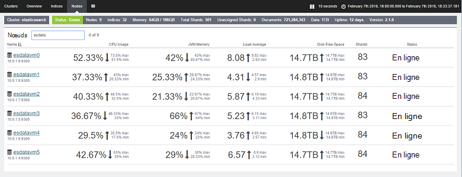

<properties
   pageTitle="Réglage des performances d’agrégation et de requête de données avec Elasticsearch sur Azure | Microsoft Azure"
   description="Un résumé des considérations lors de l’optimisation des performances de requête et de recherche pour Elasticsearch."
   services=""
   documentationCenter="na"
   authors="dragon119"
   manager="bennage"
   editor=""
   tags=""/>

<tags
   ms.service="guidance"
   ms.devlang="na"
   ms.topic="article"
   ms.tgt_pltfrm="na"
   ms.workload="na"
   ms.date="09/22/2016"
   ms.author="masashin"/>
   
# <a name="tuning-data-aggregation-and-query-performance-with-elasticsearch-on-azure"></a>Réglage des performances d’agrégation et de requête de données avec Elasticsearch sur Azure

[AZURE.INCLUDE [pnp-header](../../includes/guidance-pnp-header-include.md)]

Cet article fait [partie d’une série](guidance-elasticsearch.md). 

La raison principale de l’utilisation de Elasticsearch est à prendre en charge les recherches dans les données. Les utilisateurs doivent être en mesure de trouver rapidement les informations qu’ils recherchent. En outre, le système doit permettre aux utilisateurs de poser des questions, des données, la recherche des corrélations et fournis aux conclusions peuvent conduire à des décisions commerciales. Ce traitement est ce qui différencie les données à partir des informations.

Ce document récapitule les options que vous pouvez prendre en compte lors de la détermination de la meilleure façon d’optimiser votre système pour des performances de requête et de recherche.

Toutes les recommandations concernant les performances dépendre en grande partie sur les scénarios qui s’appliquent à votre situation, le volume de données que vous indexez et le taux auquel les applications et les utilisateurs interroger vos données. Vous devez soigneusement tester les résultats de toute modification de configuration ou d’une structure d’indexation à l’aide de vos propres données et charges de travail afin d’évaluer les avantages à vos scénarios spécifiques. À cette fin, ce document décrit également un certain nombre de critères d’évaluation qui ont été effectuées pour un scénario spécifique implémenté à l’aide de différentes configurations. Vous pouvez adapter l’approche adoptée pour évaluer les performances de vos systèmes. Les détails de ces tests sont décrits dans l' [annexe](#appendix-the-query-and-aggregation-performance-test).

## <a name="index-and-query-performance-considerations"></a>Considérations de performances d’indexation et de requête

Cette section décrit certains facteurs communs que vous devez penser à propos lorsque la conception indexe que nécessaire pour prendre en charge les requêtes et la recherche rapide.

### <a name="storing-multiple-types-in-an-index"></a>Stockage de plusieurs types dans un index

Un index Elasticsearch peut contenir plusieurs types. Il peut être préférable d’éviter cette approche et de créer un index distinct pour chaque type. Tenez compte des points suivants :

- Différents types peuvent spécifier différents analyseurs, et il n’est pas toujours claire l’Analyseur de Elasticsearch devez utiliser si une requête est exécutée au niveau de l’index et non au niveau du type. Pour plus d’informations, voir [Comment éviter les pièges de Type](https://www.elastic.co/guide/en/elasticsearch/guide/current/mapping.html#_avoiding_type_gotchas) .

- Milieu des fragments pour les index qui contiennent plusieurs types seront sans doute plus importants que ceux pour les index qui contiennent un type unique. La plus grande a partagé, plus l’effort est requis par Elasticsearch pour filtrer les données lors de l’exécution des requêtes.

- S’il existe une différence significative entre les volumes de données pour les types, les informations pour un type peuvent devenir distribuées sur milieu des fragments de réduire l’efficacité des recherches qui extraient des données.

    

    ***Les effets de partage un index entre les types*** 

    Dans la partie supérieure du diagramme, le même index est partagé par les documents de type A et type b. Il existe bien d’autres documents de type A à type que b. recherche type n’impliquent l’interrogation de tous les quatre milieu des fragments. La partie inférieure du diagramme montre l’effet si index séparés sont créés pour chaque type. Dans ce cas, recherche type n’exige uniquement accéder au milieu des deux fragments.

- Milieu des petits fragments peuvent être plus équitablement distribuées au milieu des fragments volumineux, afin de faciliter pour les Elasticsearch répartir la charge sur les nœuds.

- Types différents peuvent avoir des différentes périodes de rétention. Il peut être difficile pour l’archivage des données anciennes qui partage le milieu des fragments de données actives.


Toutefois, dans certaines circonstances parmi les différents types de partage un index peut être efficace si :

- Recherches span régulièrement les types contenus dans le même index.

- Les types ont uniquement un petit nombre de documents que chacun. Maintenance d’un ensemble distinct de milieu des fragments pour chaque type de risque de devenir une charge mémoire importante dans ce cas.


### <a name="optimizing-index-types"></a>Optimisation des types d’index

Un index Elasticsearch contient une copie des documents JSON d’origine qui ont été utilisés pour la remplir. Cette information est conservée dans le [* \_source*](https://www.elastic.co/guide/en/elasticsearch/reference/current/mapping-source-field.html#mapping-source-field) champ de chaque élément indexé. Ces données ne sont pas disponible pour la recherche, mais par défaut sont renvoyées par les requêtes *get* et de *recherche* . Toutefois, ce champ entraîne une surcharge et occupe de stockage, agrandir le milieu des fragments et augmenter le volume d’e/s effectuée. Vous pouvez désactiver la * \_source de* sur une base par type :

```http
PUT my_index
{
  "mappings": {
    "my_type": {
      "_source": {
        "enabled": false
      }
    }
  }
}
```
La désactivation de ce champ supprime également la possibilité d’effectuer les opérations suivantes :

- Mise à jour des données de l’index à l’aide de la *mise à jour* API.

- Effectuant des recherches qui retournent des données en surbrillance.

- Réindexation à partir d’un seul index Elasticsearch directement à un autre.

- Modification des mappages ou des paramètres d’analyse.

- Débogage des requêtes en affichant le document d’origine.


### <a name="reindexing-data"></a>Réindexation des données

Le nombre de milieu des fragments disponibles pour un index détermine la capacité de l’index à la fin. Vous pouvez effectuer une estimation initiale (et informée) au milieu des fragments combien sera nécessaires, mais vous considérez votre document de stratégie de la réindexation. Dans de nombreux cas, la réindexation peut être une tâche prévue que le volume de données augmente. Vous souhaitez ne peut-être pas un grand nombre de milieu des fragments à un index d’allouer à l’origine, dans un souci d’optimisation de la recherche, mais le nouveau milieu des fragments d’allouer que le volume de données se développe. Dans les autres cas réindexation devront être exécutées sur une base ad hoc plus si vos estimations concernant la croissance des volumes de données simplement s’avérer inexactes.

> [AZURE.NOTE] Réindexation n’est peut-être pas nécessaire pour les données qui vieillit rapidement. Dans ce cas, une application peut créer un nouvel index pour chaque période de temps. Exemples incluent des journaux de performance ou les données qui peuvent être stockées dans un index actualisé chaque jour d’audit.

<!-- -->

Réindexation efficace implique la création d’un nouvel index à partir des données dans une ancienne, puis la suppression de l’ancien index. Si un index est volumineux, ce processus peut prendre un temps, et vous devrez vous assurer que les données restent consultables au cours de cette période. Pour cette raison, vous devez créer un [alias pour chaque index](https://www.elastic.co/guide/en/elasticsearch/reference/current/indices-aliases.html), et les requêtes doivent récupérer des données par le biais de ces alias. Lors de la réindexation, conserver l’alias pointant vers l’ancien index et basculez ensuite pour le nouvel index de référence une fois la réindexation est terminée. Cette approche est également utile pour l’accès aux données basée sur le temps qui crée un nouvel index chaque jour. Pour accéder en cours données utilisent un alias qui revient au nouvel index lors de sa création.

### <a name="managing-mappings"></a>Gestion des mappages

Elasticsearch utilise des mappages pour déterminer comment interpréter les données qui se produit dans chaque champ dans un document. Chaque type a son propre mappage qui efficacement définit un schéma pour ce type. Elasticsearch utilise ces informations pour générer un index inversé pour chaque champ dans les documents d’un type. Dans n’importe quel document, chaque champ possède un type de données (par exemple, *chaîne*, *date*ou *long*) et une valeur. Vous pouvez spécifier les mappages d’un index lors de la première création de l’index, ou elles peuvent être déduites en Elasticsearch lorsque de nouveaux documents sont ajoutés à un type. Toutefois, tenez compte des points suivants :

- Mappages générés de manière dynamique peuvent provoquer des erreurs en fonction de la façon dont les champs sont interprétés lorsque des documents sont ajoutés à un index. Par exemple, document 1 peut contenir un champ qui contient un nombre et causes Elasticsearch pour ajouter un mappage qui indique que ce champ est un *type long*. Si un document suivant est ajouté dans le champ A contienne des données non numériques, puis il échouera. Dans ce cas, le champ A doit probablement été interprété comme une chaîne lors de l’ajout du premier document. Ce mappage lors de la création de l’index peut faciliter pour éviter de tels problèmes.

- Concevez vos documents pour éviter de générer des mappages extrêmement volumineux peut ajoutent une charge mémoire importante lors de l’exécution de recherches, consomment une grande quantité de mémoire, et également entraîner de requêtes rechercher des données. Adopter une convention de dénomination cohérente pour les champs dans les documents qui partagent le même type. Par exemple, n’utilisez pas les noms de champ « Prénom », « FirstName » et « prénom » dans les différents documents. Utilisez le même nom de champ dans chaque document. En outre, n’essayez pas d’utiliser des valeurs en tant que clés (c’est une approche commune dans les bases de données de colonne de la gamme, mais peut provoquer des défaillances et manque d’efficacité avec Elasticsearch.) Pour plus d’informations, consultez [Mappage de l’Explosion](https://www.elastic.co/blog/found-crash-elasticsearch#mapping-explosion).

- *Not_analyzed* permet d’éviter la création de jetons le cas échéant. Par exemple, si un document contient un champ de chaîne de *données* qui contient la valeur « ABC DEF » vous pouvez essayer d’effectuer une recherche de tous les documents qui correspondent à cette valeur de comme suit :

  ```http
  GET /myindex/mydata/_search
  {
    "query" : {
      "filtered" : {
        "filter" : {
          "term" : {
            "data" : "ABC-DEF"
          }
        }
      }
    }
  }
  ```

 Toutefois, cette recherche ne pourra pas obtenir les résultats escomptés en raison du mode dans lequel la chaîne ABC-DEF est sous forme de jetons lorsqu’il est indexé. Il va être efficacement divisé en deux jetons, ABC et DEF, par le trait d’union. Cette fonctionnalité est conçue pour prendre en charge la recherche de texte intégral, mais si vous souhaitez que la chaîne est interprété comme étant un seul élément atomique vous devez désactiver la création de jetons lorsque le document est ajouté à l’index. Vous pouvez utiliser un mappage de ce :

  ```http
  PUT /myindex
  {
    "mappings" : {
      "mydata" : {
        "properties" : {
          "data" : {
            "type" : "string",
            "index" : "not_analyzed"
          }
        }
      }
    }
  }
  ```

  Pour plus d’informations, consultez [Recherche les valeurs exactes](https://www.elastic.co/guide/en/elasticsearch/guide/current/_finding_exact_values.html#_term_filter_with_text).


### <a name="using-doc-values"></a>À l’aide des valeurs de document

De nombreuses requêtes et agrégations exigent que les données sont triées dans le cadre de l’opération de recherche. Le tri requiert la possibilité de mapper un ou plusieurs termes à une liste de documents. Pour faciliter ce processus, Elasticsearch pouvez charger toutes les valeurs d’un champ utilisé comme clé de tri en mémoire. Cette information est appelée *fielddata*. Le but est que la mise en cache des fielddata dans la mémoire entraîne moins d’e/s et peut être plus rapide que la lecture de plusieurs fois les mêmes données à partir du disque. Toutefois, si un champ a une cardinalité élevée puis en stockant en mémoire le fielddata peut consommer beaucoup d’espace pour le tas, éventuellement affecter la possibilité d’effectuer d’autres opérations simultanées, ou même en épuisant à l’origine de la Elasticsearch Échec de stockage.

En guise d’alternative, Elasticsearch prend également en charge les *valeurs de doc*. Une valeur de doc est similaire à un élément de mémoire fielddata à ceci près qu’il est stocké sur le disque et créé lorsque les données sont stockées dans un index (fielddata est construit dynamiquement lorsqu’une requête est exécutée.) Les valeurs de document ne consomment pas d’espace pour le tas et sont donc utiles pour les requêtes que trier ou agréger des données sur les champs qui peuvent contenir un très grand nombre de valeurs uniques. En outre, la pression réduite sur le tas peut aider à compenser les différences de performances entre la récupération de données à partir du disque et la lecture de la mémoire. Le garbage collection est susceptible de se produire moins souvent, et autres opérations concurrentes qui utilisent la mémoire sont moins susceptibles d’être effectuées.

Pour activer ou désactiver les valeurs doc sur une base par propriété d’un index à l’aide de l’attribut *doc_values* , comme le montre l’exemple suivant :

```http
PUT /myindex
{
  "mappings" : {
    "mydata" : {
      "properties" : {
        "data" : {
          ...
          "doc_values": true
        }
      }
    }
  }
}
```
> [AZURE.NOTE] Les valeurs de document sont activées par défaut avec la version 2.0.0 à partir de Elasticsearch.

L’impact préci de l’utilisation de valeurs de doc est susceptible d’être extrêmement spécifiques à vos propres scénarios de données et la requête, alors soyez prêt à effectuer des tests de performances pour établir leur utilité. Vous devez également noter ce document valeurs ne fonctionnent pas avec les champs de type chaîne analysée. Pour plus d’informations, consultez [Les valeurs de Doc](https://www.elastic.co/guide/en/elasticsearch/guide/current/doc-values.html#doc-values).

### <a name="using-replicas-to-reduce-query-contention"></a>L’utilisation de réplicas pour réduire les conflits de requête

Une stratégie commune pour renforcer les performances de requêtes est de créer plusieurs réplicas de chaque index. Les opérations d’extraction de données peuvent être satisfaites par l’extraction de données à partir d’un réplica. Toutefois, cette stratégie peut altérer les performances des opérations d’acquisition de données, donc il doit être utilisé avec précaution dans les scénarios qui impliquent des charges de travail mixtes. En outre, cette stratégie est uniquement de la prestation si les réplicas sont répartis entre les nœuds et ne se concurrencent pas de ressources avec le milieu des fragments primaires qui font partie du même index. N’oubliez pas qu’il est possible d’augmenter ou diminuer le nombre de répliques d’index dynamique.

### <a name="using-the-shard-request-cache"></a>L’utilisation du cache de requête partagé

Elasticsearch peut mettre en cache les données locales demandées par les requêtes sur chaque partagé dans la mémoire. Cette recherche permet qui récupèrent les données mêmes s’exécutent plus rapidement, les données peuvent être lues à partir du stockage de mémoire plutôt que sur disque. La mise en cache des données de cette façon peut donc améliorer les performances de certaines opérations de recherche, mais réduit la quantité de mémoire disponible pour les autres tâches en cours d’exécution simultanément. Il existe également un risque que les données fourni par le cache est obsolète. Les données dans le cache sont uniquement invalidées lorsque le partagé est actualisé et les données ont changé. La fréquence d’actualisation est régie par la valeur du paramètre *refresh_interval* de l’index.

La demande de mise en cache pour un index est désactivée par défaut, mais vous pouvez l’activer comme suit :

```http
PUT /myindex/_settings
{
  "index.requests.cache.enable": true
}
```

Le cache de requête partagé est mieux adapté aux informations, qui restent relativement statiques, telles que des données historiques ou que l’enregistrement.

### <a name="using-client-nodes"></a>L’utilisation de nœuds de client

Toutes les requêtes sont traitées par le noeud qui reçoit la demande d’abord. Ce nœud envoie des requêtes supplémentaires pour tous les autres nœuds contenant le milieu des fragments pour les indices interrogés et puis accumule les résultats pour retourner la réponse. Si une requête implique l’agrégation des données ou d’effectuer des calculs complexes, le nœud initial est responsable de l’exécution du traitement approprié. Si votre système dispose de la prise en charge d’un petit nombre de requêtes complexes, pensez à créer un pool de client nœuds à alléger la charge des nœuds de données. À l’inverse, si votre système à gérer un grand nombre de requêtes simples, puis à envoyer ces requêtes directement dans les nœuds de données et utilisent un équilibreur de charge pour distribuer équitablement les demandes.

### <a name="tuning-queries"></a>Paramétrage des requêtes

Les points suivants résument les conseils pour optimiser les performances des requêtes de Elasticsearch :

- Éviter les requêtes qui impliquent des caractères génériques lorsque cela est possible.

- Si le même champ est à la recherche et exacte de texte intégral de la correspondance, envisagez de stocker les données pour le champ dans les formulaires analysés et nonanalyzed. Effectuer des recherches de texte intégral dans le champ analysé et les correspondances exactes avec le champ nonanalyzed.

- Renvoyer uniquement les données nécessaires. Si vous avez des documents de grande taille, mais une application requiert uniquement les informations contenues dans un sous-ensemble des champs, puis retournez ce sous-ensemble à partir de requêtes plutôt que des documents entiers. Cette stratégie peut réduire les besoins en bande passante de réseau du cluster.

- Dans la mesure du possible, utiliser des filtres au lieu de requêtes lorsque vous recherchez des données. Un filtre détermine simplement si un document correspond à un critère donné qu’une requête calcule également comment fermer une correspondance un document est (évaluation). En interne, les valeurs générées par un filtre sont stockées sous la forme d’un bitmap indiquant correspondance/non correspondance pour chaque document, et elles peuvent être mises en cache par Elasticsearch. Si le même critère de filtre se produit par la suite, la bitmap peut être récupérée à partir du cache et être utilisée pour extraire rapidement des documents correspondants. Pour plus d’informations, reportez-vous à la section [Opération de filtrage interne](https://www.elastic.co/guide/en/elasticsearch/guide/current/_finding_exact_values.html#_internal_filter_operation).

- Utilisez *bool* filtres pour effectuer des comparaisons statiques et seulement *et*, *ou*et *pas* de filtres pour les filtres calculés dynamiquement, telles que celles qui impliquent la création de scripts ou de la *géo -\* * filtres.

- Si une requête combine les filtres *bool* avec *et*, *ou*, ou *non* avec *géo -* * filtres, placez la *et de*/*ou*/*pas géo-** filtres dernière afin qu’ils opèrent sur la plus petite possible de l’ensemble de données.

    De même, utiliser un *post_filter* pour exécuter les opérations coûteuses de filtre. Ces filtres va être effectuées en dernier.

- Utiliser des agrégations plutôt que des facettes. Éviter le calcul des agrégats qui sont analysées ou qui ont plusieurs valeurs possibles.

    > **Remarque**: les facettes ont été supprimées dans Elasticsearch version 2.0.0.

- Utiliser l’agrégation de *cardinalité* plutôt que l’agrégation de *value_count* , à moins que votre application requiert un nombre exact d’objets correspondants. Un nombre exact peut devenir rapidement obsolète, et de nombreuses applications requièrent uniquement une approximation raisonnable.

- Éviter l’écriture de scripts. Les scripts dans les requêtes et les filtres peuvent être coûteuses et les résultats ne sont pas mis en cache. Scripts de longue peuvent utiliser des threads de recherche indéfiniment, à l’origine de la file d’attente les demandes suivantes. Si la file d’attente se remplit, plus les demandes seront rejetées.

## <a name="testing-and-analyzing-aggregation-and-search-performance"></a>Test et analyse des performances de regroupement et de recherche

Cette section décrit les résultats d’une série de tests qui ont été exécutées sur un cluster différents et des configurations de l’index. Deux types de tests ont été effectués, comme suit :

- *Requête et * *l’ingestion* test **. Ce test a démarré avec un index vide qui a été rempli que le test s’est poursuivie en effectuant des opérations d’insertion en bloc (chaque opération ajoutée 1000 documents). Dans le même temps, un nombre de requêtes permettant de rechercher les documents ajoutés au cours de la précédente période de 15 minutes et générer des agrégations ont été répété à intervalles de 5 secondes. Ce test a été généralement autorisé à s’exécuter pendant 24 heures, pour reproduire les effets d’une charge de travail complexe comprenant la réception de données à grande échelle avec près de requêtes en temps réel.

- **La *requête seule* **de test. Ce test est similaire à la *réception et requête* test sauf que la partie de réception est omise et que l’index de chaque nœud est préremplie avec 100 millions de documents. Un ensemble modifié de requêtes est effectué ; l’élément heure limitant les documents à ceux ajoutés dans les 15 dernières minutes a été supprimé car les données a maintenant étaient statiques. Exécution de tests pendant 90 minutes, il y a moins de temps nécessaires à l’établissement d’un modèle de performances en raison de la quantité de données fixe.

---

Chaque document de l’index a le même schéma. Le tableau suivant résume les champs dans le schéma :

Nom                          | Type de         | Notes |
  ----------------------------- | ------------ | -------------------------------------------------------- |
  Organisation                  | Chaîne      | Le test génère de 200 organisations uniques. |
  CustomField1 - champ personnalisé 5   |Chaîne       |Il s’agit de cinq champs de chaîne dont la valeur une chaîne vide.|
  DateTimeRecievedUtc           |Horodatage    |La date et l’heure à laquelle le document a été ajouté.|
  Hôte                          |Chaîne       |Ce champ est défini sur une chaîne vide.|
  HttpMethod                    |Chaîne       |Ce champ est défini sur une des valeurs suivantes : « POST », « GET », « PUT ».|
  HttpReferrer                  |Chaîne       |Ce champ est défini sur une chaîne vide.|
  HttpRequest                   |Chaîne       |Ce champ est rempli avec du texte aléatoire entre 10 et 200 caractères.|
  HttpUserAgent                 |Chaîne       |Ce champ est défini sur une chaîne vide.|
  HttpVersion                   |Chaîne       |Ce champ est défini sur une chaîne vide.|
  Nom_organisation              |Chaîne       |Ce champ est défini sur la même valeur que le champ organisation.|
  SourceIp                      |IP           |Ce champ contient une adresse IP indiquant « l’origine » des données. |
   SourceIpAreaCode              |Long         |Ce champ est défini sur 0.|
  SourceIpAsnNr                 |Chaîne       |Ce champ est défini sur « en tant que\#\#\#\#\#».|
  SourceIpBase10                |Long         |Ce champ est défini à 500.|
  SourceIpCountryCode           |Chaîne       |Ce champ contient un code de pays de 2 caractères. |
  SourceIpCity                  |Chaîne       |Ce champ contient une chaîne qui identifie une ville dans un pays. |
  SourceIpLatitude              |Double       |Ce champ contient une valeur aléatoire.|
  SourceIpLongitude             |Double       |Ce champ contient une valeur aléatoire.|
  SourceIpMetroCode             |Long         |Ce champ est défini sur 0.|
  SourceIpPostalCode            |Chaîne       |Ce champ est défini sur une chaîne vide.|
  SourceLatLong                 |Point de geo   |Ce champ est défini à un point géographique aléatoire.|
  PortSource                    |Chaîne       |Ce champ est renseigné avec la représentation sous forme de chaîne d’un nombre aléatoire.|
  TargetIp                      |IP           |Il est rempli avec une adresse IP aléatoire dans la plage 0.0.100.100 à 255.9.100.100.|
  SourcedFrom                   |Chaîne       |Ce champ est défini sur la chaîne « MonitoringCollector ».|
  Port cible                    |Chaîne       |Ce champ est renseigné avec la représentation sous forme de chaîne d’un nombre aléatoire.|
  Contrôle d’accès                        |Chaîne       |Ce champ est renseigné avec l’une des 20 différentes valeurs de chaîne sélectionnées de manière aléatoire.|
  UseHumanReadableDateTimes     |Valeur booléenne      |Ce champ est défini sur false.|
 
Les requêtes suivantes ont été effectuées sous la forme d’un lot par chaque itération des tests. Les noms en caractères italiques sont utilisés pour faire référence à ces requêtes dans le reste de ce document. Notez que le critère de temps (documents ajoutés dans les 15 dernières minutes) a été omis de la *requête uniquement* des tests :

- Le nombre de documents avec chaque valeur de *niveau* ont été entré dans les 15 dernières minutes (*nombre par évaluation*) ? 

- Le nombre de documents ont été ajouté dans chaque intervalle de 5 minutes au cours des 15 dernières minutes (*nombre de temps*) ?

- Le nombre de documents de chaque valeur *d’évaluation* ont été ajouté pour chaque pays dans les 15 dernières minutes (*nombre d’accès par pays*) ?

- Les 15 organisations produisent les documents fréquemment dans la plupart des ajoutées dans les dernières minutes de 15 (*15 premières entreprises*) ?

- Le nombre des organisations différentes se produisent dans les documents ajoutés dans les 15 dernières minutes (*organisations de nombre Unique*) ?

- Le nombre de documents ont été ajouté dans les dernières minutes 15 (*nombre d’accès Total*) ?

- Le nombre de valeurs *SourceIp* différent se produire dans les documents ajoutés dans les 15 dernières minutes (*nombre d’IP Unique*) ?


La définition de l’index et les détails des requêtes sont décrites dans l' [annexe](#appendix-the-query-and-aggregation-performance-test).

Les tests ont été conçus pour comprendre les effets des variables suivantes :

- **Type de disque**. Les tests ont été exécutées sur un cluster de nœuds 6 des ordinateurs virtuels de D4 à l’aide de stockage standard (disques durs) et répétées sur un cluster de nœuds 6 des ordinateurs virtuels de DS4 à l’aide du stockage de prime (SSD).

- **Taille de l’ordinateur - mise à l’échelle**. Des tests ont été exécutées sur un cluster de nœuds 6 comprenant des ordinateurs virtuels de DS3 (désigné comme le *petit* cluster) répétées sur un cluster d’ordinateurs virtuels (le cluster *support* ) de la DS4 et répétées à nouveau sur un cluster de machines de DS14 (le *grand* cluster). Le tableau suivant récapitule les caractéristiques clés de chaque SKU VM :

 Cluster | RÉFÉRENCE DE LA MACHINE VIRTUELLE        | Nombre de cœurs | Nombre de disques de données | (GO) DE RAM |
---------|---------------|-----------------|----------------------|----------|
 Petite taille   | DS3 standard  | 4               | 8                    | 14       |
 Support  | DS4 standard  | 8               | 16                   | 28       |
 Grande taille   | DS14 standard | 16              | 32                   | 112      |

- **Taille de cluster - mise à l’échelle**. Les tests ont été effectués sur des clusters de machines virtuelles de DS14 contenant du 1, 3 et 6 nœuds.

- **Nombre de duplications de l’index**. Des tests ont été effectués à l’aide des index configurés avec des réplicas 1 et 2.

- **Les valeurs de doc**. Initialement, les essais ont été effectués avec l’index de paramètre *doc_values* la valeur *true* (valeur par défaut). Tests sélectionnés ont été répétés avec *doc_values* la valeur *false*.

- **La mise en cache**. Les tests ont été réalisés avec le cache de requête partagé activé sur l’index.

- **Nombre de milieu des fragments**. Les tests ont été répétés à l’aide des différents numéros de milieu des fragments d’établir si les requêtes a exécuté plus efficacement sur un index contenant le milieu des fragments moins nombreuses et plus grandes ou plus, plus petites milieu des fragments.


## <a name="performance-results---disk-type"></a>Résultats des performances - type de disque

Performances de disque a été évaluée par le test de *réception et la requête* en cours d’exécution sur le cluster à 6 nœuds de machines virtuelles de D4 (à l’aide de disques durs) et sur le cluster à 6 nœuds de machines virtuelles de DS4 (à l’aide de SSDs). La configuration de Elasticsearch dans les deux clusters était le même. Les données étaient réparties sur 16 disques sur chaque nœud et chaque nœud a 14 Go de mémoire vive allouée à la machine de virtuelle Java (JVM) Elasticsearch en cours d’exécution, la mémoire restante (également 14 Go) a été laissée pour une utilisation du système d’exploitation. Chaque test s’est exécuté pendant 24 heures. Cette période a été sélectionnée pour activer les effets de la hausse du volume des données se manifestent et de permettre au système de se stabiliser. Le tableau ci-dessous résume les résultats, les temps de réponse des opérations qui comprenant le test de la mise en surbrillance.

 Cluster | Requête d’opération            | Temps de réponse moyen (ms) |
---------|----------------------------|----------------------------|
 D4      | Réception                  | 978                        |
         | Nombre par évaluation            | 103                        |
         | Nombre de fois            | 134                        |
         | Nombre d’accès par pays            | 199                        |
         | 15 principales organisations       | 137                        |
         | Organisations de nombre unique | 139                        |
         | Nombre d’IP unique            | 510                        |
         | Comptage du nombre total d’accès           | 89                         |
 DS4     | Réception                  | 511                        |
         | Nombre par évaluation            | 187                        |
         | Nombre de fois            | 411                        |
         | Nombre d’accès par pays            | 402                        |
         | 15 principales organisations       | 307                        |
         | Organisations de nombre unique | 320                        |
         | Nombre d’IP unique            | 841                        |
         | Comptage du nombre total d’accès           | 236                        |

À première vue, il semble que le cluster DS4 effectué les requêtes moins bonnes que celles de cluster D4, parfois doubler (ou pire) le temps de réponse. Cela n’indique pas tout bien. Le tableau suivant indique le nombre d’opérations d’acquisition réalisées par chaque cluster (n’oubliez pas que chaque opération charge de 1000 documents) :

 Cluster | Nombre d’opérations de réception |
---------|---------------------------|
 D4      | 264769                    |
 DS4     | 503157                    |

Le cluster DS4 a été en mesure de charger presque deux fois plus de données que le cluster D4 pendant le test. Par conséquent, lorsque vous analysez les temps de réponse pour chaque opération, vous devez également prendre en compte le nombre de documents a de chaque requête à analyser et le nombre de documents est retourné. Il s’agit de chiffres dynamiques qu’en continu augmente le volume des documents dans l’index. Vous ne pouvez pas simplement diviser 503137 par 264769 (le nombre d’opérations de réception effectuées par chaque cluster) et puis multiplier le résultat par le temps de réponse moyen pour chaque requête effectuée par le cluster D4 pour donner une information comparative comme il ignore la quantité d’e/s en cours d’exécution simultanément par l’opération de réception. Au lieu de cela, vous devez mesurer la quantité de données écrites à mémoire et lues sur le disque, comme l’essai se poursuit. Le plan de test JMeter capture ces informations pour chaque nœud. Les résultats résumés sont les suivantes :

 Cluster | Moyenne d’octets écrits/lus par chaque opération. |
---------|----------------------------------------------|
 D4      | 13471557                                     |
 DS4     | 24643470                                     |

Ces données montrent que le cluster DS4 a été en mesure de maintenir un taux d’e/s environ 1,8 fois celle du cluster D4. Étant donné que, en dehors de la nature des disques, toutes les autres ressources sont les mêmes, la différence doit être liée à l’utilisation de SSDs plutôt les disques durs.

Pour justifier cette conclusion, les graphiques suivants illustrent la manière dont les e/s a été effectuée dans le temps par chaque cluster :


<!-- -->

***Activité du disque pour les clusters D4 et DS4***

Le graphique pour le cluster D4 indique une variation importante, tout particulièrement au cours de la première moitié de l’essai. Ceci a été probablement en raison de la limitation pour réduire le taux d’e/s. Dans les premières phases de l’essai, les requêtes sont en mesure d’exécuter rapidement qu’il existe peu de données à analyser. Les disques du cluster D4 sont par conséquent susceptibles d’agir près de leurs opérations d’entrée/sortie par capacité de seconde (IOPS), bien que chaque opération d’e/s ne peut pas renvoyer plus de données. Le cluster DS4 est en mesure de prendre en charge un taux d’e/s supérieur et ne souffre pas le même degré de limitation, les taux d’e/s sont plus régulières. Pour prendre en charge cette théorie, la paire suivante de graphiques montrent comment l’UC a été bloquée par des e/s disque au fil du temps (les temps d’attente de disque affichées dans les graphiques sont la proportion du temps passé par le processeur à attendre les e/s) :


***E/s de disque du processeur d’attente pour les clusters D4 et DS4***

Il est important de comprendre qu’il existe deux raisons prédominantes pour les opérations d’e/s de bloquer l’unité centrale :

- Le sous-système d’e/s de lecture ou écriture de données vers ou à partir du disque.

- Le sous-système d’e/s peut être limité par l’environnement hôte. Disques Azure implémentés à l’aide de disques durs ont un débit maximal de 500 Ops ES/s et SSDs ont un débit maximum de 5000 Ops ES/s.


Pour le cluster D4, la quantité de temps passé à attendre d’e/s pendant le premier semestre de la corrélation de test étroitement de manière inversée avec le graphique indiquant le taux d’e/s. Périodes d’e/s faible correspondent aux périodes de temps par bloqué de l’unité centrale, cela indique que les e/s est limitée. En plus de données sont ajoutés au cluster, la situation est différente, et dans la seconde moitié du test de pics d’e/s temps d’attente correspondent aux pics de débit e/s. À ce stade, l’UC est bloqué lors de l’exécution d’e/s réelles. À nouveau, avec le cluster de la DS4, le temps d’attente d’e/s est plus régulier. Chaque pic correspond à un pic équivalent dans les performances d’e/s plutôt qu’un bac, cela implique qu’il y a peu, voire aucune limitation se produisant.

Il existe un autre facteur à prendre en compte. Au cours de l’essai, le cluster D4 généré 10584 ingestion les erreurs et 21 requête. Le test sur le cluster DS4 ne produit aucune erreur.

## <a name="performance-results---scaling-up"></a>Résultats de performances - mise à l’échelle

Test de l’extrapolation a été effectuée en exécutant des tests sur les 6 nœuds de DS3, DS4 et DS14 VMs. Ces références ont été sélectionnées parce qu’un ordinateur virtuel de DS4 fournit deux fois plus de coeurs de processeur et de mémoire comme une DS3 et une machine DS14 double à nouveau les ressources du processeur tout en offrant les quatre fois la quantité de mémoire. Le tableau ci-dessous compare les aspects clés de chaque point de stock :

 POINT DE STOCK  | \#Coeurs de processeur | Mémoire (Go) | IOPS de disque max | Bande passante de max (Mo/s)|
------|-------------|-------------|---------------|--------------|
 DS3  | 4           | 14          | 12,800| 128 |
 DS4  | 8           | 28          | 25,600| 256 |
 DS14 | 16          | 112         | 50 000| 512 |

Le tableau suivant récapitule les résultats de l’exécution des tests sur les PME (DS3), (DS4), des clusters de grande taille (DS14). Chaque machine virtuelle permettant de contenir les données SSDs. Chaque test s’est exécuté pendant 24 heures.

Le tableau indique le nombre de demandes réussies pour chaque type de requête (les erreurs ne sont pas inclus). Le nombre de demandes pour chaque type de requête est à peu près le même pendant une série de tests. C’est parce que le plan de test JMeter s’exécute une seule occurrence de chaque requête (nombre par évaluation, nombre de fois, accès par pays, haut 15 organisations, Unique nombre d’organisations, nombre d’IP uniques et nombre Total de présences dans) ensemble dans une seule unité connue sous la forme d’une *transaction de test* (cette opération est indépendante de la tâche qui exécute l’opération d’acquisition, qui est exécutée par un thread séparé). Chaque itération de plan de test effectue une transaction de test unique. Le nombre de transactions de test terminé est donc une mesure du temps de réponse de la requête la plus lente dans chaque transaction.

| Cluster      | Requête d’opération            | Nombre de demandes | Temps de réponse moyen (ms) |
|--------------|----------------------------|--------------------|----------------------------|
| Petite (DS3)  | Réception                  | 207284             | 3328                       |
|              | Nombre par évaluation            | 18444              | 268                        |
|              | Nombre de fois            | 18444              | 340                        |
|              | Nombre d’accès par pays            | 18445              | 404                        |
|              | 15 principales organisations       | 18439              | 323                        |
|              | Organisations de nombre unique | 18437              | 338                        |
|              | Nombre d’IP unique            | 18442              | 468                        |
|              | Comptage du nombre total d’accès           | 18428              | 294   
|||||
| Moyenne (DS4) | Réception                  | 503157             | 511                        |
|              | Nombre par évaluation            | 6958               | 187                        |
|              | Nombre de fois            | 6958               | 411                        |
|              | Nombre d’accès par pays            | 6958               | 402                        |
|              | 15 principales organisations       | 6958               | 307                        |
|              | Organisations de nombre unique | 6956               | 320                        |
|              | Nombre d’IP unique            | 6955               | 841                        |
|              | Comptage du nombre total d’accès           | 6958               | 236                        |
|||||
| Grande taille (DS14) | Réception                  | 502714             | 511                        |
|              | Nombre par évaluation            | 7041               | 201                        |
|              | Nombre de fois            | 7040               | 298                        |
|              | Nombre d’accès par pays            | 7039               | 363                        |
|              | 15 principales organisations       | 7038               | 244                        |
|              | Organisations de nombre unique | 7037               | 283                        |
|              | Nombre d’IP unique            | 7037               | 681                        |
|              | Comptage du nombre total d’accès           | 7038               | 200                        |

Ces chiffres montrent que, pour ce test, les performances du cluster DS4 et DS14 étaient raisonnablement similaires. Les temps de réponse pour les opérations de requête pour le cluster DS3 apparaissent également comparez favorablement initialement, et le nombre d’opérations de requête effectuées est bien dépassent les valeurs pour le cluster DS4 et DS14. Toutefois, un doit également prendre des avis fort de la vitesse de réception et le nombre à la suite des documents en cours de recherche. Dans le cluster DS3 ingestion est beaucoup plus limitée, et à la fin du test de la base de données ne contenait environ 40 % des documents lues par chacune des deux autres clusters. Il s’agit soit les ressources de traitement, réseau et la bande passante disponible à une VM DS3 comparée à un DS4 ou à DS14 VM du disque. Étant donné qu’un ordinateur virtuel de DS4 a deux fois plus de ressources disponibles sous la forme d’une machine virtuelle de DS3 et un DS14 a deux fois (quatre fois pour mémoire) les ressources d’un ordinateur virtuel de DS4, il reste une question : Pourquoi est la différence de taux de réception entre les clusters DS4 et DS14 nettement inférieure à celle qui se produit entre les clusters DS3 et DS4 ? Cela peut être dû à l’utilisation du réseau et des ordinateurs virtuels d’Azure, les limites de bande passante. Les graphiques ci-dessous indiquent ces données pour tous les clusters de trois :


**Utilisation du réseau pour les clusters DS3, DS4 et DS14 exécution du test de réception et de la requête** 

<!-- -->

Les limites de la bande passante réseau disponible avec Azure VM ne sont pas publiées et peuvent varier, mais le fait que l’activité réseau ont se sont stabilisées à une moyenne d’environ 2.75GBps pour la DS4 de deux et tests de DS14 vous propose qu’une telle limite a été atteinte et est devenu le facteur principal de limitation de débit. Dans le cas du cluster DS3, l’activité du réseau a été considérablement plus bas afin que les performances inférieur sont plus probable en raison de contraintes en termes de disponibilité des autres ressources.

Pour isoler les effets des opérations de réception et illustrent comment les performances des requêtes selon les nœuds évoluer, un ensemble de tests de requête seule a été effectué en utilisant les mêmes nœuds. Le tableau suivant récapitule les résultats obtenus sur chaque cluster :

> [AZURE.NOTE] Vous ne devez pas comparer les performances et le nombre de requêtes exécutées par les requêtes dans la *requête seule* test avec ceux exécutés par le test de *réception et la requête* . C’est parce que les requêtes ont été modifiés et le volume des documents impliqués est différent.

| Cluster      | Requête d’opération            | Nombre de demandes | Réponse moyenne Ttme (ms) |
|--------------|----------------------------|--------------------|----------------------------|
| Petite (DS3)  | Nombre par évaluation            | 464                | 11758                      |
|              | Nombre de fois            | 464                | 14699                      |
|              | Nombre d’accès par pays            | 463                | 14075                      |
|              | 15 principales organisations       | 464                | 11856                      |
|              | Organisations de nombre unique | 462                | 12314                      |
|              | Nombre d’IP unique            | 461                | 19898                      |
|              | Comptage du nombre total d’accès           | 462                | 8882  
|||||
| Moyenne (DS4) | Nombre par évaluation            | 1045               | 4489                       |
|              | Nombre de fois            | 1045               | 7292                       |
|              | Nombre d’accès par pays            | 1053               | 7564                       |
|              | 15 principales organisations       | 1055               | 5066                       |
|              | Organisations de nombre unique | 1051               | 5231                       |
|              | Nombre d’IP unique            | 1051               | 9228                       |
|              | Comptage du nombre total d’accès           | 1051               | 2180                       |
|||||
| Grande taille (DS14) | Nombre par évaluation            | 1842               | 1927                       |
|              | Nombre de fois            | 1839               | 4483                       |
|              | Nombre d’accès par pays            | 1838               | 4761                       |
|              | 15 principales organisations       | 1842               | 2117                       |
|              | Organisations de nombre unique | 1837               | 2393                       |
|              | Nombre d’IP unique            | 1837               | 7159                       |
|              | Comptage du nombre total d’accès           | 1837               | 642                        |

Cette fois, l’évolution dans les temps de réponse moyens entre les différents clusters est plus clair. L’utilisation du réseau est nettement inférieur à le 2.75GBps requise précédemment par les clusters de DS4 et DS14 (qui probablement saturés du réseau dans les essais de réception et de la requête) et le 1.5GBps pour le cluster DS3. En fait, il est plus proche de la 200MBps dans tous les cas, comme indiqué par les graphiques ci-dessous :


***L’utilisation de la DS3, DS4 et DS14 des clusters de réseau exécution du test de requête uniquement*** 

Le facteur de limitation dans les clusters DS3 et DS4 s’affiche désormais à l’utilisation du processeur, ce qui est proche de 100 % pour la plupart du temps. Dans le DS14 l’utilisation de l’UC de cluster moyennes peu plus de 80 %. Cela est toujours élevé, mais clairement souligne les avantages d’avoir plus de cœurs du processeur disponibles. L’image suivante montre les modèles d’utilisation du processeur pour les clusters DS3, DS4 et DS14.


***Utilisation du processeur pour les clusters DS3 et DS14 exécution du test de requête uniquement*** 

## <a name="performance-results---scaling-out"></a>Résultats de performances - mise à l’échelle

Pour illustrer la façon dont le système peut évoluer avec le nombre de nœuds, les tests ont été exécutés à l’aide de clusters DS14 contenant du 1, 3 et 6 nœuds. Cette fois, la *requête seule* test a été effectué à l’aide de 100 millions de documents et en cours d’exécution pendant 90 minutes :

| Cluster | Requête d’opération            | Nombre de demandes | Temps de réponse moyen (ms) |
|---------|----------------------------|--------------------|----------------------------|
| 1 nœud  | Nombre par évaluation            | 288                | 6216                       |
|         | Nombre de fois            | 288                | 28933                      |
|         | Nombre d’accès par pays            | 288                | 29455                      |
|         | 15 principales organisations       | 288                | 9058                       |
|         | Organisations de nombre unique | 287                | 19916                      |
|         | Nombre d’IP unique            | 284                | 54203                      |
|         | Comptage du nombre total d’accès           | 287                | 3333                       |
|||||
| 3 nœuds | Nombre par évaluation            | 1194               | 3427                       |
|         | Nombre de fois            | 1194               | 5381                       |
|         | Nombre d’accès par pays            | 1191               | 6840                       |
|         | 15 principales organisations       | 1196               | 3819                       |
|         | Organisations de nombre unique | 1190               | 2938                       |
|         | Nombre d’IP unique            | 1189               | 12516                      |
|         | Comptage du nombre total d’accès           | 1191               | 1272                       |
|||||
| 6 nœuds | Nombre par évaluation            | 1842               | 1927                       |
|         | Nombre de fois            | 1839               | 4483                       |
|         | Nombre d’accès par pays            | 1838               | 4761                       |
|         | 15 principales organisations       | 1842               | 2117                       |
|         | Organisations de nombre unique | 1837               | 2393                       |
|         | Nombre d’IP unique            | 1837               | 7159                       |
|         | Comptage du nombre total d’accès           | 1837               | 642                        |

Le nombre de nœuds rend une différence significative dans les performances des requêtes du cluster, mais de manière non linéaire. Le cluster à 3 nœuds termine à environ 4 fois autant de requêtes comme cluster à nœud unique, alors que le cluster 6 nœud gère 6 fois plus de. Pour expliquer cette non-linéarité, les graphiques suivants montrent comment l’UC a été consommé par les trois clusters :


***Utilisation de l’UC pour le 1, 3 et 6 nœuds exécution du test de requête uniquement***

Les clusters à nœud unique et 3 nœuds sont liées aux UC, bien que l’utilisation du processeur est élevé dans le cluster de nœuds 6 la capacité de traitement de rechange est disponible. Dans ce cas, d’autres facteurs sont susceptibles d’être limitant le débit. Ce pourrait être confirmé en testant avec nœuds 9 et 12, qui seraient probablement afficher d’autres capacité de traitement disponible.

Les données dans le tableau ci-dessus montrent également la manière dont les temps de réponse moyen pour les requêtes peuvent varier. Il s’agit de l’élément qui est encore plus informative lors du test comment un système peut évoluer pour des types spécifiques de la requête. Certaines recherches sont clairement beaucoup plus efficaces lorsque vous étendez des nœuds plus que d’autres. Il peut s’agir du rapport entre le nombre de nœuds et le nombre de documents dans l’augmentation de cluster, chaque cluster contenait 100 millions de documents. Lorsque vous effectuez des recherches qui impliquent l’agrégation des données, Elasticsearch traite et les données récupérées dans le cadre du processus d’agrégation en mémoire sur chaque nœud de la mémoire tampon. S’il existe plus de nœuds, il est de moins de données à récupérer, la mémoire tampon et à traiter sur chaque nœud.

## <a name="performance-results---number-of-replicas"></a>Résultats des performances - nombre de réplicas

Les essais de *réception et requête* ont été exécutées sur un index avec un seul réplica. Les tests ont été répétés sur les clusters de DS4 et de DS14 6-nœud à l’aide d’un index configuré avec deux réplicas. Tous les tests s’est exécutée pendant 24 heures. Le tableau ci-dessous montre les résultats comparés pour les réplicas une ou les deux :

| Cluster | Requête d’opération            | Temps de réponse moyen (ms) - 1 réplica | Temps de réponse moyen (ms) - 2 réplicas | différence de % de temps de réponse |
|---------|----------------------------|----------------------------------------|-----------------------------------------|-------------------------------|
| DS4     | Réception                  | 511                                    | 655                                     | + 28 %                          |
|         | Nombre par évaluation            | 187                                    | 168                                     | -10 %                          |
|         | Nombre de fois            | 411                                    | 309                                     | -25 %                          |
|         | Nombre d’accès par pays            | 402                                    | 562                                     | + 40 %                          |
|         | 15 principales organisations       | 307                                    | 366                                     | + 19 %                          |
|         | Organisations de nombre unique | 320                                    | 378                                     | + 18 %                          |
|         | Nombre d’IP unique            | 841                                    | 987                                     | + 17 %                          |
|         | Comptage du nombre total d’accès           | 236                                    | 236                                     | + 0 %                           |
||||||
| DS14    | Réception                  | 511                                    | 618                                     | + 21 %                          |
|         | Nombre par évaluation            | 201                                    | 275                                     | + 37 %                          |
|         | Nombre de fois            | 298                                    | 466                                     | + 56 %                          |
|         | Nombre d’accès par pays            | 363                                    | 529                                     | + 46 %                          |
|         | 15 principales organisations       | 244                                    | 407                                     | + 67 %                          |
|         | Organisations de nombre unique | 283                                    | 403                                     | + 42 %                          |
|         | Nombre d’IP unique            | 681                                    | 823                                     | + 21 %                          |
|         | Comptage du nombre total d’accès           | 200                                    | 221                                     | + 11 %                          |

Le taux de réception a diminué le nombre de duplications augmentée. Cela doit comme Elasticsearch écrit plus de copies de chaque document, d’e/s disque supplémentaire.  Ceci est visible dans les graphiques pour le cluster DS14 pour les index avec 1 et 2 des réplicas illustrés dans l’image ci-dessous. Dans le cas de l’index avec le 1 réplica, le taux moyen d’e/s a été 16896573 octets/seconde. Pour l’index avec les 2 réplicas, le taux moyen d’e/s a été 33986843 octets par seconde, uniquement sur deux fois.


***Taux d’e/s disque pour les nœuds avec des réplicas 1 et 2, exécution du test de réception et de la requête***

| Cluster | Requête                      | Temps de réponse moyen (ms) - 1 réplica | Temps de réponse moyen (ms) - 2 réplicas |
|---------|----------------------------|----------------------------------------|-----------------------------------------|
| DS4     | Nombre par évaluation            | 4489                                   | 4079                                    |
|         | Nombre de fois            | 7292                                   | 6697                                    |
|         | Nombre d’accès par pays            | 7564                                   | 7173                                    |
|         | 15 principales organisations       | 5066                                   | 4650                                    |
|         | Organisations de nombre unique | 5231                                   | 4691                                    |
|         | Nombre d’IP unique            | 9228                                   | 8752                                    |
|         | Comptage du nombre total d’accès           | 2180                                   | 1909                                    |
|||||
| DS14    | Nombre par évaluation            | 1927                                   | 2330                                    |
|         | Nombre de fois            | 4483                                   | 4381                                    |
|         | Nombre d’accès par pays            | 4761                                   | 5341                                    |
|         | 15 principales organisations       | 2117                                   | 2560                                    |
|         | Organisations de nombre unique | 2393                                   | 2546                                    |
|         | Nombre d’IP unique            | 7159                                   | 7048                                    |
|         | Comptage du nombre total d’accès           | 642                                    | 708                                     |

Ces résultats indiquent une amélioration dans le temps de réponse moyen pour le cluster DS4, mais une augmentation du cluster DS14. Pour vous aider à interpréter ces résultats, vous devez également envisager le nombre de requêtes effectuées par chaque test :

| Cluster | Requête                      | Nombre effectuées - 1 réplica | Nombre effectuées - 2 réplicas |
|---------|----------------------------|------------------------------|-------------------------------|
| DS4     | Nombre par évaluation            | 1054                         | 1141                          |
|         | Nombre de fois            | 1054                         | 1139                          |
|         | Nombre d’accès par pays            | 1053                         | 1138                          |
|         | 15 principales organisations       | 1055                         | 1141                          |
|         | Organisations de nombre unique | 1051                         | 1136                          |
|         | Nombre d’IP unique            | 1051                         | 1135                          |
|         | Comptage du nombre total d’accès           | 1051                         | 1136                          |
|||||
| DS14    | Nombre par évaluation            | 1842                         | 1718                          |
|         | Nombre de fois            | 1839                         | 1716                          |
|         | Nombre d’accès par pays            | 1838                         | 1714                          |
|         | 15 principales organisations       | 1842                         | 1718                          |
|         | Organisations de nombre unique | 1837                         | 1712                          |
|         | Nombre d’IP unique            | 1837                         | 1712                          |
|         | Comptage du nombre total d’accès           | 1837                         | 1712                          |

Ces données indiquent que le nombre de requêtes effectuées par le cluster DS4 augmenter grâce à la diminution des temps de réponse moyen, mais une nouvelle fois l’inverse est vrai du cluster DS14. Facteur déterminant est que l’utilisation CPU de la DS4 du cluster dans les tests de réplicas-1 et 2 a été inégale de diffusion. Certains nœuds exposés proche de 100 % d’utilisation alors que d’autres ont la capacité de traitement disponible. L’amélioration des performances est probablement en raison de la possibilité accrue de répartir le traitement sur les nœuds du cluster. L’image suivante montre la variation dans l’unité centrale de traitement entre les ordinateurs virtuels plus faiblement et fortement utilisés (nœuds 4 et 3) :


***Utilisation de l’UC pour le moins utilisé et utilisé plus de nœuds dans le cluster DS4 exécution du test de requête uniquement***

Pour le cluster DS14 cela n’était pas le cas. L’utilisation du processeur pour les deux tests était inférieur sur tous les nœuds et la disponibilité d’un deuxième réplica est devenu moins d’un avantage et plus d’une surcharge :


***Utilisation de l’UC pour le moins utilisé et utilisé plus de nœuds dans le cluster DS14 exécution du test de requête uniquement***

Ces résultats soulignent la nécessité de banc d’essai avec soin votre système lorsque vous décidez d’utiliser plusieurs réplicas. Vous devez toujours au moins un réplica de chaque index (sauf si vous êtes prêt à risquer de perdre des données si un nœud tombe en panne), mais des réplicas peuvent imposer une charge sur le système pour le peu d’intérêt, en fonction de vos charges de travail et les ressources matérielles disponibles pour le cluster.

## <a name="performance-results---doc-values"></a>Résultats des performances - valeurs de doc

Les essais de *réception et requête* ont été réalisés avec des valeurs de doc, ce qui à l’origine de la Elasticsearch stocker les données utilisées pour le tri des champs sur le disque. Les tests ont été répétés avec des valeurs de document désactivés, construit dynamiquement des fielddata de Elasticsearch et mises en mémoire cache. Tous les tests s’est exécutée pendant 24 heures. Le tableau ci-dessous compare les temps de réponse pour les tests exécutés par rapport aux clusters de 6 nœuds créés à l’aide de D4, DS4 et VMs DS14 (le cluster D4 utilise des disques durs standard, tandis que les clusters DS4 et DS14 utilisent SSDs).

| Cluster | Requête d’opération            | Temps de réponse moyen (ms) - valeurs de document activées | Temps de réponse moyen (ms) - valeurs doc désactivés | différence de % de temps de réponse |
|---------|----------------------------|-------------------------------------------------|--------------------------------------------------|-------------------------------|
| D4      | Réception                  | 978                                             | 835                                              | -15 %                          |
|         | Nombre par évaluation            | 103                                             | 132                                              | + 28 %                          |
|         | Nombre de fois            | 134                                             | 189                                              | + 41 %                          |
|         | Nombre d’accès par pays            | 199                                             | 259                                              | + 30 %                          |
|         | 15 principales organisations       | 137                                             | 184                                              | + 34 %                          |
|         | Organisations de nombre unique | 139                                             | 197                                              | + 42 %                          |
|         | Nombre d’IP unique            | 510                                             | 604                                              | + 18 %                          |
|         | Comptage du nombre total d’accès           | 89                                              | 134                                              | + 51 %                          |
||||||
| DS4     | Réception                  | 511                                             | 581                                              | + 14 %                          |
|         | Nombre par évaluation            | 187                                             | 190                                              | + 2 %                           |
|         | Nombre de fois            | 411                                             | 409                                              | -0,5 %                         |
|         | Nombre d’accès par pays            | 402                                             | 414                                              | + 3 %                           |
|         | 15 principales organisations       | 307                                             | 284                                              | -7 %                           |
|         | Organisations de nombre unique | 320                                             | 313                                              | -2 %                           |
|         | Nombre d’IP unique            | 841                                             | 955                                              | + 14 %                          |
|         | Comptage du nombre total d’accès           | 236                                             | 281                                              | + 19 %                          |
||||||
| DS14    | Réception                  | 511                                             | 571                                              | + 12 %                          |
|         | Nombre par évaluation            | 201                                             | 232                                              | + 15 %                          |
|         | Nombre de fois            | 298                                             | 341                                              | + 14 %                          |
|         | Nombre d’accès par pays            | 363                                             | 457                                              | + 26 %                          |
|         | 15 principales organisations       | 244                                             | 338                                              | + 39 %                          |
|         | Organisations de nombre unique | 283                                             | 350                                              | + 24 %                          |
|         | Nombre d’IP unique            | 681                                             | 909                                              | + 33 %                          |
|         | Comptage du nombre total d’accès           | 200                                             | 245                                              | + 23 %                          |

Le tableau suivant compare le nombre d’opérations d’ingestion réalisées par les tests :

| Cluster | Nombre d’opérations de réception - les valeurs de document activées | Nombre d’opérations de réception - doc valeurs désactivé | différence en % de \number des opérations de réception |
|---------|----------------------------------------------|-----------------------------------------------|-----------------------------------------|
| D4      | 264769                                       | 408690                                        | + 54 %                                    |
| DS4     | 503137                                       | 578237                                        | + 15 %                                    |
| DS14    | 502714                                       | 586472                                        | + 17 %                                    |

Le taux de réception améliorée se produire avec des valeurs de document désactivées car moins de données sont écrites sur le disque que les documents sont insérés. L’amélioration des performances sont particulièrement notable avec la machine virtuelle de D4 à l’aide de disques durs pour stocker des données. Dans ce cas, le délai de réponse pour les opérations de réception a également diminué de 15 % (voir le premier tableau de cette section). Cela pourrait en raison de la pression réduite sur les disques durs qui étaient susceptibles d’exécuter près de leurs limites Ops ES/s dans le test avec doc valeurs activées, voir l’essai du Type de disque pour plus d’informations. Le graphique suivant compare les performances des ordinateurs virtuels D4 avec doc valeurs activés (sur le disque) et doc valeurs désactivé (les valeurs stockées dans la mémoire) :


***L’activité du disque pour le cluster D4 avec des valeurs de document activée et désactivée***

En revanche, les valeurs de réception pour les ordinateurs virtuels à l’aide de SSDs affichent une légère augmentation du nombre de documents, mais également d’augmenter le temps de réponse des opérations de réception. Une ou deux petites exceptions près, les temps de réponse de requête ont été également pire. Les SSD est moins susceptibles d’être en cours d’exécution près de leurs limites IOPS avec des valeurs de document activées, afin que les changements dans la performance sont plus probablement dû à une de traitement accrus activité et la charge de la gestion des tas JVM. Cela est évident en comparant l’utilisation du processeur avec des valeurs de document activée et désactivée. Le graphique suivant met en surbrillance les données du cluster DS4, où la plupart de l’utilisation du processeur se déplace à partir de la bande de 30 à 40 %, avec des valeurs de document activées, à la bande de 40 à 50 % avec des valeurs de document désactivée (le cluster DS14 a montré une tendance similaire) :


***Utilisation de l’UC pour le cluster DS4 avec les valeurs de document activée et désactivée***

Pour distinguer les effets des valeurs de document sur les performances de la requête à partir de la réception de données, paires de requête uniquement des tests ont été effectués pour les clusters de DS4 et de DS14 avec des valeurs de document activée et désactivée. Le tableau ci-dessous récapitule les résultats de ces tests :

| Cluster | Requête d’opération            | Temps de réponse moyen (ms) - valeurs de document activées | Temps de réponse moyen (ms) - valeurs doc désactivés | différence de % de temps de réponse |
|---------|----------------------------|-------------------------------------------------|--------------------------------------------------|-------------------------------|
| DS4     | Nombre par évaluation            | 4489                                            | 3736                                             | -16 %                          |
|         | Nombre de fois            | 7293                                            | 5459                                             | -25 %                          |
|         | Nombre d’accès par pays            | 7564                                            | 5930                                             | -22 %                          |
|         | 15 principales organisations       | 5066                                            | 3874                                             | -14 %                          |
|         | Organisations de nombre unique | 5231                                            | 4483                                             | -2 %                           |
|         | Nombre d’IP unique            | 9228                                            | 9474                                             | + 3 %                           |
|         | Comptage du nombre total d’accès           | 2180                                            | 1218                                             | -44 %                          |
||||||
| DS14    | Nombre par évaluation            | 1927                                            | 2144                                             | + 11 %                          |
|         | Nombre de fois            | 4483                                            | 4337                                             | -3 %                           |
|         | Nombre d’accès par pays            | 4761                                            | 4840                                             | + 2 %                           |
|         | 15 principales organisations       | 2117                                            | 2302                                             | + 9 %                           |
|         | Organisations de nombre unique | 2393                                            | 2497                                             | + 4 %                           |
|         | Nombre d’IP unique            | 7159                                            | 7639                                             | + 7 %                           |
|         | Comptage du nombre total d’accès           | 642                                             | 633                                              | -1 %                           |

N’oubliez pas que, Elasticsearch 2.0 à partir des valeurs de document sont activées par défaut. Dans les essais portant sur le cluster DS4, désactivation des valeurs de document semble ont un effet positif global, alors que la réciproque n’est généralement pas valable pour le cluster de DS14 (les deux cas où les performances sont meilleures avec des valeurs de document désactivés sont très marginal).

Pour le cluster de DS4, utilisation de l’UC dans les deux cas a été près de 100 % pour la durée des deux essais indiquant que le cluster a été lié au processeur. Toutefois, le nombre de requêtes traitées a diminué, passant de 7369 à 5894 (20 %). N’oubliez pas que si les valeurs du document sont désactivées Elasticsearch génère dynamiquement fielddata en mémoire, il consomme la puissance du processeur. Cette configuration a réduit le taux d’e/s disque mais le stress accru sur les CPU exécutant déjà près de leurs capacités maximales, dans ce cas requêtes sont plus rapides avec les valeurs de doc désactivés mais il y a moins d’eux.

Dans les tests DS14 avec et sans les valeurs doc UC activité était élevé, mais pas à 100 %. Le nombre de requêtes effectuées a été légèrement plus élevé (environ 4 %) au cours de tests avec des valeurs de document activées :

| Cluster | Requête                      | Nombre effectuée, les valeurs de document activées | Nombre exécuté - doc valeurs désactivé |
|---------|----------------------------|---------------------------------------|----------------------------------------|
| DS4     | Nombre par évaluation            | 1054                                  | 845                                    |
|         | Nombre de fois            | 1054                                  | 844                                    |
|         | Nombre d’accès par pays            | 1053                                  | 842                                    |
|         | 15 principales organisations       | 1055                                  | 846                                    |
|         | Organisations de nombre unique | 1051                                  | 839                                    |
|         | Nombre d’IP unique            | 1051                                  | 839                                    |
|         | Comptage du nombre total d’accès           | 1051                                  | 839  
|||||                                  |
| DS14    | Nombre par évaluation            | 1772                                  | 1842                                   |
|         | Nombre de fois            | 1772                                  | 1839                                   |
|         | Nombre d’accès par pays            | 1770                                  | 1838                                   |
|         | 15 principales organisations       | 1773                                  | 1842                                   |
|         | Organisations de nombre unique | 1769                                  | 1837                                   |
|         | Nombre d’IP unique            | 1768                                  | 1837                                   |
|         | Comptage du nombre total d’accès           | 1769                                  | 1837                                   |

## <a name="performance-results---shard-request-cache"></a>Résultats des performances - cache de demande partagé

Pour illustrer la façon dont les données d’index de la mise en cache dans la mémoire de chaque nœud peuvent affecter les performances, le test de *requête et la réception* a été effectué sur un DS4 et un cluster à nœuds 6 DS14 avec la mise en cache d’index activé : reportez-vous à la section [utilisation du cache de requête partagé](#using-the-shard-request-cache) pour plus d’informations. Les résultats ont été comparés à ceux générés par les tests antérieures à l’aide de l’index même, mais avec l’index la mise en cache. Le tableau ci-dessous résume les résultats. Notez que les données a été diminuées pour couvrir uniquement les premières 90 minutes de l’essai, à ce stade la tendance comparative a été apparente et continuer le test aurait probablement pas produit les éclaircissements :

| Cluster | Requête d’opération            | Temps de réponse moyen (ms) - cache index désactivé | Temps de réponse moyen (ms) - cache d’index | différence de % de temps de réponse |
|---------|----------------------------|---------------------------------------------------|--------------------------------------------------|-------------------------------|
| DS4     | Réception                  | 504                                               | 3260                                             | + 547 %                         |
|         | Nombre par évaluation            | 218                                               | 273                                              | + 25 %                          |
|         | Nombre de fois            | 450                                               | 314                                              | -30 %                          |
|         | Nombre d’accès par pays            | 447                                               | 397                                              | -11 %                          |
|         | 15 principales organisations       | 342                                               | 317                                              | -7 %                           |
|         | Organisations de nombre unique | 370                                               | 324                                              | -12 %%                         |
|         | Nombre d’IP unique            | 760                                               | 355                                              | -53 %                          |
|         | Comptage du nombre total d’accès           | 258                                               | 291                                              | + 12 %                          |
||||||
| DS14    | Réception                  | 503                                               | 3365                                             | + 569 %                         |
|         | Nombre par évaluation            | 234                                               | 262                                              | + 12 %                          |
|         | Nombre de fois            | 357                                               | 298                                              | -17 %                          |
|         | Nombre d’accès par pays            | 416                                               | 383                                              | -8 %                           |
|         | 15 principales organisations       | 272                                               | 324                                              | -7 %                           |
|         | Organisations de nombre unique | 330                                               | 321                                              | -3 %                           |
|         | Nombre d’IP unique            | 674                                               | 352                                              | -48 %                          |
|         | Comptage du nombre total d’accès           | 227                                               | 292                                              | + 29 %                          |

Ces données présente deux points intéressants :

-  Taux de réception de données semblent être réduite considérablement par l’activation de la mise en cache de l’index.

-  La mise en cache de l’index n’augmente pas nécessairement le temps de réponse de tous les types de requête et peut avoir un effet néfaste sur certaines opérations globales telles que celles effectuées par les requêtes de nombre par l’évaluation et le nombre Total de correspondances.
 

Pour comprendre pourquoi le système détecte ce problème, vous devez envisager le nombre de requêtes correctement effectuée dans chaque cas au cours de l’exécution du test. Le tableau suivant récapitule ces données :

| Cluster | Requête d’opération            | Nombre d’opérations/requêtes - cache index désactivé | Nombre d’opérations/requêtes - cache d’index |
|---------|----------------------------|-------------------------------------------------|------------------------------------------------|
| DS4     | Réception                  | 38611                                           | 13232                                          |
|         | Nombre par évaluation            | 524                                             | 18704                                          |
|         | Nombre de fois            | 523                                             | 18703                                          |
|         | Nombre d’accès par pays            | 522                                             | 18702                                          |
|         | 15 principales organisations       | 521                                             | 18706                                          |
|         | Organisations de nombre unique | 521                                             | 18700                                          |
|         | Nombre d’IP unique            | 521                                             | 18699                                          |
|         | Comptage du nombre total d’accès           | 521                                             | 18701                                          |
||||                                        |
| DS14    | Réception                  | 38769                                           | 12835                                          |
|         | Nombre par évaluation            | 528                                             | 19239                                          |
|         | Nombre de fois            | 528                                             | 19239                                          |
|         | Nombre d’accès par pays            | 528                                             | 19238                                          |
|         | 15 principales organisations       | 527                                             | 19240                                          |
|         | Organisations de nombre unique | 524                                             | 19234                                          |
|         | Nombre d’IP unique            | 524                                             | 19234                                          |
|         | Comptage du nombre total d’accès           | 527                                             | 19236                                          |

Vous pouvez voir que, bien que le taux de réception lors de la mise en cache a été activée était environ 1/3 lors de la mise en cache a été désactivée, le nombre de requêtes effectuées augmenté par un facteur de 34. Requêtes n’est plus subir les e/s de disque et n’ont pas à entrer en concurrence pour les ressources de disque. Ceci est visible dans les graphiques qui permettent de comparer l’activité d’e/s pour tous les cas de quatre dans la figure ci-dessous :


***Activité d’e/s disque pour l’essai de réception et de la requête avec la mise en cache de l’index désactivé et activé***

La diminution des e/s disque destiné également passé par la CPU à moins de temps à attendre les e/s. Cela est mis en évidence par la figure suivante :


***Temps processeur passé en attente pour les e/s disque à effectuer pour l’essai de réception et de la requête avec index mise en cache désactivée et activée***

La réduction des e/s signifie que Elasticsearch peut consacrer une proportion beaucoup plus importante de son temps à traiter des requêtes à partir des données de disque sont conservées en mémoire. Cela augmente l’utilisation du processeur, ce qui devient évident si vous examinez l’utilisation du processeur pour tous les cas de quatre. Les graphiques suivants illustrent l’utilisation de l’UC est plus survenue avec une mise en cache :


***Utilisation de la CPU pour la réception et la requête de test avec la mise en cache des index désactivé et activé***

Le volume d’e/s réseau dans les deux scénarios pour la durée des tests a été globalement similaire. Les tests sans mise en cache a montré une dégradation progressive pendant la période d’essai, mais la plus longue, 24 heures sur 24 s’exécute ces tests ont montré que cette statistique sont stabilisées à 2.75GBps environ. L’illustration ci-dessous indique ces données pour les clusters de DS4 (les données pour les clusters DS14 étaient très similaires) :


***Volumes de trafic de réseau pour le test de réception et de la requête avec index mise en cache désactivée et activée***

Comme décrit dans le test de [l’évolutivité des serveurs](#performance-results-scaling-up) , les restrictions de bande passante grâce à Azure VM ne sont pas publiées et peuvent varier, mais les niveaux modérés de l’activité du processeur et de disque suggère que l’utilisation du réseau peut être le facteur de limitation dans ce scénario.

La mise en cache est plus naturellement adaptée à des scénarios où les données changent rarement. Pour mettre en surbrillance de l’impact de la mise en cache dans ce scénario, la *requête uniquement* tests ont été effectués avec la mise en cache activée. Les résultats sont affichés ci-après (ces tests s’est exécutée pendant 90 minutes, et les index testée contient 100 millions de documents) :

| Cluster | Requête                      | Temps de réponse moyen (ms) | Nombre de requêtes effectuées |
|---------|----------------------------|----------------------------|-------------------------|
|         |                            | **Mise en cache désactivée**         | **Cache activé**       |
| DS4     | Nombre par évaluation            | 4489                       | 210                     |
|         | Nombre de fois            | 7292                       | 211                     |
|         | Nombre d’accès par pays            | 7564                       | 231                     |
|         | 15 principales organisations       | 5066                       | 211                     |
|         | Organisations de nombre unique | 5231                       | 211                     |
|         | Nombre d’IP unique            | 9228                       | 218                     |
|         | Comptage du nombre total d’accès           | 2180                       | 210                     |
|         |                            |                            |                         |
| DS14    | Nombre par évaluation            | 1927                       | 211                     |
|         | Nombre de fois            | 4483                       | 219                     |
|         | Nombre d’accès par pays            | 4761                       | 236                     |
|         | 15 principales organisations       | 2117                       | 212                     |
|         | Organisations de nombre unique | 2393                       | 212                     |
|         | Nombre d’IP unique            | 7159                       | 220                     |
|         | Comptage du nombre total d’accès           | 642                        | 211                     |

La variation dans les performances des tests un est due à la différence dans les ressources disponibles entre les machines virtuelles de DS14 DS4. Dans les deux cas de test mis en cache temps de réponse moyen diminué sensiblement sous forme de données a été récupérée directement à partir de la mémoire. Il est également important de noter que les temps de réponse pour la mise en cache DS4 et tests des clusters DS14 étaient très similaires en dépit de la disparité avec les résultats d’un. Il est également très peu de différence entre les temps de réponse pour chaque requête dans chaque test, ils sont tous prennent environ 220ms. Le taux d’e/s disque et l’utilisation du processeur pour les deux clusters étaient très faibles comme une fois toutes les données sont en mémoire e/s peu ou un traitement est requis. Le taux d’e/s réseau était similaire à celle des tests non mis en cache, confirmant que la bande passante peut être un facteur de limitation dans ce test. Les graphiques suivants présentent ces informations pour le cluster de DS4. Le profil du cluster DS14 était très similaire :


***E/s disque, l’utilisation du processeur et l’utilisation du réseau pour le test de requête uniquement avec l’index de mise en cache activée***

Les chiffres dans le tableau ci-dessus suggèrent que l’architecture DS14 affiche offre peu d’avantages à l’utilisation de la DS4. En fait, le nombre d’échantillons générés par le cluster DS14 était d’environ 5 % inférieur à celui du cluster DS4, mais cela peut être également en raison de restrictions réseau qui peuvent varier légèrement.

## <a name="performance-results---number-of-shards"></a>Résultats des performances - nombre de milieu des fragments

L’objectif de cet essai a pour déterminer si le nombre de milieu des fragments créés pour un index a une incidence sur les performances de la requête de cet index.

Essais distincts, a montré précédemment que la configuration partagé d’un index peut avoir un impact sur le taux de réception des données. Les tests effectués pour déterminer les performances des requêtes suivi une méthodologie similaire, mais ont été restreintes à un cluster de nœuds 6 en cours d’exécution sur le matériel de DS14. Cette approche permet de réduire le nombre de variables, les différences de performances doivent être en raison du volume de milieu des fragments.

La *requête seule* test a été effectué sur des copies du même index configuré avec 7, 13, 23, 37 et 61 principales milieu des fragments. L’index de contenu de 100 millions de documents et avait un réplica unique, en doublant le nombre de milieu des fragments au sein du cluster. Chaque test s’est exécuté pendant 90 minutes. Le tableau suivant récapitule les résultats. Temps de réponse moyen indiqué est le temps de réponse pour la transaction de test de JMeter qui englobe l’ensemble des requêtes effectué par chaque itération du test. Consultez la Remarque de la section [résultats de performances - mise à l’échelle](#performance-results-scaling-up) pour plus d’informations :

| Nombre de milieu des fragments          | Mise en page partagé (milieu des fragments par nœud, y compris les réplicas) | Nombre de requêtes effectuées | Temps moyen de réponse (ms) |
|---------------------------|----------------------------------------------------|-----------------------------|------------------------|
| 7 (y compris les réplicas de 14) | 3-2-2-2-2-3                                        | 7461                        | 40524                  |
| 13 (26)                   | 5-4-5-4-4-4                                        | 7369                        | 41055                  |
| 23 (46)                   | 7-8-8-7-8-8                                        | 14193                       | 21283                  |
| 37 (74)                   | 13-12-12-13-12-12                                  | 13399                       | 22506                  |
| 61 (122)                  | 20-21-20-20-21-20                                  | 14743                       | 20445                  |

Ces résultats indiquent qu’il existe une différence significative de performances entre le 13(26) partagé et le cluster le 23,(46) partagé, débit double presque et réduire de moitié les temps de réponse. Cela est probablement dû à la configuration des ordinateurs virtuels et les structures Elasticsearch utilise pour traiter les requêtes de recherche. Les demandes de recherche sont en attente, et chaque demande de recherche est géré par un thread de recherche unique. Le nombre de threads de recherche créé par un nœud de Elasticsearch est une fonction du nombre de processeurs disponibles sur l’ordinateur qui héberge le nœud. Les résultats indiquent qu’avec le milieu des fragments que 4 ou 5 sur un nœud, les ressources de traitement ne sont pas entièrement utilisées. Cela est pris en charge en examinant l’utilisation de l’UC lors de l’exécution de ce test. L’image suivante est un instantané de Marvel lors de l’exécution de l’essai d’éclater 13(26) :



***Utilisation de l’UC pour le test de requête uniquement sur le cluster partagé 7(14)***

Comparer ces chiffres avec ceux de l’essai d’éclater 23(46) :


***Utilisation de l’UC pour le test de requête uniquement sur le cluster partagé 23(46)***

Dans le test de partagé 23(46), l’utilisation du processeur a été nettement plus importants. Chaque nœud contient 7 ou 8 milieu des fragments. L’architecture DS14 fournit 16 processeurs, et Elasticsearch est mieux en mesure d’exploiter ce nombre de cœurs avec les milieu des fragments supplémentaires. Les chiffres dans le tableau ci-dessus suggèrent que l’augmentation du nombre du milieu des fragments au-delà de ce point peut améliorer légèrement les performances, mais vous devez décaler ces chiffres par rapport à la charge supplémentaire de maintenir un volume élevé de milieu des fragments. Ces tests impliquent que le nombre optimal de milieu des fragments par nœud est la moitié du nombre de cœurs de processeur disponibles sur chaque nœud. Toutefois, n’oubliez pas que ces résultats ont été obtenus lors de l’exécution uniquement les requêtes. Si votre système importe les données, vous devez également envisager comment ont peut avoir un impact sur les performances des opérations de réception de données. 

## <a name="summary"></a>Résumé

Elasticsearch offre de nombreuses options que vous pouvez utiliser à la structure d’index et les configurer pour prendre en charge les opérations de requête à grande échelle. Ce document a synthétisé certaines configurations courantes et les techniques que vous pouvez utiliser pour analyser votre base de données à des fins de requête. Toutefois, vous devez reconnaître qu’il existe un compromis entre l’optimisation d’une base de données pour prendre en charge la récupération rapide et non prise en charge de la réception de données de gros volume. Parfois ce qui est bon pour l’interrogation peut avoir un impact négatif sur les opérations d’insertion et vice versa. Dans un système qui est exposé à des charges de travail mixtes, vous devez déterminer où se trouve le solde et ajuster les paramètres du système en conséquence.

En outre, l’applicabilité des différentes configurations et techniques peut varier en fonction de la structure des données et les limitations (ou autre) du matériel, le système est construit sur. La plupart des essais repris dans ce document illustrent comment la sélection de la plate-forme matérielle peut avoir un impact sur le débit, et également comment certaines stratégies peuvent être utiles dans certains cas, mais nuit dans d’autres. L’essentiel est de comprendre les options disponibles, puis exécuter des bancs d’essai rigoureux afin de déterminer la combinaison optimale à l’aide de vos propres données.

Enfin, n’oubliez pas qu’une base de données Elasticsearch n’est pas nécessairement un élément statique. Elle augmentera probablement avec le temps, et les stratégies qui permettent de structurer les données doit peut-être être révisée régulièrement. Par exemple, il peut être nécessaire pour évoluer, évoluer ou réindexer les données avec le milieu des fragments supplémentaires. À mesure que le système augmente en taille et en complexité, préparez-vous à tester en permanence des performances pour vous assurer que vous répondez toujours les SLA garanti à vos clients.

## <a name="appendix-the-query-and-aggregation-performance-test"></a>Appendice : la requête et l’agrégation de test de performances

Cette annexe décrit le test de performances effectué sur le cluster de Elasticsearch. Les tests ont été exécutés à l’aide de JMeter en cours d’exécution sur un ensemble distinct de machines virtuelles. Détails de la configuration de l’environnement de test sont décrites dans [Création d’un environnement pour Elasticsearch sur Azure de test de performances](guidance-elasticsearch-creating-performance-testing-environment.md). Pour effectuer vos propres tests, vous pouvez créer votre propre plan de test de JMeter manuellement en suivant les instructions de cette annexe, ou vous pouvez utiliser les scripts de test automatisés disponibles séparément. Pour plus d’informations, consultez [exécution des tests de performances Elasticsearch automatiques](guidance-elasticsearch-running-automated-performance-tests.md).

La charge de travail de requête de données effectuée à l’ensemble de requêtes décrites ci-dessous lors de l’exécution d’un téléchargement à grande échelle des documents en même temps. L’objectif de cette charge de travail a été pour simuler un environnement de production où constamment en cours Ajout de nouvelles données alors que les recherches sont effectuées. Les requêtes ont été structurés pour récupérer uniquement les données les plus récentes à partir de documents ajoutés dans les 15 dernières minutes.

Chaque document a été stocké dans un seul index nommé *idx*et avait le type *doc*. Vous pouvez utiliser la requête HTTP suivante pour créer l’index. Les paramètres *number_of_replicas* et *number_of_shards* varient des valeurs ci-dessous dans la plupart des tests. En outre, pour les tests utilisé fielddata plutôt que des valeurs de document, chaque propriété est annotée avec l’attribut *« doc_values » : false*.

**Important**: l’index a été supprimé puis recréé avant chaque série de tests. 

``` http
PUT /idx
{  
    "settings" : {
        "number_of_replicas": 1,
        "refresh_interval": "30s",
        "number_of_shards": "5",
        "index.translog.durability": "async"    
    },
    "doc": {
        "mappings": {
            "event": {
                "_all": {
                    "enabled": false
                },
                "_timestamp": {
                    "enabled": true,
                    "store": true,
                    "format": "date_time"
                },
                "properties": {
                    "Organization": {
                        "type": "string",
                        "index": "not_analyzed"
                    },
                    "CustomField1": {
                        "type": "string",
                        "index": "not_analyzed"
                    },
                    "CustomField2": {
                        "type": "string",
                        "index": "not_analyzed"
                    },
                    "CustomField3": {
                        "type": "string",
                        "index": "not_analyzed"
                    },
                    "CustomField4": {
                        "type": "string",
                        "index": "not_analyzed"
                    },
                    "CustomField5": {
                        "type": "string",
                        "index": "not_analyzed"
                    },
                    "DateTimeReceivedUtc": {
                        "type": "date",
                        "format": "dateOptionalTime"
                    },
                    "Host": {
                        "type": "string",
                        "index": "not_analyzed"
                    },
                    "HttpMethod": {
                        "type": "string",
                        "index": "not_analyzed"
                    },
                    "HttpReferrer": {
                        "type": "string",
                        "index": "not_analyzed"
                    },
                    "HttpRequest": {
                        "type": "string",
                        "index": "not_analyzed"
                    },
                    "HttpUserAgent": {
                        "type": "string",
                        "index": "not_analyzed"
                    },
                    "HttpVersion": {
                        "type": "string",
                        "index": "not_analyzed"
                    },
                    "OrganizationName": {
                        "type": "string",
                        "index": "not_analyzed"
                    },
                    "SourceIp": {
                        "type": "ip"
                    },
                    "SourceIpAreaCode": {
                        "type": "long"
                    },
                    "SourceIpAsnNr": {
                        "type": "string",
                        "index": "not_analyzed"
                    },
                    "SourceIpBase10": {
                        "type": "long"
                    },
                    "SourceIpCity": {
                        "type": "string",
                        "index": "not_analyzed"
                    },
                    "SourceIpCountryCode": {
                        "type": "string",
                        "index": "not_analyzed"
                    },
                    "SourceIpLatitude": {
                        "type": "double"
                    },
                    "SourceIpLongitude": {
                        "type": "double"
                    },
                    "SourceIpMetroCode": {
                        "type": "long"
                    },
                    "SourceIpPostalCode": {
                        "type": "string",
                        "index": "not_analyzed"
                    },
                    "SourceIpRegion": {
                        "type": "string",
                        "index": "not_analyzed"
                    },
                    "SourceLatLong": {
                        "type": "geo_point",
                        "doc_values": true,
                        "lat_lon": true,
                        "geohash": true
                    },
                    "SourcePort": {
                        "type": "string",
                        "index": "not_analyzed"
                    },
                    "SourcedFrom": {
                        "type": "string",
                        "index": "not_analyzed"
                    },
                    "TargetIp": {
                        "type": "ip"
                    },
                    "TargetPort": {
                        "type": "string",
                        "index": "not_analyzed"
                    },
                    "Rating": {
                        "type": "string",
                        "index": "not_analyzed"
                    },
                    "UseHumanReadableDateTimes": {
                        "type": "boolean"
                    }
                }
            }
        }
    }
}
```

Les requêtes suivantes ont été effectuées par le test :
* Le nombre de documents avec chaque valeur d’évaluation ont été entré dans les 15 dernières minutes ?

  ```http
  GET /idx/doc/_search
  {
    "query": {
      "bool": {
        "must": [
          {
            "range": {
              "DateTimeReceivedUtc": {
                "gte": "now-15m",
                "lte": "now"
              }
            }
          }
        ],
        "must_not": [],
        "should": []
      }
    },
    "from": 0,
    "size": 0,
    "aggs": {
      "2": {
        "terms": {
          "field": "Rating",
          "size": 5,
          "order": {
            "_count": "desc"
          }
        }
      }
    }
  }
  ```

* Le nombre de documents ont été ajouté dans chaque intervalle de 5 minutes au cours des 15 dernières minutes ?

  ```http
  GET /idx/doc/_search
  {
    "query": {
      "bool": {
        "must": [
          {
            "range": {
              "DateTimeReceivedUtc": {
                "gte": "now-15m",
                "lte": "now"
              }
            }
          }
        ],
        "must_not": [],
        "should": []
      }
    },
    "from": 0,
    "size": 0,
    "sort": [],
    "aggs": {
      "2": {
        "date_histogram": {
          "field": "DateTimeReceivedUtc",
          "interval": "5m",
          "time_zone": "America/Los_Angeles",
          "min_doc_count": 1,
          "extended_bounds": {
            "min": "now-15m",
            "max": "now"
          }
        }
      }
    }
  }
  ```

* Le nombre de documents de chaque valeur de contrôle d’accès ont été ajouté pour chaque pays au cours des 15 dernières minutes ?

  ```HTTP
  GET /idx/doc/_search
  {
    "query": {
      "filtered": {
        "query": {
          "query_string": {
            "query": "*",
            "analyze_wildcard": true
          }
        },
        "filter": {
          "bool": {
            "must": [
              {
                "query": {
                  "query_string": {
                    "query": "*",
                    "analyze_wildcard": true
                  }
                }
              },
              {
                "range": {
                  "DateTimeReceivedUtc": {
                    "gte": "now-15m",
                    "lte": "now"
                  }
                }
              }
            ],
            "must_not": []
          }
        }
      }
    },
    "size": 0,
    "aggs": {
      "2": {
        "terms": {
          "field": "Rating",
          "size": 5,
          "order": {
            "_count": "desc"
          }
        },
        "aggs": {
          "3": {
            "terms": {
              "field": "SourceIpCountryCode",
              "size": 15,
              "order": {
                "_count": "desc"
              }
            }
          }
        }
      }
    }
  }
  ```

* Les 15 organisations se produisent plus fréquemment dans les documents ajoutés dans les 15 dernières minutes ?

  ```http
  GET /idx/doc/_search
  {
    "query": {
      "filtered": {
        "query": {
          "query_string": {
            "query": "*",
            "analyze_wildcard": true
          }
        },
        "filter": {
          "bool": {
            "must": [
              {
                "query": {
                  "query_string": {
                    "query": "*",
                    "analyze_wildcard": true
                  }
                }
              },
              {
                "range": {
                  "DateTimeReceivedUtc": {
                    "gte": "now-15m",
                    "lte": "now"
                  }
                }
              }
            ],
            "must_not": []
          }
        }
      }
    },
    "size": 0,
    "aggs": {
      "2": {
        "terms": {
          "field": "Organization",
          "size": 15,
          "order": {
            "_count": "desc"
          }
        }
      }
    }
  }
  ```

* Le nombre des organisations différentes se produisent dans les documents ajoutés dans les 15 dernières minutes ?

  ```http
  GET /idx/doc/_search
  {
    "query": {
      "filtered": {
        "query": {
          "query_string": {
            "query": "*",
            "analyze_wildcard": true
          }
        },
        "filter": {
          "bool": {
            "must": [
              {
                "query": {
                  "query_string": {
                    "query": "*",
                    "analyze_wildcard": true
                  }
                }
              },
              {
                "range": {
                  "DateTimeReceivedUtc": {
                    "gte": "now-15m",
                    "lte": "now"
                  }
                }
              }
            ],
            "must_not": []
          }
        }
      }
    },
    "size": 0,
    "aggs": {
      "2": {
        "cardinality": {
          "field": "Organization"
        }
      }
    }
  }
  ```

* Le nombre de documents ont été ajouté au cours des 15 dernières minutes ?

  ```http
  GET /idx/doc/_search
  {
    "query": {
      "filtered": {
        "query": {
          "query_string": {
            "query": "*",
            "analyze_wildcard": true
          }
        },
        "filter": {
          "bool": {
            "must": [
              {
                "query": {
                  "query_string": {
                    "analyze_wildcard": true,
                    "query": "*"
                  }
                }
              },
              {
                "range": {
                  "DateTimeReceivedUtc": {
                    "gte": "now-15m",
                    "lte": "now"
                  }
                }
              }
            ],
            "must_not": []
          }
        }
      }
    },
    "size": 0,
    "aggs": {}
  }
  ```

* Le nombre de valeurs SourceIp différent se produire dans les documents ajoutés dans les 15 dernières minutes ?

  ```http
  GET /idx/doc/_search
  {
    "query": {
      "filtered": {
        "query": {
          "query_string": {
            "query": "*",
            "analyze_wildcard": true
          }
        },
        "filter": {
          "bool": {
            "must": [
              {
                "query": {
                  "query_string": {
                    "query": "*",
                    "analyze_wildcard": true
                  }
                }
              },
              {
                "range": {
                  "DateTimeReceivedUtc": {
                    "gte": "now-15m",
                    "lte": "now"
                  }
                }
              }
            ],
            "must_not": []
          }
        }
      }
    },
    "size": 0,
    "aggs": {
      "2": {
        "cardinality": {
          "field": "SourceIp"
        }
      }
    }
  }
  ```
