<properties
   pageTitle="Réglage des performances d’acquisition de données pour Elasticsearch sur Azure | Microsoft Azure"
   description="Comment faire pour optimiser les performances de réception de données avec Elasticsearch dans Azure."
   services=""
   documentationCenter="na"
   authors="dragon119"
   manager="bennage"
   editor=""
   tags=""/>

<tags
   ms.service="guidance"
   ms.devlang="na"
   ms.topic="article"
   ms.tgt_pltfrm="na"
   ms.workload="na"
   ms.date="09/22/2016"
   ms.author="masashin"/>

# <a name="tuning-data-ingestion-performance-for-elasticsearch-on-azure"></a>Réglage des performances d’acquisition de données pour Elasticsearch sur Azure

[AZURE.INCLUDE [pnp-header](../../includes/guidance-pnp-header-include.md)]

Cet article fait [partie d’une série](guidance-elasticsearch.md). 

## <a name="overview"></a>Vue d’ensemble

Un aspect important lors de la création d’une base de données de recherche consiste à déterminer la meilleure façon de structurer le système pour l’acquisition des données de recherche rapidement et efficacement. Les considérations qui entoure cette exigence concernent non seulement le choix de l’infrastructure sur laquelle vous implémentez le système, mais également les diverses optimisations qui vous permet de vous assurer que le système peut maintenir les niveaux attendus de flux de données. 

Ce document décrit les options de déploiement et de configuration que vous devez envisager d’implémenter un cluster Elasticsearch qui attend un taux élevé de réception de données. Pour fournir des données solides à titre d’exemple, ce document indique également les résultats de l’évaluation des différentes configurations à l’aide d’une charge de travail de réception de données de gros volume simple. Les détails de la charge de travail sont décrits dans l' [annexe](#appendix-the-bulk-load-data-ingestion-performance-test) à la fin de ce document.

Le but des bancs d’essai a été ne pas pour générer les chiffres de performances absolues pour l’exécution de Elasticsearch ou même à recommander une topologie spécifique, mais plutôt à illustrer les méthodes que vous pouvez utiliser pour évaluer les performances, dimensionnement des nœuds de données et mise en œuvre de clusters qui peuvent répondre à vos propres exigences de performances. 

Lors du dimensionnement de vos systèmes, il est important de tester les performances soigneusement en fonction de vos charges de travail. Rassembler télémétrie qui vous permet d’obtenir des informations sur la configuration matérielle optimale à utiliser et les facteurs d’échelle horizontales doit prendre en compte. En particulier, vous devez :

- Pensez à la taille globale de la charge utile et pas seulement le nombre d’éléments dans chaque demande d’insertion en bloc. Un petit nombre d’éléments de volumineuses dans chaque requête peut être plus efficace qu’un grand nombre, en fonction de la ressource disponible pour traiter chaque demande.

Vous pouvez contrôler les effets de la variation de la demande d’insertion en bloc à l’aide de [Marvel](https://www.elastic.co/products/marvel), à l’aide de la *readbytes*/des compteurs d’e/s de*writebytes* avec [JMeter](https://jmeter.apache.org/), et les outils de système d’exploitation comme *iostat* et *vmstat* sur Ubuntu. 

- Mener des tests de performance et rassembler de télémétrie pour le traitement de mesure du processeur et d’e/s temps d’attente, temps de latence de disque, le débit et temps de réponse. Ces informations peuvent aider à identifier les goulots d’étranglement potentiels et d’évaluer les coûts et les avantages de l’utilisation du stockage de la prime. L’esprit que l’utilisation du processeur et du disque ne peut-être même sur tous les nœuds en fonction de la manière dans le milieu des fragments et des réplicas sont distribués au sein du cluster (certains nœuds peuvent contenir de milieu des fragments plus que d’autres).

- Essayez du nombre de demandes simultanées pour votre charge de travail est distribué à travers le cluster en évalue l’impact de l’utilisation des différents numéros de nœuds pour gérer cette charge de travail.

- Prendre en compte la façon dont les charges de travail peuvent s’étendre que l’entreprise se développe. Évaluer l’impact de cette croissance sur les coûts des machines virtuelles et utilisés par les nœuds de stockage.

- Reconnaître que l’utilisation d’un cluster avec un plus grand nombre de nœuds avec des disques régulières peut-être plus économique si votre scénario exige un nombre élevé de demandes et de l’infrastructure de disque conserve le débit qui satisfait à vos accords de niveau de service (SLA). Toutefois, l’augmentation du nombre de nœuds peut introduire des surcharge sous la forme d’autres communications inter-nœuds et la synchronisation.

- Comprendre qu’un plus grand nombre de noyaux par nœud peut générer davantage de trafic disque que plusieurs documents peuvent être traités. Dans ce cas, mesurer l’utilisation du disque pour déterminer si le sous-système d’e/s peut devenir un goulet d’étranglement et de déterminer les avantages de l’utilisation du stockage de la prime.

- Tester et analyser les compromis avec un plus grand nombre de nœuds avec moins de noyaux et moins de nœuds avec plus de cœurs. Gardez à l’esprit que la multiplication des réplicas transmet les demandes sur le cluster et pouvant vous obliger à ajouter des nœuds.

- Considérez que l’utilisation de disques éphémères peut nécessiter que les index doivent être récupérés plus fréquemment.

- Mesurer l’utilisation du volume de stockage afin d’évaluer la capacité et l’utilisation du stockage. Par exemple, dans notre scénario, nous avons stocké 1,5 milliard les documents à l’aide de 350 Go de stockage.

- Mesurer le taux de transfert de vos charges de travail et pensez à combien vous êtes susceptible d’obtenir à la limite de transfert de taux totale d’e/s pour n’importe quel compte de stockage donné dans lequel vous avez créé des disques virtuels.

## <a name="node-and-index-design"></a>Création d’index et de nœud

Dans un système qui se doit de prendre en charge la réception de données de grande envergure, vous posez les questions suivantes :

- **Sont les données relativement statiques ou se déplacent rapidement ?** Plus dynamique les données, plus la gestion des temps de Elasticsearch. Si les données sont répliquées, chaque réplica est maintenue de façon synchrone. Données de mouvement rapide qui a une durée de vie limitée uniquement, ou qui peuvent être facilement recréées pourraient bénéficier de désactiver complètement la réplication. Cette option est décrite dans la section [réglage de la réception de données de grande envergure.](#tuning-large-scale-data-ingestion)

- **La mise à jour vous souhaitez les données découvertes en effectuant une recherche à ?** Pour maintenir des performances, Elasticsearch met en mémoire tampon plus de données que possible dans la mémoire. Cela signifie que toutes les modifications sont immédiatement disponibles pour les requêtes de recherche. La procédure Qu'elasticsearch utilise pour rendre persistantes les modifications et de les rendre visibles est décrite de [Rendre les modifications persistantes](https://www.elastic.co/guide/en/elasticsearch/guide/current/translog.html#translog). 

    Les données de taux devient visibles est régi par le *Actualiser\_intervalle* la définition de l’index approprié. Par défaut, cet intervalle est défini à 1 seconde. Toutefois, pas toutes les situations requiert des actualisations cela rapidement. Par exemple, index d’enregistrement des données de journal, peut-être faire face à un afflux rapid et continu d’informations qui doivent être ingérée rapidement, mais ne nécessitent pas les informations doivent être immédiatement disponibles pour les requêtes. Dans ce cas, envisagez de réduire la fréquence des actualisations. Cette fonctionnalité est également décrite dans la section [réglage de la réception de données de grande envergure.](#tuning-large-scale-data-ingestion)

- **La vitesse à laquelle se trouvent les données susceptibles de croître ?** Capacité de l’index est déterminée par le nombre du milieu des fragments spécifié lors de la création de l’index. Pour permettre la croissance, spécifiez un nombre suffisant de milieu des fragments (la valeur par défaut est de cinq). Si l’index est créé initialement sur un seul nœud, tous les cinq milieu des fragments seront situées sur ce nœud, mais à mesure que le volume de données augmente autres nœuds peuvent être ajoutés et Elasticsearch distribuera dynamiquement milieu des fragments sur les nœuds. Toutefois, chaque partagé a une surcharge. Toutes les recherches dans un index interroge tous les milieu des fragments, afin de créer un grand nombre de milieu des fragments pour une petite quantité de données peut ralentir les récupérations de données (éviter le scénario du [milieu des fragments Kagillion](https://www.elastic.co/guide/en/elasticsearch/guide/current/kagillion-shards.html) ).

    Certaines charges de travail (par exemple, consignation) peuvent créer un nouvel index chaque jour, et si vous constatez que le nombre de milieu des fragments est insuffisant pour le volume de données, vous devez le modifier avant de créer l’index suivant (les index existants ne sont pas affectés). Si vous devez distribuer les données existantes sur le milieu des fragments plus, une option consiste à réindexer les informations. Créer un index avec la configuration appropriée et copiez les données. Ce processus peuvent être rendue transparent pour les applications à l’aide [d’alias de l’index](https://www.elastic.co/guide/en/elasticsearch/reference/current/indices-aliases.html).

- **Données doivent-elles être partitionnées entre les utilisateurs dans un scénario de multitenancy ?** Vous pouvez créer des index séparés pour chaque utilisateur, mais cela peut être coûteux si chaque utilisateur n’a qu’une quantité moyenne de données. À la place, envisagez la création [d’index partagés](https://www.elastic.co/guide/en/elasticsearch/guide/current/shared-index.html) et [alias en fonction des filtres](https://www.elastic.co/guide/en/elasticsearch/guide/current/faking-it.html) pour diriger les requêtes vers les données par utilisateur. Pour conserver les données pour un utilisateur ensemble dans le même partagé, remplacer la configuration de routage par défaut pour les données d’index et de la gamme en fonction de certains attributs d’identification de l’utilisateur.

- **Donnée de longue ou courte durée de vie ?** Si vous utilisez un ensemble de machines virtuelles d’Azure pour implémenter un cluster Elasticsearch, vous pouvez stocker des données éphémères sur un disque système de ressource locale plutôt que sur un lecteur connecté.
À l’aide d’un SKU VM qui utilise un SSD pour le disque de ressources peut améliorer les performances d’e/s. Toutefois, toute information détenue sur le disque de ressource est temporaire et peut-être être perdue si le redémarrage de la machine virtuelle (voir la section lorsque les données sur un temporaire lecteur être perdus à [comprendre le lecteur temporaire Microsoft Azure machines virtuelles en fonctionnement](http://blogs.msdn.com/b/mast/archive/2013/12/07/understanding-the-temporary-drive-on-windows-azure-virtual-machines.aspx) pour plus de détails). Si vous avez besoin de conserver les données entre les redémarrages, créer des disques de données pour le stockage de ces informations et de les attacher à la machine virtuelle.

- **Comment actives sont les données ?** Disques durs virtuels Azure sont soumis à limitation si le volume d’activité de lecture/écriture dépasse les paramètres spécifiés (actuellement 500 entrées/sorties par seconde (IOPS) pour un disque connecté à un ordinateur virtuel de couche Standard et 5000 Ops ES/s pour un disque de stockage de la prime). 

    Pour réduire les risques de la régulation et accroître les performances d’e/s, envisagez de créer plusieurs disques de données pour chaque ordinateur virtuel et configurer les Elasticsearch à répartir les données sur ces disques, comme indiqué dans le [disque et le fichier de configuration requise](guidance-elasticsearch-running-on-azure.md#disk-and-file-system-requirements).

    Vous devez sélectionner une configuration matérielle qui contribue à réduire le nombre d’e/s en veillant à ce que suffisamment de mémoire est disponible pour les données du cache fréquemment des opérations de lecture de disque. Ceci est décrit dans la section [exigences de mémoire](guidance-elasticsearch-running-on-azure.md#memory-requirements) d’exécution de Elasticsearch sur Azure.

- **Quel type de charge de travail chaque nœud devra prendre en charge ?** Elasticsearch les avantages d’avoir de mémoire disponible pour le cache des données dans (sous la forme du cache du système de fichier) et pour le tas JVM, comme décrit dans la section [exigences de mémoire](guidance-elasticsearch-running-on-azure.md#memory-requirements) d’exécution de Elasticsearch sur Azure. 

    La quantité de mémoire, le nombre de cœurs de processeur et la quantité de disques disponibles sont définies par la référence SKU de la machine virtuelle. Pour plus d’informations, consultez [Tarification des Machines virtuelles](http://azure.microsoft.com/pricing/details/virtual-machines/) sur le site Web Azure.

### <a name="virtual-machine-options"></a>Options de la machine virtuelle

Vous pouvez configurer des ordinateurs virtuels dans Azure à l’aide d’un certain nombre de produits différents. Les ressources disponibles pour un ordinateur virtuel d’Azure dépendent de la référence sélectionnée. Chaque point de stock offre une autre combinaison de cœurs, mémoire et stockage. Vous devez sélectionner une taille appropriée de la machine virtuelle qui gère la charge de travail attendue mais qui se révèle également économique.
Démarrer avec une configuration qui répondra à vos exigences actuelles (effectuer les bancs d’essai pour tester, comme décrit plus loin dans ce document). Vous pouvez mettre à l’échelle un cluster ultérieurement en ajoutant plus de machines virtuelles en cours d’exécution Elasticsearch nœuds.

[Tailles pour les Machines virtuelles](../virtual-machines/virtual-machines-linux-sizes.md) sur le site Web Azure documente les différentes options et références SKU disponibles pour les machines virtuelles.

Vous devez faire correspondre la taille et les ressources d’un ordinateur virtuel pour le rôle qui exécuteront des nœuds en cours d’exécution sur l’ordinateur virtuel.

Pour un nœud de données :

- Allouer jusqu'à 30 Go ou 50 % de la mémoire RAM disponible pour le Java de tas, selon ce qui est le plus faible. Laissez le reste du système d’exploitation à utiliser pour la mise en cache des fichiers. Si vous utilisez Linux, vous pouvez spécifier la quantité de mémoire à allouer au tas Java en définissant l’ES\_segment\_variable d’environnement de taille avant d’exécuter Elasticsearch. Également, si vous utilisez Windows ou Linux, vous pouvez stipuler la taille de la mémoire avec les paramètres *Xmx* et *étendue (XMS)* lors du démarrage de Elasticsearch.

    En fonction de la charge de travail, moins de machines virtuelles volumineux n’est peut-être pas aussi efficaces pour les performances que l’utilisation d’un plus grand nombre d’ordinateurs virtuels de taille moyenne. Vous devez effectuer des tests qui peuvent de mesurer les compromis entre l’augmentation du trafic réseau et de la maintenance impliquées et les coûts, d’augmenter le nombre de cœurs disponibles et de la contention de disque réduit sur chaque nœud.

- Utilisez le stockage de la prime pour le stockage des données de Elasticsearch. Cette opération est abordée plus en détail dans la section [options de stockage](#storage-options) .

- Utiliser plusieurs disques du mêmes taille et répartition des données sur ces disques. Détermine le nombre maximal de disques de données que vous pouvez joindre le SKU de vos ordinateurs virtuels. Pour plus d’informations, voir configuration [requise de disque et le fichier](guidance-elasticsearch-running-on-azure.md#disk-and-file-system-requirements).

- Utilisez une référence de processeur multicœur avec au moins 2 noyaux, de préférence 4 ou plus. 

Pour un nœud de client :

- N’allouent pas de stockage sur disque pour les données de Elasticsearch, les clients dédiés ne stockent pas de données sur le disque.

- Assurez-vous que la mémoire adéquate est disponible pour gérer les charges de travail. Demandes d’insertion en bloc sont lus dans la mémoire avant les données envoyées sur les différents nœuds de données, et les résultats des requêtes et agrégations sont accumulées dans la mémoire avant d’être retourné à l’application cliente. Banc d’essai de vos charges de travail et de surveiller l’utilisation de la mémoire à l’aide d’un outil tel que Marvel ou les [informations de JVM](https://www.elastic.co/guide/en/elasticsearch/guide/current/_monitoring_individual_nodes.html#_jvm_section) retournées à l’aide de l’API *nœud/statistiques* (`GET _nodes/stats`) afin d’évaluer la configuration optimale.  En particulier, de surveiller la *tas\_utilisé\_%* métrique pour chaque nœud et le but de conserver la taille du segment inférieur à 75 % de l’espace disponible.

- Assurez-vous que coeurs de processeur suffisants sont disponibles pour recevoir et traiter le volume prévu de demandes.
Les demandes sont en attente comme ils sont reçus avant le traitement et le volume des articles qui peuvent être mis en attente est une fonction du nombre de cœurs de processeur sur chaque nœud. Vous pouvez surveiller les files d’attente dans [Threadpool informations](https://www.elastic.co/guide/en/elasticsearch/guide/current/_monitoring_individual_nodes.html#_threadpool_section) retournées à l’aide de l’API de nœud/statistiques à l’aide des données. 

    Si le nombre *a rejeté* une file d’attente indique que les demandes sont refusées, cela indique que le cluster démarre le goulot d’étranglement. Cela peut être dû à la bande passante de processeur, mais peut également résulter d’autres facteurs tels qu’un manque de mémoire ou ralentissement des performances d’e/s, alors utiliser ces informations en conjonction avec les autres statistiques pour aider à déterminer la cause.

    Les nœuds clients peuvent ou ne peuvent pas être nécessaires, en fonction de vos charges de travail. Charges d’acquisition de données tendent à ne pas bénéficier de l’utilisation de clients dédiés, considérant que certaines recherches et les agrégations peuvent s’exécuter plus rapidement. Préparez-vous à vos propres scénarios du banc d’essai.

    Les nœuds clients sont principalement utilisés pour les applications qui utilisent l’API cliente de Transport pour se connecter au cluster. Vous pouvez également utiliser l’API Client nœud qui crée dynamiquement un client dédié pour l’application, en utilisant les ressources de l’environnement hôte. Si vos applications utilisent l’API cliente de nœud, il peut-être pas nécessaire pour votre cluster contiennent des nœuds préconfigurés client dédié. 
    
    Toutefois, gardez à l’esprit qu’un nœud créé à l’aide de l’API du nœud Client est un membre de première classe du cluster et participe en tant que tel dans le réseau chatter avec d’autres nœuds. Démarrage et arrêt de nœuds clients peuvent créez fréquemment bruit inutile sur l’ensemble du cluster.

Pour un nœud maître :

- N’allouent pas de stockage sur disque pour les données de Elasticsearch, les nœuds maîtres dédiés ne pas stockent de données sur le disque.

- Exigences de l’UC doivent être minimales.

- Mémoire requise dépend de la taille du cluster. Informations sur l’état du cluster sont conservées en mémoire. Pour les clusters de petite taille, la quantité de mémoire requise est minimale, mais pour un cluster de grande taille et très actif où index sont créés fréquemment et milieu des fragments déplacer, la quantité d’informations d’état peut augmenter considérablement la taille. Surveiller la taille du tas JVM pour déterminer si vous devez ajouter plus de mémoire.

> [AZURE.NOTE]Pour la fiabilité du cluster, toujours de créer plusieurs nœuds maîtres à et de configurer les nœuds restants pour éviter la possibilité d’un cerveau de fractionnement se produisant. Dans l’idéal, il doit être un nombre impair de nœuds principaux. Cette rubrique est décrite plus en détail dans la [résilience de la configuration et de récupération sur Elasticsearch sur Azure][].

### <a name="storage-options"></a>Options de stockage

Il existe un certain nombre d’options de stockage disponibles sur VMs Azure avec différents compromis affecter les coûts, de performances, de disponibilité et de récupération que vous devez étudier avec soin.

Notez que vous devez stocker des données de Elasticsearch sur des disques de données dédié.  Cela permettra de réduire les conflits avec le système d’exploitation et de s’assurer que des volumes importants d’e/s de Elasticsearch ne se concurrencent pas avec les fonctions du système d’exploitation pour les ressources d’e/s.

Disques Azure sont soumis à des contraintes de performance. Si vous trouvez qu’un cluster subit des pics périodiques d’activité les demandes d’e/s peuvent être limitées. Pour éviter ce problème, réglez votre design afin d’équilibrer la taille du document dans Elasticsearch sur le volume de demandes susceptibles d’être reçus par chaque disque.

Disques basées sur le stockage standard prennent en charge un taux de demande maximale de 500 Ops ES/s que les disques basées sur le stockage de la prime peuvent fonctionner au maximum de 5 000 IOPS, selon la taille des disques de données. Les disques de stockage de prime ne sont pas disponibles pour la série DS et GS de machines virtuelles. Pour rechercher le disque maximal Ops ES/s par taille de mémoire virtuelle, consultez [tailles pour les machines virtuelles dans Azure](../virtual-machines/virtual-machines-linux-sizes.md). Performances sur le stockage de la prime sont déterminée par la taille de la mémoire virtuelle avec allocation de taille de disque. Pour plus d’informations, consultez [prime stockage : stockage hautes performances pour les charges de travail de Machine virtuelle Azure](../storage/storage-premium-storage.md).

**Disques de données persistantes**

Les disques de données persistantes sont des disques durs virtuels qui sont sauvegardés par le stockage Azure. Si la machine virtuelle doit être recréé après une panne majeure, les disques durs virtuels existants peuvent être facilement reliées à la nouvelle machine virtuelle. Disques durs virtuels peuvent être créés en fonction de stockage standard (rotation media) ou de stockage de prime (SSD). Si vous souhaitez utiliser SSDs, vous devez créer des ordinateurs virtuels à l’aide de la gamme DS ou plus. Les machines DS le même prix que les ordinateurs virtuels de série D équivalents, mais vous sont facturés en sus de l’utilisation du stockage de la prime.

Dans les cas où le taux de transfert maximal par disque est insuffisant pour prendre en charge de la charge de travail, soit créer plusieurs disques de données et Elasticsearch permettent de [répartir les données sur ces disques](guidance-elasticsearch-running-on-azure.md#disk-and-file-system-requirements)ou mettre en œuvre le niveau de système [RAID 0 entrelacement de disques virtuels à l’aide de](../virtual-machines/virtual-machines-linux-configure-raid.md).

> [AZURE.NOTE]Expérience au sein de Microsoft a montré que l’utilisation du RAID 0 est particulièrement utile pour les effets d’e/s de lissage *spiky* les charges de travail qui génèrent de fréquents pics d’activité.

Prime d’utilisation localement redondant (ou localement redondante bas de gamme ou des charges de travail QA) stockage pour le compte de stockage contenant les disques ; réplication sur des zones géographiques et zones n’est pas nécessaire pour une disponibilité élevée Elasticsearch. 

**Disques éphémères**

À l’aide de permanents disques basées sur SSDs requiert la création d’ordinateurs virtuels qui prennent en charge le stockage de la prime. Ceci a une implication de prix. En utilisant le disque éphémère pour contenir les données de Elasticsearch peut être une solution économique pour les nœuds de tailles modérée nécessitant jusqu'à environ 800 Go de stockage. Sur la série D de la norme de machines virtuelles, des disques éphémères sont implémentées en utilisant SSDs qui offrent des performances nettement supérieure et latence inférieure à celle des disques ordinaires

Lorsque vous utilisez Elasticsearch, les performances peuvent être équivalent à l’utilisation du stockage de prime sans supporter le coût – voir la section [problèmes de latence de disque adressage](#addressing-disk-latency-issues) pour plus d’informations.

La taille de la machine virtuelle limite la quantité d’espace disponible dans le stockage éphémère, comme décrit dans le billet de blog [Les attentes de Performance de la série D](https://azure.microsoft.com/blog/d-series-performance-expectations/).

Par exemple, un Standard\_VM de D1 fournit 50 Go de stockage éphémère, une norme\_D2 VM a 100 Go de stockage éphémère et une norme\_D14 VM fournit 800 Go d’espace éphémère. Pour les clusters où les nœuds requièrent uniquement cette quantité d’espace, à l’aide d’un ordinateur virtuel de série D avec stockage éphémère peut être rentable.

Vous devez équilibrer le débit accru disponible avec stockage éphémère contre le temps et les coûts liés à la récupération des données après le redémarrage de l’ordinateur. Le contenu du disque éphémère est perdu si l’ordinateur virtuel est déplacé vers un serveur hôte différent, si l’hôte est mis à jour, ou si l’hôte présente une défaillance matérielle. Si les données lui-même ont une durée de vie limitée, cette perte de données peut être tolérée. Pour les données être changées, il peut être possible de reconstruire un index ou de récupérer les informations manquantes à partir d’une sauvegarde. Il est possible de réduire le risque de perte de l’utilisation de duplications détenues sur d’autres machines virtuelles.

> [AZURE.NOTE]N’utilisez pas un **seul** ordinateur virtuel pour stocker les données de production critiques. Si le nœud tombe en panne, toutes les données n’est pas disponible. Pour plus d’informations critiques, assurez-vous que les données sont répliquées sur au moins un autre nœud.

**Fichiers Azure**

Le [Service de fichier Azure](http://blogs.msdn.com/b/windowsazurestorage/archive/2014/05/12/introducing-microsoft-azure-file-service.aspx) fournit un accès partagé aux fichiers utilisant le stockage Azure. Vous pouvez créer des partages de fichiers que vous pouvez ensuite monter sur Azure VM. Plusieurs ordinateurs virtuels peuvent monter le même partage de fichiers, en leur permettant d’accéder aux mêmes données.

Pour des raisons de performances, il est déconseillé que vous utilisez les partages de fichiers pour maintenir les données de Elasticsearch qui n’a pas besoin d’être partagées entre les nœuds, les disques de données régulières sont plus adaptés à cette fin. Partages de fichiers peuvent être utilisés pour la création de Elasticsearch, [index de réplica de clichés instantanés](https://www.elastic.co/guide/en/elasticsearch/reference/current/indices-shadow-replicas.html). Toutefois, cette fonctionnalité est expérimentale actuellement et ne doit pas être implémentée dans un environnement de production pour l’instant. Pour cette raison, les index secondaires ne sont pas considérées plus loin dans ce guide.

**Options de réseau**

Azure implémente un schéma de mise en réseau partagé. Ordinateurs virtuels utilisant le même matériel racks sont en concurrence pour les ressources réseau. Par conséquent la bande passante réseau disponible peut varier en fonction de l’heure de la journée et le jour de cycle de travail s’exécutant sur des machines virtuelles qui partage la même infrastructure de réseau physique. Vous avez peu de contrôle sur ces facteurs. Il est important de comprendre que les performances du réseau sont susceptibles de varier au fil du temps, donc définir les attentes de l’utilisateur en conséquence.

## <a name="scaling-up-nodes-to-support-large-scale-data-ingestion"></a>Mise à l’échelle des nœuds pour prendre en charge la réception de données à grande échelle

Vous pouvez créer des clusters Elasticsearch à l’aide d’un matériel relativement modeste et puis évoluer ou évoluer à mesure que le volume de données augmente et le nombre de demandes augmente. Avec Azure, vous l’extrapolation en s’exécutant sur des machines virtuelles la plus grandes et plus coûteux, ou vous pouvez horizontale à l’aide des autres ordinateurs virtuels de plus petits et moins coûteux. 

Vous pouvez également effectuer une combinaison des deux stratégies. Il n’existe pas de solution universelle pour tous les scénarios, afin d’évaluer la meilleure approche pour toute situation donnée, que vous devez être prêt à procéder à une performance de série de tests.

Cette section concerne l’approche en haut de l’échelle, l’évolution horizontale est abordée dans la section [montée : conclusions](#scaling-out-conclusions).
Cette section décrit les résultats d’une série de tests d’évaluation qui ont été exécutées sur un ensemble de clusters Elasticsearch contenant des machines virtuelles de tailles différentes. Les clusters ont été désigné en tant que petite, moyenne et grande taille. Le tableau suivant résume les ressources allouées aux ordinateurs virtuels dans chaque cluster.

| Cluster | RÉFÉRENCE DE LA MACHINE VIRTUELLE      | Nombre de cœurs | Nombre de disques de données | MÉMOIRE VIVE  |
|---------|-------------|-----------------|----------------------|------|
| Petite taille   | D2 standard | 2               | 4                    | 7 GO  |
| Support  | D3 standard | 4               | 8                    | 14 GO |
| Grande taille   | D4 standard | 8               | 16                   | 28 GO |

Chaque cluster Elasticsearch contenue 3 nœuds de données. Ces nœuds de données géré de demandes client comme traitement de gestion des données. Les nœuds clients distincts ont été pas utilisés car ils offre peu d’avantages pour le scénario de réception de données utilisé par les tests. Le cluster contenue également trois nœuds principaux, dont a été élu par Elasticsearch pour coordonner le cluster.

Les tests ont été effectués à l’aide de Elasticsearch 1.7.3. Les tests ont été initialement exécutées sur des clusters exécutant Ubuntu Linux 14.0.4 et puis répétées à l’aide de Windows Server 2012. Les détails de la charge de travail effectué par les tests sont décrits dans l' [annexe](#appendix-the-bulk-load-data-ingestion-performance-test).

### <a name="data-ingestion-performance--ubuntu-linux-1404"></a>Performances de réception de données – Ubuntu Linux 14.0.4

Le tableau suivant récapitule les résultats de l’exécution de tests de deux heures pour chaque configuration :

| Configuration de | Nombre d’échantillons | Temps de réponse moyen (ms) | Débit (opérations/s) |
|---------------|--------------|----------------------------|---------------------------|
| Petite taille         | 67057        | 636                        | 9.3                       |
| Support        | 123482       | 692                        | 17.2                      |
| Grande taille         | 197085       | 839                        | 27.4                      |

Le débit et le nombre d’échantillons de traitement pour les trois configurations sont dans le rapport approximatif de 1:2:3. Toutefois, les ressources disponibles en termes de cœurs de processeur, mémoire et les disques ont le rapport 1:2:4. Il a été jugé utile d’étudier les détails de performance de bas niveau de nœuds dans le cluster afin d’évaluer la raison pour laquelle ce peut être le cas. Ces informations peuvent aider à déterminer s’il existe des limites de l’évolution et, lorsqu’il peut être préférable d’envisager la mise à l’échelle. 

### <a name="determining-limiting-factors-network-utilization"></a>Facteurs de détermination de limitation : l’utilisation du réseau

Elasticsearch dépend de l’ayant une bande passante réseau suffisante pour prendre en charge de l’afflux des demandes des clients, ainsi que les informations de synchronisation entre les nœuds du cluster. En surbrillance précédemment, vous avez un contrôle limité sur la disponibilité de la bande passante, qui dépend de nombreuses variables telles que le centre de données dans l’utilisation et la charge réseau actuelle des autres VM qui partage la même infrastructure de réseau. Toutefois, il est toujours intéressant d’examiner l’activité du réseau pour chaque cluster vérifier que le volume de trafic n’est pas excessif. Le graphique ci-dessous présente une comparaison du trafic réseau reçu par le nœud 2 dans chacun des clusters (les volumes pour les autres nœuds de chaque cluster était très similaire).

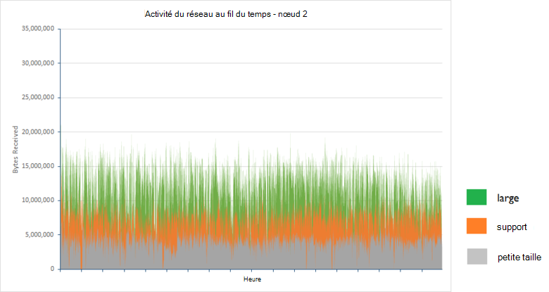

La taille moyenne en octets reçus par seconde pour le nœud 2 dans chaque configuration de cluster pendant la période de deux heures étaient les suivantes :

| Configuration de | Nombre moyen d’octets reçus/s |
|---------------|--------------------------------------|
| Petite taille         | 3993640.3                            |
| Support        | 7311689.9                            |
| Grande taille         | 11893874.2                           |

Les tests ont été effectués alors que le système était en cours d’exécution dans un **état stable**. Dans les situations où l’index rééquilibrage ou récupération de nœud se produit, les transmissions de données entre les nœuds contenant primaire et milieu des fragments réplica peuvent générer un trafic réseau significatif. Les effets de ce processus sont décrits plus dans le document [configuration résilience et récupération sur Elasticsearch sur Azure][].

### <a name="determining-limiting-factors-cpu-utilization"></a>Facteurs de détermination de limitation : utilisation de l’UC

Le taux auquel les demandes sont traitées est au moins partiellement régi par la capacité de traitement disponible. Elasticsearch accepte les demandes d’insertion en bloc sur le bloc insérer la file d’attente. Chaque nœud possède un ensemble de blocs de d’insérer des files d’attente déterminés par le nombre de processeurs disponibles. Par défaut, il existe une file d’attente pour chaque processeur et chaque file d’attente des demandes en attente jusqu'à 50 avant elles commencent à rejeter. 

Les applications doivent envoyer des demandes à un taux qui ne provoque pas les files d’attente à overspill. Le nombre d’éléments dans chaque file d’attente à la fois doit être une fonction du taux auquel les demandes sont envoyées par des applications clientes et de la vitesse à laquelle ces mêmes requêtes sont récupérées et traitées par Elasticsearch. Pour cette raison, une statistique importante capturé concerne le taux d’erreurs résumées dans le tableau suivant.

| Configuration de | Nombre total d’exemples | Nombre d’erreurs  | Taux d’erreur |
|---------------|---------------|--------------|------------|
| Petite taille         | 67057         | 0            | 0,00 %      |
| Support        | 123483        | 1            | 0.0008 %    |
| Grande taille         | 200702        | 3617         | 1,8 %      |

Chacune de ces erreurs a été provoqué par l’exception Java suivante :

```
org.elasticsearch.action.support.replication.TransportShardReplicationOperationAction$PrimaryPhase$1@75a30c1b]; ]
[219]: index [systembase], type [logs], id [AVEAioKb2TRSNcPa_8YG], message [RemoteTransportException[[esdatavm2][inet[/10.0.1.5:9300]][indices:data/write/bulk[s]]]; nested: EsRejectedExecutionException[rejected execution (queue capacity 50)
```

Augmenter le nombre de files d’attente et/ou de la longueur de chaque file d’attente peut réduire le nombre d’erreurs, mais cette approche peut uniquement gérer les pics de courte durée. Cette opération lors de l’exécution d’une série continue de tâches de réception de données retardera simplement le point auquel les erreurs commencer à se produire. En outre, cette modification ne s’amélioreront pas le débit et susceptibles de nuire le temps de réponse des applications clientes comme demandes seront mises en attente pour plus avant d’être traitées.

La structure d’index par défaut de 5 milieu des fragments avec résultats de (10 milieu des fragments dans toutes), 1 de réplica dans un modeste déséquilibre dans la charge entre les nœuds d’un cluster, deux nœuds contient trois milieu des fragments tandis que l’autre nœud contient quatre. Le nœud le plus occupé est probablement l’élément qui limite le débit le plus, c’est pourquoi ce nœud a été sélectionné dans chaque cas. 

L’ensemble des graphiques suivantes illustrent l’utilisation de l’UC pour le nœud le plus occupé dans chaque cluster.

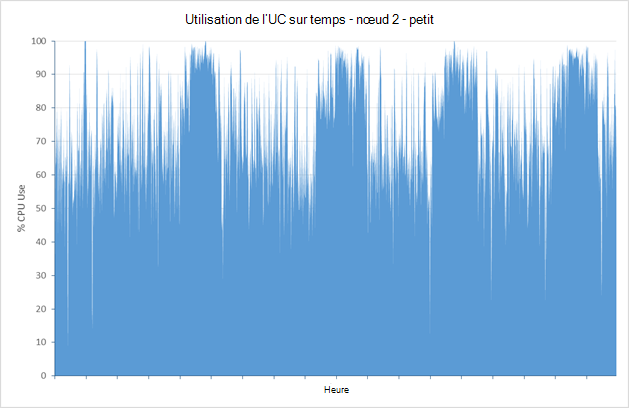

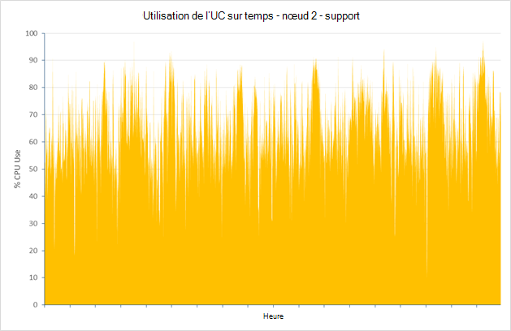

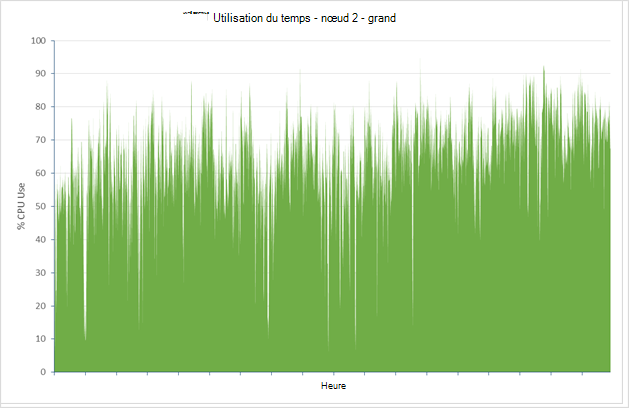

Pour les petites, moyennes et clusters de grande taille, l’utilisation processeur moyenne de ces nœuds a été 75.01 % 64.93 % et 64.64 %. Rarement est l’utilisation réellement atteint 100 %, et supprime de l’utilisation en tant que la taille des nœuds et l’augmentation de disponible la puissance UC disponible. Puissance de l’UC est donc peu probable qu’un facteur limitant les performances du cluster volumineux.

### <a name="determining-limiting-factors-memory"></a>Facteurs de détermination de limitation : mémoire

Utilisation de la mémoire est un autre aspect important qui peut influer sur les performances. Pour les essais, Elasticsearch a été alloué à 50 % de la mémoire disponible. Il s’agit en fonction [documentée des recommandations](https://www.elastic.co/guide/en/elasticsearch/guide/current/heap-sizing.html#_give_half_your_memory_to_lucene). Pendant que les tests sont en cours d’exécution, la JVM a été analysée pour l’activité de collection garbage excès (il s’agit d’une indication de manque de mémoire de tas). Dans tous les cas, la taille du tas a été stable et JVM présente l’activité de faible de garbage collection. La capture d’écran ci-dessous montre une capture instantanée de Marvel, mise en surbrillance de la clé de statistiques JVM pendant une courte période pendant l’exécution de l’essai sur le cluster de grande taille.

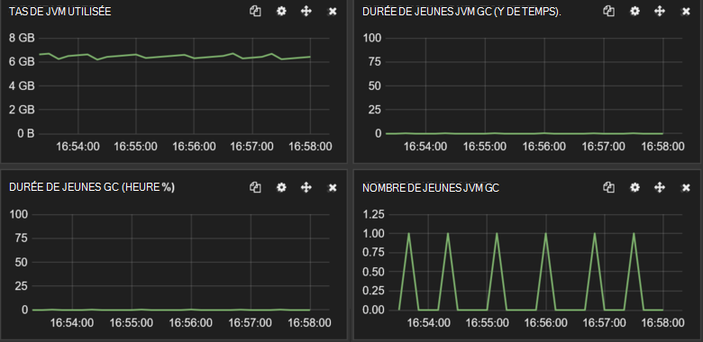

***JVM mémoire et le garbage collection l’activité sur le cluster de grande taille.***

### <a name="determining-limiting-factors-disk-io-rrates"></a>Facteurs de détermination de limitation : rRates d’e/s de disque

La fonctionnalité physique restante côté serveur qui peut limiter les performances est les performances du sous-système d’e/s disque. Le graphique ci-dessous compare l’activité du disque en termes d’octets écrit pour les nœuds les plus actifs dans chaque cluster.

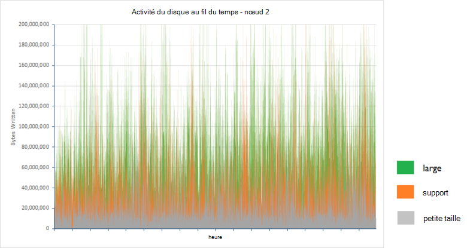 

Le tableau suivant indique la taille moyenne en octets écrits par seconde pour le nœud 2 dans chaque configuration de cluster pendant la période de deux heures :

| Configuration de | Nombre moyen d’octets écrits/s |
|---------------|-------------------------------------|
| Petite taille         | 25502361.94                         |
| Support        | 48856124.5                          |
| Grande taille         | 88137675.46                         |

Le volume de données écrites augmente avec le nombre de demandes traitées par un cluster, mais le taux d’e/s est dans les limites de stockage Azure (disques créés à l’aide du stockage Azure prend en charge un taux soutenu 10 s à 100 s de Mo/s, selon que le stockage Standard ou Premium est utilisé). Examinant le laps de temps passé à attendre les e/s disque permet d’expliquer pourquoi le débit du disque est largement inférieur au maximum théorique. Les graphiques et le tableau ci-dessous affichent ces statistiques pour les trois nœuds de mêmes :

> [AZURE.NOTE]Le délai d’attente de disque est mesuré en surveillant le pourcentage de temps processeur au cours de laquelle les processeurs sont bloqués en attente de la fin des opérations d’e/s.

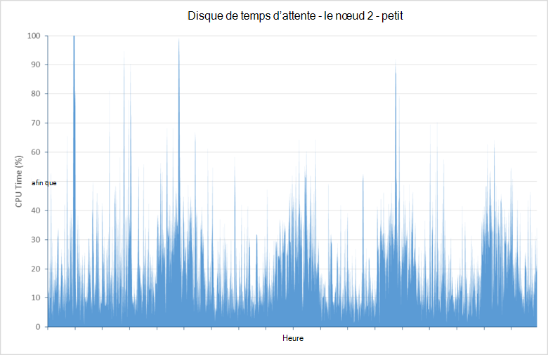

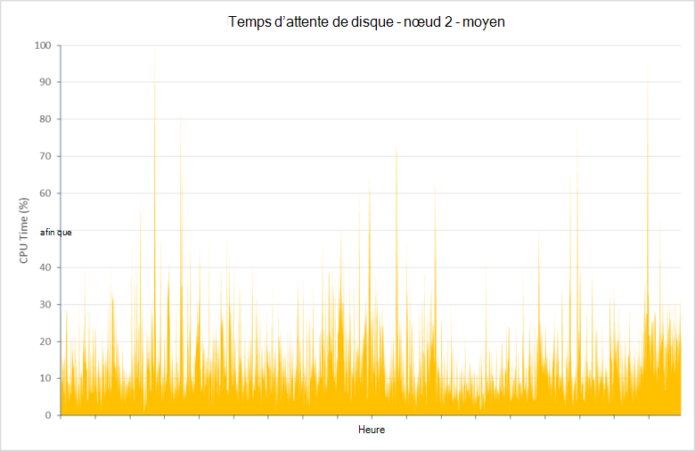

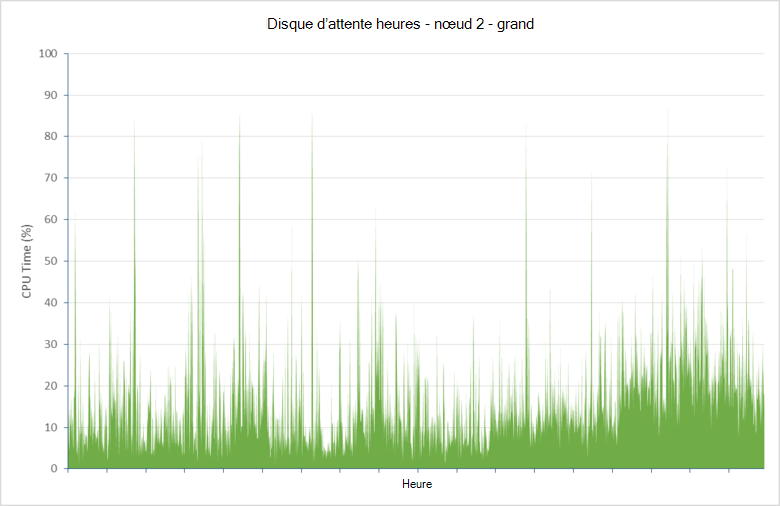

| Configuration de | Moyenne disque patienter le temps processeur (%) |
|---------------|--------------------------------|
| Petite taille         | 21.04                          |
| Support        | 14.48                          |
| Grande taille         | 15.84                          |

Ces données indiquent qu’une proportion importante de temps processeur (entre environ 16 % et 21 %) est passé à attendre l’e/s de disque terminer. Cela restreint la possibilité de Elasticsearch pour traiter les demandes et de stocker des données.

Au cours de la série de tests, le grand cluster inséré plus de **cinq cent millions de documents**. Autoriser le test à continuer a montré que délais d’attente ont considérablement augmenté lorsque la base de données contenue des documents de plus de six cent millions. Les raisons de ce comportement n’étaient pas entièrement étudiées, mais peut être disque en raison d’une fragmentation entraîne latence de disque en plus grand. 

Augmentation de la taille du cluster sur les autres nœuds peut-être vous aider à pallier les effets de ce comportement. Dans des cas extrêmes, il peut être nécessaire de défragmenter un disque qui est indiquant un délai d’e/s excessives. Toutefois, la défragmentation d’un disque de grande taille peut prendre un temps considérable (éventuellement plus de 48 heures pour un lecteur de disque dur virtuel de 2 To) et simplement reformater le disque et permettant de Elasticsearch récupérer les données manquantes à partir du milieu des fragments réplica peuvent être une approche plus économique.

### <a name="addressing-disk-latency-issues"></a>Résolution des problèmes de latence de disque

Les tests ont été effectués au départ d’à l’aide d’ordinateurs virtuels configurés avec des disques standard. Un disque standard est basé sur la rotation des supports et par conséquent est soumis à latence de rotation et autres goulots d’étranglement qui peuvent limiter les taux d’e/s. Azure fournit également un stockage de prime dans lequel les disques sont créés à l’aide de périphériques SSD. Ces périphériques n’ont aucune latence de rotation et par conséquent doivent fournir des vitesses d’e/s améliorées. 

Le tableau ci-dessous compare les résultats du remplacement de disques standard avec disques de prime dans le cluster de grande taille (ordinateurs virtuels D4 Standard dans le cluster de grande taille ont été remplacés par les ordinateurs virtuels Standard de DS4, le nombre de cœurs, mémoire et disques est identique dans les deux cas, la seule différence étant que les ordinateurs virtuels de DS4 utilisé SSDs).

| Configuration de    | Nombre d’échantillons | Temps de réponse moyen (ms) | Débit (opérations/s) |
|------------------|--------------|----------------------------|---------------------------|
| Grande - Standard | 197085       | 839                        | 27.4                      |
| Grande - Premium  | 255985       | 581                        | 35,6                      |

Temps de réponse ont été nettement meilleures, ce qui entraîne un débit moyen beaucoup plus proche à 4 x qui du petit cluster. Cela est plus conforme aux ressources disponibles sur un ordinateur virtuel Standard de DS4. Utilisation moyenne du CPU sur le nœud le plus occupé dans le cluster (nœud 1 dans ce cas) augmenté comme il passé moins de temps à attendre les e/s :

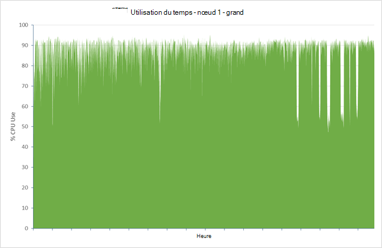

La réduction du temps d’attente du disque devient évidente lorsque vous considérez le graphique suivant, qui indique que le nœud le plus occupé cette statistique déposé à environ 1 % en moyenne :

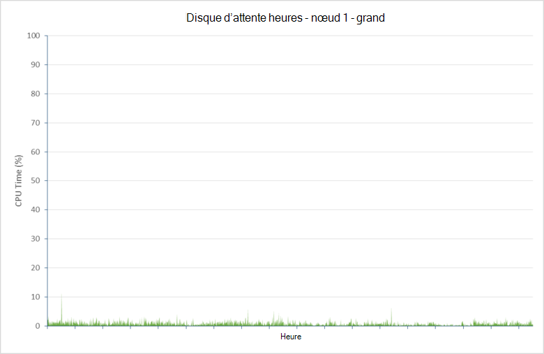

Il existe un prix à payer pour cette amélioration, toutefois. Le nombre d’erreurs de réception augmenté d’un facteur de 10 à 35797 (12,3 %). Encore une fois, la plupart de ces erreurs étaient le résultat de la plus grande partie insérer le débordement de la file d’attente. Étant donné que le matériel semble s’exécuter presque, il peut être nécessaire d’ajouter plus de nœuds ou de retenir le taux d’insertions en bloc afin de réduire le volume des erreurs. Ces problèmes sont abordés plus loin dans ce document.

### <a name="testing-with-ephemeral-storage"></a>Tests de stockage éphémère

Les mêmes tests ont été répétés sur un cluster de machines virtuelles de D4 à l’aide de stockage éphémère. Sur les ordinateurs virtuels D4, stockage éphémère est implémenté sous la forme d’un seul 400 Go SSD. Le nombre d’échantillons de traitement, temps de réponse et le débit est tous très similaire aux chiffres concernant le cluster basé sur VMs de DS14 avec le stockage de la prime.

| Configuration de                     | Nombre d’échantillons | Temps de réponse moyen (ms) | Débit (opérations/s) |
|-----------------------------------|--------------|----------------------------|---------------------------|
| Grande - Premium                   | 255985       | 581                        | 35,6                      |
| Grand – Standard (disque éphémère) | 255626       | 585                        | 35,5                      |

Le taux d’erreur a été également similaires (33862 échecs de 289488 demandes au total – 11,7 %).

Les graphiques suivant indiquent l’utilisation du processeur et les statistiques pour le nœud le plus occupé dans le cluster (nœud 2 cette fois-ci) d’attente de disque :

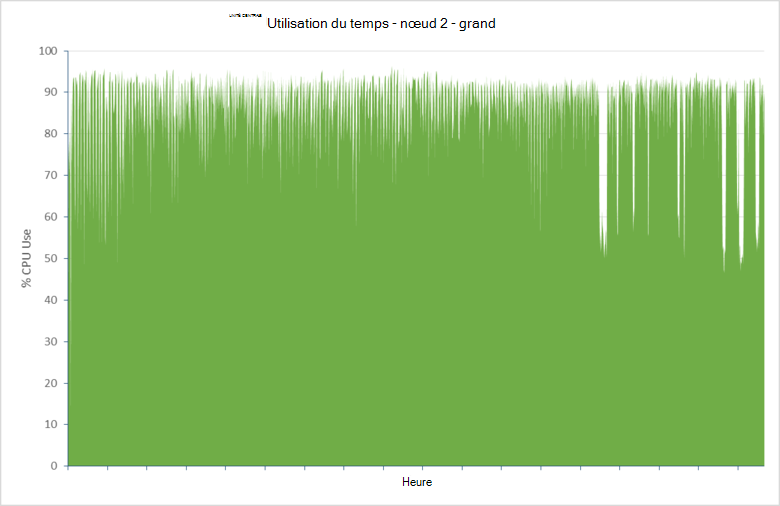

! [] (media/guidance-elasticsearch/data-ingestion-image13.png

Dans ce cas, en termes de performances uniquement, éphémère de stockage peut être considéré comme une solution plus économique que l’utilisation du stockage de la prime.

### <a name="data-ingestion-performance--windows-server-2012"></a>Performances de réception de données – Windows Server 2012

Les mêmes tests ont été répétés à l’aide d’un ensemble de clusters de Elasticsearch avec des nœuds exécutant Windows Server 2012. L’objectif de ces tests était d’établir les effets, le cas échéant, le choix du système d’exploitation peut avoir sur les performances du cluster.

Pour illustrer l’évolutivité de Elasticsearch sous Windows, le tableau suivant indique les heures de débit et de la réponse obtenus pour les petites, moyennes et les configurations de clusters de grande taille. Notez que ces tests ont été réalisés avec Elasticsearch configuré pour utiliser le stockage éphémère de SSD, comme les tests avec Ubuntu avaient montré que la latence de disque était susceptible d’être un facteur essentiel pour atteindre des performances maximales :

| Configuration de | Nombre d’échantillons | Temps de réponse moyen (ms) | Débit (opérations/s) |
|---------------|--------------|----------------------------|---------------------------|
| Petite taille         | 90295        | 476                        | 12.5                      |
| Support        | 169243       | 508                        | 23,5                      |
| Grande taille         | 257115       | 613                        | 35,6                      |

Ces résultats indiquent comment Elasticsearch met à l’échelle avec la taille de mémoire virtuelle et les ressources disponibles sur Windows.

Le tableau suivant compare les résultats pour le cluster de grande taille sous Ubuntu et Windows :

| Système d'exploitation | Nombre d’échantillons | Temps de réponse moyen (ms) | Débit (opérations/s) | Taux d’erreurs (%) |
|------------------|--------------|----------------------------|---------------------------|----------------|
| Ubuntu           | 255626       | 585                        | 35,5                      | 11.7           |
| Windows          | 257115       | 613                        | 35,6                      | 7.2            |

Le débit est cohérent avec celui de grands clusters Ubuntu, bien que le délai de réponse a été légèrement plus élevé. Cela peut être pris en compte par le faible taux d’erreur (les erreurs sont signalées plus rapidement que les opérations réussies, donc un temps de réponse inférieur).

L’utilisation de l’UC signalée par les outils de surveillance de Windows a été très légèrement plus élevée que ceux d’Ubuntu. Toutefois, vous devez considérer les comparaisons directes des mesures telles que celles-ci sur les systèmes d’exploitation avec une extrême prudence à la manière dont les systèmes d’exploitation différents signaler ces statistiques. En outre, des informations sur la latence de disque en termes de processeur temps d’attente d’e/s ne sont pas disponibles de la même manière pour Ubuntu. Le point important est que l’utilisation du processeur était élevé, indiquant que temps passé à attendre les e/s a été faible :

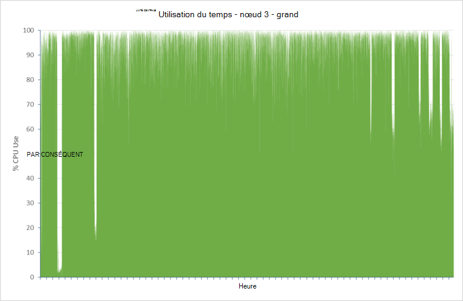

### <a name="scaling-up-conclusions"></a>L’évolution verticale : conclusions

Elasticsearch des performances d’un cluster correctement réglé sont susceptible d’être équivalent sous Windows et Ubuntu, et qu’il jusqu'à dans un modèle similaire sur les deux systèmes d’exploitation. Pour de meilleures performances, **Utilisez le stockage de prime afin de stocker les données de Elasticsearch**.

## <a name="scaling-out-clusters-to-support-large-scale-data-ingestion"></a>Mise à l’échelle des clusters pour prendre en charge la réception de données à grande échelle

L’évolution horizontale est l’approche complémentaire pour la mise à l’échelle enquête dans la section précédente. Une fonctionnalité importante de Elasticsearch est l’évolutivité horizontale inhérente intégrée dans le logiciel. Augmentation de la taille d’un cluster est simplement d’ajouter plus de nœuds. Vous n’avez pas besoin d’effectuer aucune opération manuelle pour redistribuer les index ou milieu des fragments en tant que ces tâches sont traitées automatiquement, bien qu’il existe un certain nombre d’options de configuration que vous pouvez utiliser pour influencer ce processus. 

Ajout de plusieurs nœuds permet d’améliorer les performances en répartissant la charge entre plusieurs machines. Lorsque vous ajoutez plus de nœuds, vous devez également prendre en compte la réindexation des données pour augmenter le nombre de milieu des fragments disponibles. Vous pouvez préempter ce processus dans une certaine mesure par la création d’index qui ont le milieu des fragments plus qu’il ont a initialement les nœuds disponibles. Lorsque les autres nœuds sont ajoutés, au milieu des fragments peuvent être distribués.

En plus de tirer parti de l’évolutivité horizontale de Elasticsearch, il y a autres raisons pour l’implémentation d’index qui ont plusieurs milieu des fragments de nœuds. Chaque partagé est implémenté sous la forme d’une structure de données séparée (un index [Lucene](https://lucene.apache.org/) ) et dispose de ses propres mécanismes internes pour maintenir la cohérence et la gestion d’accès concurrentiel. Création de plusieurs milieu des fragments permet d’accroître le parallélisme au sein d’un nœud et peut améliorer les performances. 

Cependant, maintenir les performances lors de la mise à l’échelle est un acte d’équilibrage. Les autres nœuds et milieu un cluster contient des fragments, plus l’effort est requis pour synchroniser le travail effectué par le cluster, ce qui peut réduire le débit. Pour les charges de travail donnée, il existe une configuration optimale qui optimise les performances de réception tout en réduisant les coûts de maintenance. Cette configuration est très dépendante de la nature de la charge de travail et du cluster ; plus précisément, le volume, la taille et le contenu des documents, la fréquence à laquelle la réception a lieu et le matériel sur lequel s’exécute le système.  

Cette section résume les résultats des enquêtes portant sur le dimensionnement des clusters destinées à soutenir la charge de travail utilisée par les tests de performances décrits précédemment. Le même test a été effectué sur les clusters avec des machines virtuelles basées sur la grande VM taille (D4 Standard avec 8 cœurs de processeur, les disques de 16 données et 28 Go de RAM) en cours d’exécution Ubuntu Linux 14.0.4, mais configuré avec différents nombres de nœuds et le milieu des fragments. Les résultats ne sont pas censés être définitif qu’ils s’appliquent uniquement à un scénario spécifique, mais ils peuvent agir comme un bon point de départ pour vous aider à analyser l’évolutivité horizontale de vos clusters et génèrent des nombres pour le rapport optimal du milieu des fragments de nœuds répondant le mieux à vos besoins.

### <a name="baseline-results--3-nodes"></a>Résultats de référence – 3 nœuds

Pour obtenir une illustration de la planification, le test de performances de réception de données a été exécuté sur un cluster à 3 nœuds avec 5 milieu des fragments et 1 réplica. Il s’agit de la configuration par défaut pour un index Elasticsearch. Dans cette configuration, Elasticsearch distribue 2 principales milieu des fragments à 2 nœuds, et le reste partagé principal est stocké sur le troisième nœud. Le tableau ci-dessous résume le débit en termes d’opérations d’acquisition en bloc par seconde et le nombre de documents qui ont été enregistrées avec succès par le test.

> [AZURE.NOTE] Dans les tableaux qui suivent dans cette section, la distribution du principal au milieu des fragments est présentée sous la forme d’un nombre pour chaque nœud séparé par des tirets. Par exemple, la mise en page du nœud 3 5-partagé est décrite en tant que 1-2-2. La disposition du milieu des fragments réplica n’est pas incluse. Ils suivent un modèle similaire au principal au milieu des fragments.

| Configuration de | Nombre de documents | Débit (opérations/s)   | Disposition de partagé |
|---------------|----------------|-----------------------------|--------------|
| 5 milieu des fragments      | 200560412      | 27.86                       | 2-2-1        |

### <a name="6-node-results"></a>6-nœud résultats

L’essai a été exécuté sur un cluster de noeud de 6. L’objectif de ces tests était pour essayer de déterminer plus précisément les effets de stockage partagé plus d’une sur un nœud.

| Configuration de | Nombre de documents | Débit (opérations/s)   | Disposition de partagé |
|---------------|----------------|-----------------------------|--------------|
| 4 milieu des fragments      | 227360412      | 31.58                       | 1-1-0-1-1-0  |
| 7 milieu des fragments      | 268013252      | 37.22                       | 2-1-1-1-1-1  |
| 10 milieu des fragments     | 258065854      | 35.84                       | 1-2-2-2-1-2  |
| 11 milieu des fragments     | 279788157      | 38.86                       | 2-2-2-1-2-2  |
| 12 milieu des fragments     | 257628504      | 35.78                       | 2-2-2-2-2-2  |
| 13 milieu des fragments     | 300126822      | 41.68                       | 2-2-2-2-2-3  |

Ces résultats apparaissent pour indiquer les tendances suivantes :

* Milieu des fragments plus par nœud améliore le débit. Avec un petit nombre de milieu des fragments par nœud créé pour ces tests, ce phénomène a été prévu, pour les raisons décrites plus haut.

* Un nombre impair de milieu des fragments offre des performances supérieures à celles d’un nombre pair. Les raisons pour ce sont moins clair, mais elle *peut* être que Elasticsearch utilise l’algorithme de routage peut mieux répartir les données sur le milieu des fragments, dans ce cas, conduisant à une charge plus régulier par nœud.

Pour tester ces hypothèses, plusieurs des tests supplémentaires ont été effectuées avec le plus grand nombre de milieu des fragments. Sur avis du Elasticsearch, il a été décidé d’utiliser un nombre premier de milieu des fragments pour chaque test comme elles donnent une répartition raisonnable des nombres impairs de la plage en question.

| Configuration de | Nombre de documents | Débit (opérations/s)   | Disposition de partagé      |
|---------------|----------------|-----------------------------|-------------------|
| 23 milieu des fragments     | 312844185      | 43.45                       | 4-4-4-3-4-4       |
| milieu des 31 fragments     | 309930777      | 43.05                       | 5-5-5-5-6-5       |
| 43 milieu des fragments     | 316357076      | 43.94                       | 8-7-7-7-7-7       |
| milieu des 61 fragments     | 305072556      | 42.37                       | 10-11-10-10-10-10 |
| milieu des 91 fragments     | 291073519      | 40.43                       | 15-15-16-15-15-15 |
| milieu des 119 fragments    | 273596325      | 38.00                       | 20-20-20-20-20-19 |

Ces résultats suggéré qu’un point de basculement a été atteint au milieu des fragments environ 23. Après ce point, l’augmentation du nombre du milieu des fragments a provoqué une légère augmentation des performances (le débit de 43 milieu des fragments est peut-être une anomalie).

### <a name="9-node-results"></a>9-nœud résultats

Les tests ont été répétés à l’aide d’un cluster de 9 nœuds, en utilisant un nombre premier de milieu des fragments.

| Configuration de | Nombre de documents | Débit (opérations/s)   | Disposition de partagé               |
|---------------|----------------|-----------------------------|----------------------------|
| milieu des 17 fragments     | 325165364      | 45.16                       | 2-2-2-2-2-2-2-2-1          |
| 19 milieu des fragments     | 331272619      | 46.01                       | 2-2-2-2-2-2-2-2-3          |
| milieu des 29 fragments     | 349682551      | 48.57                       | 3-3-3-4-3-3-3-4-3          |
| milieu des 37 fragments     | 352764546      | 49,00                       | 4-4-4-4-4-4-4-4-5          |
| milieu des 47 fragments     | 343684074      | 47.73                       | 5-5-5-6-5-5-5-6-5          |
| milieu des 89 fragments     | 336248667      | 46.70                       | 10-10-10-10-10-10-10-10-9  |
| 181 milieu des fragments    | 297919131      | 41.38                       | 20-20-20-20-20-20-20-20-21 |

Ces résultats ont montré un modèle similaire, avec un point de basculement environ 37 milieu des fragments.

### <a name="scaling-out-conclusions"></a>L’évolution horizontale : conclusions

À l’aide d’une extrapolation de pétrole brute, les résultats des tests 6 et 9-noeuds indiqué que, dans ce scénario spécifique, le nombre idéal de milieu des fragments pour optimiser les performances était 4n +/-1, où n est le nombre de nœuds. Ce *peut* être une fonction du nombre de threads d’insertion en bloc disponibles, qui à son tour dépend le nombre de cœurs de processeur, le raisonnement est comme suit (voir [Modèles de Multidocument](https://www.elastic.co/guide/en/elasticsearch/guide/current/distrib-multi-doc.html#distrib-multi-doc) ) :

- Chaque demande d’insertion en bloc envoyé par l’application cliente est reçu par un nœud de données unique.

- Le nœud de données génère une nouvelle demande d’insertion en bloc pour chaque principal partagé affecté par la demande d’origine et les transfère vers les autres nœuds, en parallèle.

- Chaque partagé principal est écrit, une autre demande est envoyée à chaque réplica pour ce partagé. Le principal partagé attend la demande envoyée au réplica soit terminée avant de terminer.

Par défaut, Elasticsearch crée un thread d’insertion en bloc pour chaque noyau processeur disponible dans une machine virtuelle. Pour les ordinateurs virtuels D4 utilisé par ce test, chaque UC contenus 8 cœurs, afin que l’insertion en bloc 8 threads ont été créés. L’index utilisé fractionnés de 4 (dans un cas 5) principales milieu des fragments sur chaque nœud, mais ont également été 4 (5) les duplications sur chaque nœud. Insertion de données dans ces réplicas et le milieu des fragments, jusqu'à 8 threads sur chaque nœud par demande, correspond au nombre disponible peut consommer. Augmentant ou en diminuant le nombre de milieu des fragments risque de thread manque d’efficacité que les threads sont probablement laissés libres ou de demandes sont en attente. Toutefois, sans une expérimentation supplémentaire, c’est juste une théorie et il n’est pas possible d’être définitif.

Les tests illustré également un autre point important. Dans ce scénario, l’augmentation du nombre de nœuds peut améliorer le débit de réception de données, mais les résultats n’évoluent pas linéairement nécessairement. Conduite des tests supplémentaires avec les clusters de nœuds 12 et 15 a pu afficher le point à la mise à l’échelle offre peu d’avantages supplémentaire. Si ce nombre de nœuds fournit un espace de stockage insuffisant, il peut être nécessaire de revenir à l’échelle de la stratégie et de commencer à utiliser des disques plus ou supérieure basées sur le stockage de la prime.

> [AZURE.IMPORTANT] Ne prennent pas le ratio 4n +/-1 sous la forme d’une formule magique qui fonctionnera toujours pour chaque cluster. Si vous avez moins ou plusieurs coeurs de processeur disponibles, la configuration optimale partagé peut être différente. Les résultats étaient basés sur une charge de travail spécifique uniquement a réception de données. Pour les charges de travail qui comprennent également des requêtes et des agrégations, les résultats pouvaient être très divers.

> En outre, la charge de travail de réception de données utilisait un seul index. Dans de nombreux cas, les données sont susceptibles d’être répartis sur plusieurs index menant à différents modèles ou utilisation des ressources.

> Le point important de cet exercice est de comprendre la méthode utilisée plutôt que les résultats obtenus. Vous devez savoir pour effectuer votre propre évaluation de l’évolutivité en fonction de vos charges de travail pour obtenir des informations qui s’applique le mieux à votre propre scénario.

## <a name="tuning-large-scale-data-ingestion"></a>Réglage de la réception de données à grande échelle

Elasticsearch est hautement configurable, avec de nombreux commutateurs et paramètres que vous pouvez utiliser pour optimiser les performances pour les scénarios et cas d’utilisation spécifiques. Cette section décrit quelques exemples. N’oubliez pas que la flexibilité Elasticsearch fournit à cet égard est fourni avec un message d’avertissement, il est très facile de detune Elasticsearch et rendre pire encore les performances. Lors du réglage, uniquement effectuer une modification à la fois et toujours en mesurer les effets de toutes les modifications pour vous assurer qu’ils ne nuisent pas à votre système.

### <a name="optimizing-resources-for-indexing-operations"></a>Optimisation des ressources pour les opérations d’indexation

La liste suivante décrit certains points à étudier quand un cluster Elasticsearch pour prendre en charge la réception de données à grande échelle de réglage. Les deux premiers éléments sont plus susceptibles d’avoir un effet tout de suite évident sur les performances pendant que les autres sont plus marginal, en fonction de la charge de travail :

*  Nouveaux documents ajoutés à un index sont uniquement visibles dans les recherches lors de l’actualisation de l’index. L’actualisation d’un index est une opération coûteuse, il est uniquement exécutée périodiquement au lieu que chaque document est créé. L’intervalle d’actualisation par défaut est de 1 seconde. Si vous effectuez des opérations en bloc, vous devez envisager de désactiver temporairement les actualisations de l’index. Définissez l’index *Actualiser\_intervalle* -1.

    ```http
    PUT /my_busy_index
    {
        "settings" : {
            "refresh_interval": -1
        }
    }
    ```

    Déclencher l’actualisation manuellement à l’aide de la [* \_actualiser*](https://www.elastic.co/guide/en/elasticsearch/reference/current/indices-refresh.html) API à la fin de l’opération afin de les rendre visibles. Pour plus d’informations, reportez-vous à la section [Utilisation de l’indexation en bloc](https://www.elastic.co/guide/en/elasticsearch/reference/current/indices-update-settings.html#bulk) . Plus d’informations sur l' [impact de la modification de l’intervalle d’actualisation sur la réception de données](#the-impact-of-changing-the-index-refresh-interval-on-data-ingestion-performance) sont décrites plus loin.

* Si un index est répliqué, chacun l’indexation d’opération (document créer, mettre à jour ou suppression) est répétée sur les milieu des fragments réplica qu’ils se produisent dans le partagé principal. Envisager la désactivation de la réplication pendant les opérations d’importation en bloc et ensuite de le réactiver une fois l’importation terminée :

    ```http
    PUT /my_busy_index
    {
        "settings" : {
            "number_of_replicas": 0
        }
    }
    ```

    Lorsque vous réactivez la réplication, Elasticsearch effectue un transfert d’octet-réseau de données de l’index de chaque réplica. Cela est plus efficace que de répéter le processus d’indexation document par document sur chaque nœud. Le risque est que les données peuvent être perdues de l’échec du nœud principal lors de l’importation en bloc, mais puissent être simplement une question de commencer l’importation à nouveau. L' [impact de la réplication sur les performances d’acquisition de données](#the-impact-of-replicas-on-data-ingestion-performance) est décrite plus en détail ultérieurement.

* Elasticsearch essaie d’équilibrer les ressources disponibles entre ceux requis pour l’interrogation et ceux requis pour traiter les données. En conséquence, il peut limiter les performances de réception des données (régulation événements sont enregistrés dans le journal Elasticsearch). Cette restriction a pour but d’empêcher un grand nombre de segments de l’index d’être créées simultanément nécessitant la fusion et l’enregistrement sur disque, un processus qui peut monopoliser les ressources. Si votre système ne fonctionne pas actuellement des requêtes, vous pouvez désactiver la limitation de réception de données. Cela devrait permettre d’indexation optimiser les performances. Vous pouvez désactiver la limitation de l’ensemble d’un cluster comme suit :

    ```http
    PUT /_cluster/settings
    {
        "transient" : {
            "indices.store.throttle.type": "none"
        }
    }
    ```

    Définir le type de limitation du cluster à *« fusion »* lors de la réception est terminée. Également Notez que la désactivation de la limitation peut entraîner une instabilité dans le cluster, assurez-vous que vous disposez des procédures en place qui peut récupérer le cluster si nécessaire.

* Elasticsearch réserve une partie de la mémoire de tas pour les opérations d’indexation, le reste est principalement utilisé par les requêtes et recherches. L’objectif de ces tampons est de réduire le nombre d’opérations d’e/s disque, dans le but d’effectuer des écritures de moins nombreuses et plus grandes que les écritures plus petites. La proportion de la valeur par défaut de segment de mémoire allouée est de 10 %. Si vous indexez un volume important de données de cette valeur peut être insuffisante. Pour les systèmes qui prennent en charge la réception de l’important volume de données, vous devez autoriser jusqu'à 512 Mo de mémoire pour chaque actif partagé dans le nœud. Par exemple, si vous exécutez Elasticsearch sur les machines virtuelles de D4 (28 Go de RAM) et que vous avez alloué de 50 % de la mémoire disponible pour la machine virtuelle Java (14 Go), puis de 1,4 Go sera disponible pour une utilisation par les opérations d’indexation. Si un nœud contient 3 actives milieu des fragments, cette configuration est probablement suffisante. Toutefois, si un nœud contient le milieu des fragments plus que cela, envisagez d’augmenter la valeur de la *indices.memory.index\_tampon\_taille* paramètre dans le fichier de configuration elasticsearch.yml. Pour plus d’informations, consultez [Considérations sur les performances de l’indexation de Elasticsearch](https://www.elastic.co/blog/performance-considerations-elasticsearch-indexing).

    Allouer plus de 512 Mo par partagé active probablement pas améliorera les performances d’indexation et peut en fait être préjudiciable que moins de mémoire est disponible pour effectuer d’autres tâches. Sachez également qu’allouer plus d’espace de segment de mémoire pour les tampons d’index supprime la mémoire pour d’autres opérations telles que la recherche et l’agrégation des données et peut ralentir les performances des opérations de requête.

* Elasticsearch limite le nombre de threads (la valeur par défaut est 8) qui peut effectuer simultanément des opérations d’indexation dans un partagé. Si un nœud ne contient qu’un petit nombre de milieu des fragments, puis augmentez la *index\_accès concurrentiel* définition d’un index qui est soumis à un grand nombre d’opérations d’indexation ou qui est la cible d’une insertion en bloc, comme suit :

    ```http
    PUT /my_busy_index
    {
        "settings" : {
            "index_concurrency": 20
        }
    }
    ```

* Si vous effectuez un grand nombre d’opérations d’indexation en masse pour une courte période de temps, vous pouvez augmenter le nombre de threads *en vrac* et des *index* disponibles dans le pool de threads et augmenter la taille de la file d’attente *Insertion en bloc* pour chaque nœud. Cela permettra à davantage de demandes en file d’attente au lieu d’être ignorés. Pour plus d’informations, reportez-vous à la section [Du Pool de threads](https://www.elastic.co/guide/en/elasticsearch/reference/current/modules-threadpool.html). Si vous effectuez soutenue des niveaux élevés d’acquisition de données, puis augmenter le nombre de threads en bloc n’est pas recommandée. Au lieu de cela créer des noeuds supplémentaires et ont permet de distribuer la charge de l’indexation sur ces nœuds. Sinon, pensez à un envoi en série des lots d’insertion en bloc plutôt que d’en parallèle comme il agira comme un mécanisme de limitation physique qui permet de réduire les risques d’erreurs en raison d’un bloc insérer débordement de la file d’attente.

### <a name="the-impact-of-changing-the-index-refresh-interval-on-data-ingestion-performance"></a>Intervalle sur les performances d’acquisition de données d’actualisation de l’impact de la modification de l’index

L’intervalle d’actualisation régit la fréquence à laquelle les données ingérées sont visibles pour les requêtes et les agrégations, mais les mises à jour fréquentes peuvent avoir un impact sur les performances des opérations de réception de données. L’intervalle d’actualisation par défaut est de 1 seconde. Vous pouvez désactiver l’actualisation complètement, mais cela peut ne pas convenir à votre charge de travail. Vous pouvez faire des essais en essayer différents intervalles et l’établissement de la zone de confort qui équilibre les performances de réception et la nécessité de présenter des informations à jour.

Un exemple de l’impact, le test de performances de réception de données a été répété sur un cluster Elasticsearch consistant à 7 milieu des fragments répartis sur les nœuds de 3 données. L’index a un seul réplica. Chaque nœud a été basé sur une machine virtuelle de D4 (28 Go de RAM, 8 cœurs de processeur) à l’aide de secours SSD de stockage éphémère pour contenir les données. Chaque test s’est exécuté pendant 1 heure.

Dans ce test, le taux de rafraîchissement a été défini à la valeur par défaut de 1 seconde. Le tableau suivant indique les heures de débit et de réponse pour ce test par rapport à une exécution distincte où le taux de rafraîchissement a été réduit à une fois toutes les 30 secondes.

| Taux de rafraîchissement | Nombre d’échantillons | Temps de réponse moyen – opérations réussies (ms) | Débit – opérations réussies (opérations/s) |
|--------------|--------------|----------------------------------------------------|---------------------------------------------------|
| 1 seconde     | 93755        | 460                                                | 26.0                                              |
| 30 secondes   | 117758       | 365                                                | 32,7                                              |

Dans ce test, suppression de la fréquence d’actualisation a entraîné une amélioration de 18 % du débit et une réduction des temps de réponse moyen 21 %. Les graphiques suivants générés à l’aide de Marvel illustrent la raison principale de cette différence. Les figures ci-dessous illustrent l’activité de fusion d’index qui s’est produite avec l’intervalle d’actualisation défini à 1 seconde et 30 secondes. 

Fusionne des index est effectuées pour éviter que le nombre de segments de l’index en mémoire de devenir trop nombreux. Une seconde de 1 intervalle d’actualisation génère un grand nombre de petits segments qui doivent être fusionnés fréquemment, que l’intervalle d’actualisation de 30 secondes génère moins de grands segments qui peuvent être fusionnées de façon plus optimale.

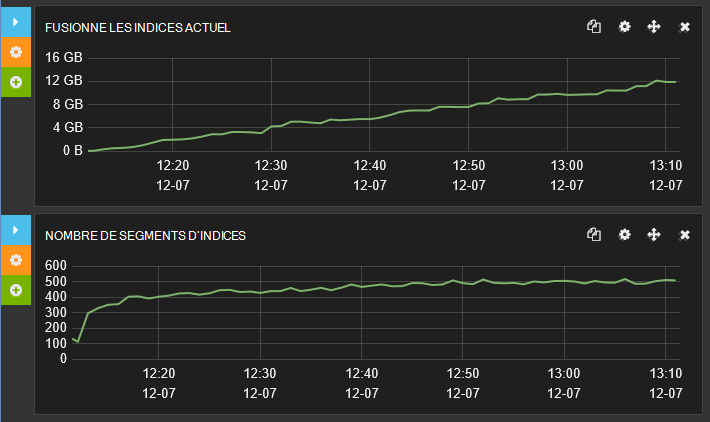

***Activité de fusion d’index pour une fréquence de rafraîchissement d’index de 1 seconde***

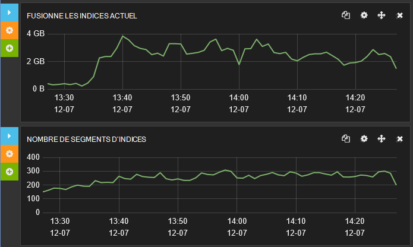

***Activité de fusion d’index pour une index d’actualisation de 30 secondes***

### <a name="the-impact-of-replicas-on-data-ingestion-performance"></a>L’impact des réplicas sur les performances de réception de données

Les réplicas sont une fonctionnalité essentielle d’un cluster robuste et sans leur utilisation vous risquez de perdre des informations en cas de défaillance d’un nœud. Toutefois, les réplicas augmentent la quantité de disque et de réseau d’e/s en cours d’exécution et peuvent être préjudiciables à la fréquence à laquelle les données sont intégrées. Pour les raisons décrites plus haut, il peut être avantageux de désactiver temporairement les réplicas pendant toute la durée des opérations de téléchargement de données à grande échelle.

Les tests de performances de réception de données ont été répétées à l’aide de trois configurations :

* Utilisation d’un cluster avec aucun réplica.

* Utilisation d’un cluster avec le 1 réplica.

* Utilisation d’un cluster avec des 2 réplicas.

Dans tous les cas, le cluster contenue 7 milieu des fragments réparties sur 3 nœuds et exécuté sur les ordinateurs virtuels configurés comme indiqué dans le précédent jeu de tests. L’index de test utilisé un intervalle d’actualisation de 30 secondes.

Le tableau suivant résume le temps de réponse et le débit de chaque test pour la comparaison :

| Configuration de | Nombre d’échantillons | Temps de réponse moyen – opérations réussies (ms) | Débit – opérations réussies (opérations/s) | Erreurs de réception de données |
|---------------|--------------|----------------------------------------------------|---------------------------------------------------|--------------------------|
| réplicas 0    | 215451       | 200                                                | 59.8                                              | 0                        |
| 1 réplica     | 117758       | 365                                                | 32,7                                              | 0                        |
| 2 réplicas    | 94218        | 453                                                | 26.1                                              | 194262                   |


La baisse des performances lorsque le nombre de duplications augmente est claire, mais vous convient également de noter le grand nombre d’erreurs de réception de données dans le troisième essai. Les messages générés par ces erreurs indiqué qu’elles étaient en raison du débordement de file d’attente insertion en bloc à l’origine à rejeter les demandes. Ces rejets s’est produit très rapidement, c’est pourquoi le nombre est élevé.

> [AZURE.NOTE] Les résultats de l’essai en troisième Insistez sur l’importance de l’utilisation d’une stratégie de reprise intelligente lorsque se produisent des erreurs transitoires telles que celle-ci : hors tension pendant une courte période afin de permettre la file d’attente d’insertion en bloc décharger avant de retenter l’essentiel de Répéter opération d’insertion.

Les jeux suivant de graphes de comparent les temps de réponse au cours des tests. Dans chaque cas, que le premier graphique affiche les temps de réponse global, tandis que la deuxième graphique effectue un zoom avant sur les temps de réponse pour les opérations plus rapides (Notez que l’échelle du premier graphique est dix fois celle de la seconde). Vous pouvez voir comment le profil de temps de la réponse varie entre les trois tests.

Avec aucune de répliques, la plupart des opérations a pris entre 75ms et 750ms, avec la réponse rapide heures environ 25 ms :

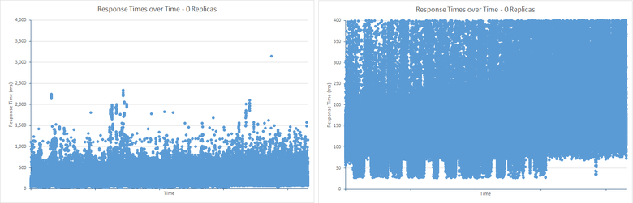

Avec 1 réplica le temps de réponse opérationnelle plus rempli lors de la plage 125ms à 1250ms. Les réponses le plus rapide pris environ 75ms, bien qu’il n’y en avait un nombre restreint de ces réponses rapides que dans le cas de réplicas 0. Il existait également beaucoup plus les réponses qui a duré plus longtemps que les scénarios les plus courants, plus de 1250ms :

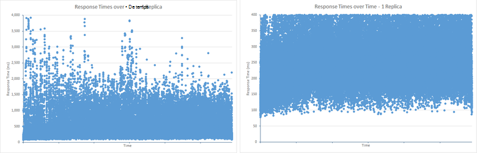

Avec 2 réplicas, la plage de temps de réponse plus remplie a 200 ms à 1500ms, mais se sont beaucoup moins de résultats sous la plage minimale que dans l’essai 1 réplica. Toutefois, le modèle de résultats au-dessus de la limite supérieure ont été très similaire à celle de l’essai 1 réplica. Cela est probablement en raison des effets de la file d’insertion en bloc débordement (excédant une longueur de file d’attente de 50 demandes). Le travail supplémentaire nécessaire pour mettre à jour les 2 réplicas entraîne la plus fréquemment, de dépassement de capacité de la file d’attente empêchent le fonctionnement d’ingestion d’avoir le temps de réponse excessifs. Les opérations sont rejetées rapidement plutôt que prendre une longue période de temps, éventuellement à l’origine des exceptions de dépassement de délai ou d’impact sur le temps de réponse des applications clientes (c’est le but du mécanisme de file d’attente d’insertion en bloc) :


Marvel, vous pouvez voir l’effet du nombre de réplicas sur la file d’attente des index en bloc. La figure ci-dessous illustre les données à partir de Marvel qui décrit comment l’essentiel insérer pleine pendant le test. La longueur moyenne de file d’attente s’élevait à environ 40 demandes, mais les pics d’activité périodiques dû à un dépassement de capacité et les demandes ont été rejetées en conséquence :

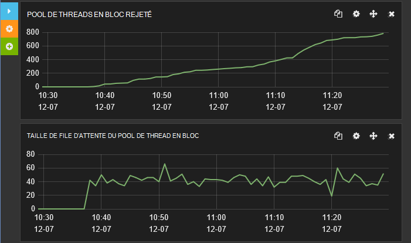

***Taille de file d’attente en bloc de l’index et le nombre de demandes rejetées avec 2 réplicas.***

Vous devez comparer cela à la figure ci-dessous affiche les résultats pour un seul réplica. Le moteur de Elasticsearch n’est pas en mesure de traiter les requêtes suffisamment rapidement pour conserver une longueur moyenne de file d’attente à environ 25, et en aucun point la longueur de la file d’attente dépasse 50 requêtes donc pas de travail a été rejetée.

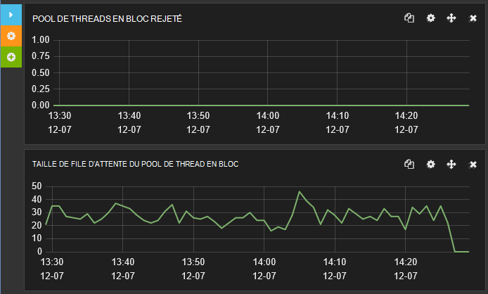

***Taille de file d’attente de l’index et le nombre de demandes rejetées avec 1 réplica en vrac.***

## <a name="best-practices-for-clients-sending-data-to-elasticsearch"></a>Méthodes conseillées pour les clients qui envoient des données à Elasticsearch

De nombreux aspects des performances sont concernés, non seulement en interne dans le système, mais avec la façon dont le système est utilisé par les applications clientes. Elasticsearch fournit de nombreuses fonctionnalités qui peuvent être utilisées par le processus d’acquisition de données ; génération d’identificateurs uniques pour les documents, l’analyse de documents et même à l’aide de scripts pour transformer les données qu’il est stocké sont quelques exemples. Toutefois, ces fonctions que contribuent à la charge sur le moteur d’Elasticsearch et dans de nombreux cas peuvent être effectuées plus efficacement par les applications clientes avant la transmission. 

> [AZURE.NOTE] Cette liste de meilleures pratiques est principalement concernée par ingestion des nouvelles données plutôt modifier des données existantes déjà stockées dans un index. Charges de travail de réception sont effectuées comme ajouter des opérations par Elasticsearch, considérant que les modifications de données sont effectuées comme des opérations de suppression/Ajout. C’est parce que les documents dans un index sont immuables, afin de modifier un document implique de remplacer l’ensemble du document avec une nouvelle version. Vous pouvez exécuter une requête PUT HTTP pour remplacer un document existant, ou vous pouvez utiliser la Elasticsearch *mettre à jour les* API qui extrait une requête afin d’extraire un document existant, fusionne les modifications, puis effectue une commande PUT pour stocker le nouveau document.

En outre, envisagez l’implémentation des pratiques suivantes le cas échéant :

* Désactiver l’analyse du texte pour les champs d’index qui ne doivent pas être analysés. L’analyse implique les jetons de texte pour activer les requêtes que vous peuvent rechercher des termes spécifiques. Toutefois, il peut être une tâche de consommateurs de ressources processeur, sélective. Si vous utilisez Elasticsearch pour stocker les données du journal, il peut être utile de réinitialiser les messages journal détaillé pour permettre des recherches complexes. Autres champs, tels que ceux qui contiennent des identificateurs ou des codes d’erreur doivent probablement pas être sous forme de jetons (la fréquence à laquelle vous êtes susceptible de demander les détails de tous les messages dont le code erreur contient le « 3 », pour example?) le code suivant désactive l’analyse pour les champs *nom* et *hostip* le type de *journaux* de l’index *systembase* .

    ```http
    PUT /systembase
    {
        "settings" : {
            ...
        },
        "logs" : {
            ...
            "name": {
                "type": "string",
                "index" : "not_analyzed"
            },
            "hostip": {
                "type": "string",
                "index" : "not_analyzed"
            },
            ...
        }
    }
    ```

* Désactiver le champ *_all* d’un index, si elle n’est pas nécessaire. La * \_tous les* champ concatène les valeurs des autres champs du document pour l’analyse et l’indexation. Il est utile d’effectuer des requêtes qui peuvent correspondre à n’importe quel champ dans un document. Si les clients sont censés faire correspondre des champs nommés, l’activation * \_tous les* simplement entraîne une surcharge de stockage et de processeur. L’exemple suivant montre comment désactiver le * \_tous les* pour le type de *journaux* dans l’index *systembase* .

    ```http
    PUT /systembase
    {
        "settings" : {
            ...
        },
        "logs" : {
            "_all": {
                "enabled" : false
            },
            ...,
        ...
        }
    }
    ```

    Notez que vous pouvez créer une version sélective de * \_tous les* qui contient uniquement des informations à partir des champs spécifiques. Pour plus d’informations, consultez [désactivation du \_champ toutes les](https://www.elastic.co/guide/en/elasticsearch/reference/current/mapping-all-field.html#disabling-all-field).

* Évitez les mappages dynamiques dans les index. Le mappage dynamique est une fonctionnalité puissante, mais l’ajout de nouveaux champs à un index existant exige de coordonner les modifications apportées à la structure d’index entre les nœuds et peut provoquer temporairement l’index à verrouiller. Mappage dynamique peut également entraîner une explosion dans le nombre de champs et du volume à la suite des métadonnées de l’index si il n’est pas utilisé avec précaution. À son tour, cela entraîne d’e/s et les besoins de stockage accrus pour traiter les données et lors de l’exécution des requêtes. Ces deux problèmes influe sur les performances. Envisagez de désactiver le mappage dynamique et définir explicitement les structures de votre index. Pour plus d’informations, consultez [Mappage de champ dynamique](https://www.elastic.co/guide/en/elasticsearch/reference/current/dynamic-field-mapping.html#dynamic-field-mapping).

* Comprendre comment équilibrer la charge de travail pour répondre à des exigences contradictoires. Vous devez toujours envisager que réception de données peut avoir un impact significatif sur les performances des autres opérations simultanées, comme les utilisateurs effectuant des requêtes. Réception de données risque de subir des pics soudains et si le système essaie d’utiliser toutes les données qui arrivent immédiatement l’afflux pourrait provoquer la fréquence d’interrogation ralentir un Percoler. Elasticsearch essaie d’empêcher cette situation de se produire par le contrôle de la vitesse à laquelle il va traiter les demandes de réception via le bloc insérer la file d’attente (reportez-vous à la section [facteurs limitatifs de détermination – utilisation de l’UC](#determining-limiting-factors-cpu-utilization) pour plus d’informations), mais ce mécanisme doit vraiment être considéré comme un dernier recours. Si votre code d’application n’est pas prêt à gérer a refusé des demandes que vous risquez de perdre des données. Envisagez plutôt d’utiliser un modèle de [file d’attente de Levelling de charge](https://msdn.microsoft.com/library/dn589783.aspx) pour contrôler la vitesse à laquelle les données sont transmises à Elasticsearch.

* Assurez-vous que votre cluster dispose de ressources suffisantes pour gérer la charge de travail, surtout si les index sont configurés avec plusieurs réplicas.

* Utilisez le bloc insertion API pour télécharger de gros lots de documents. Les demandes en bloc de taille appropriée. Parfois plus gros lots ne sont pas mieux pour les performances et peuvent provoquer des threads de Elasticsearch et d’autres ressources à être surchargée, retarder d’autres opérations simultanées. Les documents d’un lot d’insertion en bloc sont conservées en mémoire sur le nœud de coordination pendant que l’opération est effectuée. La taille physique de chaque lot est plus importante que le nombre de documents. Il n’y a pas de règle absolue sur ce qui constitue la taille lot idéal, bien que recommande de documentation Elasticsearch à l’aide entre 5 et 15 Mo comme un départ point pour vos propres investigations. Conduite pour établir la taille de lot optimale pour votre propre combinaison de charge de travail et de scénarios de test de performances.

* Assurez-vous que les demandes d’insertion en bloc sont réparties entre plusieurs nœuds plutôt que dirigés vers un seul nœud. Diriger toutes les demandes à un seul nœud peut provoquer l’épuisement de la mémoire que chaque demande d’insertion en bloc en cours de traitement est stocké en mémoire dans le nœud. Il peut également augmenter la latence du réseau que les demandes sont redirigées vers d’autres nœuds.

* Elasticsearch utilise un quorum de la majorité des nœuds primaires et les réplicas lors de l’écriture des données. Une opération d’écriture n’est pas terminée tant que le quorum signale une réussite. Cette approche permet de s’assurer que les données sont écrites pas si une majorité des nœuds ne sont pas disponibles à cause d’un événement de partition (échec) de réseau. À l’aide d’un quorum peut de ralentir les performances des opérations d’écriture. Vous pouvez désactiver l’écriture de base de quorum en définissant le paramètre de *cohérence* pour *un* lors de l’écriture des données. L’exemple suivant ajoute un nouveau document, mais se termine dès que l’écriture dans le partagé principal est terminée.

    ```http
    PUT /my_index/my_data/104?consistency=one
    {
        "name": "Bert",
        "age": 23
    }
    ```

    Notez que comme avec la réplication asynchrone, la désactivation d’écriture de base de quorum peut entraîner des incohérences entre le principal partagé et chacune des répliques.

* Lors de l’utilisation de quorums, Elasticsearch d’attente si des nœuds insuffisantes sont disponibles avant de déterminer qu’une opération d’écriture doit être annulée car un quorum ne peut pas être atteint. Ce délai d’attente est déterminé par le paramètre de requête de délai d’attente (la valeur par défaut est de 1 minute). Vous pouvez modifier ce paramètre en utilisant le paramètre de délai d’attente de requête. L’exemple suivant crée un nouveau document et attend qu’un maximum de 5 secondes, afin que le quorum pour répondre avant l’annulation :

    ```http
    PUT /my_index/my_data/104?timeout=5s
    {
        "name": "Sid",
        "age": 27
    }
    ```

    Elasticsearch vous permet également d’utiliser vos propres numéros de version [générés en externe](https://www.elastic.co/guide/en/elasticsearch/reference/current/docs-index_.html#_version_types).

* Pensez à désactiver la * \_source* champ d’index. Ce champ contient une copie du document JSON d’origine qui a été utilisé lorsqu’un document est stocké. L’enregistrement de ce champ entraîne des coûts de stockage supplémentaires et d’e/s disque. Toutefois, ces coûts peuvent être marginal en fonction de la structure du document, et vous devez également être conscient que la désactivation de la * \_source* champ empêche un client d’être en mesure d’effectuer les opérations suivantes :

    * À l’aide de l’API de mise à jour pour modifier un document.
    * Exécution de la mise en surbrillance directement lors de l’exécution des requêtes.
    * Réindexation des données.
    * Débogage des requêtes et des agrégations en affichant le document d’origine.

    L’exemple suivant désactive la * \_source de* pour le type de *journaux* dans l’index *systembase* .

  ```http
  PUT /systembase
  {
        "settings" : {
            ...
        },
        "logs" : {
            "_source": {
                "enabled": false
            },
            ...,
        ...
        }
  }
  ```

## <a name="general-guidelines-for-conducting-data-ingestion-performance-testing-with-elasticsearch"></a>Orientations générales pour la réalisation des performances de réception de données test avec Elasticsearch

Les points suivants mettre en évidence certains des éléments que vous devez envisager lorsque des tests de performances en cours d’exécution avec Elasticsearch et en analysant les résultats.

* Les tests de performances sont nécessairement longue et coûteuse. Au minimum, rassembler des statistiques qui mesurent les taux de transfert sur disque et de réseau, l’utilisation du processeur, les temps d’attente du processeur et latence de disque (si possible). Vous pouvez avoir des commentaires rapides sur votre effort de test bon retour d’investissement.

* Tirer parti des fonctionnalités de script offertes par votre outil de test de charge pour collecter des mesures qui sinon peut-être pas disponibles. Par exemple, Linux a une série de statistiques de performances fiables que vous pouvez collecter à l’aide d’utilitaires tels que *vmstat* et *iostat*. Vous pouvez utiliser des scripts avec JMeter pour capturer ces données dans le cadre d’un plan de test.

* Ingénierie des performances est principalement sur l’analyse des statistiques basées sur des données fiables et reproductibles. N’arrêtez pas à ne donnera pas les informations nécessaires sur les mesures principales. Étudiez avec les données et effectuez les performances d’un processus d’ops dev avec une boucle de réaction rapide d’ingénierie. Consultez toujours les statistiques comparant les tendances et les derniers résultats/configurations. Ce faisant, que vous allez générer des données qui vous comprendrez régulièrement, est reproductible avec vos charges de travail et que vous serez en mesure d’évaluer les effets des modifications de configuration et de déploiement.

* Utilisez un outil tel que Marvel pour surveiller les performances des clusters et les nœuds lors des tests pour obtenir des éclaircissements. JMeter peut être efficace pour capturer les données brutes pour une analyse ultérieure, mais à l’aide de Marvel peut vous donner un aperçu en temps réel de fonctionnement et de rentabilité de la performance et les causes possibles de problèmes et de ralentir downloads. En outre, de nombreux outils de test de charge ne fournissent pas de visibilité sur les mesures internes de Elasticsearch. Utilisation et comparez les débits d’indexation, le nombre de segments de fusion, les statistiques de garbage collector (GC) et la limitation du temps disponibles dans les statistiques d’index. Répétez cette analyse sur une base régulière.

* Comparez vos statistiques d’outil de test de charge avec les statistiques sur le noeud dans Marvel (disque et réseau du trafic, l’utilisation du processeur, mémoire et thread pool utilisation) pour comprendre le modèle de corrélation entre les chiffres signalés par l’infrastructure et les statistiques de Elasticsearch spécifiques.

* En règle générale envisager *un partagé d’un nœud* en tant que base pour les tests de performances et d’évaluer les coûts des applications en ajoutant des nœuds. Toutefois, ne dépendent pas entièrement extrapolation des performances basée sur un petit nombre de nœuds et le milieu des fragments. Coûts de synchronisation et de communication dans le cluster peuvent avoir des effets imprévisibles, plus le nombre de nœuds et le milieu des fragments.

* Examinez la répartition partagé entre les nœuds de comparer les statistiques. Certains nœuds aura moins de réplicas et milieu des fragments qui créeront un déséquilibre de l’utilisation des ressources.

* Si vous effectuez des tests de charge, augmentez le nombre de threads utilisés par l’outil de test pour soumettre un travail au cluster jusqu'à ce que des erreurs se produisent. Pour les tests de débit durable, pensez à maintenir votre niveau de test sous la charge maximale attendue. Si le taux d’erreur dépasse le plafond, erreurs prendra en charge le coût des ressources back-end en raison de la capacité de restauration. Dans ces situations, débit diminuera inévitablement.

* Pour simuler la manière dont votre système réagit à une rafale de plus larges d’activité, envisagez d’exécuter des tests qui génèrent un taux d’erreur supérieure à votre charge maximale attendue. Cela vous donnera les chiffres de débit non seulement en termes de capacité, mais aussi le coût de la capacité de restauration.

* Un nombre de document permet d’évaluer votre profil de performance et recycler les documents suivant vos modèles de charge de travail. Pensez que lorsque plusieurs documents sont ajoutés, le profil de performances peut changer.

* N’oubliez pas des SLA pour les limites de taux IOPS et de transfert pour le stockage que vous utilisez. Différents types de stockage (SSD, support de filage) ont un taux de transfert différents.

* Gardez à l’esprit que les performances du processeur peuvent supprimer non seulement en raison de l’activité du disque et du réseau, mais parce que les applications back-end peuvent utiliser les mécanismes de verrouillage et de communication avec traitement distribué qui peuvent provoquer une sous-utilisation du processeur.

* Exécutez les tests de performances au moins deux heures (pas de quelques minutes). L’indexation peut affecter les performances de manières qui ne peuvent ne pas être visibles immédiatement. Par exemple, statistiques de JVM garbage collection et indexation fusionne peuvent modifier le profil de performances au fil du temps.

* Pensez à l’actualisation de l’index peut grand impact ingestion débit et limitation avec un cluster.

## <a name="summary"></a>Résumé

Il est important de comprendre comment faire évoluer votre solution que les volumes de données et le nombre de demandes augmente. Elasticsearch en cours d’exécution sur Azure permet la mise à l’échelle horizontale et verticale. Vous pouvez exécuter sur les ordinateurs virtuels de plus grandes avec davantage de ressources, et vous pouvez distribuer un cluster Elasticsearch sur un réseau d’ordinateurs virtuels. La plage d’options peut être source de confusion. Il est plus économique de mettre en œuvre un cluster sur un grand nombre d’ordinateurs virtuels de petite taille, sur un cluster comportant un petit nombre d’ordinateurs virtuels de grande taille, ou quelque part au milieu ? En outre, chaque index de milieu des fragments combien doit contenir et quels sont les compromis concernant la réception des données par rapport aux performances de la requête ? Le mode dans lequel le milieu des fragments sont distribuées sur les nœuds peut avoir un impact significatif sur le débit de réception des données. À l’aide du milieu des fragments plus peut réduire le conflit interne qui se produit dans un partagé, mais vous devez équilibrer ces avantages avec la charge à l’aide de nombreux milieu des fragments peut imposer sur un cluster. Pour répondre efficacement à ces questions, vous devez savoir pour tester votre système afin de déterminer la stratégie la plus appropriée.

Pour les charges de réception de données, les performances du sous-système d’e/s disque sont un facteur critique. À l’aide de SSDs peut renforcer le débit en réduisant la latence du disque d’opérations d’écriture. Si vous n’avez pas besoin considérable d’espace disque sur un nœud, envisagez d’utiliser des ordinateurs virtuels standard avec stockage éphémère de davantage de machines virtuelles qui prennent en charge le stockage de la prime.

## <a name="appendix-the-bulk-load-data-ingestion-performance-test"></a>Appendice : le bloc données ingestion performance test de charge

Cette annexe décrit le test de performances effectué sur le cluster de Elasticsearch. Les tests ont été exécutés à l’aide de JMeter en cours d’exécution sur un ensemble distinct de machines virtuelles. Détails de la configuration de l’environnement de test sont décrites dans [Création d’un environnement pour Elasticsearch sur Azure de test de performances][]. Pour effectuer vos propres tests, vous pouvez créer votre propre plan de test JMeter manuellement, ou vous pouvez utiliser les scripts de test automatisés disponibles séparément. Pour plus d’informations, consultez [exécution des tests de performances Elasticsearch automatiques][] .

La charge de travail de réception de données effectué un téléchargement à grande échelle des documents à l’aide de l’API d’insertion en bloc. L’objectif de cet index a été pour simuler un référentiel représentant des événements du système pour une recherche et analyse les données du journal de réception. Chaque document a été stocké dans un seul index nommé *systembase*et avait les *journaux*de type. Tous les documents ont le même schéma fixe indiqué par le tableau suivant :

| Champ         | Type de données            | Exemple                           |
|---------------|---------------------|-----------------------------------|
| @timestamp    | DateTime            | 2013-12-11T08:01:45.000Z          |
| nom          | chaîne              | Checkout.Payment                  |
| Message       | chaîne              | Message de demande entrant          |
| severityCode  | nombre entier             | 1                                 |
| gravité      | chaîne              | Info                              |
| nom d’hôte      | chaîne              | sixshot                           |
| hostip        | chaîne (adresse ip) | 10.0.0.4                          |
| PID           | int                 | 123                               |
| TID           | int                 | 4325                              |
| appId         | chaîne (uuid)       | {00000000-0000-0000-type "000000000000"} |
| appName       | chaîne              | mytestapp                         |
| appVersion    | chaîne              | 0.1.0.1234                        |
| type de          | int                 | 5                                 |
| sous-type       | int                 | 1                                 |
| ID de corrélation | GUID                | {00000000-0000-0000-type "000000000000"} |
| système d’exploitation            | chaîne              | Linux                             |
| osVersion     | chaîne              | 4.1.1                             |
| paramètres    | [ ]                | {clé : valeur, clé : valeur}             |

Vous pouvez utiliser la requête suivante pour créer l’index. Le *numéro\_de\_réplicas*, *Actualiser\_intervalle de*, et *numéro\_de\_milieu des fragments* paramètres varient à partir des valeurs ci-dessous, dans la plupart des tests.

> [AZURE.IMPORTANT] L’index a été supprimé puis recréé avant chaque série de tests.

```http
PUT /systembase
{
    "settings" : {
        "number_of_replicas": 1,
        "refresh_interval": "30s",
        "number_of_shards": "5"
    },
    "logs" : {
        "properties" : {
            "@timestamp": {
            "type": "date",
            "index" : "not_analyzed"
            },
            "name": {
                "type": "string",
                "index" : "not_analyzed"
            },
            "message": {
                "type": "string",
                "index" : "not_analyzed"
            },
            "severityCode": {
                "type": "integer",
                "index" : "not_analyzed"
            },
            "severity": {
                "type": "string",
                "index" : "not_analyzed"
            },
            "hostname": {
                "type": "string",
                "index" : "not_analyzed"
            },
            "hostip": {
                "type": "string",
                "index" : "not_analyzed"
            },
            "pid": {
                "type": "integer",
                "index" : "not_analyzed"
            },
            "tid": {
                "type": "integer",
                "index" : "not_analyzed"
            },
            "appId": {
                "type": "string",
                "index" : "not_analyzed"
            },
            "appName": {
                "type": "string",
                "index" : "not_analyzed"
            },
            "appVersion": {
                "type": "integer",
                "index" : "not_analyzed"
            },
            "type": {
                "type": "integer",
                "index" : "not_analyzed"
            },
            "subtype": {
                "type": "integer",
                "index" : "not_analyzed"
            },
            "correlationId": {
                "type": "string",
                "index" : "not_analyzed"
            },
            "os": {
                "type": "string",
                "index" : "not_analyzed"
            },
            "osVersion": {
                "type": "string",
                "index" : "not_analyzed"
            },
            "parameters": {
                "type": "string",     
                "index" : "not_analyzed"
            }
        }
    }
}
```

Chaque lot d’insertion en bloc contenait des 1000 documents. Chaque document a été généré basés sur une combinaison de valeurs aléatoires pour les *severityCode*, *nom d’hôte*, *hostip*, *pid*, *tid*, *appName*, *appVersion*, les champs de *type*, le *sous-type*et *correlationId* et une sélection aléatoire de texte à partir d’un ensemble fixe de termes pour les champs *nom*, *message*, *gravité*, *système d’exploitation*, *osVersion*, *paramètres*, *données1*et *Données2* . Le nombre d’instances de l’application client utilisés pour télécharger des données a été soigneusement sélectionné pour maximiser le volume d’entrée réussie. Exécutaient les tests pendant deux heures permettre le cluster de régler et de réduire l’influence des problèmes temporaires dans les résultats. Pendant ce temps, certains tests téléchargement près de 1,5 milliards de documents.

Les données a été générées dynamiquement à l’aide d’un échantillon de demande JUnit personnalisé qui a été ajouté à un groupe de threads dans un plan de test JMeter. Le code de JUnit a été créé à l’aide du modèle de cas de test JUnit dans l’IDE Eclipse.

> [AZURE.NOTE] Pour plus d’informations sur la création d’un test de JUnit de JMeter, consultez [déploiement d’un échantillon de JMeter JUnit pour le test de performances de Elasticsearch][].

L’extrait suivant montre le code Java Elasticsearch 1.7.3 de test. Notez que dans cet exemple, la classe de test JUnit est nommée *ElasticsearchLoadTest2*:

```java
/* Java */
package elasticsearchtest2;

    import static org.junit.Assert.*;

    import org.junit.*;

    import java.util.*;

    import java.io.*;

    import org.elasticsearch.action.bulk.*;
    import org.elasticsearch.common.transport.*;
    import org.elasticsearch.client.transport.*;
    import org.elasticsearch.common.settings.*;
    import org.elasticsearch.common.xcontent.*;

    public class ElasticsearchLoadTest2 {

        private String [] names={"checkout","order","search","payment"};
        private String [] messages={"Incoming request from code","incoming operation succeeded with code","Operation completed time","transaction performed"};
        private String [] severity={"info","warning","transaction","verbose"};
        private String [] apps={"4D24BD62-20BF-4D74-B6DC-31313ABADB82","5D24BD62-20BF-4D74-B6DC-31313ABADB82","6D24BD62-20BF-4D74-B6DC-31313ABADB82","7D24BD62-20BF-4D74-B6DC-31313ABADB82"};

        private String hostname = "";
        private String indexstr = "";
        private String typestr = "";
        private int port = 0;
        private int itemsPerInsert = 0;
        private String clustername = "";
        private static Random rand=new Random();

        @Before
        public void setUp() throws Exception {
        }

        public ElasticsearchLoadTest2(String paras) {
        \* Paras is a string containing a set of comma separated values for:
            hostname
            indexstr
            typestr
            port
            clustername
            node
            itemsPerInsert
        */

            // Note: No checking/validation is performed

            String delims = "[ ]*,[ ]*"; // comma surrounded by zero or more spaces
            String[] items = paras.split(delims);

            hostname = items[0];
            indexstr = items[1];
            typestr = items[2];
            port = Integer.parseInt(items[3]);
            clustername = items[4];
            itemsPerInsert = Integer.parseInt(items[5]);

            if (itemsPerInsert == 0)
                itemsPerInsert = 1000;
            }

        @After
        public void tearDown() throws Exception {
        }

        @Test
        public void BulkBigInsertTest() throws IOException {

            Settings settings = ImmutableSettings.settingsBuilder().put("cluster.name", clustername).build();

            TransportClient client;
            client = new TransportClient(settings);

            try {
                client.addTransportAddress(new InetSocketTransportAddress(hostname, port));
                BulkRequestBuilder bulkRequest = client.prepareBulk();
                Random random = new Random();
                char[] exmarks = new char[12000];
                Arrays.fill(exmarks, 'x');
                String dataString = new String(exmarks);

                for(int i=1; i &lt; itemsPerInsert; i++){
                    random.nextInt(10);
                    int host=random.nextInt(20);

                    bulkRequest.add(client.prepareIndex(indexstr, typestr).setSource(XContentFactory.jsonBuilder().startObject()
                        .field("@timestamp", new Date())
                        .field("name", names[random.nextInt(names.length)])
                        .field("message", messages[random.nextInt(messages.length)])
                        .field("severityCode", random.nextInt(10))
                        .field("severity", severity[random.nextInt(severity.length)])
                        .field("hostname", "Hostname"+host)
                        .field("hostip", "10.1.0."+host)
                        .field("pid",random.nextInt(10))
                        .field("tid",random.nextInt(10))
                        .field("appId", apps[random.nextInt(apps.length)])
                        .field("appName", "application" + host)
                        .field("appVersion", random.nextInt(5))
                        .field("type", random.nextInt(6))
                        .field("subtype", random.nextInt(6))
                        .field("correlationId", UUID.randomUUID().toString())
                        .field("os", "linux")
                        .field("osVersion", "14.1.5")
                        .field("parameters", "{key:value,key:value}")
                        .field("data1",dataString)
                        .field("data2",dataString)
                    .endObject()));
                }

                BulkResponse bulkResponse = bulkRequest.execute().actionGet();
                assertFalse(bulkResponse.hasFailures());
            }
            finally {
                client.close();
            }
        }

        @Test
        public void BulkDataInsertTest() throws IOException {
            Settings settings = ImmutableSettings.settingsBuilder().put("cluster.name", clustername).build();

            TransportClient client;
            client = new TransportClient(settings);

            try {
                client.addTransportAddress(new InetSocketTransportAddress(hostname, port));
                BulkRequestBuilder bulkRequest = client.prepareBulk();

                for(int i=1; i&lt; itemsPerInsert; i++){
                    rand.nextInt(10);
                    int host=rand.nextInt(20);

                    bulkRequest.add(client.prepareIndex(indexstr, typestr).setSource(XContentFactory.jsonBuilder().startObject()
                        .field("@timestamp", new Date())
                        .field("name", names[rand.nextInt(names.length)])
                        .field("message", messages[rand.nextInt(messages.length)])
                        .field("severityCode", rand.nextInt(10))
                        .field("severity", severity[rand.nextInt(severity.length)])
                        .field("hostname", "Hostname" + host)
                        .field("hostip", "10.1.0."+host)
                        .field("pid",rand.nextInt(10))
                        .field("tid",rand.nextInt(10))
                        .field("appId", apps[rand.nextInt(apps.length)])
                        .field("appName", "application"+host)
                        .field("appVersion", rand.nextInt(5))
                        .field("type", rand.nextInt(6))
                        .field("subtype", rand.nextInt(6))
                        .field("correlationId", UUID.randomUUID().toString())
                        .field("os", "linux")
                        .field("osVersion", "14.1.5")
                        .field("parameters", "{key:value,key:value}")
                    .endObject()));
                }

                BulkResponse bulkResponse = bulkRequest.execute().actionGet();
                assertFalse(bulkResponse.hasFailures());
            }
            finally {
                client.close();
            }
        }
    }
```

Le privé de tableaux de *chaînes* *noms*, *messages*, la *gravité*et *applications* contiennent un petit ensemble de valeurs que les éléments sont sélectionnés au hasard à partir de. Les éléments de données restants pour chaque document sont générés lors de l’exécution.

Le constructeur qui prend le paramètre de *chaîne* est appelé à partir de JMeter, et les valeurs passées dans la chaîne sont spécifiés dans le cadre de la configuration d’échantillonneur demande de JUnit. Pour ce test de JUnit, le paramètre de *chaîne* est prévu pour contenir les informations suivantes :

* **Nom d’hôte**. C’est le nom ou l’adresse IP de l’équilibreur de charge Azure. L’équilibreur de charge tente de distribuer la demande entre les noeuds dans le cluster. Si vous n’utilisez pas un équilibreur de charge, vous pouvez spécifier l’adresse d’un nœud dans le cluster, mais toutes les demandes seront dirigés vers que nœud et qui peut entraîner qu’elle devienne un goulet d’étranglement.

* **Indexstr**. C’est le nom de l’index que les données générées par le test de JUnit sont ajoutées à. Si vous avez créé l’index comme décrit ci-dessus, cette valeur doit être *systembase*.

* **Typestr**. C’est le type de l’index où les données sont stockées. Si vous avez créé l’index comme décrit ci-dessus, cette valeur doit être de *journaux*.

* **Port**. Il s’agit du port auquel se connecter sur l’hôte. Dans la plupart des cas, elle doit être définie sur 9300 (le port utilisé par Elasticsearch pour écouter les demandes des clients API, port 9200 est uniquement utilisé pour les requêtes HTTP).

* **Nom_Cluster**. C’est le nom du cluster Elasticsearch contenant l’index.

* **ItemsPerInsert**. Il s’agit d’un paramètre numérique qui indique le nombre de documents à ajouter dans chaque lot d’insertion en bloc. La taille de lot par défaut est 1000.

Vous spécifiez les données de la chaîne du constructeur dans la page demande de JUnit permet de configurer l’échantillonneur de JUnit dans JMeter. L’image suivante illustre un exemple :

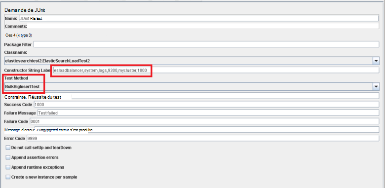

Les méthodes *BulkInsertTest* et *BigBulkInsertTest* les tâches réelles de génération et de transfert des données. Les deux méthodes sont très similaires. Ils se connectent au cluster Elasticsearch et créent un lot de documents (comme déterminé par le paramètre de chaîne de constructeur *ItemsPerInsert* ). Les documents sont ajoutés à l’index à l’aide de l’API en bloc Elasticsearch. La différence entre les deux méthodes est que les champs de chaîne de *données1* et *Données2* dans chaque document sont omis à partir du chargement dans la méthode *BulkInsertTest* , mais sont renseignés avec des chaînes de 12000 caractères dans la méthode *BigBulkInsertTest* . Notez que vous sélectionnez laquelle des méthodes suivantes pour l’exécuter à l’aide de la boîte de la *Méthode de Test* dans la page demande de JUnit JMeter (mis en surbrillance dans la figure précédente).

> [AZURE.NOTE] L’exemple de code présenté ici utilise la bibliothèque Client de Transport Elasticsearch 1.7.3. Si vous utilisez Elasticsearch 2.0.0 ou version ultérieure, vous devez utiliser la bibliothèque appropriée pour la version sélectionnée. Pour plus d’informations sur la bibliothèque Client de Transport Elasticsearch 2.0.0, consultez la page de [Transport Client](https://www.elastic.co/guide/en/elasticsearch/client/java-api/2.0/transport-client.html) sur le site Web Elasticsearch.

[Configuration de résilience et récupération sur Elasticsearch sur Azure]: guidance-elasticsearch-configuring-resilience-and-recovery.md
[Création d’un environnement de test pour Elasticsearch sur Azure de performances]: guidance-elasticsearch-creating-performance-testing-environment.md
[Exécutez les Tests de performances de Elasticsearch automatique]: guidance-elasticsearch-running-automated-performance-tests.md
[Déploiement d’un échantillon de JMeter JUnit pour le test de performances de Elasticsearch]: guidance-elasticsearch-deploying-jmeter-junit-sampler.md
