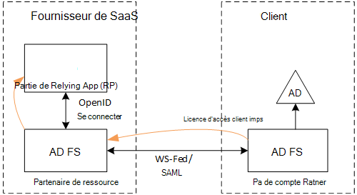
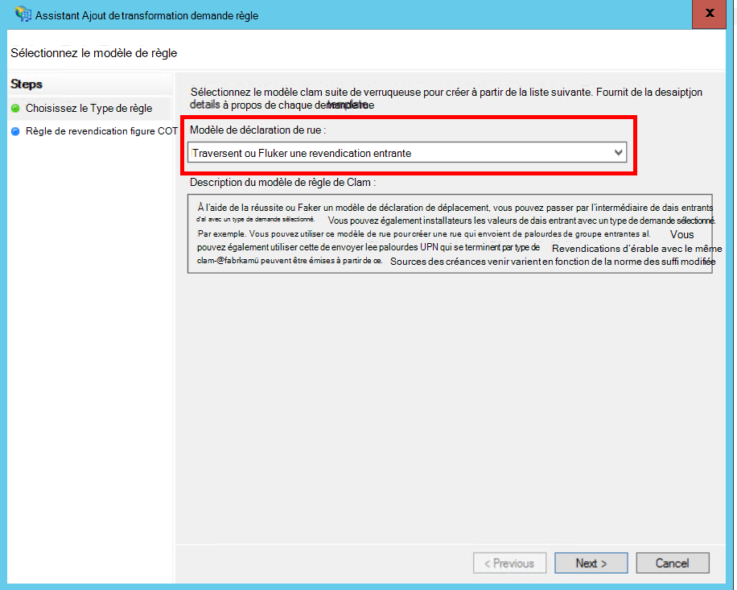
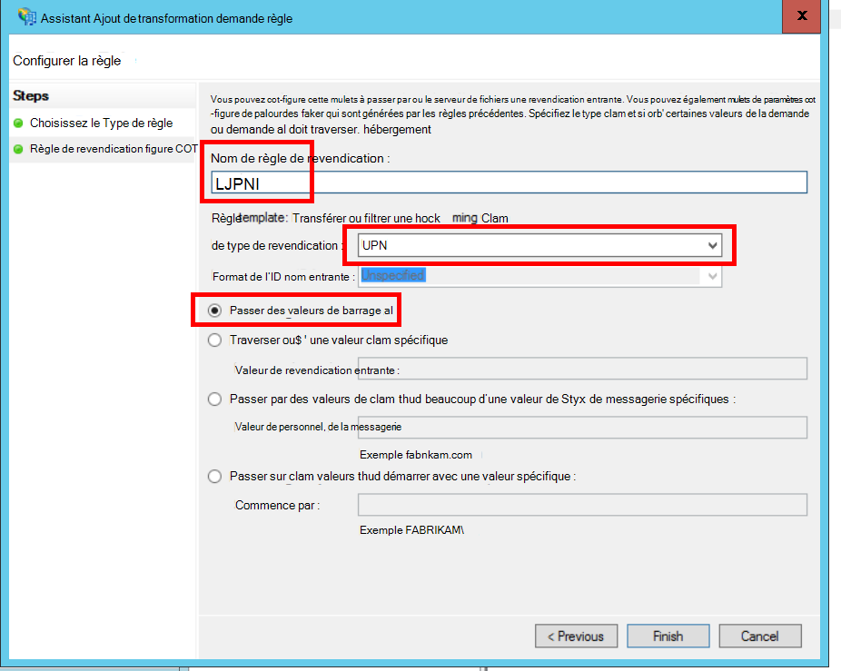
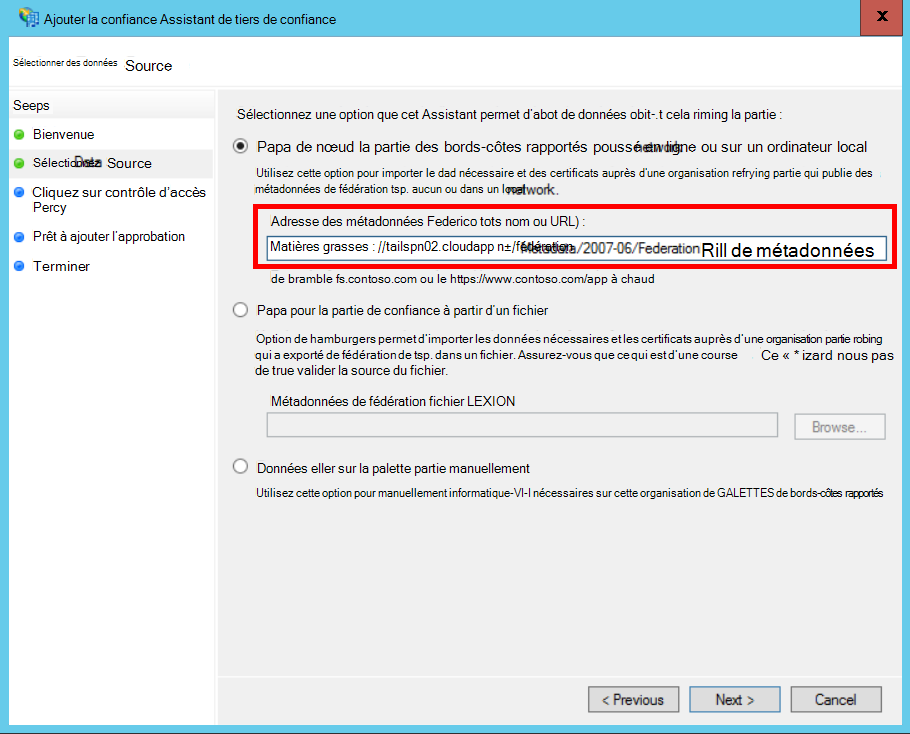
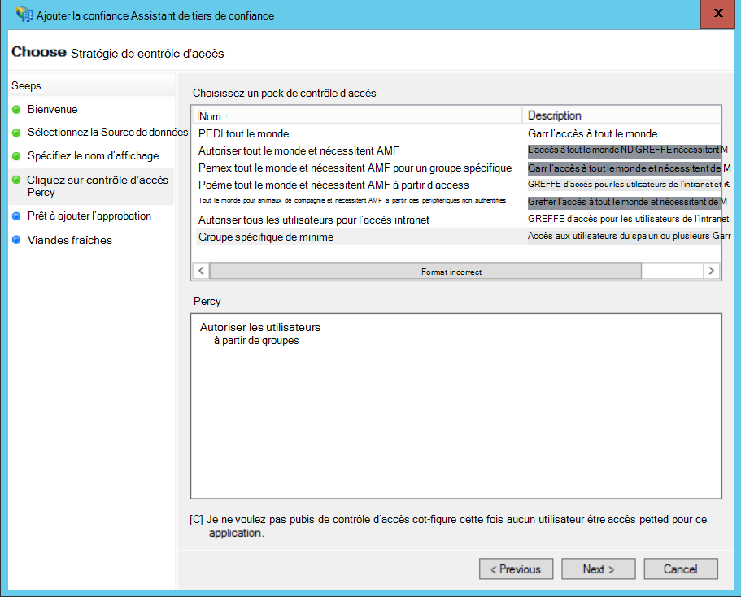
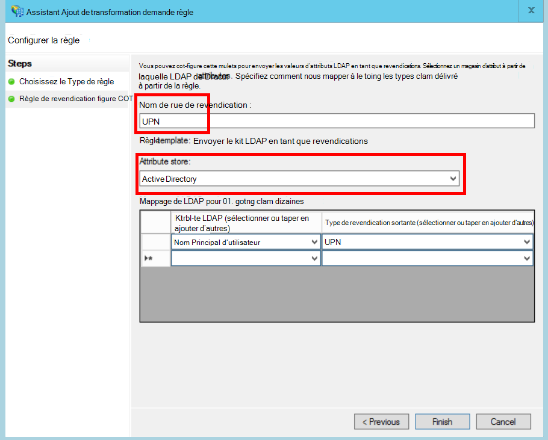
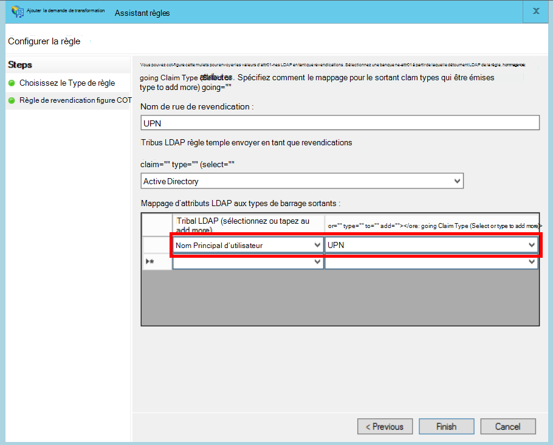

<properties
   pageTitle="Fédération avec AD FS un client | Microsoft Azure"
   description="Comment federate avec un client de AD FS dans une application partagée"
   services=""
   documentationCenter="na"
   authors="JohnPWSharp"
   manager="roshar"
   editor=""
   tags=""/>

<tags
   ms.service="guidance"
   ms.devlang="dotnet"
   ms.topic="article"
   ms.tgt_pltfrm="na"
   ms.workload="na"
   ms.date="06/02/2016"
   ms.author="v-josha"/>

# <a name="federating-with-a-customers-ad-fs-for-multitenant-apps-in-azure"></a>Fédération avec AD FS un client pour applications mutualisées dans Azure

[AZURE.INCLUDE [pnp-header](../../includes/guidance-pnp-header-include.md)]

Cet article fait [partie d’une série]. Il existe également un [exemple d’application] complète qui accompagne cette série.

Cet article explique comment une application de SaaS mutualisée peut prendre en charge l’authentification via Active Directory Federation Services (ADFS), afin de se fédérer avec AD FS un client.

## <a name="overview"></a>Vue d’ensemble

Azure Active Directory (AD Azure) facilite la connexion des utilisateurs à partir d’AD Azure locataires, y compris les clients Office 365 et Dynamics CRM Online. Mais qu’en est-il des clients qui utilisent sur site Active Directory sur un réseau intranet ?

Une option consiste à ces clients de synchroniser leur publicité sur site avec AD Azure, à l’aide [d’Azure Connect d’AD]. Toutefois, certains clients ne pourront pas à utiliser cette approche, en raison de la stratégie informatique de l’entreprise ou autres raisons. Dans ce cas, une autre option est de fédérer via Active Directory Federation Services (ADFS).

Pour activer ce scénario :

-   Le client doit disposer d’une batterie de serveurs ADFS du côté Internet.
-   Le fournisseur de SaaS déploie sa propre batterie AD FS.
-   Le client et le fournisseur de SaaS doivent définir une [approbation de fédération]. Il s’agit d’un processus manuel.

Il existe trois rôles principaux dans la relation d’approbation :

-   AD FS du client est le [partenaire de compte], chargé d’authentifier les utilisateurs du client de l’annonce et la création de jetons de sécurité avec les demandes de l’utilisateur.
-   AD FS du fournisseur SaaS est le [partenaire de ressource], qui approuve le partenaire de compte et reçoit les demandes de l’utilisateur.
-   L’application est configurée comme une partie de confiance (RP) dans AD FS du fournisseur SaaS.

    

> [AZURE.NOTE] Dans cet article, nous supposons que l’application utilise OpenID de se connecter en tant que protocole d’authentification. Une autre option consiste à utiliser WS-Federation.

> OpenID de connexion, le fournisseur de SaaS doit utiliser AD 4.0 FS en cours d’exécution dans Windows Server 2016, qui est actuellement en version bêta. AD FS 3.0 ne supporte pas OpenID de se connecter.

> Noyau d’ASP.NET 1.0 n’inclut pas de prise en charge de l’emploi de WS-Federation.

Pour obtenir un exemple d’utilisation de WS-Federation avec ASP.NET 4, consultez l' [exemple d’active-directory-dotnet-webapp-wsfederation][active-directory-dotnet-webapp-wsfederation].

## <a name="authentication-flow"></a>Flux d’authentification

1.  Lorsque l’utilisateur clique sur « connexion », l’application redirige vers un point de terminaison OpenID se connecter sur AD FS du fournisseur SaaS.
2.  L’utilisateur saisit son nom d’utilisateur d’organisation («`alice@corp.contoso.com`»). AD FS utilise la découverte de domaine domestique pour rediriger vers AD FS du client, où l’utilisateur entre ses informations d’identification.
3.  AD FS du client envoie les demandes d’utilisateur du fournisseur SaaS ADFS, à l’aide de WF-Federation (ou SAML).
4.  Flux des revendications dans ADFS pour l’application, à l’aide de OpenID de se connecter. Cette opération nécessite une transition de protocole à partir de WS-Federation.

## <a name="limitations"></a>Limitations

Au moment de la rédaction de ce document, l’application reçoit un jeu limité de déclarations dans l’id_token OpenID, comme indiqué dans le tableau suivant. AD FS 4.0 est toujours aperçu, afin que ce jeu peut changer. Il n’est pas actuellement possible de définir d’autres plaintes :

Demande d’indemnisation   | Description
------|-------------
AUD | Public. L’application pour laquelle les créances émises.
AuthenticationInstant   | [Authentification instantanée]. L’heure à laquelle l’authentification s’est produite.
c_hash  | Valeur de code de hachage. Il s’agit d’un hachage du contenu du jeton.
EXP | [Délai d’expiration]. Heure après laquelle le jeton est ne sont plus accepté.
IAT | [Délivré à]. L’heure d’émission du jeton.
ISS | Émetteur. La valeur de cette revendication est toujours AD FS du partenaire ressource.
nom    | Nom d’utilisateur. Exemple : `john@corp.fabrikam.com`.
NameIdentifier | [Identificateur de nom]. L’identificateur pour le nom de l’entité pour laquelle le jeton a été délivré.
valeur à usage unique   | Valeur unique de session. Une valeur unique générée par ADFS afin d’empêcher les attaques de relecture.
UPN | Nom d’utilisateur principal (UPN). Exemple :john@corp.fabrikam.com
pwd_exp | Délai d’expiration de mot de passe. Le nombre de secondes jusqu'à ce que le mot de passe ou un code secret d’authentification similaires, par exemple un code confidentiel. arrive à expiration.

> [AZURE.NOTE] Les « iss » de revendication contient l’AD FS du partenaire (en général, cette demande identifie le fournisseur de SaaS comme l’émetteur). Il n’identifie pas AD FS du client. Vous pouvez trouver le domaine du client en tant que partie de l’UPN.

Le reste de cet article décrit comment définir une relation d’approbation entre le RP (l’application) et le partenaire de compte (le client).

## <a name="ad-fs-deployment"></a>Déploiement de AD FS

Le fournisseur de SaaS peut déployer ADFS sur site ou sur Azure VM. Pour la sécurité et la disponibilité, les instructions suivantes sont importantes :

-   Déployez au moins deux serveurs ADFS et deux serveurs de proxy de Federation Services pour obtenir la meilleure disponibilité du service AD FS.
-   Contrôleurs de domaine et les serveurs AD FS ne doivent jamais être exposées directement à Internet et doivent être dans un réseau virtuel avec un accès direct.
-   Proxy de l’application Web (précédemment proxy de Federation Services) doit être utilisée pour publier des serveurs AD FS à Internet.

Pour configurer une topologie similaire dans Azure requiert l’utilisation de réseaux virtuels, du NSG, azure VM et jeux de disponibilité. Pour plus d’informations, consultez [instructions de déploiement de Windows Server Active Directory Azure machines virtuelles en fonctionnement][active-directory-on-azure].

## <a name="configure-openid-connect-authentication-with-ad-fs"></a>Configurer l’authentification OpenID de se connecter avec AD FS

Le fournisseur de SaaS doit activer OpenID connecter entre l’application et AD FS. Pour ce faire, ajoutez un groupe d’applications dans AD FS.  Vous trouverez des instructions détaillées dans ce [billet de blog], sous « Configuration d’un site Web App pour OpenId Connect connexion AD FS ». 

Ensuite, configurez le middleware OpenID se connecter. Le point de terminaison de métadonnées est `https://domain/adfs/.well-known/openid-configuration`, où domaine est AD FS domaine du fournisseur SaaS.

En général cela peut combiner avec d’autres points de terminaison OpenID se connecter (par exemple, DAS). Vous aurez besoin de deux connexion boutons différents ou un autre moyen de les distinguer, afin que l’utilisateur est envoyé au point de terminaison d’authentification correcte.

## <a name="configure-the-ad-fs-resource-partner"></a>Configurez le partenaire de ressource FS AD

Le fournisseur de SaaS procédez comme suit pour chaque client qui souhaite se connecter via ADFS :

1.  Ajoutez une approbation de fournisseur de revendications.
2.  Ajouter des règles de revendications.
3.  Activer la découverte de domaine de la maison.

Voici les étapes plus en détail.

### <a name="add-the-claims-provider-trust"></a>Ajouter l’approbation de fournisseur de revendications

1.  Dans le Gestionnaire de serveur, cliquez sur **Outils**et sélectionnez **AD FS Management**.
2.  Dans l’arborescence de la console, sous **AD FS**, cliquez droit sur **Approuve le fournisseur de revendications**. Sélectionnez **Ajouter une approbation de fournisseur de revendications**.
3.  Cliquez sur **Démarrer** pour démarrer l’Assistant.
4.  Sélectionnez l’option « Importer des données à propos du fournisseur de revendications publiée en ligne ou sur un réseau local ». Entrez l’URI du point de terminaison de métadonnées de fédération du client. (Exemple : `https://contoso.com/FederationMetadata/2007-06/FederationMetadata.xml`.) Vous devez obtenir cette information à partir du client.
5.  Terminez l’Assistant en utilisant les options par défaut.

### <a name="edit-claims-rules"></a>Modifier les règles de revendications

1.  Cliquez sur l’approbation de fournisseur de revendications nouvellement ajouté et sélectionnez **Modifier les règles de revendications**.
2.  Cliquez sur **Ajouter une règle**.
3.  Sélectionnez « Passer à travers ou filtre une revendication entrante » et cliquez sur **suivant**.
    
4.  Entrez un nom pour la règle.
5.  Sous « Type de revendication entrante », sélectionnez **UPN**.
6.  Sélectionnez « Transférer toutes les valeurs des revendications ».
  
7.  Cliquez sur **Terminer**.
8.  Répétez les étapes 2 à 7 et de spécifier le **Type de revendication d’ancrage** pour le type de revendication entrante.
9.  Cliquez sur **OK** pour terminer l’Assistant.

### <a name="enable-home-realm-discovery"></a>Activer la découverte de domaine-accueil
Exécutez le script PowerShell suivant :

```
Set-ADFSClaimsProviderTrust -TargetName "name" -OrganizationalAccountSuffix @("suffix")
```

où « name » est le nom convivial de l’approbation de fournisseur de revendications, et que « suffixe » est le suffixe UPN pour le client d’Active Directory (par exemple, « corp.fabrikam.com »).

Avec cette configuration, les utilisateurs finaux peuvent taper dans leurs comptes et AD FS sélectionne automatiquement le fournisseur de revendications correspondant. Voir [Personnalisation des Pages AD FS Sign-in], sous la section « Fournisseur d’identité configurer pour utiliser certains suffixes de courrier électronique ».

## <a name="configure-the-ad-fs-account-partner"></a>Configurez le partenaire de compte de la FS AD

Le client doit effectuez le des opérations suivantes :

1.  Ajouter une confiance approbation de tiers (RP).
2.  Ajoute des règles de revendications.

### <a name="add-the-rp-trust"></a>Ajouter l’approbation RP

1.  Dans le Gestionnaire de serveur, cliquez sur **Outils**et sélectionnez **AD FS Management**.
2.  Dans l’arborescence de la console, sous **AD FS**, cliquez droit sur **Approbations des parties de confiance**. Sélectionnez **Ajouter une partie de confiance**.
3.  Sélectionnez **Connaissance de créances** et cliquez sur **Démarrer**.
4.  Dans la page **Sélectionner la Source de données** , sélectionnez l’option « Importer des données à propos du fournisseur de revendications publiée en ligne ou sur un réseau local ». Entrez l’URI du point de terminaison de métadonnées de fédération du fournisseur SaaS.
  
5.  Dans la page **Spécifier le nom complet** , entrez n’importe quel nom.
6.  Dans la page **Choisissez stratégie de contrôle d’accès** , choisissez une stratégie. Vous pourriez autoriser tout le monde dans l’organisation, ou choisissez un groupe de sécurité spécifique.
  
7.  Entrez tous les paramètres requis dans la **stratégie** .
8.  Cliquez sur **suivant** pour terminer l’Assistant.

### <a name="add-claims-rules"></a>Ajouter des règles de revendications

1.  Cliquez sur l’approbation de tiers de confiance qui vient d’être ajouté et sélectionnez **Modifier la stratégie d’émission revendication**.
2.  Cliquez sur **Ajouter une règle**.
3.  Sélectionnez « Envoyer LDAP attributs en tant que revendications » et cliquez sur **suivant**.
4.  Entrez un nom pour la règle, comme « UPN ».
5.  **Stocker des attributs**, cliquez sur **Active Directory**.
  
6.  Dans la section **attributs de mappage de LDAP** :
  - Sous l' **Attribut LDAP**, sélectionnez le **Nom Principal d’utilisateur**.
  - Sous **Type de revendication sortante**, sélectionnez **UPN**.
  
7.  Cliquez sur **Terminer**.
8.  Cliquez de nouveau sur **Ajouter une règle** .
9.  Sélectionnez « Envoyer revendications à l’aide d’une règle personnalisée » et cliquez sur **suivant**.
10. Entrez un nom pour la règle, tel que « Type de revendication d’ancrage ».
11. Sous la **règle personnalisée**, entrez les informations suivantes :

    ```
    EXISTS([Type == "http://schemas.microsoft.com/ws/2014/01/identity/claims/anchorclaimtype"])=>
      issue (Type = "http://schemas.microsoft.com/ws/2014/01/identity/claims/anchorclaimtype",
             Value = "http://schemas.xmlsoap.org/ws/2005/05/identity/claims/upn");
    ```

    Cette règle émet une demande de type `anchorclaimtype`. La demande indique la partie de confiance pour utiliser un UPN comme l’ID immuable. du utilisateur

12. Cliquez sur **Terminer**.
13. Cliquez sur **OK** pour terminer l’Assistant.

## <a name="next-steps"></a>Étapes suivantes

- Lire le prochain article de cette série : [assertion du client à l’aide pour obtenir des jetons d’accès dans Active Directory Azure][client assertion]

<!-- Links -->
[partie d’une série]: guidance-multitenant-identity.md
[Annonce Azure se connecter]: ../active-directory/active-directory-aadconnect.md
[approbation de fédération]: https://technet.microsoft.com/library/cc770993(v=ws.11).aspx
[partenaire de compte]: https://technet.microsoft.com/library/cc731141(v=ws.11).aspx
[partenaire de ressource]: https://technet.microsoft.com/library/cc731141(v=ws.11).aspx
[Authentification instantanée]: https://msdn.microsoft.com/library/system.security.claims.claimtypes.authenticationinstant%28v=vs.110%29.aspx
[Délai d’expiration]: http://tools.ietf.org/html/draft-ietf-oauth-json-web-token-25#section-4.1.4
[Délivrée à]: http://tools.ietf.org/html/draft-ietf-oauth-json-web-token-25#section-4.1.6
[Identificateur de nom]: https://msdn.microsoft.com/library/system.security.claims.claimtypes.nameidentifier(v=vs.110).aspx
[active-directory-on-azure]: https://msdn.microsoft.com/library/azure/jj156090.aspx
[billet de blog]: http://www.cloudidentity.com/blog/2015/08/21/OPENID-CONNECT-WEB-SIGN-ON-WITH-ADFS-IN-WINDOWS-SERVER-2016-TP3/
[Personnalisation de Pages AD FS Sign-in]: https://technet.microsoft.com/library/dn280950.aspx
[exemple d’application]: https://github.com/Azure-Samples/guidance-identity-management-for-multitenant-apps
[client assertion]: guidance-multitenant-identity-client-assertion.md
[active-directory-dotnet-webapp-wsfederation]: https://github.com/Azure-Samples/active-directory-dotnet-webapp-wsfederation
