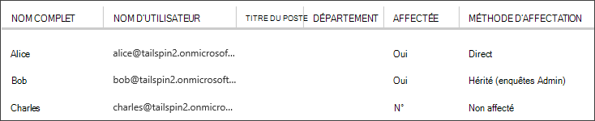

<properties
   pageTitle="Les rôles d’application | Microsoft Azure"
   description="Comment faire pour exécuter une autorisation à l’aide de rôles d’application"
   services=""
   documentationCenter="na"
   authors="MikeWasson"
   manager="roshar"
   editor=""
   tags=""/>

<tags
   ms.service="guidance"
   ms.devlang="dotnet"
   ms.topic="article"
   ms.tgt_pltfrm="na"
   ms.workload="na"
   ms.date="02/16/2016"
   ms.author="mwasson"/>

#  <a name="application-roles-in-multitenant-applications"></a>Rôles d’application dans les applications mutualisées

[AZURE.INCLUDE [pnp-header](../../includes/guidance-pnp-header-include.md)]

Cet article fait [partie d’une série]. Il existe également un [exemple d’application] complète qui accompagne cette série.

Les rôles d’application sont utilisées pour affecter des autorisations aux utilisateurs. Par exemple, les [Enquêtes de Tailspin] [ Tailspin] application définit les rôles suivants :

- Administrateur. Peut effectuer toutes les opérations CRUD sur toute enquête appartenant à ce client.
- Créateur. Peut créer de nouvelles enquêtes.
- Lecteur. Peut lire des enquêtes qui appartiennent à ce client.

Vous pouvez voir que les rôles en fin de compte être traduites en autorisations, lors de [l’autorisation]. Mais la première question consiste à attribuer et de gérer des rôles. Nous avons identifié trois options principales :

-   [Rôles d’application Azure AD](#roles-using-azure-ad-app-roles)
-   [Groupes de sécurité Active Directory Azure](#roles-using-azure-ad-security-groups)
-   [Gestionnaire de rôle d’application](#roles-using-an-application-role-manager).

## <a name="roles-using-azure-ad-app-roles"></a>Rôles à l’aide de rôles d’application Azure AD

Il s’agit de l’approche que nous avons utilisées dans l’application Tailspin enquêtes.

Dans cette approche, SaaS le fournisseur définit les rôles d’application en les ajoutant au manifeste d’application. Une fois un client se connecte, un administrateur de l’annuaire d’Active Directory du client affecte des utilisateurs aux rôles. Lorsqu’un utilisateur se connecte, les rôles de l’utilisateur sont affectés sont envoyés sous forme de créances.

> [AZURE.NOTE] Si le client a Azure AD Premium, l’administrateur peut affecter à un groupe de sécurité à un rôle et le rôle d’application hérite des membres du groupe. Il s’agit d’un moyen pratique de gérer les rôles, car le propriétaire du groupe n’a pas besoin d’être administrateur AD.

Avantages de cette approche :

-   Modèle de programmation simple.
-   Les rôles sont spécifiques à l’application. Les revendications de rôle pour une application ne sont pas envoyées à une autre application.
-   Si le client supprime l’application de leurs clients d’Active Directory, les rôles disparaissent.
-   L’application n’a pas besoin d’autorisations Active Directory supplémentaires, autres que la lecture du profil de l’utilisateur.

Inconvénients :

- Clients sans Azure AD Premium ne peut pas attribuer des groupes de sécurité aux rôles. Pour ces clients, toutes les affectations de l’utilisateur doivent être effectuées par un administrateur Active Directory.
- Si vous avez un site web de back-end API, qui est distinct de l’application web, puis les attributions de rôle pour l’application web ne s’appliquent pas à l’API web. Pour plus d’informations sur ce point, reportez-vous à la section [sécurisation d’un back-end web API].

### <a name="implementation"></a>Mise en œuvre

**Définir les rôles.** Le fournisseur de SaaS déclare les rôles d’application dans le [manifeste d’application]. Par exemple, voici l’entrée de manifeste pour l’application des enquêtes :

```
"appRoles": [
  {
    "allowedMemberTypes": [
      "User"
    ],
    "description": "Creators can create Surveys",
    "displayName": "SurveyCreator",
    "id": "1b4f816e-5eaf-48b9-8613-7923830595ad",
    "isEnabled": true,
    "value": "SurveyCreator"
  },
  {
    "allowedMemberTypes": [
      "User"
    ],
    "description": "Administrators can manage the Surveys in their tenant",
    "displayName": "SurveyAdmin",
    "id": "c20e145e-5459-4a6c-a074-b942bbd4cfe1",
    "isEnabled": true,
    "value": "SurveyAdmin"
  }
],
```

Le `value` propriété apparaît dans la déclaration de rôle. Le `id` propriété est l’identificateur unique pour le rôle défini. Toujours générer une nouvelle valeur GUID pour `id`.

**Affecter des utilisateurs**. Lorsqu’un nouveau client se connecte, l’application est inscrite dans clients d’Active Directory du client. À ce stade, un administrateur Active Directory pour que les clients peut affecter des utilisateurs aux rôles.

> [AZURE.NOTE] Comme indiqué précédemment, clients avec Azure AD Premium peuvent également affecter des groupes de sécurité à des rôles.

La capture d’écran suivante à partir du portail Azure présente trois utilisateurs. Alice a été affectée directement à un rôle. Bob hérité d’un rôle en tant que membre d’un groupe de sécurité nommé « Enquêtes Admin », qui est affecté à un rôle. Charles n’est pas affecté à un rôle.



> [AZURE.NOTE] Sinon, l’application peut assigner des rôles par programme, à l’aide de l’API Azure AD graphique.  Toutefois, cela requiert l’application pour obtenir les autorisations en écriture pour le répertoire d’Active Directory du client. Une application disposant de ces autorisations peut faire beaucoup de malveillance &mdash; le client est autorisé à approuver l’application ne pas pour tromper leur répertoire. De nombreux clients peuvent être refuse d’accorder ce niveau d’accès.

**Obtenir des revendications de rôle**. Lorsqu’un utilisateur se connecte, l’application reçoit ou les rôles de l’utilisateur assigné dans une déclaration avec un type de `http://schemas.microsoft.com/ws/2008/06/identity/claims/role`.  

Un utilisateur peut avoir plusieurs rôles, ou aucun rôle. Dans votre code d’autorisation, ne pensez pas que l’utilisateur dispose d’exactement un seul rôle de revendication. À la place, écrire du code qui vérifie si une valeur de la demande de remboursement particulier est présente :

```csharp
if (context.User.HasClaim(ClaimTypes.Role, "Admin")) { ... }
```

## <a name="roles-using-azure-ad-security-groups"></a>Rôles à l’aide de groupes de sécurité Active Directory Azure

Dans cette approche, les rôles sont représentés sous forme de groupes de sécurité Active Directory. L’application attribue des autorisations aux utilisateurs en fonction de leur appartenance aux groupes de sécurité.

Avantages :

-   Pour les clients qui n’ont pas d’Azure AD Premium, cette approche permet au client d’utiliser les groupes de sécurité pour gérer les affectations de rôles.

Inconvénients :

- Complexité. Étant donné que chaque client envoie les revendications de groupe différents, l’application doit suivre des qui correspondent de groupes de sécurité pour les rôles d’application, pour chaque client.
- Si le client supprime l’application de leurs clients d’Active Directory, les groupes de sécurité sont laissés dans leur répertoire d’Active Directory.

### <a name="implementation"></a>Mise en œuvre

Dans le manifeste d’application, définissez les `groupMembershipClaims` propriété à « SecurityGroup ». Cela est nécessaire pour obtenir les revendications de l’appartenance au groupe de DAS.

```
{
   // ...
   "groupMembershipClaims": "SecurityGroup",
}
```

Lorsqu’un nouveau client se connecte, l’application indique au client de créer des groupes de sécurité pour les rôles nécessaires à l’application. Le client doit ensuite entrer les ID d’objet de groupe dans l’application. L’application enregistre dans une table qui mappe les ID de groupe de rôles d’application, par les clients.

> [AZURE.NOTE] Sinon, l’application pourrait créer les groupes par programmation, à l’aide de l’API Azure AD graphique.  Ce serait moins sujette aux erreurs. Toutefois, il requiert l’application pour obtenir « lecture et d’écriture de tous les groupes » autorisations de répertoire d’Active Directory du client. De nombreux clients peuvent être refuse d’accorder ce niveau d’accès.

Lorsqu’un utilisateur se connecte :

1.  L’application reçoit des groupes de l’utilisateur en tant que revendications. La valeur de chaque demande est l’ID d’objet d’un groupe.
2.  Annonce Azure limite le nombre de groupes envoyé dans le jeton. Si le nombre de groupes dépasse cette limite, AD Azure envoie une demande de « limites d’âge » spéciale. Si cette affirmation est présente, l’application doit demander l’API Azure AD graphe pour obtenir tous les groupes auxquels appartient cet utilisateur. Pour plus d’informations, reportez-vous à la section [autorisation dans les Applications de Cloud à l’aide de groupes d’annonces], dans la section intitulée « Groupes de créance excédent ».
3.  L’application recherche les ID d’objet dans sa propre base de données, les rôles d’application correspondant à attribuer à l’utilisateur.
4.  L’application ajoute une valeur de revendication personnalisée à l’identité de l’utilisateur qui exprime le rôle d’application. Par exemple : `survey_role` = « SurveyAdmin ».

La revendication de rôle personnalisé, des stratégies d’autorisation doivent utiliser pas le groupe de revendication.

## <a name="roles-using-an-application-role-manager"></a>Rôles à l’aide d’un gestionnaire de rôles d’application

Avec cette approche, les rôles d’application ne sont pas stockés dans AD Azure du tout. Au lieu de cela, l’application stocke les attributions de rôle pour chaque utilisateur dans sa propre base de données &mdash; , par exemple, à l’aide de la classe **RoleManager** dans l’identité d’ASP.NET.

Avantages :

-   L’application possède un contrôle total sur les rôles et les affectations de l’utilisateur.

Inconvénients :

- Plus complexe et plus difficile à gérer.
- Impossible d’utiliser les groupes de sécurité Active Directory pour gérer les affectations de rôles.
- Stocke des informations utilisateur dans la base de l’application, où il peut se désynchroniser avec répertoire d’annonce du locataire, que les utilisateurs sont ajoutés ou supprimés.   

Il existe de nombreux exemples existants pour cette approche. Par exemple, voir [Création d’une application ASP.NET MVC avec l’authentification et la base de données SQL et déployer au Service d’application Azure].

## <a name="next-steps"></a>Étapes suivantes

- Lire le prochain article de cette série : [autorisation basée sur les rôles et basée sur les ressources dans les applications mutualisées][autorisation]

<!-- Links -->
[Tailspin]: guidance-multitenant-identity-tailspin.md
[partie d’une série]: guidance-multitenant-identity.md
[autorisation]: guidance-multitenant-identity-authorize.md
[Sécurisation d’une API de web back-end]: guidance-multitenant-identity-web-api.md
[Créer une application ASP.NET MVC avec l’authentification et la base de données SQL et le déployer vers Azure Application Service]: ../app-service-web/web-sites-dotnet-deploy-aspnet-mvc-app-membership-oauth-sql-database.md
[manifeste d’application]: ../active-directory/active-directory-application-manifest.md
[exemple d’application]: https://github.com/Azure-Samples/guidance-identity-management-for-multitenant-apps
