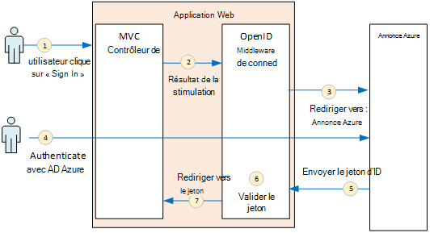
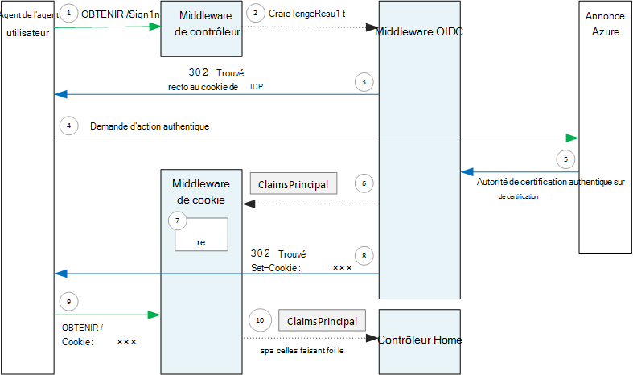

<properties
   pageTitle="L’authentification dans les applications mutualisées | Microsoft Azure"
   description="Comment une application partagée peut authentifier des utilisateurs dans Active Directory Azure"
   services=""
   documentationCenter="na"
   authors="MikeWasson"
   manager="roshar"
   editor=""
   tags=""/>

<tags
   ms.service="guidance"
   ms.devlang="dotnet"
   ms.topic="article"
   ms.tgt_pltfrm="na"
   ms.workload="na"
   ms.date="05/23/2016"
   ms.author="mwasson"/>

# <a name="authentication-in-multitenant-apps-using-azure-ad-and-openid-connect"></a>L’authentification dans les applications mutualisées, à l’aide d’Active Directory Azure et OpenID se connecter

[AZURE.INCLUDE [pnp-header](../../includes/guidance-pnp-header-include.md)]

Cet article fait [partie d’une série](guidance-multitenant-identity.md). Il existe également un [exemple d’application] complète qui accompagne cette série.

Cet article explique comment une application partagée peut authentifier les utilisateurs d’Azure Active Directory (AD Azure), à l’aide de se connecter à OpenID (OIDC) pour l’authentification.

## <a name="overview"></a>Vue d’ensemble

Notre [implémentation de référence](guidance-multitenant-identity-tailspin.md) est une application ASP.NET Core 1.0. L’application utilise le middleware OpenID connecter intégré pour effectuer le flux d’authentification OIDC. Le diagramme suivant montre ce qui se produit lorsque l’utilisateur se connecte, à un niveau élevé.



1.  L’utilisateur clique sur le bouton « connexion » dans l’application. Cette action est gérée par un contrôleur MVC.
2.  Le contrôleur MVC retourne une action **ChallengeResult** .
3.  Le middleware intercepte le **ChallengeResult** et crée une réponse 302, qui redirige l’utilisateur vers la page de connexion AD Azure.
4.  L’utilisateur s’authentifie avec AD Azure.
5.  Annonce Azure envoie un jeton ID à l’application.
6.  Le middleware valide le jeton d’ID. À ce stade, l’utilisateur est maintenant authentifié à l’intérieur de l’application.
7.  Le middleware redirige l’utilisateur vers l’application.

## <a name="register-the-app-with-azure-ad"></a>Enregistrement de l’application avec Azure AD

Pour activer la OpenID de se connecter, le fournisseur de SaaS inscrit l’application à l’intérieur de leurs propres clients AD Azure.

Pour inscrire l’application, suivez les étapes de l' [Intégration des Applications avec Azure Active Directory](../active-directory/active-directory-integrating-applications.md), dans la section [Ajout d’une Application](../active-directory/active-directory-integrating-applications.md#adding-an-application).

Dans la page **configurer** :

-   Notez l’ID de client.
-   **L’Application est partagée**, cliquez sur **Oui**.
-   Définir **l’URL de la réponse** à une URL où AD Azure envoie la réponse d’authentification. Vous pouvez utiliser l’URL de base de votre application.
  - Remarque : Le chemin d’accès de l’URL peut être n’importe quoi, tant que le nom d’hôte correspond à votre application déployée.
  - Vous pouvez définir plusieurs URL de réponse. Pendant le développement, vous pouvez utiliser un `localhost` adresse, pour exécuter l’application localement.
-   Générer un secret client : sous **clés**, cliquez sur la liste déroulante qui indique **Sélectionnez durée** et prélèvement 1 ou 2 ans. La clé sera visible lorsque vous cliquez sur **Enregistrer**. Veillez à copier la valeur, car il n’apparaît plus lorsque vous rechargez la page de configuration.

## <a name="configure-the-auth-middleware"></a>Configurer le middleware auth

Cette section décrit comment configurer le middleware d’authentification dans ASP.NET Core 1.0 pour l’authentification partagée avec OpenID de se connecter.

Dans votre classe de démarrage, ajoutez le middleware OpenID se connecter :

```csharp
app.UseOpenIdConnectAuthentication(options =>
{
    options.AutomaticAuthenticate = true;
    options.AutomaticChallenge = true;
    options.ClientId = [client ID];
    options.Authority = "https://login.microsoftonline.com/common/";
    options.CallbackPath = [callback path];
    options.PostLogoutRedirectUri = [application URI];
    options.SignInScheme = CookieAuthenticationDefaults.AuthenticationScheme;
    options.TokenValidationParameters = new TokenValidationParameters
    {
        ValidateIssuer = false
    };
    options.Events = [event callbacks];
});
```

> [AZURE.NOTE] Voir [Startup.cs](https://github.com/Azure-Samples/guidance-identity-management-for-multitenant-apps/blob/master/src/Tailspin.Surveys.Web/Startup.cs).

Pour plus d’informations sur la classe de démarrage, consultez [Démarrage de l’Application](https://docs.asp.net/en/latest/fundamentals/startup.html) dans la documentation ASP.NET Core 1.0.

Définir les options de middleware suivantes :

- **ClientId**. ID client de l’application, qui vous a été fourni lors de l’inscription de l’application dans Azure AD.
- **Autorité**. Pour une application partagée, indiquez ce `https://login.microsoftonline.com/common/`. Il s’agit de l’URL du point de terminaison commun AD Azure, qui permet aux utilisateurs à partir de n’importe quel client AD Azure pour vous connecter. Pour plus d’informations sur le point de terminaison commun, consultez [ce billet de blog](http://www.cloudidentity.com/blog/2014/08/26/the-common-endpoint-walks-like-a-tenant-talks-like-a-tenant-but-is-not-a-tenant/).
- Dans **TokenValidationParameters**, définissez **ValidateIssuer** sur false. Cela signifie que l’application sera responsable de la validation de la valeur de l’émetteur dans le jeton d’ID. (Le middleware continue de valider le jeton lui-même.) Pour plus d’informations sur la validation de l’émetteur, consultez [validation de l’émetteur](guidance-multitenant-identity-claims.md#issuer-validation).
- **CallbackPath**. Définir comme le chemin d’accès dans l’URL de la réponse que vous avez enregistré dans Active Directory Azure. Par exemple, si l’URL de la réponse est `http://contoso.com/aadsignin`, **CallbackPath** doit être `aadsignin`. Si vous ne définissez pas cette option, la valeur par défaut est `signin-oidc`.
- **PostLogoutRedirectUri**. Spécifiez une URL pour rediriger les utilisateurs après la déconnexion. Ce doit être une page qui autorise les demandes anonymes &mdash; généralement la page d’accueil.
- **SignInScheme**. Définir sur `CookieAuthenticationDefaults.AuthenticationScheme`. Ce paramètre signifie qu’une fois que l’utilisateur est authentifié, les revendications de l’utilisateur sont stockées localement dans un cookie. Ce cookie est la façon dont l’utilisateur reste connecté au cours de la session du navigateur.
- **Événements.** Rappels d’événement ; consultez les [événements d’authentification](#authentication-events).

Également ajouter le middleware de l’authentification par Cookie au pipeline. Ce middleware est chargé pour écrire les revendications de l’utilisateur dans un cookie et puis en lisant le cookie lors de chargements de page suivants.

```csharp
app.UseCookieAuthentication(options =>
{
    options.AutomaticAuthenticate = true;
    options.AutomaticChallenge = true;
    options.AccessDeniedPath = "/Home/Forbidden";
});
```

## <a name="initiate-the-authentication-flow"></a>Lancer le flux d’authentification

Pour démarrer le flux de l’authentification dans ASP.NET MVC, renvoyer un **ChallengeResult** à partir du contrôleur :

```csharp
[AllowAnonymous]
public IActionResult SignIn()
{
    return new ChallengeResult(
        OpenIdConnectDefaults.AuthenticationScheme,
        new AuthenticationProperties
        {
            IsPersistent = true,
            RedirectUri = Url.Action("SignInCallback", "Account")
        });
}
```

Cela provoque le middleware retourne une réponse 302 (trouvé) qui redirige vers le point de terminaison de l’authentification.

## <a name="user-login-sessions"></a>Sessions utilisateur

Comme mentionné, lorsque l’utilisateur se connecte tout d’abord, le middleware de l’authentification par Cookie écrit les revendications de l’utilisateur dans un cookie. Après cela, les requêtes HTTP sont authentifiés en lisant le cookie.

Par défaut, le middleware de cookie écrit un [cookie de session][session-cookie], qui obtient a supprimé une fois l’utilisateur ferme le navigateur. La prochaine fois que l’utilisateur visite ensuite le site, ils devront se connecter à nouveau. Cependant, si vous définissez **IsPersistent** sur true dans le **ChallengeResult**, le middleware écrit un cookie persistant, afin que l’utilisateur reste connecté après la fermeture du navigateur. Vous pouvez configurer l’expiration du cookie ; reportez-vous à la section [options de cookie de contrôle][cookie-options]. Les cookies persistants sont plus pratiques pour l’utilisateur, mais peuvent être inappropriés pour certaines applications (par exemple, une application bancaire) où vous souhaitez que l’utilisateur pour vous connecter chaque fois.

## <a name="about-the-openid-connect-middleware"></a>À propos des logiciels intermédiaires OpenID se connecter

Le middleware OpenID connecter dans ASP.NET masque la plupart des détails du protocole. Cette section contient des remarques sur l’implémentation, ce qui peut être utile pour la compréhension du flux de protocole.

Tout d’abord, examinons le flux d’authentification en termes d’ASP.NET (en ignorant les détails du flux de protocole de OIDC entre l’application et Azure AD). Le diagramme suivant illustre le processus.



Dans ce diagramme, il existe deux contrôleurs MVC. Le contrôleur de compte gère les demandes de connexion et le contrôleur Home fournit la page d’accueil.

Voici le processus d’authentification :

1. L’utilisateur clique sur le bouton « Connexion » et le navigateur envoie une requête GET. Par exemple : `GET /Account/SignIn/`.
2. Les retours de contrôleur de compte un `ChallengeResult`.
3. Le middleware OIDC renvoie une réponse HTTP 302, redirection vers Azure AD.
4. Le navigateur envoie la demande d’authentification à Active Directory Azure
5. L’utilisateur se connecte à AD Azure, et annonce Azure renvoie une réponse d’authentification.
6. Le middleware OIDC crée une entité de revendications et le passe à l’authentification par Cookie middleware.
7. Le middleware de cookie sérialise l’entité de sécurité de revendications et définit un cookie.
8. Le middleware OIDC redirige vers l’URL de rappel de l’application.
10. Le navigateur suit la redirection, envoyer le cookie de la demande.
11. Le middleware de cookie désérialise le cookie à une réclamation principal et définit `HttpContext.User` égale à l’entité de sécurité de revendications. La demande est acheminée à un contrôleur MVC.

### <a name="authentication-ticket"></a>Ticket d’authentification

Si l’authentification réussit, le middleware OIDC crée un ticket d’authentification, qui contient une entité de revendications contenant des demandes de l’utilisateur. Vous pouvez accéder le ticket à l’intérieur de l’événement **AuthenticationValidated** ou **TicketReceived** .

> [AZURE.NOTE] Jusqu'à ce que le flux d’authentification est terminé, `HttpContext.User` conserve un anonyme principal, _pas_ l’utilisateur authentifié. L’entité de sécurité anonyme possède une collection de déclarations vide. Après l’exécution de l’authentification et le middleware de cookie de l’application redirige, désérialise le cookie d’authentification et les jeux de `HttpContext.User` à une entité de revendications qui représente l’utilisateur authentifié.

### <a name="authentication-events"></a>Événements d’authentification

Au cours du processus d’authentification, le middleware OpenID connecter déclenche une série d’événements :

- **RedirectToAuthenticationEndpoint**. Appelée juste avant le middleware redirige vers le point de terminaison de l’authentification. Vous pouvez utiliser cet événement pour modifier l’URL de redirection ; par exemple, pour ajouter des paramètres de la demande. Pour obtenir un exemple, consultez [Ajout de l’administrateur de consentement](guidance-multitenant-identity-signup.md#adding-the-admin-consent-prompt) .

- **AuthorizationResponseReceived**. Appelé après que le middleware reçoit la réponse d’authentification à partir du fournisseur d’identité (IDP), mais avant que le middleware valide la réponse.  

- **AuthorizationCodeReceived**. Appelée avec le code d’autorisation.

- **TokenResponseReceived**. Appelée après que le middleware Obtient un accès à un jeton de la IDP. S’applique uniquement aux flux de code d’autorisation.

- **AuthenticationValidated**. Appelé après que le jeton d’ID valide les logiciels intermédiaires. À ce stade, l’application possède un ensemble de revendications validées sur l’utilisateur. Vous pouvez utiliser cet événement pour effectuer une validation supplémentaire sur les revendications, ou à la transformation des revendications. Consultez [utilisation de revendications](guidance-multitenant-identity-claims.md).

- **UserInformationReceived**. Appelée si le middleware Obtient le profil utilisateur à partir du point de terminaison des informations utilisateur. S’applique uniquement aux flux de code d’autorisation et uniquement lorsque `GetClaimsFromUserInfoEndpoint = true` dans les options de middleware.

- **TicketReceived**. Appelée lorsque l’authentification est terminée. Il s’agit du dernier événement, en supposant que l’authentification réussit. Une fois que cet événement est géré, l’utilisateur est connecté à l’application.

- **AuthenticationFailed**. Appelé si l’authentification échoue. Utilisez cet événement pour gérer des échecs d’authentification &mdash; , par exemple, en la redirigeant vers une page d’erreur.

Pour fournir des rappels pour ces événements, définissez l’option **événements** logiciels intermédiaires. Il existe deux façons différentes pour déclarer les gestionnaires d’événements : en ligne à des expressions lambda, ou dans une classe qui dérive de **OpenIdConnectEvents**.

Inline avec les expressions lambda :

```csharp
app.UseOpenIdConnectAuthentication(options =>
{
    // Other options not shown.

    options.Events = new OpenIdConnectEvents
    {
        OnTicketReceived = (context) =>
        {
             // Handle event
             return Task.FromResult(0);
        },
        // other events
    }
});
```

Dérivation à partir de **OpenIdConnectEvents**:

```csharp
public class SurveyAuthenticationEvents : OpenIdConnectEvents
{
    public override Task TicketReceived(TicketReceivedContext context)
    {
        // Handle event
        return base.TicketReceived(context);
    }
    // other events
}

// In Startup.cs:
app.UseOpenIdConnectAuthentication(options =>
{
    // Other options not shown.

    options.Events = new SurveyAuthenticationEvents();
});
```

La seconde approche est recommandée si vos rappels d’événement ont une logique substantielle, afin qu’ils n’encombrent pas votre classe de démarrage. Notre implémentation de référence utilise cette approche ; voir [SurveyAuthenticationEvents.cs](https://github.com/Azure-Samples/guidance-identity-management-for-multitenant-apps/blob/master/src/Tailspin.Surveys.Web/Security/SurveyAuthenticationEvents.cs).

### <a name="openid-connect-endpoints"></a>OpenID connecter les points de terminaison

Annonce Azure prend en charge la [Découverte de connexion OpenID](https://openid.net/specs/openid-connect-discovery-1_0.html), dans lequel le fournisseur d’identité (IDP) retourne un document de métadonnées JSON à partir d’un [point de terminaison connu](https://openid.net/specs/openid-connect-discovery-1_0.html#ProviderConfig). Le document de métadonnées contient des informations telles que :

-   L’URL du point de terminaison d’autorisation. C’est lorsque l’application redirige pour authentifier l’utilisateur.
-   L’URL du point de terminaison « terminer la session », dans lequel l’application passe à l’utilisateur.
-   L’URL pour obtenir les clés de signature, le client utilise pour valider les jetons OIDC qu’il obtient de la IDP.

Par défaut, le middleware OIDC sait comment extraire ces métadonnées. Définissez l’option de **l’autorité** dans le middleware et le middleware construit l’URL pour les métadonnées. (Vous pouvez substituer l’URL des métadonnées en définissant l’option **MetadataAddress** ).

### <a name="openid-connect-flows"></a>OpenID connecter de flux

Par défaut, le middleware OIDC utilise des flux de hybride avec le mode de réponse post de formulaire.

-   _Flux de hybride_ signifie que le client peut obtenir un jeton d’ID et un code d’autorisation dans le même aller-retour vers le serveur d’autorisation.
-   _Mode de réponse de publication de formulaire_ signifie que le serveur d’autorisation utilise une demande HTTP POST à envoyer le code ID de jeton et d’autorisation pour l’application. Les valeurs sont form-urlencoded (type de contenu = « application/x-www-form-urlencoded »).

Lorsque le middleware OIDC redirige vers le point de terminaison de l’autorisation, l’URL de redirection comprend tous les paramètres de chaîne de requête requis par OIDC. Pour les flux hybride :

-   identifiant_client. Cette valeur est définie dans l’option de **ClientId**
-   Scope = « profil openid », qui signifie qu’il s’agit d’une demande OIDC et nous souhaitons que le profil de l’utilisateur.
-   response_type = « code id_token ». Ce paramètre spécifie les flux hybride.
-   response_mode = « form_post ». Cela spécifie la réponse post de formulaire.

Pour spécifier un autre flux, définissez la propriété **ResponseType** sur les options. Par exemple :

```csharp
app.UseOpenIdConnectAuthentication(options =>
{
    options.ResponseType = "code"; // Authorization code flow

    // Other options
}
```

## <a name="next-steps"></a>Étapes suivantes

- Lire le prochain article de cette série : [travailler avec des identités dans les applications mutualisées basée sur les revendications][claims]


[claims]: guidance-multitenant-identity-claims.md
[cookie-options]: https://docs.asp.net/en/latest/security/authentication/cookie.html#controlling-cookie-options
[session-cookie]: https://en.wikipedia.org/wiki/HTTP_cookie#Session_cookie
[exemple d’application]: https://github.com/Azure-Samples/guidance-identity-management-for-multitenant-apps
