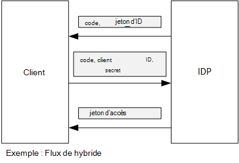

<properties
   pageTitle="À l’aide d’assertion du client afin d’obtenir les jetons d’accès à partir d’AD Azure | Microsoft Azure"
   description="Comment utiliser l’assertion du client afin d’obtenir les jetons d’accès à partir d’AD Azure."
   services=""
   documentationCenter="na"
   authors="MikeWasson"
   manager="roshar"
   editor=""
   tags=""/>

<tags
   ms.service="guidance"
   ms.devlang="dotnet"
   ms.topic="article"
   ms.tgt_pltfrm="na"
   ms.workload="na"
   ms.date="05/23/2016"
   ms.author="mwasson"/>

# <a name="using-client-assertion-to-get-access-tokens-from-azure-ad"></a>À l’aide d’assertion du client afin d’obtenir les jetons d’accès à partir d’AD Azure

[AZURE.INCLUDE [pnp-header](../../includes/guidance-pnp-header-include.md)]

Cet article fait [partie d’une série]. Il existe également un [exemple d’application] complète qui accompagne cette série.

## <a name="background"></a>Arrière-plan

Lorsque vous utilisez le flux de code d’autorisation ou les flux hybride dans OpenID se connecter, le client échange un code d’autorisation pour un jeton d’accès. Au cours de cette étape, le client doit s’authentifier auprès du serveur.



Un moyen d’authentifier le client est à l’aide d’un secret de client. C’est la façon dont les [Enquêtes de Tailspin] [ Surveys] application est configurée par défaut.

Voici un exemple de demande à partir du client vers le IDP, demande un jeton d’accès. Remarque le `client_secret` paramètre.

```
POST https://login.microsoftonline.com/b9bd2162xxx/oauth2/token HTTP/1.1
Content-Type: application/x-www-form-urlencoded

resource=https://tailspin.onmicrosoft.com/surveys.webapi
  &client_id=87df91dc-63de-4765-8701-b59cc8bd9e11
  &client_secret=i3Bf12Dn...
  &grant_type=authorization_code
  &code=PG8wJG6Y...
```

Le secret est juste une chaîne, donc vous devez prendre garde à ne pas perdre de la valeur. La meilleure pratique consiste à conserver le secret du client de contrôle de code source. Lorsque vous déployez sur Azure, stocker le secret dans un [paramètre d’application][configure-web-app].

Cependant, toute personne ayant accès à l’abonnement Azure peut afficher les paramètres d’application. En outre, il est toujours tentant de vérifier les secrets dans le contrôle de code source (par exemple, dans les scripts de déploiement), les partager par courrier électronique et ainsi de suite.

Pour plus de sécurité, vous pouvez utiliser [l’assertion du client] au lieu d’un secret de client. Avec l’assertion du client, le client utilise un certificat X.509 pour prouver que la demande de jeton provenant du client. Le certificat client est installé sur le serveur web. En règle générale, il sera plus facile restreindre l’accès au certificat, que pour vous assurer que personne ne par inadvertance révèle un secret de client. Pour plus d’informations sur la configuration des certificats dans une application web, consultez [Utilisation des certificats dans les Applications de sites Web d’Azure][using-certs-in-websites]

Voici une demande de jeton à l’aide d’assertion du client :

```
POST https://login.microsoftonline.com/b9bd2162xxx/oauth2/token HTTP/1.1
Content-Type: application/x-www-form-urlencoded

resource=https://tailspin.onmicrosoft.com/surveys.webapi
  &client_id=87df91dc-63de-4765-8701-b59cc8bd9e11
  &client_assertion_type=urn:ietf:params:oauth:client-assertion-type:jwt-bearer
  &client_assertion=eyJhbGci...
  &grant_type=authorization_code
  &code= PG8wJG6Y...
```

Notez que la `client_secret` paramètre n’est plus utilisé. Au lieu de cela, le `client_assertion` paramètre contient un jeton JWT qui a été signé à l’aide du certificat client. Le `client_assertion_type` paramètre spécifie le type d’assertion &mdash; dans ce cas, jeton JWT. Le serveur valide le jeton JWT. Si le jeton JWT n’est pas valide, la demande de jeton renvoie une erreur.

> [AZURE.NOTE] Certificats X.509 ne sont pas la seule forme d’assertion du client ; nous concentrer sur elle ici, car il est pris en charge par Active Directory Azure.

## <a name="using-client-assertion-in-the-surveys-application"></a>À l’aide d’assertion du client dans l’application d’enquêtes

Cette section indique comment configurer l’application Tailspin enquêtes à utiliser l’assertion du client. Dans cette procédure, vous allez générer un certificat auto-signé qui est approprié pour le développement, mais pas pour la production.

1. Exécutez le script de PowerShell [/Scripts/Setup-KeyVault.ps1] [ Setup-KeyVault] comme suit :

    ```
    .\Setup-KeyVault.ps -Subject [subject]
    ```

    Pour le `Subject` paramètre, entrez un nom quelconque, par exemple « surveysapp ». Le script génère un certificat auto-signé et le stocke dans le magasin de certificats « utilisateur actuel/personnel ».

2. La sortie du script est un fragment JSON. Ajouter au manifeste d’application de l’application web, comme suit :

    1. Connectez-vous au [portail de gestion Azure] [ azure-management-portal] et naviguez jusqu'à votre répertoire AD Azure.

    2. Cliquez sur **Applications**.

    3. Sélectionnez l’application d’enquêtes.

    4.  Cliquez sur **Gérer le manifeste** et sélectionnez **Télécharger le manifeste**.

    5.  Dans un éditeur de texte, ouvrez le fichier manifeste de JSON. Coller la sortie à partir du script dans le `keyCredentials` propriété. Il doit ressembler à ce qui suit :

        ```    
        "keyCredentials": [
            {
              "type": "AsymmetricX509Cert",
              "usage": "Verify",
              "keyId": "29d4f7db-0539-455e-b708-....",
              "customKeyIdentifier": "ZEPpP/+KJe2fVDBNaPNOTDoJMac=",
              "value": "MIIDAjCCAeqgAwIBAgIQFxeRiU59eL.....
            }
          ],
         ```

    6.  Enregistrez vos modifications dans le fichier JSON.

    7.  Revenez au portail. Cliquez sur **Gérer le manifeste** > **Manifeste de téléchargement** et de télécharger le fichier JSON.

3. Exécutez la commande suivante pour obtenir l’empreinte numérique du certificat.

    ```
    certutil -store -user my [subject]
    ```

    où `[subject]` est la valeur que vous avez spécifié pour le sujet dans le script PowerShell. L’empreinte numérique est répertorié sous « Certificat hachage (SHA1) ». Supprimez les espaces entre les nombres hexadécimaux.

4. Mettre à jour les secrets de votre application. Dans l’Explorateur de solutions, cliquez droit sur le projet Tailspin.Surveys.Web et sélectionnez **Gérer les Secrets des utilisateurs**. Ajoutez une entrée pour « Asymétriques » sous « AzureAd », comme indiqué ci-dessous :

    ```
    {
      "AzureAd": {
        "ClientId": "[Surveys application client ID]",
        // "ClientSecret": "[client secret]",  << Delete this entry
        "PostLogoutRedirectUri": "https://localhost:44300/",
        "WebApiResourceId": "[App ID URI of your Survey.WebAPI application]",
        // new:
        "Asymmetric": {
          "CertificateThumbprint": "[certificate thumbprint]",  // Example: "105b2ff3bc842c53582661716db1b7cdc6b43ec9"
          "StoreName": "My",
          "StoreLocation": "CurrentUser",
          "ValidationRequired": "false"
        }
      },
      "Redis": {
        "Configuration": "[Redis connection string]"
      }
    }
    ```

    Vous devez définir `ValidationRequired` sur false, étant donné que le certificat n’était pas un chiffre signé par une autorité de certification de racine. Dans production, utiliser un certificat qui est signé par une autorité de certification et la valeur `ValidationRequired` sur true.

    Supprimez également l’entrée de `ClientSecret`, car il n’est pas nécessaire avec l’assertion du client.

5. Dans Startup.cs, recherchez le code qui enregistre la `ICredentialService`. Décommentez la ligne qui utilise `CertificateCredentialService`et commentez la ligne qui utilise `ClientCredentialService`:

    ```csharp
    // Uncomment this:
    services.AddSingleton<ICredentialService, CertificateCredentialService>();
    // Comment out this:
    //services.AddSingleton<ICredentialService, ClientCredentialService>();
    ```

Au moment de l’exécution, l’application web lit le certificat dans le magasin de certificats. Le certificat doit être installé sur le même ordinateur que l’application web.

## <a name="next-steps"></a>Étapes suivantes

- Lire le prochain article de cette série : [À l’aide d’Azure clé Vault pour protéger la confidentialité de l’application][key vault]


<!-- Links -->
[configure-web-app]: ../app-service-web/web-sites-configure.md
[azure-management-portal]: https://manage.windowsazure.com
[assertion de client]: https://tools.ietf.org/html/rfc7521
[key vault]: guidance-multitenant-identity-keyvault.md
[Setup-KeyVault]: https://github.com/Azure-Samples/guidance-identity-management-for-multitenant-apps/blob/master/scripts/Setup-KeyVault.ps1
[Surveys]: guidance-multitenant-identity-tailspin.md
[using-certs-in-websites]: https://azure.microsoft.com/blog/using-certificates-in-azure-websites-applications/
[partie d’une série]: guidance-multitenant-identity.md
[exemple d’application]: https://github.com/Azure-Samples/guidance-identity-management-for-multitenant-apps
