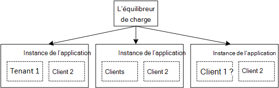

<properties
   pageTitle="Gestion des identités pour applications mutualisées | Microsoft Azure"
   description="Introduction à la gestion des identités dans les applications mutualisées"
   services=""
   documentationCenter="na"
   authors="MikeWasson"
   manager="roshar"
   editor=""
   tags=""/>

<tags
   ms.service="guidance"
   ms.devlang="dotnet"
   ms.topic="article"
   ms.tgt_pltfrm="na"
   ms.workload="na"
   ms.date="06/02/2016"
   ms.author="mwasson"/>

# Introduction à la gestion des identités pour applications mutualisées dans Microsoft Azure

[AZURE.INCLUDE [pnp-header](../../includes/guidance-pnp-header-include.md)]

Cet article fait [partie d’une série]. Il existe également un [exemple d’application] complète qui accompagne cette série.

Supposons que vous écrivez une application hébergée dans le nuage SaaS d’entreprise. Bien entendu, l’application des utilisateurs :

Mais les utilisateurs appartiennent à des organisations :

Exemple : Tailspin vend des abonnements à son application SaaS. Contoso et Fabrikam Inscrivez-vous à l’application. Lorsque Alice (`alice@contoso`) signe dans, l’application doit savoir qu’Alice est la partie de Contoso.

- Alice _doit_ avoir accès aux données de Contoso.
- Alice _ne devrait pas_ avoir accès aux données de Fabrikam.

Ce guide va vous montrer comment gérer les identités utilisateur dans une application partagée, à l’aide [d’Azure Active Directory] [ AzureAD] (AD Azure) pour gérer la connexion et l’authentification.

## Nouveautés multitenancy

Un _client_ est un groupe d’utilisateurs. Dans une application SaaS, le locataire soit un abonné ou un client de l’application. _L’architecture multilocataire_ est une architecture où différents utilisateurs partagent la même instance physique de l’application. Bien que les locataires partagent les ressources physiques (tels que les ordinateurs virtuels ou de stockage), chaque client obtient sa propre instance de logique de l’application.

En règle générale, les données d’application sont partagées entre les utilisateurs au sein d’un client, mais pas avec les autres locataires.

Comparez cette architecture avec une architecture mono-utilisateur, où chaque client a une instance physique dédiée. Dans une architecture mono-utilisateur, vous ajoutez des locataires en tournant les nouvelles instances de l’application.

### La mise à l’échelle horizontale et multitenancy

Pour parvenir à l’échelle dans le nuage, il est courant d’ajouter des instances de physiques. Il s’agit en tant que _mise à l’échelle horizontale_ et _l’évolution horizontale_. Imaginons une application web. Pour gérer davantage de trafic, vous pouvez ajouter un serveur de plusieurs ordinateurs virtuels et les placer derrière un équilibreur de charge. Chaque machine virtuelle exécute une instance physique distincte de l’application web.

Toutes les demandes peuvent être acheminés vers n’importe quelle instance. Ensemble, le système fonctionne comme une instance logique unique. Vous pouvez détruire une machine virtuelle ou tourner une nouvelle machine virtuelle, sans affecter les utilisateurs. Dans cette architecture, chaque instance physique est partagée, et vous mettre à l’échelle en ajoutant plusieurs instances. Si une seule instance tombe en panne, il ne devrait pas affecter les clients.

## Identité dans une application partagée

Dans une application partagée, vous devez tenir compte des utilisateurs dans le contexte des locataires.

**Authentification**

- Authentification des utilisateurs dans l’application avec leurs informations d’identification de l’organisation. Ils n’ont pas à créer de nouveaux profils d’utilisateur de l’application.
- Les utilisateurs au sein de la même organisation font partie du même locataire.
- Lorsqu’un utilisateur se connecte, l’application sait quels clients auquel appartient l’utilisateur.

**Autorisation**

- Lors de l’autorisation des actions de l’utilisateur (par exemple, afficher une ressource), l’application doit prendre en compte les clients de l’utilisateur.
- Les utilisateurs peuvent être attribués à des rôles dans l’application, comme « Admin » ou « Utilisateur Standard ». Attributions de rôles doivent être gérées par le client, pas par le fournisseur de SaaS.

**Exemple.** Alice, un employé de Contoso, accède à l’application dans son navigateur et clique sur le bouton « Connecter ». Il est redirigée vers un écran de connexion où il entre ses informations d’identification d’entreprise (nom d’utilisateur et mot de passe). À ce stade, il est enregistrée dans l’application en tant que `alice@contoso.com`. L’application sait également qu’Alice est un utilisateur de l’administrateur pour cette application. Dans la mesure où elle est un administrateur, elle peut voir une liste de toutes les ressources qui appartiennent à Contoso. Toutefois, elle ne peut pas afficher les ressources de Fabrikam, car elle est un administrateur uniquement au sein de ses clients.

Dans ce guide, nous allons étudier plus particulièrement à l’aide d’Active Directory Azure pour la gestion des identités.

- Nous supposons que le client stocke leurs profils utilisateur dans AD Azure (y compris les locataires Office 365 et Dynamics CRM)
- Clients avec sur site Active Directory (AD) peuvent utiliser [Azure Connect de AD] [ ADConnect] à synchroniser leur publicité sur site avec AD Azure.

Si un client sur site AD ne peut pas utiliser Azure Connect AD (en raison d’une stratégie d’informatique d’entreprise ou d’autres raisons), la fournisseur peut créer une fédération avec le client de SaaS's AD via Active Directory Federation Services (ADFS). Cette option est décrite dans [sa fédération avec AD FS un client].

Ce guide ne tient pas compte d’autres aspects de l’architecture multilocataire telles que le partitionnement des données, par client configuration et ainsi de suite.

## Étapes suivantes

- Lire le prochain article de cette série : [sur les enquêtes de Tailspin application][tailpin]

<!-- Links -->
[ADConnect]: ../active-directory/active-directory-aadconnect.md
[AzureAD]: https://azure.microsoft.com/documentation/services/active-directory/
[partie d’une série]: guidance-multitenant-identity.md
[Fédération avec AD FS un client]: guidance-multitenant-identity-adfs.md
[exemple d’application]: https://github.com/Azure-Samples/guidance-identity-management-for-multitenant-apps
[tailpin]: guidance-multitenant-identity-tailspin.md
