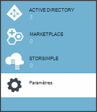
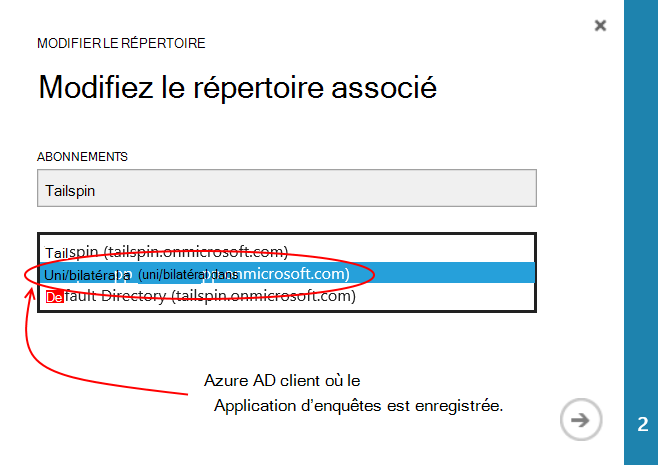
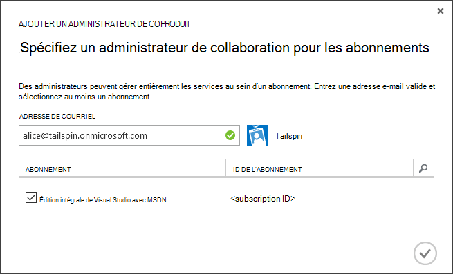
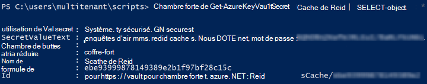

<properties
   pageTitle="À l’aide de la clé de stockage en chambre forte pour protéger la confidentialité de l’application | Microsoft Azure"
   description="Comment une utilisation le coffre-fort de la clé de service pour stocker des secrets de l’application"
   services=""
   documentationCenter="na"
   authors="MikeWasson"
   manager="roshar"
   editor=""
   tags=""/>

<tags
   ms.service="guidance"
   ms.devlang="dotnet"
   ms.topic="article"
   ms.tgt_pltfrm="na"
   ms.workload="na"
   ms.date="02/16/2016"
   ms.author="mwasson"/>

# <a name="using-azure-key-vault-to-protect-application-secrets"></a>À l’aide d’Azure, clé de chambre forte pour protéger la confidentialité de l’application

[AZURE.INCLUDE [pnp-header](../../includes/guidance-pnp-header-include.md)]

Cet article fait [partie d’une série]. Il existe également un [exemple d’application] complète qui accompagne cette série.

## <a name="overview"></a>Vue d’ensemble

Il est courant d’avoir des paramètres d’application sont sensibles et doivent être protégées, telles que :

- Chaînes de connexion de base de données
- Mots de passe
- Clés de chiffrement

Pour des raisons de sécurité, vous ne devez jamais stocker ces secrets dans le contrôle de code source. Il est trop facile de se perdre &mdash; même si votre référentiel de code source est privé. Et il n'est pas simplement le secret à partir de la public. Dans les projets plus importants, vous souhaiterez peut-être déterminer quels développeurs et opérateurs peuvent accéder les secrets de fabrication. (Pour les environnements de test ou de développement, les paramètres sont différents).

Une option la plus sûre est de stocker ces secrets dans [Azure clé coffre-fort][KeyVault]. Clé de stockage en chambre forte est un service hébergé sur le nuage pour la gestion des clés de chiffrement et d’autres données secrètes. Cet article explique comment utiliser le coffre-fort de la clé pour stocker des paramètres de configuration de l’application vous.

Dans les [Enquêtes de Tailspin] [ Surveys] application, les paramètres suivants sont secrètes :

- La chaîne de connexion de base de données.
- La chaîne de connexion Redis.
- Le secret de client de l’application web.

Pour stocker des secrets de configuration dans le coffre-fort de la clé, l’application d’enquêtes implémente un fournisseur de configuration personnalisé, qui raccorde le [système de configuration]ASP.NET Core 1.0[configuration]. Le fournisseur personnalisé lit les paramètres de configuration à partir de la clé de stockage en chambre forte au démarrage.

L’application d’enquêtes charge les paramètres de configuration à partir des emplacements suivants :

- Le fichier appsettings.json
- [Stockent des secrets de l’utilisateur] [ user-secrets] (environnement de développement pour les tests uniquement ;)
- L’environnement d’hébergement (paramètres de l’application dans les applications web Azure)
- Chambre forte de clé

Chacun de ces substitutions le, afin que les paramètres stockés dans la clé de stockage en chambre forte sont prioritaires.

> [AZURE.NOTE] Par défaut, le fournisseur de coffre-fort de la clé de configuration est désactivé. Il n’est pas nécessaire pour exécuter l’application localement. Vous devriez l’autoriser dans un déploiement de production.

> Le fournisseur de stockage en chambre forte de clé est actuellement pas pris en charge dans .NET, car elle nécessite la [Microsoft.Azure.KeyVault] [ Microsoft.Azure.KeyVault] package.

Au démarrage, l’application lit les paramètres de chaque fournisseur de configuration enregistrés et les utilise pour remplir un objet fortement typé d’options. (Pour plus d’informations, consultez [utilisation des Options et des objets de configuration][options].)

## <a name="implementation"></a>Mise en œuvre

La [KeyVaultConfigurationProvider] [ KeyVaultConfigurationProvider] classe est un fournisseur de configuration qui se branche dans le [système de configuration]ASP.NET Core 1.0[configuration].

Pour utiliser le `KeyVaultConfigurationProvider`, appelez le `AddKeyVaultSecrets` méthode d’extension dans la classe de démarrage :

```csharp
    var builder = new ConfigurationBuilder()
        .SetBasePath(appEnv.ApplicationBasePath)
        .AddJsonFile("appsettings.json");

    if (env.IsDevelopment())
    {
        builder.AddUserSecrets();
    }
    builder.AddEnvironmentVariables();
    var config = builder.Build();

    // Add key vault configuration:
    builder.AddKeyVaultSecrets(config["AzureAd:ClientId"],
        config["KeyVault:Name"],
        config["AzureAd:Asymmetric:CertificateThumbprint"],
        Convert.ToBoolean(config["AzureAd:Asymmetric:ValidationRequired"]),
        loggerFactory);
```

Notez que `KeyVaultConfigurationProvider` requiert certains paramètres de configuration, qui doivent être stockés dans un des autres sources de configuration.

Lorsque l’application démarre, `KeyVaultConfigurationProvider` énumère tous les secrets dans la chambre forte de clé. Pour chaque code secret, il recherche une étiquette nommée « ConfigKey ». La valeur de la balise est le nom du paramètre de configuration.

> [AZURE.NOTE] [Balises] [ key-tags] sont stockées avec une clé des métadonnées facultatives. Les balises sont utilisés ici, car les noms de clés ne peut pas contenir les caractères deux-points ( :).

```csharp
var kvClient = new KeyVaultClient(GetTokenAsync);
var secretsResponseList = await kvClient.GetSecretsAsync(_vault, MaxSecrets, token);
foreach (var secretItem in secretsResponseList.Value)
{
    //The actual config key is stored in a tag with the Key "ConfigKey"
    // because ':' is not supported in a shared secret name by Key Vault.
    if (secretItem.Tags != null && secretItem.Tags.ContainsKey(ConfigKey))
    {
        var secret = await kvClient.GetSecretAsync(secretItem.Id, token);
        Data.Add(secret.Tags[ConfigKey], secret.Value);
    }
}
```

> [AZURE.NOTE] Voir [KeyVaultConfigurationProvider.cs].

## <a name="setting-up-key-vault-in-the-surveys-app"></a>Configuration de coffre-fort de clé dans l’application d’enquêtes

Conditions préalables :

- Installer les [Applets de commande Gestionnaire de ressources Azure][azure-rm-cmdlets].
- Configurer l’application d’enquêtes, comme décrit dans [l’exécution de l’application des enquêtes][readme].

Étapes principales :

1. Configurer un utilisateur admin dans le locataire.
2. Permet de paramétrer un certificat client.
3. Créer un coffre-fort de clé.
4. Ajouter des paramètres de configuration à votre coffre-fort de clé.
5. Ne commentez pas le code qui permet la chambre forte de clé.
6. Mettre à jour les secrets d’utilisateur de l’application.

### <a name="set-up-an-admin-user"></a>Configurer un utilisateur admin

> [AZURE.NOTE] Pour créer un coffre-fort de clé, vous devez utiliser un compte qui peut gérer votre abonnement Azure. En outre, toutes les applications que vous autorisez à lire à partir de la chambre forte de clé doit être enregistré dans le même client que ce compte.

Dans cette étape, vous vous assurerez que vous pouvez créer un coffre-fort de clé lors d’une connexion en tant qu’utilisateur dans le client où l’application d’enquêtes est enregistrée.

Tout d’abord, modifiez le répertoire associé à votre abonnement Azure.

1. Ouvrez une session sur le [portail de gestion Azure][azure-management-portal]

2. Cliquez sur **paramètres**.

    

3. Sélectionnez votre abonnement Azure.

4. Cliquez sur **Modifier le répertoire** au bas du portail.

    

5. Dans « Modifier le répertoire associé », sélectionnez le locataire AD Azure où l’application d’enquêtes est enregistrée,

    

6. Cliquez sur la flèche et complétez la boîte de dialogue.

Créer un utilisateur admin cliente AD Azure où est enregistrée l’application d’enquêtes.

1. Connectez-vous au [portail de gestion Azure][azure-management-portal].

2. Sélectionnez le locataire AD Azure où votre candidature est enregistrée.

3. Cliquez sur **utilisateurs** > **Ajouter utilisateur**.

4. Dans la boîte de dialogue **Ajouter un utilisateur** , affectez l’utilisateur au rôle d’administrateur Global.

Ajoutez l’utilisateur admin en tant qu’un administrateur de collaboration pour votre abonnement Azure.

1. Connectez-vous au [portail de gestion Azure][azure-management-portal].

2. Cliquez sur **paramètres** et sélectionnez votre abonnement Azure.

3. Cliquez sur **administrateurs**

4. Cliquez sur **Ajouter** au bas du portail.

5. Entrez une adresse de l’utilisateur admin que vous avez créé précédemment.

6. Cochez la case de l’abonnement.

7. Cliquez sur le bouton coche pour compléter la boîte de dialogue.




### <a name="set-up-a-client-certificate"></a>Configurer un certificat client

1. Exécutez le script de PowerShell [/Scripts/Setup-KeyVault.ps1] [ Setup-KeyVault] comme suit :
    ```
    .\Setup-KeyVault.ps1 -Subject <<subject>>
    ```
    Pour le `Subject` paramètre, entrez un nom quelconque, par exemple « surveysapp ». Le script génère un certificat auto-signé et le stocke dans le magasin de certificats « utilisateur actuel/personnel ».

2. La sortie du script est un fragment JSON. Ajouter au manifeste d’application de l’application web, comme suit :

    1. Connectez-vous au [portail de gestion Azure] [ azure-management-portal] et naviguez jusqu'à votre répertoire AD Azure.

    2. Cliquez sur **Applications**.

    3. Sélectionnez l’application d’enquêtes.

    4.  Cliquez sur **Gérer le manifeste** et sélectionnez **Télécharger le manifeste**.

    5.  Dans un éditeur de texte, ouvrez le fichier manifeste de JSON. Coller la sortie à partir du script dans le `keyCredentials` propriété. Il doit ressembler à ce qui suit :
    ```
            "keyCredentials": [
                {
                  "type": "AsymmetricX509Cert",
                  "usage": "Verify",
                  "keyId": "29d4f7db-0539-455e-b708-....",
                  "customKeyIdentifier": "ZEPpP/+KJe2fVDBNaPNOTDoJMac=",
                  "value": "MIIDAjCCAeqgAwIBAgIQFxeRiU59eL.....
                }
              ],
    ```          
    6.  Enregistrez vos modifications dans le fichier JSON.

    7.  Revenez au portail. Cliquez sur **Gérer le manifeste** > **Manifeste de téléchargement** et de télécharger le fichier JSON.

3. Ajoutez le même fragment JSON au manifeste d’application du site web API (Surveys.WebAPI).

4. Exécutez la commande suivante pour obtenir l’empreinte numérique du certificat.
    ```
    certutil -store -user my [subject]
    ```
    où `[subject]` est la valeur que vous avez spécifié pour le sujet dans le script PowerShell. L’empreinte numérique est répertorié sous « Certificat hachage (SHA1) ». Supprimez les espaces entre les nombres hexadécimaux.

Vous utiliserez ultérieurement l’empreinte numérique.

### <a name="create-a-key-vault"></a>Créer un coffre-fort de clé

1. Exécutez le script de PowerShell [/Scripts/Setup-KeyVault.ps1] [ Setup-KeyVault] comme suit :

    ```
    .\Setup-KeyVault.ps1 -KeyVaultName <<key vault name>> -ResourceGroupName <<resource group name>> -Location <<location>>
    ```

    Lorsque vous y êtes invité pour les informations d’identification, connectez-vous en tant que l’utilisateur AD Azure que vous avez créé précédemment. Le script crée un nouveau groupe de ressources et un nouveau coffre-fort clé au sein de ce groupe de ressources.

    Remarque : pour du paramètre - Location, vous pouvez utiliser la commande PowerShell suivante pour obtenir la liste des régions valides :

    ```
    Get-AzureRmResourceProvider -ProviderNamespace "microsoft.keyvault" | Where-Object { $_.ResourceTypes.ResourceTypeName -eq "vaults" } | Select-Object -ExpandProperty Locations
    ```

2. Exécutez SetupKeyVault.ps à nouveau, avec les paramètres suivants :

    ```
    .\Setup-KeyVault.ps1 -KeyVaultName <<key vault name>> -ApplicationIds @("<<web app client ID>>", "<<web API client ID>>")
    ```

    où

    - nom de clé coffre-fort = le nom que vous avez donné le coffre-fort de clés à l’étape précédente.
    - Web application client ID = l’ID client pour l’application web enquêtes.
    - Web api client ID = l’ID client pour l’application Surveys.WebAPI.

    Exemple :
    ```
    .\Setup-KeyVault.ps1 -KeyVaultName tailspinkv -ApplicationIds @("f84df9d1-91cc-4603-b662-302db51f1031", "8871a4c2-2a23-4650-8b46-0625ff3928a6")
    ```

    > [AZURE.NOTE] Vous pouvez obtenir le client ID à partir du [portail de gestion Azure][azure-management-portal]. Sélectionnez le locataire AD Azure, sélectionnez l’application et cliquez sur **configurer**.

    Ce script autorise le web app et les API web pour extraire les secrets de votre coffre-fort de clé. Reportez-vous à la section [mise en route de la chambre forte de clé Azure] [ authorize-app] pour plus d’informations.

### <a name="add-configuration-settings-to-your-key-vault"></a>Ajouter des paramètres de configuration pour votre clé coffre-fort

1. Exécutez SetupKeyVault.ps comme suit :

    ```
    .\Setup-KeyVault.ps1 -KeyVaultName <<key vault name> -KeyName RedisCache -KeyValue "<<Redis DNS name>>.redis.cache.windows.net,password=<<Redis access key>>,ssl=true" -ConfigName "Redis:Configuration"
    ```
    où

    - nom de clé coffre-fort = le nom que vous avez donné le coffre-fort de clés à l’étape précédente.
    - Nom DNS de redis = le nom DNS de votre instance de cache Redis.
    - Touche d’accès rapide de redis = la touche d’accès rapide pour votre instance de cache Redis.

    Cette commande ajoute un secret pour clé vault. Le secret est une paire nom/valeur et une balise :

    -   Le nom de clé n’est pas utilisé par l’application, mais il doit être unique dans le coffre-fort de la clé.
    -   La valeur est la valeur de l’option de configuration, dans ce cas, la chaîne de connexion Redis.
    -   la balise « ConfigKey » conserve le nom de la clé de configuration.

2. À ce stade, il est judicieux de vérifier si vous avez enregistré avec succès les secrets de la chambre forte de clé. Exécutez la commande PowerShell suivante :

    ```
    Get-AzureKeyVaultSecret <<key vault name>> RedisCache | Select-Object *
    ```
    La sortie doit indiquer la valeur secrète ainsi que des métadonnées :

    

3. Exécutez SetupKeyVault.ps pour ajouter la chaîne de connexion de base de données :

    ```
    .\Setup-KeyVault.ps1 -KeyVaultName <<key vault name> -KeyName ConnectionString -KeyValue <<DB connection string>> -ConfigName "Data:SurveysConnectionString"
    ```

    où `<<DB connection string>>` est la valeur de la chaîne de connexion de base de données.

    Pour tester la base de données local, copiez la chaîne de connexion à partir du fichier Tailspin.Surveys.Web/appsettings.json. Si vous procédez ainsi, veillez à modifier la double barre oblique ('\\\\') dans une seule barre oblique inverse. La double barre oblique inverse est un caractère d’échappement dans le fichier JSON.

    Exemple :

    ```
    .\Setup-KeyVault.ps1 -KeyVaultName mykeyvault -KeyName ConnectionString -KeyValue "Server=(localdb)\MSSQLLocalDB;Database=Tailspin.SurveysDB;Trusted_Connection=True;MultipleActiveResultSets=true" -ConfigName "Data:SurveysConnectionString"
    ```

### <a name="uncomment-the-code-that-enables-key-vault"></a>Les commentaires du code qui permet le stockage en chambre forte de clé

1. Ouvrez la solution Tailspin.Surveys.

2. Dans [Tailspin.Surveys.Web/Startup.cs][web-startup], localisez le bloc de code suivant, et commentaire.

    ```csharp
    //#if DNX451
    //            _configuration = builder.Build();
    //            builder.AddKeyVaultSecrets(_configuration["AzureAd:ClientId"],
    //                _configuration["KeyVault:Name"],
    //                _configuration["AzureAd:Asymmetric:CertificateThumbprint"],
    //                Convert.ToBoolean(_configuration["AzureAd:Asymmetric:ValidationRequired"]),
    //                loggerFactory);
    //#endif
    ```

3. Dans [Tailspin.Surveys.WebAPI/Startup.cs][web-api-startup], localisez le bloc de code suivant, et commentaire.

    ```csharp
    //#if DNX451
    //            var config = builder.Build();
    //            builder.AddKeyVaultSecrets(config["AzureAd:ClientId"],
    //                config["KeyVault:Name"],
    //                config["AzureAd:Asymmetric:CertificateThumbprint"],
    //                Convert.ToBoolean(config["AzureAd:Asymmetric:ValidationRequired"]),
    //                loggerFactory);
    //#endif
    ```

4. Dans [Tailspin.Surveys.Web/Startup.cs][web-startup], recherchez le code qui enregistre la `ICredentialService`. Décommentez la ligne qui utilise `CertificateCredentialService`et commentez la ligne qui utilise `ClientCredentialService`:

    ```csharp
    // Uncomment this:
    services.AddSingleton<ICredentialService, CertificateCredentialService>();
    // Comment out this:
    //services.AddSingleton<ICredentialService, ClientCredentialService>();
    ```

    Cette modification permet à l’application web utiliser [l’assertion du Client] [ client-assertion] pour obtenir les jetons d’accès OAuth. Avec l’assertion du client, vous n’avez pas besoin un secret de client OAuth. Ou bien, vous pouvez stocker le secret du client dans la chambre forte de clé. Toutefois, clé coffre-fort et l’assertion du client qu'utilisent tous deux un client du certificat, si vous activez la clé coffre-fort, il est recommandé d’activer l’assertion du client ainsi.

### <a name="update-the-user-secrets"></a>Mettre à jour les secrets de l’utilisateur

Dans l’Explorateur de solutions, cliquez droit sur le projet Tailspin.Surveys.Web et sélectionnez **Gérer les Secrets des utilisateurs**. Dans le fichier secrets.json, supprimer le JSON existant et collez le texte suivant :

    ```
    {
      "AzureAd": {
        "ClientId": "[Surveys web app client ID]",
        "PostLogoutRedirectUri": "https://localhost:44300/",
        "WebApiResourceId": "[App ID URI of your Surveys.WebAPI application]",
        "Asymmetric": {
          "CertificateThumbprint": "[certificate thumbprint. Example: 105b2ff3bc842c53582661716db1b7cdc6b43ec9]",
          "StoreName": "My",
          "StoreLocation": "CurrentUser",
          "ValidationRequired": "false"
        }
      },
      "KeyVault": {
        "Name": "[key vault name]"
      }
    }
    ```

Remplacer les entrées [crochets] avec les valeurs correctes.

- `AzureAd:ClientId`: L’identifiant client de l’application d’enquêtes.
- `AzureAd:WebApiResourceId`: L’URI d’ID App que vous avez spécifié lorsque vous avez créé l’application Surveys.WebAPI dans Azure AD.
- `Asymmetric:CertificateThumbprint`: L’empreinte numérique du certificat que vous avez précédemment, lorsque vous avez créé le certificat client.
- `KeyVault:Name`: Le nom de votre coffre-fort de clé.

> [AZURE.NOTE] `Asymmetric:ValidationRequired`est faux car le certificat que vous avez créés précédemment n’a pas été signé par une autorité de certification racine (CA). Dans production, utiliser un certificat qui est signé par une autorité de certification racine et la valeur `ValidationRequired` sur true.

Enregistrez le fichier secrets.json mis à jour.

Ensuite, dans l’Explorateur de solutions, cliquez droit sur le projet Tailspin.Surveys.WebApi et sélectionnez **Gérer les Secrets des utilisateurs**. Supprimer l’existant JSON et collez le texte suivant :

```
{
  "AzureAd": {
    "ClientId": "[Surveys.WebAPI client ID]",
    "WebApiResourceId": "https://tailspin5.onmicrosoft.com/surveys.webapi",
    "Asymmetric": {
      "CertificateThumbprint": "[certificate thumbprint]",
      "StoreName": "My",
      "StoreLocation": "CurrentUser",
      "ValidationRequired": "false"
    }
  },
  "KeyVault": {
    "Name": "[key vault name]"
  }
}
```

Remplacer les entrées [crochets] et enregistrez le fichier secrets.json.

> [AZURE.NOTE] Pour l’API de web, assurez-vous d’utiliser l’ID client pour l’application de Surveys.WebAPI, pas l’application des enquêtes.


<!-- Links -->
[authorize-app]: ../key-vault/key-vault-get-started.md/#authorize
[azure-management-portal]: https://manage.windowsazure.com/
[azure-rm-cmdlets]: https://msdn.microsoft.com/library/mt125356.aspx
[client-assertion]: guidance-multitenant-identity-client-assertion.md
[configuration]: https://docs.asp.net/en/latest/fundamentals/configuration.html
[KeyVault]: https://azure.microsoft.com/services/key-vault/
[KeyVaultConfigurationProvider]: https://github.com/Azure-Samples/guidance-identity-management-for-multitenant-apps/blob/master/src/Tailspin.Surveys.Configuration.KeyVault/KeyVaultConfigurationProvider.cs
[key-tags]: https://msdn.microsoft.com/library/azure/dn903623.aspx#BKMK_Keytags
[Microsoft.Azure.KeyVault]: https://www.nuget.org/packages/Microsoft.Azure.KeyVault/
[options]: https://docs.asp.net/en/latest/fundamentals/configuration.html#using-options-and-configuration-objects
[readme]: https://github.com/Azure-Samples/guidance-identity-management-for-multitenant-apps/blob/master/docs/running-the-app.md
[Setup-KeyVault]: https://github.com/Azure-Samples/guidance-identity-management-for-multitenant-apps/blob/master/scripts/Setup-KeyVault.ps1
[Surveys]: guidance-multitenant-identity-tailspin.md
[user-secrets]: http://go.microsoft.com/fwlink/?LinkID=532709
[web-startup]: https://github.com/Azure-Samples/guidance-identity-management-for-multitenant-apps/blob/master/src/Tailspin.Surveys.Web/Startup.cs
[web-api-startup]: https://github.com/Azure-Samples/guidance-identity-management-for-multitenant-apps/blob/master/src/Tailspin.Surveys.WebAPI/Startup.cs
[partie d’une série]: guidance-multitenant-identity.md
[KeyVaultConfigurationProvider.cs]: https://github.com/Azure-Samples/guidance-identity-management-for-multitenant-apps/blob/master/src/Tailspin.Surveys.Configuration.KeyVault/KeyVaultConfigurationProvider.cs
[exemple d’application]: https://github.com/Azure-Samples/guidance-identity-management-for-multitenant-apps
