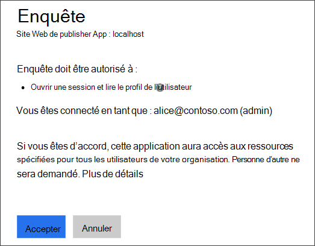
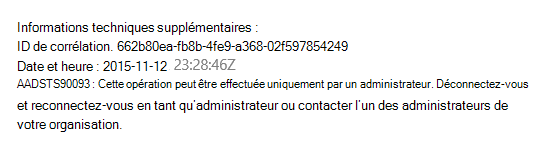
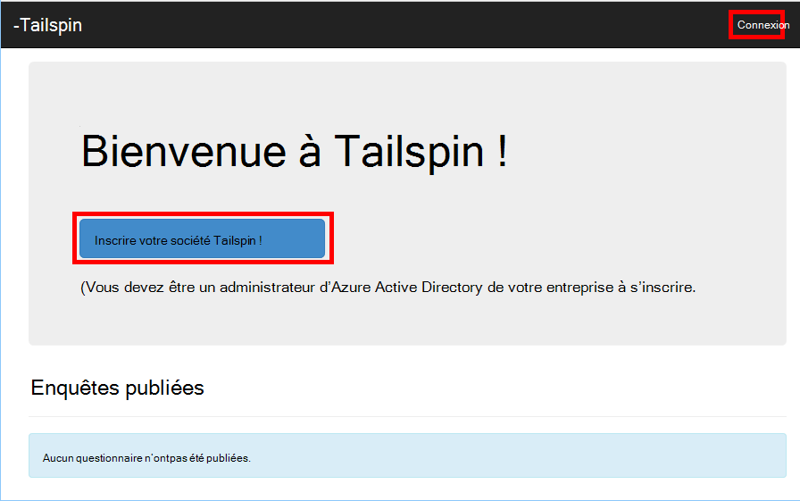
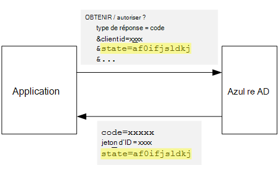
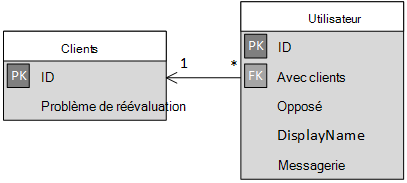

<properties
   pageTitle="Inscription et client arrivant dans les applications mutualisées | Microsoft Azure"
   description="Comment les locataires intégrés dans une application partagée"
   services=""
   documentationCenter="na"
   authors="MikeWasson"
   manager="roshar"
   editor=""
   tags=""/>

<tags
   ms.service="guidance"
   ms.devlang="dotnet"
   ms.topic="article"
   ms.tgt_pltfrm="na"
   ms.workload="na"
   ms.date="05/23/2016"
   ms.author="mwasson"/>

# <a name="sign-up-and-tenant-onboarding-in-a-multitenant-application"></a>Inscription et client arrivant dans une application partagée

[AZURE.INCLUDE [pnp-header](../../includes/guidance-pnp-header-include.md)]

Cet article fait [partie d’une série]. Il existe également un [exemple d’application] complète qui accompagne cette série.

Cet article explique comment implémenter un _abonnement à un_ processus dans une application partagée, ce qui permet à un client pour s’inscrire à leur organisation pour votre application.
Il existe plusieurs raisons pour implémenter un processus d’inscription :

-   Autoriser l’administrateur AD de consentement pour l’organisation du client entière à utiliser l’application.
-   Collecter le paiement par carte de crédit ou autres informations sur le client.
-   Installation des clients occasionnels requises par votre application.

## <a name="admin-consent-and-azure-ad-permissions"></a>Consentement de l’administration et les autorisations Active Directory Azure

Pour s’authentifier avec AD Azure, une application doit accéder au répertoire de l’utilisateur. Au minimum, l’application doit être autorisé à lire le profil de l’utilisateur. La première fois qu’un utilisateur se connecte, Azure AD affiche une page de consentement qui répertorie les autorisations demandées. En cliquant sur **Accepter**, l’utilisateur accorde l’autorisation de l’application.

Par défaut, l’autorisation est délivrée sur une base par utilisateur. Chaque utilisateur qui se connecte voit la page consentement. Toutefois, AD Azure prend également en charge le _consentement de l’administrateur_, qui permet à un administrateur de la publicité à donner son consentement pour toute une organisation.

Lorsque le flux de consentement admin est utilisé, la page consentement stipule que l’administrateur AD est l’octroi d’autorisation au nom du locataire entière :



Une fois que l’administrateur clique sur **Accepter**, aux autres utilisateurs dans le même client peuvent se connecter et AD Azure ignore l’écran accord.

Seul un administrateur AD peut donner de consentement de l’administration, car il accorde une autorisation pour le compte de l’ensemble de l’organisation. Si un utilisateur non-administrateur tente de s’authentifier avec le flux de consentement admin, Azure AD affiche une erreur :



Si l’application requiert des autorisations supplémentaires à un stade ultérieur, le client devra inscrire à nouveau et acceptez les autorisations mises à jour.  

## <a name="implementing-tenant-sign-up"></a>Mise en œuvre des clients d’abonnement

Pour les [Enquêtes de Tailspin] [ Tailspin] application, nous avons défini plusieurs conditions requises pour la procédure d’inscription :

-   Un client doit inscrire avant que les utilisateurs peuvent se connecter.
-   Inscription utilise le flux de consentement admin.
-   Inscription ajoute cliente de l’utilisateur à la base de données de l’application.
-   Une fois un client se connecte, l’application affiche une page de l’intégration.

Dans cette section, nous allons notre mise en oeuvre de la procédure d’inscription.
Il est important de comprendre que « s’inscrire » et « connexion » est un concept d’application. Pendant le flux d’authentification, Azure AD ne pas, par nature, sait si l’utilisateur est en cours d’inscription. Il est à l’application pour suivre le contexte.

Lorsqu’un utilisateur anonyme accède à l’application d’enquêtes, l’utilisateur est indiqués deux boutons, un pour vous connecter et un « inscrire votre société » (s’inscrire).



Ces boutons appellent des actions dans la classe [AccountController] .

Le `SignIn` action renvoie un **ChallegeResult**, qui entraîne le middleware OpenID connecter à rediriger vers le point de terminaison de l’authentification. Il s’agit de la méthode par défaut pour l’authentification de déclencheur dans ASP.NET Core 1.0.  

```csharp
[AllowAnonymous]
public IActionResult SignIn()
{
    return new ChallengeResult(
        OpenIdConnectDefaults.AuthenticationScheme,
        new AuthenticationProperties
        {
            IsPersistent = true,
            RedirectUri = Url.Action("SignInCallback", "Account")
        });
}
```

Comparer maintenant les `SignUp` action :

```csharp
[AllowAnonymous]
public IActionResult SignUp()
{
    // Workaround for https://github.com/aspnet/Security/issues/546
    HttpContext.Items.Add("signup", "true");

    var state = new Dictionary<string, string> { { "signup", "true" }};
    return new ChallengeResult(
        OpenIdConnectDefaults.AuthenticationScheme,
        new AuthenticationProperties(state)
        {
            RedirectUri = Url.Action(nameof(SignUpCallback), "Account")
        });
}
```

Comme `SignIn`, le `SignUp` action renvoie également un `ChallengeResult`. Mais cette fois, nous ajoutons une information d’état à la `AuthenticationProperties` dans les `ChallengeResult`:

-   inscription : un indicateur booléen, qui indique que l’utilisateur a lancé la procédure d’inscription.

Les informations d’état dans `AuthenticationProperties` est ajouté pour le paramètre [état] OpenID connecter, allers-retours pendant le flux d’authentification.



Une fois l’utilisateur authentifié dans Active Directory Azure et obtient redirigé vers l’application, le ticket d’authentification contient l’état. Nous utilisons ce fait pour vous assurer que la valeur de « inscription » est conservée dans le flux d’authentification.

## <a name="adding-the-admin-consent-prompt"></a>Ajout de l’administrateur de consentement

Dans AD Azure, le flux de consentement admin est déclenché en ajoutant un paramètre « demander » à la chaîne de requête dans la demande d’authentification :

```
/authorize?prompt=admin_consent&...
```

L’application d’enquêtes ajoute l’invite au cours de la `RedirectToAuthenticationEndpoint` événement. Cet événement est appelé juste avant que le middleware redirige vers le point de terminaison de l’authentification.

```csharp
public override Task RedirectToAuthenticationEndpoint(RedirectContext context)
{
    if (context.IsSigningUp())
    {
        context.ProtocolMessage.Prompt = "admin_consent";
    }

    _logger.RedirectToIdentityProvider();
    return Task.FromResult(0);
}
```

> [AZURE.NOTE] Voir [SurveyAuthenticationEvents.cs].

Définition de` ProtocolMessage.Prompt` indique le middleware pour ajouter le paramètre « invite » à la demande d’authentification.

Notez que l’invite n’est nécessaire pendant l’inscription. Reconnectez-vous régulière ne doit pas l’inclure. Pour faire la distinction entre eux, nous vérifions pour le `signup` valeur dans l’état d’authentification. La méthode d’extension suivante vérifie cette condition :

```csharp
internal static bool IsSigningUp(this BaseControlContext context)
{
    Guard.ArgumentNotNull(context, nameof(context));

    string signupValue;
    object obj;
    // Check the HTTP context and convert to string
    if (context.HttpContext.Items.TryGetValue("signup", out obj))
    {
        signupValue = (string)obj;
    }
    else
    {
        // It's not in the HTTP context, so check the authentication ticket.  If it's not there, we aren't signing up.
        if ((context.AuthenticationTicket == null) ||
            (!context.AuthenticationTicket.Properties.Items.TryGetValue("signup", out signupValue)))
        {
            return false;
        }
    }

    // We have found the value, so see if it's valid
    bool isSigningUp;
    if (!bool.TryParse(signupValue, out isSigningUp))
    {
        // The value for signup is not a valid boolean, throw                
        throw new InvalidOperationException($"'{signupValue}' is an invalid boolean value");
    }

    return isSigningUp;
}
```

> [AZURE.NOTE] Voir [BaseControlContextExtensions.cs].

> [AZURE.NOTE] Remarque : Ce code inclut une solution de contournement pour un problème connu dans ASP.NET Core 1.0 RC1. Dans le `RedirectToAuthenticationEndpoint` événement, il n’y a aucun moyen pour obtenir les propriétés d’authentification qui contient l’état de « inscription ». Pour résoudre ce problème, le `AccountController.SignUp` méthode met également à l’état « inscription » dans les `HttpContext`. Cela fonctionne car `RedirectToAuthenticationEndpoint` se produit avant la redirection, donc nous avons toujours le même `HttpContext`.

## <a name="registering-a-tenant"></a>Enregistrement d’un client

L’application d’enquêtes stocke des informations sur chaque client et utilisateur dans la base de données de l’application.



Dans la table clients, IssuerValue est la valeur de la créance de l’émetteur pour le client. Pour AD Azure, il s’agit de `https://sts.windows.net/<tentantID>` et donne une valeur unique par les clients.

Lorsqu’un nouveau client s’inscrit, l’application d’enquêtes écrit l’enregistrement client dans la base de données. Cela se produit à l’intérieur de la `AuthenticationValidated` événement. (Ne pas faire avant cet événement, car le jeton d’ID ne sont pas validé encore, afin que les valeurs de revendication ne peut pas confiance. Voir [authentification].

Voici le code à l’application des enquêtes :

```csharp
public override async Task AuthenticationValidated(AuthenticationValidatedContext context)
{
    var principal = context.AuthenticationTicket.Principal;
    var userId = principal.GetObjectIdentifierValue();
    var tenantManager = context.HttpContext.RequestServices.GetService<TenantManager>();
    var userManager = context.HttpContext.RequestServices.GetService<UserManager>();
    var issuerValue = principal.GetIssuerValue();
    _logger.AuthenticationValidated(userId, issuerValue);

    // Normalize the claims first.
    NormalizeClaims(principal);
    var tenant = await tenantManager.FindByIssuerValueAsync(issuerValue)
        .ConfigureAwait(false);

    if (context.IsSigningUp())
    {
        // Originally, we were checking to see if the tenant was non-null, however, this would not allow
        // permission changes to the application in AAD since a re-consent may be required.  Now we just don't
        // try to recreate the tenant.
        if (tenant == null)
        {
            tenant = await SignUpTenantAsync(context, tenantManager)
                .ConfigureAwait(false);
        }

        // In this case, we need to go ahead and set up the user signing us up.
        await CreateOrUpdateUserAsync(context.AuthenticationTicket, userManager, tenant)
            .ConfigureAwait(false);
    }
    else
    {
        if (tenant == null)
        {
            _logger.UnregisteredUserSignInAttempted(userId, issuerValue);
            throw new SecurityTokenValidationException($"Tenant {issuerValue} is not registered");
        }

        await CreateOrUpdateUserAsync(context.AuthenticationTicket, userManager, tenant)
            .ConfigureAwait(false);
    }
}
```

> [AZURE.NOTE] Voir [SurveyAuthenticationEvents.cs].

Ce code effectue les opérations suivantes :

1.  Vérifiez si émetteur valeur du locataire est déjà dans la base de données. Si le client n’a pas été signé, `FindByIssuerValueAsync` renvoie la valeur null.
2.  Si l’utilisateur s’inscrit :
  1.    Ajouter le client à la base de données (`SignUpTenantAsync`).
  2.    Ajouter l’utilisateur authentifié pour la base de données (`CreateOrUpdateUserAsync`).
3.  Dans le cas contraire, effectuez la connexion au flux normal :
  1.    Si l’émetteur du locataire n’a pas été trouvé dans la base de données, cela signifie que le locataire n’est pas enregistré, et le client doit s’inscrire. Dans ce cas, une exception pour provoquer l’échec de l’authentification.
  2.    Sinon, créez un enregistrement de base de données pour cet utilisateur, si il n’existe pas déjà (`CreateOrUpdateUserAsync`).

Voici la méthode [SignUpTenantAsync] ajoute le client à la base de données.

```csharp
private async Task<Tenant> SignUpTenantAsync(BaseControlContext context, TenantManager tenantManager)
{
    Guard.ArgumentNotNull(context, nameof(context));
    Guard.ArgumentNotNull(tenantManager, nameof(tenantManager));

    var principal = context.AuthenticationTicket.Principal;
    var issuerValue = principal.GetIssuerValue();
    var tenant = new Tenant
    {
        IssuerValue = issuerValue,
        Created = DateTimeOffset.UtcNow
    };

    try
    {
        await tenantManager.CreateAsync(tenant)
            .ConfigureAwait(false);
    }
    catch(Exception ex)
    {
        _logger.SignUpTenantFailed(principal.GetObjectIdentifierValue(), issuerValue, ex);
        throw;
    }

    return tenant;
}
```

Voici un résumé du flux entier d’inscription dans l’application d’enquêtes :

1.  L’utilisateur clique sur le bouton **Inscrire** .
2.  Le `AccountController.SignUp` action renvoie un résultat de mise.  L’état d’authentification inclut la valeur de « inscription ».
3.  Dans le `RedirectToAuthenticationEndpoint` événement, ajoutez le `admin_consent` invite.
4.  Le middleware OpenID connecter redirige vers Azure AD et que l’utilisateur s’authentifie.
5.  Dans la `AuthenticationValidated` événements, recherchez l’état « inscription ».
6.  Ajouter les clients à la base de données.

## <a name="next-steps"></a>Étapes suivantes

- Lire le prochain article de cette série : [les rôles d’Application dans les applications mutualisées][app roles]


<!-- Links -->
[app roles]: guidance-multitenant-identity-app-roles.md
[Tailspin]: guidance-multitenant-identity-tailspin.md
[partie d’une série]: guidance-multitenant-identity.md
[AccountController]: https://github.com/Azure-Samples/guidance-identity-management-for-multitenant-apps/blob/master/src/Tailspin.Surveys.Web/Controllers/AccountController.cs
[état]: http://openid.net/specs/openid-connect-core-1_0.html#AuthRequest
[SurveyAuthenticationEvents.cs]: https://github.com/Azure-Samples/guidance-identity-management-for-multitenant-apps/blob/master/src/Tailspin.Surveys.Web/Security/SurveyAuthenticationEvents.cs
[BaseControlContextExtensions.cs]: https://github.com/Azure-Samples/guidance-identity-management-for-multitenant-apps/blob/master/src/Tailspin.Surveys.Web/Security/BaseControlContextExtensions.cs
[Authentification]: guidance-multitenant-identity-authenticate.md
[SignUpTenantAsync]: https://github.com/Azure-Samples/guidance-identity-management-for-multitenant-apps/blob/master/src/Tailspin.Surveys.Web/Security/SurveyAuthenticationEvents.cs
[exemple d’application]: https://github.com/Azure-Samples/guidance-identity-management-for-multitenant-apps
