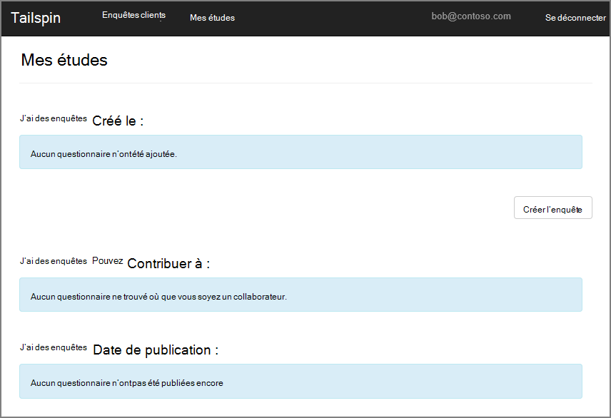
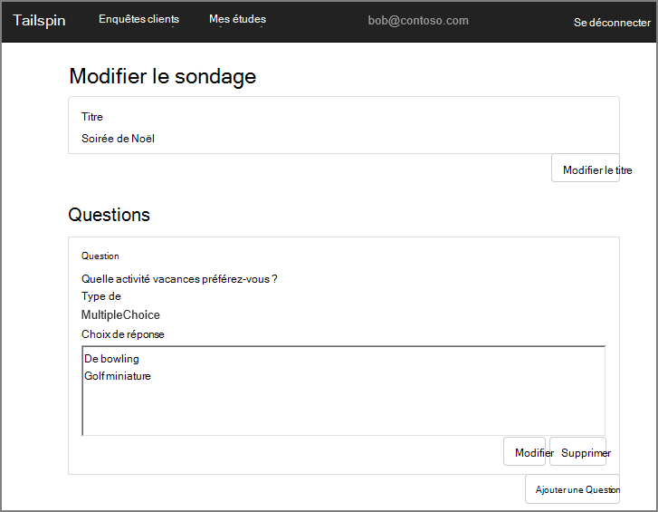
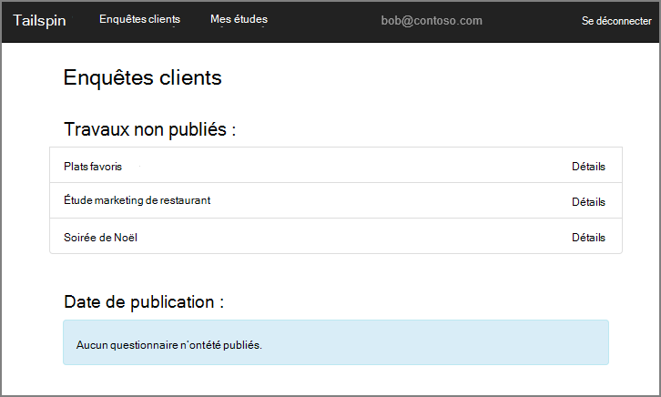
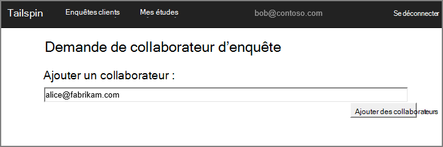
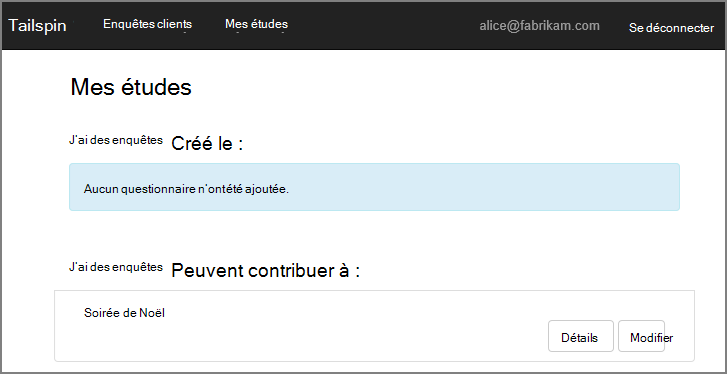
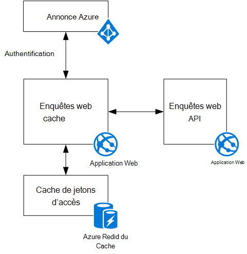

<properties
   pageTitle="À propos de l’application Tailspin enquêtes | Microsoft Azure"
   description="Présentation de l’application Tailspin enquêtes"
   services=""
   documentationCenter="na"
   authors="MikeWasson"
   manager="roshar"
   editor=""
   tags=""/>

<tags
   ms.service="guidance"
   ms.devlang="dotnet"
   ms.topic="article"
   ms.tgt_pltfrm="na"
   ms.workload="na"
   ms.date="05/23/2016"
   ms.author="mwasson"/>

# À propos de l’application Tailspin enquêtes

[AZURE.INCLUDE [pnp-header](../../includes/guidance-pnp-header-include.md)]

Cet article fait [partie d’une série]. Il existe également un [exemple d’application] complète qui accompagne cette série.

Tailspin est une société fictive qui développe une application SaaS nommée enquêtes. Cette application permet aux entreprises de créer et de publier des enquêtes en ligne.

- Une organisation peut s’inscrire pour l’application.
- Une fois que l’organisation est inscrit, les utilisateurs peuvent signer dans l’application avec leurs informations d’identification d’organisation.
- Les utilisateurs peuvent créer, modifier et publier des enquêtes.

> [AZURE.NOTE] Pour vous familiariser avec l’application, consultez [exécution de l’application d’enquêtes].

## Les utilisateurs peuvent créer, modifier et afficher des enquêtes

Un utilisateur authentifié peut afficher toutes les enquêtes qu’il a créé ou possède les droits Collaborateur sur et créer de nouvelles enquêtes. Notez que l’utilisateur est connecté à l’aide de son identité d’organisation, `bob@contoso.com`.

Cette capture d’écran montre la page Modifier l’enquête :

Les utilisateurs peuvent également afficher les enquêtes créés par d’autres utilisateurs cliente même.

## Propriétaires d’étude peuvent inviter des collaborateurs

Lorsqu’un utilisateur crée une enquête, il ou elle peut inviter d’autres personnes comme des contributeurs de l’enquête. Les collaborateurs peuvent modifier l’enquête, mais ne peut pas supprimer ou publiez-le.  

Un utilisateur peut ajouter des collaborateurs à partir d’autres locataires, qui permet le partage des cross-locataire des ressources. Dans cette capture d’écran, Bob (`bob@contoso.com`) consiste à ajouter Alice (`alice@fabrikam.com`) en tant que collaborateur à une enquête que Bob est créé.

Lorsque Alice se connecte, elle voit l’enquête répertorié sous « Je peux contribuer à des enquêtes ».

Notez que Alice se connecte ses propres clients, pas en tant qu’invité du locataire Contoso. Alice possède des autorisations de collaborateur uniquement pour cette enquête &mdash; elle ne peut pas afficher d’autres enquêtes le locataire Contoso.

## Architecture

L’application d’enquêtes se compose d’un serveur web frontal et un back-end de l’API web. Les deux sont implémentés à l’aide de [ASP.NET Core 1.0].

L’application web utilise Azure Active Directory (AD Azure) pour authentifier les utilisateurs. L’application web appelle également AD Azure pour obtenir les jetons d’accès OAuth 2 pour l’API Web. Les jetons d’accès sont mises en cache dans le Cache de Redis Azure. Le cache permet à plusieurs instances de partager le même cache de jetons (par exemple, dans une batterie de serveurs).

## Étapes suivantes

- Lire le prochain article de cette série : [l’authentification dans les applications mutualisées, à l’aide d’Azure Active Directory et connecter des OpenID][authentication]

<!-- Links -->

[authentication]: guidance-multitenant-identity-authenticate.md
[partie d’une série]: guidance-multitenant-identity.md
[Exécution de l’application d’enquêtes]: https://github.com/Azure-Samples/guidance-identity-management-for-multitenant-apps/blob/master/docs/running-the-app.md
[Noyau d’ASP.NET 1.0]: https://docs.asp.net/en/latest/
[exemple d’application]: https://github.com/Azure-Samples/guidance-identity-management-for-multitenant-apps
