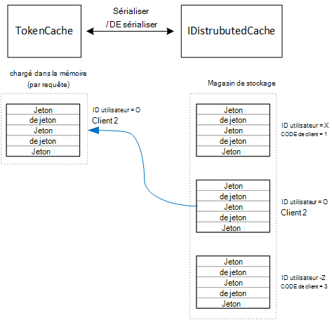

<properties
   pageTitle="La mise en cache des jetons d’accès dans une application mutualisée | Microsoft Azure"
   description="La mise en cache des jetons d’accès utilisées pour appeler un API Web de back-end"
   services=""
   documentationCenter="na"
   authors="MikeWasson"
   manager="roshar"
   editor=""
   tags=""/>

<tags
   ms.service="guidance"
   ms.devlang="dotnet"
   ms.topic="article"
   ms.tgt_pltfrm="na"
   ms.workload="na"
   ms.date="02/16/2016"
   ms.author="mwasson"/>


# <a name="caching-access-tokens-in-a-multitenant-application"></a>La mise en cache des jetons d’accès dans une application partagée

[AZURE.INCLUDE [pnp-header](../../includes/guidance-pnp-header-include.md)]

Cet article fait [partie d’une série]. Il existe également un [exemple d’application] complète qui accompagne cette série.

Il est relativement coûteux d’obtenir un accès OAuth jeton, car elle requiert une demande HTTP pour le point de terminaison de jeton. Par conséquent, il est bon de jetons de cache lorsque cela est possible. La [Bibliothèque d’authentification AD Azure] [ ADAL] (ADAL) met automatiquement en cache les jetons obtenus à partir d’AD Azure, y compris des jetons de rafraîchissement.

ADAL fournit une implémentation de cache de jetons par défaut. Cependant, ce cache de jetons est conçu pour les applications client natif et est _pas_ approprié pour les applications web :

-   Il s’agit d’une instance statique et pas thread-safe.
-   Il n’évolue pas à un grand nombre d’utilisateurs, car les jetons de tous les utilisateurs passent dans le même dictionnaire.
-   Il ne peut pas être partagé entre les serveurs web dans une batterie de serveurs.

Au lieu de cela, vous devez implémenter un cache de jeton personnalisé qui dérive de la ADAL `TokenCache` classe mais est adaptée à un environnement de serveur ainsi que le niveau d’isolation entre les jetons pour différents utilisateurs.

Le `TokenCache` classe stocke un dictionnaire de jetons, indexée par l’émetteur, les ressources, les ID client et utilisateur. Un cache de jeton personnalisé doit écrire ce dictionnaire dans un magasin de sauvegarde, tel qu’un cache de Redis.

Dans l’application Tailspin enquêtes, les `DistributedTokenCache` classe implémente le cache de jetons. Cette implémentation utilise [IDistributedCache] [ distributed-cache] l’abstraction de 1.0 de base ASP.NET. De cette façon, les `IDistributedCache` mise en œuvre peut être utilisé comme magasin de sauvegarde.

-   Par défaut, l’application d’enquêtes utilise un cache de Redis.
-   Pour un serveur web d’instance unique, vous pouvez utiliser le [cache en mémoire]de 1.0 de base ASP.NET[in-memory-cache]. (Cela est également une bonne option pour l’exécution de l’application localement au cours du développement.)

> [AZURE.NOTE] Le cache Redis n’est actuellement pas pris en charge dans .NET.

`DistributedTokenCache`stocke les données du cache sous forme de paires clé/valeur dans le magasin de sauvegarde. La clé est l’ID utilisateur et ID client, afin que le magasin de sauvegarde conserve des données de cache distinct pour chaque combinaison unique de client/utilisateur.



Le magasin de sauvegarde est partitionné par utilisateur. Pour chaque demande HTTP, les jetons de cet utilisateur sont lues à partir du magasin de stockage et chargés dans le `TokenCache` dictionnaire. Si Redis est utilisé comme magasin de stockage, chaque instance de serveur d’une batterie de serveurs lectures/écritures sur le cache même et cette approche s’adapte à de nombreux utilisateurs.

## <a name="encrypting-cached-tokens"></a>Jetons de mise en cache EFS

Les jetons sont des données sensibles, car leur accordent l’accès aux ressources de l’utilisateur. (En outre, contrairement à un mot de passe, vous ne peut pas simplement stocker un hachage du jeton.) Par conséquent, il est essentiel pour protéger les jetons d’être compromis. La mémoire cache Redis est protégé par un mot de passe, mais si quelqu'un obtient le mot de passe, le client pourrait obtenir tous les jetons d’accès mis en cache. Pour cette raison, le `DistributedTokenCache` crypte tout ce qu’il écrit dans le magasin de sauvegarde. Le chiffrement est effectué à l’aide de la [protection des données] de ASP.NET Core 1.0[ data-protection] API.

> [AZURE.NOTE] Si vous déployez sur les Sites Web Azure, les clés de cryptage sont sauvegardées sur un stockage en réseau et synchronisés sur tous les ordinateurs (voir [Gestion des clés][key-management]). Par défaut, les clés ne sont pas cryptées lors de l’exécution dans des Sites Web Azure, mais vous pouvez [Activer le cryptage à l’aide d’un certificat X.509][x509-cert-encryption].


## <a name="distributedtokencache-implementation"></a>Implémentation de DistributedTokenCache

La [DistributedTokenCache] [ DistributedTokenCache] classe dérive de la ADAL [TokenCache] [ tokencache-class] classe.

Dans le constructeur, le `DistributedTokenCache` classe crée une clé pour l’utilisateur actuel et charge le cache à partir du magasin de stockage :

```csharp
public DistributedTokenCache(
    ClaimsPrincipal claimsPrincipal,
    IDistributedCache distributedCache,
    ILoggerFactory loggerFactory,
    IDataProtectionProvider dataProtectionProvider)
    : base()
{
    _claimsPrincipal = claimsPrincipal;
    _cacheKey = BuildCacheKey(_claimsPrincipal);
    _distributedCache = distributedCache;
    _logger = loggerFactory.CreateLogger<DistributedTokenCache>();
    _protector = dataProtectionProvider.CreateProtector(typeof(DistributedTokenCache).FullName);
    AfterAccess = AfterAccessNotification;
    LoadFromCache();
}
```

La clé est créée en concaténant l’ID utilisateur et un ID de client. Ces deux éléments sont prises à partir de la demande de l’utilisateur `ClaimsPrincipal`:

```csharp
private static string BuildCacheKey(ClaimsPrincipal claimsPrincipal)
{
    string clientId = claimsPrincipal.FindFirstValue("aud", true);
    return string.Format(
        "UserId:{0}::ClientId:{1}",
        claimsPrincipal.GetObjectIdentifierValue(),
        clientId);
}
```

Pour charger les données du cache, lire le blob sérialisé à partir du magasin de sauvegarde, puis appeler `TokenCache.Deserialize` pour convertir le blob de données du cache.

```csharp
private void LoadFromCache()
{
    byte[] cacheData = _distributedCache.Get(_cacheKey);
    if (cacheData != null)
    {
        this.Deserialize(_protector.Unprotect(cacheData));
    }
}
```

Il se déclenche à chaque fois que ADAL accéder au cache, un `AfterAccess` événement. Si les données du cache a été modifiée, le `HasStateChanged` propriété a la valeur true. Dans ce cas, mise à jour de magasin de stockage pour refléter la modification et puis définissez `HasStateChanged` sur false.

```csharp
public void AfterAccessNotification(TokenCacheNotificationArgs args)
{
    if (this.HasStateChanged)
    {
        try
        {
            if (this.Count > 0)
            {
                _distributedCache.Set(_cacheKey, _protector.Protect(this.Serialize()));
            }
            else
            {
                // There are no tokens for this user/client, so remove the item from the cache.
                _distributedCache.Remove(_cacheKey);
            }
            this.HasStateChanged = false;
        }
        catch (Exception exp)
        {
            _logger.WriteToCacheFailed(exp);
            throw;
        }
    }
}
```

TokenCache envoie deux autres événements :

- `BeforeWrite`. Appelée juste avant la ADAL écrit dans le cache. Vous pouvez l’utiliser pour mettre en œuvre une stratégie d’accès concurrentiel
- `BeforeAccess`. Appelée juste avant la ADAL lit à partir du cache. Ici, vous pouvez recharger le cache pour obtenir la version la plus récente.

Dans notre cas, nous avons décidé de ne pas gérer ces deux événements.

- Accès concurrentiel, la dernière écriture wins. C’est OK, car les jetons sont stockés séparément pour chaque utilisateur + du client, pour un conflit produirait uniquement si l’utilisateur avait deux sessions de connexion simultanées.
- Pour la lecture, nous charger le cache à chaque demande. Les demandes sont de courte durée de vie. Si le cache est modifié dans ce délai, la demande suivante récupérera automatiquement la nouvelle valeur.

## <a name="next-steps"></a>Étapes suivantes

- Lire le prochain article de cette série : [sa fédération avec AD FS un client pour applications mutualisées dans Azure][adfs]

<!-- links -->
[ADAL]: https://msdn.microsoft.com/library/azure/jj573266.aspx
[adfs]: guidance-multitenant-identity-adfs.md
[data-protection]: https://docs.asp.net/en/latest/security/data-protection/index.html
[distributed-cache]: https://docs.asp.net/en/latest/fundamentals/distributed-cache.html
[DistributedTokenCache]: https://github.com/Azure-Samples/guidance-identity-management-for-multitenant-apps/blob/master/src/Tailspin.Surveys.TokenStorage/DistributedTokenCache.cs
[key-management]: https://docs.asp.net/en/latest/security/data-protection/configuration/default-settings.html
[in-memory-cache]: https://docs.asp.net/en/latest/fundamentals/caching.html
[tokencache-class]: https://msdn.microsoft.com/library/azure/microsoft.identitymodel.clients.activedirectory.tokencache.aspx
[x509-cert-encryption]: https://docs.asp.net/en/latest/security/data-protection/implementation/key-encryption-at-rest.html#x-509-certificate
[partie d’une série]: guidance-multitenant-identity.md
[exemple d’application]: https://github.com/Azure-Samples/guidance-identity-management-for-multitenant-apps
