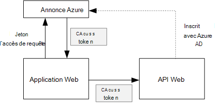
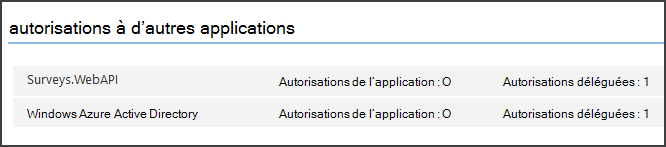

<properties
   pageTitle="Sécurisation d’une API de web back-end dans une application mutualisée | Microsoft Azure"
   description="Comment faire pour sécuriser une API de web back-end"
   services=""
   documentationCenter="na"
   authors="MikeWasson"
   manager="roshar"
   editor=""
   tags=""/>

<tags
   ms.service="guidance"
   ms.devlang="dotnet"
   ms.topic="article"
   ms.tgt_pltfrm="na"
   ms.workload="na"
   ms.date="06/02/2016"
   ms.author="mwasson"/>

# <a name="securing-a-backend-web-api-in-a-multitenant-application"></a>Sécurisation d’une API de web back-end dans une application partagée

[AZURE.INCLUDE [pnp-header](../../includes/guidance-pnp-header-include.md)]

Cet article fait [partie d’une série]. Il existe également un [exemple d’application] complète qui accompagne cette série.

L’application [Tailspin enquêtes] utilise une API du back-end web pour gérer les opérations CRUD sur les enquêtes. Par exemple, lorsqu’un utilisateur clique sur « Mes études », l’application web envoie une requête HTTP sur le web API :

```
GET /users/{userId}/surveys
```

L’API de web renvoie un objet JSON :

```
{
  "Published":[],
  "Own":[
    {"Id":1,"Title":"Survey 1"},
    {"Id":3,"Title":"Survey 3"},
    ],
  "Contribute": [{"Id":8,"Title":"My survey"}]
}
```

L’API de web n’autorise pas les demandes anonymes, afin que l’application web doit s’authentifier à l’aide des jetons de support OAuth 2.

> [AZURE.NOTE] Il s’agit d’un scénario de serveur à serveur. L’application n’effectue pas les appels AJAX à l’API à partir du client de navigateur.

Il existe deux approches principales que vous pouvez prendre :

- Identité de l’utilisateur délégué. L’application web authentifie avec l’identité de l’utilisateur.
- Identité de l’application. L’application web authentifie avec son ID de client, à l’aide de flux d’informations d’identification des clients OAuth2.

L’application Tailspin implémente l’identité de l’utilisateur délégué. Voici les principales différences :

**Identité de l’utilisateur délégué**

- Le jeton de support envoyé à l’API web contient l’identité de l’utilisateur.
- L’API de web rend les décisions d’autorisation basées sur l’identité de l’utilisateur.
- L’application web a besoin gérer les 403 erreurs (refusé) à partir du web, API, si l’utilisateur n’est pas autorisé à effectuer une action.
- En général, l’application web toujours prend des décisions d’autorisation qui affectent l’interface utilisateur, telles que l’affichage ou le masquage des éléments d’interface utilisateur).
- L’API web peut potentiellement être utilisé par des clients non approuvés, par exemple une application JavaScript ou une application de client natif.

**Identité de l’application**

- L’API de web n’obtient pas d’informations sur l’utilisateur.
- L’API de web ne peut pas effectuer une autorisation basée sur l’identité de l’utilisateur. Toutes les décisions d’autorisation sont effectuées par l’application web.  
- L’API de web ne peut pas être utilisée par un client non approuvé (application cliente natif ou JavaScript).
- Cette approche peut être un peu plus simple à implémenter, car il n’existe aucune logique d’autorisation dans l’API Web.

Dans les deux approches, l’application web doit obtenir un jeton d’accès, les informations d’identification nécessaires pour appeler l’API web.

- Pour l’identité de l’utilisateur délégué, le jeton doit provenir de la IDP, ce qui permet d’émettre un jeton de la part de l’utilisateur.

- Pour des informations d’identification du client, une application peut obtenir le jeton de la IDP ou héberge son propre serveur de jeton. (Mais ne pas écrire un serveur de jeton à partir de rien ; utilisation d’une infrastructure bien testée comme [IdentityServer3].) Si vous authentifiez avec AD Azure, il est fortement recommandé pour obtenir le jeton d’accès à partir d’AD Azure, même avec les flux d’informations d’identification de client.

Le reste de cet article suppose que l’application s’authentifie avec AD Azure.



## <a name="register-the-web-api-in-azure-ad"></a>Enregistrer le web API dans Azure AD

Pour émettre un jeton de support pour le web API Azure annonce, vous devez configurer certaines choses dans Azure AD.

1. [Enregistrer le web API dans Azure AD].

2. Ajouter l’ID client de l’application web pour le manifeste d’application web API dans le `knownClientApplications` propriété. Consultez [les manifestes de l’application de mise à jour].

3. [Donner l’autorisation d’application web pour appeler l’API web].

  Dans le portail de gestion Azure, vous pouvez définir deux types d’autorisations : « Application d’autorisations » pour l’identité de l’application (flux d’informations d’identification de client), ou « Autorisations de délégué » pour l’identité de l’utilisateur délégué.

  

## <a name="getting-an-access-token"></a>L’obtention d’un jeton d’accès

Avant d’appeler le API web, l’application web Obtient un accès à un jeton d’Active Directory Azure. Dans une application .NET, utilisez l' [Azure AD authentification Library (ADAL) pour .NET][ADAL].

Dans le flux de code d’autorisation OAuth 2, l’application échange un code d’autorisation pour un jeton d’accès. Le code suivant utilise ADAL pour obtenir le jeton d’accès. Ce code est appelé au cours de la `AuthorizationCodeReceived` événement.

```csharp
// The OpenID Connect middleware sends this event when it gets the authorization code.   
public override async Task AuthorizationCodeReceived(AuthorizationCodeReceivedContext context)
{
    string authorizationCode = context.ProtocolMessage.Code;
    string authority = "https://login.microsoftonline.com/" + tenantID
    string resourceID = "https://tailspin.onmicrosoft.com/surveys.webapi" // App ID URI
    ClientCredential credential = new ClientCredential(clientId, clientSecret);

    AuthenticationContext authContext = new AuthenticationContext(authority, tokenCache);
    AuthenticationResult authResult = await authContext.AcquireTokenByAuthorizationCodeAsync(
        authorizationCode, new Uri(redirectUri), credential, resourceID);

    // If successful, the token is in authResult.AccessToken
}
```

Voici les différents paramètres sont nécessaires :

- `authority`. Dérivés de l’ID client de l’utilisateur connecté. (Et non l’ID de client du fournisseur de SaaS)  
- `authorizationCode`. le code d’authentification que vous avez l’IDP.
- `clientId`. ID de client de. l’application web
- `clientSecret`. Secret de client de l’application web.
- `redirectUri`. La redirection URI que vous définissez pour OpenID se connecter. Voici où la IDP rappelle avec le jeton.
- `resourceID`. L’URI ID App de l’API, de site web que vous avez créé lorsque vous avez enregistré le web API dans Azure AD
- `tokenCache`. Un objet qui met en cache des jetons d’accès. Reportez-vous à la section [mise en cache des jetons].

Si `AcquireTokenByAuthorizationCodeAsync` réussit, ADAL met en cache le jeton. Ultérieurement, vous pouvez obtenir le jeton à partir du cache en appelant AcquireTokenSilentAsync :

```csharp
AuthenticationContext authContext = new AuthenticationContext(authority, tokenCache);
var result = await authContext.AcquireTokenSilentAsync(resourceID, credential, new UserIdentifier(userId, UserIdentifierType.UniqueId));
```

où `userId` est l’ID d’objet de l’utilisateur, qui se trouve dans le `http://schemas.microsoft.com/identity/claims/objectidentifier` de revendication.

## <a name="using-the-access-token-to-call-the-web-api"></a>À l’aide du jeton d’accès pour appeler le API web

Une fois que vous avez le jeton, envoyer dans l’en-tête d’autorisation des demandes HTTP à l’API web.

```
Authorization: Bearer xxxxxxxxxx
```

La méthode d’extension suivante à partir de l’application d’enquêtes définit l’en-tête d’autorisation sur une demande HTTP, à l’aide de la classe **HttpClient** .

```csharp
public static async Task<HttpResponseMessage> SendRequestWithBearerTokenAsync(this HttpClient httpClient, HttpMethod method, string path, object requestBody, string accessToken, CancellationToken ct)
{
    var request = new HttpRequestMessage(method, path);
    if (requestBody != null)
    {
        var json = JsonConvert.SerializeObject(requestBody, Formatting.None);
        var content = new StringContent(json, Encoding.UTF8, "application/json");
        request.Content = content;
    }

    request.Headers.Authorization = new AuthenticationHeaderValue("Bearer", accessToken);
    request.Headers.Accept.Add(new MediaTypeWithQualityHeaderValue("application/json"));

    var response = await httpClient.SendAsync(request, ct);
    return response;
}
```

> [AZURE.NOTE] Voir [HttpClientExtensions.cs].

## <a name="authenticating-in-the-web-api"></a>L’authentification du site Web API

L’API de web doit authentifier le jeton de support. Dans ASP.NET 1.0 de base, vous pouvez utiliser la [Microsoft.AspNet.Authentication.JwtBearer] [ JwtBearer] package. Ce package fournit des logiciels intermédiaires qui permet à l’application recevoir des jetons de support OpenID de se connecter.

Enregistrer les logiciels intermédiaires dans votre site web API `Startup` classe.

```csharp
app.UseJwtBearerAuthentication(options =>
{
    options.Audience = "[app ID URI]";
    options.Authority = "https://login.microsoftonline.com/common/";
    options.TokenValidationParameters = new TokenValidationParameters
    {
        //Instead of validating against a fixed set of known issuers, we perform custom multi-tenant validation logic
        ValidateIssuer = false,
    };
    options.Events = new SurveysJwtBearerEvents();
});
```

> [AZURE.NOTE] Voir [Startup.cs].

- **Public**. Définir l’URL d’ID App pour le web API, que vous avez créé lorsque vous avez enregistré le web API avec AD Azure.
- **Autorité**. Pour une application partagée, indiquez ce `https://login.microsoftonline.com/common/`.
- **TokenValidationParameters**. Pour une application partagée, définissez **ValidateIssuer** sur false. Cela signifie que l’application contrôlera l’émetteur.
- **Événements** est une classe qui dérive de **JwtBearerEvents**.

### <a name="issuer-validation"></a>Validation de l’émetteur

Valider l’émetteur de jeton dans l’événement **JwtBearerEvents.ValidatedToken** . L’émetteur est envoyé dans la demande de « iss ».

Dans l’application d’enquêtes, [d’inscription de clients]ne gère pas l’API web. Par conséquent, il se contente de vérifier si l’émetteur est déjà dans la base de données de l’application. Si ce n’est pas le cas, elle lève une exception, ce qui entraîne l’échec de l’authentification.

```csharp
public override async Task ValidatedToken(ValidatedTokenContext context)
{
    var principal = context.AuthenticationTicket.Principal;
    var tenantManager = context.HttpContext.RequestServices.GetService<TenantManager>();
    var userManager = context.HttpContext.RequestServices.GetService<UserManager>();
    var issuerValue = principal.GetIssuerValue();
    var tenant = await tenantManager.FindByIssuerValueAsync(issuerValue);

    if (tenant == null)
    {
        // the caller was not from a trusted issuer - throw to block the authentication flow
        throw new SecurityTokenValidationException();
    }
}
```

> [AZURE.NOTE] Voir [SurveysJwtBearerEvents.cs].

Vous pouvez également utiliser l’événement **ValidatedToken** pour effectuer la [transformation des déclarations]. Gardez à l’esprit que les revendications proviennent directement des annonces Azure, afin que si l’application web fait aucune transformation des revendications, ceux ne sont pas répercutées dans le jeton de support que l’API web reçoit.

## <a name="authorization"></a>Autorisation

Pour une présentation générale de l’autorisation, consultez [autorisation basée sur les rôles et basée sur les ressources][Authorization]. 

Le middleware JwtBearer gère les réponses d’autorisation. Par exemple, pour restreindre une action de contrôleur pour les utilisateurs authentifiés, utiliser l’atrribute **[autoriser]** et spécifiez **JwtBearerDefaults.AuthenticationScheme** comme le schéma d’authentification :

```csharp
[Authorize(ActiveAuthenticationSchemes = JwtBearerDefaults.AuthenticationScheme)]
```

Il renvoie un code de 401 état si l’utilisateur n’est pas authentifié.

Pour limiter une action de contrôleur par la stratégie d’authorizaton, spécifiez le nom de stratégie dans l’attribut **[Authorize]** :

```csharp
[Authorize(Policy = PolicyNames.RequireSurveyCreator)]
```

Retourne si l’utilisateur n’est pas authentifié, un code de 401 état et 403 si l’utilisateur est authentifié, mais pas autorisé. Enregistrer la stratégie au démarrage :

```csharp
public void ConfigureServices(IServiceCollection services)
{
    services.AddAuthorization(options =>
    {
        options.AddPolicy(PolicyNames.RequireSurveyCreator,
            policy =>
            {
                policy.AddRequirements(new SurveyCreatorRequirement());
                policy.AddAuthenticationSchemes(JwtBearerDefaults.AuthenticationScheme);
            });
    });
}
```

## <a name="next-steps"></a>Étapes suivantes

- Lire le prochain article de cette série : [la mise en cache les jetons d’accès dans une application partagée][token cache]

<!-- links -->
[ADAL]: https://msdn.microsoft.com/library/azure/jj573266.aspx
[JwtBearer]: https://www.nuget.org/packages/Microsoft.AspNet.Authentication.JwtBearer
[partie d’une série]: guidance-multitenant-identity.md
[Enquêtes Tailspin]: guidance-multitenant-identity-tailspin.md
[IdentityServer3]: https://github.com/IdentityServer/IdentityServer3
[Enregistrer le web API dans Azure AD]: https://github.com/Azure-Samples/guidance-identity-management-for-multitenant-apps/blob/master/docs/running-the-app.md#register-the-surveys-web-api
[Mettre à jour les manifestes d’application]: https://github.com/Azure-Samples/guidance-identity-management-for-multitenant-apps/blob/master/docs/running-the-app.md#update-the-application-manifests
[Donner l’autorisation d’application web pour appeler le API web]: https://github.com/Azure-Samples/guidance-identity-management-for-multitenant-apps/blob/master/docs/running-the-app.md#give-the-web-app-permissions-to-call-the-web-api
[Jeton de la mise en cache]: guidance-multitenant-identity-token-cache.md
[HttpClientExtensions.cs]: https://github.com/Azure-Samples/guidance-identity-management-for-multitenant-apps/blob/master/src/Tailspin.Surveys.Common/HttpClientExtensions.cs
[Startup.cs]: https://github.com/Azure-Samples/guidance-identity-management-for-multitenant-apps/blob/master/src/Tailspin.Surveys.WebAPI/Startup.cs
[clients d’abonnement]: guidance-multitenant-identity-signup.md
[SurveysJwtBearerEvents.cs]: https://github.com/Azure-Samples/guidance-identity-management-for-multitenant-apps/blob/master/src/Tailspin.Surveys.WebAPI/SurveyJwtBearerEvents.cs
[transformation de déclarations]: guidance-multitenant-identity-claims.md#claims-transformations
[Authorization]: guidance-multitenant-identity-authorize.md
[exemple d’application]: https://github.com/Azure-Samples/guidance-identity-management-for-multitenant-apps
[token cache]: guidance-multitenant-identity-token-cache.md
