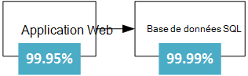
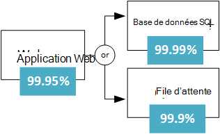
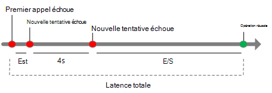
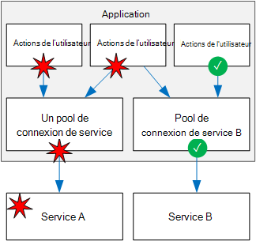
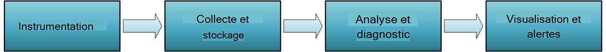

<properties
   pageTitle="Conception d’applications robustes | Microsoft Azure"
   description="Comment créer des applications robustes dans Azure, de haute disponibilité et reprise après sinistre."
   services=""
   documentationCenter="na"
   authors="MikeWasson"
   manager="christb"
   editor=""
   tags=""/>

<tags
   ms.service="guidance"
   ms.devlang="na"
   ms.topic="article"
   ms.tgt_pltfrm="na"
   ms.workload="na"
   ms.date="08/18/2016"
   ms.author="mwasson"/>
   
# Conception d’applications robustes pour Azure

Dans un système distribué, échecs se produit. Matériel peut échouer. Le réseau peut avoir des défaillances temporaires. Rarement, un service entier ou une région peut-être expérimenter une interruption, mais même s’ils doivent être prévus. 

Création d’une application fiable dans le nuage est différente de la création d’une application fiable dans un environnement d’entreprise.  Alors que par le passé vous avez acheté matériel haut de gamme d’évoluer, dans un environnement de cloud vous devez évoluer au lieu de haut. Les coûts des environnements de cloud sont conservés faibles grâce à l’utilisation de matériel. Au lieu de se concentrer sur la prévention des pannes et l’optimisation de « temps moyen entre pannes », dans ce nouvel environnement le focus se déplace pour « délai moyen de restauration. » L’objectif est de minimiser l’impact d’une défaillance.

Cet article donne une vue d’ensemble de la création d’applications robustes dans Microsoft Azure. Il commence par une définition du terme *résilience* et aux concepts associés. Il décrit ensuite un processus pour la réalisation de résilience, à l’aide d’une approche structurée de la vie d’une application, de conception et d’implémentation, de déploiement et des opérations.

## Quelle est la résilience ?

La **résilience** est la possibilité de récupérer de défaillances et de continuer à fonctionner. Il n’est pas sur la *prévention* des défaillances, mais *répondre* aux pannes, d’une manière qui évite les interruptions de service ou perte de données. L’objectif de résilience est à l’application retourne à un état de fonctionnement après une panne.

Deux aspects importants de résilience sont la haute disponibilité et reprise après sinistre.

- **Haute disponibilité** (HA) est la capacité de l’application continue de s’exécuter dans un état sain, sans temps d’arrêt important. Par « état », nous entendons l’application est sensible, et les utilisateurs peuvent se connecter à l’application et interagir avec lui.  

- **Reprise après sinistre** (DR) est la possibilité de récupérer à partir d’incidents rares mais importantes : les défaillances Non transitoires et à grande échelle, telles que l’interruption de service qui affecte une région entière. Récupération d’urgence comprend la sauvegarde des données et archivage et peut inclure des interventions manuelles, telles que la restauration d’une base de données à partir de la sauvegarde. 

Une façon de penser à haute disponibilité et reprise après sinistre est que DR démarre lorsque l’impact d’une panne dépasse la capacité de la conception de haute disponibilité pour la gérer. Par exemple, placer plusieurs VM derrière un équilibreur de charge une disponibilité en cas de défaillance d’un ordinateur virtuel, mais pas si elles échouent en même temps. 

Lorsque vous concevez une application doit être résilient, vous devez comprendre vos exigences de disponibilité. Le temps d’inactivité est acceptable ? C’est en partie une fonction de coût. Combien les interruptions de service potentielles coûtera votre entreprise ? Combien investir dans la création de l’application hautement disponible ? Vous devez également définir ce que cela signifie pour l’application soit disponible. Par exemple, est l’application « hors service » si un client peut envoyer une commande, mais le système ne peut pas les traiter en même temps que la normale ?

Un autre terme courant est **la continuité d’activité** (BC), qui est la capacité d’exécuter les fonctions essentielles de l’entreprise pendant et après un sinistre. BC couvre l’intégralité de l’opération de l’entreprise, y compris les installations physiques, des personnes, des communications, transport, et informatique. Dans cet article, nous sommes simplement concentrés sur des applications de cloud, mais la résilience de planification doit être effectuée dans le contexte des exigences globales de la BC. 

## Processus pour obtenir la résilience

Résilience n’est pas un module complémentaire. Elle doit être conçue dans le système et en pratique opérationnelle. Voici un modèle général à suivre :

1.  **Définir** vos exigences de disponibilité, selon les besoins de l’entreprise

2.  **Conception** de l’application de reprise. Démarrez avec une architecture qui suit des pratiques éprouvées et ensuite identifier les points de défaillance possibles dans cette architecture.

3.  **Mettre en œuvre** des stratégies pour détecter et réparer les échecs de. 

4.  **Test de** la mise en oeuvre en simulant les erreurs et en déclenchant des basculements forcées. 

5.  **Déployer** l’application en production à l’aide d’un processus fiable et reproductible. 

6.  **Moniteur de** détecter les défaillances de l’application. En surveillant le système, vous pouvez évaluer le bon fonctionnement de l’application et répondre aux incidents si nécessaire. 

7.  **Répondre** si les incidents qui nécessitent des interventions manuelles.

Dans le reste de cet article, nous abordons chacune de ces étapes plus en détail.

## Définition de vos besoins en matière de résilience

Résilience de planification commence par les besoins de l’entreprise. Voici certaines des approches de réflexion à propos de résilience dans ces conditions.

### Décomposer la charge de travail

De nombreuses solutions de nuage sont constitués de plusieurs charges de travail applicatives. Le terme « charge de travail » dans ce contexte signifie capacité discrète ou tâche de l’informatique, ce qui peut être logiquement séparée des autres tâches, en fonction des besoins de stockage logique et les données. Par exemple, une application de commerce électronique peut inclure les charges de travail suivants :

- Parcourir et rechercher un catalogue de produits.

- Créer et suivre des commandes.

- Permet d’afficher les recommandations.

Ces charges de travail peuvent avoir des exigences différentes pour la disponibilité, l’évolutivité, la cohérence des données, de reprise après sinistre et ainsi de suite. Là encore, il s’agit de décisions commerciales.

Pensez également à des modèles d’utilisation. Y a-t-il certaines périodes critiques lorsque le système doit être disponible ? Par exemple, un service Web de déclaration de la taxe ne peut pas passer droite avant la date limite de dépôt ; un service de diffusion en continu de vidéo doit rester des pendant un événement de sport ; et ainsi de suite. Pendant des périodes critiques, vous pouvez avoir des déploiements redondants dans plusieurs régions, afin que l’application peut basculer en cas d’échec d’une région. Toutefois, un déploiement de plusieurs région est plus coûteux, à des heures moins critique, vous pouvez exécuter l’application dans une seule région.  

### RTO et RPO

Deux mesures importantes à prendre en compte sont l’objectif de temps de récupération et objectif de point de récupération :

- **Objectif de temps de récupération** (RTO) est la durée maximale acceptable une application peut être pas disponible après un incident. Si votre RTO est de 90 minutes, vous devez être en mesure de restaurer l’application à l’état en cours d’exécution dans les 90 minutes à partir du début d’un sinistre. Si vous avez un RTO très faible, vous pouvez conserver un deuxième déploiement en permanence en cours d’exécution en mode de veille, pour vous protéger contre une panne régionale.

- **Objectif de point de récupération** (RPO) est la durée maximale de perte de données pendant une catastrophe n’est acceptable. Par exemple, si vous stockez des données dans une base de données unique, aucune réplication à d’autres bases de données et effectuez des sauvegardes de toutes les heures, vous risquez de perdre jusqu'à une heure de données. 

RTO et RPO sont les besoins de l’entreprise. Une autre mesure commune est **moyenne des temps de restauration** (MTTR), qui est la durée moyenne nécessaire à la restauration de l’application après un échec. MTTR est un empirique fait sur un système. Si MTTR dépasse le RTO, une défaillance du système entraîne une perturbation inacceptable, car il n’est pas possible de restaurer le système dans le RTO défini. 

### SLA

Dans Azure, l' [Accord de niveau de Service] [ sla] (SLA) décrit les engagements de Microsoft pour un temps de fonctionnement et la connectivité. Si le contrat SLA pour un service particulier est à 99,9 %, cela signifie que vous devez vous attendre le service soit disponible à 99,9 % du temps.

> [AZURE.NOTE] Le contrat SLA d’Azure inclut également des dispositions permettant d’obtenir un crédit de service si le contrat SLA n’est pas remplie, ainsi que des définitions spécifiques de « disponibilité » pour chaque service. Cet aspect de l’accord SLA agit comme une stratégie d’application. 

Vous devez définir votre propre cible SLA de chaque charge de travail dans votre solution. Un contrat SLA permet de raisonner sur l’architecture, et si l’architecture satisfait aux exigences de l’entreprise. Par exemple, si une charge de travail nécessite de 99,99 %, mais il dépend d’un service avec un contrat SLA de 99,9 %, ce service ne peut pas être un point de défaillance unique dans le système. Un recours doit avoir un chemin de secours en cas de défaillance du service, ou prendre d’autres mesures pour récupérer d’une défaillance dans ce service. 

Le tableau suivant indique le temps d’arrêt potentiel cumulé pour différents niveaux de contrat SLA. 

| CONTRAT SLA     | Temps d’arrêt par semaine | Temps d’arrêt par mois | Indisponibilité par an |
|---------|-------------------|--------------------|-------------------|
| 99 %     | heures de 1.68        | 7,2 heures          | jours 3.65         |
| 99,9 %   | 10.1 minutes      | 43,2 minutes       | 8,76 heures        |
| 99,95 %  | 5 minutes         | 21,6 minutes       | 4,38 heures        |
| 99,99 %  | minutes de 1,01      | 4,32 minutes       | 52.56 minutes     |
| 99,999 % | 6 secondes         | 25.9 secondes       | 5.26 minutes      |

Bien entendu, une disponibilité plus élevée est préférable, toutes choses étant égales. Mais à mesure que vous vous efforcer de plus de 9 s, le coût et la complexité pour atteindre ce niveau de disponibilité augmente. Une disponibilité de 99,99 % se traduit par environ 5 minutes de temps d’arrêt total par mois. Il est important de la complexité accrue et les coûts pour atteindre cinq 9 ? La réponse dépend des besoins de l’entreprise. 

Voici quelques autres considérations lors de la définition d’un contrat SLA :

- Pour atteindre quatre 9 (99,99 %), sans doute ne suffisent pas intervention manuelle pour récupérer de défaillances. L’application doit être auto-diagnostic et l’auto-réparation. 

- Au-delà de quatre 9, il est difficile de détecter les pannes suffisamment rapidement pour respecter le contrat SLA.

- Pensez à la fenêtre de temps est mesuré en fonction de votre accord SLA. Plus la fenêtre est petite, plus les tolérances. Il n’y probablement pas judicieux de définir vos accords SLA en termes de disponibilité horaire ou quotidienne. 

### SLA composite

Pensez à une application web Service de l’application qui écrit dans la base de données de SQL Azure. Au moment de la rédaction de ce document, ces services Azure ont les SLA suivantes :

- Application Service Web Apps = 99,95 %

- Base de données SQL = 99,99 %

Quel est le temps d’interruption maximum prévu pour cette application ? Si un service tombe en panne, l’application entière échoue. En général, la probabilité de chaque échec du service est indépendante, le SLA composite pour cette application est 99,95 % x 99,99 % = 99.94 %. Qui est plus faible que les accords individuels, qui n’est pas surprenant, car une application qui s’appuie sur plusieurs services a plusieurs points de défaillance potentiels. 

En revanche, vous pouvez améliorer le contrat SLA composite en créant des chemins de secours indépendants. Par exemple, si base de données SQL est indisponible, mettre des transactions dans une file d’attente pour un traitement ultérieur.

Grâce à cette conception, l’application est toujours disponible, même s’il ne peut pas se connecter à la base de données. Toutefois, il échoue si la base de données et la file d’attente échouent en même temps. Le pourcentage prévu du temps d’une défaillance simultanée est de 0,0001 × 0,001, le SLA composite pour ce chemin d’accès combiné est  

- File d’attente de la base de données ou = 1.0 &minus; (0,0001 &times; 0,001) = 99.99999 %

Le contrat SLA de composite total est :

- Web app et (base de données de la file d’attente de l’OR) = 99,95 % &times; 99.99999 % = ~99.95%

Mais il existe des compromis à cette approche. La logique d’application est plus complexe, vous payez pour la file d’attente, et il peut y avoir des problèmes de cohérence des données à prendre en compte.

**Contrat SLA pour les déploiements de plusieurs régions**. Une autre technique de haute disponibilité consiste à déployer l’application dans plusieurs régions et le Gestionnaire de trafic Azure permet de basculer en cas de défaillance de l’application d’une région. Pour un déploiement de deux pays, le contrat SLA composite est calculé comme suit. 

Soit *N* le SLA composite pour l’application déployée dans une région. Le risque attendu que l’application échoue dans les deux zones en même temps est (1 &minus; N) &times; (1 &minus; N). Par conséquent,

- Combiné des SLA pour les deux régions = 1 &minus; (1 &minus; N) (1 &minus; N) = N + (1 &minus; N) N

Enfin, vous devez prendre dans le [contrat SLA pour le Gestionnaire de trafic][tm-sla]. Lorsque cet article a été écrit, le contrat SLA pour le contrat SLA de Traffic Manager est 99,99 %.

- Composite SLA = 99,99 % &times; (association des SLA pour les deux régions)

Un autre détail est que basculement n’est pas instantanée, qui peut entraîner un temps d’inactivité lors d’un basculement. Voir [contrôle de point de terminaison de Traffic Manager et le basculement][tm-failover].

Le numéro de contrat SLA calculé est une référence utile, mais il ne disent pas tout sur la disponibilité. Souvent, une application peut se dégrader progressivement lorsqu’un chemin d’accès non critique échoue. Considérez une application qui montre un catalogue de livres. Si l’application ne peut pas récupérer l’image miniature de la page de garde, il peut afficher une image d’espace réservé. Dans ce cas, ne parvient pas à obtenir l’image ne réduit pas la disponibilité de l’application, bien qu’elle affecte l’expérience de l’utilisateur.  

## Conception pour une résistance

Au cours de la phase de conception, vous devez effectuer une analyse de mode de défaillance (FMA). L’objectif d’un FMA est d’identifier les points de défaillance possibles et définissent la manière dont l’application répondra à ces défaillances.

- Comment l’application détecte ce type de panne ?

- Comment l’application répond à ce type de panne ?

- Comment vous connecter et surveiller ce type de panne ? 

Pour plus d’informations sur le processus FMA, avec des recommandations spécifiques pour Azure, consultez [Guide de résilience Azure : analyse de l’échec en mode][fma].

### Exemple d’identification des modes de défaillance et de la stratégie de détection

**Point d’échec :** L’appel à un service web externe / API.

| Mode de défaillance | Stratégie de détection |
|--------------|--------------------|
| Le service est indisponible | HTTP 5xx |
| La limitation de | HTTP 429 (trop de demandes) | 
| Authentification | HTTP 401 (non autorisé) | 
| Réponse lente | Demande arrive à expiration |

## Stratégies de résilience

Cette section fournit une enquête de certaines stratégies de résilience de commun. La plupart d'entre elles n’est pas limitée à une technologie particulière. Les descriptions contenues dans cette section sont conçus pour résumer l’idée générale de chaque technique, avec des liens vers des informations complémentaires.

### Réessayer les défaillances temporaires

Les erreurs passagères peuvent résulter d’une perte momentanée de connectivité de réseau, une connexion de base de données supprimée ou un délai d’attente lorsqu’un service est occupé. Souvent, une défaillance temporaire peut être résolue simplement en effectuant à nouveau la demande. Pour de nombreux services Azure, le Kit de développement logiciel du client implémente la relance automatique des tentatives, d’une manière qui est transparente pour l’appelant ; consultez [Réessayer les orientations spécifiques de service][retry-service-specific guidance].

Chaque nouvelle tentative ajoute à la latence totale. En outre, trop de demandes qui ont échoué peuvent provoquer un goulot d’étranglement, comme les demandes en attente s’accumulent dans la file d’attente. Ces requêtes bloquées peuvent contenir des ressources système critiques telles que la mémoire, threads, les connexions de base de données et ainsi de suite, qui peut entraîner des pannes en cascade. Pour éviter ce problème, augmentez le délai entre chaque nouvelle tentative et limiter le nombre total de demandes ayant échoué.

Pour plus d’informations, consultez [Modèle de réessayer][retry-pattern].

### Équilibrer la charge entre les instances

Pour une évolutivité, une application en nuage doit être en mesure de faire évoluer en ajoutant plusieurs instances. Cette approche améliore également la résilience, car les instances mauvais état peuvent être retirés de rotation.  

Par exemple :

- Placer deux ou plusieurs VM derrière un équilibreur de charge. L’équilibreur de charge répartit le trafic vers tous les ordinateurs virtuels. [Plusieurs ordinateurs virtuels sur Azure pour l’évolutivité et la disponibilité]en cours d’exécution[ra-multi-vm].

- Déployer une application de Service d’application Azure à plusieurs instances. Application Service équilibre automatiquement la charge sur plusieurs instances. Reportez-vous à la section [application web de base][ra-basic-web].

- Utilisez le [Gestionnaire de trafic Azure] [ tm] pour répartir le trafic sur un ensemble de points de terminaison.

### Réplication de données

Réplication de données est une stratégie générale de gestion des défaillances non transitoires dans un magasin de données. Réplication intégrée, y compris la base de données de SQL Azure, DocumentDB et Apache Cassandra fournissent des nombreuses technologies de stockage.  

Il est important de considérer l’accès en lecture et écriture des chemins d’accès. En fonction de la technologie de stockage, vous pouvez avoir plusieurs réplicas accessible en écriture, ou un seul réplica accessible en écriture et plusieurs réplicas en lecture seule. 

Pour optimiser la disponibilité, les réplicas peuvent être placés dans plusieurs régions. Toutefois, cela augmente la latence pour répliquer les données. En général, la réplication entre les régions est effectuée en mode asynchrone, qui implique un modèle de cohérence éventuelle et la perte potentielle de données en cas de défaillance d’un réplica. 

### Dégradé

Si un service tombe en panne et qu’il n’y a pas de chemin de basculement sur incident, l’application peut être en mesure de dégradé, de manière à toujours fournit une expérience utilisateur acceptable. Par exemple :

- Insérer un élément de travail dans une file d’attente, à exécuter ultérieurement. 

- Renvoyer une valeur estimée 

- Utiliser des données mises en cache localement. 

- Afficher un message d’erreur pour l’utilisateur. (Cette option est mieux que d’avoir l’application cesse de répondre à des demandes).

### Limiter les utilisateurs de gros volumes

Un petit nombre d’utilisateurs créent parfois une charge excessive. Qui peut avoir un impact sur les autres utilisateurs, en réduisant la disponibilité globale de votre application.

Un seul client lorsqu’un trop grand nombre de demandes, l’application peut limiter le client pendant une certaine période de temps. Au cours de la période de limitation, l’application refuse de certaines ou toutes les demandes de ce client (selon la stratégie de limitation exacte). Le seuil de limitation peut dépendre de niveau de service du client. 

La limitation n’implique pas que le client agissait nécessairement à des fins malveillantes. Ils signifient simplement que le client a dépassé son quota de service.  Dans certains cas, un consommateur peut toujours dépasser leur quota ou sinon comportement incorrect. Dans ce cas, vous pouvez aller plus loin et l’utilisateur. En général, cela en bloquant une clé d’API ou d’une plage d’adresses IP.

Pour plus d’informations, consultez [Modèle de limitation][throttling-pattern].

### Utilisation d’un disjoncteur  

Le modèle de disjoncteur peut empêcher une application d’essayer de façon répétée une opération qui est susceptible d’échouer. L’analogie est pour un disjoncteur physique, un commutateur qui interrompt le flux de courant lorsqu’un circuit est surchargé.

Le disjoncteur encapsule des appels à un service. Il possède trois états :

- **Fermé**. Il s’agit d’un état normal. Le disjoncteur envoie des requêtes au service et un compteur comptabilise le nombre d’échecs récents. Si le nombre de défaillances dépasse un seuil dans une période donnée, le disjoncteur bascule vers l’état ouvert. 

- **Ouvrir**. Dans cet état, le disjoncteur échoue immédiatement toutes les demandes, sans appeler le service. L’application doit utiliser un chemin d’atténuation, telles que la lecture des données à partir d’un réplica, ou simplement retourner une erreur à l’utilisateur. Lorsque le disjoncteur passe à ouvert, il démarre une minuterie. Lorsque la temporisation expire, le disjoncteur bascule à l’état semi-ouvert.

- **Semi-ouvertes**. Dans cet état, le disjoncteur permet à un nombre limité de demandes atteindre le service. S’ils réussissent, le service est supposé être restaurées et le disjoncteur bascule vers l’état Closed. Dans le cas contraire, il revient à l’état ouvert. L’état semi-ouvert empêche un service de récupération de soudainement être submergé de demandes.

Pour plus d’informations, consultez [Modèle de disjoncteur][circuit-breaker-pattern].

### Permet de charger un audit pour lisser les pointes de trafic

Les applications peuvent rencontrer des pics soudains dans le trafic, lesquelles peuvent submerger les services sur le serveur principal. Si un service back-end ne peut répondre à des demandes assez rapidement, il peut provoquer des demandes en file d’attente (sauvegarder) ou provoquer l’accélération de l’application.

Pour éviter cela, vous pouvez utiliser une file d’attente sous la forme d’une mémoire tampon. Lorsqu’il existe un nouvel élément de travail, au lieu d’appeler le service back-end immédiatement, l’application en file d’attente un élément de travail à exécuter de façon asynchrone. La file d’attente fonctionne comme un tampon qui lisse les pics de charge. 

Pour plus d’informations, consultez [modèle de l’audit de charge basé sur la file d’attente][load-leveling-pattern].

### Isoler les ressources critiques 

Échecs dans un sous-système peuvent parfois monter en cascade, provoquant des défaillances dans d’autres parties de l’application. Cela peut se produire si une défaillance entraîne certaines ressources, telles que les threads ou les sockets, ne pas à obtenir libérées dans un délai raisonnable, conduisant à l’épuisement des ressources. 

Pour éviter cela, vous pouvez partitionner un système en groupes isolés, afin qu’une défaillance d’une partition ne détériore pas à l’ensemble du système. Cette technique est parfois appelée le modèle de cloisonnement.

Exemples :

- Partitionnement d’une base de données--par exemple, par les clients--et affecter un pool distinct d’instances de serveur web pour chaque partition.  
- Pools de threads distincts permet d’isoler les appels vers des services différents. Cela contribue à empêcher les pannes en cascade si la défaillance de l’un des services. Pour obtenir un exemple, consultez la [bibliothèque d’Hystrix]de Netflix[hystrix].

- Utiliser des [conteneurs de] [ containers] pour limiter les ressources disponibles pour un sous-système particulier. 

### Appliquer les transactions de compensation 

Une transaction de compensation est une transaction qui annule les effets d’une autre transaction terminée.

Dans un système distribué, il peut être très difficile de parvenir à une cohérence transactionnelle forte. Transactions de compensation sont un moyen pour parvenir à une cohérence à l’aide d’une série de transactions individuelles plus petites, qui peut être annulée à chaque étape.

Par exemple, pour réserver un voyage, un client peut réserver une voiture, une chambre d’hôtel et un vol. Si une de ces étapes échoue, la totalité de l’opération échoue. Au lieu d’essayer d’utiliser une seule transaction distribuée pour l’intégralité de l’opération, vous pouvez définir une transaction de compensation pour chaque étape. Par exemple, pour annuler une réservation de la voiture, annuler la réservation. Pour exécuter l’ensemble de l’opération, un coordinateur s’exécute chaque étape. Si une étape échoue, le coordinateur s’applique à des transactions de compensation pour annuler toutes les étapes ont été achevées. 

Pour plus d’informations, consultez [Modèle de Transaction de compensation][compensating-transaction-pattern]. 

## Test de résilience

En règle générale, vous ne pouvez pas tester la résilience de la même façon que vous testez les fonctionnalités de l’application (en exécutant des tests unitaires et ainsi de suite). Au lieu de cela, vous devez tester le fonctionnement de la charge de travail de bout en bout dans des conditions de panne, ce qui, par définition, ne pas se produire tout le temps.

Le test est la partie d’un processus itératif. Tester l’application, de mesurer les résultats, d’analyser et de corriger toutes les erreurs, et répéter le processus.

**Test des pannes d’injection**. Tester la résilience du système aux pannes, en déclenchant des véritables défaillances ou en simulant les. Voici quelques scénarios courants de défaillance pour tester :

- Arrêter les instances de la machine virtuelle.

- Bloquer le processus.

- Expiration des certificats.

- Modifier les touches d’accès.

- Arrêtez le service DNS sur les contrôleurs de domaine.

- Limiter les ressources système disponibles, telles que la mémoire RAM ou le nombre de threads.

- Démontage de disques.

- Redéployer une machine virtuelle.

Mesurer les temps de récupération et vérifier qu’ils répondent aux besoins de votre entreprise. Tester des combinaisons de modes de défaillance, ainsi. Assurez-vous que les défaillances n’en cascade et sont gérées de manière isolée.

Il s’agit d’une autre raison, pourquoi il est important d’analyser les points de défaillance possibles pendant la phase de conception. Les résultats de cette analyse doivent être entrées dans votre plan de test.

Le **test de charge**. Test de charge de l’application à l’aide d’un outil tel que [Visual Studio Team Services] [ vsts] ou [Apache JMeter] [ jmeter] est cruciale pour identifier les défaillances ne se produisant qu’en charge, tels que la base de données principale soit saturé ou la limitation de service de test de charge. Test de pic de charge, à l’aide des données de production, ou des données synthétiques qui est aussi proche que possible des données de production. L’objectif est de connaître le comporte de l’application dans des conditions réelles.   

## Déploiement souple

Une fois qu’une application est déployée en production, les mises à jour sont une source possible d’erreurs. Dans le pire des cas, une mise à jour incorrecte peut provoquer des interruptions de service. Pour éviter cela, le processus de déploiement doit être prévisible et reproductible. Déploiement inclut le provisionnement des ressources Azure, déployer du code de l’application et l’application des paramètres de configuration. Une mise à jour peut impliquer un sous-ensemble ou les trois. 

Le point essentiel est que les déploiements manuels sont sujettes aux erreurs. Par conséquent, il est recommandé de disposer d’un processus idempotent automatisé, que vous pouvez exécuter à la demande et exécutez à nouveau si une opération échoue. 

- Modèles du Gestionnaire de ressources permet d’automatiser le provisionnement des ressources Azure.

- Utiliser la [Configuration de l’état souhaité Azure Automation] [ dsc] (DSC) pour configurer des ordinateurs virtuels.

- Utilisation d’un processus de déploiement automatisé pour le code de l’application.

Déploiement de liés aux résilient deux concepts sont *infrastructure sous forme de code* et *l’infrastructure immuable*.

- **Infrastructure en tant que code** consiste à utiliser le code pour mettre en service et la configuration de l’infrastructure. Infrastructure en tant que le code peut utiliser une approche déclarative ou une approche impérative (ou une combinaison des deux). Modèles du Gestionnaire de ressources sont un exemple d’une approche déclarative. Scripts PowerShell sont un exemple d’une approche impérative.

- **Infrastructure immuable** est le principe d’infrastructure ne doit pas modifier après le déploiement en production. Dans le cas contraire, vous pouvez obtenir dans un état lorsque des modifications ad hoc ont été appliquées, il est difficile de savoir exactement ce qui a changé et il est dur de raisonner sur le système. 

Une autre question consiste à déployer une mise à jour de l’application. Nous vous recommandons de techniques telles que le déploiement de bleu-vert ou versions canary, envoyer des mises à jour dans hautement contrôlé permet de limiter l’impact possible d’un déploiement défectueux.

- [Bleu-vert déploiement] [ blue-green] est une technique où vous déployez une mise à jour dans un environnement de production séparée à partir de l’application active. Après avoir validé le déploiement, basculez le routage du trafic vers la version mise à jour. Par exemple, Azure Application Service Web Apps permet cela avec les [emplacements de la zone de transit][staging-slots]. 

- [Versions Canary] [ canary-release] sont similaires au déploiement de bleu-vert. Au lieu de passer tout le trafic à la version mise à jour, vous déployez la mise à jour à un faible pourcentage d’utilisateurs, par le routage d’une partie du trafic vers le nouveau déploiement. S’il y a un problème, interrompre et revenir à l’ancien déploiement. Dans le cas contraire, acheminer les plus le trafic vers la nouvelle version, jusqu'à ce qu’elle atteigne 100 % du trafic.

Quelle approche, assurez-vous que vous pouvez restaurer la dernière bonne-déploiement, dans le cas où la nouvelle version ne fonctionne pas. Également, si des erreurs se produisent, il doit être possible de savoir à partir des journaux application version a provoqué l’erreur. 

## Surveillance et diagnostic

Surveillance et diagnostic est cruciaux pour la résilience. En cas de problème, vous devez savoir qu’il a échoué et vous devez appréhender la cause de l’échec. 

Surveillance d’un système distribué à grande échelle pose un défi. Pensez à une application qui s’exécute sur plusieurs machines virtuelles de dizaines : il n’est pas pratique de vous connecter à chaque machine virtuelle, un à la fois et parcourez des fichiers journaux, essayez de résoudre un problème. En outre, le nombre d’instances de la machine virtuelle n’est probablement pas statique. Ordinateurs virtuels sont ajoutés et supprimés comme les échelles de l’application et l’extraction, et parfois une instance peut-être échouer et ont besoin d’être configuré. En outre, une application en nuage typique peut utiliser plusieurs banques de données (stockage Azure, de la base de données SQL, DocumentDB, Redis cache), et une action de l’utilisateur unique peut s’étendre sur plusieurs sous-systèmes. 

Vous pouvez considérer le processus de surveillance et de diagnostic comme un pipeline avec plusieurs étapes distinctes :

- **Instrumentation**. Les données brutes de surveillance et de diagnostic provenant de diverses sources, y compris les journaux d’application, les journaux de serveur web, les compteurs de performance du système d’exploitation, journaux de base de données et diagnostics intégrés dans la plateforme Azure. Services Azure plus disposent d’une fonctionnalité de diagnostic que vous pouvez utiliser pour déterminer la cause des problèmes.

- La **collecte et le stockage**. Les données d’instrumentation brutes peuvent être détenues dans divers emplacements et avec différents formats (application les journaux de suivi, les compteurs de performance, les journaux IIS). Ces différentes sources sont collectées, consolidées et mis en stockage fiable.

- **Analyse et diagnostic**. Une fois que les données sont consolidées, il peut être analysé, afin de résoudre les problèmes et de fournir une vue d’ensemble de l’état de santé de l’application.

- **Visualisation et les alertes**. Dans cette étape, les données de télémétrie sont présentées de manière à ce qu’un opérateur peut rapidement repérer des tendances ou des problèmes. Exemple inclure des tableaux de bord ou les alertes de messagerie.  

La surveillance est différente de celle de la détection de défaillance. Par exemple, votre application peut détecter une transitoire erreur et réessayer, entraînant aucune interruption de service. Mais elle doit également la nouvelle tentative, afin que vous pouvez surveiller le taux d’erreur, afin d’obtenir une vue d’ensemble de l’état de l’application. 

Journaux d’application sont une source importante de données de diagnostic. Voici quelques méthodes conseillées pour la journalisation de l’application :

- Ouvrez une session dans la production. Dans le cas contraire, vous perdez un aperçu aux fois très lorsque vous en avez le plus besoin.

- Journal des événements au niveau des limites de service. Inclure un ID de corrélation qui circulent entre les services. Si le flux de transaction X par le biais de plusieurs services et une d’elles échoue, l’ID de corrélation vous permettra de pinpoint pourquoi la transaction a échoué.

- Utilisation de sémantique journalisation, également appelé structurée de journalisation. Les journaux non structurées rendent difficile à automatiser la consommation et l’analyse des données du journal, ce qui sont nécessaire à l’échelle du nuage.

- Utiliser la journalisation asynchrone. Dans le cas contraire, le système de journalisation elle-même peut provoquer l’échec, en provoquant des demandes à sauvegarder, comme ils bloquent l’attente d’écrire un enregistrement de l’événement.

- Journalisation de l’application n’est pas le même que l’audit. L’audit peut être effectuée pour des raisons réglementaires ou de la mise en conformité. En tant que tel, les enregistrements d’audit doivent être effectuées, et il n’est pas acceptables pour supprimer un lors du traitement des transactions. Si une application nécessite l’audit, il doit être conservé distinct à partir de l’enregistrement des diagnostics. 

Pour plus d’informations sur l’analyse et les tests de diagnostic, consultez le [Guide de surveillance et de diagnostic][monitoring-guidance].

## Réponses échec manuel

Les sections précédentes ont axé sur les stratégies de récupération automatisée, qui sont critiques pour une haute disponibilité. Toutefois, une intervention manuelle parfois est nécessaire.

- **Alertes**. Analyser votre application pour des panneaux d’avertissement qui peuvent nécessiter l’intervention de proactive. Par exemple, si vous voyez que base de données de SQL ou DocumentDB régulièrement le service limite votre application, vous devrez augmenter la capacité de votre base de données ou optimiser vos requêtes. Dans cet exemple, même si l’application peut gérer les erreurs de la limitation en toute transparence, votre télémétrie doit tout de même déclencher une alerte, afin que vous pouvez suivre.  

- **Basculement manuel**. Certains systèmes ne peut pas basculer automatiquement et requièrent un basculement manuel. 

- **Tests de disponibilité opérationnelle**. Si votre application bascule sur une zone secondaire, vous devez effectuer un test de disponibilité opérationnelle avant que vous ne parvenez pas à la région principale. Le test doit vérifier que la zone primaire est en bon état et prêt à recevoir le trafic à nouveau.

- **Vérification de la cohérence des données**. Si une défaillance se produit dans un magasin de données, il est peut-être des incohérences de données lorsque la banque redevienne disponible, en particulier si les données étaient répliquées. 

- **Restauration à partir de la sauvegarde**. Par exemple, si la base de données de SQL connaît une panne régionale, vous pouvez géo-restauration de la base de données à partir de la dernière sauvegarde.

Documenter et tester votre plan de récupération d’urgence. Inclure des procédures écrites pour les étapes manuelles, telles que le basculement manuel, restauration des données à partir de sauvegardes et ainsi de suite. 

## Résumé

Cet article étudié la résilience à partir d’une perspective globale, en mettant l’accent sur certains des défis uniques du nuage. Celles-ci incluent la nature distribuée du cloud computing, l’utilisation de matériel et de la présence de défaillances du réseau transience.

Voici les principaux points à retenir de cet article :

- Résilience conduit à une plus grande disponibilité et réduction du délai moyen pour récupérer de défaillances. 

- Obtention de résilience dans le nuage requiert un ensemble différent de techniques, les solutions traditionnelles sur site. 

- Résilience ne se produit pas par accident. Elle doit être conçue et intégrée à partir du début.

- Résistance des aborde chaque partie du cycle de vie de l’application, de la planification et aux opérations de codage.

- Test et moniteur !

## Étapes suivantes

- [Liste de vérification de résilience] [ resiliency-checklist] contient des recommandations qui vous aideront à planifier pour une variété de modes de défaillance qui peut se produire.

- [Analyse de l’échec en mode] [ fma] (FMA) est un processus pour la création de résilience dans un système, en identifiant les points de défaillance possibles. Comme point de départ pour votre processus FMA, cet article contient un catalogue des modes de défaillance potentiels et leurs mesures d’atténuation. 

- Vous trouverez ici des ressources supplémentaires : [des conseils techniques résilience Azure](../resiliency/resiliency-technical-guidance.md) 

<!-- links -->

[blue-green]: http://martinfowler.com/bliki/BlueGreenDeployment.html
[canary-release]: http://martinfowler.com/bliki/CanaryRelease.html
[circuit-breaker-pattern]: https://msdn.microsoft.com/library/dn589784.aspx
[compensating-transaction-pattern]: https://msdn.microsoft.com/library/dn589804.aspx
[containers]: https://en.wikipedia.org/wiki/Operating-system-level_virtualization
[dsc]: https://azure.microsoft.com/documentation/articles/automation-dsc-overview/
[fma]: guidance-resiliency-failure-mode-analysis.md
[hystrix]: http://techblog.netflix.com/2012/11/hystrix.html
[jmeter]: http://jmeter.apache.org/
[load-leveling-pattern]: https://msdn.microsoft.com/library/dn589783.aspx
[monitoring-guidance]: https://azure.microsoft.com/documentation/articles/best-practices-monitoring/
[ra-basic-web]: https://azure.microsoft.com/documentation/articles/guidance-web-apps-basic/
[ra-multi-vm]: https://azure.microsoft.com/documentation/articles/guidance-compute-multi-vm/
[resiliency-checklist]: guidance-resiliency-checklist.md
[retry-pattern]: https://msdn.microsoft.com/library/dn589788.aspx
[retry-service-specific guidance]: https://azure.microsoft.com/documentation/articles/best-practices-retry-service-specific/
[sla]: https://azure.microsoft.com/support/legal/sla/
[staging-slots]: https://azure.microsoft.com/documentation/articles/guidance-web-apps-basic/
[throttling-pattern]: https://msdn.microsoft.com/library/dn589798.aspx
[tm]: https://azure.microsoft.com/services/traffic-manager/
[tm-failover]: https://azure.microsoft.com/documentation/articles/traffic-manager-monitoring/
[tm-sla]: https://azure.microsoft.com/support/legal/sla/traffic-manager/v1_0/
[vsts]: https://www.visualstudio.com/features/vso-cloud-load-testing-vs.aspx
