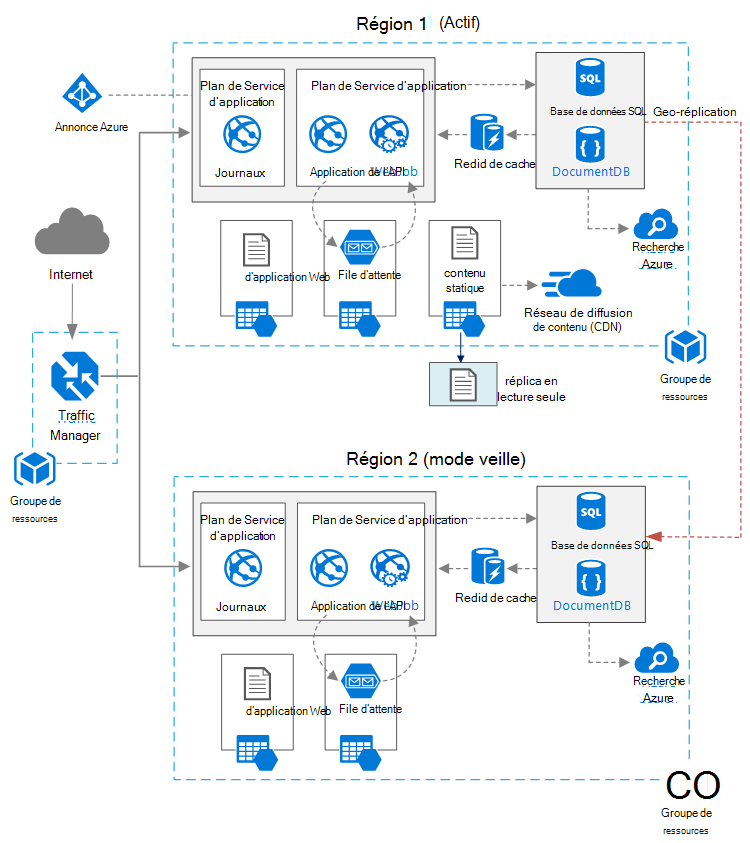

<properties
   pageTitle="Application Web à haute disponibilité | Architecture de référence Azure | Microsoft Azure"
   description="Architecture recommandée pour les applications web à haute disponibilité, en cours d’exécution dans Microsoft Azure."
   services="app-service,app-service\web,sql-database" 
   documentationCenter="na"
   authors="MikeWasson"
   manager="roshar"
   editor=""
   tags=""/>

<tags
   ms.service="guidance"
   ms.devlang="na"
   ms.topic="article"
   ms.tgt_pltfrm="na"
   ms.workload="na"
   ms.date="06/27/2016"
   ms.author="mwasson"/>

# <a name="azure-reference-architecture-web-application-with-high-availability"></a>Architecture de référence Azure : application Web à haute disponibilité

[AZURE.INCLUDE [pnp-RA-branding](../../includes/guidance-pnp-header-include.md)]

Cet article présente une architecture recommandée pour une application web à haute disponibilité, en cours d’exécution sur Microsoft Azure. S’appuie sur l’architecture [architecture de référence Azure : amélioration de l’évolutivité d’une application web][guidance-web-apps-scalability].

## <a name="architecture-diagram"></a>Diagramme d’architecture



Cette architecture repose sur celle de [l’évolutivité d’amélioration d’une application web]la[guidance-web-apps-scalability]. Les principales différences sont :

- **Les zones principales et secondaires**. Cette architecture utilise deux régions pour garantir une disponibilité supérieure. L’application est déployée à chaque régions. Pendant des opérations normales, le trafic réseau est routé vers la zone primaire. Mais si qui n’est plus disponible, le trafic est acheminé sur la zone secondaire. Pour plus d’informations sur le basculement sur incident, consultez [basculement de la gestion](#managing-failover-and-failback).

- **Gestionnaire de trafic azure**. [Traffic Manager] [ traffic-manager] achemine les demandes entrantes vers la région principale. Si l’application exécute cette zone devenue indisponible, le Gestionnaire de trafic bascule vers la zone secondaire. 

- **Geo-réplication** de la base de données SQL et DocumentDB.

## <a name="recommendations"></a>Recommandations

### <a name="regional-pairing"></a>Appariement régionaux

Chaque région Azure est associée à une autre région au sein de la même région. En règle générale, choisissez régions dans la même paire régionale (par exemple, les US 2 et Central). Cela présente les avantages suivants :

- S’il existe une panne large, récupération d’au moins une région de chaque paire est une priorité.
- Mises à jour planifiées système Azure sont présentées aux régions appariées séquentiellement, afin de réduire les temps morts possibles.
- Dans la plupart des cas, les paires de résident dans le même emplacement géographique, pour répondre aux exigences en matière de délégation de compétences de données.

Toutefois, assurez-vous que les deux régions prennent en charge tous les services nécessaires à votre application Azure. Voir [Services par région][services-by-region]. Pour plus d’informations sur les paires régionaux, consultez [Business continuité d’activité et reprise après sinistre (BCDR) : régions associés d’Azure][regional-pairs].

### <a name="resource-groups"></a>Groupes de ressources

Envisagez de placer la zone principale, zone secondaire et Traffic Manager dans des [groupes de ressources]distincts[resource groups]. Cela vous permet de gérer les ressources déployées à chaque région comme une même collection &mdash; vous pouvez les déployer séparément, supprimer le déploiement et ainsi de suite. 

### <a name="traffic-manager"></a>Traffic Manager

**Le routage.** Traffic Manager prend en charge plusieurs [algorithmes de routage][tm-routing]. Pour le scénario décrit dans cet article, utiliser la _priorité de_ routage (anciennement appelé routage de _basculement_ ). Avec ce paramètre, Traffic Manager envoie toutes les demandes à la zone principale, à moins que le point de terminaison pour cette zone deviendrait inaccessible. À ce stade, il bascule automatiquement sur la zone secondaire. Reportez-vous à la section [méthode de routage de configurer le basculement de][tm-configure-failover].

**Sonde de santé.** Traffic Manager utilise une sonde HTTP (ou HTTPS) pour surveiller la disponibilité de chaque point de terminaison. La sonde donne Traffic Manager à un test de réussite ou d’échec pour basculer vers la zone secondaire. Il fonctionne en envoyant une demande à un chemin d’accès d’URL spécifié. S’il obtient une réponse autre que 200 dans un délai d’expiration, la détection échoue. Après les quatre demandes ayant échoué, Traffic Manager marque le point de terminaison comme étant dégradé et bascule sur l’autre extrémité. Pour plus d’informations, consultez [surveillance de point de terminaison de Traffic Manager et de basculement][tm-monitoring].

Pour obtenir les meilleurs résultats, créez un point de terminaison de sonde de santé qui signale l’état de santé global de l’application et utiliser ce point de terminaison de la sonde de santé. Le point de terminaison doit vérifier les dépendances critiques telles que les applications de Service d’application, file d’attente de stockage et de base de données SQL. Dans le cas contraire, la sonde peut signaler un point de terminaison « sain » lorsque les parties critiques de l’application sont réellement une défaillance. 

D’autre part, n’utilisez pas la sonde de santé pour vérifier les services de priorité inférieures. Par exemple, si un service de messagerie tombe en panne, l’application peut basculer vers un deuxième fournisseur ou simplement envoyer des e-mails plus tard. L’application ne doit pas échouer sur dans cette situation. Pour plus d’informations, consultez [Modèle de surveillance de point de terminaison de santé][health-endpoint-monitoring-pattern].
  
### <a name="sql-database"></a>Base de données SQL

[Geo -] réplication Active[ sql-replication] pour créer un secondaire lisible dans une région différente. Vous pouvez avoir jusqu'à quatre secondaires lisibles. Si votre base de données principale tombe en panne, ou doit simplement être mis hors connexion, vous pouvez basculer à une de vos bases de données secondaires. Geo-réplication Active peut être configurée pour une base de données dans n’importe quel pool élastique de la base de données.

### <a name="documentdb"></a>DocumentDB

DocumentDB prend en charge la réplication géographique entre les régions. Une région est désignée comme accessibles en écriture, et les autres sont des réplicas en lecture seule. 

S’il existe une panne régionale, vous pouvez échouer en sélectionnant une autre zone à la zone d’écriture. Le client DocumentDB SDK envoie automatiquement enregistrer les requêtes dans la zone en cours d’écriture, afin que vous n’avez pas besoin de mettre à jour la configuration de client après un basculement. Pour plus d’informations, consultez [données de distribuer globalement avec DocumentDB][docdb-geo]. 

> [AZURE.NOTE] Tous les réplicas appartiennent au même groupe de ressources.

### <a name="storage"></a>Stockage

Pour le stockage Azure, utiliser [le stockage redondant géo-accès en lecture] [ ra-grs] (RA-GRS). Avec le stockage de GRS-RA, les données sont répliquées pour une zone secondaire. Vous avez un accès en lecture seule aux données dans la zone secondaire, à un point de terminaison séparé. S’il existe une panne régionale ou une catastrophe, l’équipe de stockage Azure peut déterminer réaliser un basculement géo-à la zone secondaire. Il n’y a aucune intervention du client requise pour ce basculement.

Pour le stockage de la file d’attente, créez une file d’attente de sauvegarde dans la zone secondaire. Au cours du basculement, l’application peut utiliser la file d’attente de sauvegarde, jusqu'à ce que la zone primaire devient à nouveau disponible. De cette façon, l’application peut continuer à traiter les nouvelles demandes. 

## <a name="availability-considerations"></a>Considérations relatives à la disponibilité

Une architecture de plusieurs région peut fournir une disponibilité plus élevée que le déploiement d’une seule région. Si une panne régionale affecte la zone principale, vous pouvez basculer sur la zone secondaire. Cette architecture permet également en cas de défaillance d’un sous-système individuel de l’application.  
     
Il existe plusieurs approches pour atteindre une disponibilité élevée au sein de centres de données :      
- Actif/passif en veille à chaud. Du trafic se fait en une seule région, tout en l’autre attend en veille. L’application est déployée et en cours d’exécution dans la zone secondaire. Vous pouvez démarrer avec un plus petit nombre d’instances dans le centre de données secondaire et puis évoluer en fonction des besoins. 

- Actif/passif avec l’opération de secours. Mais application n’est pas déployé que nécessaire pour le basculement. Cette approche coûte moins cher à exécuter, mais aura généralement plus de l’indisponibilité lors d’une défaillance. 

- Actif/actif. Les deux régions sont actifs et requêtes sont réparties entre eux. Si un centre de données devient indisponible, il est retiré de rotation. 

Cet article se concentre sur actif/passif en veille à chaud, à l’aide du [Gestionnaire de trafic Azure] [ traffic-manager] pour acheminer le trafic vers la région. 

### <a name="traffic-manager"></a>Traffic Manager

Gestionnaire de trafic bascule automatiquement sur si la région principale devient indisponible. Lors de la bascule sur le Traffic Manager, il existe une période de temps lorsque le client ne peut pas accéder à l’application, qui peut être de plusieurs minutes. Deux facteurs affectent la durée totale :

- La sonde de santé doit détecter que le centre de données principal est inaccessible.

- Les serveurs DNS doivent mettre à jour les enregistrements DNS mis en cache pour l’adresse IP, dont dépend la DNS time-to-live (TTL). La durée de vie par défaut est 300 secondes (5 minutes), mais vous pouvez configurer cette valeur lorsque vous créez le profil du Gestionnaire de trafic.

Pour plus d’informations, consultez [à propos du contrôle de Traffic Manager][tm-monitoring]. 

Traffic Manager est un point de défaillance dans le système. Si le service échoue, les clients ne peuvent pas accéder à votre application pendant l’interruption. Passez en revue le [Contrat SLA de Traffic Manager][tm-sla]et de déterminer si l’utilisation du Gestionnaire de trafic seul répond à vos besoins de haute disponibilité. Si ce n’est pas le cas, envisagez d’ajouter une autre solution de gestion de trafic comme un retour arrière. Si le service Gestionnaire de trafic Azure échoue, modifiez vos enregistrements CNAME dans DNS pour pointer vers l’autre service de gestion du trafic. (Cette étape doit être effectuée manuellement, et votre application n’est pas disponible jusqu'à ce que les modifications DNS sont propagées). 

### <a name="sql-database"></a>Base de données SQL

L’objectif de point de récupération (RPO) et de temps de reprise estimé (insérer) pour la base de données de SQL sont décrites [ici][sql-rpo]. 

### <a name="storage"></a>Stockage

Stockage de RA-GRS fournit le stockage durable, mais il est important de comprendre ce qui peut se produire suite à une panne : 

- Si une panne de stockage se produit, il y aura un délai lorsque vous n’avez accès en écriture aux données. Vous pouvez toujours lire à partir de l’extrémité secondaire au cours de la panne.

- Si une panne régionale ou une catastrophe affecte l’emplacement principal, et que les données ne peuvent pas être récupérées, l’équipe de stockage Azure peut déterminer réaliser un basculement géo-à la zone secondaire. 

- Réplication des données à la zone secondaire est exécutée de façon asynchrone. Par conséquent, si un basculement-geo est exécuté, une perte de données est possible, si les données ne peuvent pas être récupérées à partir de la zone primaire.

- Des défaillances temporaires, comme une panne de réseau, déclenche pas un basculement de stockage. Concevez votre application à être résistants aux pannes passagères. Mesures d’atténuation possibles :

    - Lire à partir de l’image secondaire.

    - Basculer temporairement vers un autre compte de stockage pour les nouvelles opérations d’écriture (par exemple, pour les messages de la file d’attente). 

    - Copier des données à partir de l’image secondaire vers un autre compte de stockage.

    - Fournir des fonctionnalités réduites jusqu'à ce que le système est restauré.

Pour plus d’informations, reportez-vous à la section [procédure à suivre en cas d’interruption du stockage Azure][storage-outage].

## <a name="managing-failover-and-failback"></a>Gestion du basculement et restauration

### <a name="traffic-manager"></a>Traffic Manager

Gestionnaire de trafic bascule automatiquement sur si la région principale devient indisponible. Par défaut, elle aussi automatiquement échoue, une fois que la zone primaire devient à nouveau disponible.

Toutefois, nous vous recommandons d’effectuer une restauration manuelle, plutôt que d’effectuer automatiquement une reprise. Avant d’effectuer une reprise, vérifiez que tous les sous-systèmes d’application sont en bon état. Dans le cas contraire, vous pouvez créer une situation où l’application retourne en arrière entre les centres de données. 

Pour empêcher la restauration automatique, réduire manuellement la priorité de la zone primaire après un événement de basculement. Par exemple, supposons que la zone primaire est la priorité 1 et l’image secondaire est de priorité 2. Après un basculement, définissez la région principale à la priorité 3, afin d’empêcher la restauration automatique. Lorsque vous êtes prêt à revenir, rétablissez la priorité 1.

Les commandes suivantes mettre à jour la priorité.

**PowerShell** 

```bat
$endpoint = Get-AzureRmTrafficManagerEndpoint -Name <endpoint> -ProfileName <profile> -ResourceGroupName <resource-group> -Type AzureEndpoints
$endpoint.Priority = 3
Set-AzureRmTrafficManagerEndpoint -TrafficManagerEndpoint $endpoint
```

Pour plus d’informations, reportez-vous à la section [Applets de commande Azure Traffic Manager][tm-ps].

**CLI Azure**

```bat
azure network traffic-manager endpoint set --name <endpoint> --profile-name <profile> --resource-group <resource-group> --type AzureEndpoints --priority 3
```    

### <a name="sql-database"></a>Base de données SQL

Si la base de données principale tombe en panne, effectuer un basculement manuel de la base de données secondaire. Reportez-vous à la section [restauration d’une base de données de SQL Azure ou le basculement vers le secondaire][sql-failover]. Jusqu'à ce que vous le basculement, la base de données secondaire reste en lecture seule. 


<!-- links -->

[azure-sql-db]: https://azure.microsoft.com/en-us/documentation/services/sql-database/
[docdb-geo]: ../documentdb/documentdb-distribute-data-globally.md
[guidance-web-apps-scalability]: guidance-web-apps-scalability.md
[health-endpoint-monitoring-pattern]: https://msdn.microsoft.com/library/dn589789.aspx
[ra-grs]: ../storage/storage-redundancy.md#read-access-geo-redundant-storage
[regional-pairs]: ../best-practices-availability-paired-regions.md
[resource groups]: ../resource-group-overview.md
[services-by-region]: https://azure.microsoft.com/en-us/regions/#services
[sql-failover]: ../sql-database/sql-database-disaster-recovery.md
[sql-replication]: ../sql-database/sql-database-geo-replication-overview.md
[sql-rpo]: ../sql-database/sql-database-business-continuity.md#sql-database-business-continuity-features
[storage-outage]: ../storage/storage-disaster-recovery-guidance.md
[tm-configure-failover]: ../traffic-manager/traffic-manager-configure-failover-routing-method.md
[tm-monitoring]: ../traffic-manager/traffic-manager-monitoring.md
[tm-ps]: https://msdn.microsoft.com/en-us/library/mt125941.aspx
[tm-routing]: ../traffic-manager/traffic-manager-routing-methods.md
[tm-sla]: https://azure.microsoft.com/en-us/support/legal/sla/traffic-manager/v1_0/
[traffic-manager]: https://azure.microsoft.com/en-us/services/traffic-manager/
