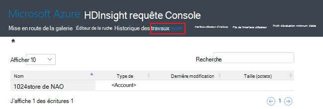

<properties
    pageTitle="Gérer les clusters Hadoop dans HDInsight à l’aide du portail Azure | Microsoft Azure"
    description="Apprenez à administrer le Service de HDInsight. Créer un cluster de HDInsight, ouvrez la console JavaScript interactive et ouvrez la console de commande Hadoop."
    services="hdinsight"
    documentationCenter=""
    tags="azure-portal"
    authors="mumian"
    manager="jhubbard"
    editor="cgronlun"/>

<tags
    ms.service="hdinsight"
    ms.workload="big-data"
    ms.tgt_pltfrm="na"
    ms.devlang="na"
    ms.topic="article"
    ms.date="09/14/2016"
    ms.author="jgao"/>

# Gérer les clusters Hadoop dans HDInsight via le portail Azure

[AZURE.INCLUDE [selector](../../includes/hdinsight-portal-management-selector.md)]

L’utilisation du [portail Azure][azure-portal], vous pouvez créer des clusters d’Hadoop dans Azure HDInsight modifier le mot de passe utilisateur Hadoop et activer le protocole RDP (Remote Desktop) pour pouvoir accéder à la console de commande Hadoop sur le cluster.

Les informations contenues dans cet article s’applique uniquement aux clusters de HDInsight de fenêtre. Pour plus d’informations sur la gestion de clusters basés sur Linux, cliquez sur le sélecteur de tabulations ci-dessus.

Cliquez sur le sélecteur de tabulations pour plus d’informations sur la création de clusters d’Hadoop dans HDInsight à l’aide d’autres outils. 

**Conditions préalables**

Avant de commencer cet article, vous devez disposer des éléments suivants :

- **Abonnement d’un Azure**. Consultez [Azure d’obtenir la version d’évaluation gratuite](https://azure.microsoft.com/documentation/videos/get-azure-free-trial-for-testing-hadoop-in-hdinsight/).
- **Compte de stockage azure** - HDInsight un cluster utilise un conteneur de stockage Azure Blob en tant que le système de fichiers par défaut. Pour plus d’informations sur le stockage des objets Blob Azure offre une expérience transparente avec les clusters de HDInsight, consultez [Stockage de Blob Azure utiliser avec HDInsight](hdinsight-hadoop-use-blob-storage.md). Pour plus d’informations sur la création d’un compte de stockage Azure, reportez-vous à la section [comment créer un compte de stockage](../storage/storage-create-storage-account.md).

##Ouvrir le portail

1. Se connecter à [https://portal.azure.com](https://portal.azure.com).
2. Après avoir ouvert le portail, vous pouvez :

    - Cliquez sur **Nouveau** dans le menu de gauche pour créer un nouveau cluster :
    
        
    - Dans le menu de gauche, cliquez sur **HDInsight Clusters** .
    
        

    Si **HDInsight** n’apparaît pas dans le menu de gauche, cliquez sur **Parcourir**. 

    

##Créer des clusters

Pour les instructions de création via le portail, reportez-vous à la section [HDInsight de créer des clusters](hdinsight-provision-clusters.md#create-using-the-preview-portal).

HDInsight fonctionne avec une large gamme d’Hadoop des composants. Pour la liste des composants qui ont été vérifiés et pris en charge, voir [quelle version de Hadoop est dans Azure HDInsight](hdinsight-component-versioning.md). Vous pouvez personnaliser HDInsight en utilisant l’une des options suivantes :

- Action de Script permet d’exécuter des scripts personnalisés que vous peuvent personnaliser un cluster pour installer des composants personnalisés tels que Giraph ou mode série sur LAN.r ou modifier la configuration du cluster. Pour plus d’informations, reportez-vous à la section [cluster HDInsight de personnaliser à l’aide des actions de Script](hdinsight-hadoop-customize-cluster.md).
- Utilisez les paramètres de personnalisation de cluster dans le Kit de développement .NET HDInsight ou l’Azure PowerShell lors de la création du cluster. Ces modifications de configuration sont ensuite conservées par le biais de la durée de vie du cluster et ne sont pas affectées par reimages de nœud de cluster qui exécute périodiquement une plateforme Azure pour la maintenance. Pour plus d’informations sur les paramètres de personnalisation de cluster, consultez [HDInsight de créer des clusters](hdinsight-provision-clusters.md).
- Certains composants Java natifs, tels que Mahout et en cascade, peuvent être exécutés sur le cluster en tant que fichiers JAR. Ces fichiers JAR peuvent être distribués pour le stockage des objets Blob Azure et soumis au HDInsight clusters par le biais de mécanismes de soumission de projet Hadoop. Pour plus d’informations, reportez-vous à la section [Hadoop de soumettre des travaux par programme](hdinsight-submit-hadoop-jobs-programmatically.md).

    >[AZURE.NOTE] Si vous avez des problèmes de déploiement des fichiers JAR à HDInsight clusters ou appeler des fichiers JAR sur des clusters de HDInsight, contactez le [Support technique de Microsoft](https://azure.microsoft.com/support/options/).

    > Montage en cascade n’est pas pris en charge par HDInsight et n’est pas éligible pour le Support de Microsoft. Pour les listes de composants pris en charge, reportez-vous à la section [Nouveautés dans les versions de cluster fournies par HDInsight ?](hdinsight-component-versioning.md).

Installation d’un logiciel personnalisé sur le cluster à l’aide de connexion Bureau à distance n’est pas pris en charge. Vous devez éviter de stocker des fichiers sur les lecteurs du nœud principal, telles qu’elles seront perdues si vous devez recréer les clusters. Nous vous recommandons de stocker les fichiers sur le stockage des objets Blob Azure. Stockage des objets BLOB est persistant.

##Répertorier et afficher des clusters

1. Se connecter à [https://portal.azure.com](https://portal.azure.com).
2. Dans le menu de gauche, cliquez sur **HDInsight Clusters** .
3. Cliquez sur le nom du cluster. Si la liste de cluster est longue, vous pouvez utiliser le filtre en haut de la page.
4. Double-cliquez sur un cluster à partir de la liste pour afficher les détails.

    **Menu et essentials**:

    
    
    - Pour personnaliser le menu, cliquez n’importe où dans le menu, puis cliquez sur **Personnaliser**.
    - **Paramètres** et **Tous les paramètres**: affiche la lame de **paramètres** pour le cluster, ce qui vous permet d’accéder aux informations de configuration détaillées pour le cluster.
    - URL de **tableau de bord**, **Tableau de bord de Cluster** et **: il s’agit de tous les moyens pour accéder à du tableau de bord du cluster, qui est le site Ambari Web pour les clusters basés sur Linux. - **Secure Shell ** : affiche les instructions pour la connexion au cluster à l’aide de la connexion de SSH (Secure Shell).
    - **Échelle de Cluster**: permet de modifier le nombre de nœuds de traitement pour ce cluster.
    - **Supprimer**: supprime le cluster.
    - **Démarrage rapide ()**: affiche des informations qui vous aideront à démarrer à l’aide de HDInsight.
    - **Les utilisateurs ()**: permet de définir des autorisations pour la _gestion de portail_ de ce cluster pour d’autres utilisateurs de votre abonnement Azure.
    
        > [AZURE.IMPORTANT] Ce _seulement_ affecte les accès et les autorisations pour ce cluster dans Azure portal et n’a aucun effet sur les personnes autorisées à se connecter à ou soumettre des tâches au cluster HDInsight.
    - **Balises ()**: balises vous permet de définir les paires clé/valeur pour définir une classification personnalisée de vos services de nuage. Vous pouvez, par exemple, créez une clé nommée __projet__et ensuite utiliser une valeur commune pour tous les services associés à un projet spécifique.
    - **Les vues Ambari**: liens vers Ambari Web.
    
    > [AZURE.IMPORTANT] Pour gérer les services fournis par le cluster de HDInsight, vous devez utiliser l’API REST de Ambari ou de Ambari Web. Pour plus d’informations sur l’utilisation de Ambari, reportez-vous à la section [HDInsight de gérer les clusters à l’aide de Ambari](hdinsight-hadoop-manage-ambari.md).

    **Utilisation**:
    
    
    
5. Cliquez sur **paramètres**.

    

    - **Propriétés**: afficher les propriétés du cluster.
    - **Identité de DAS de cluster**: 
    - **Les clés de stockage Azure**: permet d’afficher le compte de stockage par défaut et sa clé. Le compte de stockage est configuration pendant le processus de création du cluster.
    - **Connexion de cluster**: modifier le nom d’utilisateur HTTP de cluster et d’un mot de passe.
    - **Metastores externe**: permet d’afficher la ruche et Oozie metastores. Le metastores ne peut être configuré au cours du processus de création du cluster.
    - **Échelle de Cluster**: augmenter et réduire le nombre de nœuds de cluster travailleur.
    - **Bureau à distance**: activer et désactiver l’accès Bureau à distance (RDP) et configurer le nom d’utilisateur RDP.  Le nom d’utilisateur RDP doit être différent du nom d’utilisateur HTTP.
    - **Partenaire de référence**:
    
    > [AZURE.NOTE] Il s’agit d’une liste générique de paramètres disponibles ; tous les sera présent pour tous les types de cluster.

6. Cliquez sur **Propriétés**:

    Les listes de propriétés suivantes :
    
    - **Hostname**: nom du Cluster.
    - **URL du cluster**.
    - **État**: inclure abandonnée, accepté, ClusterStorageProvisioned, AzureVMConfiguration, HDInsightConfiguration, opérationnelle, en cours d’exécution, erreur, suppression, suppression, Timedout, DeleteQueued, DeleteTimedout, DeleteError, PatchQueued, CertRolloverQueued, ResizeQueued, ClusterCustomization
    - **Région**: emplacement Azure. Pour obtenir la liste des emplacements d’Azure pris en charge, consultez **la zone de liste déroulante** sur [HDInsight prix](https://azure.microsoft.com/pricing/details/hdinsight/).
    - **Les données créées**.
    - **Système d’exploitation**: **Windows** ou **Linux**.
    - **Type**: Hadoop, HBase, tempête, au service. 
    - **Version**. Consultez [versions de HDInsight](hdinsight-component-versioning.md)
    - **Abonnement**: nom de l’abonnement.
    - **ID de l’abonnement**.
    - **Source de données principale**. Le compte de stockage Azure Blob utilisé comme système de fichiers par défaut Hadoop.
    - **Nœuds de travailleur niveau de tarification**.
    - **Niveau de tarification de nœud de tête**.

##Supprimer de clusters

Supprimer un cluster ne supprimera pas le compte de stockage par défaut ou un compte de stockage. Vous pouvez recréer le cluster en utilisant les mêmes comptes de stockage et le même metastores.

1. Connectez-vous au [portail de][azure-portal].
2. Cliquez sur **Parcourir toutes** dans le menu de gauche, cliquez sur **Les Clusters HDInsight**le nom de votre cluster.
3. Cliquez sur **Supprimer** dans le menu supérieur, puis suivez les instructions.

Voir aussi [arrêter/suspendre les clusters](#pauseshut-down-clusters).

##Clusters d’échelle
La fonctionnalité de mise à l’échelle de cluster vous permet de modifier le nombre de nœuds de traitement utilisé par un cluster qui exécute dans Azure HDInsight sans avoir à recréer le cluster.

>[AZURE.NOTE] Les clusters uniquement avec HDInsight version 3.1.3 ou plus sont pris en charge. Si vous êtes incertain de la version de votre cluster, vous pouvez vérifier la page Propriétés.  Voir la [liste et afficher des clusters](#list-and-show-clusters).

L’impact de la modification du nombre de nœuds de données pour chaque type de cluster prises en charge par HDInsight :

- Hadoop

    Vous pouvez facilement augmenter le nombre de nœuds de traitement d’un cluster d’Hadoop qui est en cours d’exécution sans impact sur les tâches en attente ou en cours d’exécution. Nouveaux travaux peuvent également être soumises lorsque l’opération est en cours. Échecs lors d’une opération de mise à l’échelle sont correctement gérées afin que le cluster reste toujours en état de fonctionnement.

    Lorsqu’un cluster Hadoop est réduite par la réduction du nombre de nœuds de données, les services du cluster sont redémarrés. Ainsi, en cours d’exécution et en attente de travaux d’échec à la fin de l’opération de mise à l’échelle. Vous pouvez, toutefois, renvoyer les travaux une fois l’opération terminée.

- HBase

    Vous pouvez parfaitement ajouter ou supprimer des nœuds de votre cluster de HBase en cours d’exécution. Les serveurs régionaux sont équilibrées automatiquement après quelques minutes de la fin de l’opération de mise à l’échelle. Toutefois, vous pouvez également manuellement équilibrer les serveurs régionaux en établissant une session dans le headnode de cluster et exécute les commandes suivantes à partir d’une fenêtre d’invite de commande :

        >pushd %HBASE_HOME%\bin
        >hbase shell
        >balancer

    Pour plus d’informations sur l’utilisation de l’interpréteur de commandes HBase, voir]
- Orage

    Vous pouvez en toute transparence d’ajouter ou de supprimer des nœuds de données à votre cluster tempête pendant son exécution. Mais après la réussite de l’opération de mise à l’échelle, vous devrez rééquilibrer la topologie.

    Rééquilibrage peut être réalisé de deux manières :

    * Interface utilisateur web de tempête
    * Outil de l’interface de ligne de commande (CLI)

    Reportez-vous à la [documentation de tempête d’Apache](http://storm.apache.org/documentation/Understanding-the-parallelism-of-a-Storm-topology.html) pour plus de détails.

    L’interface utilisateur du web de Storm est disponible sur le cluster de HDInsight :

    

    Voici un exemple de l’utilisation de la commande CLI pour rééquilibrer la topologie Storm :

        ## Reconfigure the topology "mytopology" to use 5 worker processes,
        ## the spout "blue-spout" to use 3 executors, and
        ## the bolt "yellow-bolt" to use 10 executors

        $ storm rebalance mytopology -n 5 -e blue-spout=3 -e yellow-bolt=10

**Mise à l’échelle des clusters**

1. Connectez-vous au [portail de][azure-portal].
2. Cliquez sur **Parcourir toutes** dans le menu de gauche, cliquez sur **Les Clusters HDInsight**le nom de votre cluster.
3. Cliquez sur **paramètres** dans le menu supérieur, puis cliquez sur **Échelle de Cluster**.
4. Entrez le **numéro de travailleur nœuds**. La limite sur le nombre de nœuds de cluster varie selon les abonnements Azure. Vous pouvez contacter le support de facturation pour augmenter la limite.  Les informations de coût ne reflètent pas les modifications que vous avez apportées au nombre de nœuds.

    

##Pause/arrêter de clusters

La plupart des tâches d’Hadoop est parfois l’exécution de traitements par lots qui sont uniquement. Pour la plupart des clusters Hadoop, il existe de grandes périodes de temps que le cluster n’est pas utilisé pour le traitement. Avec HDInsight, vos données sont stockées dans le stockage Azure, donc vous pouvez supprimer en toute sécurité un cluster lorsqu’il n’est pas en cours d’utilisation.
Vous êtes également chargé pour un cluster de HDInsight, même lorsqu’il n’est pas en cours d’utilisation. Dans la mesure où les frais pour le cluster sont bien plus que les frais de stockage, il est économique judicieux de supprimer les clusters lorsqu’ils ne sont pas en cours d’utilisation.

Il existe de nombreuses manières que vous pouvez programmer le processus :

- Usine de données Azure utilisateur. Pour les services de HDInsight liée à la demande et définis par l’utilisateur, reportez-vous à la section [Service de Azure HDInsight lié](../data-factory/data-factory-compute-linked-services.md) et [transformer et analyser à l’aide de la fabrique de données Azure](../data-factory/data-factory-data-transformation-activities.md) .
- Utilisez PowerShell Azure.  Voir [analyse des données de retard de vol](hdinsight-analyze-flight-delay-data.md).
- Utilisez la CLI Azure. Voir [HDInsight de gérer les clusters à l’aide de la CLI d’Azure](hdinsight-administer-use-command-line.md).
- Utilisez le Kit de développement .NET HDInsight. Voir [Hadoop de soumettre des travaux](hdinsight-submit-hadoop-jobs-programmatically.md).

Pour les informations de tarification, consultez [tarification des HDInsight](https://azure.microsoft.com/pricing/details/hdinsight/). Pour supprimer un cluster à partir du portail, voir [suppression de clusters](#delete-clusters)

##Nom d’utilisateur du cluster change

Un cluster HDInsight peut disposer de deux comptes d’utilisateur. Le compte d’utilisateur de cluster HDInsight est créé pendant le processus de création. Vous pouvez également créer un compte d’utilisateur pour accéder au cluster via RDP RDP. Reportez-vous à la section [Activer le Bureau à distance](#connect-to-hdinsight-clusters-by-using-rdp).

**Pour modifier le nom d’utilisateur de cluster de HDInsight et le mot de passe**

1. Connectez-vous au [portail de][azure-portal].
2. Cliquez sur **Parcourir toutes** dans le menu de gauche, cliquez sur **Les Clusters HDInsight**le nom de votre cluster.
3. Cliquez sur **paramètres** dans le menu supérieur, puis cliquez sur **Connexion de Cluster**.
4. Si la **connexion de Cluster** a été activé, vous devez cliquez sur **désactiver**, puis cliquez sur **Activer** avant de modifier le nom d’utilisateur et le mot de passe...
4. Modifier le **Nom de connexion de Cluster** et/ou le **Mot de passe de connexion de Cluster**, puis cliquez sur **Enregistrer**.

    

##Accès de GRANT ou revoke

HDInsight clusters ont les services web HTTP suivants (tous ces services ont des points de terminaison RESTful) :

- ODBC
- JDBC
- Ambari
- Oozie
- Templeton

Par défaut, ces services sont accordées pour l’accès. Vous pouvez révoquer/accorder l’accès à partir du portail Azure.

>[AZURE.NOTE] Par attribution/révocation de l’accès, vous allez réinitialiser le nom d’utilisateur de cluster et d’un mot de passe.

**Pour l’accès aux services HTTP web de grant ou revoke**

1. Connectez-vous au [portail de][azure-portal].
2. Cliquez sur **Parcourir toutes** dans le menu de gauche, cliquez sur **Les Clusters HDInsight**le nom de votre cluster.
3. Cliquez sur **paramètres** dans le menu supérieur, puis cliquez sur **Connexion de Cluster**.
4. Si la **connexion de Cluster** a été activé, vous devez cliquez sur **désactiver**, puis cliquez sur **Activer** avant de modifier le nom d’utilisateur et le mot de passe...
6. Pour **Nom de connexion de Cluster** et **Cluster de mot de passe**, entrez le nouveau nom d’utilisateur et le mot de passe (respectivement) pour le cluster.
7. Cliquez sur **Enregistrer**.

    

##Recherchez le compte de stockage par défaut

Chaque cluster HDInsight a un compte de stockage par défaut. Le compte de stockage par défaut et ses clés pour un cluster apparaît sous **paramètres**/**Propriétés**/**Clés de stockage Azure**. Voir la [liste et afficher des clusters](#list-and-show-clusters).

    
##Trouver le groupe de ressources 

En mode de Gestionnaire des ressources Azure, chaque cluster HDInsight est créé avec un groupe de ressources Azure. Le groupe de ressources Azure appartenant à un cluster apparaît dans :

- La liste de cluster possède une colonne du **Groupe de ressources** .
- Mosaïque **essentielles** du cluster.  

Voir la [liste et afficher des clusters](#list-and-show-clusters).
   
##Ouvrir la console HDInsight requête

La console de la requête de HDInsight inclut les fonctionnalités suivantes :

- **Galerie mise en route**: pour utiliser la galerie, consultez [Hadoop de savoir à l’aide de la galerie Azure HDInsight mise en route](hdinsight-learn-hadoop-use-sample-gallery.md).
- **Éditeur de la ruche**: interface web de l’interface utilisateur graphique A pour soumettre des tâches de la ruche.  Consultez [la ruche exécuter des requêtes à l’aide de la Console de la requête](hdinsight-hadoop-use-hive-query-console.md).

    

- **L’historique du travail**: moniteur Hadoop travaux.  

    

    Cliquez sur le **Nom de la requête** pour afficher les détails, y compris les propriétés de la tâche, la **Tâche de requête**, et ** sortie des tâches. Vous pouvez également télécharger la requête et la sortie sur votre station de travail.

- **Explorateur de fichiers**: parcourir le compte de stockage par défaut et les comptes de stockage.

    

    Dans la capture d’écran, la **<Account>** type indique que l’élément est un compte de stockage Azure.  Cliquez sur le nom du compte pour parcourir les fichiers.
    
- **L’interface utilisateur d’Hadoop**.

    
    
    À partir de **Hadoop UI*, vous pouvez parcourir les fichiers et recherchez dans les journaux. 

- **Fils de l’interface utilisateur**.

    

##Exécuter des requêtes de la ruche

À l’exécution de travaux de la ruche à partir du portail, cliquez sur **Éditeur de la ruche** dans la console de la requête de HDInsight. Voir [console de HDInsight ouvrir la requête](#open-hdinsight-query-console).

##Surveillance des tâches

Pour surveiller les travaux à partir du portail, cliquez sur **Historique des travaux** dans la console de la requête de HDInsight. Voir [console de HDInsight ouvrir la requête](#open-hdinsight-query-console).

##Parcourir les fichiers

Pour parcourir les fichiers stockés dans le compte de stockage par défaut et les comptes de stockage, cliquez sur **Explorateur de fichiers** dans la console de la requête de HDInsight. Voir [console de HDInsight ouvrir la requête](#open-hdinsight-query-console).

Vous pouvez également utiliser l’utilitaire de **Parcourir le système de fichiers** à partir de l' **Interface utilisateur d’Hadoop** dans la console de HDInsight.  Voir [console de HDInsight ouvrir la requête](#open-hdinsight-query-console).

##Surveiller l’utilisation de cluster

La section __utilisation__ de la lame de cluster HDInsight affiche des informations sur le nombre de cœurs disponibles à votre abonnement pour une utilisation avec HDInsight, ainsi que le nombre de cœurs alloué à ce cluster et comment elles sont allouées pour les nœuds de ce cluster. Voir la [liste et afficher des clusters](#list-and-show-clusters).

> [AZURE.IMPORTANT] Pour surveiller les services fournis par le cluster de HDInsight, vous devez utiliser l’API REST de Ambari ou de Ambari Web. Pour plus d’informations sur l’utilisation de Ambari, reportez-vous à la section [HDInsight de gérer les clusters à l’aide de Ambari](hdinsight-hadoop-manage-ambari.md)

##Ouvrez l’interface utilisateur d’Hadoop

Pour surveiller le cluster et parcourir le système de fichiers journaux, cliquez sur **L’interface utilisateur d’Hadoop** dans la console de la requête de HDInsight. Voir [console de HDInsight ouvrir la requête](#open-hdinsight-query-console).

##Ouvrez l’interface utilisateur de fils

Pour utiliser l’interface utilisateur de fils, cliquez sur **L’interface utilisateur de fils** dans la console de la requête de HDInsight. Voir [console de HDInsight ouvrir la requête](#open-hdinsight-query-console).

##Se connecter à des clusters à l’aide de RDP

Les informations d’identification pour le cluster que vous avez fournies lors de sa création permettent d’accéder aux services sur le cluster, mais pas pour le cluster lui-même via le Bureau à distance. Vous pouvez activer l’accès Bureau à distance lorsque vous configurez un cluster ou après qu’un cluster est mis en service. Pour obtenir des instructions sur l’activation du Bureau à distance lors de la création, consultez [créer un HDInsight cluster](hdinsight-provision-clusters.md).

**Pour activer le Bureau à distance**

1. Connectez-vous au [portail de][azure-portal].
2. Cliquez sur **Parcourir toutes** dans le menu de gauche, cliquez sur **Les Clusters HDInsight**le nom de votre cluster.
3. Cliquez sur **paramètres** dans le menu supérieur, puis cliquez sur **Bureau à distance**.
4. Entrez **Expire**, **Nom d’utilisateur de bureau à distance** et le **Mot de passe de bureau à distance**, puis cliquez sur **Activer**.

    

    Les valeurs par défaut pour l’expiration est d’une semaine.
> [AZURE.NOTE] Vous pouvez également utiliser le Kit de développement .NET HDInsight pour activer le Bureau à distance sur un cluster. Utilisez la méthode **EnableRdp** sur l’objet de client HDInsight de la manière suivante : **client. EnableRdp (nom_cluster, emplacement, "rdpuser", "rdppassword", DateTime.Now.AddDays(6))**. De même, pour désactiver le Bureau à distance sur le cluster, vous pouvez utiliser **client. DisableRdp (nom_cluster, emplacement)**. Pour plus d’informations sur ces méthodes, consultez la [Référence du Kit de développement .NET HDInsight](http://go.microsoft.com/fwlink/?LinkId=529017). Ceci est applicable uniquement pour les clusters HDInsight sous Windows.

**Pour vous connecter à un cluster à l’aide de RDP**

1. Connectez-vous au [portail de][azure-portal].
2. Cliquez sur **Parcourir toutes** dans le menu de gauche, cliquez sur **Les Clusters HDInsight**le nom de votre cluster.
3. Cliquez sur **paramètres** dans le menu supérieur, puis cliquez sur **Bureau à distance**.
4. Cliquez sur **se connecter** , puis suivez les instructions. Si la connexion est désactivée, vous devez tout d’abord l’activer. Assurez-vous que le nom d’utilisateur de bureau à distance et d’un mot de passe.  Vous ne pouvez pas utiliser les informations d’identification utilisateur de Cluster.

##Ouvrez la ligne de commande Hadoop

Pour se connecter au cluster à l’aide du Bureau à distance et d’utiliser la ligne de commande Hadoop, vous devez tout d’abord activer l’accès Bureau à distance au cluster comme décrit dans la section précédente.

**Pour ouvrir une ligne de commande Hadoop**

1. La connexion au cluster à l’aide du Bureau à distance.
8. Sur le bureau, double-cliquez sur **ligne de commande Hadoop**.

    ![HDI. HadoopCommandLine][image-hadoopcommandline]

    Pour plus d’informations sur les commandes d’Hadoop, voir [référence des commandes Hadoop](http://hadoop.apache.org/docs/current/hadoop-project-dist/hadoop-common/CommandsManual.html).

Dans la capture d’écran précédente, le nom du dossier a le numéro de version d’Hadoop intégré. Le numéro de version modifiables selon la version des composants Hadoop installé sur le cluster. Vous pouvez utiliser des variables d’environnement Hadoop pour faire référence à ces dossiers. Par exemple :

    cd %hadoop_home%
    cd %hive_home%
    cd %hbase_home%
    cd %pig_home%
    cd %sqoop_home%
    cd %hcatalog_home%
    
##Étapes suivantes
Dans cet article, vous avez appris comment créer un cluster de HDInsight à l’aide du portail et ouvrir l’outil de ligne de commande Hadoop. Pour plus d’informations, consultez les articles suivants :

* [Administrer les HDInsight à l’aide de PowerShell Azure](hdinsight-administer-use-powershell.md)
* [Administrer les HDInsight à l’aide de la CLI Azure](hdinsight-administer-use-command-line.md)
* [Créer des clusters HDInsight](hdinsight-provision-clusters.md)
* [Soumettre des travaux d’Hadoop par programme](hdinsight-submit-hadoop-jobs-programmatically.md)
* [Mise en route de HDInsight Azure](hdinsight-hadoop-linux-tutorial-get-started.md)
* [Quelle version d’Hadoop est dans Azure HDInsight ?](hdinsight-component-versioning.md)

[azure-portal]: https://portal.azure.com
[image-hadoopcommandline]: ./media/hdinsight-administer-use-management-portal/hdinsight-hadoop-command-line.png "Ligne de commande Hadoop"
