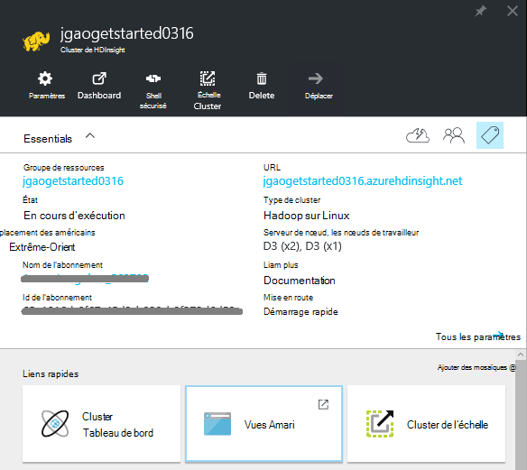
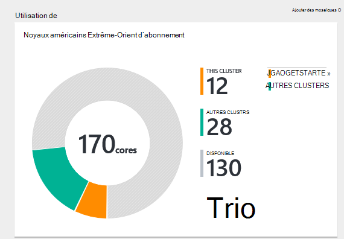
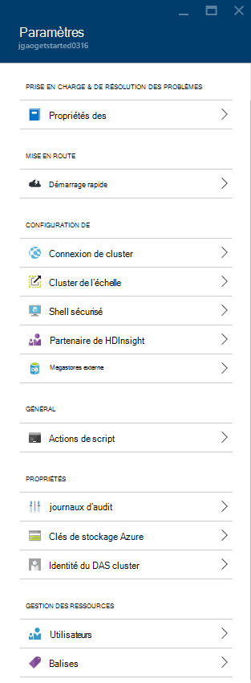
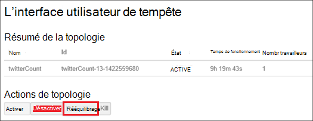
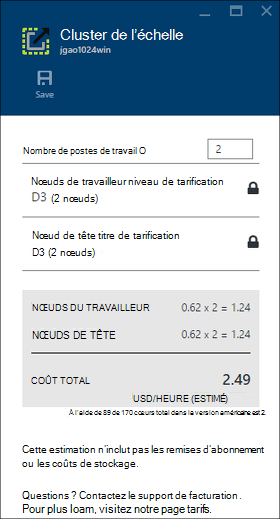
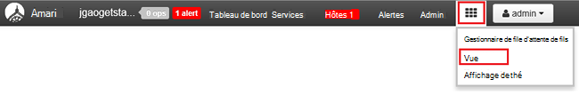

<properties
    pageTitle="Gérer les clusters basés sur Linux de Hadoop dans HDInsight à l’aide du portail Azure | Microsoft Azure"
    description="Découvrez comment créer et gérer des clusters basés sur Linux de HDInsight à l’aide du portail Azure."
    services="hdinsight"
    documentationCenter=""
    authors="mumian"
    manager="jhubbard"
    editor="cgronlun"
    tags="azure-portal"/>

<tags
    ms.service="hdinsight"
    ms.workload="big-data"
    ms.tgt_pltfrm="na"
    ms.devlang="na"
    ms.topic="article"
    ms.date="08/10/2016"
    ms.author="jgao"/>

#Gérer les clusters Hadoop dans HDInsight via le portail Azure

[AZURE.INCLUDE [selector](../../includes/hdinsight-portal-management-selector.md)]

L’utilisation du [portail Azure][azure-portal], vous pouvez gérer les clusters basés sur Linux dans Azure HDInsight. Pour plus d’informations sur la création de clusters d’Hadoop dans HDInsight à l’aide d’autres outils, utilisez le sélecteur de tabulations. 

**Conditions préalables**

Avant de commencer cet article, vous devez disposer des éléments suivants :

- **Abonnement d’un Azure**. Consultez [Azure d’obtenir la version d’évaluation gratuite](https://azure.microsoft.com/documentation/videos/get-azure-free-trial-for-testing-hadoop-in-hdinsight/).

##Ouvrir le portail

1. Se connecter à [https://portal.azure.com](https://portal.azure.com).
2. Après avoir ouvert le portail, vous pouvez :

    - Cliquez sur **Nouveau** dans le menu de gauche pour créer un nouveau cluster :
    
        
    - Cliquez sur **HDInsight les Clusters** à partir du menu de gauche pour répertorier les clusters existants
    
        

        Si **HDInsight** n’apparaît pas dans le menu de gauche, cliquez sur **Parcourir**, puis cliquez sur **HDInsight Clusters**.

        

##Créer des clusters

[AZURE.INCLUDE [delete-cluster-warning](../../includes/hdinsight-delete-cluster-warning.md)]

HDInsight fonctionne avec une large gamme d’Hadoop des composants. Pour la liste des composants qui ont été vérifiés et pris en charge, voir [quelle version de Hadoop est dans Azure HDInsight](hdinsight-component-versioning.md). Pour les informations de création générales de cluster, consultez [Hadoop de créer des clusters dans HDInsight](hdinsight-hadoop-provision-linux-clusters.md). 

##Répertorier et afficher des clusters

1. Se connecter à [https://portal.azure.com](https://portal.azure.com).
2. Dans le menu de gauche pour les clusters existants de la liste, cliquez sur **HDInsight Clusters** .
3. Cliquez sur le nom du cluster. Si la liste de cluster est longue, vous pouvez utiliser le filtre en haut de la page.
4. Double-cliquez sur un cluster à partir de la liste pour afficher les détails.

    **Menu et essentials**:

    
    
    - **Paramètres** et **Tous les paramètres**: affiche la lame de **paramètres** pour le cluster, ce qui vous permet d’accéder aux informations de configuration détaillées pour le cluster.
    - **Tableau de bord**, **Tableau de bord de Cluster** et ** URL : il s’agit de tous les moyens pour accéder à du tableau de bord du cluster, qui est le site Ambari Web pour les clusters basés sur Linux.
    - **Secure Shell**: affiche les instructions pour la connexion au cluster à l’aide de la connexion de SSH (Secure Shell).
    - **Échelle de Cluster**: permet de modifier le nombre de nœuds de traitement pour ce cluster.
    - **Supprimer**: supprime le cluster.
    - **Démarrage rapide ()**: affiche des informations qui vous aideront à démarrer à l’aide de HDInsight.
    - **Les utilisateurs ()**: permet de définir des autorisations pour la _gestion de portail_ de ce cluster pour d’autres utilisateurs de votre abonnement Azure.
    
        > [AZURE.IMPORTANT] Ce _seulement_ affecte les accès et les autorisations pour ce cluster dans Azure portal et n’a aucun effet sur les personnes autorisées à se connecter à ou soumettre des tâches au cluster HDInsight.
    - **Balises ()**: balises vous permet de définir les paires clé/valeur pour définir une classification personnalisée de vos services de nuage. Vous pouvez, par exemple, créez une clé nommée __projet__et ensuite utiliser une valeur commune pour tous les services associés à un projet spécifique.
    - **Les vues Ambari**: liens vers Ambari Web.
    
    > [AZURE.IMPORTANT] Pour gérer les services fournis par le cluster de HDInsight, vous devez utiliser l’API REST de Ambari ou de Ambari Web. Pour plus d’informations sur l’utilisation de Ambari, reportez-vous à la section [HDInsight de gérer les clusters à l’aide de Ambari](hdinsight-hadoop-manage-ambari.md).

    **Utilisation**:
    
    
    
5. Cliquez sur **paramètres**.

    

    - **Les journaux d’audit**:
    - **Démarrage rapide**: affiche des informations qui vous aideront à démarrer à l’aide de HDInsight.
    - **Échelle de Cluster**: augmenter et réduire le nombre de nœuds de cluster travailleur.
    - **Secure Shell**: affiche les instructions pour la connexion au cluster à l’aide de la connexion de SSH (Secure Shell).
    - **HDInsight partenaire**: ajouter ou supprimer un partenaire HDInsight en cours.
    - **Metastores externe**: permet d’afficher la ruche et Oozie metastores. Le metastores ne peut être configuré au cours du processus de création du cluster.
    - **Actions de script**: les scripts Bash de s’exécuter sur le cluster.
    - **Propriétés**: afficher les propriétés du cluster.
    - **Les clés de stockage Azure**: permet d’afficher le compte de stockage par défaut et sa clé. Le compte de stockage est configuration pendant le processus de création du cluster.
    - **Identité de DAS de cluster**: 
    - **Utilisateurs**: permet de définir des autorisations pour la _gestion de portail_ de ce cluster pour d’autres utilisateurs de votre abonnement Azure.
    - **Balises**: balises vous permet de définir les paires clé/valeur pour définir une classification personnalisée de vos services de nuage. Vous pouvez, par exemple, créez une clé nommée __projet__et ensuite utiliser une valeur commune pour tous les services associés à un projet spécifique.
    
    > [AZURE.NOTE] Il s’agit d’une liste générique de paramètres disponibles ; tous les sera présent pour tous les types de cluster.

6. Cliquez sur **Propriétés**:

    Les propriétés sont les suivantes :
    
    - **Hostname**: nom du Cluster.
    - **URL du cluster**.
    - **État**: inclure abandonnée, accepté, ClusterStorageProvisioned, AzureVMConfiguration, HDInsightConfiguration, opérationnelle, en cours d’exécution, erreur, suppression, suppression, Timedout, DeleteQueued, DeleteTimedout, DeleteError, PatchQueued, CertRolloverQueued, ResizeQueued, ClusterCustomization
    - **Région**: emplacement Azure. Pour obtenir la liste des emplacements d’Azure pris en charge, consultez **la zone de liste déroulante** sur [HDInsight prix](https://azure.microsoft.com/pricing/details/hdinsight/).
    - **Les données créées**.
    - **Système d’exploitation**: **Windows** ou **Linux**.
    - **Type**: Hadoop, HBase, tempête, au service. 
    - **Version**. Consultez [versions de HDInsight](hdinsight-component-versioning.md)
    - **Abonnement**: nom de l’abonnement.
    - **ID de l’abonnement**.
    - **Source de données par défaut**: le système de fichiers de cluster par défaut.
    - **Nœuds de travailleur niveau de tarification**.
    - **Niveau de tarification de nœud de tête**.

##Supprimer de clusters

Supprimer un cluster ne supprimera pas le compte de stockage par défaut ou un compte de stockage. Vous pouvez recréer le cluster en utilisant les mêmes comptes de stockage et le même metastores. Il est recommandé d’utiliser un nouveau conteneur de Blob par défaut lorsque vous créez de nouveau le cluster.

1. Connectez-vous au [portail de][azure-portal].
2. Cliquez sur **Parcourir toutes** dans le menu de gauche, cliquez sur **Les Clusters HDInsight**le nom de votre cluster.
3. Cliquez sur **Supprimer** dans le menu supérieur, puis suivez les instructions.

Voir aussi [arrêter/suspendre les clusters](#pauseshut-down-clusters).

##Clusters d’échelle
La fonctionnalité de mise à l’échelle de cluster vous permet de modifier le nombre de nœuds de traitement utilisé par un cluster qui exécute dans Azure HDInsight sans avoir à recréer le cluster.

>[AZURE.NOTE] Les clusters uniquement avec HDInsight version 3.1.3 ou plus sont pris en charge. Si vous êtes incertain de la version de votre cluster, vous pouvez vérifier la page Propriétés.  Voir la [liste et afficher des clusters](#list-and-show-clusters).

L’impact de la modification du nombre de nœuds de données pour chaque type de cluster prises en charge par HDInsight :

- Hadoop

    Vous pouvez facilement augmenter le nombre de nœuds de traitement d’un cluster d’Hadoop qui est en cours d’exécution sans impact sur les tâches en attente ou en cours d’exécution. Nouveaux travaux peuvent également être soumises lorsque l’opération est en cours. Échecs lors d’une opération de mise à l’échelle sont correctement gérées afin que le cluster reste toujours en état de fonctionnement.

    Lorsqu’un cluster Hadoop est réduite par la réduction du nombre de nœuds de données, les services du cluster sont redémarrés. Ainsi, en cours d’exécution et en attente de travaux d’échec à la fin de l’opération de mise à l’échelle. Vous pouvez, toutefois, renvoyer les travaux une fois l’opération terminée.

- HBase

    Vous pouvez parfaitement ajouter ou supprimer des nœuds de votre cluster de HBase en cours d’exécution. Les serveurs régionaux sont équilibrées automatiquement après quelques minutes de la fin de l’opération de mise à l’échelle. Toutefois, vous pouvez également manuellement équilibrer les serveurs régionaux en établissant une session dans le headnode de cluster et exécute les commandes suivantes à partir d’une fenêtre d’invite de commande :

        >pushd %HBASE_HOME%\bin
        >hbase shell
        >balancer

    Pour plus d’informations sur l’utilisation de l’interpréteur de commandes HBase, voir]
- Orage

    Vous pouvez en toute transparence d’ajouter ou de supprimer des nœuds de données à votre cluster tempête pendant son exécution. Mais après la réussite de l’opération de mise à l’échelle, vous devrez rééquilibrer la topologie.

    Rééquilibrage peut être réalisé de deux manières :

    * Interface utilisateur web de tempête
    * Outil de l’interface de ligne de commande (CLI)

    Reportez-vous à la [documentation de tempête d’Apache](http://storm.apache.org/documentation/Understanding-the-parallelism-of-a-Storm-topology.html) pour plus de détails.

    L’interface utilisateur du web de Storm est disponible sur le cluster de HDInsight :

    

    Voici un exemple de l’utilisation de la commande CLI pour rééquilibrer la topologie Storm :

        ## Reconfigure the topology "mytopology" to use 5 worker processes,
        ## the spout "blue-spout" to use 3 executors, and
        ## the bolt "yellow-bolt" to use 10 executors

        $ storm rebalance mytopology -n 5 -e blue-spout=3 -e yellow-bolt=10

**Mise à l’échelle des clusters**

1. Connectez-vous au [portail de][azure-portal].
2. Cliquez sur **Parcourir toutes** dans le menu de gauche, cliquez sur **Les Clusters HDInsight**le nom de votre cluster.
3. Cliquez sur **paramètres** dans le menu supérieur, puis cliquez sur **Échelle de Cluster**.
4. Entrez le **numéro de travailleur nœuds**. La limite sur le nombre de nœuds de cluster varie selon les abonnements Azure. Vous pouvez contacter le support de facturation pour augmenter la limite.  Les informations de coût ne reflètent pas les modifications que vous avez apportées au nombre de nœuds.

    

##Pause/arrêter de clusters

La plupart des tâches d’Hadoop est parfois l’exécution de traitements par lots qui sont uniquement. Pour la plupart des clusters Hadoop, il existe de grandes périodes de temps que le cluster n’est pas utilisé pour le traitement. Avec HDInsight, vos données sont stockées dans le stockage Azure, donc vous pouvez supprimer en toute sécurité un cluster lorsqu’il n’est pas en cours d’utilisation.
Vous êtes également chargé pour un cluster de HDInsight, même lorsqu’il n’est pas en cours d’utilisation. Dans la mesure où les frais pour le cluster sont bien plus que les frais de stockage, il est économique judicieux de supprimer les clusters lorsqu’ils ne sont pas en cours d’utilisation.

Il existe de nombreuses manières que vous pouvez programmer le processus :

- Usine de données Azure utilisateur. Reportez-vous à la section [créer à la demande basés sur Linux de Hadoop clusters dans HDInsight à l’aide de la fabrique de données Azure](hdinsight-hadoop-create-linux-clusters-adf.md) pour la création de services de HDInsight liée à la demande.
- Utilisez PowerShell Azure.  Voir [analyse des données de retard de vol](hdinsight-analyze-flight-delay-data.md).
- Utilisez la CLI Azure. Voir [HDInsight de gérer les clusters à l’aide de la CLI d’Azure](hdinsight-administer-use-command-line.md).
- Utilisez le Kit de développement .NET HDInsight. Voir [Hadoop de soumettre des travaux](hdinsight-submit-hadoop-jobs-programmatically.md).

Pour les informations de tarification, consultez [tarification des HDInsight](https://azure.microsoft.com/pricing/details/hdinsight/). Pour supprimer un cluster à partir du portail, voir [suppression de clusters](#delete-clusters)

##Modifier les mots de passe

Un cluster HDInsight peut disposer de deux comptes d’utilisateur. Le HDInsight (également appelé compte utilisateur de cluster Compte d’utilisateur HTTP) et le compte d’utilisateur SSH sont créés pendant le processus de création. Vous pouvez le web Ambari l’interface utilisateur pour modifier le compte utilisateur de cluster et mot de passe et des actions de script pour modifier le compte d’utilisateur SSH

###Modifier le mot de passe utilisateur

Vous pouvez utiliser l’interface utilisateur Web de Ambari pour modifier le mot de passe utilisateur. Pour vous connecter à Ambari, vous devez utiliser le nom d’utilisateur de cluster existants et le mot de passe.

> [AZURE.NOTE] Si vous modifiez le mot de passe utilisateur (admin), cela peut entraîner des actions exécutées ce cluster Échec de script. Si vous disposez de toutes les actions de script persistante que noeuds de travail cible, il peuvent échouer lorsque vous ajoutez des nœuds au cluster par le biais de redimensionnement des opérations. Pour plus d’informations sur les actions de script, voir [clusters de HDInsight de personnaliser à l’aide des actions de script](hdinsight-hadoop-customize-cluster-linux.md).

1. Connectez-vous à l’interface utilisateur Web de Ambari à l’aide des informations d’identification utilisateur HDInsight cluster. Le nom d’utilisateur par défaut est **admin**. L’URL est **https://&lt;nom de Cluster HDInsight > azurehdinsight.net**.
2. Cliquez sur **Admin** dans le menu supérieur, puis cliquez sur « Gérer Ambari ». 
3. Dans le menu de gauche, cliquez sur **utilisateurs**.
4. Cliquez sur **Admin**.
5. Cliquez sur **Modifier le mot de passe**.

Puis, Ambari modifie le mot de passe sur tous les nœuds du cluster.

###Modifier le mot de passe utilisateur SSH

1. À l’aide d’un éditeur de texte, d’enregistrer celui-ci sous la forme d’un fichier nommé __changepassword.sh__.

    > [AZURE.IMPORTANT] Vous devez utiliser un éditeur qui utilise un saut de ligne en tant que la fin de la ligne. Si l’éditeur utilise CRLF, puis le script ne fonctionnera pas.
    
        #! /bin/bash
        USER=$1
        PASS=$2

        usermod --password $(echo $PASS | openssl passwd -1 -stdin) $USER

2. Téléchargez le fichier vers un emplacement qui est accessible à partir de HDInsight à l’aide d’une adresse HTTP ou HTTPS. Par exemple, un fichier public stocker comme stockage OneDrive ou les Blob Azure. Enregistrer l’URI (adresse HTTP ou HTTPS), dans le fichier, comme cela est nécessaire à l’étape suivante.

3. À partir du portail Azure, sélectionnez votre cluster HDInsight, puis __tous les paramètres__. À partir de la blade de __paramètres__ , sélectionnez __Les Actions de Script__.

4. À partir de la blade __d’Actions de Script__ , sélectionnez __Soumettre de nouveau__. Lorsque la blade __d’action script d’envoi__ s’affiche, entrez les informations suivantes.

  	| Champ | Valeur |
  	| ----- | ----- |
  	| Nom | Modifier ssh mot de passe |
  	| Script Bash URI | L’URI du fichier changepassword.sh |
  	| Noeuds (chef, travailleur, Nimbus, superviseur, soigneur, etc.) | ✓ pour tous les types de nœuds répertoriés |
  	| Paramètres | Entrez le nom d’utilisateur SSH, puis le nouveau mot de passe. Il doit y avoir un espace entre le nom d’utilisateur et le mot de passe.
  	| Conserver cette action de script... | Laissez ce champ non coché.

5. Sélectionnez __créer__ pour appliquer le script. Une fois le script terminé, vous serez en mesure de se connecter au cluster à l’aide de SSH avec le nouveau mot de passe.

##Accès de GRANT ou revoke

HDInsight clusters ont les services web HTTP suivants (tous ces services ont des points de terminaison RESTful) :

- ODBC
- JDBC
- Ambari
- Oozie
- Templeton

Par défaut, ces services sont accordées pour l’accès. Vous pouvez révoquer/accorder l’accès à l’aide de la [CLI d’Azure](hdinsight-administer-use-command-line.md#enabledisable-http-access-for-a-cluster) et [d’Azure PowerShell](hdinsight-administer-use-powershell.md#grantrevoke-access).

##Rechercher l’ID d’abonnement

**Pour trouver votre ID d’abonnement Azure**

1. Connectez-vous au [portail de][azure-portal].
2. Cliquez sur **Parcourir toutes** dans le menu de gauche, puis cliquez sur **abonnements**. Chaque abonnement a un nom et un code.

Chaque cluster est lié à un abonnement Azure. L’ID d’abonnement est indiqué sur le cluster de mosaïque **essentielles** . Voir la [liste et afficher des clusters](#list-and-show-clusters).

##Trouver le groupe de ressources 

En mode ARM, chaque cluster HDInsight est créé avec un groupe de ressources Azure. Le groupe de ressources Azure appartenant à un cluster apparaît dans :

- La liste de cluster possède une colonne du **Groupe de ressources** .
- Mosaïque **essentielles** du cluster.  

Voir la [liste et afficher des clusters](#list-and-show-clusters).

##Recherchez le compte de stockage par défaut

Chaque cluster HDInsight a un compte de stockage par défaut. Le compte de stockage par défaut et ses clés pour un cluster apparaît sous **paramètres**/**Propriétés**/**Clés de stockage Azure**. Voir la [liste et afficher des clusters](#list-and-show-clusters).

##Exécuter des requêtes de la ruche

Vous ne pouvez pas exécuter ruche de travail directement à partir du portail Azure, mais vous pouvez utiliser l’affichage de la ruche de l’interface utilisateur Web de Ambari.

**Pour exécuter des requêtes de ruche à l’aide de la vue de la ruche Ambari**

1. Connectez-vous à l’interface utilisateur Web de Ambari à l’aide des informations d’identification utilisateur HDInsight cluster. Le nom d’utilisateur par défaut est **admin**. L’URL est **https://&lt;nom de Cluster HDInsight > azurehdinsight.net**.
2. Afficher la ruche comme illustré dans la capture d’écran suivante :  

    
3. Dans le menu supérieur, cliquez sur **requête** .
4. Permet d’entrer une requête de la ruche dans **l’Éditeur de requête**, puis cliquez sur **Execute**.

##Surveillance des tâches

Voir [HDInsight de gérer les clusters à l’aide de l’interface utilisateur Web de Ambari](hdinsight-hadoop-manage-ambari.md#monitoring).

##Parcourir les fichiers

Utilisation du portail Azure, vous pouvez parcourir le contenu du conteneur par défaut.

1. Se connecter à [https://portal.azure.com](https://portal.azure.com).
2. Dans le menu de gauche pour les clusters existants de la liste, cliquez sur **HDInsight Clusters** .
3. Cliquez sur le nom du cluster. Si la liste de cluster est longue, vous pouvez utiliser le filtre en haut de la page.
4. Cliquez sur **paramètres**.
5. À partir de lames de **paramètres** , cliquez sur **Clés de stockage Azure**.
6. Cliquez sur le nom de compte de stockage par défaut.
7. Cliquez sur la mosaïque **d’objets BLOB** .
8. Cliquez sur le nom de conteneur par défaut.

##Surveiller l’utilisation de cluster

La section __utilisation__ de la lame de cluster HDInsight affiche des informations sur le nombre de cœurs disponibles à votre abonnement pour une utilisation avec HDInsight, ainsi que le nombre de cœurs alloué à ce cluster et comment elles sont allouées pour les nœuds de ce cluster. Voir la [liste et afficher des clusters](#list-and-show-clusters).

> [AZURE.IMPORTANT] Pour surveiller les services fournis par le cluster de HDInsight, vous devez utiliser l’API REST de Ambari ou de Ambari Web. Pour plus d’informations sur l’utilisation de Ambari, reportez-vous à la section [HDInsight de gérer les clusters à l’aide de Ambari](hdinsight-hadoop-manage-ambari.md)

##Se connecter à un cluster

Voir [utiliser la ruche avec Hadoop dans HDInsight avec SSH](hdinsight-hadoop-use-hive-ssh.md#ssh).
    
##Étapes suivantes
Dans cet article, vous avez appris comment créer un cluster de HDInsight à l’aide du portail et ouvrir l’outil de ligne de commande Hadoop. Pour plus d’informations, consultez les articles suivants :

* [Administrer les HDInsight à l’aide de PowerShell Azure](hdinsight-administer-use-powershell.md)
* [Administrer les HDInsight à l’aide de la CLI Azure](hdinsight-administer-use-command-line.md)
* [Créer des clusters HDInsight](hdinsight-provision-clusters.md)
* [Utilisez la ruche dans HDInsight](hdinsight-use-hive.md)
* [Utiliser des porcs dans HDInsight](hdinsight-use-pig.md)
* [Utiliser Sqoop dans HDInsight](hdinsight-use-sqoop.md)
* [Mise en route de HDInsight Azure](hdinsight-hadoop-linux-tutorial-get-started.md)
* [Quelle version d’Hadoop est dans Azure HDInsight ?](hdinsight-component-versioning.md)

[azure-portal]: https://portal.azure.com
[image-hadoopcommandline]: ./media/hdinsight-administer-use-portal-linux/hdinsight-hadoop-command-line.png "Ligne de commande Hadoop"
