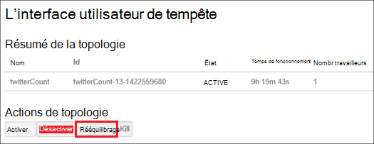

<properties
    pageTitle="Gérer les clusters Hadoop dans HDInsight avec PowerShell | Microsoft Azure"
    description="Découvrez comment effectuer des tâches administratives pour les clusters Hadoop dans HDInsight à l’aide de PowerShell d’Azure."
    services="hdinsight"
    editor="cgronlun"
    manager="jhubbard"
    tags="azure-portal"
    authors="mumian"
    documentationCenter=""/>

<tags
    ms.service="hdinsight"
    ms.workload="big-data"
    ms.tgt_pltfrm="na"
    ms.devlang="na"
    ms.topic="article"
    ms.date="08/10/2016"
    ms.author="jgao"/>

# Gérer les clusters Hadoop dans HDInsight à l’aide de PowerShell d’Azure

[AZURE.INCLUDE [selector](../../includes/hdinsight-portal-management-selector.md)]

Azure PowerShell est un environnement de script puissant qui vous permet de contrôler et d’automatiser le déploiement et la gestion de vos charges de travail dans Azure. Dans cet article, vous apprendrez comment gérer des clusters d’Hadoop dans Azure HDInsight à l’aide d’une console d’Azure PowerShell locale à l’aide de Windows PowerShell. Pour une liste des applets de commande HDInsight PowerShell, consultez [référence d’applet de commande HDInsight][hdinsight-powershell-reference].

**Conditions préalables**

Avant de commencer cet article, vous devez disposer des éléments suivants :

- **Abonnement d’un Azure**. Consultez [Azure d’obtenir la version d’évaluation gratuite](https://azure.microsoft.com/documentation/videos/get-azure-free-trial-for-testing-hadoop-in-hdinsight/).

##Installer PowerShell Azure

[AZURE.INCLUDE [upgrade-powershell](../../includes/hdinsight-use-latest-powershell.md)]

Si vous avez installé Azure PowerShell version 0.9 x, vous devez la désinstaller avant d’installer une version plus récente.

Pour vérifier la version de PowerShell installé :

    Get-Module *azure*
    
Pour désinstaller l’ancienne version, exécuter des programmes et fonctionnalités dans le panneau de configuration. 

##Créer des clusters

Consultez [basé sur Linux de créer des clusters dans HDInsight à l’aide de PowerShell d’Azure](hdinsight-hadoop-create-linux-clusters-azure-powershell.md)

##Liste des clusters
Utilisez la commande suivante pour répertorier tous les clusters de l’abonnement en cours :

    Get-AzureRmHDInsightCluster

##Afficher le cluster

Pour afficher les détails d’un cluster spécifique dans l’abonnement en cours, utilisez la commande suivante :

    Get-AzureRmHDInsightCluster -ClusterName <Cluster Name>

##Supprimer de clusters

Pour supprimer un cluster, utilisez la commande suivante :

    Remove-AzureRmHDInsightCluster -ClusterName <Cluster Name>

Vous pouvez également supprimer un cluster en supprimant le groupe de ressources qui contient le cluster. Veuillez noter cette opération va supprimer toutes les ressources dans le groupe, y compris le compte de stockage par défaut.

    Remove-AzureRmResourceGroup -Name <Resource Group Name>
            
##Clusters d’échelle
La fonctionnalité de mise à l’échelle de cluster vous permet de modifier le nombre de nœuds de traitement utilisé par un cluster qui exécute dans Azure HDInsight sans avoir à recréer le cluster.

>[AZURE.NOTE] Les clusters uniquement avec HDInsight version 3.1.3 ou plus sont pris en charge. Si vous êtes incertain de la version de votre cluster, vous pouvez vérifier la page Propriétés.  Voir la [liste et afficher des clusters](hdinsight-administer-use-portal-linux.md#list-and-show-clusters).

L’impact de la modification du nombre de nœuds de données pour chaque type de cluster prises en charge par HDInsight :

- Hadoop

    Vous pouvez facilement augmenter le nombre de nœuds de traitement d’un cluster d’Hadoop qui est en cours d’exécution sans impact sur les tâches en attente ou en cours d’exécution. Nouveaux travaux peuvent également être soumises lorsque l’opération est en cours. Échecs lors d’une opération de mise à l’échelle sont correctement gérées afin que le cluster reste toujours en état de fonctionnement.

    Lorsqu’un cluster Hadoop est réduite par la réduction du nombre de nœuds de données, les services du cluster sont redémarrés. Ainsi, en cours d’exécution et en attente de travaux d’échec à la fin de l’opération de mise à l’échelle. Vous pouvez, toutefois, renvoyer les travaux une fois l’opération terminée.

- HBase

    Vous pouvez parfaitement ajouter ou supprimer des nœuds de votre cluster de HBase en cours d’exécution. Les serveurs régionaux sont équilibrées automatiquement après quelques minutes de la fin de l’opération de mise à l’échelle. Toutefois, vous pouvez également manuellement équilibrer les serveurs régionaux en se connectant à la headnode de cluster et en exécutant les commandes suivantes à partir d’une fenêtre d’invite de commande :

        >pushd %HBASE_HOME%\bin
        >hbase shell
        >balancer

- Orage

    Vous pouvez en toute transparence d’ajouter ou de supprimer des nœuds de données à votre cluster tempête pendant son exécution. Mais après la réussite de l’opération de mise à l’échelle, vous devrez rééquilibrer la topologie.

    Rééquilibrage peut être réalisé de deux manières :

    * Interface utilisateur web de tempête
    * Outil de l’interface de ligne de commande (CLI)

    Reportez-vous à la [documentation de tempête d’Apache](http://storm.apache.org/documentation/Understanding-the-parallelism-of-a-Storm-topology.html) pour plus de détails.

    L’interface utilisateur du web de Storm est disponible sur le cluster de HDInsight :

    

    Voici un exemple de l’utilisation de la commande CLI pour rééquilibrer la topologie Storm :

        ## Reconfigure the topology "mytopology" to use 5 worker processes,
        ## the spout "blue-spout" to use 3 executors, and
        ## the bolt "yellow-bolt" to use 10 executors

        $ storm rebalance mytopology -n 5 -e blue-spout=3 -e yellow-bolt=10

Pour modifier la taille de cluster Hadoop à l’aide de PowerShell d’Azure, exécutez la commande suivante à partir d’un ordinateur client :

    Set-AzureRmHDInsightClusterSize -ClusterName <Cluster Name> -TargetInstanceCount <NewSize>
    

##Accès de GRANT ou revoke

HDInsight clusters ont les services web HTTP suivants (tous ces services ont des points de terminaison RESTful) :

- ODBC
- JDBC
- Ambari
- Oozie
- Templeton

Par défaut, ces services sont accordées pour l’accès. Vous pouvez révoquer/accorder l’accès. Pour révoquer :

    Revoke-AzureRmHDInsightHttpServicesAccess -ClusterName <Cluster Name>

Pour accorder :

    $clusterName = "<HDInsight Cluster Name>"

    # Credential option 1
    $hadoopUserName = "admin"
    $hadoopUserPassword = "<Enter the Password>"
    $hadoopUserPW = ConvertTo-SecureString -String $hadoopUserPassword -AsPlainText -Force
    $credential = New-Object System.Management.Automation.PSCredential($hadoopUserName,$hadoopUserPW)

    # Credential option 2
    #$credential = Get-Credential -Message "Enter the HTTP username and password:" -UserName "admin"
    
    Grant-AzureRmHDInsightHttpServicesAccess -ClusterName $clusterName -HttpCredential $credential

>[AZURE.NOTE] Par attribution/révocation de l’accès, vous allez réinitialiser le nom d’utilisateur de cluster et d’un mot de passe.

Il est également possible via le portail. Voir [HDInsight d’administrer via le portail Azure][hdinsight-admin-portal].

##Mettre à jour les informations d’identification utilisateur HTTP

Il s’agit de la même procédure que [l’accès HTTP de Grant ou revoke](#grant/revoke-access). Si le cluster a été accordé l’accès HTTP, vous devez tout d’abord le révoquez pas.  Puis accorder l’accès avec les nouvelles informations d’identification utilisateur HTTP.

##Recherchez le compte de stockage par défaut

Le script Powershell suivant montre comment obtenir le nom de compte de stockage par défaut et la clé de compte de stockage par défaut pour un cluster.

    $clusterName = "<HDInsight Cluster Name>"
    
    $cluster = Get-AzureRmHDInsightCluster -ClusterName $clusterName
    $resourceGroupName = $cluster.ResourceGroup
    $defaultStorageAccountName = ($cluster.DefaultStorageAccount).Replace(".blob.core.windows.net", "")
    $defaultBlobContainerName = $cluster.DefaultStorageContainer
    $defaultStorageAccountKey = (Get-AzureRmStorageAccountKey -ResourceGroupName $resourceGroupName -Name $defaultStorageAccountName)[0].Value
    $defaultStorageAccountContext = New-AzureStorageContext -StorageAccountName $defaultStorageAccountName -StorageAccountKey $defaultStorageAccountKey 

##Trouver le groupe de ressources

Dans le mode Gestionnaire de ressources, chaque cluster HDInsight appartient à un groupe de ressources Azure.  Pour trouver le groupe de ressources :

    $clusterName = "<HDInsight Cluster Name>"
    
    $cluster = Get-AzureRmHDInsightCluster -ClusterName $clusterName
    $resourceGroupName = $cluster.ResourceGroup

##Soumettre des travaux

**Pour soumettre les tâches de MapReduce**

Consultez les [exemples d’exécuter le Hadoop MapReduce dans HDInsight de basées sur Windows](hdinsight-run-samples.md).

**Pour soumettre les tâches de la ruche** 

Consultez [la ruche exécuter des requêtes à l’aide de PowerShell](hdinsight-hadoop-use-hive-powershell.md).

**Pour soumettre les tâches de porc**

Voir [porc d’exécuter des travaux à l’aide de PowerShell](hdinsight-hadoop-use-pig-powershell.md).

**Pour soumettre les tâches de Sqoop**

Reportez-vous à la section [Sqoop utilisation avec HDInsight](hdinsight-use-sqoop.md).

**Pour soumettre les tâches de Oozie**

Reportez-vous à la section [Oozie utilisation avec Hadoop pour définir et exécuter un flux de travail dans HDInsight](hdinsight-use-oozie.md).

##Télécharger les données vers le stockage des objets Blob Azure
Voir [télécharger les données pour HDInsight][hdinsight-upload-data].

## Voir aussi
* [Documentation de référence d’applet de commande HDInsight][hdinsight-powershell-reference]
* [Administrer des HDInsight à l’aide du portail Azure][hdinsight-admin-portal]
* [Administrer les HDInsight à l’aide d’une interface de ligne de commande][hdinsight-admin-cli]
* [Créer des clusters HDInsight][hdinsight-provision]
* [Téléchargement des données vers HDInsight][hdinsight-upload-data]
* [Soumettre des travaux d’Hadoop par programme][hdinsight-submit-jobs]
* [Mise en route de HDInsight d’Azure][hdinsight-get-started]

[azure-purchase-options]: http://azure.microsoft.com/pricing/purchase-options/
[azure-member-offers]: http://azure.microsoft.com/pricing/member-offers/
[azure-free-trial]: http://azure.microsoft.com/pricing/free-trial/

[hdinsight-get-started]: hdinsight-hadoop-linux-tutorial-get-started.md
[hdinsight-provision]: hdinsight-provision-clusters.md
[hdinsight-provision-custom-options]: hdinsight-provision-clusters.md#configuration
[hdinsight-submit-jobs]: hdinsight-submit-hadoop-jobs-programmatically.md

[hdinsight-admin-cli]: hdinsight-administer-use-command-line.md
[hdinsight-admin-portal]: hdinsight-administer-use-management-portal.md
[hdinsight-storage]: hdinsight-hadoop-use-blob-storage.md
[hdinsight-use-hive]: hdinsight-use-hive.md
[hdinsight-use-mapreduce]: hdinsight-use-mapreduce.md
[hdinsight-upload-data]: hdinsight-upload-data.md
[hdinsight-flight]: hdinsight-analyze-flight-delay-data.md

[hdinsight-powershell-reference]: https://msdn.microsoft.com/library/dn858087.aspx

[powershell-install-configure]: powershell-install-configure.md

[image-hdi-ps-provision]: ./media/hdinsight-administer-use-powershell/HDI.PS.Provision.png
