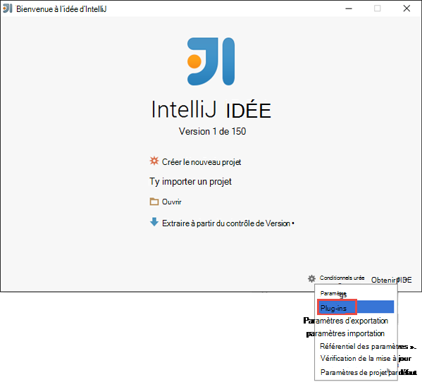
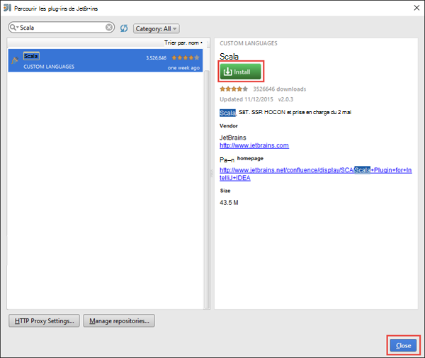
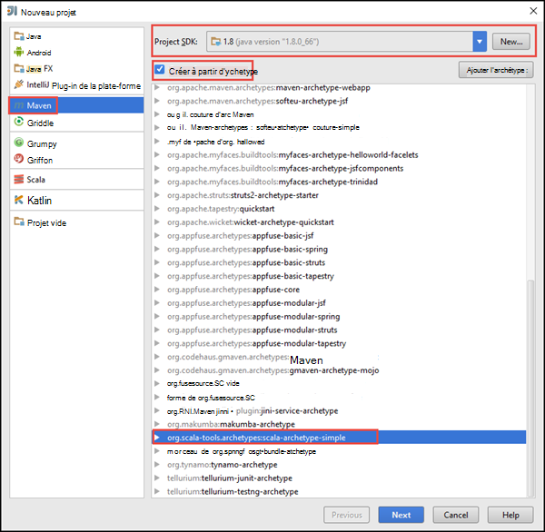
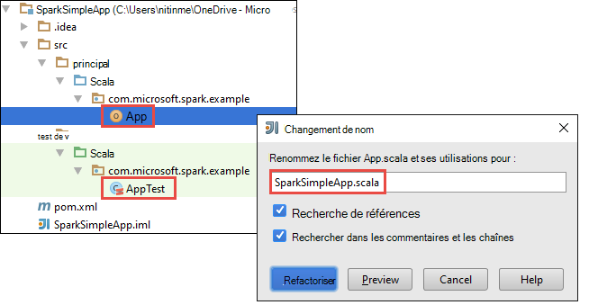
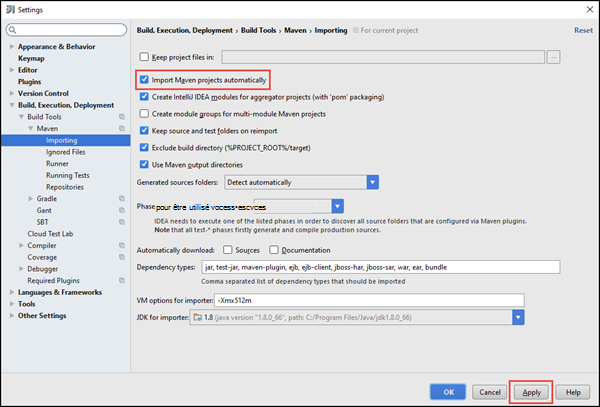
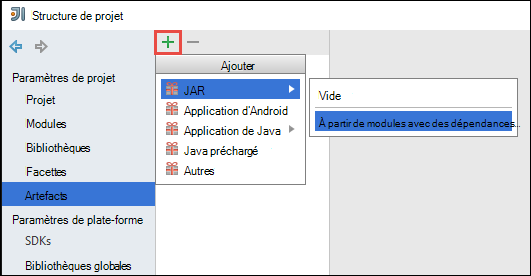
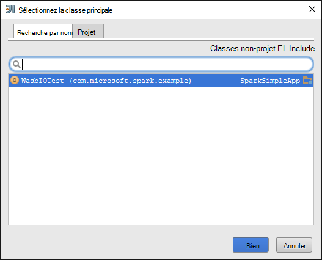
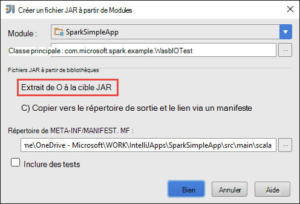
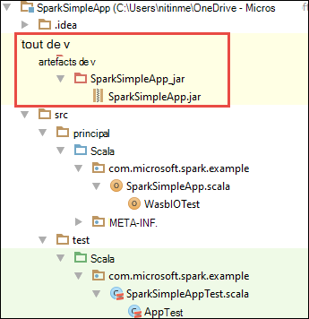

<properties
    pageTitle="Créer des applications de scala à exécuter sur les clusters HDInsight Spark autonome | Microsoft Azure"
    description="Apprenez à créer des application d’allumage pour s’exécuter sur des clusters de HDInsight Spark autonome."
    services="hdinsight"
    documentationCenter=""
    authors="nitinme"
    manager="jhubbard"
    editor="cgronlun"
    tags="azure-portal"/>

<tags
    ms.service="hdinsight"
    ms.workload="big-data"
    ms.tgt_pltfrm="na"
    ms.devlang="na"
    ms.topic="article"
    ms.date="10/28/2016"
    ms.author="nitinme"/>

# Créer une application Scala pour s’exécuter sur un cluster d’allumage d’Apache sur HDInsight Linux d’autonome

Cet article fournit des instructions étape par étape le développement d’applications d’allumage autonome écrites en Scala utilisant Maven avec l’idée d’IntelliJ. L’article utilise Apache Maven comme le système de génération et commence par un archétype Maven existant pour Scala fourni par l’idée de IntelliJ.  À un niveau élevé, création d’un Scala application dans l’idée d’IntelliJ implique les étapes suivantes :

* Utilisez Maven comme le système de génération.
* Mise à jour du fichier de modèle d’objet projet (POM) pour résoudre les dépendances de module d’allumage.
* Écrire votre application dans Scala.
* Générer un fichier jar qui peut être soumis à des clusters d’HDInsight Spark.
* Exécutez l’application sur un cluster d’allumage à l’aide de Livy.

>[AZURE.NOTE] HDInsight fournit également un outil de plug-in IntelliJ idée pour faciliter le processus de création et de présentation des demandes à un cluster HDInsight Spark sous Linux. Pour plus d’informations, reportez-vous à la section [Utilisation HDInsight outils plug-in pour idée IntelliJ créer et soumettre des applications d’allumage](hdinsight-apache-spark-intellij-tool-plugin.md).

**Conditions préalables**

* Un abonnement Azure. Consultez [Azure d’obtenir la version d’évaluation gratuite](https://azure.microsoft.com/documentation/videos/get-azure-free-trial-for-testing-hadoop-in-hdinsight/).
* Un cluster d’allumage d’Apache sur HDInsight Linux. Pour obtenir des instructions, consultez [créer un allumage Apache des clusters dans Azure HDInsight](hdinsight-apache-spark-jupyter-spark-sql.md).
* Kit de développement de Java d’Oracle. Vous pouvez l’installer à partir [d’ici](http://www.oracle.com/technetwork/java/javase/downloads/jdk8-downloads-2133151.html).
* Un Java IDE. Cet article utilise l’idée IntelliJ 15.0.1. Vous pouvez l’installer à partir [d’ici](https://www.jetbrains.com/idea/download/).

## Installer le plug-in de Scala pour IntelliJ idée

Si installation de l’idée d’IntelliJ ne sont pas pas invite d’activation du plug-in de Scala, lancer l’idée d’IntelliJ et suivez les étapes suivantes pour installer le plug-in :

1. Démarrer l’idée de IntelliJ à partir de l’écran de bienvenue, cliquez sur **configurer** et puis cliquez sur **plug-ins**.

    

2. Dans l’écran suivant, cliquez sur **le plug-in de JetBrains d’installer** à partir de l’angle inférieur gauche. Dans la boîte de dialogue **Parcourir les plug-ins de JetBrains** qui s’ouvre, recherchez Scala et puis cliquez sur **installer**.

    

3. Une fois que le plug-in a été installé avec succès, cliquez sur le **bouton de l’idée de IntelliJ redémarrer** pour redémarrer l’environnement IDE.

## Créez un projet de Scala autonome

1. Lancer l’idée d’IntelliJ et créez un nouveau projet. Dans la boîte de dialogue Nouveau projet, faites les sélections suivantes, puis cliquez sur **suivant**.

    

    * Sélectionnez **Maven** comme type de projet.
    * Spécifiez un **projet SDK**. Cliquez sur Nouveau et accédez au répertoire d’installation Java, généralement `C:\Program Files\Java\jdk1.8.0_66`.
    * Sélectionnez l’option **à partir d’un archétype** .
    * Dans la liste des archetypes, sélectionnez **org.scala-tools.archetypes:scala-archétype-simple**. Vous créez la structure de répertoire correct et télécharger les dépendances par défaut requis pour écrire le programme de Scala.

2. Fournir des valeurs pertinentes pour **GroupId**, **ArtifactId**et **Version**. Cliquez sur **suivant**.

3. Dans la boîte de dialogue suivante, dans laquelle vous spécifiez le répertoire d’accueil Maven et d’autres paramètres de l’utilisateur, acceptez les valeurs par défaut et cliquez sur **suivant**.

4. Dans la dernière boîte de dialogue, spécifiez un emplacement et un nom de projet et puis cliquez sur **Terminer**.

5. Supprimez le fichier **MySpec.Scala** en **src\test\scala\com\microsoft\spark\example**. Vous n’avez pas besoin cette pour l’application.

6. Si nécessaire, renommez les fichiers de test et de la source par défaut. Dans le volet de gauche dans l’idée de IntelliJ, accédez à **src\main\scala\com.microsoft.spark.example**. Droit **App.scala**et cliquez sur **Refactoriser**, cliquez sur Renommer le fichier et fournir un nouveau nom pour l’application dans la boîte de dialogue, puis cliquez sur **Refactoriser**.

      

7. Dans les étapes suivantes, vous mettrez à jour la pom.xml pour définir les dépendances de l’application Scala d’allumage. Ces dépendances à être téléchargé et résolus automatiquement, vous devez configurer Maven en conséquence.

    

    1. Dans le menu **fichier** , cliquez sur **paramètres**.
    2. Dans la boîte **de** dialogue, accédez à **l’exécution de la Build, déploiement** > **Outils de génération** > **Maven** > **importation**.
    3. Sélectionnez l’option **d’importation Maven projets automatiquement**.
    4. Cliquez sur **Appliquer**, puis cliquez sur **OK**.

8. Mettre à jour le fichier source Scala pour inclure le code de votre application. Ouvrir et remplacez le code existant par le code suivant et enregistrez les modifications. Ce code lit les données à partir de la HVAC.csv (disponible sur tous les clusters HDInsight Spark), extrait les lignes qui ont seulement un chiffre dans la sixième colonne et écrit la sortie dans **/HVACOut** sous le conteneur de stockage par défaut pour le cluster.

        package com.microsoft.spark.example

        import org.apache.spark.SparkConf
        import org.apache.spark.SparkContext

        /**
          * Test IO to wasb
          */
        object WasbIOTest {
          def main (arg: Array[String]): Unit = {
            val conf = new SparkConf().setAppName("WASBIOTest")
            val sc = new SparkContext(conf)

            val rdd = sc.textFile("wasbs:///HdiSamples/HdiSamples/SensorSampleData/hvac/HVAC.csv")

            //find the rows which have only one digit in the 7th column in the CSV
            val rdd1 = rdd.filter(s => s.split(",")(6).length() == 1)

            rdd1.saveAsTextFile("wasbs:///HVACout")
          }
        }

9. Mettre à jour le pom.xml.

    1.  Dans `<project>\<properties>` ajoutez ce qui suit :

            <scala.version>2.10.4</scala.version>
            <scala.compat.version>2.10.4</scala.compat.version>
            <scala.binary.version>2.10</scala.binary.version>

    2. Dans `<project>\<dependencies>` ajoutez ce qui suit :

            <dependency>
              <groupId>org.apache.spark</groupId>
              <artifactId>spark-core_${scala.binary.version}</artifactId>
              <version>1.4.1</version>
            </dependency>

    Enregistrer les modifications apportées à pom.xml.

10. Créez le fichier .jar. IDÉE de IntelliJ permet de créer de fichier JAR sous la forme d’un artefact d’un projet. Effectuez les opérations suivantes.

    1. Dans le menu **fichier** , cliquez sur **Structure du projet**.
    2. Dans la boîte de dialogue **Structure du projet** , cliquez sur les **artefacts** et puis cliquez sur le signe plus. À partir de la boîte de dialogue qui s’affiche, cliquez sur **JAR**, puis cliquez sur **à partir des modules avec des dépendances**.

        

    3. Dans la boîte de dialogue **Créer un JAR à partir de Modules** , cliquez sur le bouton de sélection ( ) par rapport à la **Classe de principal**.

    4. Dans la boîte de dialogue **Sélectionner une classe de principal** , sélectionnez la catégorie qui apparaît par défaut et puis cliquez sur **OK**.

        

    5. Dans la boîte de dialogue **Créer un JAR à partir de Modules** , assurez-vous que l’option **d’extraction pour la fichier JAR de la cible** est sélectionnée, puis cliquez sur **OK**. Cette opération crée un fichier JAR unique avec toutes les dépendances.

        

    6. L’onglet mise en page de sortie répertorie tous les fichiers JAR qui sont inclus dans le cadre du projet Maven. Vous pouvez sélectionner et supprimer celles sur lesquelles l’application Scala ne possède pas de dépendance directe. Pour l’application que nous créons ici, vous pouvez supprimer tout sauf le dernier un (**SparkSimpleApp compiler la sortie**). Sélectionnez les fichiers JAR à supprimer, puis cliquez sur l’icône **Supprimer** .

        

        Assurez-vous que la boîte de **Build sur la marque** est sélectionné, ce qui garantit que le fichier jar est créé chaque fois que le projet est généré ou mis à jour. Cliquez sur **Appliquer** , puis sur **OK**.

    7. À partir de la barre de menus, cliquez sur **Générer**, puis cliquez sur **Créer le projet**. Vous pouvez également cliquer sur **Générer les artefacts** pour créer le fichier jar. Le fichier jar de sortie est créé sous **\out\artifacts**.

        

## Exécutez l’application sur le cluster d’allumage

Pour exécuter l’application sur le cluster, vous devez effectuer les opérations suivantes :

* **Copiez le fichier jar d’application à l’objet blob de stockage Azure** associé au cluster. Vous pouvez utiliser [**AzCopy**](../storage/storage-use-azcopy.md), un utilitaire de ligne de commande, au pour faire. Il existe de nombreux autres clients ainsi que vous pouvez utiliser pour transférer des données. Pour en savoir plus à leur sujet à [télécharger des données pour les travaux d’Hadoop dans HDInsight](hdinsight-upload-data.md).

* **Livy utiliser pour soumettre un travail de l’application à distance** sur le cluster d’allumage. Allumage des clusters sur HDInsight inclut Livy qui expose des points de terminaison REST pour envoyer des travaux d’allumage à distance. Pour plus d’informations, voir [les travaux de soumettre l’allumage à distance à l’aide de Livy avec les clusters d’allumage sur HDInsight](hdinsight-apache-spark-livy-rest-interface.md).

## Voir aussi

* [Vue d’ensemble : Allumage commandé de Apache sur Azure HDInsight](hdinsight-apache-spark-overview.md)

### Scénarios

* [Allumage avec BI : effectuer l’analyse interactive des données à l’aide d’étincelle dans HDInsight avec les outils d’analyse Décisionnelle](hdinsight-apache-spark-use-bi-tools.md)

* [Allumage avec apprentissage automatique : allumage d’utilisation dans les HDInsight d’analyse de température de construction à l’aide des données HVAC](hdinsight-apache-spark-ipython-notebook-machine-learning.md)

* [Allumage avec apprentissage automatique : allumage utilisation de HDInsight pour prédire les résultats de l’inspection alimentaires](hdinsight-apache-spark-machine-learning-mllib-ipython.md)

* [Diffusion en continu de l’allumage : Allumage d’utilisation dans HDInsight pour générer des applications de diffusion en continu en temps réel](hdinsight-apache-spark-eventhub-streaming.md)

* [Analyse de journal de site Web à l’aide d’étincelle dans HDInsight](hdinsight-apache-spark-custom-library-website-log-analysis.md)

### Créer et exécuter des applications

* [Exécuter des tâches à distance sur un cluster d’allumage à l’aide de Livy](hdinsight-apache-spark-livy-rest-interface.md)

### Outils et extensions

* [Plug-in d’outils HDInsight idée de IntelliJ permet de créer et soumettre des applications d’allumage Scala](hdinsight-apache-spark-intellij-tool-plugin.md)

* [Plug-in d’outils HDInsight IntelliJ idée permet de déboguer des applications d’allumage commandé à distance](hdinsight-apache-spark-intellij-tool-plugin-debug-jobs-remotely.md)

* [Utilisez les portables Zeppelin avec un cluster d’allumage sur HDInsight](hdinsight-apache-spark-use-zeppelin-notebook.md)

* [Noyaux disponibles pour le cluster d’allumage pour HDInsight ordinateur portable Jupyter](hdinsight-apache-spark-jupyter-notebook-kernels.md)

* [Utilisez les lots externes avec les ordinateurs portables de Jupyter](hdinsight-apache-spark-jupyter-notebook-use-external-packages.md)

* [Installez Jupyter sur votre ordinateur et vous connecter à un cluster HDInsight Spark](hdinsight-apache-spark-jupyter-notebook-install-locally.md)

### Gestion des ressources

* [Gérer les ressources du cluster Apache étincelle dans Azure HDInsight](hdinsight-apache-spark-resource-manager.md)

* [Tâches de suivi et de débogage en cours d’exécution sur un cluster Apache étincelle dans HDInsight](hdinsight-apache-spark-job-debugging.md)
