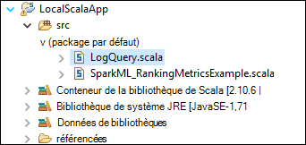

 <properties
    pageTitle="Créer des applications d’allumage Scala à l’aide des outils de HDInsight dans Azure Shared Computer Toolkit pour Eclipse | Microsoft Azure"
    description="Apprenez à créer des application d’allumage pour s’exécuter sur des clusters de HDInsight Spark autonome."
    services="hdinsight"
    documentationCenter=""
    authors="nitinme"
    manager="jhubbard"
    editor="cgronlun"
    tags="azure-portal"/>

<tags
    ms.service="hdinsight"
    ms.workload="big-data"
    ms.tgt_pltfrm="na"
    ms.devlang="na"
    ms.topic="article"
    ms.date="08/30/2016"
    ms.author="nitinme"/>

# Utiliser les outils de HDInsight dans Shared Computer Toolkit Azure pour Eclipse pour créer des applications de cluster Linux d’allumage HDInsight d’allumage

Cet article fournit des instructions pas à pas le développement d’applications d’allumage écrites en Scala et en envoyant à un HDInsight Spark de cluster à l’aide des outils de HDInsight dans Azure Shared Computer Toolkit pour Eclipse. Vous pouvez utiliser les outils de différentes manières :

* De développer et de présenter une demande de Scala Spark sur un cluster HDInsight Spark
* Pour accéder aux ressources de votre cluster Azure HDInsight allumage
* Pour développer et exécuter une application Scala Spark localement

>[AZURE.IMPORTANT] Cet outil peut être utilisé pour créer et soumettre des candidatures uniquement pour un cluster HDInsight Spark sous Linux.

##Conditions préalables

* Un abonnement Azure. Consultez [Azure d’obtenir la version d’évaluation gratuite](https://azure.microsoft.com/documentation/videos/get-azure-free-trial-for-testing-hadoop-in-hdinsight/).

* Un cluster d’allumage d’Apache sur HDInsight Linux. Pour obtenir des instructions, consultez [créer un allumage Apache des clusters dans Azure HDInsight](hdinsight-apache-spark-jupyter-spark-sql.md).

* Kit de développement Java d’Oracle version 7 et 8. 
    * **7 du Kit de développement logiciel Java** utilisé pour la compilation des projets d’allumage comme Java version 7 prend en charge les clusters HDInsight. Vous pouvez télécharger Java SDK 7 à partir [d’ici](http://www.oracle.com/technetwork/java/javase/downloads/jdk7-downloads-1880260.html).
    * **8 du Kit de développement Java** est utilisé pour le runtime d’Eclipse IDE. Vous pouvez le télécharger à partir [d’ici](http://www.oracle.com/technetwork/java/javase/downloads/jdk8-downloads-2133151.html).

* Eclipse IDE. Cet article utilise Eclipse néon. Vous pouvez l’installer à partir [d’ici](https://www.eclipse.org/downloads/).

* Scala l’IDE pour Eclipse. 
    * **Si vous avez Eclipse IDE sont installées**, vous pouvez ajouter le plug-in Scala IDE en accédant à **l’aide de** -> **d’Installer un nouveau logiciel**et ajoutez [http://download.scala-ide.org/sdk/lithium/e44/scala211/stable/site](http://download.scala-ide.org/sdk/lithium/e44/scala211/stable/site) comme source pour télécharger Scala Plugin pour Eclipse. 
    * **Si vous ne disposez pas de l’IDE Eclipse installé**, vous pouvez installer Scala IDE directement à partir [d’ici](http://scala-ide.org/download/sdk.html). Vous pouvez télécharger le fichier .zip à partir de ce lien, vous devez l’extraire, naviguez jusqu’au dossier **/eclipse** et puis exécutez le fichier de **eclipse.exe** à partir de là.
    
    >[AZURE.NOTE] Les étapes décrites dans ce document sont basés sur l’utilisation d’Eclipse IDE avec le plug-in Scala installé.

* Kit de développement logiciel d’allumage. Vous pouvez le télécharger à partir [d’ici](http://go.microsoft.com/fwlink/?LinkID=723585&clcid=0x409).

* Installez des clipse de e (fx) à partir de [https://www.eclipse.org/efxclipse/install.html](https://www.eclipse.org/efxclipse/install.html).

## Installer les outils de HDInsight dans Azure Shared Computer Toolkit pour Éclipse

HDInsight des outils Eclipse est disponible dans le cadre de la Shared Computer Toolkit Azure pour Eclipse. Pour obtenir des instructions sur l’installation de la Shared Computer Toolkit d’Azure, consultez [installer le Shared Computer Toolkit Azure pour Eclipse](../azure-toolkit-for-eclipse-installation.md).

## Connectez-vous à votre abonnement Azure

1. Lancement de l’IDE Eclipse et ouvrir l’Explorateur d’Azure. Dans le menu **fenêtre** dans l’environnement IDE, cliquez sur **Affichage** , puis sur **autres**. À partir de la boîte de dialogue qui s’ouvre, développez **Azure**, cliquez sur **Explorateur d’Azure**et puis cliquez sur **OK**.

    

2. Cliquez sur le nœud **d’Azure** dans l' **Explorateur d’Azure**, puis cliquez sur **Gérer les abonnements**.

3. Dans la boîte de dialogue **Gérer les abonnements** , cliquez sur **se connecter** et entrez vos informations d’identification Azure.

    

4. Après que vous être connecté, la boîte de dialogue **Gérer les abonnements** répertorie tous les abonnements Azure associés avec les informations d’identification. Cliquez sur **Fermer** dans la boîte de dialogue.

5. Dans l’onglet Explorateur d’Azure, développez **HDInsight** pour voir les clusters HDInsight Spark sous votre abonnement.

    

6. Vous pouvez développer davantage un nœud du nom de cluster pour afficher les ressources (par exemple, les comptes de stockage) associés au cluster.

    

## Définition d’un projet Scala d’allumage pour un cluster HDInsight Spark

1. À partir de l’espace de travail Eclipse IDE, cliquez sur **fichier**, cliquez sur **Nouveau**, puis cliquez sur **projet**. 

2. Dans l’Assistant **Nouveau projet** , développez **HDInsight**et sélectionnez **explosion sur HDInsight (Scala)**puis cliquez sur **suivant**.

    

3. Dans la boîte de dialogue **Nouveau projet de Scala HDInsight** , entrer ou sélectionner les valeurs comme indiqué dans l’image ci-dessous, puis cliquez sur **suivant**.

    

    * Entrez un nom pour le projet.
    * Dans la zone **JRE** , assurez-vous de **Qu'utiliser un environnement d’exécution JRE** est définie sur **JavaSE-1.7**.
    * Assurez-vous que le SDK d’allumage est définie sur l’emplacement où vous avez téléchargé le Kit de développement. Le lien vers l’emplacement de téléchargement est inclus dans les [composants requis](#prerequisites) plus haut dans cette rubrique. Vous pouvez également télécharger le SDK à partir du lien inclus dans cette boîte de dialogue, comme illustré dans l’image ci-dessus.    

4. Dans la boîte de dialogue suivante, cliquez sur l’onglet **bibliothèques** et puis double-cliquez sur **La bibliothèque système [JavaSE-1,7] du JRE**.

    

5. Dans la boîte de dialogue **Modifier la bibliothèque** , assurez-vous de **Qu'environnement d’exécution** est définie sur **JavaSE-1.7(jdk1.7.0_79)**. Si ce n’est pas une option disponible, suivez les étapes ci-dessous.

    1. Sélectionnez l’option **Autre JRE** et si **JavaSE-1.7(jdk1.7.0_79)** est disponible.
    2. Si ce n’est pas le cas, cliquez sur le bouton **Installer le JRE** .

          

    3. Dans la boîte de dialogue **Installation de JRE** , cliquez sur **Ajouter**.

            

    4. Dans la boîte de dialogue **Type de JRE** , sélectionnez **l’Ordinateur virtuel Standard**, puis cliquez sur **suivant**

            

    5. Dans la boîte de dialogue **Définition du JRE** , cliquez sur répertoire, puis accédez à l’emplacement d’installation de JDK 7 et sélectionnez le dossier racine de **jdk1.7.0_79**.

            

    6. Cliquez sur **Terminer**. Dans la boîte de dialogue **Installation de JRE** , sélectionnez JRE nouvellement ajouté, puis cliquez sur **OK**.

           

    7. Le JRE nouvellement ajouté doit être répertorié pour **l’Environnement d’exécution**. Cliquez sur **Terminer**.

           

6. Sur l’onglet **bibliothèques** , double-cliquez sur **Le conteneur de bibliothèques Scala [2.11.8]**. Dans la boîte de dialogue **Modifier la bibliothèque** , sélectionnez **bibliothèque de Scala fixe conteneur : 2.10.6**. 

    

    Cliquez sur **Terminer** pour quitter la boîte de dialogue Paramètres du projet.

## Créer une application de Scala pour le cluster de HDInsight Spark

1. Dans l’environnement IDE Eclipse déjà ouvert, à partir de l' **Explorateur de Package**, développez le projet que vous avez créé précédemment, cliquez sur **src**, pointez sur **Nouveau**, puis cliquez sur **autres**.

2. Dans la boîte de dialogue **Sélectionner un Assistant** , développez **Assistants de Scala**, cliquez sur **L’objet Scala**et puis cliquez sur **suivant**.

    

3. Dans la boîte de dialogue **Créer un nouveau fichier** , entrez un nom pour l’objet, puis cliquez sur **Terminer**.

    

4. Collez le code suivant dans l’éditeur de texte.

        import org.apache.spark.SparkConf
        import org.apache.spark.SparkContext
    
        object MyClusterApp{
          def main (arg: Array[String]): Unit = {
            val conf = new SparkConf().setAppName("MyClusterApp")
            val sc = new SparkContext(conf)
        
            val rdd = sc.textFile("wasbs:///HdiSamples/HdiSamples/SensorSampleData/hvac/HVAC.csv")
        
            //find the rows which have only one digit in the 7th column in the CSV
            val rdd1 =  rdd.filter(s => s.split(",")(6).length() == 1)
        
            rdd1.saveAsTextFile("wasbs:///HVACOut")
          }     
        }

5. Exécutez l’application sur un cluster HDInsight Spark.

    1. À partir de l' **Explorateur de Package**, cliquez sur le nom du projet et sélectionnez **Application d’allumage soumettre à HDInsight**.      

    2. Dans la boîte de dialogue **Envoi d’allumage** , fournir les valeurs suivantes.

        * **Nom de Cluster**, sélectionnez le cluster HDInsight Spark sur lequel vous souhaitez exécuter votre application.

        * Vous devez sélectionner un artefact à partir du projet Eclipse, ou sélectionnez-en un à partir du disque dur.

        * Par rapport à la zone de texte **nom de la classe principale** , entrez le nom de l’objet spécifié dans le code (voir image ci-dessous).

            

        * Étant donné que dans cet exemple, le code d’application ne nécessitent des arguments de ligne de commande ni les fichiers ou les fichiers JAR de référence, vous pouvez laisser les autres zones de texte vides.

        * Cliquez sur **Envoyer**.

    3. L’onglet **Envoi d’allumage** doit commencer à afficher la progression. Vous pouvez arrêter l’application en cliquant sur le bouton rouge dans la fenêtre « Soumission d’allumage ». Vous pouvez également afficher les journaux de cette application spécifique exécutée en cliquant sur l’icône du globe (indiqué par la zone bleue de l’image).

        

    Dans la section suivante, vous allez apprendre à accéder à la tâche à l’aide des outils HDInsight Azure Shared Computer Toolkit pour Eclipse de sortie.

## Accéder et gérer des clusters HDInsight Spark l’aide des outils HDInsight Azure Shared Computer Toolkit pour Éclipse

Vous pouvez effectuer diverses opérations à l’aide des outils HDInsight.

### Accéder au conteneur de stockage pour le cluster

1. À partir de l’Explorateur d’Azure, développez le nœud de racine **HDInsight** pour afficher une liste des clusters HDInsight Spark disponibles.

3. Développez le nom du cluster du compte de stockage et le conteneur de stockage par défaut pour le cluster.

    

4. Cliquez sur le nom du conteneur de stockage associé au cluster. Dans le volet de droite, vous devez voir un dossier appelé **HVACOut**. Double-cliquez pour ouvrir le dossier et vous verrez **partie -*** fichiers. Ouvrez un de ces fichiers pour voir la sortie de l’application.

### Accéder au serveur de l’historique d’allumage

1. À partir de l' **Explorateur d’Azure**, cliquez sur le nom de votre cluster d’allumage et sélectionnez **Ouvrir l’interface utilisateur de l’historique allumage**. Lorsque vous y êtes invité, entrez les informations d’identification d’administration pour le cluster. Vous devez spécifier ces lors de la configuration du cluster.

2. Dans le tableau de bord étincelle historique serveur, vous pouvez rechercher l’application vous juste après l’exécution d’en utilisant le nom de l’application. Dans le code ci-dessus, vous définissez le nom d’application à l’aide `val conf = new SparkConf().setAppName("MyClusterApp")`. Par conséquent, le nom de votre application d’allumage a été **MyClusterApp**.

### Lancement du portail de Ambari

À partir de l' **Explorateur d’Azure**, cliquez sur le nom de votre cluster d’allumage et sélectionnez **Ouvrir portail de gestion de Cluster (Ambari)**. Lorsque vous y êtes invité, entrez les informations d’identification d’administration pour le cluster. Vous devez spécifier ces lors de la configuration du cluster.

### Gérer les abonnements Azure

Par défaut, les outils de HDInsight de Shared Computer Toolkit Azure pour Eclipse répertorie les clusters de l’allumage de tous vos abonnements Azure. Si nécessaire, vous pouvez spécifier les abonnements pour lesquels vous souhaitez accéder au cluster. À partir de l' **Explorateur d’Azure**, cliquez sur le nœud de racine **d’Azure** et puis cliquez sur **Gérer les abonnements**. À partir de la boîte de dialogue, désactivez les cases à cocher par rapport à l’abonnement que vous ne souhaitez pas accéder, puis sur **Fermer**. Vous pouvez également cliquer sur **Fermer la session** si vous souhaitez vous déconnecter votre abonnement Azure.

## Exécuter une application d’allumage Scala localement

Vous pouvez utiliser les outils de HDInsight dans Shared Computer Toolkit Azure pour Eclipse pour exécuter des applications de la Scala d’allumage localement sur votre poste de travail. En général, ces applications ne pas doivent accéder à des ressources de cluster comme conteneur de stockage et peuvent être exécutées et testées localement.

### Condition préalable

Lors de l’exécution de l’application d’allumage Scala locale sur un ordinateur Windows, vous pouvez recevoir une exception, comme expliqué dans l' [allumage-2356](https://issues.apache.org/jira/browse/SPARK-2356) qui se produit en raison d’un manque **WinUtils.exe** sur le système d’exploitation Windows. Pour contourner cette erreur, vous devez [Télécharger le fichier exécutable à partir d’ici](http://public-repo-1.hortonworks.com/hdp-win-alpha/winutils.exe) dans un emplacement comme **C:\WinUtils\bin**. Vous devez ensuite ajouter une variable d’environnement **HADOOP_HOME** et la valeur de la variable **C\WinUtils**la valeur.

### Exécuter une application d’allumage Scala locale  

1. Lancer Eclipse et créez un nouveau projet. Dans la boîte de dialogue Nouveau projet, faites les sélections suivantes, puis cliquez sur **suivant**.

    

    * Dans le volet gauche, sélectionnez **HDInsight**.
    * Dans le volet de droite, sélectionnez **étincelle sur échantillon exécuter HDInsight Local (Scala)**.
    * Cliquez sur **suivant**.

2. Pour fournir les détails du projet, suivez les étapes 3 à 6, comme indiqué précédemment dans la section [configurer un projet d’application Scala d’allumage pour un cluster d’allumage de HDInsight](#set-up-a-spark-scala-application-project-for-an-hdinsight-spark cluster).

3. Le modèle ajoute un exemple de code (**LogQuery**) dans le dossier **src** que vous pouvez exécuter localement sur votre ordinateur.

    

4.  Cliquez avec le bouton droit sur l’application **LogQuery** , pointez sur **Exécuter en tant que**, puis cliquez sur **1 Scala Application**. Vous verrez une sortie, comme suit, dans l’onglet **Console** en bas.

    

## Problèmes de commentaires & connus

Affichée étincelle génère directement n’est ne pas pris en charge et nous travaillons sur ce.

Si vous avez des suggestions ou des commentaires, ou si vous rencontrez des problèmes lors de l’utilisation de cet outil, n’hésitez pas à envoyez-nous un e-mail à hdivstool à microsoft point com.

## Voir aussi

* [Vue d’ensemble : Allumage commandé de Apache sur Azure HDInsight](hdinsight-apache-spark-overview.md)

### Scénarios

* [Allumage avec BI : effectuer l’analyse interactive des données à l’aide d’étincelle dans HDInsight avec les outils d’analyse Décisionnelle](hdinsight-apache-spark-use-bi-tools.md)

* [Allumage avec apprentissage automatique : allumage d’utilisation dans les HDInsight d’analyse de température de construction à l’aide des données HVAC](hdinsight-apache-spark-ipython-notebook-machine-learning.md)

* [Allumage avec apprentissage automatique : allumage utilisation de HDInsight pour prédire les résultats de l’inspection alimentaires](hdinsight-apache-spark-machine-learning-mllib-ipython.md)

* [Diffusion en continu de l’allumage : Allumage d’utilisation dans HDInsight pour générer des applications de diffusion en continu en temps réel](hdinsight-apache-spark-eventhub-streaming.md)

* [Analyse de journal de site Web à l’aide d’étincelle dans HDInsight](hdinsight-apache-spark-custom-library-website-log-analysis.md)

### Créer et exécuter des applications

* [Créez une application autonome à l’aide de Scala](hdinsight-apache-spark-create-standalone-application.md)

* [Exécuter des tâches à distance sur un cluster d’allumage à l’aide de Livy](hdinsight-apache-spark-livy-rest-interface.md)

### Outils et extensions

* [Utilisez les outils de HDInsight Shared Computer Toolkit Azure pour IntelliJ pour créer et soumettre des applications d’allumage Scala](hdinsight-apache-spark-intellij-tool-plugin.md)

* [Utilisez les outils de HDInsight dans Shared Computer Toolkit Azure pour IntelliJ à déboguer à distance les applications d’allumage](hdinsight-apache-spark-intellij-tool-plugin-debug-jobs-remotely.md)

* [Utilisez les portables Zeppelin avec un cluster d’allumage sur HDInsight](hdinsight-apache-spark-use-zeppelin-notebook.md)

* [Noyaux disponibles pour le cluster d’allumage pour HDInsight ordinateur portable Jupyter](hdinsight-apache-spark-jupyter-notebook-kernels.md)

* [Utilisez les lots externes avec les ordinateurs portables de Jupyter](hdinsight-apache-spark-jupyter-notebook-use-external-packages.md)

* [Installez Jupyter sur votre ordinateur et vous connecter à un cluster HDInsight Spark](hdinsight-apache-spark-jupyter-notebook-install-locally.md)

### Gestion des ressources

* [Gérer les ressources du cluster Apache étincelle dans Azure HDInsight](hdinsight-apache-spark-resource-manager.md)

* [Tâches de suivi et de débogage en cours d’exécution sur un cluster Apache étincelle dans HDInsight](hdinsight-apache-spark-job-debugging.md)
