<properties 
    pageTitle="Utiliser des concentrateurs d’événement Azure avec allumage Apache dans HDInsight pour traiter les données de transmission en continu | Microsoft Azure" 
    description="Des instructions détaillées sur l’envoi des données de flux au concentrateur d’événements Azure et puis recevoir ces événements dans l’allumage à l’aide d’une application scala" 
    services="hdinsight" 
    documentationCenter="" 
    authors="nitinme" 
    manager="jhubbard" 
    editor="cgronlun"
    tags="azure-portal"/>

<tags 
    ms.service="hdinsight" 
    ms.workload="big-data" 
    ms.tgt_pltfrm="na" 
    ms.devlang="na" 
    ms.topic="article" 
    ms.date="09/30/2016" 
    ms.author="nitinme"/>

# Diffusion en continu de l’allumage : Traiter les événements de concentrateurs d’événement Azure avec Apache étincelle cluster sur HDInsight Linux

Diffusion en continu de l’allumage étend l’API d’allumage pour créer des applications de traitement de flux modulaire, haut débit et à tolérance de pannes de base. Données peuvent provenir de nombreuses sources. Dans cet article, nous utilisons des concentrateurs d’événement Azure pour recevoir des données. Concentrateurs d’événement est un système de réception hautement évolutive qui peuvent d’admission des millions d’événements par seconde. 

Dans ce didacticiel, vous allez apprendre à créer un concentrateur d’événements Azure, comment envoyer des messages à un concentrateur d’événements à l’aide d’une application de console dans Java et les récupérer en parallèle à l’aide d’une application d’allumage écrite dans Scala. Cette application utilise les données transmises par l’intermédiaire de concentrateurs de l’événement et l’achemine vers différentes sorties (Azure stockage Blob, table de ruche et table SQL).

> [AZURE.NOTE] Pour suivre les instructions fournies dans cet article, vous devez utiliser les deux versions du portail Azure. Pour créer un concentrateur d’événements, vous allez utiliser le [portail Azure classique](https://manage.windowsazure.com). Pour travailler avec le cluster HDInsight Spark, vous allez utiliser le [Portail Azure](https://portal.azure.com/).  

**Conditions préalables :**

Vous devez disposer des éléments suivants :

- Un abonnement Azure. Consultez [Azure d’obtenir la version d’évaluation gratuite](https://azure.microsoft.com/documentation/videos/get-azure-free-trial-for-testing-hadoop-in-hdinsight/).
- Un cluster d’allumage d’Apache. Pour obtenir des instructions, consultez [créer un allumage Apache des clusters dans Azure HDInsight](hdinsight-apache-spark-jupyter-spark-sql.md).
- Kit de développement de Java d’Oracle. Vous pouvez l’installer à partir [d’ici](http://www.oracle.com/technetwork/java/javase/downloads/jdk8-downloads-2133151.html).
- Un Java IDE. Cet article utilise l’idée IntelliJ 15.0.1. Vous pouvez l’installer à partir [d’ici](https://www.jetbrains.com/idea/download/).
- Pilote Microsoft JDBC pour SQL Server, version 4.1 ou ultérieure. Ceci est nécessaire pour écrire les données de l’événement dans une base de données SQL Server. Vous pouvez l’installer à partir [d’ici](https://msdn.microsoft.com/sqlserver/aa937724.aspx).
- Une base de données SQL d’Azure. Pour obtenir des instructions, voir [Création d’une base de données SQL en quelques minutes](../sql-database/sql-database-get-started.md).

## Que fait cette solution ?

Il s’agit de déroule de la solution de diffusion en continu :

1. Créer un concentrateur d’événements Azure qui va recevoir un flux d’événements.

2. Exécution d’une application autonome local qui génère des événements et exécute un push sur le concentrateur d’événements Azure. L’exemple d’application qui est publiée à [https://github.com/hdinsight/spark-streaming-data-persistence-examples](https://github.com/hdinsight/spark-streaming-data-persistence-examples).

2. Exécuter une application en continu à distance sur un cluster d’allumage qui lit les événements de diffusion en continu de concentrateur d’événements Azure et exécute un push des emplacements différents (Azure Blob, table de ruche et table de base de données SQL). 

## Créer événement Azure concentrateur

1. À partir du [Portail Azure](https://manage.windowsazure.com), sélectionnez **Nouveau** > **Service Bus** > **Concentrateur d’événements** > **Personnalisé créer**.

2. Dans l’écran **Ajouter un nouveau concentrateur de l’événement** , entrez un **Nom de concentrateur d’événements**, sélectionnez la **région** à créer le concentrateur et créer un nouvel espace de noms ou sélectionnez-en un. Cliquez sur la **flèche** pour continuer.

    ![page de l’Assistant 1] (./media/hdinsight-apache-spark-eventhub-streaming/hdispark.streaming.create.event.hub.png "Créer un concentrateur d’événements Azure")

    > [AZURE.NOTE] Vous devez sélectionner le même **emplacement** que votre cluster Apache étincelle dans HDInsight afin de réduire les coûts et les temps de latence.

3. Dans l’écran **Configurer un concentrateur événement** , entrez les valeurs de **compteur de Partition** et de **Rétention de Message** , puis cliquez sur la coche. Pour cet exemple, utilisez un compteur de partition de 10 et une rétention de message 1. Notez le nombre de partitions car vous devrez ultérieurement cette valeur.

    ![page de l’Assistant 2] (./media/hdinsight-apache-spark-eventhub-streaming/hdispark.streaming.create.event.hub2.png "Jours de rétention et de la taille de partition pour concentrateur d’événements spécifier")

4. Cliquez sur le concentrateur d’événements que vous avez créé et cliquez sur **configurer**, puis créer deux stratégies d’accès pour le concentrateur de l’événement.

    <table>
    <tr><th>Nom</th><th>Autorisations</th></tr>
    <tr><td>mysendpolicy</td><td>Envoyer</td></tr>
    <tr><td>myreceivepolicy</td><td>Écouter</td></tr>
    </table>

    Après avoir créé les autorisations, cliquez sur l’icône **Enregistrer** au bas de la page. Cette opération crée les stratégies d’accès partagé qui seront utilisés pour envoyer (**mysendpolicy**) et d’écouter ce concentrateur d’événements (**myreceivepolicy**).

    ![stratégies de] (./media/hdinsight-apache-spark-eventhub-streaming/hdispark.streaming.event.hub.policies.png "Créer un concentrateur événements politiques")

    
5. Sur la même page, notez les clés de stratégie générée pour les deux stratégies. Enregistrer ces clés, car ils seront utilisés ultérieurement.

    ![clés de stratégie] (./media/hdinsight-apache-spark-eventhub-streaming/hdispark.streaming.event.hub.policy.keys.png "Enregistrer les clés de stratégie")

6. Sur la page de **tableau de bord** , cliquez sur **Informations de connexion** à partir du bas pour récupérer et enregistrer les chaînes de connexion pour le concentrateur d’événements en utilisant les deux stratégies.

    ![clés de stratégie] (./media/hdinsight-apache-spark-eventhub-streaming/hdispark.streaming.event.hub.policy.connection.strings.png "Enregistrer les chaînes de connexion de stratégie")

## Une application de Scala permet d’envoyer des messages à concentrateur d’événements

Dans cette section une application de Scala autonome locale vous permet d’envoyer un flux d’événements au concentrateur d’événements Azure que vous avez créé à l’étape précédente. Cette application est disponible sur GitHub à [https://github.com/hdinsight/eventhubs-sample-event-producer](https://github.com/hdinsight/eventhubs-sample-event-producer). Cette procédure suppose que vous avez déjà dupliquée ce référentiel de GitHub.

1. Ouvrez l’application, **EventhubsSampleEventProducer**, dans IntelliJ idée.
    
2. Générez le projet. Dans le menu **Générer** , cliquez sur **Créer le projet**. Le fichier jar de sortie est créé sous **\out\artifacts**.

>[AZURE.TIP] Vous pouvez également utiliser une option disponible dans l’idée de IntelliJ de créer directement le projet à partir d’un référentiel de GitHub. Pour comprendre l’utilisation de cette approche, suivez les instructions dans la section suivante pour obtenir des instructions. Notez que de nombreuses étapes qui sont décrites dans la section suivante ne sera pas applicable pour l’application de Scala que vous créez à cette étape. Par exemple :

> * Vous ne devez pas mettre à jour le POM pour inclure la version d’allumage. C’est parce qu’aucune dépendance n’est à allumage commandé pour la création de cette application
> * Vous ne devez pas ajouter certains fichiers JAR de dépendance à la bibliothèque de projet. C’est parce que ces fichiers JAR n’est pas nécessaires pour ce projet.

## Mise à jour de l’application pour recevoir les événements de diffusion en continu de Scala

Un exemple d’application Scala pour recevoir l’événement et l’acheminer vers différentes destinations est disponible à l’adresse [https://github.com/hdinsight/spark-streaming-data-persistence-examples](https://github.com/hdinsight/spark-streaming-data-persistence-examples). Suivez les étapes ci-dessous pour mettre à jour l’application et de créer le fichier jar de sortie.

1. Lancer l’idée d’IntelliJ à partir de l’écran de lancement, sélectionnez **extraire du contrôle de Version** , puis cliquez sur **Git**.
        
    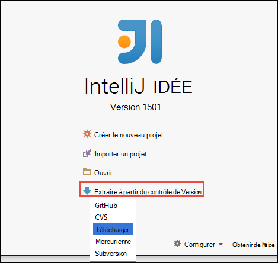

2. Dans la boîte de dialogue **Référentiel de Clone** , fournir l’URL du référentiel Git clone à partir du et spécifier le répertoire à cloner à puis cliquez sur **cloner**.

    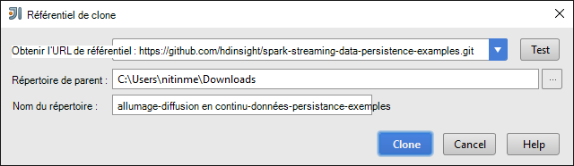

    
3. Suivez les instructions jusqu'à ce que le projet est entièrement cloné. Appuyez sur **Alt + 1** pour ouvrir la **Vue projet**. Il doit ressembler à la suivante.

    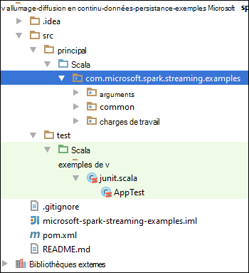
    
4. Assurez-vous que le code de l’application est compilé avec Java8. Pour ce faire, cliquez sur **fichier**, cliquez sur **Structure de projet**et sous l’onglet **projet** , assurez-vous que le niveau de langage projet est défini sur **8 - lambda, des annotations de type, etc.**.

    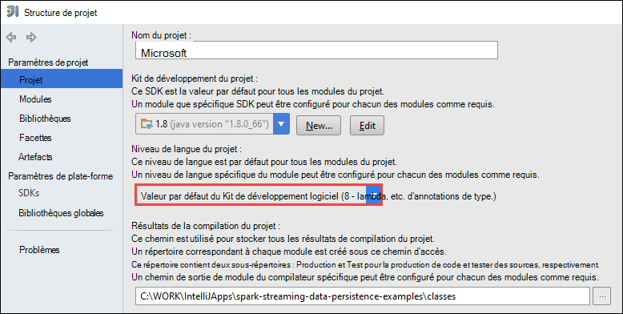

5. Ouvrez la **pom.xml** et assurez-vous que la version de moteur est correcte. Sous <properties> nœud, recherchez l’extrait suivant et vérifier la version d’allumage.

        <scala.version>2.10.4</scala.version>
        <scala.compat.version>2.10.4</scala.compat.version>
        <scala.binary.version>2.10</scala.binary.version>
        <spark.version>1.6.2</spark.version>
    
5. L’application requiert deux bocaux de dépendance :

    * **Jar du récepteur EventHub**. Ceci est nécessaire pour l’allumage recevoir les messages d’événement concentrateur. Pour utiliser ce fichier jar, mise à jour de la **pom.xml** pour ajouter la ligne suivante sous `<dependencies>`.

            <dependency>
              <groupId>com.microsoft.azure</groupId>
              <artifactId>spark-streaming-eventhubs_2.10</artifactId>
              <version>1.6.0</version>
            </dependency> 

    * **Jar du pilote JDBC**. Ceci est nécessaire pour écrire les messages reçus de concentrateur d’événements dans une base de données SQL d’Azure. Vous pouvez télécharger la version 4.1 ou ultérieure de ce fichier jar à partir [d’ici](https://msdn.microsoft.com/sqlserver/aa937724.aspx). Ajoutez la référence à ce fichier jar dans la bibliothèque de projet. Effectuez les opérations suivantes :

        1. À partir de la fenêtre IntelliJ idée où vous avez l’application ouverte, cliquez sur **fichier**, cliquez sur **Structure du projet**, puis cliquez sur **bibliothèques**. 
        
        2. Cliquez sur l’icône d’ajout () et cliquez sur **Java**, puis naviguez jusqu'à l’emplacement où vous avez téléchargé le jar du pilote JDBC. Suivez les instructions pour ajouter le fichier jar à la bibliothèque de projet.

            ![Ajouter des dépendances manquantes] (./media/hdinsight-apache-spark-eventhub-streaming/add-missing-dependency-jars.png "Bocaux de dépendance manquante ajouter")

        3. Cliquez sur **Appliquer**.

6. Créez le fichier jar de sortie. Effectuez les opérations suivantes.
    1. Dans la boîte de dialogue **Structure du projet** , cliquez sur les **artefacts** et puis cliquez sur le signe plus. À partir de la boîte de dialogue qui s’affiche, cliquez sur **JAR**, puis cliquez sur **à partir des modules avec des dépendances**.

        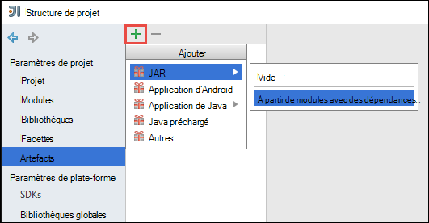

    1. Dans la boîte de dialogue **Créer un JAR à partir de Modules** , cliquez sur le bouton de sélection () par rapport à la **Classe de principal**.

    1. Dans la boîte de dialogue **Sélectionner une classe de principal** , sélectionnez une des classes disponibles et puis cliquez sur **OK**.

        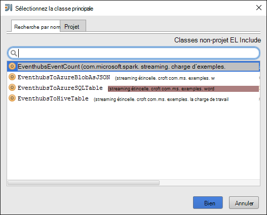

    1. Dans la boîte de dialogue **Créer un JAR à partir de Modules** , assurez-vous que l’option **d’extraction pour la fichier JAR de la cible** est sélectionnée, puis cliquez sur **OK**. Cette opération crée un fichier JAR unique avec toutes les dépendances.

        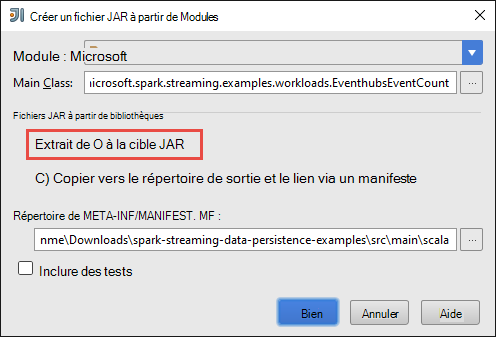

    1. L’onglet **Mise en page de sortie** répertorie tous les fichiers JAR qui sont inclus dans le cadre du projet Maven. Vous pouvez sélectionner et supprimer celles sur lesquelles l’application Scala ne possède pas de dépendance directe. Pour l’application que nous créons ici, vous pouvez supprimer tout sauf le dernier un (**microsoft-allumage-diffusion en continu-exemples de compiler la sortie**). Sélectionnez les fichiers JAR à supprimer, puis cliquez sur l’icône **Supprimer** ().

        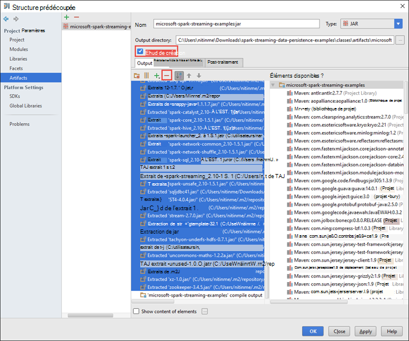

        Assurez-vous que la boîte de **Build sur la marque** est sélectionné, ce qui garantit que le fichier jar est créé chaque fois que le projet est généré ou mis à jour. Cliquez sur **Appliquer** , puis sur **OK**.

    1. Dans l’onglet **Disposition de la sortie** , au bas de la zone **Éléments disponibles** , vous avez le fichier jar SQL JDBC que vous avez ajouté précédemment à la bibliothèque de projet. Vous devez ajouter à l’onglet **Disposition de la sortie** . Cliquez sur le fichier jar, puis cliquez sur **Extraire dans la sortie de racine**.

        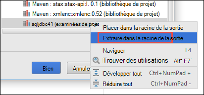  

        L’onglet **Mise en page de sortie** doit maintenant ressembler à ceci.

        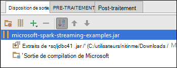     

        Dans la boîte de dialogue **Structure du projet** , cliquez sur **Appliquer** et puis cliquez sur **OK**. 

    1. À partir de la barre de menus, cliquez sur **Générer**, puis cliquez sur **Créer le projet**. Vous pouvez également cliquer sur **Générer les artefacts** pour créer le fichier jar. Le fichier jar de sortie est créé sous **\out\artifacts**.

        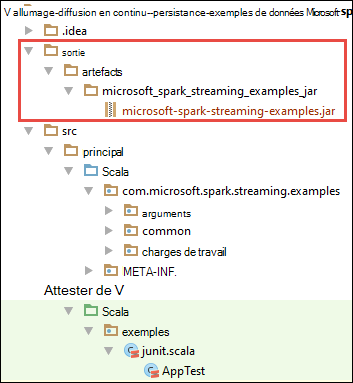

## Exécuter des applications à distance sur un cluster d’allumage à l’aide de Livy

Nous allons utiliser Livy pour exécuter à distance de l’application en continu sur un cluster d’allumage. Pour obtenir une présentation détaillée sur l’utilisation de Livy avec cluster de HDInsight Spark, reportez-vous à la section [soumettre des tâches à distance à un cluster d’allumage d’Apache sur Azure HDInsight](hdinsight-apache-spark-livy-rest-interface.md). Avant de commencer à exécuter les travaux à distance à des événements de flux de données à l’aide d’allumage il sont deux choses que vous devez faire :

1. Démarrez l’application autonome local pour générer des événements et envoyé au concentrateur d’événements. Pour ce faire, utilisez la commande suivante :

        java -cp EventhubsSampleEventProducer.jar com.microsoft.eventhubs.client.example.EventhubsClientDriver --eventhubs-namespace "mysbnamespace" --eventhubs-name "myeventhub" --policy-name "mysendpolicy" --policy-key "<policy key>" --message-length 32 --thread-count 32 --message-count -1

2. Copiez le fichier jar la transmission en continu (**microsoft-allumage-diffusion en continu-examples.jar**) vers le stockage Azure Blob associé au cluster. Le fichier jar est ainsi accessible à Livy. Vous pouvez utiliser [**AzCopy**](../storage/storage-use-azcopy.md), un utilitaire de ligne de commande, au pour faire. Il existe beaucoup d’autres clients, que vous pouvez utiliser pour transférer des données. Pour en savoir plus à leur sujet à [télécharger des données pour les travaux d’Hadoop dans HDInsight](hdinsight-upload-data.md).

3. Installer CURL sur l’ordinateur où vous exécutez ces applications. CURL nous permet d’appeler les points de terminaison Livy pour exécuter les traitements à distance.

### Exécuter les applications reçoivent les événements dans un Blob de stockage Azure sous forme de texte

Ouvrez une invite de commandes, naviguez jusqu’au répertoire où vous avez installé OURLÉE et exécutez la commande suivante (remplacer le nom d’utilisateur/mot de passe et cluster) :

    curl -k --user "admin:mypassword1!" -v -H "Content-Type: application/json" -X POST --data @C:\Temp\inputBlob.txt "https://mysparkcluster.azurehdinsight.net/livy/batches"

Les paramètres dans fichier **inputBlob.txt** sont définis comme suit :

    { "file":"wasbs:///example/jars/microsoft-spark-streaming-examples.jar", "className":"com.microsoft.spark.streaming.examples.workloads.EventhubsEventCount", "args":["--eventhubs-namespace", "mysbnamespace", "--eventhubs-name", "myeventhub", "--policy-name", "myreceivepolicy", "--policy-key", "<put-your-key-here>", "--consumer-group", "$default", "--partition-count", 10, "--batch-interval-in-seconds", 20, "--checkpoint-directory", "/EventCheckpoint", "--event-count-folder", "/EventCount/EventCount10"], "numExecutors":20, "executorMemory":"1G", "executorCores":1, "driverMemory":"2G" }

Nous comprendre ce que sont les paramètres dans le fichier d’entrée :

* **le fichier** est le chemin d’accès dans le fichier jar sur le compte de stockage Azure associé au cluster.
* **nom de classe** est le nom de la classe dans le jar.
* **args** est la liste des arguments requis par la classe
* **numExecutors** est le nombre de cœurs utilisés par allumage pour exécuter l’application en continu. Il doit toujours être d’au moins deux fois le nombre de partitions de concentrateur d’événements.
* **executorMemory**, **executorCores**, **driverMemory** sont des paramètres utilisés pour affecter les ressources nécessaires à l’application de transmission en continu.

>[AZURE.NOTE] Vous n’avez pas besoin de créer les dossiers de sortie (EventCheckpoint, nombre d’événements/EventCount10) qui sont utilisés en tant que paramètres. L’application de diffusion en continu crée pour vous.
    
Lorsque vous exécutez la commande, vous devez voir une sortie semblable à la suivante :

    < HTTP/1.1 201 Created
    < Content-Type: application/json; charset=UTF-8
    < Location: /18
    < Server: Microsoft-IIS/8.5
    < X-Powered-By: ARR/2.5
    < X-Powered-By: ASP.NET
    < Date: Tue, 01 Dec 2015 05:39:10 GMT
    < Content-Length: 37
    <
    {"id":1,"state":"starting","log":[]}* Connection #0 to host mysparkcluster.azurehdinsight.net left intact

Prenez note de l’ID de lot dans la dernière ligne de la sortie (dans cet exemple, il est « 1 »). Pour vérifier que l’application s’exécute avec succès, vous pouvez consulter votre compte de stockage Azure associé au cluster, et vous devriez voir le dossier **/EventCount/EventCount10** créé. Ce dossier doit contenir les objets BLOB qui capture le nombre d’événements traités au sein de la période de temps spécifiée pour le paramètre de **lot intervalle en secondes**.

L’application continuera à s’exécuter jusqu'à ce que vous le terminez. Pour ce faire, utilisez la commande suivante :

    curl -k --user "admin:mypassword1!" -v -X DELETE "https://mysparkcluster.azurehdinsight.net/livy/batches/1"

### Exécuter les applications reçoivent les événements dans un Blob de stockage Azure au format JSON

Ouvrez une invite de commandes, naviguez jusqu’au répertoire où vous avez installé OURLÉE et exécutez la commande suivante (remplacer le nom d’utilisateur/mot de passe et cluster) :

    curl -k --user "admin:mypassword1!" -v -H "Content-Type: application/json" -X POST --data @C:\Temp\inputJSON.txt "https://mysparkcluster.azurehdinsight.net/livy/batches"

Les paramètres dans fichier **inputJSON.txt** sont définis comme suit :

    { "file":"wasbs:///example/jars/microsoft-spark-streaming-examples.jar", "className":"com.microsoft.spark.streaming.examples.workloads.EventhubsToAzureBlobAsJSON", "args":["--eventhubs-namespace", "mysbnamespace", "--eventhubs-name", "myeventhub", "--policy-name", "myreceivepolicy", "--policy-key", "<put-your-key-here>", "--consumer-group", "$default", "--partition-count", 10, "--batch-interval-in-seconds", 20, "--checkpoint-directory", "/EventCheckpoint", "--event-count-folder", "/EventCount/EventCount10", "--event-store-folder", "/EventStore10"], "numExecutors":20, "executorMemory":"1G", "executorCores":1, "driverMemory":"2G" }

Les paramètres sont similaires à ce que vous avez spécifié pour la sortie de texte, à l’étape précédente. Encore une fois, vous n’avez pas besoin créer les dossiers de sortie (EventCheckpoint, nombre d’événements/EventCount10) qui sont utilisés comme paramètres. L’application de diffusion en continu crée pour vous.

 Après avoir exécuté la commande, vous pouvez consulter votre compte de stockage Azure associé au cluster, et vous devriez voir le dossier **/EventStore10** créé. Ouvrir n’importe quel fichier préfixé avec **partie -** et que vous devez voir les événements traités dans un format JSON.

### Exécuter les applications reçoivent les événements dans une table de la ruche

Pour exécuter l’application qui transmet des événements dans une table de la ruche, vous avez besoin des composants supplémentaires. Il s’agit :

* datanucleus-api-jdo-3.2.6.jar
* rdbms-datanucleus-3.2.9.jar
* datanucleus-core-3.2.10.jar
* ruche-site.xml

Les fichiers **.jar qui** sont disponibles sur votre cluster HDInsight Spark à `/usr/hdp/current/spark-client/lib`. La **ruche-site.xml** est disponible à l’adresse `/usr/hdp/current/spark-client/conf`.

Vous pouvez utiliser [WinScp](http://winscp.net/eng/download.php) pour copier ces fichiers à partir du cluster sur votre ordinateur local. Vous pouvez ensuite utiliser les outils pour copier ces fichiers sur votre compte de stockage associé au cluster. Pour plus d’informations sur la façon de télécharger des fichiers vers le compte de stockage, voir [télécharger les données pour les travaux d’Hadoop dans HDInsight](hdinsight-upload-data.md).

Une fois que vous avez copié les fichiers à votre compte de stockage Azure, ouvrez une invite de commandes, naviguez jusqu’au répertoire où vous avez installé OURLÉE et exécutez la commande suivante (remplacer le nom d’utilisateur/mot de passe et cluster) :

    curl -k --user "admin:mypassword1!" -v -H "Content-Type: application/json" -X POST --data @C:\Temp\inputHive.txt "https://mysparkcluster.azurehdinsight.net/livy/batches"

Les paramètres dans fichier **inputHive.txt** sont définis comme suit :

    { "file":"wasbs:///example/jars/microsoft-spark-streaming-examples.jar", "className":"com.microsoft.spark.streaming.examples.workloads.EventhubsToHiveTable", "args":["--eventhubs-namespace", "mysbnamespace", "--eventhubs-name", "myeventhub", "--policy-name", "myreceivepolicy", "--policy-key", "<put-your-key-here>", "--consumer-group", "$default", "--partition-count", 10, "--batch-interval-in-seconds", 20, "--checkpoint-directory", "/EventCheckpoint", "--event-count-folder", "/EventCount/EventCount10", "--event-hive-table", "EventHiveTable10" ], "jars":["wasbs:///example/jars/datanucleus-api-jdo-3.2.6.jar", "wasbs:///example/jars/datanucleus-rdbms-3.2.9.jar", "wasbs:///example/jars/datanucleus-core-3.2.10.jar"], "files":["wasbs:///example/jars/hive-site.xml"], "numExecutors":20, "executorMemory":"1G", "executorCores":1, "driverMemory":"2G" }

Les paramètres sont similaires à ce que vous avez spécifié pour la sortie de texte dans les étapes précédentes. Encore une fois, vous n’avez pas besoin de créer les dossiers de sortie (EventCheckpoint, nombre d’événements/EventCount10) ou la sortie table de ruche (EventHiveTable10) qui sont utilisés en tant que paramètres. L’application de diffusion en continu crée pour vous. Notez que l’option **fichiers JAR** et des **fichiers** inclut des chemins d’accès aux fichiers .jar ou la ruche-site.xml que vous avez copié sur le compte de stockage.

Pour vérifier que la table de la ruche a été créée, vous pouvez SSH dans le cluster et l’exécution des requêtes de ruche. Pour obtenir des instructions, consultez [Utilisation de la ruche avec Hadoop dans HDInsight avec SSH](hdinsight-hadoop-use-hive-ssh.md). Une fois que vous êtes connecté à l’aide de SSH, vous pouvez exécuter la commande suivante pour vérifier que la table de la ruche, **EventHiveTable10**, est créée.

    show tables;

Vous devriez voir une sortie semblable à la suivante :

    OK
    eventhivetable10
    hivesampletable

Vous pouvez également exécuter une requête sélection pour afficher le contenu de la table.

    SELECT * FROM eventhivetable10 LIMIT 10;

Vous devez voir une sortie comme suit :

    ZN90apUSQODDTx7n6Toh6jDbuPngqT4c
    sor2M7xsFwmaRW8W8NDwMneFNMrOVkW1
    o2HcsU735ejSi2bGEcbUSB4btCFmI1lW
    TLuibq4rbj0T9st9eEzIWJwNGtMWYoYS
    HKCpPlWFWAJILwR69MAq863nCWYzDEw6
    Mvx0GQOPYvPR7ezBEpIHYKTKiEhYammQ
    85dRppSBSbZgThLr1s0GMgKqynDUqudr
    5LAWkNqorLj3ZN9a2mfWr9rZqeXKN4pF
    ulf9wSFNjD7BZXCyunozecov9QpEIYmJ
    vWzM3nvOja8DhYcwn0n5eTfOItZ966pa
    Time taken: 4.434 seconds, Fetched: 10 row(s)

### Exécuter les applications reçoivent les événements dans une table de base de données SQL d’Azure

Avant d’exécuter cette étape, assurez-vous que vous disposez d’une base de données Azure SQL créé. Vous aurez besoin des valeurs pour le nom de la base de données, nom du serveur de base de données et les informations d’identification administrateur de base de données en tant que paramètres. Vous n’avez pas besoin de créer la table de base de données via. L’application de transmission en continu qui crée pour vous.

Ouvrez une invite de commandes, accédez au répertoire où vous avez installé OURLÉE et exécutez la commande suivante :

    curl -k --user "admin:mypassword1!" -v -H "Content-Type: application/json" -X POST --data @C:\Temp\inputSQL.txt "https://mysparkcluster.azurehdinsight.net/livy/batches"

Les paramètres dans fichier **inputSQL.txt** sont définis comme suit :

    { "file":"wasbs:///example/jars/microsoft-spark-streaming-examples.jar", "className":"com.microsoft.spark.streaming.examples.workloads.EventhubsToAzureSQLTable", "args":["--eventhubs-namespace", "mysbnamespace", "--eventhubs-name", "myeventhub", "--policy-name", "myreceivepolicy", "--policy-key", "<put-your-key-here>", "--consumer-group", "$default", "--partition-count", 10, "--batch-interval-in-seconds", 20, "--checkpoint-directory", "/EventCheckpoint", "--event-count-folder", "/EventCount/EventCount10", "--sql-server-fqdn", "<database-server-name>.database.windows.net", "--sql-database-name", "mysparkdatabase", "--database-username", "sparkdbadmin", "--database-password", "<put-password-here>", "--event-sql-table", "EventContent" ], "numExecutors":20, "executorMemory":"1G", "executorCores":1, "driverMemory":"2G" }

Pour vérifier que l’application s’exécute avec succès, vous pouvez vous connecter à la base de données Azure SQL à l’aide de SQL Server Management Studio. Pour obtenir des instructions sur la procédure à suivre, voir [se connecter à la base de données SQL avec SQL Server Management Studio](../sql-database/sql-database-connect-query-ssms.md). Une fois que vous êtes connecté à la base de données, vous pouvez naviguer dans la table **EventContent** qui a été créée par l’application de transmission en continu. Vous pouvez exécuter une requête rapide pour obtenir les données de la table. Exécutez la requête suivante :

    SELECT * FROM EventCount

Vous devriez voir une sortie similaire à ce qui suit :

    00046b0f-2552-4980-9c3f-8bba5647c8ee
    000b7530-12f9-4081-8e19-90acd26f9c0c
    000bc521-9c1b-4a42-ab08-dc1893b83f3b
    00123a2a-e00d-496a-9104-108920955718
    0017c68f-7a4e-452d-97ad-5cb1fe5ba81b
    001KsmqL2gfu5ZcuQuTqTxQvVyGCqPp9
    001vIZgOStka4DXtud0e3tX7XbfMnZrN
    00220586-3e1a-4d2d-a89b-05c5892e541a
    0029e309-9e54-4e1b-84be-cd04e6fce5ec
    003333cf-874f-4045-9da3-9f98c2b4ea49
    0043c07e-8d73-420a-9af7-1fcb94575356
    004a11a9-0c2c-4bc0-a7d5-2e0ebd947ab9

    
## Voir aussi

* [Vue d’ensemble : Allumage commandé de Apache sur Azure HDInsight](hdinsight-apache-spark-overview.md)

### Scénarios

* [Allumage avec BI : effectuer l’analyse interactive des données à l’aide d’étincelle dans HDInsight avec les outils d’analyse Décisionnelle](hdinsight-apache-spark-use-bi-tools.md)

* [Allumage avec apprentissage automatique : allumage d’utilisation dans les HDInsight d’analyse de température de construction à l’aide des données HVAC](hdinsight-apache-spark-ipython-notebook-machine-learning.md)

* [Allumage avec apprentissage automatique : allumage utilisation de HDInsight pour prédire les résultats de l’inspection alimentaires](hdinsight-apache-spark-machine-learning-mllib-ipython.md)

* [Analyse de journal de site Web à l’aide d’étincelle dans HDInsight](hdinsight-apache-spark-custom-library-website-log-analysis.md)

### Créer et exécuter des applications

* [Créez une application autonome à l’aide de Scala](hdinsight-apache-spark-create-standalone-application.md)

* [Exécuter des tâches à distance sur un cluster d’allumage à l’aide de Livy](hdinsight-apache-spark-livy-rest-interface.md)

### Outils et extensions

* [Plug-in d’outils HDInsight idée de IntelliJ permet de créer et soumettre des applications d’allumage Scala](hdinsight-apache-spark-intellij-tool-plugin.md)

* [Plug-in d’outils HDInsight IntelliJ idée permet de déboguer des applications d’allumage commandé à distance](hdinsight-apache-spark-intellij-tool-plugin-debug-jobs-remotely.md)

* [Utilisez les portables Zeppelin avec un cluster d’allumage sur HDInsight](hdinsight-apache-spark-use-zeppelin-notebook.md)

* [Noyaux disponibles pour le cluster d’allumage pour HDInsight ordinateur portable Jupyter](hdinsight-apache-spark-jupyter-notebook-kernels.md)

* [Utilisez les lots externes avec les ordinateurs portables de Jupyter](hdinsight-apache-spark-jupyter-notebook-use-external-packages.md)

* [Installez Jupyter sur votre ordinateur et vous connecter à un cluster HDInsight Spark](hdinsight-apache-spark-jupyter-notebook-install-locally.md)

### Gestion des ressources

* [Gérer les ressources du cluster Apache étincelle dans Azure HDInsight](hdinsight-apache-spark-resource-manager.md)

* [Tâches de suivi et de débogage en cours d’exécution sur un cluster Apache étincelle dans HDInsight](hdinsight-apache-spark-job-debugging.md)

[hdinsight-versions]: hdinsight-component-versioning.md
[hdinsight-upload-data]: hdinsight-upload-data.md
[hdinsight-storage]: hdinsight-hadoop-use-blob-storage.md

[azure-purchase-options]: http://azure.microsoft.com/pricing/purchase-options/
[azure-member-offers]: http://azure.microsoft.com/pricing/member-offers/
[azure-free-trial]: http://azure.microsoft.com/pricing/free-trial/
[azure-management-portal]: https://manage.windowsazure.com/
[azure-create-storageaccount]: ../storage-create-storage-account/ 
