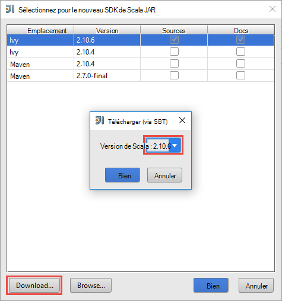
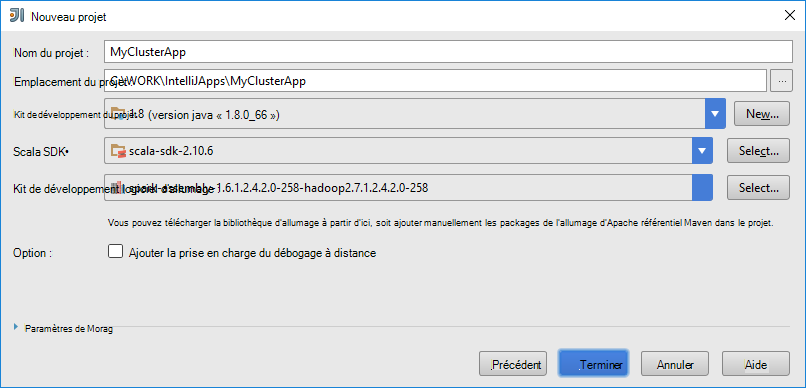
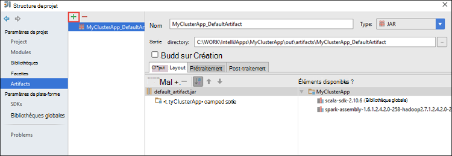
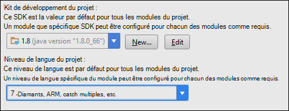
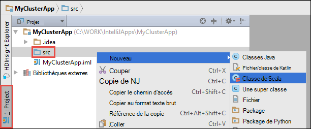

 <properties
    pageTitle="Utiliser les outils de HDInsight dans Shared Computer Toolkit Azure pour IntelliJ à déboguer à distance les applications en cours d’exécution sur des clusters de HDInsight Spark | Microsoft Azure"
    description="Découvrez comment utiliser les outils de HDInsight dans Shared Computer Toolkit Azure pour IntelliJ à déboguer à distance les applications en cours d’exécution sur des clusters de HDInsight Spark."
    services="hdinsight"
    documentationCenter=""
    authors="nitinme"
    manager="jhubbard"
    editor="cgronlun"
    tags="azure-portal"/>

<tags
    ms.service="hdinsight"
    ms.workload="big-data"
    ms.tgt_pltfrm="na"
    ms.devlang="na"
    ms.topic="article"
    ms.date="09/09/2016"
    ms.author="nitinme"/>

# Utilisez les outils de HDInsight dans Shared Computer Toolkit Azure pour IntelliJ déboguer des applications à distance sur un cluster Linux d’allumage HDInsight allumage

Cet article fournit des instructions étape par étape comment utiliser les outils de HDInsight dans Shared Computer Toolkit Azure pour IntelliJ à soumettre une tâche étincelle sur cluster de HDInsight Spark et débogage à distance à partir de votre ordinateur de bureau. Pour ce faire, vous devez effectuer les étapes suivantes :

1. Créer un réseau virtuel Azure site à site ou point-à-site. Ce document suppose que vous utilisez un réseau de site à site.

2. Créer un cluster d’allumage dans Azure HDInsight qui fait partie du réseau virtuel site-à-site Azure.

3. Vérifiez la connectivité entre votre bureau et de la headnode du cluster.

4. Créer une application de Scala dans l’idée de IntelliJ et le configurer pour le débogage distant.

5. Exécuter et déboguer l’application.

##Conditions préalables

* Un abonnement Azure. Consultez [Azure d’obtenir la version d’évaluation gratuite](https://azure.microsoft.com/documentation/videos/get-azure-free-trial-for-testing-hadoop-in-hdinsight/).

* Un cluster d’allumage d’Apache sur HDInsight Linux. Pour obtenir des instructions, consultez [créer un allumage Apache des clusters dans Azure HDInsight](hdinsight-apache-spark-jupyter-spark-sql.md).
 
* Kit de développement de Java d’Oracle. Vous pouvez l’installer à partir [d’ici](http://www.oracle.com/technetwork/java/javase/downloads/jdk8-downloads-2133151.html).
 
* IntelliJ idée. Cet article utilise la version 15.0.1. Vous pouvez l’installer à partir [d’ici](https://www.jetbrains.com/idea/download/).
 
* Outils d’HDInsight dans Azure Shared Computer Toolkit pour IntelliJ. Outils d’HDInsight de IntelliJ sont disponibles dans le cadre de la Shared Computer Toolkit Azure pour IntelliJ. Pour obtenir des instructions sur l’installation de la Shared Computer Toolkit d’Azure, consultez [installer le Shared Computer Toolkit Azure pour IntelliJ](../azure-toolkit-for-intellij-installation.md).

* Connectez-vous à votre abonnement Azure à partir de l’idée d’IntelliJ. Suivez les instructions fournies [ici](hdinsight-apache-spark-intellij-tool-plugin.md#log-into-your-azure-subscription).
 
* Lors de l’exécution d’application Scala d’allumage pour le débogage distant sur un ordinateur Windows, vous pouvez obtenir une exception, comme expliqué dans l' [allumage-2356](https://issues.apache.org/jira/browse/SPARK-2356) qui se produit en raison d’une WinUtils.exe manquant sous Windows. Pour contourner cette erreur, vous devez [Télécharger le fichier exécutable à partir d’ici](http://public-repo-1.hortonworks.com/hdp-win-alpha/winutils.exe) dans un emplacement comme **C:\WinUtils\bin**. Vous devez ensuite ajouter une variable d’environnement **HADOOP_HOME** et la valeur de la variable **C\WinUtils**la valeur.

## Étape 1 : Création d’un réseau virtuel Azure

Suivez les instructions dans les liens ci-dessous pour créer un réseau virtuel Azure et vérifiez la connectivité entre le bureau et le réseau virtuel d’Azure.

* [Créer un VNet avec une connexion VPN de site à site à l’aide du portail Azure](../vpn-gateway/vpn-gateway-howto-site-to-site-resource-manager-portal.md)
* [Créer un VNet avec une connexion VPN de site à site à l’aide de PowerShell](../vpn-gateway/vpn-gateway-create-site-to-site-rm-powershell.md)
* [Configurer une connexion point-à-site, à un réseau virtuel à l’aide de PowerShell](../vpn-gateway/vpn-gateway-howto-point-to-site-rm-ps.md)

## Étape 2 : Créer un cluster HDInsight Spark

Vous devez également créer un cluster d’allumage d’Apache sur Azure HDInsight qui fait partie du réseau virtuel Azure que vous avez créé. Utilisez les informations disponibles à [basé sur Linux de créer des clusters dans HDInsight](hdinsight-hadoop-provision-linux-clusters.md). Dans le cadre de la configuration facultative, sélectionnez le réseau virtuel Azure que vous avez créé à l’étape précédente.

## Étape 3 : Vérifiez la connectivité entre votre bureau et de la headnode de cluster

1. Obtenir l’adresse IP de la headnode. Ouvrez Ambari UI pour le cluster. À partir de la blade de cluster, cliquez sur **tableau de bord**.

    

2. À partir de la Ambari UI, entre le coin supérieur droit, cliquez sur **Hosts**.

    

3. Vous devez voir une liste des headnodes, des nœuds de travailleur et soigneur. Les headnodes ont le **hn*** préfixe. Cliquez sur le premier headnode.

    

4. Au bas de la page qui s’ouvre, à partir de la zone **Résumé** , copiez l’adresse IP de la headnode et le nom d’hôte.

    

5. Inclure l’adresse IP et le nom d’hôte de l’headnode au fichier **hosts** sur l’ordinateur à partir duquel exécuter et de déboguer à distance les tâches de l’allumage. Cela vous permettra de communiquer avec le headnode à l’aide de l’adresse IP ainsi que le nom d’hôte.

    1. Ouvrez un bloc-notes avec des autorisations élevées. Dans le menu fichier, cliquez sur **Ouvrir** , puis naviguez jusqu'à l’emplacement du fichier hosts. Sur un ordinateur Windows, il est `C:\Windows\System32\Drivers\etc\hosts`.

    2. Ajoutez le code suivant du fichier **hosts** .

            # For headnode0
            192.xxx.xx.xx hn0-nitinp
            192.xxx.xx.xx hn0-nitinp.lhwwghjkpqejawpqbwcdyp3.gx.internal.cloudapp.net

            # For headnode1
            192.xxx.xx.xx hn1-nitinp
            192.xxx.xx.xx hn1-nitinp.lhwwghjkpqejawpqbwcdyp3.gx.internal.cloudapp.net

5. À partir de l’ordinateur qui vous est connectée au réseau virtuel Azure qui est utilisé par le cluster HDInsight, vérifiez que vous pouvez envoyer à la fois les headnodes à l’aide de l’adresse IP ainsi que le nom d’hôte.

6. SSH dans le headnode de cluster à l’aide d’instructions à [se connecter à un cluster de HDInsight à l’aide de SSH](hdinsight-hadoop-linux-use-ssh-windows.md#connect-to-a-linux-based-hdinsight-cluster). À partir de la headnode du cluster, exécutez ping sur l’adresse IP de l’ordinateur de bureau. Vous devez tester la connectivité aux deux adresses IP assignées à l’ordinateur, l’autre pour la connexion réseau et l’autre pour le réseau virtuel Azure connecté à l’ordinateur.

7. Répétez les étapes pour l’autre headnode. 

## Étape 4 : Créer une application d’allumage Scala à l’aide des outils HDInsight dans Azure Shared Computer Toolkit pour IntelliJ et le configurer pour le débogage distant

1. Lancer l’idée d’IntelliJ et créez un nouveau projet. Dans la boîte de dialogue Nouveau projet, faites les sélections suivantes, puis cliquez sur **suivant**.

    

    * Dans le volet gauche, sélectionnez **HDInsight**.
    * Dans le volet droit, sélectionnez **étincelle sur HDInsight (Scala)**.
    * Cliquez sur **suivant**.

2. Dans la fenêtre suivante, entrez les détails de projet.

    * Fournir un nom de projet et l’emplacement du projet.
    * Pour le **Kit de développement de projet**, assurez-vous de que vous fournissez une version de Java supérieure à 7.
    * Pour le **Kit de développement logiciel Scala**, cliquez sur **créer**, cliquez sur **Télécharger**et puis sélectionnez la version de Scala à utiliser. **Vous assurer que vous n’utilisez pas la version 2.11.x**. Cet exemple utilise la version **2.10.6**.

        

    * Pour l' **Allumage SDK**, télécharger et utiliser le SDK à partir [d’ici](http://go.microsoft.com/fwlink/?LinkID=723585&clcid=0x409). Vous pouvez également ignorer et utiliser le [référentiel d’allumage Maven](http://mvnrepository.com/search?q=spark) au lieu de cela, toutefois, assurez-vous que vous disposez du référentiel maven droite pour développer vos applications d’allumage. (Par exemple, vous avez besoin pour vous assurer que l’article étincelle Streaming est installé si vous utilisez une étincelle en continu ; Aussi, assurez-vous que vous utilisez le référentiel marqué comme Scala 2.10 - n’utilisez pas le référentiel la mention Scala 2.11.)

        

    * Cliquez sur **Terminer**.

3. Le projet d’allumage va créer automatiquement un artefact pour vous. Pour visualiser l’objet, procédez comme suit.

    1. Dans le menu **fichier** , cliquez sur **Structure du projet**.
    2. Dans la boîte de dialogue **Structure du projet** , cliquez sur les **artefacts** pour visualiser l’objet par défaut qui est créé.

        

    Vous pouvez également créer votre propre objet Fix en cliquant sur les **+** icône, mis en surbrillance dans l’image ci-dessus.

4. Dans la boîte de dialogue **Structure du projet** , cliquez sur **projet**. Si le **Kit de développement logiciel projet** est définie à 1.8, assurez-vous que le **niveau de langage de projet** est définie **7 - diamants, etc. de capture multiples, ARM,**.

    

4. Ajouter des bibliothèques à votre projet. Pour ajouter une bibliothèque, cliquez sur le nom du projet dans l’arborescence du projet, puis cliquez sur **Ouvrir les paramètres du Module**. Dans la boîte de dialogue **Structure du projet** , dans le volet gauche, cliquez sur **bibliothèques**, cliquez sur le signe plus (+) de symbole, puis cliquez sur **à partir de Maven**. 

     

    Dans la boîte de dialogue **Bibliothèque de télécharger à partir du référentiel de Maven** , rechercher et ajouter les bibliothèques suivantes.

    * `org.scalatest:scalatest_2.10:2.2.1`
    * `org.apache.hadoop:hadoop-azure:2.7.1`

5. Copie `yarn-site.xml` et `core-site.xml` de la headnode de cluster et l’ajouter au projet. Utilisez les commandes suivantes pour copier les fichiers. Vous pouvez utiliser [Cygwin](https://cygwin.com/install.html) pour exécuter les opérations suivantes `scp` commandes pour copier les fichiers à partir de la headnodes du cluster.

        scp <ssh user name>@<headnode IP address or host name>://etc/hadoop/conf/core-site.xml .

    Étant donné que nous avons déjà ajouté l’adresse IP de cluster headnode et les noms d’hôtes fo les hôtes de fichiers sur le bureau, nous pouvons utiliser les commandes **scp** de la manière suivante.

        scp sshuser@hn0-nitinp:/etc/hadoop/conf/core-site.xml .
        scp sshuser@hn0-nitinp:/etc/hadoop/conf/yarn-site.xml .

    Ajouter ces fichiers à votre projet en les copiant dans le dossier **/src** dans votre arborescence du projet, par exemple `<your project directory>\src`.

6. Mise à jour de la `core-site.xml` pour apporter les modifications suivantes.

    1. `core-site.xml`inclut la clé chiffrée pour le compte de stockage associé au cluster. Dans le `core-site.xml` que vous avez ajouté au projet, remplacez la clé chiffrée avec la clé de stockage réel associé avec le compte de stockage par défaut. Reportez-vous à la section [gérer vos clés d’accès de stockage](../storage/storage-create-storage-account.md#manage-your-storage-account).

            <property>
                <name>fs.azure.account.key.hdistoragecentral.blob.core.windows.net</name>
                <value>access-key-associated-with-the-account</value>
            </property>

    2. Supprimez les entrées suivantes à partir de la `core-site.xml`.

            <property>
                <name>fs.azure.account.keyprovider.hdistoragecentral.blob.core.windows.net</name>
                <value>org.apache.hadoop.fs.azure.ShellDecryptionKeyProvider</value>
            </property>

            <property>
                <name>fs.azure.shellkeyprovider.script</name>
                <value>/usr/lib/python2.7/dist-packages/hdinsight_common/decrypt.sh</value>
            </property>

            <property>
                <name>net.topology.script.file.name</name>
                <value>/etc/hadoop/conf/topology_script.py</value>
            </property>

    3. Enregistrez le fichier.

7. Ajoutez la classe principale pour votre application. À partir de l' **Explorateur de projets**, cliquez sur **src**, pointez sur **Nouveau**, puis cliquez sur **classe de Scala**.

    

8. Dans la boîte de dialogue **Créer une nouvelle classe de Scala** , entrez un nom pour sélection de **type** **objet**et puis cliquez sur **OK**.

    

9. Dans le `MyClusterAppMain.scala` fichier, collez le code suivant. Ce code crée l’allumage contexte et lance une `executeJob` méthode à partir de la `SparkSample` objet.

        import org.apache.spark.{SparkConf, SparkContext}

        object SparkSampleMain {
          def main (arg: Array[String]): Unit = {
            val conf = new SparkConf().setAppName("SparkSample")
                                      .set("spark.hadoop.validateOutputSpecs", "false")
            val sc = new SparkContext(conf)
        
            SparkSample.executeJob(sc,
                                   "wasbs:///HdiSamples/HdiSamples/SensorSampleData/hvac/HVAC.csv",
                                   "wasbs:///HVACOut")
          }
        }

10. Répétez les étapes 8 et 9 ci-dessus pour ajouter un nouvel objet Scala appelé `SparkSample`. Vous pouvez ajouter le code suivant à cette classe. Ce code lit les données à partir de la HVAC.csv (disponible sur tous les clusters HDInsight Spark), extrait les lignes qui ont seulement un chiffre à la septième colonne dans le CSV et écrit la sortie dans **/HVACOut** sous le conteneur de stockage par défaut pour le cluster.

        import org.apache.spark.SparkContext
    
        object SparkSample {
          def executeJob (sc: SparkContext, input: String, output: String): Unit = {
            val rdd = sc.textFile(input)
        
            //find the rows which have only one digit in the 7th column in the CSV
            val rdd1 =  rdd.filter(s => s.split(",")(6).length() == 1)
        
            val s = sc.parallelize(rdd.take(5)).cartesian(rdd).count()
            println(s)
        
            rdd1.saveAsTextFile(output)
            //rdd1.collect().foreach(println)
          }
        
        }

11. Répétez la classe les étapes 8 et 9 ci-dessus pour ajouter un nouveau appelé `RemoteClusterDebugging`. Cette classe implémente l’infrastructure de test d’allumage qui est utilisé pour le débogage des applications. Ajoutez le code suivant à la `RemoteClusterDebugging` classe.

        import org.apache.spark.{SparkConf, SparkContext}
        import org.scalatest.FunSuite
        
        class RemoteClusterDebugging extends FunSuite {
        
          test("Remote run") {
            val conf = new SparkConf().setAppName("SparkSample")
                                      .setMaster("yarn-client")
                                      .set("spark.yarn.am.extraJavaOptions", "-Dhdp.version=2.4")
                                      .set("spark.yarn.jar", "wasbs:///hdp/apps/2.4.2.0-258/spark-assembly-1.6.1.2.4.2.0-258-hadoop2.7.1.2.4.2.0-258.jar")
                                      .setJars(Seq("""C:\WORK\IntelliJApps\MyClusterApp\out\artifacts\MyClusterApp_DefaultArtifact\default_artifact.jar"""))
                                      .set("spark.hadoop.validateOutputSpecs", "false")
            val sc = new SparkContext(conf)
        
            SparkSample.executeJob(sc,
              "wasbs:///HdiSamples/HdiSamples/SensorSampleData/hvac/HVAC.csv",
              "wasbs:///HVACOut")
          }
        }

    Deux points importants à noter ici :
    
    * Pour `.set("spark.yarn.jar", "wasbs:///hdp/apps/2.4.2.0-258/spark-assembly-1.6.1.2.4.2.0-258-hadoop2.7.1.2.4.2.0-258.jar")`, assurez-vous que l’assembly d’allumage JAR est disponible sur le stockage de cluster au niveau du chemin spécifié.
    * Pour `setJars`, spécifiez l’emplacement où sera créé le fichier jar d’artefact. En général, il est `<Your IntelliJ project directory>\out\<project name>_DefaultArtifact\default_artifact.jar`. 

11. Dans le `RemoteClusterDebugging` de classe, cliquez sur le `test` mot clé et sélectionnez **Créer une Configuration de RemoteClusterDebugging**.

    

12. Dans la boîte de dialogue, fournissez un nom pour la configuration et de sélectionner le **type de Test** en tant que **nom du Test**. Conservez toutes les autres valeurs par défaut et cliquez sur **Appliquer**, puis cliquez sur **OK**.

    

13. Vous devez maintenant voir une liste déroulante dans la barre de menus de configuration **Exécuter à distance** . 

    

## Étape 5 : Exécution de l’application en mode débogage

1. Dans votre projet IntelliJ idée, ouvrez `SparkSample.scala` et créer un point d’arrêt en regard de « val rdd1 ». Dans le menu contextuel pour la création d’un point d’arrêt, sélectionnez la **ligne dans la fonction executeJob**.

    

2. Cliquez sur le bouton **Déboguer exécuter** la configuration **d’Exécution à distance** déroulante pour démarrer l’application en cours d’exécution.

    

3. Lors de l’exécution du programme atteint le point d’arrêt, vous devriez voir un onglet du **débogueur** dans le volet inférieur.

    

4. Cliquez sur le (**+**) icône pour ajouter un espion, comme illustré dans l’image ci-dessous. 

    

    Dans ce cas, étant donné que l’application s’est arrêtée avant la variable `rdd1` a été créé, à l’aide de cette surveillance, nous pouvons voir quels sont les 5 premières lignes dans la variable `rdd`. Appuyez sur **entrée**.

    

    Ce que vous voyez dans l’image ci-dessus est que, lors de l’exécution, vous pouvez interroger terrabytes de données et débogage comment votre application progresse. Par exemple, dans la sortie illustrée dans l’image ci-dessus, vous voyez que la première ligne de la sortie est un en-tête. Sur cette base, vous pouvez modifier le code de votre application pour ignorer la ligne d’en-tête si nécessaire.

5. Vous pouvez maintenant cliquer sur l’icône du **Programme de reprise** pour poursuivre l’exécution de votre application.

    

6. Si l’application se termine avec succès, vous devez voir une sortie semblable à la suivante.

    

 

## Voir aussi

* [Vue d’ensemble : Allumage commandé de Apache sur Azure HDInsight](hdinsight-apache-spark-overview.md)

### Scénarios

* [Allumage avec BI : effectuer l’analyse interactive des données à l’aide d’étincelle dans HDInsight avec les outils d’analyse Décisionnelle](hdinsight-apache-spark-use-bi-tools.md)

* [Allumage avec apprentissage automatique : allumage d’utilisation dans les HDInsight d’analyse de température de construction à l’aide des données HVAC](hdinsight-apache-spark-ipython-notebook-machine-learning.md)

* [Allumage avec apprentissage automatique : allumage utilisation de HDInsight pour prédire les résultats de l’inspection alimentaires](hdinsight-apache-spark-machine-learning-mllib-ipython.md)

* [Diffusion en continu de l’allumage : Allumage d’utilisation dans HDInsight pour générer des applications de diffusion en continu en temps réel](hdinsight-apache-spark-eventhub-streaming.md)

* [Analyse de journal de site Web à l’aide d’étincelle dans HDInsight](hdinsight-apache-spark-custom-library-website-log-analysis.md)

### Créer et exécuter des applications

* [Créez une application autonome à l’aide de Scala](hdinsight-apache-spark-create-standalone-application.md)

* [Exécuter des tâches à distance sur un cluster d’allumage à l’aide de Livy](hdinsight-apache-spark-livy-rest-interface.md)

### Outils et extensions

* [Utilisez les outils de HDInsight Shared Computer Toolkit Azure pour IntelliJ pour créer et soumettre des applications d’allumage Scala](hdinsight-apache-spark-intellij-tool-plugin.md)

* [Utiliser les outils de HDInsight dans Shared Computer Toolkit Azure pour Eclipse pour créer des applications d’allumage](hdinsight-apache-spark-eclipse-tool-plugin.md)

* [Utilisez les portables Zeppelin avec un cluster d’allumage sur HDInsight](hdinsight-apache-spark-use-zeppelin-notebook.md)

* [Noyaux disponibles pour le cluster d’allumage pour HDInsight ordinateur portable Jupyter](hdinsight-apache-spark-jupyter-notebook-kernels.md)

* [Utilisez les lots externes avec les ordinateurs portables de Jupyter](hdinsight-apache-spark-jupyter-notebook-use-external-packages.md)

* [Installez Jupyter sur votre ordinateur et vous connecter à un cluster HDInsight Spark](hdinsight-apache-spark-jupyter-notebook-install-locally.md)

### Gestion des ressources

* [Gérer les ressources du cluster Apache étincelle dans Azure HDInsight](hdinsight-apache-spark-resource-manager.md)

* [Tâches de suivi et de débogage en cours d’exécution sur un cluster Apache étincelle dans HDInsight](hdinsight-apache-spark-job-debugging.md)
