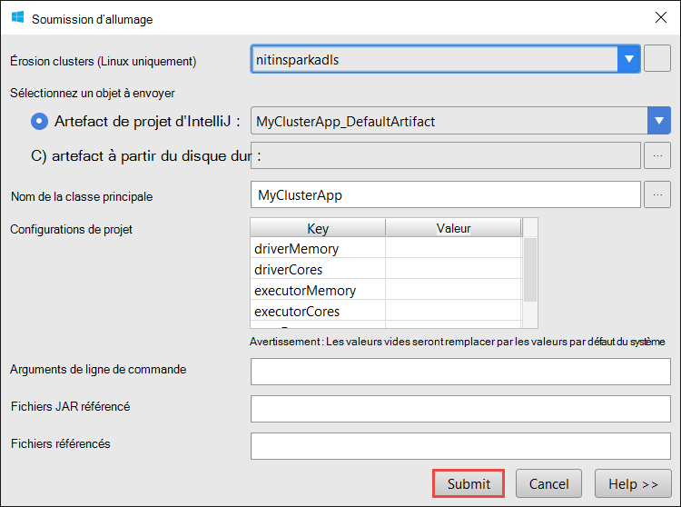

 <properties
    pageTitle="Créer des applications d’allumage Scala à l’aide des outils de HDInsight dans Azure Shared Computer Toolkit pour IntelliJ | Microsoft Azure"
    description="Apprenez à créer des application d’allumage pour s’exécuter sur des clusters de HDInsight Spark autonome."
    services="hdinsight"
    documentationCenter=""
    authors="nitinme"
    manager="jhubbard"
    editor="cgronlun"
    tags="azure-portal"/>

<tags
    ms.service="hdinsight"
    ms.workload="big-data"
    ms.tgt_pltfrm="na"
    ms.devlang="na"
    ms.topic="article"
    ms.date="09/09/2016"
    ms.author="nitinme"/>

# Utiliser les outils de HDInsight dans Shared Computer Toolkit Azure pour IntelliJ pour créer des applications de cluster Linux d’allumage HDInsight d’allumage

Cet article fournit des instructions pas à pas le développement d’applications d’allumage écrites en Scala et en envoyant à un HDInsight Spark de cluster à l’aide des outils de HDInsight dans Azure Shared Computer Toolkit pour IntelliJ.  Vous pouvez utiliser les outils de différentes manières :

* De développer et de présenter une demande de Scala Spark sur un cluster HDInsight Spark
* Pour accéder aux ressources de votre cluster Azure HDInsight allumage
* Pour développer et exécuter une application Scala Spark localement

Vous pouvez également suivre une vidéo [ici](https://mix.office.com/watch/1nqkqjt5xonza) pour vous aider à démarrer.

>[AZURE.IMPORTANT] Cet outil peut être utilisé pour créer et soumettre des candidatures uniquement pour un cluster HDInsight Spark sous Linux.

##Conditions préalables

* Un abonnement Azure. Consultez [Azure d’obtenir la version d’évaluation gratuite](https://azure.microsoft.com/documentation/videos/get-azure-free-trial-for-testing-hadoop-in-hdinsight/).

* Un cluster d’allumage d’Apache sur HDInsight Linux. Pour obtenir des instructions, consultez [créer un allumage Apache des clusters dans Azure HDInsight](hdinsight-apache-spark-jupyter-spark-sql.md).

* Kit de développement de Java d’Oracle. Vous pouvez l’installer à partir [d’ici](http://www.oracle.com/technetwork/java/javase/downloads/jdk8-downloads-2133151.html).

* IntelliJ idée. Cet article utilise la version 15.0.1. Vous pouvez l’installer à partir [d’ici](https://www.jetbrains.com/idea/download/).

## Installer les outils de HDInsight dans Azure Shared Computer Toolkit pour IntelliJ

HDInsight des outils pour IntelliJ est disponible dans le cadre de la Shared Computer Toolkit Azure pour IntelliJ. Pour obtenir des instructions sur l’installation de la Shared Computer Toolkit d’Azure, consultez [installer le Shared Computer Toolkit Azure pour IntelliJ](../azure-toolkit-for-intellij-installation.md).

## Connectez-vous à votre abonnement Azure

1. Lancez l’IDE IntelliJ et ouvrir l’Explorateur d’Azure. Dans le menu **affichage** dans l’IDE, cliquez sur les **Fenêtres Outil** et puis cliquez sur **Explorateur d’Azure**.

    

2. Cliquez sur le nœud **d’Azure** dans l' **Explorateur d’Azure**, puis cliquez sur **Gérer les abonnements**.

3. Dans la boîte de dialogue **Gérer les abonnements** , cliquez sur **se connecter** et entrez vos informations d’identification Azure.

    

4. Après que vous être connecté, la boîte de dialogue **Gérer les abonnements** répertorie tous les abonnements Azure associés avec les informations d’identification. Cliquez sur **Fermer** dans la boîte de dialogue.

5. Dans l’onglet **Explorateur d’Azure** , développez **HDInsight** pour voir les clusters HDInsight Spark sous votre abonnement.

    

6. Vous pouvez développer davantage un nœud du nom de cluster pour afficher les ressources (par exemple, les comptes de stockage) associés au cluster.

    

## Exécuter une application d’allumage Scala sur un cluster HDInsight Spark

1. Lancer l’idée d’IntelliJ et créez un nouveau projet. Dans la boîte de dialogue Nouveau projet, faites les sélections suivantes, puis cliquez sur **suivant**.

    

    * Dans le volet gauche, sélectionnez **HDInsight**.
    * Dans le volet droit, sélectionnez **étincelle sur HDInsight (Scala)**.
    * Cliquez sur **suivant**.

2. Dans la fenêtre suivante, entrez les détails de projet.

    * Fournir un nom de projet et l’emplacement du projet.
    * Pour le **Kit de développement de projet**, assurez-vous de que vous fournissez une version de Java supérieure à 7.
    * Pour le **Kit de développement logiciel Scala**, cliquez sur **créer**, cliquez sur **Télécharger**et puis sélectionnez la version de Scala à utiliser. **Vous assurer que vous n’utilisez pas la version 2.11.x**. Cet exemple utilise la version **2.10.6**.

        

    * Pour l' **Allumage SDK**, télécharger et utiliser le SDK à partir [d’ici](http://go.microsoft.com/fwlink/?LinkID=723585&clcid=0x409). Vous pouvez également ignorer et utiliser le [référentiel d’allumage Maven](http://mvnrepository.com/search?q=spark) au lieu de cela, toutefois, assurez-vous que vous disposez du référentiel maven droite pour développer vos applications d’allumage. (Par exemple, vous avez besoin pour vous assurer que l’article étincelle Streaming est installé si vous utilisez une étincelle en continu ; Aussi, assurez-vous que vous utilisez le référentiel marqué comme Scala 2.10 - n’utilisez pas le référentiel la mention Scala 2.11.)

        

    * Cliquez sur **Terminer**.

3. Le projet d’allumage va créer automatiquement un artefact pour vous. Pour visualiser l’objet, procédez comme suit.

    1. Dans le menu **fichier** , cliquez sur **Structure du projet**.
    2. Dans la boîte de dialogue **Structure du projet** , cliquez sur les **artefacts** pour visualiser l’objet par défaut qui est créé.

        

    Vous pouvez également créer votre propre objet Fix en cliquant sur les **+** icône, mis en surbrillance dans l’image ci-dessus.

4. Dans la boîte de dialogue **Structure du projet** , cliquez sur **projet**. Si le **Kit de développement logiciel projet** est définie à 1.8, assurez-vous que le **niveau de langage de projet** est définie **7 - diamants, etc. de capture multiples, ARM,**.

    

5. Ajoutez le code source de votre application.

    1. À partir de l' **Explorateur de projets**, cliquez sur **src**, pointez sur **Nouveau**, puis cliquez sur **classe de Scala**.

        

    2. Dans la boîte de dialogue **Créer une nouvelle classe de Scala** , entrez un nom pour sélection de **type** **objet**et puis cliquez sur **OK**.

        

    3. Dans le fichier **MyClusterApp.scala** , collez le code suivant. Ce code lit les données à partir de la HVAC.csv (disponible sur tous les clusters HDInsight Spark), extrait les lignes qui ont seulement un chiffre à la septième colonne dans le CSV et écrit la sortie dans **/HVACOut** sous le conteneur de stockage par défaut pour le cluster.

            import org.apache.spark.SparkConf
            import org.apache.spark.SparkContext

            object MyClusterApp{
              def main (arg: Array[String]): Unit = {
                val conf = new SparkConf().setAppName("MyClusterApp")
                val sc = new SparkContext(conf)

                val rdd = sc.textFile("wasbs:///HdiSamples/HdiSamples/SensorSampleData/hvac/HVAC.csv")

                //find the rows which have only one digit in the 7th column in the CSV
                val rdd1 =  rdd.filter(s => s.split(",")(6).length() == 1)

                rdd1.saveAsTextFile("wasbs:///HVACOut")
              }

            }

5. Exécutez l’application sur un cluster HDInsight Spark.

    1. À partir de l' **Explorateur de projets**, cliquez sur le nom du projet et sélectionnez **Application d’allumage soumettre à HDInsight**.

        

    2. Vous devrez entrer vos informations d’identification de l’abonnement Azure. Dans la boîte de dialogue **Envoi d’allumage** , fournir les valeurs suivantes.

        * Pour les **clusters d’allumage (Linux uniquement)**, sélectionnez le cluster HDInsight Spark sur lequel vous souhaitez exécuter votre application.

        * Vous devez soit sélectionner un artefact dans le projet IntelliJ, ou sélectionnez-en un à partir du disque dur.

        * Par rapport à la zone de texte **nom de la classe principale** , cliquez sur le bouton de sélection ( ), sélectionnez la classe principale dans le code source de votre application, puis cliquez sur **OK**.

            

        * Étant donné que dans cet exemple, le code d’application ne nécessitent des arguments de ligne de commande ni les fichiers ou les fichiers JAR de référence, vous pouvez laisser les autres zones de texte vides.

        * Après avoir fourni toutes les entrées, la boîte de dialogue doit ressembler à la suivante.

            

        * Cliquez sur **Envoyer**.

    3. L’onglet **Envoi d’étincelle** au bas de la fenêtre doit commencer à afficher la progression. Vous pouvez également arrêter l’application en cliquant sur le bouton rouge dans la fenêtre « Soumission d’allumage ».

        

    Dans la section suivante, vous allez apprendre à accéder à la tâche à l’aide des outils HDInsight Azure Shared Computer Toolkit pour IntelliJ de sortie.

## Accéder et gérer des clusters HDInsight Spark l’aide des outils HDInsight Azure Shared Computer Toolkit pour IntelliJ

Vous pouvez effectuer diverses opérations en utilisant les outils de HDInsight qui font partie de Shared Computer Toolkit Azure pour IntelliJ.

### Accéder à la vue projet directement à partir des outils HDInsight

1. À partir de l' **Explorateur d’Azure**, développez **HDInsight**, développez le nom du cluster étincelle et puis cliquez sur **travaux**.

2. Dans le volet de droite, l’onglet **Affichage de travail étincelle** affiche toutes les applications qui ont été exécutées sur le cluster. Cliquez sur le nom de l’application pour lequel vous souhaitez obtenir plus de détails.

    

3. Les zones de **Message d’erreur**, **Sortie des tâches**, **Les journaux de travail Livy**et **Allumage les journaux du pilote** sont remplies en fonction de l’application que vous sélectionnez.

4. Vous pouvez également ouvrir l' **Allumage historique UI** et l' **Interface utilisateur de fils** (au niveau de l’application) en cliquant sur les boutons respectifs dans la partie supérieure de l’écran.

### Accéder au serveur de l’historique d’allumage

1. À partir de l' **Explorateur d’Azure**, développez **HDInsight**, cliquez sur le nom de votre cluster d’allumage et puis sélectionnez **Ouvrir l’interface utilisateur de l’historique allumage**. Lorsque vous y êtes invité, entrez les informations d’identification d’administration pour le cluster. Vous devez spécifier ces lors de la configuration du cluster.

2. Dans le tableau de bord étincelle historique serveur, vous pouvez rechercher l’application vous juste après l’exécution d’en utilisant le nom de l’application. Dans le code ci-dessus, vous définissez le nom d’application à l’aide `val conf = new SparkConf().setAppName("MyClusterApp")`. Par conséquent, le nom de votre application d’allumage a été **MyClusterApp**.

### Lancement du portail de Ambari

À partir de l' **Explorateur d’Azure**, développez **HDInsight**, cliquez sur le nom de votre cluster d’allumage et sélectionnez **Ouvrir portail de gestion de Cluster (Ambari)**. Lorsque vous y êtes invité, entrez les informations d’identification d’administration pour le cluster. Vous devez spécifier ces lors de la configuration du cluster.

### Gérer les abonnements Azure

Par défaut, les outils de HDInsight répertorie les clusters de l’allumage de tous vos abonnements Azure. Si nécessaire, vous pouvez spécifier les abonnements pour lesquels vous souhaitez accéder au cluster. À partir de l' **Explorateur d’Azure**, cliquez sur le nœud de racine **d’Azure** et puis cliquez sur **Gérer les abonnements**. À partir de la boîte de dialogue, désactivez les cases à cocher par rapport à l’abonnement que vous ne souhaitez pas accéder, puis sur **Fermer**. Vous pouvez également cliquer sur **Fermer la session** si vous souhaitez vous déconnecter votre abonnement Azure.

## Exécuter une application d’allumage Scala localement

Vous pouvez utiliser les outils de HDInsight dans Shared Computer Toolkit Azure pour IntelliJ pour exécuter les applications de la Scala d’allumage localement sur votre poste de travail. En général, ces applications ne pas doivent accéder à des ressources de cluster comme conteneur de stockage et peuvent être exécutées et testées localement.

### Condition préalable

Lors de l’exécution de l’application d’allumage Scala locale sur un ordinateur Windows, vous pouvez obtenir une exception, comme expliqué dans l' [allumage-2356](https://issues.apache.org/jira/browse/SPARK-2356) qui se produit en raison d’une WinUtils.exe manquant sous Windows. Pour contourner cette erreur, vous devez [Télécharger le fichier exécutable à partir d’ici](http://public-repo-1.hortonworks.com/hdp-win-alpha/winutils.exe) dans un emplacement comme **C:\WinUtils\bin**. Vous devez ensuite ajouter une variable d’environnement **HADOOP_HOME** et la valeur de la variable **C\WinUtils**la valeur.

### Exécuter une application d’allumage Scala locale  

1. Lancer l’idée d’IntelliJ et créez un nouveau projet. Dans la boîte de dialogue Nouveau projet, faites les sélections suivantes, puis cliquez sur **suivant**.

    

    * Dans le volet gauche, sélectionnez **HDInsight**.
    * Dans le volet de droite, sélectionnez **étincelle sur échantillon exécuter HDInsight Local (Scala)**.
    * Cliquez sur **suivant**.

2. Dans la fenêtre suivante, entrez les détails de projet.

    * Fournir un nom de projet et l’emplacement du projet.
    * Pour le **Kit de développement de projet**, assurez-vous de que vous fournissez une version de Java supérieure à 7.
    * Pour le **Kit de développement logiciel Scala**, cliquez sur **créer**, cliquez sur **Télécharger**et puis sélectionnez la version de Scala à utiliser. **Vous assurer que vous n’utilisez pas la version 2.11.x**. Cet exemple utilise la version **2.10.6**.

        

    * Pour l' **Allumage SDK**, télécharger et utiliser le SDK à partir [d’ici](http://go.microsoft.com/fwlink/?LinkID=723585&clcid=0x409). Vous pouvez également ignorer et utiliser le [référentiel d’allumage Maven](http://mvnrepository.com/search?q=spark) au lieu de cela, toutefois, assurez-vous que vous disposez du référentiel maven droite pour développer vos applications d’allumage. (Par exemple, vous avez besoin pour vous assurer que l’article étincelle Streaming est installé si vous utilisez une étincelle en continu ; Aussi, assurez-vous que vous utilisez le référentiel marqué comme Scala 2.10 - n’utilisez pas le référentiel la mention Scala 2.11.)

        

    * Cliquez sur **Terminer**.

3. Le modèle ajoute un exemple de code (**LogQuery**) dans le dossier **src** que vous pouvez exécuter localement sur votre ordinateur.

    

4.  Cliquez avec le bouton droit sur l’application **LogQuery** , puis cliquez sur **« Exécuter 'LogQuery' »**. Vous verrez une sortie, comme suit, dans l’onglet **exécution** en bas.

    

## Convertir des applications existantes IntelliJ idée d’utiliser les outils de HDInsight dans Azure Shared Computer Toolkit pour IntelliJ

Vous pouvez également convertir vos applications Scala d’allumage existantes créées à l’idée d’IntelliJ pour être compatibles avec les outils de HDInsight de Shared Computer Toolkit Azure pour IntelliJ. Cela vous permettra d’utiliser l’outil pour soumettre les applications sur un cluster HDInsight Spark. Pour ce faire, vous pouvez effectuer les opérations suivantes :

1. Pour une application de Scala d’allumage existante créée à l’aide de IntelliJ idée, ouvrez le fichier .iml associé.
2. Au niveau de la racine, vous verrez un élément **module** comme suit :

        <module org.jetbrains.idea.maven.project.MavenProjectsManager.isMavenModule="true" type="JAVA_MODULE" version="4">

3. Modifier l’élément à ajouter `UniqueKey="HDInsightTool"` afin que l’élément de **module** présente l’aspect suivant :

        <module org.jetbrains.idea.maven.project.MavenProjectsManager.isMavenModule="true" type="JAVA_MODULE" version="4" UniqueKey="HDInsightTool">

4. Enregistrer les modifications. Votre application doit désormais être compatible avec les outils de HDInsight de Shared Computer Toolkit Azure pour IntelliJ. Vous pouvez le tester en cliquant sur le nom du projet dans l’Explorateur de projets. Le menu contextuel devez maintenant avoir la possibilité de **Soumettre des Application allumage à HDInsight**.

## Résolution des problèmes

### « Veuillez utiliser une plus grande taille de tas » une erreur dans l’exécution locale

Au point 1.6 étincelle, si vous utilisez un kit de développement Java 32 bits au cours de l’exécution locale, vous pouvez rencontrer les erreurs suivantes :

    Exception in thread "main" java.lang.IllegalArgumentException: System memory 259522560 must be at least 4.718592E8. Please use a larger heap size.
        at org.apache.spark.memory.UnifiedMemoryManager$.getMaxMemory(UnifiedMemoryManager.scala:193)
        at org.apache.spark.memory.UnifiedMemoryManager$.apply(UnifiedMemoryManager.scala:175)
        at org.apache.spark.SparkEnv$.create(SparkEnv.scala:354)
        at org.apache.spark.SparkEnv$.createDriverEnv(SparkEnv.scala:193)
        at org.apache.spark.SparkContext.createSparkEnv(SparkContext.scala:288)
        at org.apache.spark.SparkContext.<init>(SparkContext.scala:457)
        at LogQuery$.main(LogQuery.scala:53)
        at LogQuery.main(LogQuery.scala)
        at sun.reflect.NativeMethodAccessorImpl.invoke0(Native Method)
        at sun.reflect.NativeMethodAccessorImpl.invoke(NativeMethodAccessorImpl.java:57)
        at sun.reflect.DelegatingMethodAccessorImpl.invoke(DelegatingMethodAccessorImpl.java:43)
        at java.lang.reflect.Method.invoke(Method.java:606)
        at com.intellij.rt.execution.application.AppMain.main(AppMain.java:144)

C’est parce que la taille de segment de mémoire n’est pas assez grande pour l’allumage à exécuter, car allumage nécessite au moins 471 Mo (vous pouvez obtenir plus d’informations à partir [d’allumage-12081](https://issues.apache.org/jira/browse/SPARK-12081) si vous le souhaitez). Une solution simple est d’utiliser un SDK Java de 64 bits. Vous pouvez également modifier les paramètres de la machine virtuelle Java dans IntelliJ en ajoutant les options suivantes :

    -Xms128m -Xmx512m -XX:MaxPermSize=300m -ea

## Problèmes de commentaires & connus

Affichée étincelle génère directement n’est ne pas pris en charge et nous travaillons sur ce.

Si vous avez des suggestions ou des commentaires, ou si vous rencontrez des problèmes lors de l’utilisation de cet outil, n’hésitez pas à envoyez-nous un e-mail à hdivstool à microsoft point com.

## Voir aussi

* [Vue d’ensemble : Allumage commandé de Apache sur Azure HDInsight](hdinsight-apache-spark-overview.md)

### Scénarios

* [Allumage avec BI : effectuer l’analyse interactive des données à l’aide d’étincelle dans HDInsight avec les outils d’analyse Décisionnelle](hdinsight-apache-spark-use-bi-tools.md)

* [Allumage avec apprentissage automatique : allumage d’utilisation dans les HDInsight d’analyse de température de construction à l’aide des données HVAC](hdinsight-apache-spark-ipython-notebook-machine-learning.md)

* [Allumage avec apprentissage automatique : allumage utilisation de HDInsight pour prédire les résultats de l’inspection alimentaires](hdinsight-apache-spark-machine-learning-mllib-ipython.md)

* [Diffusion en continu de l’allumage : Allumage d’utilisation dans HDInsight pour générer des applications de diffusion en continu en temps réel](hdinsight-apache-spark-eventhub-streaming.md)

* [Analyse de journal de site Web à l’aide d’étincelle dans HDInsight](hdinsight-apache-spark-custom-library-website-log-analysis.md)

### Créer et exécuter des applications

* [Créez une application autonome à l’aide de Scala](hdinsight-apache-spark-create-standalone-application.md)

* [Exécuter des tâches à distance sur un cluster d’allumage à l’aide de Livy](hdinsight-apache-spark-livy-rest-interface.md)

### Outils et extensions

* [Utilisez les outils de HDInsight dans Shared Computer Toolkit Azure pour IntelliJ à déboguer à distance les applications d’allumage](hdinsight-apache-spark-intellij-tool-plugin-debug-jobs-remotely.md)

* [Utiliser les outils de HDInsight dans Shared Computer Toolkit Azure pour Eclipse pour créer des applications d’allumage](hdinsight-apache-spark-eclipse-tool-plugin.md)

* [Utilisez les portables Zeppelin avec un cluster d’allumage sur HDInsight](hdinsight-apache-spark-use-zeppelin-notebook.md)

* [Noyaux disponibles pour le cluster d’allumage pour HDInsight ordinateur portable Jupyter](hdinsight-apache-spark-jupyter-notebook-kernels.md)

* [Utilisez les lots externes avec les ordinateurs portables de Jupyter](hdinsight-apache-spark-jupyter-notebook-use-external-packages.md)

* [Installez Jupyter sur votre ordinateur et vous connecter à un cluster HDInsight Spark](hdinsight-apache-spark-jupyter-notebook-install-locally.md)

### Gestion des ressources

* [Gérer les ressources du cluster Apache étincelle dans Azure HDInsight](hdinsight-apache-spark-resource-manager.md)

* [Tâches de suivi et de débogage en cours d’exécution sur un cluster Apache étincelle dans HDInsight](hdinsight-apache-spark-job-debugging.md)
