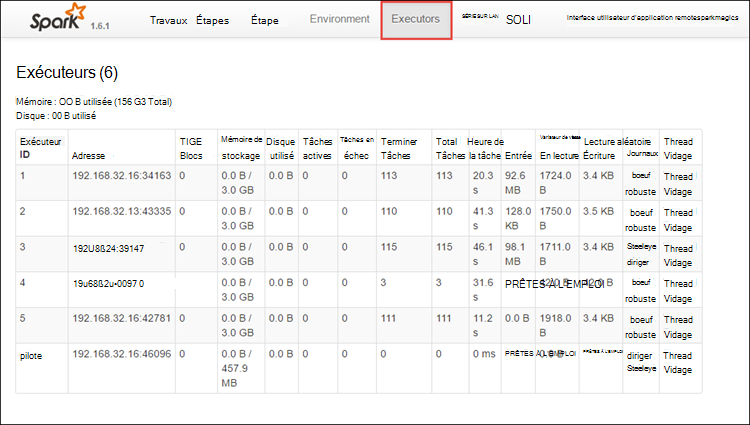

<properties 
    pageTitle="Tâches de suivi et de débogage en cours d’exécution sur Apache allumage du cluster dans l’HDInsight | Microsoft Azure" 
    description="Utilisez l’interface utilisateur de fils, l’interface utilisateur de l’allumage et le serveur d’historique d’allumage à suivre et à déboguer des travaux en cours d’exécution sur un cluster d’étincelle dans Azure HDInsight" 
    services="hdinsight" 
    documentationCenter="" 
    authors="nitinme" 
    manager="jhubbard" 
    editor="cgronlun"
    tags="azure-portal"/>

<tags 
    ms.service="hdinsight" 
    ms.workload="big-data" 
    ms.tgt_pltfrm="na" 
    ms.devlang="na" 
    ms.topic="article" 
    ms.date="08/25/2016" 
    ms.author="nitinme"/>

# Tâches de suivi et de débogage en cours d’exécution dans le cluster de Apache étincelle en HDInsight Linux

Dans cet article, vous apprendrez à suivre et à déboguer des travaux d’allumage à l’aide de l’interface utilisateur de fils, l’interface utilisateur de l’allumage et le serveur de l’historique allumage. Pour cet article, nous allons lancer un travail d’allumage à l’aide d’un ordinateur portable disponible avec le cluster étincelle, **Machine d’apprentissage : analyse prédictive de données d’inspection de denrées alimentaires à l’aide de MLLib**. Vous pouvez utiliser les étapes ci-dessous pour effectuer le suivi d’une application que vous avez envoyé à l’aide de n’importe quel autre approche, par exemple, **envoi d’allumage**.

##Conditions préalables

Vous devez disposer des éléments suivants :

- Un abonnement Azure. Consultez [Azure d’obtenir la version d’évaluation gratuite](https://azure.microsoft.com/documentation/videos/get-azure-free-trial-for-testing-hadoop-in-hdinsight/).
- Un cluster d’allumage d’Apache sur HDInsight Linux. Pour obtenir des instructions, consultez [créer un allumage Apache des clusters dans Azure HDInsight](hdinsight-apache-spark-jupyter-spark-sql.md).
- Démarrez le bloc-notes, en cours d’exécution **[Machine d’apprentissage : analyse prédictive de données d’inspection de denrées alimentaires à l’aide de MLLib](hdinsight-apache-spark-machine-learning-mllib-ipython.md)**. Pour obtenir des instructions sur l’exécution de ce bloc-notes, cliquez sur le lien.  

## Effectuer le suivi d’une application dans l’interface utilisateur de fils

1. Lancer l’interface utilisateur de fils. À partir de la blade de cluster, cliquez sur le **Tableau de bord de Cluster**, puis cliquez sur **fils**.

    

    >[AZURE.TIP] Sinon, vous pouvez également lancer l’interface utilisateur de fils à partir de la Ambari UI. Pour lancer l’UI Ambari, à partir de la blade de cluster, cliquez sur le **Tableau de bord de Cluster**, puis cliquez sur **Tableau de bord de Cluster HDInsight**. À partir de la Ambari UI, cliquez sur des **fils**et cliquez sur **Liens rapides**, cliquez sur le Gestionnaire de ressources active, puis cliquez sur **L’interface utilisateur de ResourceManager**.  

3. Dans la mesure où vous avez commencé le travail d’allumage à l’aide d’ordinateurs portables de Jupyter, l’application possède le nom **remotesparkmagics** (c’est le nom de toutes les applications qui sont démarrées à partir de portables). Cliquez sur l’ID d’application par rapport au nom de l’application pour obtenir plus d’informations sur la tâche. Cette action lance l’affichage de l’application.

    

    Pour des applications lancées à partir de la Jupyter de portables, l’état est toujours **en cours d’exécution** jusqu'à ce que vous quittiez le bloc-notes.

4. À partir de la vue de l’application, vous pouvez effectuer un zoom avant à trouver les conteneurs associé à l’application et les journaux (stdout/stderr). Vous pouvez également lancer l’interface utilisateur d’allumage en cliquant sur le lien correspondant à l' **URL de suivi**, comme indiqué ci-dessous. 

    

## Effectuer le suivi d’une application dans l’interface utilisateur d’allumage

Dans l’interface utilisateur d’allumage, vous pouvez approfondir les travaux d’allumage qui sont générées par l’application lancée précédemment.

1. Pour lancer l’interface utilisateur de l’allumage, de la vue de l’application, cliquez sur le lien sur l' **URL de suivi**, comme illustré dans la capture d’écran ci-dessus. Vous pouvez voir tous les travaux d’allumage qui sont lancés par l’application en cours d’exécution dans le bloc-notes de Jupyter.

    

2. Cliquez sur l’onglet **les exécuteurs** pour traitement et le stockage d’informations pour chaque exécuteur. Vous pouvez également récupérer la pile des appels en cliquant sur le lien **De threads de vidage** .

    
 
3. Cliquez sur l’onglet **étapes** pour afficher les étapes associées à l’application.

    

    Chaque stade peut avoir plusieurs tâches pour lesquelles vous pouvez afficher les statistiques de l’exécution, comme illustré ci-dessous.

     

4. À partir de la page Détails de la scène, vous pouvez lancer DAG visualisation. Développez le lien **DAG visualisation** en haut de la page, comme indiqué ci-dessous.

    

    DAG ou Direct Aclyic graphique représente les différentes étapes de l’application. Chaque zone bleue dans le graphique représente une opération allumage appelée à partir de l’application.

5. À partir de la page Détails de la scène, vous pouvez également lancer le mode de montage d’application. Développez le lien de la **Chronologie de l’événement** en haut de la page, comme indiqué ci-dessous.

    

    Cela affiche les événements de l’allumage sous la forme d’une barre de planning. L’affichage Chronologie est disponible à trois niveaux, dans tâches, d’un travail et dans une scène. L’image ci-dessus capture l’affichage Chronologie à un stade donné.

    >[AZURE.TIP] Si vous activez la case à cocher **Activer le zoom avant** , vous pouvez faire défiler gauche et droite dans l’affichage Chronologie.

6. Autres onglets de l’interface utilisateur d’allumage fournissent des informations utiles sur l’instance d’allumage ainsi.

    * Onglet de stockage - si votre application crée une RDDs, vous trouverez dans l’onglet stockage d’informations.
    * L’onglet environnement - cet onglet fournit un grand nombre d’informations utiles relatives à votre instance d’allumage tel que le 
        * Version de Scala
        * Répertoire de journal des événements associé au cluster
        * Nombre de cœurs de l’exécuteur de l’application
        * Etc.

## Trouver des informations sur les tâches terminées en utilisant le serveur de l’historique d’allumage

Une fois qu’un travail est terminé, les informations sur la tâche sont rendue persistante dans le serveur de l’historique d’allumage.

1. Pour lancer le serveur de l’historique étincelle, à partir de la blade de cluster, cliquez sur **Tableau de bord de Cluster**, puis cliquez sur **Serveur de l’historique d’allumage**.

    

    >[AZURE.TIP] Sinon, vous pouvez également lancer l’interface utilisateur d’étincelle historique Server à partir de la Ambari UI. Pour lancer l’UI Ambari, à partir de la blade de cluster, cliquez sur le **Tableau de bord de Cluster**, puis cliquez sur **Tableau de bord de Cluster HDInsight**. À partir de la Ambari UI, cliquez sur **étincelle**, cliquez sur les **Liens rapides**, puis cliquez sur **L’interface utilisateur du serveur étincelle historique**.

2. Vous pouvez voir toutes les applications terminées sont répertoriées. Cliquez sur un ID d’application se plonger dans une application pour plus d’informations.

    
    

## Voir aussi

* [Vue d’ensemble : Allumage commandé de Apache sur Azure HDInsight](hdinsight-apache-spark-overview.md)

### Scénarios

* [Allumage avec BI : effectuer l’analyse interactive des données à l’aide d’étincelle dans HDInsight avec les outils d’analyse Décisionnelle](hdinsight-apache-spark-use-bi-tools.md)

* [Allumage avec apprentissage automatique : allumage d’utilisation dans les HDInsight d’analyse de température de construction à l’aide des données HVAC](hdinsight-apache-spark-ipython-notebook-machine-learning.md)

* [Allumage avec apprentissage automatique : allumage utilisation de HDInsight pour prédire les résultats de l’inspection alimentaires](hdinsight-apache-spark-machine-learning-mllib-ipython.md)

* [Diffusion en continu de l’allumage : Allumage d’utilisation dans HDInsight pour générer des applications de diffusion en continu en temps réel](hdinsight-apache-spark-eventhub-streaming.md)

* [Analyse de journal de site Web à l’aide d’étincelle dans HDInsight](hdinsight-apache-spark-custom-library-website-log-analysis.md)

### Créer et exécuter des applications

* [Créez une application autonome à l’aide de Scala](hdinsight-apache-spark-create-standalone-application.md)

* [Exécuter des tâches à distance sur un cluster d’allumage à l’aide de Livy](hdinsight-apache-spark-livy-rest-interface.md)

### Outils et extensions

* [Plug-in d’outils HDInsight idée de IntelliJ permet de créer et soumettre des applications d’allumage Scala](hdinsight-apache-spark-intellij-tool-plugin.md)

* [Plug-in d’outils HDInsight IntelliJ idée permet de déboguer des applications d’allumage commandé à distance](hdinsight-apache-spark-intellij-tool-plugin-debug-jobs-remotely.md)

* [Utilisez les portables Zeppelin avec un cluster d’allumage sur HDInsight](hdinsight-apache-spark-use-zeppelin-notebook.md)

* [Noyaux disponibles pour le cluster d’allumage pour HDInsight ordinateur portable Jupyter](hdinsight-apache-spark-jupyter-notebook-kernels.md)

* [Utilisez les lots externes avec les ordinateurs portables de Jupyter](hdinsight-apache-spark-jupyter-notebook-use-external-packages.md)

* [Installez Jupyter sur votre ordinateur et vous connecter à un cluster HDInsight Spark](hdinsight-apache-spark-jupyter-notebook-install-locally.md)

### Gestion des ressources

* [Gérer les ressources du cluster Apache étincelle dans Azure HDInsight](hdinsight-apache-spark-resource-manager.md)
