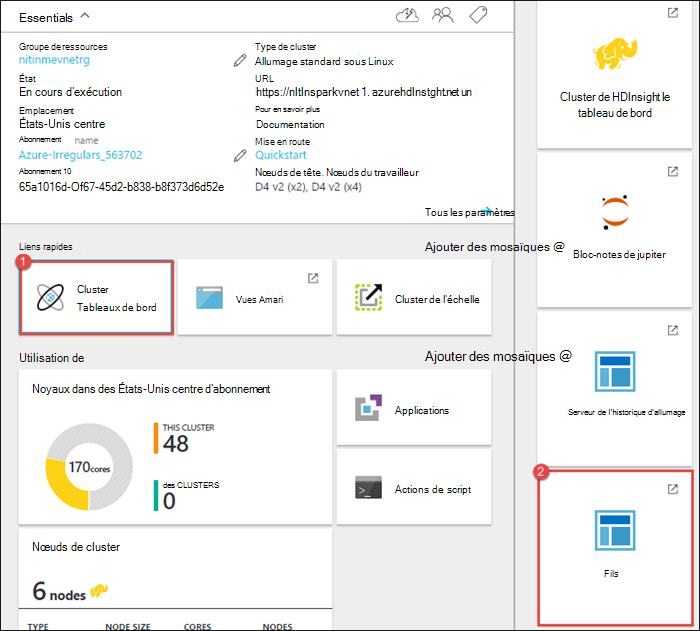
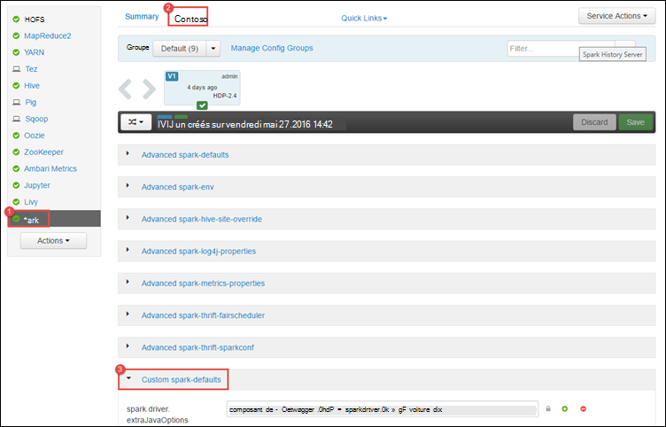
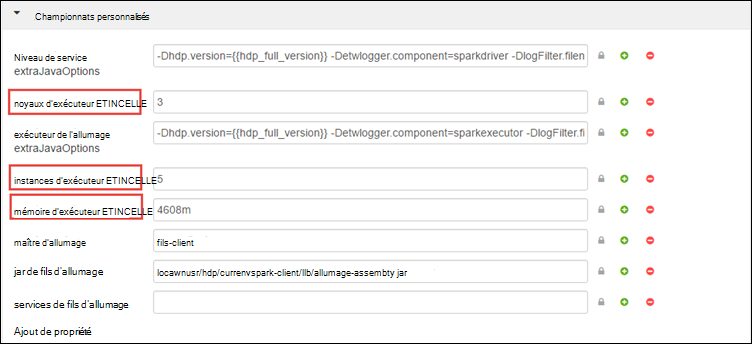
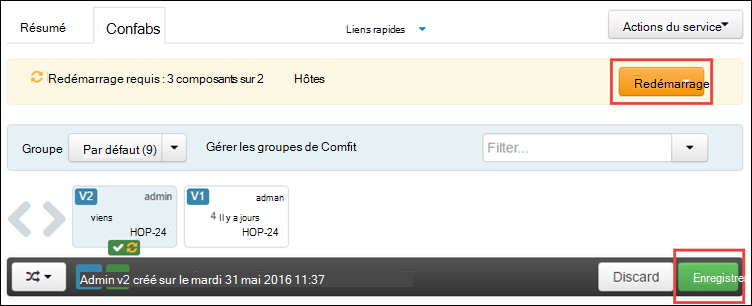
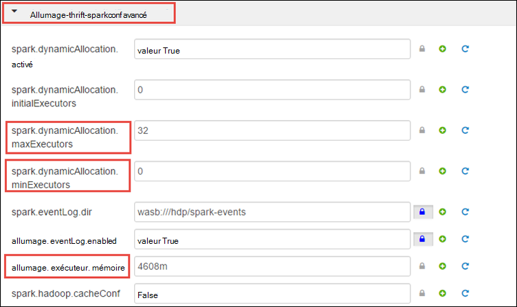
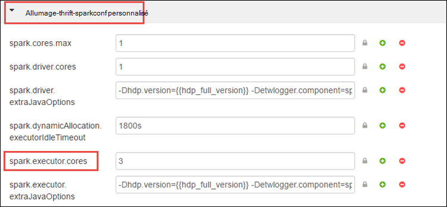
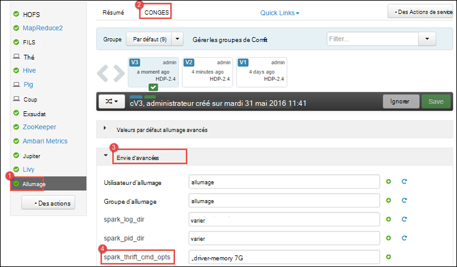
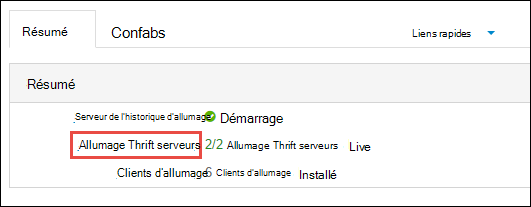
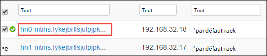
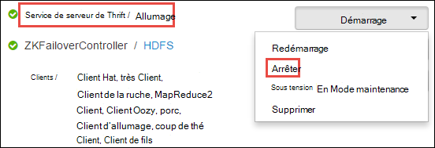

<properties 
    pageTitle="Utilisez le Gestionnaire de ressources à allouer des ressources pour le cluster Apache étincelle dans HDInsight | Microsoft Azure" 
    description="Apprenez à utiliser le Gestionnaire de ressources pour les clusters d’allumage sur HDInsight pour améliorer les performances." 
    services="hdinsight" 
    documentationCenter="" 
    authors="nitinme" 
    manager="jhubbard" 
    editor="cgronlun"
    tags="azure-portal"/>

<tags 
    ms.service="hdinsight" 
    ms.workload="big-data" 
    ms.tgt_pltfrm="na" 
    ms.devlang="na" 
    ms.topic="article" 
    ms.date="08/25/2016" 
    ms.author="nitinme"/>

# Gérer les ressources pour le cluster d’allumage d’Apache sur HDInsight Linux

Dans cet article, vous apprendrez comment accéder aux interfaces comme Ambari UI, interface utilisateur fils, et le serveur de l’historique d’allumage associé à votre cluster allumage. Vous allez également découvrir comment régler la configuration du cluster pour des performances optimales.

**Conditions préalables :**

Vous devez disposer des éléments suivants :

- Un abonnement Azure. Consultez [Azure d’obtenir la version d’évaluation gratuite](https://azure.microsoft.com/documentation/videos/get-azure-free-trial-for-testing-hadoop-in-hdinsight/).
- Un cluster d’allumage d’Apache sur HDInsight Linux. Pour obtenir des instructions, consultez [créer un allumage Apache des clusters dans Azure HDInsight](hdinsight-apache-spark-jupyter-spark-sql.md).

## Comment pour lancer l’interface utilisateur Web de Ambari ?

1. À partir du [Portail Azure](https://portal.azure.com/), à partir de la startboard, cliquez sur la mosaïque pour votre cluster allumage (si vous l’épinglé à la startboard). Vous pouvez également accéder à votre cluster sous **Parcourir tous les** > **HDInsight Clusters**. 
 
2. À partir de la blade de cluster étincelle, cliquez sur **tableau de bord**. Lorsque vous y êtes invité, entrez les informations d’identification d’administration pour le cluster d’allumage.

    ![Lancement de Ambari] (./media/hdinsight-apache-spark-resource-manager/hdispark.cluster.launch.dashboard.png "Démarrez le Gestionnaire des ressources")

3. Cela doit lancer l’interface utilisateur Web de Ambari, comme illustré ci-dessous.

    ![Interface utilisateur Web de Ambari] (./media/hdinsight-apache-spark-resource-manager/ambari-web-ui.png "Interface utilisateur Web de Ambari")   

## Comment lancer le serveur de l’historique d’allumage ?

1. À partir du [Portail Azure](https://portal.azure.com/), à partir de la startboard, cliquez sur la mosaïque pour votre cluster allumage (si vous l’épinglé à la startboard).

2. À partir de la blade de cluster, sous **Liens rapides**, cliquez sur **Tableau de bord de Cluster**. De la lame de **Tableau de bord de Cluster** , cliquez sur **Le serveur de l’historique étincelle**.

    ![Serveur de l’historique d’allumage] (./media/hdinsight-apache-spark-resource-manager/launch-history-server.png "Serveur de l’historique d’allumage")

    Lorsque vous y êtes invité, entrez les informations d’identification d’administration pour le cluster d’allumage.

## Comment pour lancer l’interface utilisateur de fils ?

Vous pouvez utiliser l’interface utilisateur de fils pour surveiller les applications en cours d’exécution sur le cluster d’allumage. 

1. À partir de la blade de cluster, cliquez sur le **Tableau de bord de Cluster**, puis cliquez sur **fils**.

    

    >[AZURE.TIP] Sinon, vous pouvez également lancer l’interface utilisateur de fils à partir de la Ambari UI. Pour lancer l’UI Ambari, à partir de la blade de cluster, cliquez sur le **Tableau de bord de Cluster**, puis cliquez sur **Tableau de bord de Cluster HDInsight**. À partir de la Ambari UI, cliquez sur des **fils**et cliquez sur **Liens rapides**, cliquez sur le Gestionnaire de ressources active, puis cliquez sur **L’interface utilisateur de ResourceManager**.

## Quelle est la configuration de cluster optimales pour exécuter des applications d’allumage ?

Les trois paramètres de clé qui peuvent être utilisés pour la configuration d’allumage en fonction des besoins de l’application sont `spark.executor.instances`, `spark.executor.cores`, et `spark.executor.memory`. Un exécuteur est un processus de lancement pour une application d’allumage. Il s’exécute sur le nœud de travailleur et est chargé d’effectuer les tâches de l’application. Le nombre par défaut des exécuteurs et les tailles de l’exécuteur pour chaque cluster est calculé en fonction du nombre de nœuds du travailleur et la taille du nœud travail. Ces fichiers sont stockés dans `spark-defaults.conf` sur les nœuds du cluster principal. 

Les paramètres de configuration de trois peuvent être configurés au niveau du cluster (pour toutes les applications qui s’exécutent sur le cluster) ou peuvent être spécifiés pour chaque application ainsi.

### Modifier les paramètres à l’aide de Ambari UI

1. À partir de l’UI Ambari cliquez sur **étincelle**et cliquez sur **configurations**puis développez **allumage-valeurs par défaut personnalisées**.

    

2. Les valeurs par défaut conviennent d’allumage 4 applications s’exécutent simultanément sur le cluster. Vous pouvez les modifications ces valeurs à partir de l’interface utilisateur, comme illustré ci-dessous.

    

3. Cliquez sur **Enregistrer** pour enregistrer les modifications de configuration. En haut de la page, vous devrez redémarrer tous les services concernés. Cliquez sur **redémarrer**.

    

### Modifiez les paramètres d’une application s’exécutant dans le carnet de Jupyter

Pour les applications en cours d’exécution dans le bloc-notes de Jupyter, vous pouvez utiliser la `%%configure` magique pour apporter les modifications de configuration. Dans l’idéal, vous devez effectuer ces changements au début de l’application, avant d’exécuter votre première cellule du code. Cela garantit que la configuration est appliquée à la session Livy, lorsque celui-ci est créé. Si vous souhaitez modifier la configuration à un stade ultérieur dans l’application, vous devez utiliser le `-f` paramètre. Toutefois, en ce faisant, tous les cours de l’application seront perdues.

L’extrait de code ci-dessous montre comment modifier la configuration d’une application en cours d’exécution dans Jupyter.

    %%configure 
    {"executorMemory": "3072M", "executorCores": 4, “numExecutors”:10}

Paramètres de configuration doivent être passés comme une chaîne au format JSON et doivent se trouver sur la ligne suivante après la magie, comme indiqué dans la colonne de l’exemple. 

### Modification d’allumage-soumettre les paramètres d’une application soumise à l’aide de

Commande suivante est un exemple de la façon de modifier les paramètres de configuration pour une application de traitement par lots qui est soumis à l’aide de `spark-submit`.

    spark-submit --class <the application class to execute> --executor-memory 3072M --executor-cores 4 –-num-executors 10 <location of application jar file> <application parameters>

### Modifiez les paramètres d’une application soumise à l’aide de roulage

Commande suivante est un exemple de la façon de modifier les paramètres de configuration pour une application de traitement par lots qui est soumis à l’aide à l’aide de roulage.

    curl -k -v -H 'Content-Type: application/json' -X POST -d '{"file":"<location of application jar file>", "className":"<the application class to execute>", "args":[<application parameters>], "numExecutors":10, "executorMemory":"2G", "executorCores":5' localhost:8998/batches

### Comment modifier ces paramètres sur un serveur de Thrift étincelle ?

Allumage Thrift Server fournit un accès JDBC/ODBC à un cluster d’allumage et est utilisé pour les requêtes SQL de l’allumage du service. Outils tels que l’alimentation BI, etc. du Tableau. Utilisez le protocole ODBC pour communiquer avec le serveur de Thrift allumage pour exécuter des requêtes d’allumage SQL sous la forme d’une Application d’allumage. Lors de la création d’un cluster d’allumage, deux instances du serveur Thrift étincelle sont démarrés, un sur chaque nœud de tête. Chaque serveur de Thrift étincelle apparaît sous la forme d’une application d’étincelle dans l’interface utilisateur de fils. 

Allumage Thrift Server utilise l’allocation d’exécuteur dynamique d’allumage et, par conséquent, le `spark.executor.instances` n’est pas utilisé. Au lieu de cela, allumage Thrift Server utilise `spark.dynamicAllocation.minExecutors` et `spark.dynamicAllocation.maxExecutors` pour spécifier le nombre de l’exécuteur. Les paramètres de configuration `spark.executor.cores` et `spark.executor.memory` est utilisé pour modifier la taille de l’exécuteur. Vous pouvez modifier ces paramètres comme indiqué ci-dessous.

* Développez la catégorie **Avancé allumage-thrift-sparkconf** pour mettre à jour les paramètres de le `spark.dynamicAllocation.minExecutors`, `spark.dynamicAllocation.maxExecutors`, et `spark.executor.memory`.

     

* Développez la catégorie **personnalisée allumage-thrift-sparkconf** pour mettre à jour le paramètre `spark.executor.cores`.

    

### Comment modifier la mémoire du pilote du serveur Thrift étincelle ?

Mémoire de conducteur d’allumage Thrift Server est configuré pour 25 % de la taille de RAM du nœud de tête, à condition que la taille totale de la mémoire RAM du nœud principal est supérieure à 14 Go. Vous pouvez utiliser la Ambari UI pour modifier la configuration de mémoire du pilote, comme indiqué ci-dessous.

* À partir de l’UI Ambari cliquez sur **étincelle**et cliquez sur **configurations**, développez **avancée d’allumage-env**, puis fournir la valeur de **spark_thrift_cmd_opts**.

    

## Je n’utilise pas de BI avec cluster d’allumage. Comment reprendre les ressources ?

Dans la mesure où nous utilisons allocation dynamique d’allumage, les seules ressources qui sont consommées par serveur de thrift sont les ressources pour les masques des deux applications. Pour libérer ces ressources, vous devez arrêter les services Thrift serveur s’exécutant sur le cluster.

1. À partir de la Ambari UI, dans le volet gauche, cliquez sur **allumage**.

2. Dans la page suivante, cliquez sur **Serveurs de Thrift allumage**.

    

3. Vous devez voir les deux headnodes sur lequel le serveur Thrift étincelle s’exécute. Cliquez sur le headnodes.

    

4. La page suivante répertorie tous les services en cours d’exécution sur ce headnode. Dans la liste cliquez sur le bouton de liste déroulante en regard de l’allumage Thrift serveur, puis cliquez sur **Arrêter**.

    

5. Répétez ces étapes pour l’autre headnode.

## Mes blocs-notes Jupyter ne s’exécutent pas comme prévu. Comment puis-je pour redémarrer le service ?

1. Lancer l’interface utilisateur Web de Ambari comme indiqué ci-dessus. Dans le volet de navigation de gauche, cliquez sur **Jupyter**, cliquez sur **Actions du Service**, puis cliquez sur **Redémarrer tous les**. Ceci démarrera le service Jupyter sur tous les headnodes.

    ![Redémarrez Jupyter] (./media/hdinsight-apache-spark-resource-manager/restart-jupyter.png "Redémarrez Jupyter")

    

## Voir aussi

* [Vue d’ensemble : Allumage commandé de Apache sur Azure HDInsight](hdinsight-apache-spark-overview.md)

### Scénarios

* [Allumage avec BI : effectuer l’analyse interactive des données à l’aide d’étincelle dans HDInsight avec les outils d’analyse Décisionnelle](hdinsight-apache-spark-use-bi-tools.md)

* [Allumage avec apprentissage automatique : allumage d’utilisation dans les HDInsight d’analyse de température de construction à l’aide des données HVAC](hdinsight-apache-spark-ipython-notebook-machine-learning.md)

* [Allumage avec apprentissage automatique : allumage utilisation de HDInsight pour prédire les résultats de l’inspection alimentaires](hdinsight-apache-spark-machine-learning-mllib-ipython.md)

* [Diffusion en continu de l’allumage : Allumage d’utilisation dans HDInsight pour générer des applications de diffusion en continu en temps réel](hdinsight-apache-spark-eventhub-streaming.md)

* [Analyse de journal de site Web à l’aide d’étincelle dans HDInsight](hdinsight-apache-spark-custom-library-website-log-analysis.md)

### Créer et exécuter des applications

* [Créez une application autonome à l’aide de Scala](hdinsight-apache-spark-create-standalone-application.md)

* [Exécuter des tâches à distance sur un cluster d’allumage à l’aide de Livy](hdinsight-apache-spark-livy-rest-interface.md)

### Outils et extensions

* [Plug-in d’outils HDInsight idée de IntelliJ permet de créer et soumettre des applications d’allumage Scala](hdinsight-apache-spark-intellij-tool-plugin.md)

* [Plug-in d’outils HDInsight IntelliJ idée permet de déboguer des applications d’allumage commandé à distance](hdinsight-apache-spark-intellij-tool-plugin-debug-jobs-remotely.md)

* [Utilisez les portables Zeppelin avec un cluster d’allumage sur HDInsight](hdinsight-apache-spark-use-zeppelin-notebook.md)

* [Noyaux disponibles pour le cluster d’allumage pour HDInsight ordinateur portable Jupyter](hdinsight-apache-spark-jupyter-notebook-kernels.md)

* [Utilisez les lots externes avec les ordinateurs portables de Jupyter](hdinsight-apache-spark-jupyter-notebook-use-external-packages.md)

* [Installez Jupyter sur votre ordinateur et vous connecter à un cluster HDInsight Spark](hdinsight-apache-spark-jupyter-notebook-install-locally.md)

### Gestion des ressources

* [Tâches de suivi et de débogage en cours d’exécution sur un cluster Apache étincelle dans HDInsight](hdinsight-apache-spark-job-debugging.md)

[hdinsight-versions]: hdinsight-component-versioning.md
[hdinsight-upload-data]: hdinsight-upload-data.md
[hdinsight-storage]: hdinsight-hadoop-use-blob-storage.md

[azure-purchase-options]: http://azure.microsoft.com/pricing/purchase-options/
[azure-member-offers]: http://azure.microsoft.com/pricing/member-offers/
[azure-free-trial]: http://azure.microsoft.com/pricing/free-trial/
[azure-management-portal]: https://manage.windowsazure.com/
[azure-create-storageaccount]: storage-create-storage-account.md 
