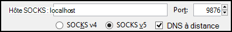
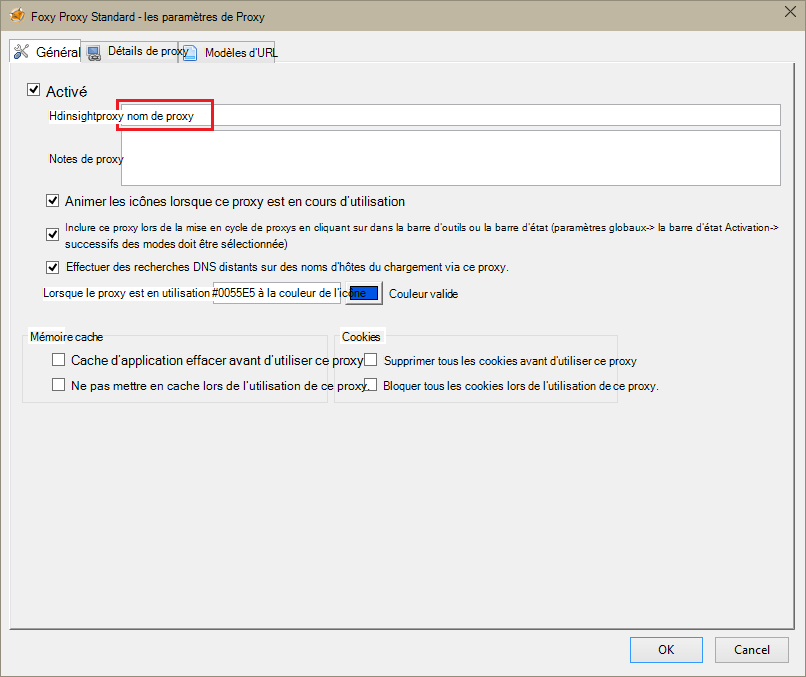
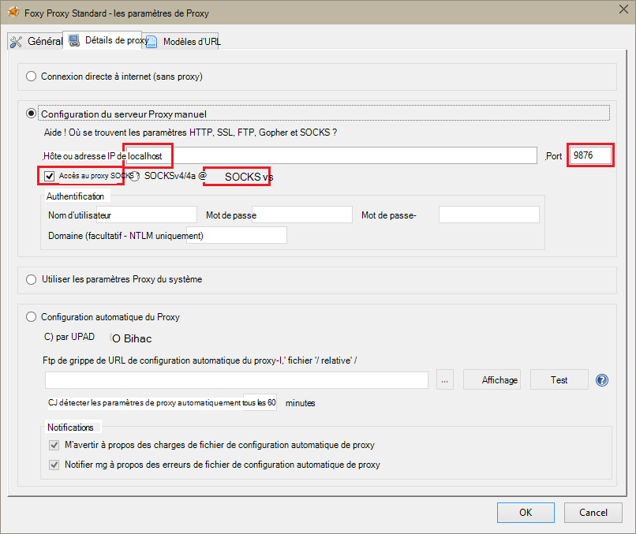
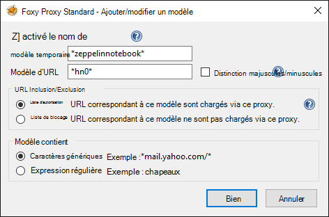
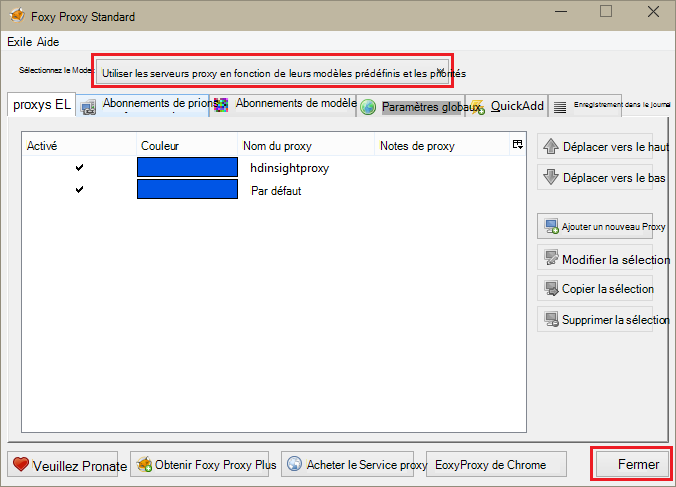

<properties 
    pageTitle="Installer des portables Zeppelin pour cluster d’allumage d’Apache sous Linux de HDInsight | Microsoft Azure" 
    description="Instructions détaillées sur la façon d’installer et d’utiliser les portables Zeppelin avec les clusters d’allumage sur HDInsight Linux." 
    services="hdinsight" 
    documentationCenter="" 
    authors="nitinme" 
    manager="jhubbard" 
    editor="cgronlun"/>

<tags 
    ms.service="hdinsight" 
    ms.workload="big-data" 
    ms.tgt_pltfrm="na" 
    ms.devlang="na" 
    ms.topic="article" 
    ms.date="10/28/2016" 
    ms.author="nitinme"/>

# Installer des portables Zeppelin pour cluster d’allumage d’Apache sur HDInsight Linux

Apprenez comment installer des ordinateurs portables de Zeppelin sur les clusters de l’allumage d’Apache et à utiliser les portables Zeppelin pour exécuter des tâches d’allumage.

> [AZURE.IMPORTANT] Les ordinateurs portables Zeppelin sont disponibles par défaut avec les clusters de l’allumage. Vous n’avez pas besoin d’explicitement les installer sur un cluster d’allumage plus. Pour plus d’informations, consultez [utilisation Zeppelin équipés d’allumage d’Apache cluster sur Linux de HDInsight](hdinsight-apache-spark-zeppelin-notebook.md). 

**Conditions préalables :**

* Avant de commencer ce didacticiel, vous devez posséder un abonnement Azure. Consultez [Azure d’obtenir la version d’évaluation gratuite](https://azure.microsoft.com/documentation/videos/get-azure-free-trial-for-testing-hadoop-in-hdinsight/).
* Un cluster d’allumage d’Apache. Pour obtenir des instructions, consultez [créer un allumage Apache des clusters dans Azure HDInsight](hdinsight-apache-spark-jupyter-spark-sql.md).
* Un client SSH. Pour les distributions de Linux et Unix ou Macintosh OS X, la `ssh` commande est fourni avec le système d’exploitation. Pour Windows, nous vous recommandons de [PuTTY](http://www.chiark.greenend.org.uk/~sgtatham/putty/download.html)

    > [AZURE.NOTE] Si vous souhaitez utiliser un client SSH autres que `ssh` ou PuTTY, veuillez consulter la documentation de votre client sur la façon d’établir un tunnel SSH.

* Un navigateur web qui peut être configuré pour utiliser un proxy SOCKS

* __(facultatif)__: un plug-in comme [FoxyProxy](http://getfoxyproxy.org/,) qui peut appliquer des règles qui acheminent uniquement les requêtes spécifiques à travers le tunnel.

    > [AZURE.WARNING] Sans un plug-in, tels que FoxyProxy, toutes les demandes adressées par l’intermédiaire de l’Explorateur peuvent être routés à travers le tunnel. Cela peut entraîner un chargement plus lent des pages web dans votre navigateur.

## Installer Zeppelin sur un cluster d’allumage

Vous pouvez installer Zeppelin sur un cluster d’allumage à l’aide des actions de script. Action de script utilise des scripts personnalisés pour installer des composants sur le cluster qui ne sont pas disponibles par défaut. Vous pouvez utiliser le script personnalisé pour installer Zeppelin à partir du portail Azure, à l’aide du Kit de développement .NET HDInsight, ou à l’aide de PowerShell d’Azure. Vous pouvez utiliser le script d’installation Zeppelin soit dans le cadre de la création du cluster, ou une fois que le cluster est en cours d’exécution. Liens dans les sections ci-dessous fournissent des instructions sur la procédure à suivre. 

### L’utilisation du portail Azure

Pour obtenir des instructions sur l’utilisation du portail Azure pour exécuter l’action de script installer Zeppelin, voir [clusters de HDInsight de personnaliser à l’aide des actions de Script](hdinsight-hadoop-customize-cluster-linux.md#use-a-script-action-from-the-azure-portal). Vous devez apporter quelques modifications pour les instructions de cet article.

* Vous devez utiliser le script d’installation Zeppelin. Le script personnalisé pour installer Zeppelin sur un cluster d’allumage sur HDInsight est disponible à partir des liens suivants :
    * Pour les clusters de l’allumage 1.6.0-`https://hdiconfigactions.blob.core.windows.net/linuxincubatorzeppelinv01/install-zeppelin-spark160-v01.sh`
    * Pour les clusters de l’allumage 1.5.2-`https://hdiconfigactions.blob.core.windows.net/linuxincubatorzeppelinv01/install-zeppelin-spark151-v01.sh`

* Vous devez exécuter l’action du script uniquement sur le headnode.

* Le script n’a pas besoin des paramètres. 

### À l’aide du Kit de développement .NET HDInsight

Pour obtenir des instructions sur l’utilisation du Kit de développement .NET HDInsight pour exécuter l’action de script installer Zeppelin, voir [clusters de HDInsight de personnaliser à l’aide des actions de Script](hdinsight-hadoop-customize-cluster-linux.md#use-a-script-action-from-the-hdinsight-net-sdk). Vous devez apporter quelques modifications pour les instructions de cet article.

* Vous devez utiliser le script d’installation Zeppelin. Le script personnalisé pour installer Zeppelin sur un cluster d’allumage sur HDInsight est disponible à partir des liens suivants :
    * Pour les clusters de l’allumage 1.6.0-`https://hdiconfigactions.blob.core.windows.net/linuxincubatorzeppelinv01/install-zeppelin-spark160-v01.sh`
    * Pour les clusters de l’allumage 1.5.2-`https://hdiconfigactions.blob.core.windows.net/linuxincubatorzeppelinv01/install-zeppelin-spark151-v01.sh`

* Le script n’a pas besoin des paramètres. 

* Définir le type de cluster que vous créez à étincelle.

### À l’aide de PowerShell Azure

L’extrait de code PowerShell suivant permet de créer un cluster de l’allumage sur HDInsight Linux avec Zeppelin installé. Selon la version de cluster étincelle vous avez, vous devez mettre à jour l’extrait de code PowerShell ci-dessous pour inclure le lien vers le script personnalisé correspondant. 

* Pour les clusters de l’allumage 1.6.0-`https://hdiconfigactions.blob.core.windows.net/linuxincubatorzeppelinv01/install-zeppelin-spark160-v01.sh`
* Pour les clusters de l’allumage 1.5.2-`https://hdiconfigactions.blob.core.windows.net/linuxincubatorzeppelinv01/install-zeppelin-spark151-v01.sh`

[AZURE.INCLUDE [upgrade-powershell](../../includes/hdinsight-use-latest-powershell.md)]

    Login-AzureRMAccount
    
    # PROVIDE VALUES FOR THE VARIABLES
    $clusterAdminUsername="admin"
    $clusterAdminPassword="<<password>>"
    $clusterSshUsername="adminssh"
    $clusterSshPassword="<<password>>"
    $clusterName="<<clustername>>"
    $clusterContainerName=$clusterName
    $resourceGroupName="<<resourceGroupName>>"
    $location="<<region>>"
    $storage1Name="<<storagename>>"
    $storage1Key="<<storagekey>>"
    $subscriptionId="<<subscriptionId>>"
    
    Select-AzureRmSubscription -SubscriptionId $subscriptionId
    
    $passwordAsSecureString=ConvertTo-SecureString $clusterAdminPassword -AsPlainText -Force
    $clusterCredential=New-Object System.Management.Automation.PSCredential ($clusterAdminUsername, $passwordAsSecureString)
    $passwordAsSecureString=ConvertTo-SecureString $clusterSshPassword -AsPlainText -Force
    $clusterSshCredential=New-Object System.Management.Automation.PSCredential ($clusterSshUsername, $passwordAsSecureString)
    
    $azureHDInsightConfigs= New-AzureRmHDInsightClusterConfig -ClusterType Spark
    $azureHDInsightConfigs.DefaultStorageAccountKey = $storage1Key
    $azureHDInsightConfigs.DefaultStorageAccountName = "$storage1Name.blob.core.windows.net"
    
    Add-AzureRMHDInsightScriptAction -Config $azureHDInsightConfigs -Name "Install Zeppelin" -NodeType HeadNode -Parameters "void" -Uri "https://hdiconfigactions.blob.core.windows.net/linuxincubatorzeppelinv01/install-zeppelin-spark151-v01.sh"
    
    New-AzureRMHDInsightCluster -Config $azureHDInsightConfigs -OSType Linux -HeadNodeSize "Standard_D12" -WorkerNodeSize "Standard_D12" -ClusterSizeInNodes 2 -Location $location -ResourceGroupName $resourceGroupName -ClusterName $clusterName -HttpCredential $clusterCredential -DefaultStorageContainer $clusterContainerName -SshCredential $clusterSshCredential -Version "3.3"
 
## Configuration SSH tunneling pour accéder à un ordinateur portable de Zeppelin

Vous allez utiliser SSH tunnels à accéder les portables Zeppelin s’exécutant sur le cluster d’allumage sur HDInsight Linux. Les étapes ci-dessous montrent comment créer un tunnel SSH à l’aide de ssh PuTTY (Windows) et la ligne de commande (Linux).

### Créer un tunnel à l’aide de la commande SSH (Linux)

Utilisez la commande suivante pour créer un SSH du tunnel à l’aide de la `ssh` commande. Remplacez le __nom d’utilisateur__ avec un utilisateur SSH pour votre cluster HDInsight et __NOM_CLUSTER__ avec le nom de votre cluster HDInsight

    ssh -C2qTnNf -D 9876 USERNAME@CLUSTERNAME-ssh.azurehdinsight.net

Cette opération crée une connexion qui achemine le trafic vers un port local 9876 au cluster via SSH. Les options sont les suivantes :

* **D 9876** - le port local qui achemine le trafic via le tunnel.

* **C** - compresser toutes les données, car le trafic web est principalement du texte.

* **2** - force SSH pour essayer la version 2 du protocole.

* **q** - mode silencieux.

* **T** - allocation de pseudo-tty désactiver, dans la mesure où nous transmettons vos simplement d’un port.

* **n** - empêcher la lecture de STDIN, étant donné que nous transmettons vos simplement d’un port.

* **N** - ne s’exécutent pas une commande à distance, dans la mesure où nous transmettons vos simplement d’un port.

* **f** - exécuter en arrière-plan.

Si vous avez configuré le cluster avec un code SSH, vous devrez peut-être utiliser le `-i` paramètre et spécifiez le chemin d’accès à la clé privée de SSH.

Une fois la commande terminée, le trafic envoyé à port 9876 sur l’ordinateur local sera routée via SSL Secure Sockets Layer () sur le cluster nœud de tête et semblent provenir il.

### Créer un tunnel à l’aide de PuTTY (Windows)

Utilisez les étapes suivantes pour créer un tunnel SSH à l’aide de PuTTY.

1. Ouvrez PuTTY et entrez vos informations de connexion. Si vous n’êtes pas familiarisé avec PuTTY, consultez [Utiliser SSH avec basé sur Linux d’Hadoop sur HDInsight à partir de Windows](hdinsight-hadoop-linux-use-ssh-windows.md) pour plus d’informations sur la façon de l’utiliser avec HDInsight.

2. Dans la section **catégories** , à gauche de la boîte de dialogue, développez la **connexion**et développez le **SSH**puis sélectionnez **Tunnels**.

3. Sur l’écran des **Options de contrôle de réacheminement de port SSH** , fournissez les informations suivantes :

    * **Port source** : le port sur le client que vous souhaitez transférer. Par exemple, **9876**.

    * Adresse de **destination** - le SSH pour le cluster HDInsight de fonctionnant sous Linux. Par exemple, **mon_cluster-ssh.azurehdinsight.net**.

    * **Dynamique** - proxy SOCKS dynamique permet le routage.

    

4. Cliquez sur **Ajouter** pour ajouter les paramètres, puis cliquez sur **Ouvrir** pour ouvrir une connexion SSH.

5. Lorsque vous y êtes invité, ouvrez une session sur le serveur. Vous établissez une session SSH et activer le tunnel.

### Utiliser le tunnel à partir de votre navigateur

> [AZURE.NOTE] Les étapes de cette section utilisent le navigateur FireFox, comme il est disponible gratuitement pour les systèmes Linux, Unix, Macintosh OS X et Windows. Autres navigateurs modernes tels que Google Chrome, Microsoft Edge ou Apple Safari devraient fonctionner aussi bien ; Toutefois, le plug-in FoxyProxy utilisé dans certaines étapes ne soient pas disponible pour tous les navigateurs.

1. Configurer le navigateur pour utiliser **localhost:9876** comme un proxy **SOCKS v5** . Voici à quoi ressemblent les paramètres Firefox. Si vous avez utilisé un port autre que 9876, modifiez le port à celui que vous avez utilisé :

    

    > [AZURE.NOTE] Sélection **à distance DNS** résout les demandes de système de nom de domaine (DNS) en utilisant le cluster HDInsight. Si ce n’est pas cochée, DNS seront résolues localement.

2. Vérifiez que le trafic est routé via le tunnel en vising un site tel que [http://www.whatismyip.com/](http://www.whatismyip.com/) avec les paramètres de proxy activé et désactivé dans Firefox. Alors que les paramètres sont activés, l’adresse IP sera pour un ordinateur dans le centre de données Microsoft Azure.

### Extensions du navigateur

Lors de la configuration du navigateur pour utiliser le tunnel fonctionne, vous souhaitez généralement acheminer tout le trafic via le tunnel. Les extensions de navigateur, tels que [FoxyProxy](http://getfoxyproxy.org/) prend en charge les critères spéciaux pour les demandes d’URL (FoxyProxy Standard ou TechNet Plus uniquement), de sorte que seules les demandes d’URL spécifiques seront envoyées via le tunnel.

Si vous avez installé FoxyProxy Standard, procédez comme suit pour le configurer pour ne transférer le trafic de HDInsight via le tunnel.

1. Ouvrez l’extension FoxyProxy dans votre navigateur. Par exemple, dans Firefox, sélectionnez l’icône de FoxyProxy à côté du champ d’adresse.

    

2. Sélectionnez **Ajouter un nouveau Proxy**et sélectionnez l’onglet **Général** , puis entrez un nom de proxy de **HDInsightProxy**.

    

3. Sélectionnez l’onglet **Détails de Proxy** et de remplir les champs suivants :

    * **Hôte ou adresse IP** - c’est localhost, puisque nous utilisons un tunnel SSH sur l’ordinateur local.

    * **Port** : c’est le port que vous avez utilisée pour le tunnel SSH.

    * **Proxy SOCKS** - Sélectionnez cette option pour activer le navigateur à utiliser le tunnel en tant que proxy.

    * **SOCKS v5** - Sélectionnez cette option pour définir la version requise pour le serveur proxy.

    

4. Sélectionnez l’onglet **Modèles d’URL** et sélectionnez **Ajouter un nouveau modèle**. Utilisez la suivante pour définir le modèle, puis cliquez sur **OK**:

    * **Nom de modèle** - **zeppelinnotebook** - il s’agit d’un nom convivial pour le modèle.

    * **Modèle d’URL** - **\*hn0** * - définit un modèle qui correspond au nom de domaine complet interne du point de terminaison où les portables Zeppelin sont hébergées. Dans la mesure où les portables Zeppelin sont disponibles uniquement sur les headnode0 du cluster, et le point de terminaison est généralement `http://hn0-<string>.internal.cloudapp.net`, à l’aide du modèle * *hn0** qui garantisse que la demande est redirigée vers le point de terminaison Zeppelin.

        

4. Cliquez sur **OK** pour ajouter le serveur proxy et de fermer les **Paramètres de Proxy**.

5. En haut de la boîte de dialogue FoxyProxy, passer **En Mode de sélectionnez** **proxy d’utilisation en fonction de leurs modèles prédéfinis et les priorités**, puis cliquez sur **Fermer**.

    

Après avoir suivi ces étapes, seules les demandes d’URL contenant la chaîne __hn0__ seront acheminées via le tunnel SSL. 

## Accéder à l’ordinateur portable Zeppelin

Une fois que vous avez SSH tunneling d’installation, vous pouvez utiliser les étapes suivantes d’accéder à Zeppelin bloc-notes sur le cluster d’allumage en suivant les étapes ci-dessous. Dans cette section, vous allez apprendre à exécuter % sql et instructions de ruche %.

1. À partir du navigateur web, ouvrez le point de terminaison suivant :

        http://hn0-myspar:9995

    * **hn0** indique headnode0
    * **myspar** est les six premières lettres du nom de cluster d’allumage.
    * **9995** est le port sur lequel le bloc-notes de Zeppelin est accessible.

2. Créer un nouveau bloc-notes. Dans le volet d’en-tête, cliquez sur **bloc-notes**, puis cliquez sur **Créer une Note**.

    ![Créer un nouveau bloc-notes Zeppelin] (./media/hdinsight-apache-spark-use-zeppelin-notebook/hdispark.createnewnote.png "Créer un nouveau bloc-notes Zeppelin")

    Sur la même page, sous le titre du **bloc-notes** , vous devez voir un nouveau bloc-notes avec le nom commençant par **Note XXXXXXXXX**. Cliquez sur le nouvel ordinateur portable.

3. Sur la page web pour le nouvel ordinateur portable, cliquez sur l’en-tête et modifier le nom de l’ordinateur portable si vous le souhaitez. Appuyez sur ENTRÉE pour enregistrer le changement de nom. Assurez-vous également que l’en-tête de l’ordinateur portable affiche l’état **connecté** dans le coin supérieur droit.

    ![État des blocs-notes Zeppelin] (./media/hdinsight-apache-spark-use-zeppelin-notebook/hdispark.newnote.connected.png "État des blocs-notes Zeppelin")

### Exécutez les instructions SQL

4. Charger des exemples de données dans une table temporaire. Lorsque vous créez un cluster d’étincelle dans HDInsight, l’exemple de fichier de données, **hvac.csv**, est copié dans le compte de stockage associé sous **\HdiSamples\SensorSampleData\hvac**.

    Dans le paragraphe vide qui est créé par défaut dans le bloc-notes, collez l’extrait de code suivant.

        // Create an RDD using the default Spark context, sc
        val hvacText = sc.textFile("wasbs:///HdiSamples/HdiSamples/SensorSampleData/hvac/HVAC.csv")
        
        // Define a schema
        case class Hvac(date: String, time: String, targettemp: Integer, actualtemp: Integer, buildingID: String)
        
        // Map the values in the .csv file to the schema
        val hvac = hvacText.map(s => s.split(",")).filter(s => s(0) != "Date").map(
            s => Hvac(s(0), 
                    s(1),
                    s(2).toInt,
                    s(3).toInt,
                    s(6)
            )
        ).toDF()
        
        // Register as a temporary table called "hvac"
        hvac.registerTempTable("hvac")
        
    Appuyez sur **MAJ + ENTRÉE** ou cliquez sur le bouton **lecture** du paragraphe exécuter l’extrait de code. L’état dans le coin droit du paragraphe doit progresser de prêt, en attente, en cours d’exécution à terminé. La sortie s’affiche au bas du même paragraphe. La capture d’écran ressemble à ceci :

    ![Créer une table temporaire à partir des données brutes] (./media/hdinsight-apache-spark-use-zeppelin-notebook/hdispark.note.loaddDataintotable.png "Créer une table temporaire à partir des données brutes")

    Vous pouvez également fournir un titre pour chaque paragraphe. À partir de la droite, cliquez sur l’icône de **paramètres** , puis cliquez sur **Afficher le titre**.

5. Vous pouvez maintenant exécuter les instructions SQL d’allumage de la table **hvac** . Collez la requête suivante dans un nouveau paragraphe. La requête récupère l’ID de bâtiment et de la différence entre la cible et les températures réelles pour chaque bâtiment à une date donnée. Appuyez sur **MAJ + ENTRÉE**.

        %sql
        select buildingID, (targettemp - actualtemp) as temp_diff, date 
        from hvac
        where date = "6/1/13" 

    L’instruction **sql de %** au début indique à l’ordinateur portable à utiliser l’interpréteur SQL d’allumage. Vous pouvez consulter les interpréteurs définis à partir de l’onglet **interpréteur** dans l’en-tête de l’ordinateur portable.

    La capture d’écran suivante affiche la sortie.

    ![Exécution d’une instruction SQL de l’explosion à l’aide de l’ordinateur portable] (./media/hdinsight-apache-spark-use-zeppelin-notebook/hdispark.note.sparksqlquery1.png "Exécution d’une instruction SQL de l’explosion à l’aide de l’ordinateur portable")

     Cliquez sur les options d’affichage (mis en surbrillance dans le rectangle) pour basculer entre les représentations différentes pour la même sortie. Cliquez sur **paramètres** pour choisir quelles constitue la clé et les valeurs dans la sortie. La capture d’écran ci-dessus utilise **buildingID** comme clé et la moyenne de **temp_diff** comme valeur.

    
6. Vous pouvez également exécuter des instructions SQL d’allumage à l’aide de variables dans la requête. L’extrait de code suivant montre comment définir une variable **temporaire**, de la requête avec les valeurs possibles que vous souhaitez interroger avec. Lorsque vous exécutez la requête pour la première fois, une liste déroulante est remplie automatiquement avec les valeurs que vous avez spécifié pour la variable.

        %sql
        select buildingID, date, targettemp, (targettemp - actualtemp) as temp_diff
        from hvac
        where targettemp > "${Temp = 65,65|75|85}" 

    Coller cet extrait de code dans un nouveau paragraphe et appuyez sur **MAJ + ENTRÉE**. La capture d’écran suivante affiche la sortie.

    ![Exécution d’une instruction SQL de l’explosion à l’aide de l’ordinateur portable] (./media/hdinsight-apache-spark-use-zeppelin-notebook/hdispark.note.sparksqlquery2.png "Exécution d’une instruction SQL de l’explosion à l’aide de l’ordinateur portable")

    Pour les requêtes ultérieures, vous pouvez sélectionner une nouvelle valeur dans la liste déroulante et réexécutez la requête. Cliquez sur **paramètres** pour choisir quelles constitue la clé et les valeurs dans la sortie. La capture d’écran ci-dessus utilise **buildingID** comme la clé, la moyenne de **temp_diff** comme valeur et **targettemp** en tant que groupe.

7. Redémarrez l’interpréteur SQL d’allumage pour quitter l’application. Cliquez sur l’onglet de **l’interpréteur** en haut et pour l’interpréteur étincelle, cliquez sur **redémarrer**.

    ![Redémarrez l’intepreter Zeppelin] (./media/hdinsight-apache-spark-use-zeppelin-notebook/hdispark.zeppelin.restart.interpreter.png "Redémarrez l’intepreter Zeppelin")

### Exécutez les instructions de la ruche

1. À partir de l’ordinateur portable Zeppelin, cliquez sur le bouton de **l’interpréteur** .

    ![Interpréteur de mise à jour de la ruche] (./media/hdinsight-apache-spark-use-zeppelin-notebook/zeppelin-update-hive-interpreter-1.png "Interpréteur de mise à jour de la ruche")

2. Pour l’interpréteur de la **ruche** , cliquez sur **Modifier**.

    ![Interpréteur de mise à jour de la ruche] (./media/hdinsight-apache-spark-use-zeppelin-notebook/zeppelin-update-hive-interpreter-2.png "Interpréteur de mise à jour de la ruche")

    Mettre à jour les propriétés suivantes.

    * La valeur **default.password** le mot de passe que vous avez spécifié pour l’utilisateur admin lors de la création du cluster HDInsight Spark.
    * La valeur de **default.url** `jdbc:hive2://<spark_cluster_name>.azurehdinsight.net:443/default;ssl=true?hive.server2.transport.mode=http;hive.server2.thrift.http.path=/hive2`. Remplacer ** \<spark_cluster_name >** avec le nom de votre cluster d’allumage.
    * Définissez **default.user** sur le nom de l’utilisateur administrateur que vous avez spécifié lors de la création du cluster. Par exemple, *admin*.

3. Cliquez sur **Enregistrer** et lorsque vous êtes invité à redémarrer l’interpréteur de la ruche, cliquez sur **OK**.

4. Créer un nouveau bloc-notes et exécutez l’instruction suivante pour répertorier toutes les tables de la ruche du cluster.

        %hive
        SHOW TABLES

    Par défaut, un cluster de HDInsight est un exemple de table appelée **hivesampletable** , la sortie suivante doit s’afficher.

    ![Sortie de la ruche] (./media/hdinsight-apache-spark-use-zeppelin-notebook/zeppelin-update-hive-interpreter-3.png "Sortie de la ruche")

5. Exécutez l’instruction suivante pour lister les enregistrements de la table.

        %hive
        SELECT * FROM hivesampletable LIMIT 5

    Vous devez une sortie semblable à la suivante.

    ![Sortie de la ruche] (./media/hdinsight-apache-spark-use-zeppelin-notebook/zeppelin-update-hive-interpreter-4.png "Sortie de la ruche")

## Voir aussi

* [Vue d’ensemble : Allumage commandé de Apache sur Azure HDInsight](hdinsight-apache-spark-overview.md)

### Scénarios

* [Allumage avec BI : effectuer l’analyse interactive des données à l’aide d’étincelle dans HDInsight avec les outils d’analyse Décisionnelle](hdinsight-apache-spark-use-bi-tools.md)

* [Allumage avec apprentissage automatique : allumage d’utilisation dans les HDInsight d’analyse de température de construction à l’aide des données HVAC](hdinsight-apache-spark-ipython-notebook-machine-learning.md)

* [Allumage avec apprentissage automatique : allumage utilisation de HDInsight pour prédire les résultats de l’inspection alimentaires](hdinsight-apache-spark-machine-learning-mllib-ipython.md)

* [Diffusion en continu de l’allumage : Allumage d’utilisation dans HDInsight pour générer des applications de diffusion en continu en temps réel](hdinsight-apache-spark-eventhub-streaming.md)

* [Analyse de journal de site Web à l’aide d’étincelle dans HDInsight](hdinsight-apache-spark-custom-library-website-log-analysis.md)

### Créer et exécuter des applications

* [Créez une application autonome à l’aide de Scala](hdinsight-apache-spark-create-standalone-application.md)

* [Exécuter des tâches à distance sur un cluster d’allumage à l’aide de Livy](hdinsight-apache-spark-livy-rest-interface.md)

### Outils et extensions

* [Plug-in d’outils HDInsight idée de IntelliJ permet de créer et soumettre des applications d’allumage Scala](hdinsight-apache-spark-intellij-tool-plugin.md)

* [Plug-in d’outils HDInsight IntelliJ idée permet de déboguer des applications d’allumage commandé à distance](hdinsight-apache-spark-intellij-tool-plugin-debug-jobs-remotely.md)

* [Noyaux disponibles pour le cluster d’allumage pour HDInsight ordinateur portable Jupyter](hdinsight-apache-spark-jupyter-notebook-kernels.md)

* [Utilisez les lots externes avec les ordinateurs portables de Jupyter](hdinsight-apache-spark-jupyter-notebook-use-external-packages.md)

* [Installez Jupyter sur votre ordinateur et vous connecter à un cluster HDInsight Spark](hdinsight-apache-spark-jupyter-notebook-install-locally.md)

### Gestion des ressources

* [Gérer les ressources du cluster Apache étincelle dans Azure HDInsight](hdinsight-apache-spark-resource-manager.md)

* [Tâches de suivi et de débogage en cours d’exécution sur un cluster Apache étincelle dans HDInsight](hdinsight-apache-spark-job-debugging.md)

[hdinsight-versions]: hdinsight-component-versioning.md
[hdinsight-upload-data]: hdinsight-upload-data.md
[hdinsight-storage]: hdinsight-hadoop-use-blob-storage.md

[azure-purchase-options]: http://azure.microsoft.com/pricing/purchase-options/
[azure-member-offers]: http://azure.microsoft.com/pricing/member-offers/
[azure-free-trial]: http://azure.microsoft.com/pricing/free-trial/
[azure-management-portal]: https://manage.windowsazure.com/
[azure-create-storageaccount]: storage-create-storage-account.md 

