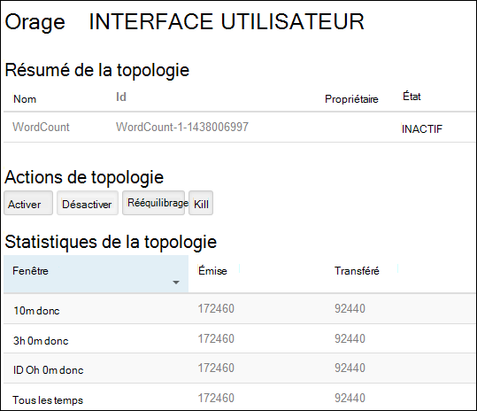
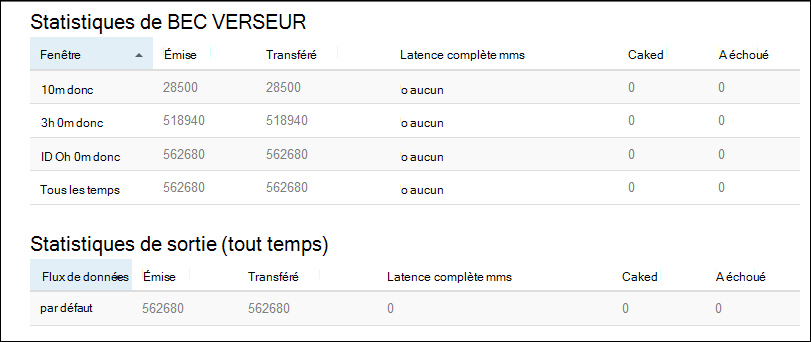

<properties
    pageTitle="Didacticiel d’Apache Storm : mise en route de la tempête de basé sur Linux sur HDInsight | Microsoft Azure"
    description="Mise en route analytique des données à l’aide de Apache tempête et les exemples de tempête Starter sur HDInsight de fonctionnant sous Linux. Découvrez comment utiliser Storm pour traiter les données en temps réel."
    keywords="tempête d’Apache, didacticiel de tempête apache, analytique des données volumineuses, starter de tempête"
    services="hdinsight"
    documentationCenter=""
    authors="Blackmist"
    manager="jhubbard"
    editor="cgronlun"/>

<tags
   ms.service="hdinsight"
   ms.devlang="java"
   ms.topic="get-started-article"
   ms.tgt_pltfrm="na"
   ms.workload="big-data"
   ms.date="10/12/2016"
   ms.author="larryfr"/>

# Didacticiel d’Apache Storm : mise en route avec les exemples de tempête Starter pour l’analytique des données volumineuses sur HDInsight

Tempête de Apache est un système évolutif, à tolérance de pannes, distribué et en temps réel de calcul pour le traitement des flux de données. Avec tempête sur Azure HDInsight, vous pouvez créer un cluster de tempête de nuage qui effectue l’analytique des données en temps réel.

> [AZURE.NOTE] Les étapes décrites dans cet article créent un cluster basé sur Linux de HDInsight. Pour les étapes de création d’une tempête basés sur Windows sur le cluster de HDInsight, consultez [didacticiel d’Apache Storm : mise en route de l’échantillon de tempête Starter l’utilisation analytique des données sur HDInsight](hdinsight-apache-storm-tutorial-get-started.md)

## Conditions préalables

[AZURE.INCLUDE [delete-cluster-warning](../../includes/hdinsight-delete-cluster-warning.md)]

Vous devez avoir les éléments suivants pour terminer ce didacticiel Apache Storm :

- **Abonnement d’un Azure**. Consultez [Azure d’obtenir la version d’évaluation gratuite](https://azure.microsoft.com/documentation/videos/get-azure-free-trial-for-testing-hadoop-in-hdinsight/).

- **Connaissance de SSH et SCP**. Pour plus d’informations sur l’utilisation de SSH et SCP avec HDInsight, consultez les rubriques suivantes :

    - **Les clients Linux, Unix ou OS X**: reportez-vous à la section [Utiliser SSH avec basé sur Linux d’Hadoop sur HDInsight de Linux, OS X ou Unix](hdinsight-hadoop-linux-use-ssh-unix.md)

    - **Les clients Windows**: reportez-vous à la section [Utiliser SSH avec basé sur Linux d’Hadoop sur HDInsight à partir de Windows](hdinsight-hadoop-linux-use-ssh-windows.md)

### Exigences de contrôle d’accès

[AZURE.INCLUDE [access-control](../../includes/hdinsight-access-control-requirements.md)]

## Créer un cluster de tempête

Dans cette section, vous créez un cluster de version 3.2 HDInsight (tempête version 0.9.3) à l’aide d’un modèle de gestionnaire de ressources Azure. Pour plus d’informations sur les versions de HDInsight et leurs contrats SLA, consultez [Versioning des composants de HDInsight](hdinsight-component-versioning.md). Pour les autres méthodes de création de cluster, consultez le [HDInsight de créer des clusters](hdinsight-hadoop-provision-linux-clusters.md).

1. Cliquez sur l’image suivante pour ouvrir le modèle dans le portail Azure.         

    
    
    Le modèle se trouve dans un conteneur public blob, *https://hditutorialdata.blob.core.windows.net/armtemplates/create-linux-based-storm-cluster-in-hdinsight.json*. 
   
2. À partir de la blade de paramètres, entrez les informations suivantes :

    - **Nom_Cluster**: entrez un nom pour le cluster Hadoop que vous allez créer.
    - **Mot de passe et le nom de connexion de cluster**: le nom d’ouverture de session par défaut est Admin.
    - **Mot de passe et nom d’utilisateur SSH**.
    
    Veuillez noter que ces valeurs.  Vous en aurez besoin plus tard dans le didacticiel.

    > [AZURE.NOTE] SSH est utilisé pour accéder à distance au cluster de HDInsight en utilisant une ligne de commande. Le nom d’utilisateur et le mot de passe utilisé ici est utilisé lors de la connexion au cluster via SSH. En outre, le nom d’utilisateur SSH doit être unique, qu’il crée un compte d’utilisateur sur tous les nœuds de cluster HDInsight. Les éléments suivants sont les noms de comptes réservés pour une utilisation par les services de cluster et ne peut pas être utilisés comme nom d’utilisateur SSH :
    >
    > racine, hdiuser, tempête, hbase, ubuntu, soigneur, très, fils, mapred, hbase, ruche, oozie, falcon, sqoop, admin, tez, hcat, hdinsight-soigneur.

    > Pour plus d’informations sur l’utilisation de SSH avec HDInsight, consultez les articles suivants :

    > * [Utiliser le protocole SSH avec basé sur Linux d’Hadoop sur HDInsight à partir d’OS X, Unix ou Linux](hdinsight-hadoop-linux-use-ssh-unix.md)
    > * [Utiliser le protocole SSH avec basé sur Linux d’Hadoop sur HDInsight à partir de Windows](hdinsight-hadoop-linux-use-ssh-windows.md)

    
3. Cliquez sur **OK** pour enregistrer les paramètres.

4 à partir de la blade de **déploiement de personnalisé** , cliquez sur la liste déroulante **groupe de ressources** et puis cliquez sur **Nouveau** pour créer un nouveau groupe de ressources. Le groupe de ressources est un conteneur qui groupe le cluster, le compte de stockage dépendant et autres ressources liées.

5 Cliquez sur **conditions**, puis cliquez sur **créer**.

6. Cliquez sur **créer**. Vous verrez une nouvelle mosaïque intitulée déploiement d’envoi pour le déploiement du modèle. Il faut environ 20 minutes environ pour créer le cluster et la base de données SQL.

##Exécutez un exemple tempête Starter sur HDInsight

Les exemples de [tempête-starter](https://github.com/apache/storm/tree/master/examples/storm-starter) sont inclus dans le cluster de HDInsight. Dans les étapes suivantes, vous allez exécuter l’exemple WordCount.

1. Connectez-vous au cluster de HDInsight à l’aide de SSH :

        ssh USERNAME@CLUSTERNAME-ssh.azurehdinsight.net
        
    Si vous avez utilisé un mot de passe pour votre compte d’utilisateur SSH, vous êtes invité à l’entrer. Si vous avez utilisé une clé publique, il se peut que vous deviez utiliser la `-i` paramètre pour spécifier la clé privée correspondante. Par exemple, `ssh -i ~/.ssh/id_rsa USERNAME@CLUSTERNAME-ssh.azurehdinsight.net`.
        
    Pour plus d’informations sur l’utilisation de SSH avec HDInsight de basé sur Linux, consultez les articles suivants :
    
    * [Utiliser le protocole SSH avec basé sur Linux d’Hadoop sur HDInsight à partir d’OS X, Unix ou Linux](hdinsight-hadoop-linux-use-ssh-unix.md)

    * [Utiliser le protocole SSH avec basé sur Linux d’Hadoop sur HDInsight à partir de Windows](hdinsight-hadoop-linux-use-ssh-windows)

2. Utilisez la commande suivante pour démarrer un exemple de topologie :

        storm jar /usr/hdp/current/storm-client/contrib/storm-starter/storm-starter-topologies-*.jar storm.starter.WordCountTopology wordcount
        
    > [AZURE.NOTE] Le `*` partie du nom de fichier est utilisée pour faire correspondre le numéro de version, qui varie lorsque HDInsight est mis à jour.

    L’exemple de topologie WordCount démarre sur le cluster, avec le nom convivial « wordcount ». Il sera générer des phrases et pour compter les occurrences de chaque mot dans les phrases de manière aléatoire.

    > [AZURE.NOTE] Lorsque vous soumettez la topologie pour le cluster, vous devez d’abord copier le fichier jar contenant du cluster avant d’utiliser la `storm` commande. Ceci peut être accompli à l’aide de la `scp` commande à partir du client où se trouve le fichier. Par exemple,`scp FILENAME.jar USERNAME@CLUSTERNAME-ssh.azurehdinsight.net:FILENAME.jar`
    >
    > L’exemple WordCount et autres exemples de starter tempête, sont déjà incluses dans votre cluster à `/usr/hdp/current/storm-client/contrib/storm-starter/`.

##Moniteur de la topologie

L’interface utilisateur de tempête fournit une interface web pour l’utilisation de topologies en cours d’exécution et est inclus sur votre cluster de HDInsight.

Utilisez les étapes suivantes pour contrôler la topologie à l’aide de l’interface utilisateur de Storm :

1. Ouvrez un navigateur web à https://CLUSTERNAME.azurehdinsight.net/stormui, dans laquelle __CLUSTERNAME__ est le nom de votre cluster. Cette action ouvre l’interface utilisateur de tempête.

    > [AZURE.NOTE] Si vous êtes invité à fournir un nom d’utilisateur et le mot de passe, entrez l’administrateur de cluster (admin) et le mot de passe que vous avez utilisé quand créer le cluster.

2. Sous **Résumé de la topologie**, sélectionnez l’entrée **wordcount** dans la colonne **nom** . Plus d’informations sur la topologie s’affiche.

    

    Cette page fournit les informations suivantes :

    * **Statistiques de la topologie** - informations de base sur les performances de la topologie, organisés en périodes.

        > [AZURE.NOTE] La sélection d’une fenêtre de temps spécifique modifie la fenêtre temporelle pour les informations affichées dans les autres sections de la page.

    * **Becs verseurs amovibles** - informations de base sur des becs verseurs, y compris la dernière erreur retournée par chaque bec.

    * **Boulons** - informations de base sur les boulons.

    * **Configuration de la topologie** - des informations détaillées sur la configuration de la topologie.

    Cette page fournit également les actions qui peuvent être prises sur la topologie :

    * **Activer** - traitement de curriculum vitae de topologie est désactivée.

    * **Désactiver** - suspend une topologie en cours d’exécution.

    * **Rééquilibrer** - ajuste le parallélisme de la topologie. Vous devez rééquilibrer les topologies en cours d’exécution après avoir modifié le nombre de nœuds dans le cluster. Ainsi, la topologie à ajuster le parallélisme pour compenser l’augmentation/diminution nombre de nœuds dans le cluster. Pour plus d’informations, voir [comprendre le parallélisme de topologie de tempête](http://storm.apache.org/documentation/Understanding-the-parallelism-of-a-Storm-topology.html).

    * **Kill** - met fin à une topologie de tempête après le délai spécifié.

3. À partir de cette page, sélectionnez une entrée dans la section **des becs verseurs amovibles** ou de **boulons** . Il affiche des informations sur le composant sélectionné.

    

    Cette page affiche les informations suivantes :

    * **BEC VERSEUR/du boulon stats** - informations de base sur les performances des composants, organisés en périodes.

        > [AZURE.NOTE] La sélection d’une fenêtre de temps spécifique modifie la fenêtre temporelle pour les informations affichées dans les autres sections de la page.

    * **Statistiques de l’entrée** (boulon uniquement) - informations sur les composants qui génèrent des données consommées par le boulon.

    * **Statistiques de sortie** - informations sur les données émises par cet éclair.

    * **Les exécuteurs** - informations sur les instances de ce composant.

    * **Erreurs** : les erreurs produites par ce composant.

4. Lorsque vous affichez les détails d’un BEC VERSEUR ou un boulon, sélectionnez une entrée dans la colonne de **Port** dans la section **les exécuteurs** pour afficher les détails d’une instance spécifique du composant.

        2015-01-27 14:18:02 b.s.d.task [INFO] Emitting: split default ["with"]
        2015-01-27 14:18:02 b.s.d.task [INFO] Emitting: split default ["nature"]
        2015-01-27 14:18:02 b.s.d.executor [INFO] Processing received message source: split:21, stream: default, id: {}, [snow]
        2015-01-27 14:18:02 b.s.d.task [INFO] Emitting: count default [snow, 747293]
        2015-01-27 14:18:02 b.s.d.executor [INFO] Processing received message source: split:21, stream: default, id: {}, [white]
        2015-01-27 14:18:02 b.s.d.task [INFO] Emitting: count default [white, 747293]
        2015-01-27 14:18:02 b.s.d.executor [INFO] Processing received message source: split:21, stream: default, id: {}, [seven]
        2015-01-27 14:18:02 b.s.d.task [INFO] Emitting: count default [seven, 1493957]

    À partir de ces données, vous pouvez voir que le mot **sept** s’est produite une fois 1493957. C’est le nombre de fois qu’il a été détecté dans la mesure où cette topologie a été démarrée.

##Arrêter la topologie

Revenir à la page de **Résumé de la topologie** pour la topologie statistiques, puis sélectionnez le bouton **Supprimer** dans la section **actions de la topologie** . Lorsque vous y êtes invité, entrez 10 pour les secondes à attendre avant l’arrêt de la topologie. Après le délai d’expiration de la topologie n’apparaîtra plus lorsque vous accédez à la section de **L’interface utilisateur de la tempête** du tableau de bord.

##Supprimer du cluster

[AZURE.INCLUDE [delete-cluster-warning](../../includes/hdinsight-delete-cluster-warning.md)]

##Étapes suivantes

Dans ce didacticiel Apache tempête, vous avez utilisé le Starter Storm pour apprendre à créer une tempête sur cluster de HDInsight et le tableau de bord tempête permet de déployer, de surveiller et de gérer des topologies de tempête. Ensuite, découvrez comment [les topologies basée sur Java de développer à l’aide de Maven](hdinsight-storm-develop-java-topology.md).

Si vous êtes déjà familiarisé avec le développement des topologies basée sur Java et que vous souhaitez déployer une topologie existante à HDInsight, reportez-vous à la section [déployer et gérer des topologies de tempête de Apache sur HDInsight](hdinsight-storm-deploy-monitor-topology-linux.md).

Si vous êtes un développeur .NET, vous pouvez créer C# ou hybride C# / topologies de Java à l’aide de Visual Studio. Pour plus d’informations, consultez [développement C# topologies de tempête Apache sur HDInsight à l’aide d’outils d’Hadoop pour Visual Studio](hdinsight-storm-develop-csharp-visual-studio-topology.md).

Par exemple, topologies qui peuvent être utilisés avec la tempête sur HDInsight, reportez-vous aux exemples suivants :

    * [Exemples de topologies pour tempête sur HDInsight](hdinsight-storm-example-topology.md)

[apachestorm]: https://storm.incubator.apache.org
[stormdocs]: http://storm.incubator.apache.org/documentation/Documentation.html
[stormstarter]: https://github.com/apache/storm/tree/master/examples/storm-starter
[stormjavadocs]: https://storm.incubator.apache.org/apidocs/
[azureportal]: https://manage.windowsazure.com/
[hdinsight-provision]: hdinsight-provision-clusters.md
[preview-portal]: https://portal.azure.com/
