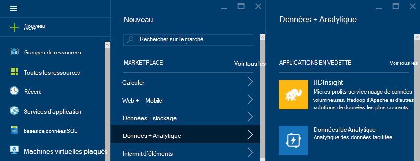

<properties
    pageTitle="Didacticiel d’Apache Storm : mise en route de la tempête | Microsoft Azure"
    description="Mise en route analytique des données à l’aide de Apache tempête et les exemples de tempête Starter sur HDInsight. Découvrez comment utiliser Storm pour traiter les données en temps réel."
    keywords="tempête d’Apache, didacticiel de tempête apache, analytique des données volumineuses, starter de tempête"
    services="hdinsight"
    documentationCenter=""
    authors="Blackmist"
    manager="jhubbard"
    editor="cgronlun"
    tags="azure-portal"/>

<tags
   ms.service="hdinsight"
   ms.devlang="java"
   ms.topic="article"
   ms.tgt_pltfrm="na"
   ms.workload="big-data"
   ms.date="09/07/2016"
   ms.author="larryfr"/>

# Didacticiel d’Apache Storm : mise en route avec les exemples de tempête Starter pour l’analytique des données volumineuses sur HDInsight

Tempête de Apache est un système évolutif, à tolérance de pannes, distribué et en temps réel de calcul pour le traitement des flux de données. Avec tempête sur Microsoft Azure HDInsight, vous pouvez créer un cluster de tempête de nuage qui effectue l’analytique des données en temps réel. 

> [AZURE.NOTE] Les étapes décrites dans cet article créent un cluster d’HDInsight de basés sur Windows. Pour créer une tempête basé sur Linux sur cluster de HDInsight, consultez [didacticiel d’Apache Storm : mise en route de l’échantillon de tempête Starter l’utilisation analytique des données sur HDInsight](hdinsight-apache-storm-tutorial-get-started-linux.md)

## Conditions préalables

[AZURE.INCLUDE [delete-cluster-warning](../../includes/hdinsight-delete-cluster-warning.md)]

Vous devez avoir les éléments suivants pour terminer ce didacticiel Apache Storm :

- **Abonnement d’un Azure**. Consultez [Azure d’obtenir la version d’évaluation gratuite](https://azure.microsoft.com/documentation/videos/get-azure-free-trial-for-testing-hadoop-in-hdinsight/).

### Exigences de contrôle d’accès

[AZURE.INCLUDE [access-control](../../includes/hdinsight-access-control-requirements.md)]

## Créer un cluster de tempête

Tempête sur HDInsight utilise le stockage Blob de Azure pour stocker les fichiers journaux et les topologies présentés au cluster. Pour créer un compte de stockage Azure pour une utilisation avec votre cluster, utilisez les étapes suivantes :

1. Connectez-vous au [portail Azure][preview-portal].

2. Sélectionnez **Nouveau**et sélectionnez __Données Analytique__puis sélectionnez __HDInsight__.

    

3. Entrez un __nom de Cluster__. Une coche verte s’affiche en regard du __Nom du Cluster__ s’il est disponible.

4. Si vous avez plus d’un abonnement, sélectionnez l’entrée __d’abonnement__ pour sélectionner l’abonnement Azure qui sera utilisé pour le cluster.

5.  __Sélectionner le Type de Cluster__ permet de sélectionner un cluster __tempête__ . Pour le __système d’exploitation__, sélectionnez Windows. Pour la __Couche de Cluster__, sélectionnez STANDARD. Enfin, utilisez le bouton de sélection pour enregistrer ces paramètres.

    

5. Pour le __Groupe de ressources__, vous pouvez utiliser la liste déroulante pour afficher la liste des groupes de ressources existants et puis en sélectionner un pour créer le cluster dans. Ou bien, vous pouvez sélectionnez __Nouveau__ , puis entrez le nom du nouveau groupe de ressources. Une coche verte apparaît pour indiquer si le nouveau nom de groupe est disponible.

6. Sélectionnez les __informations d’identification__et puis entrez un __Nom de connexion de Cluster__ et le __Mot de passe de connexion de Cluster__. Enfin, utilisez __Sélectionner__ pour définir les informations d’identification. Bureau à distance ne serviront pas dans ce document, afin de vous laisser cette option désactivée.

    

6. Pour la __Source de données__, vous pouvez sélectionner l’entrée à choisir une source de données existante, ou créer un nouveau.

    

    Actuellement, vous pouvez sélectionner un compte de stockage Azure comme source de données pour un cluster de HDInsight. Utilisez ce qui suit pour comprendre les écritures sur la lame de __Source de données__ .

    - __Méthode de sélection__: définir __à partir de tous les abonnements__ pour activer la recherche des comptes de stockage sur vos abonnements. La valeur de __Touche d’accès rapide__ si vous souhaitez entrer le __Nom de stockage__ et de la __Touche d’accès rapide__ d’un compte de stockage existant.

    - __Créer un nouveau__: utilisez cette option pour créer un nouveau compte de stockage. Utilisez le champ qui s’affiche permet d’entrer le nom du compte de stockage. Une coche verte s’affiche si le nom est disponible.

    - __Choisissez le conteneur par défaut__: utilisez cette option pour entrer le nom du conteneur par défaut à utiliser pour le cluster. Vous pouvez entrer ici n’importe quel nom, mais nous vous recommandons utilisant le même nom que le cluster de sorte que vous pouvez facilement reconnaître que le conteneur est utilisé pour ce cluster spécifique.

    - __Emplacement__: la zone géographique que le compte de stockage sera est ou sera créée dans.

        > [AZURE.IMPORTANT] Sélection de l’emplacement de la source de données par défaut définit également l’emplacement du cluster HDInsight. La source de données par défaut et le cluster doit se trouver dans la même région.

    - __Sélectionnez__: utilisez cette option pour enregistrer la configuration de source de données.

7. Sélectionnez les __Niveaux de prix de nœud__ pour afficher les informations sur les nœuds qui va être créé pour ce cluster. Par défaut, le nombre de nœuds de traitement a la valeur __4__. Définir sur __1__, comme cela est suffisant pour ce didacticiel et réduit le coût du cluster. Le coût estimé du cluster est affiché au bas de cette blade.

    

    Permet de __Sélectionner__ enregistrer les informations de __Niveaux de prix de nœud__ .

8. Sélectionnez __Configuration facultative__. Cette blade vous permet de sélectionner la version de cluster, mais aussi configurer d’autres paramètres facultatifs, tels que l’affiliation à un __Réseau virtuel__.

    

9. Vérifiez que les __broches Startboard__ est sélectionné et puis sélectionnez __créer__. Cela crée le cluster et lui ajoute une mosaïque d’à la Startboard de votre portail Azure. L’icône indique que la mise en service de cluster et les modifications apportées à l’affichage de l’icône de HDInsight une fois la mise en service terminée.

  	| Lors de la mise en service | Déploiement terminé |
  	| ------------------ | --------------------- |
  	|  |  |

    > [AZURE.NOTE] Il prend un certain temps pour le cluster doit être créée, généralement environ 15 minutes. Utiliser la mosaïque sur le Startboard ou l’entrée de __Notifications__ sur la gauche de la page, pour vérifier le processus de déploiement.

## Exécutez un exemple tempête Starter sur HDInsight

Ce didacticiel Apache tempête présente analytique des données à l’aide d’échantillons tempête Starter sur GitHub.

Chaque tempête sur cluster de HDInsight est fourni avec le tableau de bord tempête, qui peut être utilisé pour télécharger et exécuter des topologies de tempête sur le cluster. Chaque cluster est également livré avec des exemples de topologies qui peuvent être exécutées directement depuis le tableau de bord de tempête.

### Se connecter au tableau de bord

Le tableau de bord se trouve dans **https://&lt;nom_cluster >.azurehdinsight.net//**, où **clustername** est le nom du cluster. Vous trouverez également un lien vers le tableau de bord en sélectionnant le cluster à partir de la Startboard, le lien de __tableau de bord__ dans la partie supérieure de la lame.

> [AZURE.NOTE] Lorsque vous vous connectez au tableau de bord, vous êtes invité à entrer un nom d’utilisateur et le mot de passe. C’est le nom de l’administrateur (**admin**) et un mot de passe utilisé lors de la création du cluster.

Une fois le tableau de bord tempête chargé, vous verrez le formulaire **Soumettre la topologie** .

L’écran **Présente une topologie** permet de télécharger et exécuter les fichiers .jar qui contiennent des topologies de tempête. Il inclut également plusieurs exemples de base qui sont fournis avec le cluster.

### Exécutez l’exemple nombre de mots à partir du projet de démarrage de la tempête dans GitHub

Les exemples fournis avec le cluster incluent plusieurs variantes d’une topologie de comptage de word. Ces exemples incluent un **BEC VERSEUR** qui émet au hasard des phrases et des **boulons** saut de chaque phrase en mots individuels, puis de compter combien de fois chaque mot s’est produite. Ces exemples sont des [exemples de tempête Starter](https://github.com/apache/storm/tree/master/examples/storm-starter), qui font partie de la vague d’Apache.

Effectuez les étapes suivantes pour exécuter un exemple de tempête Starter :

1. Sélectionnez **StormStarter - WordCount** dans le menu déroulant **Fichier Jar** . Cette opération remplit les champs **Nom de la classe** et les **Paramètres supplémentaires** avec les paramètres de cet exemple.

    

    * **Nom de la classe** - la classe dans le fichier .jar qui soumet la topologie.
    * **Paramètres supplémentaires** - tous les paramètres requis par la topologie. Dans cet exemple, le champ est utilisé pour fournir un nom convivial pour la topologie soumis.

2. Cliquez sur **Envoyer**. Après quelques instants, le champ de **résultat** affiche la commande utilisée pour soumettre le travail, ainsi que les résultats de la commande. Le champ **erreur** affiche toutes les erreurs qui se produisent à l’appui de la topologie.

    

    > [AZURE.NOTE] Les résultats n’indiquent pas que la topologie terminée - **une tempête topologie, une fois commencée, s’exécute jusqu'à ce que vous arrêtiez it.** La topologie statistiques génère des phrases aléatoires et conserve un décompte du nombre de fois qu’il rencontre chaque mot, jusqu'à ce que vous l’arrêtiez.

### Moniteur de la topologie

L’interface utilisateur de Storm permet de contrôler la topologie.

1. Sélectionnez **L’interface utilisateur de la tempête** à partir du haut du tableau de bord tempête. Cela affiche des informations de synthèse pour le cluster et toutes les topologies en cours d’exécution.

    

    À partir de la page ci-dessus, vous pouvez voir l’heure de que la topologie a été active, ainsi que le nombre de travailleurs, les exécuteurs et les tâches en cours d’utilisation.

    > [AZURE.NOTE] La colonne **Name** contient le nom convivial fourni précédemment via le champ **Des paramètres supplémentaires** .

4. Sous **Résumé de la topologie**, sélectionnez l’entrée **wordcount** dans la colonne **nom** . Cela affiche plus d’informations sur la topologie.

    

    Cette page fournit les informations suivantes :

    * **Statistiques de la topologie** - informations de base sur les performances de la topologie, organisés en périodes.

        > [AZURE.NOTE] La sélection d’une fenêtre de temps spécifique modifie la fenêtre temporelle pour les informations affichées dans les autres sections de la page.

    * **Becs verseurs amovibles** - informations de base sur des becs verseurs, y compris la dernière erreur retournée par chaque bec.

    * **Boulons** - informations de base sur les boulons.

    * **Configuration de la topologie** - des informations détaillées sur la configuration de la topologie.

    Cette page fournit également les actions qui peuvent être prises sur la topologie :

    * **Activer** - traitement de curriculum vitae de topologie est désactivée.

    * **Désactiver** - suspend une topologie en cours d’exécution.

    * **Rééquilibrer** - ajuste le parallélisme de la topologie. Vous devez rééquilibrer les topologies en cours d’exécution après avoir modifié le nombre de nœuds dans le cluster. Ainsi, la topologie à ajuster le parallélisme pour compenser l’augmentation/diminution nombre de nœuds dans le cluster. Pour plus d’informations, voir [comprendre le parallélisme de topologie de tempête](http://storm.apache.org/documentation/Understanding-the-parallelism-of-a-Storm-topology.html).

    * **Kill** - met fin à une topologie de tempête après le délai spécifié.

5. À partir de cette page, sélectionnez une entrée dans la section **des becs verseurs amovibles** ou de **boulons** . Il affiche des informations sur le composant sélectionné.

    

    Cette page affiche les informations suivantes :

    * **BEC VERSEUR/du boulon stats** - informations de base sur les performances des composants, organisés en périodes.

        > [AZURE.NOTE] La sélection d’une fenêtre de temps spécifique modifie la fenêtre temporelle pour les informations affichées dans les autres sections de la page.

    * **Statistiques de l’entrée** (boulon uniquement) - informations sur les composants qui génèrent des données consommées par le boulon.

    * **Statistiques de sortie** - informations sur les données émises par cet éclair.

    * **Les exécuteurs** - informations sur les instances de ce composant.

    * **Erreurs** : les erreurs produites par ce composant.

5. Lorsque vous affichez les détails d’un BEC VERSEUR ou un boulon, sélectionnez une entrée dans la colonne de **Port** dans la section **les exécuteurs** pour afficher les détails d’une instance spécifique du composant.

        2015-01-27 14:18:02 b.s.d.task [INFO] Emitting: split default ["with"]
        2015-01-27 14:18:02 b.s.d.task [INFO] Emitting: split default ["nature"]
        2015-01-27 14:18:02 b.s.d.executor [INFO] Processing received message source: split:21, stream: default, id: {}, [snow]
        2015-01-27 14:18:02 b.s.d.task [INFO] Emitting: count default [snow, 747293]
        2015-01-27 14:18:02 b.s.d.executor [INFO] Processing received message source: split:21, stream: default, id: {}, [white]
        2015-01-27 14:18:02 b.s.d.task [INFO] Emitting: count default [white, 747293]
        2015-01-27 14:18:02 b.s.d.executor [INFO] Processing received message source: split:21, stream: default, id: {}, [seven]
        2015-01-27 14:18:02 b.s.d.task [INFO] Emitting: count default [seven, 1493957]

    À partir de ces données, vous pouvez voir que le mot **sept** s’est produite une fois 1,493,957. C’est le nombre de fois qu’il a été détecté dans la mesure où cette topologie a été démarrée.

### Arrêter la topologie

Revenir à la page de **Résumé de la topologie** pour la topologie nombre de mots et puis sélectionnez **Supprimer** dans la section **actions de la topologie** . Lorsque vous y êtes invité, entrez 10 pour les secondes à attendre avant l’arrêt de la topologie. Après la période de délai d’attente, la topologie ne s’affiche plus lorsque vous accédez à la section de **L’interface utilisateur de la tempête** du tableau de bord.

##Supprimer du cluster

[AZURE.INCLUDE [delete-cluster-warning](../../includes/hdinsight-delete-cluster-warning.md)]

## Résumé

Dans ce didacticiel Apache tempête, vous avez utilisé le Starter Storm pour apprendre à créer une tempête sur cluster de HDInsight et le tableau de bord tempête permet de déployer, de surveiller et de gérer des topologies de tempête.

## Étapes suivantes

* **Outils d’HDInsight pour Visual Studio** - outils de HDInsight vous permet d’utiliser Visual Studio pour soumettre, de surveiller et de gérer des topologies de tempête semblables au tableau de bord tempête mentionné précédemment. Outils de HDInsight permet de créer des topologies de C# tempête et inclut des exemples de topologies que vous pouvez déployer et exécuter sur votre cluster.

    Pour plus d’informations, consultez [mise en route à l’aide des outils HDInsight pour Visual Studio](hdinsight-hadoop-visual-studio-tools-get-started.md).

* **Exemples de fichiers** - cluster de la tempête de HDInsight fournit plusieurs exemples dans le répertoire **%STORM_HOME%\contrib** . Chaque exemple doit contenir les éléments suivants :

    * Le code source - par exemple, tempête-starter-0.9.1.2.1.5.0-2057-sources.jar

    * Les documents de Java - par exemple, tempête-starter-0.9.1.2.1.5.0-2057-javadoc.jar

    * Exemple - par exemple, storm-starter-0.9.1.2.1.5.0-2057-jar-with-dependencies.jar

    Utilisez la commande 'jar' pour extraire le code source ou les documents de Java. Par exemple, « tempête de xvf - jar-starter-0.9.1.2.1.5.0.2057-javadoc.jar ».

    > [AZURE.NOTE] Docs de Java se composent de pages Web. Une fois extraites, utilisez un navigateur pour afficher le fichier **index.html** .

    Pour accéder à ces exemples, vous devez activer le Bureau à distance pour la tempête sur cluster de HDInsight et puis copiez les fichiers à partir de **%STORM_HOME%\contrib**.

* Le document suivant contient une liste d’autres exemples peuvent être utilisés avec la tempête sur HDInsight :

    * [Exemples de topologies pour tempête sur HDInsight](hdinsight-storm-example-topology.md)

[apachestorm]: https://storm.incubator.apache.org
[stormdocs]: http://storm.incubator.apache.org/documentation/Documentation.html
[stormstarter]: https://github.com/apache/storm/tree/master/examples/storm-starter
[stormjavadocs]: https://storm.incubator.apache.org/apidocs/
[azureportal]: https://manage.windowsazure.com/
[hdinsight-provision]: hdinsight-provision-clusters.md
[preview-portal]: https://portal.azure.com/
