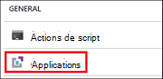
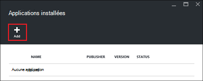
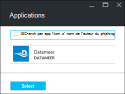
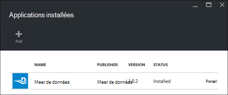

<properties
    pageTitle="Installer des applications d’Hadoop sur HDInsight | Microsoft Azure"
    description="Apprenez à installer les applications HDInsight sur HDInsight les applications."
    services="hdinsight"
    documentationCenter=""
    authors="mumian"
    manager="jhubbard"
    editor="cgronlun"
    tags="azure-portal"/>

<tags
    ms.service="hdinsight"
    ms.devlang="na"
    ms.topic="hero-article"
    ms.tgt_pltfrm="na"
    ms.workload="big-data"
    ms.date="09/14/2016"
    ms.author="jgao"/>

# Installer des applications de HDInsight

Une application de HDInsight est une application que les utilisateurs peuvent installer sur un cluster HDInsight de fonctionnant sous Linux. Ces applications peuvent être développées par Microsoft, des éditeurs de logiciels indépendants (ISV) ou par vous-même. Dans cet article, vous apprendrez comment installer une application publiée. Pour l’installation de votre application, reportez-vous à la section [installer des applications de HDInsight](hdinsight-apps-install-custom-applications.md). 

Actuellement, il est une application publiée :

- **Datameer**: [Datameer](http://www.datameer.com/documentation/display/DAS50/Home?ls=Partners&lsd=Microsoft&c=Partners&cd=Microsoft) offre un moyen interactif à découvrir, analyser et visualiser les résultats sur données volumineuses d’analystes. Extraire facilement à découvrir de nouvelles relations et obtenir les réponses dont vous avez besoin rapidement, les sources de données supplémentaires.

>[AZURE.NOTE] Datameer est actuellement pris en charge uniquement les clusters de version 3.2 Azure HDInsight.

Les instructions fournies dans cet article utilisent Azure portal. Vous pouvez également exporter le modèle de gestionnaire de ressources Azure à partir du portail ou obtenir une copie du modèle de gestionnaire de ressources à partir des fournisseurs et permet de déployer le modèle de PowerShell d’Azure et d’Azure CLI.  Voir [Hadoop de basé sur Linux de créer des clusters dans HDInsight à l’aide des modèles du Gestionnaire de ressources](hdinsight-hadoop-create-linux-clusters-arm-templates.md).

## Conditions préalables

Si vous souhaitez installer des applications de HDInsight sur un cluster HDInsight existant, vous devez disposez d’un cluster de HDInsight. Pour en créer une, reportez-vous à la section [créer les clusters](hdinsight-hadoop-linux-tutorial-get-started.md#create-cluster). Vous pouvez également installer des applications de HDInsight lorsque vous créez un cluster d’HDInsight.

## Installer des applications à des clusters existants

La procédure suivante vous montre comment installer des applications de HDInsight à un cluster existant de la HDInsight.

**Pour installer une application HDInsight**

1. Connectez-vous au [portail Azure](https://portal.azure.com).
2. Dans le menu de gauche, cliquez sur **HDInsight Clusters** .  Si vous ne le voyez pas, cliquez sur **Parcourir**, puis cliquez sur **HDInsight Clusters**.
3. Cliquez sur un cluster HDInsight.  Si vous n’en avez pas, vous devez créer un premier.  consultez [Création de clusters](hdinsight-hadoop-linux-tutorial-get-started.md#create-cluster).
4. À partir de la blade de **paramètres** , cliquez sur **Applications** dans la catégorie **Général** . La lame **Installé des applications** répertorie toutes les applications installées. 

    

5. Cliquez sur **Ajouter** dans le menu de la lame. 

    

    Vous doit afficher la liste des applications existantes de HDInsight.

    

6. Cliquez sur une des applications et accepter les conditions juridiques, puis cliquez sur **Sélectionner**.

Vous pouvez voir l’état de l’installation des notifications portails (cliquez sur l’icône de la clochette en haut du portail). Une fois que l’application est installée, l’application s’affiche sur la blade installé des applications.

## Installer des applications lors de la création du cluster

Vous avez la possibilité d’installer des applications de HDInsight lorsque vous créez un cluster. Au cours du processus, les applications HDInsight sont installées une fois que le cluster est créé et est en cours d’exécution. La procédure suivante vous indique comment installer des applications de HDInsight lorsque vous créez un cluster.

**Pour installer une application HDInsight**

1. Connectez-vous au [portail Azure](https://portal.azure.com).
2. Cliquez sur **Nouveau**et cliquez sur **données + Analytique**, puis cliquez sur **HDInsight**.
3. Entrez le **Nom de Cluster**: ce nom doit être unique.
4. Cliquez sur l' **abonnement** pour sélectionner l’abonnement Azure qui sera utilisé pour le cluster.
5. Cliquez sur **Sélectionner le Type de cluster**, puis sélectionnez :

    - **Type de cluster**: Si vous ne savez pas quelle option choisir, sélectionnez **Hadoop**. Il est le type de cluster le plus répandu.
    - **Système d’exploitation**: sélectionnez **Linux**.
    - **Version**: utiliser la version par défaut si vous ne savez pas quelle solution choisir. Pour plus d’informations, consultez [versions de cluster HDInsight](hdinsight-component-versioning.md).
    - **Couche de cluster**: HDInsight d’Azure fournit les offres de nuage de données volumineuses dans deux catégories : les couches Standard et Premium. Pour plus d’informations, consultez [niveaux de Cluster](hdinsight-hadoop-provision-linux-clusters.md#cluster-tiers).
6. Cliquez sur **Applications**, cliquez sur une des applications publiées, puis cliquez sur **Sélectionner**.
6. Cliquez sur les **informations d’identification** et puis entrez un mot de passe de l’utilisateur admin. Vous devez également entrer un **Nom d’utilisateur SSH** et un **mot de passe** ou **Clé publique**, qui sera utilisé pour authentifier l’utilisateur SSH. À l’aide d’une clé publique est l’approche recommandée. Dans la partie inférieure pour enregistrer la configuration des informations d’identification, cliquez sur **Sélectionner** .
8. Cliquez sur **Source de données**, sélectionnez une option du compte de stockage existant ou créer un nouveau compte de stockage à utiliser comme le compte de stockage par défaut pour le cluster.
9. Cliquez sur le **Groupe de ressources** pour sélectionner un groupe de ressources existant, ou cliquez sur **Nouveau** pour créer un nouveau groupe de ressources

10. Sur la lame de **Nouveau HDInsight Cluster** , assurez-vous que **broche à Startboard** est sélectionnée, puis cliquez sur **créer**. 

## Liste des applications installées de HDInsight et de propriétés

Le portail affiche une liste des applications installées HDInsight pour un cluster et les propriétés de chaque application installée.

**Application de HDInsight de liste et d’afficher les propriétés**

1. Connectez-vous au [portail Azure](https://portal.azure.com).
2. Dans le menu de gauche, cliquez sur **HDInsight Clusters** .  Si vous ne le voyez pas, cliquez sur **Parcourir**, puis cliquez sur **HDInsight Clusters**.
3. Cliquez sur un cluster HDInsight.
4. À partir de la blade de **paramètres** , cliquez sur **Applications** dans la catégorie **Général** . La lame installé des applications répertorie toutes les applications installées. 

    

5. Cliquez sur l’une des applications installées pour afficher la propriété. Les listes de lame de propriété :

    - Nom de l’application : nom de l’application.
    - État : état d’application. 
    - Page Web : L’URL de l’application web que vous avez déployé vers le nœud de bord, s’il en existe une. Les informations d’identification sont le même que les informations d’identification d’utilisateur HTTP que vous avez configurée pour le cluster.
    - Point de terminaison HTTP : les informations d’identification sont le même que les informations d’identification d’utilisateur HTTP que vous avez configurée pour le cluster. 
    - Point de terminaison SSH : vous pouvez utiliser [SSH](hdinsight-hadoop-linux-use-ssh-unix.md) pour se connecter au nœud de bord. Les informations d’identification SSH sont les mêmes que les informations d’identification utilisateur SSH que vous avez configurée pour le cluster.

6. Pour supprimer une application, cliquez sur l’application, puis cliquez sur **Supprimer** dans le menu contextuel.

## Connectez-vous au nœud de bord

Vous pouvez vous connecter au nœud de bord à l’aide de HTTP et SSH. Vous trouverez les informations de point de terminaison à partir du [portail](#list-installed-hdinsight-apps-and-properties). Pour plus d’informations sur l’utilisation du protocole SSH, consultez [Utiliser SSH avec basé sur Linux d’Hadoop sur HDInsight de Linux, Unix ou OS X](hdinsight-hadoop-linux-use-ssh-unix.md). 

Les informations d’identification du point de terminaison HTTP sont les informations d’identification d’utilisateur HTTP que vous avez configurée pour le cluster HDInsight ; les informations d’identification du point de terminaison SSH sont les informations d’identification SSH que vous avez configurée pour le cluster HDInsight.

## Résoudre les problèmes

Reportez-vous à la section [Dépannage de l’installation](hdinsight-apps-install-custom-applications.md#troubleshoot-the-installation).

## Étapes suivantes

- [Installer des applications HDInsight](hdinsight-apps-install-custom-applications.md): Découvrez comment déployer une application non publiée de HDInsight à HDInsight.
- [HDInsight de publier des applications](hdinsight-apps-publish-applications.md): Découvrez comment publier vos applications personnalisées HDInsight Azure Marketplace.
- [MSDN : installation d’une application de HDInsight](https://msdn.microsoft.com/library/mt706515.aspx): Apprenez à définir des applications de HDInsight.
- [Clusters basés sur Linux de personnaliser la HDInsight à l’aide de Script Action](hdinsight-hadoop-customize-cluster-linux.md): Apprenez à utiliser l’Action de Script pour installer des applications supplémentaires.
- [Hadoop de basé sur Linux de créer des clusters dans HDInsight à l’aide des modèles du Gestionnaire de ressources](hdinsight-hadoop-create-linux-clusters-arm-templates.md): Apprenez à appeler le Gestionnaire de ressources des modèles pour créer des clusters de HDInsight.
- [Utilisez les noeuds vides dans HDInsight](hdinsight-apps-use-edge-node.md): Apprenez à utiliser un nœud vide pour accéder au cluster de HDInsight, tester des applications HDInsight et hébergement d’applications de HDInsight.

