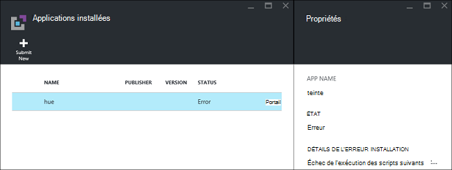
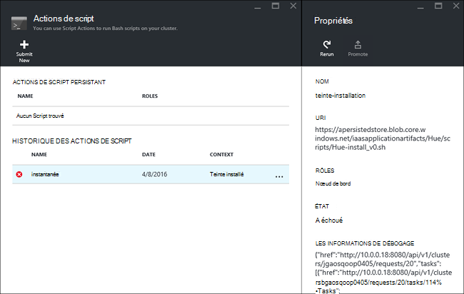

<properties
    pageTitle="Installer des applications d’Hadoop sur HDInsight | Microsoft Azure"
    description="Apprenez à installer les applications HDInsight sur HDInsight les applications."
    services="hdinsight"
    documentationCenter=""
    authors="mumian"
    manager="jhubbard"
    editor="cgronlun"
    tags="azure-portal"/>

<tags
    ms.service="hdinsight"
    ms.devlang="na"
    ms.topic="hero-article"
    ms.tgt_pltfrm="na"
    ms.workload="big-data"
    ms.date="09/14/2016"
    ms.author="jgao"/>

# Installer des applications personnalisées HDInsight

Une application de HDInsight est une application que les utilisateurs peuvent installer sur un cluster HDInsight de fonctionnant sous Linux.  Ces applications peuvent être développées par Microsoft, des éditeurs de logiciels indépendants (ISV) ou par vous-même. Dans cet article, vous apprendrez comment installer une application de HDInsight qui n’a pas été publiée sur le portail Azure sur HDInsight. L’application que vous installerez est [teinte](http://gethue.com/). 

Autres articles associés :

- [HDInsight d’installer les applications](hdinsight-apps-install-applications.md): Découvrez comment installer une application de HDInsight sur des clusters.
- [HDInsight de publier des applications](hdinsight-apps-publish-applications.md): Découvrez comment publier vos applications personnalisées HDInsight Azure Marketplace.
- [MSDN : installation d’une application de HDInsight](https://msdn.microsoft.com/library/mt706515.aspx): Apprenez à définir des applications de HDInsight.

 
## Conditions préalables

Si vous souhaitez installer des applications de HDInsight sur un cluster HDInsight existant, vous devez disposez d’un cluster de HDInsight. Pour en créer une, reportez-vous à la section [créer les clusters](hdinsight-hadoop-linux-tutorial-get-started.md#create-cluster). Vous pouvez également installer des applications de HDInsight lorsque vous créez un cluster d’HDInsight.

## Installer des applications de HDInsight

Applications de HDInsight peuvent être installées lorsque vous créez un cluster ou à un cluster existant de la HDInsight. Pour définir des modèles du Gestionnaire de ressources Azure, consultez [MSDN : installation d’une application de HDInsight](https://msdn.microsoft.com/library/mt706515.aspx).

Les fichiers nécessaires pour le déploiement de cette application (teinte) :

- [azuredeploy.JSON](https://github.com/hdinsight/Iaas-Applications/blob/master/Hue/azuredeploy.json): modèle du Gestionnaire de ressources pour l’installation de l’application de HDInsight. Consultez [MSDN : installation d’une application de HDInsight](https://msdn.microsoft.com/library/mt706515.aspx) pour le développement de votre propre modèle de gestionnaire de ressources.
- [teinte-install_v0.sh](https://github.com/hdinsight/Iaas-Applications/blob/master/Hue/scripts/Hue-install_v0.sh): action du Script qui est appelée par le modèle du Gestionnaire de ressources pour la configuration du nœud de bord. 
- [teinte-binaries.tgz](https://hdiconfigactions.blob.core.windows.net/linuxhueconfigactionv01/hue-binaries-14-04.tgz): le fichier binaire de teinte appelé à partir d’aujourd'hui-install_v0.sh. 
- [teinte-fichiers binaires-14-04.tgz](https://hdiconfigactions.blob.core.windows.net/linuxhueconfigactionv01/hue-binaries-14-04.tgz): le fichier binaire de teinte appelé à partir d’aujourd'hui-install_v0.sh. 
- [webwasb-tomcat.tar.gz](https://hdiconfigactions.blob.core.windows.net/linuxhueconfigactionv01/webwasb-tomcat.tar.gz): un exemple d’application web (Tomcat) est appelée à partir d’aujourd'hui-install_v0.sh.

**Pour installer la teinte à un cluster existant de la HDInsight**

1. Cliquez sur l’image suivante pour vous connecter à Azure et ouvrez le modèle de gestionnaire de ressources dans le portail Azure. 

    

    Ce bouton ouvre un modèle de gestionnaire de ressources sur le portail Azure.  Le modèle de gestionnaire de ressources se trouve dans [https://github.com/hdinsight/Iaas-Applications/tree/master/Hue](https://github.com/hdinsight/Iaas-Applications/tree/master/Hue).  Pour savoir comment écrire ce modèle de gestionnaire de ressources, consultez [MSDN : installation d’une application de HDInsight](https://msdn.microsoft.com/library/mt706515.aspx).
    
2. À partir de la blade de **paramètres** , entrez les informations suivantes :

    - **Nom_Cluster**: entrez le nom du cluster où vous voulez installer l’application. Ce cluster doit être un cluster existant.
    
3. Cliquez sur **OK** pour enregistrer les paramètres.
4. À partir de la blade de **déploiement de personnalisé** , entrez le **groupe de ressources**.  Le groupe de ressources est un conteneur qui groupe du cluster, le compte de stockage dépendant et d’autres ressources. Il est nécessaire d’utiliser le même groupe de ressources que le cluster.
5. Cliquez sur **conditions**, puis cliquez sur **créer**.
6. Vérifiez que la case à cocher **Ajouter au tableau de bord** est activée, puis cliquez sur **créer**. Vous pouvez voir l’état de l’installation de la vignette épinglée pour le tableau de bord de portail et de la notification de portail (cliquez sur l’icône de la clochette en haut du portail).  Il prend environ 10 minutes pour installer l’application.

**Pour installer la teinte lors de la création d’un cluster**

1. Cliquez sur l’image suivante pour vous connecter à Azure et ouvrez le modèle de gestionnaire de ressources dans le portail Azure. 

    

    Ce bouton ouvre un modèle de gestionnaire de ressources sur le portail Azure.  Le modèle de gestionnaire de ressources se trouve dans [https://hditutorialdata.blob.core.windows.net/hdinsightapps/create-linux-based-hadoop-cluster-in-hdinsight.json](https://hditutorialdata.blob.core.windows.net/hdinsightapps/create-linux-based-hadoop-cluster-in-hdinsight.json).  Pour savoir comment écrire ce modèle de gestionnaire de ressources, consultez [MSDN : installation d’une application de HDInsight](https://msdn.microsoft.com/library/mt706515.aspx).

2. Suivez les instructions pour créer des clusters et installer de teinte. Pour plus d’informations sur la création de clusters de HDInsight, consultez [clusters basés sur Linux de créer les Hadoop dans HDInsight](hdinsight-hadoop-provision-linux-clusters.md).

En plus de l’Azure portal, vous pouvez également utiliser [PowerShell d’Azure](hdinsight-hadoop-create-linux-clusters-arm-templates.md#deploy-with-powershell) et [d’Azure CLI](hdinsight-hadoop-create-linux-clusters-arm-templates.md#deploy-with-azure-cli) pour appeler le Gestionnaire de ressources de modèles.

## Valider l’installation

Vous pouvez vérifier l’état de l’application sur le portail Azure pour valider l’installation de l’application. En outre, vous pouvez également valider tous les provient de points de terminaison HTTP des comme prévu et de la page Web s’il existe :

**Pour ouvrir le portail de teinte**

1. Connectez-vous au [portail Azure](https://portal.azure.com).
2. Dans le menu de gauche, cliquez sur **HDInsight Clusters** .  Si vous ne le voyez pas, cliquez sur **Parcourir**, puis cliquez sur **HDInsight Clusters**.
3. Cliquez sur le cluster où vous avez installé l’application.
4. À partir de la blade de **paramètres** , cliquez sur **Applications** dans la catégorie **Général** . Vous veillent **teinte** figurant à la lame **Installé des applications** .
5. Cliquez sur la **teinte** dans la liste pour les propriétés de la liste.  
6. Cliquez sur le lien de la page Web pour valider le site Web ; Ouvrez le point de terminaison HTTP dans un navigateur pour valider l’interface utilisateur du web de teinte, ouvrez le SSH de point de terminaison à l’aide de [PuTTY](hdinsight-hadoop-linux-use-ssh-windows.md) ou autres [clients SSH](hdinsight-hadoop-linux-use-ssh-unix.md).
 
## Résoudre les problèmes liés à l’installation

Vous pouvez vérifier l’état d’installation application à partir de la notification de portail (cliquez sur l’icône de la clochette en haut du portail). 

En cas d’échec de l’installation d’une application, vous pouvez voir les messages d’erreur et des informations à partir de 3 emplacements de débogage :

- HDInsight les Applications : informations erreur générale.

    Ouverture du cluster à partir du portail, puis cliquez sur Applications à partir de la blade de paramètres :

    

- Action de script HDInsight : si le message d’erreur HDInsight Applications indique un échec de l’action script, plus de détails sur l’échec du script seront affichera dans le volet actions de script.

    Cliquez sur Action de Script à partir de la blade de paramètres. Historique des actions de script affiche les messages d’erreur

    
    
- Interface utilisateur Web de Ambari : Si le script d’installation était la cause de l’échec, utilisez l’interface utilisateur Web de Ambari pour vérifier des journaux complets sur les scripts d’installation.

    Pour plus d’informations, consultez [résolution des problèmes](hdinsight-hadoop-customize-cluster-linux.md#troubleshooting).

## Supprimer des applications de HDInsight

Il existe plusieurs façons de supprimer des applications de HDInsight.

### Utilisez le portail

**Pour supprimer une application à l’aide du portail**

1. Connectez-vous au [portail Azure](https://portal.azure.com).
2. Dans le menu de gauche, cliquez sur **HDInsight Clusters** .  Si vous ne le voyez pas, cliquez sur **Parcourir**, puis cliquez sur **HDInsight Clusters**.
3. Cliquez sur le cluster où vous avez installé l’application.
4. À partir de la blade de **paramètres** , cliquez sur **Applications** dans la catégorie **Général** . Vous doit afficher la liste des applications installées. Pour ce didacticiel, **teinte** répertoriés dans la lame **Installé des applications** .
5. Cliquez sur l’application que vous souhaitez supprimer, puis cliquez sur **Supprimer**.
6. Cliquez sur **Oui** pour confirmer.

À partir du portail, vous pouvez également supprimer le cluster ou le groupe de ressources qui contient l’application.

### Utilisation de PowerShell Azure

À l’aide de PowerShell d’Azure, vous pouvez supprimer le cluster ou le groupe de ressources. Reportez-vous à la section [Supprimer les clusters à l’aide de PowerShell d’Azure](hdinsight-administer-use-powershell.md#delete-clusters).

### Utilisez la CLI Azure

À l’aide de la CLI d’Azure, vous pouvez supprimer le cluster ou le groupe de ressources. Reportez-vous à la section [Supprimer les clusters à l’aide d’Azure CLI](hdinsight-administer-use-command-line.md#delete-clusters).

## Étapes suivantes

- [MSDN : installation d’une application de HDInsight](https://msdn.microsoft.com/library/mt706515.aspx): Apprenez à développer des modèles du Gestionnaire de ressources pour le déploiement des applications de HDInsight.
- [HDInsight d’installer les applications](hdinsight-apps-install-applications.md): Découvrez comment installer une application de HDInsight sur des clusters.
- [HDInsight de publier des applications](hdinsight-apps-publish-applications.md): Découvrez comment publier vos applications personnalisées HDInsight Azure Marketplace.
- [Clusters basés sur Linux de personnaliser la HDInsight à l’aide de Script Action](hdinsight-hadoop-customize-cluster-linux.md): Apprenez à utiliser l’Action de Script pour installer des applications supplémentaires.
- [Hadoop de basé sur Linux de créer des clusters dans HDInsight à l’aide des modèles du Gestionnaire de ressources](hdinsight-hadoop-create-linux-clusters-arm-templates.md): Apprenez à appeler le Gestionnaire de ressources des modèles pour créer des clusters de HDInsight.
- [Utilisez les noeuds vides dans HDInsight](hdinsight-apps-use-edge-node.md): Apprenez à utiliser un nœud vide pour accéder au cluster de HDInsight, tester des applications HDInsight et hébergement d’applications de HDInsight.
